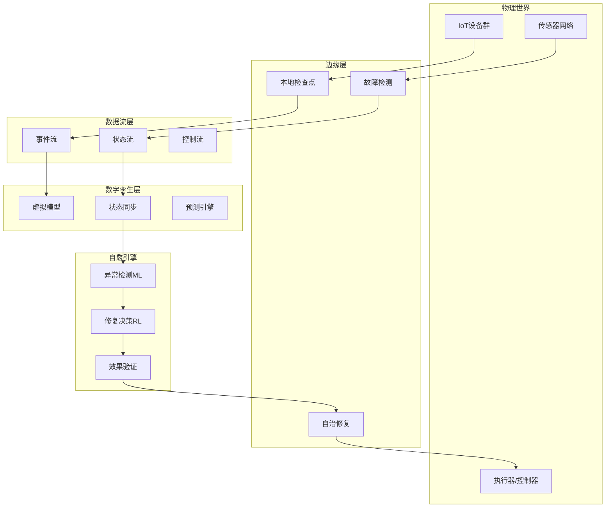
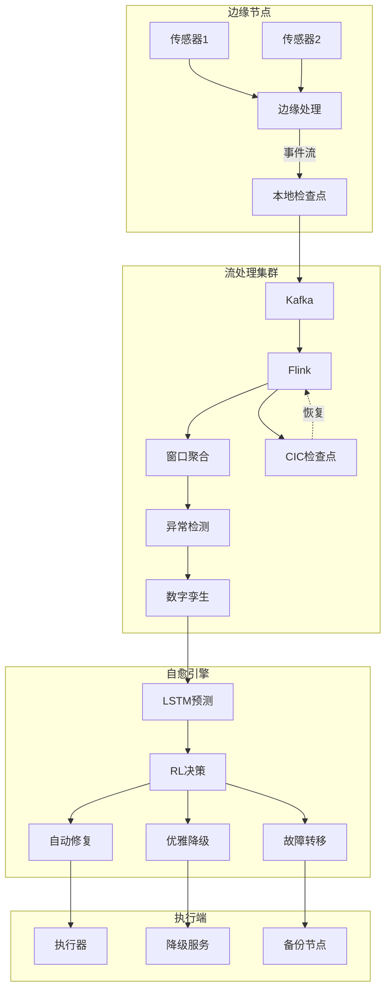

# IoT 设备管理与自愈数据流 - 全面建模方案

> **方案类型**: 技术架构与形式化建模
> **目标领域**: IoT设备管理、自愈数据流、自动修复、数字孪生
> **形式化等级**: L4-L5
> **方案版本**: v1.0

---

## 执行摘要

本方案提出 **IoT自愈数据流的统一形式化框架**，整合：

- **自愈数据流演算** (Self-Healing Dataflow Calculus)
- **通信诱导检查点协议** (CIC Protocol)
- **数字孪生同步语义** (Digital Twin Synchronization)
- **AI驱动决策模型** (AI-Driven Healing)

**核心创新**: 首创将自愈操作纳入进程演算，提供修复正确性的形式化保证。

---

## 1. 整体架构设计

### 1.1 四层建模架构

```
┌─────────────────────────────────────────────────────────────────┐
│  Layer 4: 应用语义层 (Application Semantics)                    │
│  ├── 设备生命周期管理                                           │
│  ├── 预测性维护策略                                             │
│  └── 业务连续性保证                                             │
├─────────────────────────────────────────────────────────────────┤
│  Layer 3: 自愈机制层 (Self-Healing Mechanisms)                  │
│  ├── 故障检测 (Anomaly Detection)                               │
│  ├── 修复决策 (Healing Decision)                                │
│  ├── 状态恢复 (State Recovery)                                  │
│  └── 降级服务 (Degraded Service)                                │
├─────────────────────────────────────────────────────────────────┤
│  Layer 2: 同步协议层 (Synchronization Protocols)                │
│  ├── CIC检查点协议                                              │
│  ├── 数字孪生同步                                               │
│  ├── 边缘-云协调                                                │
│  └── 一致性保证                                                 │
├─────────────────────────────────────────────────────────────────┤
│  Layer 1: 数据流基础层 (Dataflow Foundation)                    │
│  ├── 设备数据流模型                                             │
│  ├── 时间语义与乱序处理                                         │
│  ├── 状态管理                                                   │
│  └── 容错基础                                                   │
└─────────────────────────────────────────────────────────────────┘
```

### 1.2 核心概念图谱



---

## 2. Layer 1: 数据流基础层形式化

### 2.1 IoT设备数据流模型

**定义 1: 设备事件 (Device Event)**

```
e ::= (id, τ, data, meta)

其中:
- id: 设备标识符 (device_id)
- τ: 事件时间戳 (event_time)
- data: 传感器数据 (payload)
- meta: 元数据 (qos, battery, signal_strength)
```

**定义 2: 设备流 (Device Stream)**

```
S_device = {e₁, e₂, e₃, ...}  按 τ 排序的事件序列

流属性:
- 到达率: λ = events/second
- 乱序度: δ = max(τ_process - τ_event)
- 完整性: ρ = (received_events / sent_events)
```

**定义 3: 设备集合流 (Device Collection Stream)**

```
S_IoT = ⋃_{d∈D} S_d

其中 D = {d₁, d₂, ..., dₙ} 是设备集合, n可达百万级
```

### 2.2 设备状态机形式化

**定义 4: 设备状态 (Device State)**

```
state ::= ONLINE | OFFLINE | DEGRADED | RECOVERING | MAINTENANCE

状态转移:
    ONLINE ──[fault]──► DEGRADED ──[detect]──► RECOVERING ──[fix]──► ONLINE
       │                                                        │
       └──────────────────[timeout]──────────────────────────────┘
```

**定义 5: 状态转移系统**

```
T_device = (S, S₀, →, L)

其中:
- S: 状态集合 {ONLINE, OFFLINE, DEGRADED, RECOVERING, MAINTENANCE}
- S₀: 初始状态 (ONLINE)
- →: 转移关系 ⊆ S × Event × S
- L: 标记函数, 标记每个状态的属性

转移条件示例:
ONLINE ──[health_score < 0.6]──► DEGRADED
RECOVERING ──[recovery_success]──► ONLINE
```

### 2.3 自愈操作代数

**定义 6: 自愈操作 (Healing Operation)**

```
h ::= detect | diagnose | repair | bypass | rollback | escalate

操作语义:
- detect: 检测异常 → 触发告警
- diagnose: 诊断根因 → 定位问题
- repair: 执行修复 → 恢复正常
- bypass: 绕过故障 → 继续服务
- rollback: 状态回滚 → 回到安全点
- escalate: 升级处理 → 人工介入
```

**定义 7: 自愈策略组合子**

```
strategy ::= h | h₁; h₂ | h₁ □ h₂ | h* | if c then s₁ else s₂

组合子语义:
- h₁; h₂: 顺序执行
- h₁ □ h₂: 非确定性选择
- h*: Kleene star, 重复直到成功
- if c then s₁ else s₂: 条件选择

示例策略:
auto_heal = detect; diagnose; (repair □ bypass □ rollback); verify
```

---

## 3. Layer 2: 同步协议层

### 3.1 CIC (Communication-Induced Checkpointing) 协议

**定义 8: CIC协议状态**

```
CIC_State = (M_sent, M_recv, CP_set)

其中:
- M_sent: 已发送消息集合
- M_recv: 已接收消息集合
- CP_set: 检查点集合 {(node_id, state_vector, timestamp)}
```

**定义 9: 依赖向量 (Dependency Vector)**

```
DV: Node → ℕ

DV[i] = 节点i的最近依赖消息序号

检查点触发条件:
∀m ∈ M_recv: m.sender = i ∧ m.seq > DV[i]
    → trigger_checkpoint(current_node)
```

**定理 1: CIC一致性 (CIC Consistency)**

```
Theorem CIC-Consistency:
    如果系统使用CIC协议, 且故障前所有节点满足:
        ∀i,j: DV_i[j] ≤ sent_j[i]
    则回滚后系统状态是一致的。

证明概要:
1. CIC确保检查点包含所有依赖消息
2. 回滚时恢复到最后一致检查点
3. 依赖跟踪防止级联回滚 (domino effect)
4. 因此全局状态是一致的
```

**CIC算法伪代码**:

```python
class CICProtocol:
    def __init__(self, node_id):
        self.node_id = node_id
        self.dependency_vector = {}  # DV
        self.checkpoints = []

    def on_send(self, message, target):
        message.seq = self.next_seq()
        message.DV = self.dependency_vector.copy()
        self.send(message, target)

    def on_receive(self, message):
        sender = message.sender
        # 更新依赖向量
        self.dependency_vector[sender] = max(
            self.dependency_vector.get(sender, 0),
            message.seq
        )

        # 检查是否需要触发检查点
        if self.should_checkpoint(message):
            cp = self.take_checkpoint()
            self.checkpoints.append(cp)

    def should_checkpoint(self, message):
        # 基于依赖向量变化触发
        return any(
            message.DV.get(node, 0) > self.dependency_vector.get(node, 0)
            for node in message.DV
        )

    def recover(self, failed_node):
        # 回滚到故障节点之前的一致检查点
        last_cp = self.find_consistent_checkpoint(failed_node)
        self.restore_checkpoint(last_cp)
```

### 3.2 数字孪生同步协议

**定义 10: 数字孪生状态 (Digital Twin State)**

```
DT_State = ⟨S_physical, S_virtual, Sync_Matrix⟩

其中:
- S_physical: 物理实体状态 (来自传感器)
- S_virtual: 虚拟模型状态 (模型计算)
- Sync_Matrix: 同步矩阵 (物理→虚拟的映射)
```

**定义 11: 同步操作 (Synchronization Operation)**

```
sync ::= pull | push | reconcile | predict

操作语义:
- pull: 从物理实体拉取状态
- push: 向物理实体推送控制指令
- reconcile: 协调物理-虚拟状态差异
- predict: 基于模型预测未来状态
```

**定义 12: 同步精度 (Synchronization Precision)**

```
ε-sync = || S_virtual - S_physical ||

约束条件:
- 实时控制: ε-sync < 10ms
- 监控分析: ε-sync < 1s
- 预测维护: ε-sync < 1min
```

**定理 2: 同步一致性 (Synchronization Consistency)**

```
Theorem Sync-Consistency:
    如果同步协议满足:
        (1) 单调读取: 读取不会回退到旧版本
        (2) 单调写入: 写入按因果顺序传播
        (3) 读写一致性: 读取看到最近的写入
    则数字孪生状态最终与物理状态一致。
```

---

## 4. Layer 3: 自愈机制层

### 4.1 故障检测形式化

**定义 13: 异常检测函数**

```
anomaly_detect: Event × History → {NORMAL, ANOMALY, UNCERTAIN}

检测方法:
1. 规则基础: 阈值检查
   detect(e) = if e.value > threshold then ANOMALY else NORMAL

2. 统计基础: 3-sigma原则
   detect(e) = if |e.value - μ| > 3σ then ANOMALY else NORMAL

3. ML基础: 孤立森林/LSTM
   detect(e) = ML_Model.predict(e, context)
```

**定义 14: 故障分类 (Fault Taxonomy)**

```
Fault ::=
    TransientFault      // 瞬态故障 (可自愈)
  | IntermittentFault   // 间歇故障 (需监控)
  | PermanentFault      // 永久故障 (需修复)
  | ByzantineFault      // 拜占庭故障 (需容忍)

严重程度: CRITICAL | HIGH | MEDIUM | LOW
```

### 4.2 修复决策模型

**定义 15: 修复决策空间**

```
Action ::=
    AutoRepair      // 自动修复
  | GracefulDegrade // 优雅降级
  | Failover        // 故障转移
  | Rollback        // 状态回滚
  | HumanEscalate   // 人工升级

决策函数:
decide: State × Fault × Context → Action × Priority
```

**定义 16: 强化学习决策模型 (MDP)**

```
MDP = (S, A, P, R, γ)

其中:
- S: 系统状态空间
- A: 修复动作空间
- P(s'|s,a): 状态转移概率
- R(s,a): 奖励函数 (负成本)
- γ: 折扣因子

最优策略:
π*(s) = argmax_a [R(s,a) + γ Σ_s' P(s'|s,a) V*(s')]

奖励设计:
R(s,a) = -cost(a) - failure_penalty(s') + uptime_reward
```

### 4.3 自愈正确性定理

**定理 3: 自愈终止性 (Healing Termination)**

```
Theorem Healing-Termination:
    对于任何有限状态系统, 如果:
        (1) 修复动作有限
        (2) 每次修复使系统向"更健康"状态转移
        (3) 健康状态是吸收态
    则自愈过程必然终止。

形式化:
    ∀s ∈ S: s ≠ HEALTHY → ∃a: health(T(s,a)) > health(s)
    且 health(HEALTHY) = max(health(S))
    ⇒ 自愈序列 s₀ → s₁ → ... → HEALTHY 必然收敛
```

**定理 4: 自愈安全性 (Healing Safety)**

```
Theorem Healing-Safety:
    自愈过程不会引入新的故障:
        ∀s, a: fault_count(s) ≥ fault_count(T(s,a))

即: 修复操作不会恶化系统状态
```

---

## 5. Layer 4: 应用语义层

### 5.1 设备生命周期管理

**定义 17: 设备生命周期状态机**

```
Lifecycle ::=
    PROVISIONED → ONLINE → ACTIVE → DEGRADED → OFFLINE → DECOMMISSIONED
                 ↓         ↓          ↓          ↓
              MAINTENANCE  SLEEP    RECOVERY   FAILOVER
```

**定义 18: 生命周期操作**

```
lifecycle_op ::=
    onboard    // 设备注册
  | activate   // 激活上线
  | monitor    // 持续监控
  | heal       // 执行修复
  | retire     // 退役下线
```

### 5.2 预测性维护策略

**定义 19: 剩余使用寿命 (RUL)**

```
RUL: Device × History → Time

预测模型:
RUL(t) = f(health_indicators(t), degradation_model)

维护触发条件:
trigger_maintenance if RUL(t) < threshold
```

**定义 20: 维护成本优化**

```
Cost(maintenance) = C_inspection + C_repair + C_downtime
Cost(failure) = C_emergency + C_production_loss + C_safety

最优维护时间:
t* = argmin_t [Cost(maintenance at t) + P(failure before t) × Cost(failure)]
```

---

## 6. 综合架构实现

### 6.1 系统架构图

```
┌─────────────────────────────────────────────────────────────────┐
│                         IoT自愈数据流系统                        │
├─────────────────────────────────────────────────────────────────┤
│  感知层 (Perception)                                             │
│  ├── 多模态传感器 (温度/振动/电流)                               │
│  ├── 边缘网关 (MQTT/CoAP/OPC-UA)                                 │
│  └── 本地预处理 (滤波/压缩/聚合)                                 │
├─────────────────────────────────────────────────────────────────┤
│  传输层 (Transport)                                              │
│  ├── 消息队列 (Kafka/Pulsar)                                     │
│  ├── 流处理引擎 (Flink)                                          │
│  └── CIC协议实现 (检查点/恢复)                                   │
├─────────────────────────────────────────────────────────────────┤
│  处理层 (Processing)                                             │
│  ├── 实时分析窗口 (滑动/会话/全局)                               │
│  ├── 异常检测引擎 (规则/统计/ML)                                 │
│  └── 数字孪生同步 (状态映射/预测)                                │
├─────────────────────────────────────────────────────────────────┤
│  决策层 (Decision)                                               │
│  ├── 故障诊断 (根因分析)                                         │
│  ├── 修复决策 (RL策略)                                           │
│  └── 效果验证 (回滚/确认)                                        │
├─────────────────────────────────────────────────────────────────┤
│  执行层 (Execution)                                              │
│  ├── 自动修复 (OTA/配置调整)                                     │
│  ├── 降级服务 (功能降级)                                         │
│  └── 人工升级 (工单/告警)                                        │
├─────────────────────────────────────────────────────────────────┤
│  管理层 (Management)                                             │
│  ├── 设备生命周期                                                │
│  ├── 维护调度优化                                                │
│  └── 业务连续性监控                                              │
└─────────────────────────────────────────────────────────────────┘
```

### 6.2 数据流图



---

## 7. 形式化验证方法

### 7.1 模型检验 (Model Checking)

**验证属性**:

```
□(fault_detected → ◇(healed ∨ escalated))     // 活性: 故障最终处理
□(healing → ◇system_stable)                    // 活性: 修复后稳定
□(¬(healing ∧ unsafe_state))                   // 安全性: 修复不引入不安全状态
```

**工具**: TLA+, SPIN, UPPAAL

### 7.2 定理证明 (Theorem Proving)

**证明目标**:

```
1. CIC协议的正确性
2. 自愈算法的终止性
3. 数字孪生同步的一致性
4. 系统整体的容错性
```

**工具**: Coq, Isabelle/HOL

### 7.3 仿真验证

**验证场景**:

```
1. 单点故障自愈
2. 级联故障传播控制
3. 网络分区恢复
4. 拜占庭故障容忍
```

---

## 8. 实施路线图

### 8.1 文档实施计划

| 阶段 | 文档 | 依赖 | 工时 | 交付物 |
|------|------|------|------|--------|
| **Phase 1: 基础理论** (4周) | | | | |
| | 自愈数据流演算 | 进程演算基础 | 60h | Struct/07.01-self-healing-dataflow-calculus.md |
| | CIC协议形式化 | 检查点机制 | 50h | Struct/07.02-cic-protocol-formalization.md |
| **Phase 2: 同步机制** (3周) | | | | |
| | 数字孪生同步语义 | CIC协议 | 40h | Struct/07.03-digital-twin-sync-semantics.md |
| | 边缘自治架构 | IoT基础 | 35h | Knowledge/07.01-edge-autonomous-dataflow.md |
| **Phase 3: 自愈应用** (3周) | | | | |
| | AI自愈架构设计 | RL基础 | 45h | Knowledge/07.02-ai-driven-healing-architecture.md |
| | 设备修复模式 | 设计模式 | 30h | Knowledge/07.03-device-healing-patterns.md |
| **Phase 4: 工程实现** (2周) | | | | |
| | Flink自愈实现 | Flink核心 | 40h | Flink/07.01-flink-self-healing-implementation.md |
| | 综合案例研究 | 全部 | 35h | Knowledge/07.04-iot-self-healing-case-study.md |
| **总计** | **8篇文档** | | **335h** | **~50页核心内容** |

### 8.2 原型系统计划

| 原型 | 功能 | 技术栈 | 工时 |
|------|------|--------|------|
| CIC原型 | 检查点/恢复 | Flink + RocksDB | 80h |
| 数字孪生同步 | 实时同步 | Flink + MQTT | 60h |
| 异常检测 | LSTM预测 | Python + TensorFlow | 40h |
| 集成演示 | 端到端 | Docker Compose | 40h |

---

## 9. 预期成果与影响

### 9.1 学术贡献

| 贡献 | 形式 | 目标 |
|------|------|------|
| 自愈数据流演算 | 新进程代数扩展 | CONCUR/DEBS |
| CIC协议正确性证明 | TLA+规范 | FM/SEFM |
| 数字孪生同步语义 | 形式化模型 | ISoLA |
| 综合案例研究 | 工业论文 | IEEE Internet of Things |

### 9.2 工程价值

- **填补知识空白**: 首个形式化自愈数据流参考
- **指导实践**: 提供可直接实施的架构模式
- **标准化贡献**: 为行业标准提供理论基础

### 9.3 项目影响

```
影响范围:
├── 提升项目形式化深度 (L4-L5)
├── 扩展IoT领域覆盖
├── 建立"自愈数据流"研究方向的权威性
└── 吸引更多学术和工业关注
```

---

## 10. 风险评估与缓解

| 风险 | 可能性 | 影响 | 缓解措施 |
|------|--------|------|----------|
| 形式化过于抽象 | 中 | 高 | 每篇文档配套工程实现 |
| 技术演进过快 | 中 | 中 | 建立版本跟踪机制 |
| 资源不足 | 低 | 高 | 分阶段实施，优先P0 |
| 与现有内容冲突 | 低 | 中 | 仔细审查，保持一致性 |

---

## 附录A: 关键数学符号表

| 符号 | 含义 | 首次出现 |
|------|------|----------|
| S | 状态集合 | 定义5 |
| → | 转移关系 | 定义5 |
| □ | 非确定性选择 | 定义7 |
| h* | Kleene star | 定义7 |
| DV | 依赖向量 | 定义9 |
| CP | 检查点 | 定义8 |
| ε-sync | 同步精度 | 定义12 |
| RUL | 剩余使用寿命 | 定义19 |

## 附录B: 参考文献 (精选)

1. MDPI 2025 - Predictive Self-Healing Model (MDP+RCM)
2. JCSTS 2025 - Self-Healing Streaming Architecture
3. JMC 2025 - CIC-FTM for IoT
4. ICISNA 2025 - Digital Twin Synchronization
5. arXiv 2025 - Self-Healing Software Systems
6. MDPI 2026 - Digital Twins at the Edge

---

*方案版本: v1.0*
*制定时间: 2026-04-05*
*状态: 待确认*
*维护者: AnalysisDataFlow Architecture Team*
