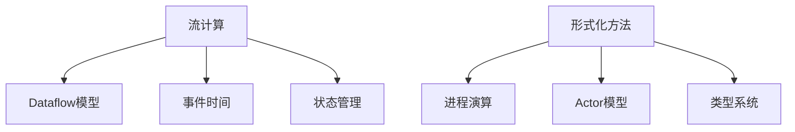

# AnalysisDataFlow 知识图谱数据指南

> **版本**: v2.1.0 | **更新日期**: 2026-04-12 | **状态**: Production

---

## 目录

- [概述](#概述)
- [数据文件结构](#数据文件结构)
- [数据结构说明](#数据结构说明)
  - [增强数据 (knowledge-graph-data-enhanced.json)](#增强数据-knowledge-graph-data-enhancedjson)
  - [定理网络数据 (knowledge-graph-theorems.json)](#定理网络数据-knowledge-graph-theoremsjson)
  - [前沿趋势数据 (knowledge-graph-frontier.json)](#前沿趋势数据-knowledge-graph-frontierjson)
- [图谱视图说明](#图谱视图说明)
- [更新流程](#更新流程)
- [扩展指南](#扩展指南)
- [API 参考](#api-参考)

---

## 概述

本指南描述 AnalysisDataFlow 知识图谱 v2.1 的数据结构和更新流程。知识图谱数据是项目的核心资产，包含以下三类数据文件：

| 文件 | 描述 | 大小 | 用途 |
|------|------|------|------|
| `knowledge-graph-data-enhanced.json` | 完整增强图谱数据 | ~500KB | 主图谱可视化 |
| `knowledge-graph-theorems.json` | 定理依赖网络 | ~400KB | 定理关系分析 |
| `knowledge-graph-frontier.json` | 前沿趋势数据 | ~3KB | 研究趋势跟踪 |

---

## 数据文件结构

```
.
├── knowledge-graph-data-enhanced.json    # 完整图谱数据
├── knowledge-graph-theorems.json         # 定理网络专用
├── knowledge-graph-frontier.json         # 前沿趋势数据
├── .scripts/kg-v2/
│   └── enhance-graph-data.py            # 数据生成脚本
└── .github/workflows/
    └── update-knowledge-graph.yml       # 自动更新工作流
```

---

## 数据结构说明

### 增强数据 (knowledge-graph-data-enhanced.json)

完整的知识图谱数据，包含所有节点、边和视图配置。

#### 元数据 (metadata)

```json
{
  "metadata": {
    "version": "2.1.0-enhanced",
    "generated_at": "2026-04-12T12:00:00Z",
    "generator": "enhance-graph-data.py",
    "stats": {
      "total_nodes": 765,
      "total_edges": 1496,
      "by_type": {
        "concept": 12,
        "theorem": 397,
        "definition": 316,
        "document": 34,
        "frontier": 6
      },
      "by_group": {
        "Struct": 245,
        "Knowledge": 198,
        "Flink": 352,
        "concept": 12,
        "frontier": 6
      }
    }
  }
}
```

#### 节点 (nodes)

节点表示图谱中的实体，支持以下类型：

| 类型 | 描述 | 颜色 | 大小范围 |
|------|------|------|----------|
| `document` | 文档目录 | 按阶段 | 10-30 |
| `theorem` | 定理 | #D9534F | 15 |
| `definition` | 定义 | #9B59B6 | 12 |
| `lemma` | 引理 | #17A2B8 | 10 |
| `proposition` | 命题 | #E83E8C | 11 |
| `corollary` | 推论 | #6C757D | 9 |
| `concept` | 概念 | #20B2AA | 15-25 |
| `frontier` | 前沿主题 | #FF6B6B | 20 |

节点数据结构：

```json
{
  "id": "Thm-S-01-01",
  "label": "Thm-S-01-01",
  "type": "theorem",
  "group": "Struct",
  "size": 15,
  "color": "#D9534F",
  "metadata": {
    "description": "定理描述...",
    "full_desc": "完整描述..."
  }
}
```

#### 边 (edges)

边表示节点间的关系：

| 类型 | 描述 | 样式 |
|------|------|------|
| `sequence` | 顺序关系 | 实线 |
| `dependency` | 依赖关系 | 虚线 |
| `citation` | 引用关系 | 实线(绿色) |
| `contains` | 包含关系 | 细线(灰色) |
| `related` | 相关关系 | 点线 |

边数据结构：

```json
{
  "source": "Thm-S-01-01",
  "target": "Thm-S-01-02",
  "type": "sequence",
  "weight": 1,
  "metadata": {
    "relation": "前置"
  }
}
```

#### 视图配置 (views)

预定义的图谱视图：

```json
{
  "views": {
    "concept_hierarchy": {
      "description": "概念层次结构视图",
      "node_filter": {"type": "concept"},
      "layout": "hierarchy"
    },
    "theorem_network": {
      "description": "定理依赖网络视图",
      "node_filter": {"types": ["theorem", "definition", "lemma"]},
      "layout": "force"
    },
    "document_network": {
      "description": "文档交叉引用网络视图",
      "node_filter": {"type": "document"},
      "layout": "cluster"
    },
    "frontier_trends": {
      "description": "学术前沿趋势视图",
      "node_filter": {"type": "frontier"},
      "layout": "circular"
    }
  }
}
```

---

### 定理网络数据 (knowledge-graph-theorems.json)

专用于定理依赖分析的精简数据。

#### 数据结构

```json
{
  "metadata": {
    "version": "2.1.0",
    "generated_at": "2026-04-12T12:00:00Z",
    "total_theorems": 474,
    "total_definitions": 500,
    "total_lemmas": 441
  },
  "nodes": [
    {
      "id": "Thm-S-01-01",
      "label": "Thm-S-01-01",
      "description": "定理描述",
      "stage": "Struct",
      "type": "theorem"
    }
  ],
  "edges": [...],
  "by_stage": {
    "Struct": [...],
    "Knowledge": [...],
    "Flink": [...]
  },
  "proof_chains": [
    ["Thm-S-01-01", "Thm-S-01-02", "Thm-S-01-03"]
  ]
}
```

---

### 前沿趋势数据 (knowledge-graph-frontier.json)

学术研究前沿和趋势跟踪数据。

#### 数据结构

```json
{
  "metadata": {
    "version": "2.1.0",
    "generated_at": "2026-04-12T12:00:00Z",
    "year": 2024
  },
  "topics": [
    {
      "id": "frontier_ai_streaming",
      "label": "AI流处理",
      "year": 2024,
      "trend": "rising",
      "keywords": ["FLIP-531", "实时推理", "模型服务"]
    }
  ],
  "trends": [
    {
      "year": 2024,
      "hot_topics": ["AI流处理", "Rust流系统"],
      "emerging": ["多模态流", "神经符号推理"]
    }
  ],
  "research_directions": [
    {
      "direction": "AI驱动的流处理",
      "papers": 45,
      "growth": "+120%",
      "key_venues": ["VLDB", "SIGMOD", "OSDI"]
    }
  ]
}
```

---

## 图谱视图说明

### 1. 概念层次结构视图 (Concept Hierarchy)

展示核心概念之间的层次关系。



**用途**: 帮助用户理解领域知识结构

### 2. 定理依赖网络视图 (Theorem Network)

展示定理、定义、引理之间的依赖关系。

**特性**:
- 节点按阶段着色 (Struct/知识/Flink)
- 边表示证明依赖
- 支持按类型筛选

**用途**: 形式化验证路径规划

### 3. 文档交叉引用网络视图 (Document Network)

展示文档之间的引用关系。

**特性**:
- 节点大小表示文档数量
- 边表示跨目录引用
- 聚类布局按阶段分组

**用途**: 导航和发现相关内容

### 4. 学术前沿趋势视图 (Frontier Trends)

展示研究热点和趋势。

**特性**:
- 环形布局
- 颜色表示发展趋势
- 关键词标签

**用途**: 研究趋势跟踪

---

## 更新流程

### 手动更新

```bash
# 1. 运行数据增强脚本
cd e:\_src\AnalysisDataFlow
python .scripts/kg-v2/enhance-graph-data.py

# 2. 验证生成的文件
ls -lh knowledge-graph-*.json

# 3. 提交更新
git add knowledge-graph-*.json
git commit -m "chore: update knowledge graph data"
git push
```

### 自动更新 (GitHub Actions)

工作流会在以下情况自动触发：

1. **推送更新**: 当 `Struct/`, `Knowledge/`, `Flink/` 目录下的文档更新时
2. **定时更新**: 每周日凌晨 2:00 (UTC)
3. **手动触发**: 通过 GitHub UI 手动运行

更新流程：

```
文档更新 → 触发工作流 → 运行增强脚本 → 生成新数据 → 创建 PR → 合并
```

---

## 扩展指南

### 添加新的节点类型

1. **修改脚本** (`.scripts/kg-v2/enhance-graph-data.py`):

```python
# 在 COLORS 中添加新类型颜色
COLORS = {
    # ... 现有颜色
    "new_type": "#FF0000"
}

# 在 build_xxx_network 方法中添加节点创建
node = Node(
    id="new_node_1",
    label="新节点",
    type="new_type",
    group="new_group",
    size=15,
    color=COLORS["new_type"]
)
```

2. **更新数据文档**: 在本文档中添加新类型的说明

3. **更新可视化**: 在 HTML 文件中添加对应的渲染逻辑

### 添加新的视图

1. **在 enhance-graph-data.py 中添加视图配置**:

```python
"views": {
    # ... 现有视图
    "new_view": {
        "description": "新视图描述",
        "node_filter": {"type": "new_type"},
        "layout": "force"
    }
}
```

2. **在 knowledge-graph-v2.html 中添加视图切换**:

```javascript
case 'new_view':
    renderNewView();
    break;
```

### 集成外部数据源

支持从外部 API 或数据库集成数据：

```python
def fetch_external_data(self) -> List[Dict]:
    """获取外部数据"""
    # 实现数据获取逻辑
    external_data = requests.get("https://api.example.com/data").json()
    return external_data
```

---

## API 参考

### GraphDataEnhancer 类

主要的数据增强器类。

#### 方法

| 方法 | 描述 | 返回值 |
|------|------|--------|
| `parse_theorem_registry()` | 解析定理注册表 | Dict |
| `scan_documents()` | 扫描文档目录 | List[Dict] |
| `build_concept_hierarchy()` | 构建概念层次 | Tuple[List[Node], List[Edge]] |
| `build_theorem_network()` | 构建定理网络 | Tuple[List[Node], List[Edge]] |
| `build_document_network()` | 构建文档网络 | Tuple[List[Node], List[Edge]] |
| `build_frontier_data()` | 构建前沿数据 | Tuple[List[Node], List[Edge]] |
| `generate_enhanced_data()` | 生成完整数据 | Dict |
| `save_all()` | 保存所有文件 | Dict[str, str] |

#### 数据类

**Node**: 图谱节点
- `id`: 唯一标识
- `label`: 显示标签
- `type`: 节点类型
- `group`: 所属分组
- `size`: 节点大小
- `color`: 节点颜色
- `metadata`: 附加元数据

**Edge**: 图谱边
- `source`: 源节点ID
- `target`: 目标节点ID
- `type`: 边类型
- `weight`: 权重
- `metadata`: 附加元数据

---

## 故障排除

### 常见问题

**Q: 数据文件生成失败**

检查：
1. THEOREM-REGISTRY.md 是否存在
2. 文档目录结构是否正确
3. Python 依赖是否安装

**Q: 节点数量不正确**

可能原因：
- 定理注册表格式变更
- 文档目录结构调整
- 正则表达式需要更新

**Q: 可视化不显示数据**

检查：
1. JSON 文件路径是否正确
2. 数据格式是否有效
3. 浏览器控制台错误信息

---

## 参考

- [知识图谱 v2.0 架构指南](./KNOWLEDGE-GRAPH-V2-GUIDE.md)
- [定理注册表](./THEOREM-REGISTRY.md)
- [项目结构](./ARCHITECTURE.md)

---

*本指南由知识图谱数据增强系统自动生成*
