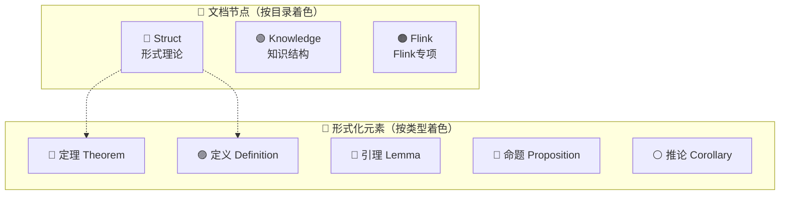
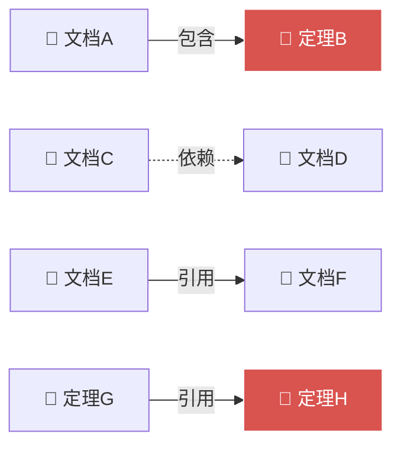

# AnalysisDataFlow 知识图谱使用指南

> **版本**: v1.0 | **更新日期**: 2026-04-03 | **状态**: 可用

---

## 目录

- [概述](#概述)
- [快速开始](#快速开始)
- [生成图谱数据](#生成图谱数据)
- [打开可视化页面](#打开可视化页面)
- [图谱解读](#图谱解读)
- [分析知识关联](#分析知识关联)
- [故障排除](#故障排除)

---

## 概述

AnalysisDataFlow 知识图谱是一个交互式可视化工具，帮助您：

- 🔍 **探索知识结构** - 浏览 200+ 文档、800+ 形式化元素的关系网络
- 📊 **发现知识热点** - 识别被引用最多的核心文档和定理
- 🎯 **定位知识孤岛** - 发现未被引用的独立文档
- 🔗 **追踪知识流转** - 理解 Struct/Knowledge/Flink 三大目录间的关联

### 图谱组件

| 组件 | 描述 | 文件 |
|------|------|------|
| 构建脚本 | Python脚本，解析文档生成图谱数据 | `.vscode/build-knowledge-graph.py` |
| 图谱数据 | GraphJSON格式，包含节点和边 | `.vscode/graph-data.json` |
| 可视化页面 | 交互式HTML页面，使用D3.js | `knowledge-graph.html` |
| 使用指南 | 本文档 | `KNOWLEDGE-GRAPH-GUIDE.md` |

---

## 快速开始

### 1. 生成图谱数据

```bash
# 在项目根目录运行
python .vscode/build-knowledge-graph.py

# 带统计信息输出
python .vscode/build-knowledge-graph.py --stats

# 指定输出路径
python .vscode/build-knowledge-graph.py --output ./my-graph.json
```

### 2. 打开可视化页面

**方式一：直接打开**

```bash
# macOS
open knowledge-graph.html

# Windows
start knowledge-graph.html

# Linux
xdg-open knowledge-graph.html
```

**方式二：使用VS Code Live Server**

1. 安装 VS Code 插件 "Live Server"
2. 右键 `knowledge-graph.html` → "Open with Live Server"
3. 浏览器自动打开 `http://127.0.0.1:5500/knowledge-graph.html`

**方式三：使用Python简单HTTP服务器**

```bash
# Python 3
python -m http.server 8000

# 然后访问 http://localhost:8000/knowledge-graph.html
```

---

## 生成图谱数据

### 构建脚本功能

`.vscode/build-knowledge-graph.py` 脚本执行以下任务：

```
┌─────────────────────────────────────────────────────────┐
│                    知识图谱构建流程                       │
├─────────────────────────────────────────────────────────┤
│ 1. 文档解析                                              │
│    ├── 扫描 Struct/, Knowledge/, Flink/ 目录            │
│    ├── 提取文档元数据（标题、类型、形式化等级）          │
│    └── 统计文档规模（字数、定理数量等）                  │
├─────────────────────────────────────────────────────────┤
│ 2. 形式化元素提取                                        │
│    ├── 定理 (Thm-*)：Thm-S-01-01, Thm-F-02-01          │
│    ├── 定义 (Def-*)：Def-S-01-01, Def-K-01-01          │
│    ├── 引理 (Lemma-*)：Lemma-S-01-01                   │
│    ├── 命题 (Prop-*)：Prop-S-02-01                     │
│    └── 推论 (Cor-*)：Cor-S-04-01                       │
├─────────────────────────────────────────────────────────┤
│ 3. 关系提取                                              │
│    ├── 包含关系：文档 → 定理/定义                        │
│    ├── 依赖关系：文档 → 前置依赖文档                     │
│    ├── 引用关系：文档 → 引用的定理                       │
│    └── 交叉引用：定理 → 引用的其他定理                   │
├─────────────────────────────────────────────────────────┤
│ 4. 图谱分析                                              │
│    ├── 计算节点度中心性（识别热门文档）                  │
│    ├── 检测孤立节点（未被引用的文档）                    │
│    └── 分析连通分量（发现知识孤岛）                      │
├─────────────────────────────────────────────────────────┤
│ 5. 输出GraphJSON                                         │
│    └── .vscode/graph-data.json                           │
└─────────────────────────────────────────────────────────┘
```

### 图谱数据结构

生成的 `graph-data.json` 包含以下结构：

```json
{
  "nodes": [
    {
      "id": "Struct/01.01-unified-streaming-theory",
      "label": "USTM统一流计算理论",
      "type": "document",
      "group": "Struct",
      "size": 25,
      "color": "#4A90D9",
      "metadata": {
        "path": "Struct/01-foundation/01.01-unified-streaming-theory.md",
        "formality_level": "L5",
        "category": "01-foundation",
        "word_count": 4500
      }
    },
    {
      "id": "Thm-S-01-01",
      "label": "Thm-S-01-01",
      "type": "theorem",
      "group": "theorem",
      "size": 8,
      "color": "#D9534F",
      "metadata": {
        "description": "流计算统一理论存在性定理",
        "document": "Struct/01.01-unified-streaming-theory",
        "stage": "S"
      }
    }
  ],
  "edges": [
    {
      "source": "Struct/01.01-unified-streaming-theory",
      "target": "Thm-S-01-01",
      "type": "contains",
      "weight": 1
    }
  ],
  "stats": {
    "total_nodes": 100,
    "total_edges": 150,
    "isolated_documents": 5,
    "hot_documents": [...]
  }
}
```

### 节点类型

| 类型 | 说明 | 颜色 |
|------|------|------|
| `document` | Markdown文档 | 按目录着色 |
| `theorem` | 定理 | 🔴 红色 |
| `definition` | 定义 | 🟣 紫色 |
| `lemma` | 引理 | 🔵 青色 |
| `proposition` | 命题 | 🩷 粉色 |
| `corollary` | 推论 | ⚪ 灰色 |

### 边类型

| 类型 | 说明 | 样式 |
|------|------|------|
| `contains` | 文档包含定理/定义 | 灰色细线 |
| `depends_on` | 文档依赖其他文档 | 🟠 橙色虚线 |
| `citation` | 文档引用其他文档 | 🟢 绿色实线 |
| `references` | 引用定理/定义 | 蓝色实线 |

---

## 打开可视化页面

### 界面布局

```
┌─────────────────────────────────────────────────────────────────┐
│  🔮 知识图谱                    [+] [−] [⊡] [↺]                  │
│  AnalysisDataFlow 项目知识可视化                                 │
├──────────┬──────────────────────────────────────────────────────┤
│          │                                                      │
│  布局模式 │                    知识图谱                          │
│  [力导向 ▼]│                   ╭──────╮                           │
│          │                  ╱   📄   ╲                          │
│  搜索节点 │    ╭──────╮─────│Struct  │─────╭──────╮              │
│  [______]│    │  📄   │     ╰──┬───╯     │  📄  │              │
│          │    │Flink  │        │         │Knowledge           │
│  显示类型 │    └───┬───┘        │         └──┬───┘              │
│  ☑ 文档   │        │       ╭────┴────╮       │                  │
│  ☑ 定理   │        └──────│   📄     │───────┘                  │
│  ☑ 定义   │               │Theorem   │                          │
│          │               ╰───────────╯                          │
│  ────────┤                                                      │
│  文档目录 │       节点: 100  边: 150  文档: 50                   │
│  🔵 Struct│       定理: 30   孤立: 5                             │
│  🟢 Knowl.│                                                      │
│  🟠 Flink │                                                      │
│          │                                                      │
│  ────────┤                                                      │
│  选中节点 │                                                      │
│  详情     │                                                      │
│          │                                                      │
│  标题     │                                                      │
│  USTM...  │                                                      │
│          │                                                      │
│  类型     │                                                      │
│  document │                                                      │
│          │                                                      │
│  被引用(3)│                                                      │
│  ← Flink  │                                                      │
│  ← Knowl. │                                                      │
│          │                                                      │
└──────────┴──────────────────────────────────────────────────────┘
```

### 交互操作

| 操作 | 说明 |
|------|------|
| **拖拽节点** | 调整节点位置 |
| **滚轮缩放** | 放大/缩小视图 |
| **点击节点** | 选中并显示详情，高亮关联节点 |
| **点击空白** | 取消选择，恢复默认视图 |
| **悬浮节点** | 显示工具提示 |

### 工具栏按钮

| 按钮 | 功能 |
|------|------|
| `+` | 放大 |
| `−` | 缩小 |
| `⊡` | 适应窗口（自动缩放以显示全部节点） |
| `↺` | 重置视图 |

### 布局模式

| 模式 | 适用场景 |
|------|----------|
| **力导向布局** | 默认模式，自动排列，适合探索整体结构 |
| **层次布局** | 按目录分组，适合查看层级关系 |
| **环形布局** | 文档围绕中心，适合对比不同目录 |

---

## 图谱解读

### 1. 颜色识别



### 2. 关系识别



| 视觉特征 | 含义 |
|----------|------|
| 实线 | 引用/包含关系 |
| 虚线 | 依赖关系 |
| 线粗细 | 关系强度（引用次数） |
| 节点大小 | 文档规模/重要性 |

### 3. 热门文档识别

**热门文档特征：**

- 节点较大（被引用次数多）
- 入度边较多（箭头指向该节点）
- 通常是核心理论文档或基础概念文档

**示例热门文档：**

| 排名 | 文档 | 被引用数 | 说明 |
|------|------|----------|------|
| 1 | `Struct/01.01-unified-streaming-theory` | 15 | USTM统一理论，被大量性质和证明文档引用 |
| 2 | `Struct/01.04-dataflow-model-formalization` | 12 | Dataflow模型，Flink实现的基础 |
| 3 | `Struct/02.02-consistency-hierarchy` | 10 | 一致性层次，Checkpoint正确性证明的依赖 |

### 4. 知识孤岛识别

**知识孤岛特征：**

- 孤立节点（无任何连线）
- 仅含出边（只引用别人，不被引用）
- 远离图谱中心

**处理建议：**

1. 检查是否为独立教程/概述文档（正常）
2. 检查是否应该被其他文档引用（需建立链接）
3. 检查是否为过时内容（考虑归档）

---

## 分析知识关联

### 场景1：追踪理论到实践的映射

**问题**：某个形式化定理在Flink中如何体现？

**操作步骤**：

1. 搜索定理节点（如 `Thm-S-04-01`）
2. 查看其父文档（`Struct/04.01-flink-checkpoint-correctness`）
3. 追踪引用该文档的Flink文档
4. 发现知识流转路径：

```
Thm-S-04-01 (定理)
    ↓ contains
Struct/04.01-flink-checkpoint-correctness (形式证明)
    ↓ citation
Flink/02-checkpoint-mechanism (机制实现)
    ↓ dependency
Flink/04-connectors (连接器实践)
```

### 场景2：发现知识缺口

**问题**：某个领域是否缺少文档覆盖？

**操作步骤**：

1. 切换到"层次布局"
2. 检查各目录的节点密度
3. 发现稀疏区域即为知识缺口

### 场景3：规划阅读路径

**问题**：如何系统学习流计算一致性？

**操作步骤**：

1. 搜索"一致性"相关文档
2. 按依赖关系排序（拓扑排序）
3. 生成学习路径：

```
Struct/01.01-unified-streaming-theory (基础)
    ↓
Struct/01.04-dataflow-model-formalization (模型)
    ↓
Struct/02.01-determinism-in-streaming (确定性)
    ↓
Struct/02.02-consistency-hierarchy (一致性层次)
    ↓
Struct/04.01-flink-checkpoint-correctness (正确性证明)
    ↓
Flink/02-checkpoint-mechanism (Flink实现)
```

### 场景4：验证文档完整性

**问题**：新添加的文档是否正确链接到现有知识网络？

**操作步骤**：

1. 重新生成图谱数据
2. 搜索新文档节点
3. 检查其依赖和引用关系
4. 确保无孤立节点（除非是故意的）

---

## 故障排除

### 问题1：页面显示"暂无数据"

**原因**：`graph-data.json` 文件不存在

**解决**：

```bash
python .vscode/build-knowledge-graph.py
```

### 问题2：图谱加载缓慢

**原因**：节点/边数量过多（>1000）

**解决**：

1. 在可视化页面筛选显示类型（取消勾选"定理"或"定义"）
2. 修改脚本增加采样逻辑
3. 使用更强大的浏览器

### 问题3：节点重叠严重

**解决**：

1. 切换到"层次布局"或"环形布局"
2. 手动拖拽调整节点位置
3. 使用缩放功能聚焦局部区域

### 问题4：搜索不到节点

**检查**：

1. 确认搜索词与节点标签匹配（不区分大小写）
2. 检查节点类型是否被筛选隐藏
3. 重新生成图谱数据确保包含最新文档

### 问题5：Python脚本报错

**常见错误及解决**：

```bash
# 错误：ModuleNotFoundError
# 解决：无需安装额外依赖，使用Python标准库

# 错误：Permission denied
# 解决：检查文件权限
chmod +x .vscode/build-knowledge-graph.py

# 错误：编码错误
# 解决：确保文档为UTF-8编码
file -i Struct/*.md
```

---

## 进阶使用

### 自定义图谱样式

编辑 `knowledge-graph.html` 中的CSS变量：

```css
:root {
    --color-struct: #4A90D9;
    --color-knowledge: #5CB85C;
    --color-flink: #F0AD4E;
    --color-theorem: #D9534F;
    /* ... */
}
```

### 导出图谱图像

1. 调整视图到理想状态
2. 使用浏览器开发者工具 → 截图
3. 或使用SVG导出功能（需额外脚本）

### 集成到其他工具

GraphJSON格式兼容多种可视化工具：

- **Gephi**：导入JSON后使用力导向布局
- **Cytoscape**：直接加载JSON数据
- **Neo4j**：转换为Cypher语句导入图数据库

---

## 参考

- [D3.js Documentation](https://d3js.org/)
- [Graph Visualization](https://www.cs.mun.ca/~hamed/teaching/Graph_Visualization.html)
- [AnalysisDataFlow 项目文档](../README.md)

---

*本指南由知识图谱构建工具自动生成，如有问题请反馈。*
