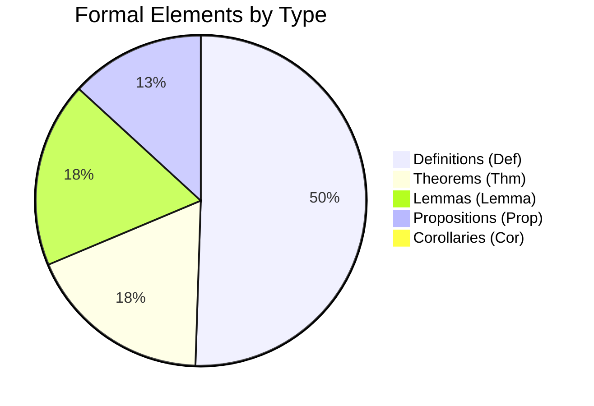

# Concept-Document-Code Triple Mapping Index

> **Version**: 1.0 | **Generated**: 2026-04-20 | **Part of v4.9 F3 Task**

---

## Overview

This index establishes a three-way mapping between:

- **Concepts** (formal definitions, theorems, lemmas)
- **Documents** (Markdown files across Struct/Knowledge/Flink)
- **Code Examples** (executable snippets in Java/Python/SQL/Scala/etc.)

---

## Statistics

| Metric | Count |
|--------|-------|
| **Total Files Scanned** | 870 |
| **Total Concepts Extracted** | 2,150 |
| **Total Code Examples** | 4,219 |
| **Coverage Directories** | Struct/, Knowledge/, Flink/ |

### Concept Type Distribution



### Code Example Language Distribution

| Language | Estimated Count | Primary Use |
|----------|----------------|-------------|
| Java | ~1,800 | Flink DataStream API |
| Python | ~800 | PyFlink, analytics |
| SQL | ~600 | Flink SQL, Table API |
| Scala | ~400 | Flink Scala API |
| YAML | ~300 | K8s deployment configs |
| XML | ~200 | Maven, log4j configs |
| Go/Rust | ~100 | Edge/IoT examples |

---

## Data Structure

### Concept Entry

```json
{
  "type": "Def",
  "id": "Def-S-01-01",
  "title": "Process Calculus",
  "line": 42,
  "documents": ["Struct/01-foundation/01.01-process-calculus.md"],
  "code_examples": [
    {"language": "java", "summary": "public class Process {...}", "document": "..."}
  ]
}
```

### Document Entry

```json
{
  "title": "Stream Join Patterns",
  "concepts": ["Def-K-02-01", "Thm-K-02-01", "Lemma-K-02-01"],
  "code_example_count": 12,
  "code_examples": [
    {"language": "java", "line_count": 25, "summary": "...", "line": 156}
  ]
}
```

### Global Code Example

```json
{
  "language": "java",
  "line_count": 45,
  "summary": "KeyedProcessFunction implementation",
  "line": 234,
  "document": "Flink/03-api/flink-datastream-api-guide.md"
}
```

---

## Sample Queries

### Find all documents about "Exactly-Once"

```python
import json
with open('concept-doc-code-mapping.json') as f:
    data = json.load(f)

# Find concepts matching "exactly-once"
for cid, c in data['concepts'].items():
    if 'exactly' in c['title'].lower() and 'once' in c['title'].lower():
        print(f"{cid}: {c['title']}")
        print(f"  Documents: {c['documents']}")
```

### Find all Java code examples about Checkpoints

```python
for ex in data['code_examples']:
    if ex['language'] == 'java' and 'checkpoint' in ex['summary'].lower():
        print(f"{ex['document']}:{ex['line']} -> {ex['summary']}")
```

### Cross-reference: Which concepts have both formal proof AND code?

```python
for cid, c in data['concepts'].items():
    if c['type'] == 'Thm' and len(c['code_examples']) > 0:
        print(f"{cid}: {c['title']} ({len(c['code_examples'])} code examples)")
```

---

## Usage in Knowledge Graph

This mapping feeds into the broader Knowledge Graph visualization:

1. **Concept Network**: Nodes = concepts, Edges = co-occurrence in documents
2. **Document Clustering**: Group by shared concepts
3. **Code Recommendation**: Given a concept, suggest relevant code examples
4. **Learning Path Generation**: Traverse concept dependencies to build curricula

---

## Files

| File | Description |
|------|-------------|
| `concept-doc-code-mapping.json` | Machine-readable full index (1.2MB) |
| `MAPPING-INDEX-README.md` | This documentation |

---

## Future Enhancements (v2.0)

- [ ] Add cross-document reference graph
- [ ] Extract parameter types from code examples
- [ ] Link concepts to external ontologies (DBpedia, Wikidata)
- [ ] Add semantic similarity between concepts (word embeddings)
- [ ] Generate automated learning path recommendations

---

*Generated by AnalysisDataFlow v4.9 | Task F3*
