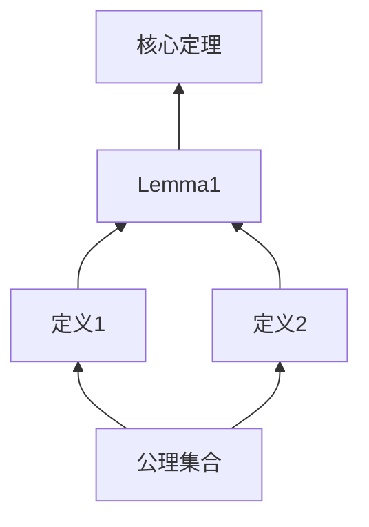
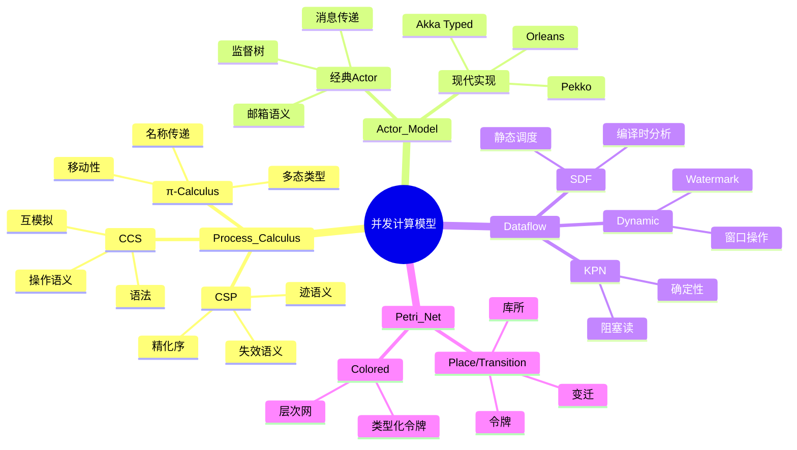
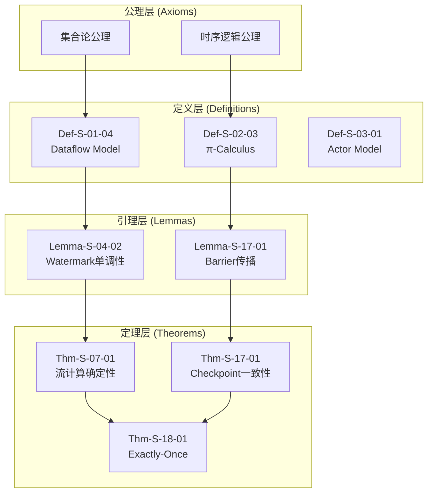
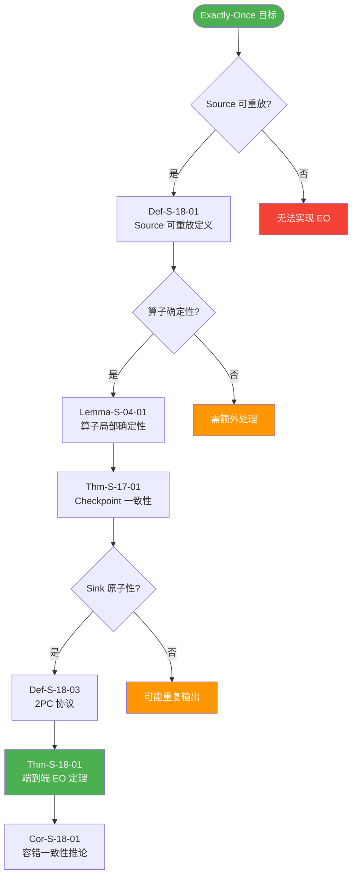
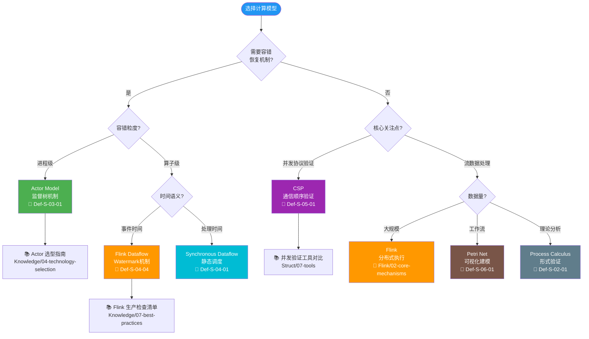
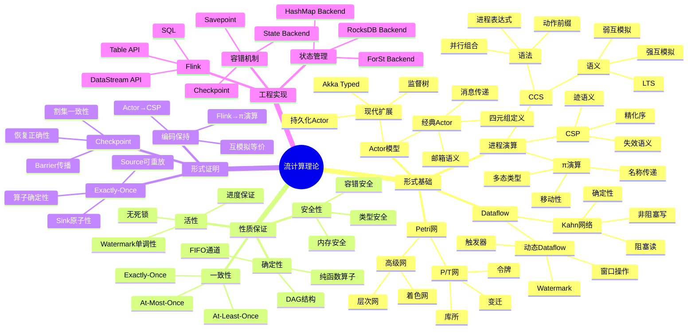
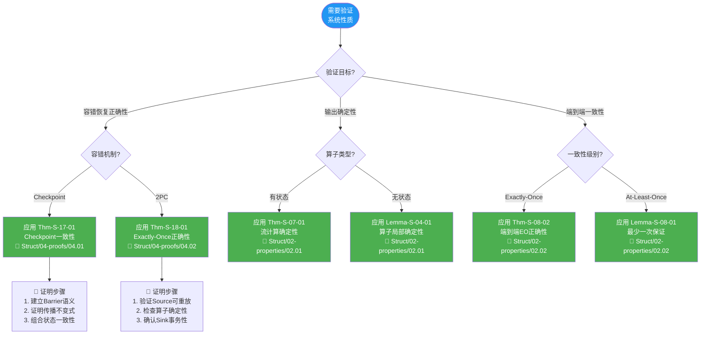
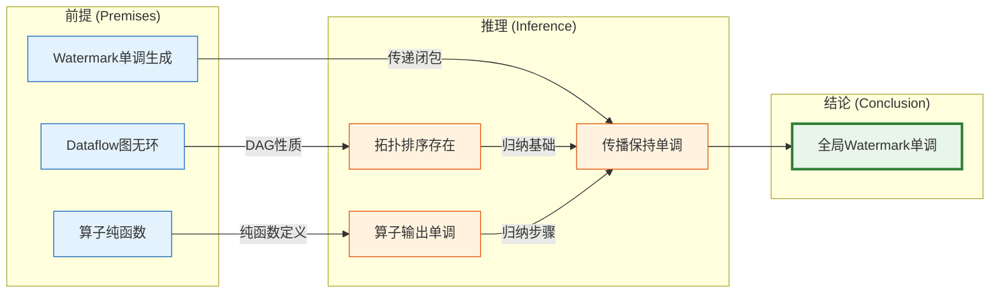

# AnalysisDataFlow 知识关系全面梳理重构计划

> **版本**: v1.0 | **日期**: 2026-04-11 | **状态**: 待确认 | **预计工期**: 4-6 周

---

## 执行摘要

本计划旨在全面重构 AnalysisDataFlow 项目的知识关系体系，解决当前**层次间模型映射模糊**、**模型内理论架构不清**、**定理公设推导链断裂**等核心问题。
通过建立**五维关系模型**，实现从形式理论到工程实践的完整可追溯性。

---

## 一、现状诊断：核心问题识别

### 1.1 问题分类矩阵

| 问题层级 | 具体表现 | 影响程度 | 现有覆盖度 |
|---------|---------|---------|-----------|
| **层次间关系** | Struct→Knowledge→Flink 映射缺乏系统性推导依据 | 🔴 高 | 60% |
| **模型内架构** | 进程演算/Dataflow/Actor/CSP 内部概念层次不清晰 | 🔴 高 | 55% |
| **定理推导链** | 10,483形式化元素间依赖关系未可视化 | 🔴 高 | 40% |
| **公理-定理网络** | 基础公设到导出定理的推理路径断裂 | 🟡 中 | 45% |
| **多维可视化** | 缺乏对比矩阵、决策树、判定树等多元视图 | 🟡 中 | 50% |

### 1.2 具体缺陷示例

#### 缺陷1: 层次映射断层

```
现状: Def-S-01-04 (Dataflow定义) → pattern-event-time-processing (模式)
      ↓
问题: 缺少中间推导步骤，无法回答"为什么Dataflow模型支持事件时间？"

应有: Def-S-01-04 → Lemma-S-04-02 (时间语义保持) → Prop-S-09-01 (单调性) → Pattern
```

#### 缺陷2: 定理证明链断裂

```
现状: Thm-S-17-01 (Checkpoint一致性) 依赖元素标注为 "Def-S-01-04, Lemma-S-02-04"
      ↓
问题: 未展示完整的演绎推理路径，读者无法复现证明过程

应有: 完整的演绎树，每一步引用明确的推理规则
```

#### 缺陷3: 缺乏对比视角

```
现状: Actor vs CSP 对比分散在多篇文章
      ↓
问题: 没有统一的决策矩阵帮助读者选择模型

应有: 多维对比矩阵 + 决策树 + 场景映射表
```

---

## 二、解决方案：五维关系模型

### 2.1 五维关系架构

```
┌─────────────────────────────────────────────────────────────────────────────┐
│                    五维知识关系模型 (5D-KRM)                                 │
├─────────────────────────────────────────────────────────────────────────────┤
│                                                                             │
│  维度1: 垂直层次关系 (Vertical Hierarchy)                                    │
│  ┌──────────┐      ┌──────────┐      ┌──────────┐                          │
│  │  Struct  │ ───→ │ Knowledge│ ───→ │  Flink   │                          │
│  │ 形式理论 │ 实例化│ 知识结构 │ 编码  │ 工程实现 │                          │
│  └──────────┘      └──────────┘      └──────────┘                          │
│                                                                             │
│  维度2: 水平推导关系 (Horizontal Derivation)                                 │
│  Foundation → Properties → Relationships → Proofs                          │
│  (基础定义)   (性质推导)    (关系建立)      (形式证明)                        │
│                                                                             │
│  维度3: 模型内层次 (Intra-Model Hierarchy)                                   │
│  ┌─────────────┐  ┌─────────────┐  ┌─────────────┐  ┌─────────────┐         │
│  │Process      │  │   Actor     │  │  Dataflow   │  │     CSP     │         │
│  │Calculus     │  │   Model     │  │   Model     │  │             │         │
│  ├─────────────┤  ├─────────────┤  ├─────────────┤  ├─────────────┤         │
│  │· Syntax     │  │· Actor      │  │· Graph      │  │· Process    │         │
│  │· Semantics  │  │· Message    │  │· Operator   │  │· Event      │         │
│  │· Bisimulation│ │· Mailbox    │  │· Window     │  │· Channel    │         │
│  └─────────────┘  └─────────────┘  └─────────────┘  └─────────────┘         │
│                                                                             │
│  维度4: 形式化依赖网 (Formal Dependency Network)                             │
│  Axiom → Definition → Lemma → Proposition → Theorem → Corollary            │
│  (公理)    (定义)     (引理)    (命题)       (定理)     (推论)               │
│                                                                             │
│  维度5: 跨维度映射 (Cross-Dimensional Mapping)                               │
│  理论概念 ⟷ 工程模式 ⟷ 代码实现 ⟷ 验证测试                                    │
│                                                                             │
└─────────────────────────────────────────────────────────────────────────────┘
```

### 2.2 关系类型完备集

| 关系类型 | 符号 | 数学定义 | 可视化样式 | 示例 |
|---------|------|---------|-----------|------|
| **定义于** | `:=` | $A \text{ is-defined-by } B$ | 实线箭头 | Def-S-04-01 := Dataflow图定义 |
| **导出** | `⇒` | $B \Rightarrow A$ (逻辑蕴含) | 粗实线箭头 | Thm-S-07-01 ⇒ 确定性定理 |
| **细化** | `⊑` | $A \sqsubseteq B$ (精化关系) | 虚线箭头 | Watermark语义 ⊑ Dataflow模型 |
| **编码为** | `` | $\llbracket A \rrbracket = B$ | 双线箭头 | Actor  CSP进程 |
| **依赖** | `→` | $A \rightarrow B$ (DAG边) | 点线箭头 | Checkpoint正确性 → Watermark单调性 |
| **等价** | `≡` | $A \equiv B$ | 双向箭头 | 强互模拟 ~ ≡ 迹等价 |
| **互斥** | `⊥` | $A \perp B$ | 红色叉线 | At-Most-Once ⊥ Exactly-Once |
| **组合** | `∘` | $A \circ B$ | 组合框 | Source ∘ Operator ∘ Sink |

---

## 三、Phase 1: 诊断分析 (Week 1)

### 3.1 现有形式化元素审计

#### 任务 1.1: 全量定理依赖审计

- **目标**: 建立完整的 Def/Lemma/Prop/Thm/Cor 依赖矩阵
- **输入**: THEOREM-REGISTRY.md (10,483元素)
- **输出**: `audit/formal-element-dependency-matrix.json`
- **方法**:

  ```python
  # 伪代码
  for element in theorem_registry:
      parse_dependencies(element)
      check_completeness(element)
      detect_missing_links(element)
  ```

#### 任务 1.2: 跨层引用完整性检查

- **目标**: 验证 Struct→Knowledge→Flink 引用链的完整性
- **输出**: `audit/cross-layer-reference-gap-report.md`
- **检查项**:
  - [ ] 每个核心定理是否有 Knowledge 层实例化
  - [ ] 每个 Knowledge 模式是否有 Flink 层实现
  - [ ] 每个 Flink 实现是否有形式化理论溯源

#### 任务 1.3: 模型内层次结构分析

- **目标**: 梳理每个并发模型内部的概念层次
- **模型列表**:
  - Process Calculus (CCS/CSP/π-calculus)
  - Actor Model
  - Dataflow Model
  - Petri Net
- **输出**: `audit/model-internal-hierarchy.yaml`

### 3.2 可视化需求分析

| 需求场景 | 推荐可视化 | 优先级 | 交付物 |
|---------|-----------|-------|-------|
| 理解概念层次 | 放射式思维导图 | P0 | Mermaid mindmap |
| 选择计算模型 | 决策树 | P0 | Mermaid flowchart |
| 对比模型特性 | 多维对比矩阵 | P0 | Markdown table |
| 追踪证明步骤 | 推理判定树 | P0 | Mermaid graph |
| 分析依赖关系 | 力导向图 | P1 | D3.js/Neo4j |
| 理解时间演进 | 甘特图 | P2 | Mermaid gantt |

---

## 四、Phase 2: 架构设计 (Week 2)

### 4.1 核心架构文档

#### 文档 2.1: 统一关系本体 (Unified Relation Ontology)

```yaml
# 文件: relationship-ontology.yaml
ontology:
  version: "2.0"

  concept_classes:
    - id: "formal_definition"
      label: "形式定义"
      attributes: [symbol, formal_level, source_doc]

    - id: "formal_theorem"
      label: "形式定理"
      attributes: [statement, proof_sketch, dependencies]

    - id: "engineering_pattern"
      label: "工程模式"
      attributes: [context, solution, consequences]

    - id: "implementation"
      label: "代码实现"
      attributes: [language, version, test_coverage]

  relation_types:
    - id: "defines"
      domain: [formal_definition]
      range: [concept]
      inverse: "defined_by"

    - id: "proves"
      domain: [formal_theorem]
      range: [formal_theorem, formal_definition]

    - id: "instantiates"
      domain: [engineering_pattern]
      range: [formal_theorem]

    - id: "implements"
      domain: [implementation]
      range: [engineering_pattern]
```

#### 文档 2.2: 五维关系索引 (5D Relation Index)

```markdown
# 五维关系索引模板

## 维度1: 垂直层次关系
| Struct 元素 | Knowledge 映射 | Flink 实现 | 关系类型 |
|------------|---------------|-----------|---------|
| Def-S-01-04 | pattern-event-time | time-semantics.md | instantiates |

## 维度2: 水平推导关系
| 源元素 | 目标元素 | 推导规则 | 证明位置 |
|-------|---------|---------|---------|
| Def-S-04-01 | Lemma-S-04-02 | 拓扑归纳 | §3.2 |

## 维度3: 模型内层次
### Process Calculus
- 语法层: Syntax → Action → Process
- 语义层: LTS → Bisimulation → Equivalence
- 证明层: Congruence → Expansion → Unique Solution

## 维度4: 形式化依赖网


## 维度5: 跨维度映射

```
理论: Def-S-04-01 (Dataflow图)
  ↓ instantiates
模式: pattern-event-time-processing
  ↓ implements
代码: Flink Watermark类
  ↓ verifies
测试: WatermarkITCase
```

```

### 4.2 关系图谱设计

#### 图谱 2.3: 计算模型统一层次图



#### 图谱 2.4: 定理依赖网络核心子图



---

## 五、Phase 3: 内容重构 (Week 3-4)

### 5.1 核心推导链重构

#### 任务 3.1: Checkpoint 正确性完整推导链

**目标**: 建立从 Dataflow 定义到 Checkpoint 定理的完整演绎路径

```
演绎链: Checkpoint Correctness
━━━━━━━━━━━━━━━━━━━━━━━━━━━━━━━━━━━━━━━━━━━━

Step 1: 基础定义层
├─ Def-S-04-01 (Dataflow 图定义)
│  └─ 形式化: G = (V, E, Σ, δ)
│
├─ Def-S-04-02 (算子语义)
│  └─ 形式化: op: Stream → Stream
│
└─ Def-S-04-04 (事件时间与 Watermark)
   └─ 形式化: ω: Event → Timestamp

Step 2: 性质推导层
├─ Lemma-S-04-01 (局部确定性)
│  └─ 证明: DAG 结构保证无环依赖
│  └─ 依赖: Def-S-04-01
│
├─ Lemma-S-04-02 (Watermark 单调性)
│  └─ 证明: 算子纯函数假设
│  └─ 依赖: Def-S-04-02, Def-S-04-04
│
└─ Prop-S-09-01 (事件时间完整性)
   └─ 证明: Watermark 边界蕴含完整性
   └─ 依赖: Lemma-S-04-02

Step 3: 关系建立层
├─ Def-S-13-01 (Flink→π 编码)
│  └─ 编码: Flink = π-Calculus Process
│
├─ Thm-S-13-01 (Exactly-Once 保持)
│  └─ 证明: 编码保持语义等价
│  └─ 依赖: Def-S-13-01, Lemma-S-04-01
│
└─ Def-S-13-03 (Checkpoint→屏障同步)
   └─ 定义: Barrier 作为同步标记
   └─ 依赖: Thm-S-13-01

Step 4: 形式证明层
├─ Def-S-17-01 (Checkpoint Barrier 语义)
│  └─ 形式化: Barrier 传播规则
│
├─ Lemma-S-17-01 (Barrier 传播不变式)
│  └─ 证明: 归纳法
│  └─ 依赖: Def-S-17-01, Def-S-13-03
│
├─ Lemma-S-17-02 (状态一致性引理)
│  └─ 证明: 割集一致性
│  └─ 依赖: Lemma-S-17-01
│
└─ Thm-S-17-01 (Checkpoint 一致性定理)
   └─ 证明: 组合引理
   └─ 依赖: Lemma-S-17-01, Lemma-S-17-02
━━━━━━━━━━━━━━━━━━━━━━━━━━━━━━━━━━━━━━━━━━━━
```

#### 任务 3.2: Exactly-Once 端到端推导链

**目标**: 建立 Source→Operator→Sink 的端到端一致性推导



#### 任务 3.3: Actor→CSP 编码推导链

**目标**: 完整展示 Actor 到 CSP 的编码过程及限制

```
编码链: Actor → CSP
━━━━━━━━━━━━━━━━━━━━━━━━━━━━━━━━━━━━━━━━━━━━

Step 1: Actor 模型定义
├─ Def-S-03-01 (经典 Actor 四元组)
│  └─ γ = ⟨A, M, Σ, addr⟩
│
└─ 限制条件
   ├─ 静态地址集合 (无动态创建)
   ├─ 有限消息类型
   └─ 确定性行为函数

Step 2: CSP 目标模型
├─ Def-S-05-02 (CSP 语法子集)
│  └─ P ::= STOP | a → P | P □ Q | P ∥ Q
│
└─ 关键约束
   ├─ 静态通道名
   ├─ 同步通信
   └─ 迹语义等价

Step 3: 编码函数构造
├─ Def-S-12-01 (Actor 配置)
│  └─ γ = ⟨A, M, Σ, addr⟩ 映射为 CSP 进程网络
│
├─ Def-S-12-03 (编码函数 ·_{A→C})
│  ├─ A = P_A (Actor 进程)
│  ├─ Mailbox = Buffer 进程
│  └─ Message = CSP 事件
│
└─ 关键不变式
   ├─ MAILBOX FIFO (Lemma-S-12-01)
   ├─ 单线程性 (Lemma-S-12-02)
   └─ 状态封装 (Lemma-S-12-03)

Step 4: 编码正确性证明
└─ Thm-S-12-01 (编码保持迹语义)
   └─ ∀A ∈ RestrictedActor: traces(A_{A→C}) = traces(A)
   └─ 证明方法: 互模拟等价

Step 5: 限制分析
└─ Thm-S-12-02 (动态 Actor 创建不可编码)
   └─ 原因: CSP 静态通道 vs Actor 动态地址
   └─ 工程影响: 动态拓扑场景优先选择 Actor
━━━━━━━━━━━━━━━━━━━━━━━━━━━━━━━━━━━━━━━━━━━━
```

### 5.2 对比矩阵重构

#### 矩阵 3.4: 并发计算模型多维对比

| 维度 | Process Calculus | Actor Model | Dataflow | CSP | Petri Net |
|------|-----------------|-------------|----------|-----|-----------|
| **形式化基础** | 代数系统 | 消息传递 | 图计算 | 通信顺序 | 状态转移 |
| **核心抽象** | 进程/通道 | Actor/邮箱 | 算子/流 | 进程/事件 | 库所/变迁 |
| **表达能力** | 图灵完备 | 图灵完备 | 可判定 | 图灵完备 | 可判定 |
| **动态拓扑** | ✓ (π-calculus) | ✓ | ✗ | ✗ | ✗ |
| **确定性保证** | 需额外约束 | 消息顺序 | DAG保证 | 同步通信 | 可达性分析 |
| **主要用途** | 理论分析 | 分布式容错 | 流处理 | 并发验证 | 工作流 |
| **工具支持** | mCRL2, CADP | Akka, Pekko | Flink, Spark | FDR, PAT | Tina, CPN Tools |
| **时间语义** | 无内置 | 无内置 | 事件/处理时间 | 无内置 | 时延扩展 |
| **容错机制** | 无内置 | 监督树 | Checkpoint | 无内置 | 无内置 |
| **学习曲线** | 陡峭 | 中等 | 平缓 | 陡峭 | 中等 |

#### 矩阵 3.5: 一致性层级与实现对照

| 一致性级别 | 形式化定义 | 理论保证 | Flink 实现 | 适用场景 |
|-----------|-----------|---------|-----------|---------|
| **At-Most-Once** | Def-S-08-02 | 无重放 | 无持久化 | 可丢失数据 |
| **At-Least-Once** | Def-S-08-03 | Source 可重放 | Checkpoint + 重放 | 不允许丢失 |
| **Exactly-Once** | Def-S-08-04 | Source + Checkpoint + Sink | TwoPhaseCommitSink | 精确计数 |
| **Deterministic** | Def-S-07-01 | 输出顺序固定 | 确定性算子 | 可复现结果 |

### 5.3 决策树重构

#### 决策树 3.6: 计算模型选择决策树



#### 决策树 3.7: Flink 状态后端选择决策树

```mermaid
flowchart TD
    Start([选择 State Backend]) --> Q1{状态大小?}

    Q1 -->|小 (< 100MB)| Q2{延迟要求?}
    Q1 -->|中 (100MB-10GB)| Q3{恢复速度?}
    Q1 -->|大 (> 10GB)| Q4{增量 Checkpoint?}

    Q2 -->|极低 (< 1ms)| HashMap[HashMapStateBackend<br/>内存存储<br/>🔗 Def-F-02-90]
    Q2 -->|可接受 (1-10ms)| HashMap2[HashMapStateBackend<br/>异步快照<br/>🔗 Thm-F-02-01]

    Q3 -->|快| RocksDB[RocksDBStateBackend<br/>LSM-Tree<br/>🔗 Def-F-02-61]
    Q3 -->|可接受| ForSt[ForStStateBackend<br/>Flink原生<br/>🔗 Def-F-02-63]

    Q4 -->|是| ForSt2[ForStStateBackend<br/>增量检查点<br/>🔗 Thm-F-02-45]
    Q4 -->|否| RocksDB2[RocksDBStateBackend<br/>全量快照<br/>🔗 Thm-F-02-47]

    HashMap --> Tradeoff[📊 对比: HashMap vs RocksDB<br/>Flink/3.9-state-backends-deep-comparison]

    style Start fill:#2196F3,color:#fff
    style HashMap fill:#4CAF50,color:#fff
    style HashMap2 fill:#4CAF50,color:#fff
    style RocksDB fill:#FF9800,color:#fff
    style RocksDB2 fill:#FF9800,color:#fff
    style ForSt fill:#9C27B0,color:#fff
    style ForSt2 fill:#9C27B0,color:#fff
```

---

## 六、Phase 4: 可视化升级 (Week 5)

### 6.1 思维导图系列

#### 导图 4.1: 流计算理论全景思维导图



### 6.2 判定树系列

#### 判定树 4.2: 定理适用性判定树



### 6.3 推理链可视化

#### 推理链 4.3: Watermark 单调性完整推理



---

## 七、Phase 5: 验证交付 (Week 6)

### 7.1 完整性检查清单

#### 检查项 5.1: 形式化元素覆盖检查

- [ ] **定义覆盖**: 所有核心概念有形式化定义
- [ ] **定理覆盖**: 所有重要性质有形式化定理
- [ ] **证明覆盖**: 所有定理有完整证明或证明草图
- [ ] **依赖覆盖**: 所有形式化元素有明确依赖标注
- [ ] **引用覆盖**: 所有关键步骤有文献引用

#### 检查项 5.2: 关系图谱完整性检查

- [ ] **层次映射**: Struct→Knowledge→Flink 映射完整
- [ ] **推导链**: Foundation→Properties→Relationships→Proofs 链完整
- [ ] **模型内层次**: 各并发模型内部概念层次清晰
- [ ] **跨模型关系**: Actor/CSP/Dataflow/Process Calculus 关系明确
- [ ] **工程映射**: 理论到 Flink 实现的映射完整

#### 检查项 5.3: 可视化完整性检查

- [ ] **思维导图**: 至少5张覆盖主要概念域
- [ ] **决策树**: 至少3张覆盖关键选择场景
- [ ] **对比矩阵**: 至少4张覆盖模型/特性对比
- [ ] **推理链**: 至少6条核心定理的完整推理链
- [ ] **依赖图**: 所有关键定理的依赖网络图

### 7.2 导航优化

#### 优化 5.4: 多层导航系统

```
┌─────────────────────────────────────────────────────────────────────────────┐
│                           知识导航系统 (Knowledge Navigator)                   │
├─────────────────────────────────────────────────────────────────────────────┤
│                                                                             │
│  入口层: 按角色导航                                                          │
│  ┌─────────────┐  ┌─────────────┐  ┌─────────────┐  ┌─────────────┐         │
│  │  理论研究者  │  │  工程架构师  │  │  应用开发者  │  │   运维工程师  │         │
│  │  → Struct   │  │  → Knowledge│  │  → Flink API│  │  → Practices│         │
│  └─────────────┘  └─────────────┘  └─────────────┘  └─────────────┘         │
│                                                                             │
│  路径层: 按目标导航                                                          │
│  ┌─────────────────────────────────────────────────────────────────────┐    │
│  │  我想理解...                    → 推荐路径                            │    │
│  │  ├─ Checkpoint 机制原理          → Def-S-04-01 → Lemma-S-04-02 →      │    │
│  │  │                                  Thm-S-17-01 → Flink实现            │    │
│  │  ├─ Exactly-Once 保证            → Def-S-08-04 → Thm-S-18-01 →        │    │
│  │  │                                  生产检查清单                        │    │
│  │  └─ 选择合适的计算模型            → 决策树 → 对比矩阵 → 选型指南        │    │
│  └─────────────────────────────────────────────────────────────────────┘    │
│                                                                             │
│  关联层: 交叉引用                                                            │
│  ┌─────────────────────────────────────────────────────────────────────┐    │
│  │  当前阅读: Thm-S-17-01 (Checkpoint一致性)                             │    │
│  │  ├─ 依赖: Def-S-04-01, Lemma-S-04-02, Def-S-17-01                    │    │
│  │  ├─ 被依赖: Thm-S-18-01, pattern-checkpoint-recovery                 │    │
│  │  ├─ 相关定理: Thm-S-18-01 (Exactly-Once)                             │    │
│  │  └─ 工程实现: Flink CheckpointCoordinator.java                        │    │
│  └─────────────────────────────────────────────────────────────────────┘    │
│                                                                             │
└─────────────────────────────────────────────────────────────────────────────┘
```

---

## 八、交付物清单

### 8.1 核心交付物

| 序号 | 交付物 | 位置 | 形式 | 优先级 |
|-----|-------|------|------|-------|
| 1 | **统一关系本体** | `ontology/relationship-ontology.yaml` | YAML | P0 |
| 2 | **五维关系索引** | `Struct/5D-Relation-Index.md` | Markdown | P0 |
| 3 | **定理依赖网络** | `Struct/Theorem-Dependency-Network.md` | Mermaid+Markdown | P0 |
| 4 | **完整推导链集** | `Struct/Key-Theorem-Proof-Chains-v2.md` | Markdown | P0 |
| 5 | **计算模型对比矩阵** | `Struct/Model-Comparison-Matrix.md` | Markdown table | P0 |
| 6 | **选择决策树集** | `Struct/Decision-Trees/` | Mermaid | P0 |
| 7 | **思维导图集** | `visuals/mindmaps/` | Mermaid | P0 |
| 8 | **关系图谱JSON** | `ontology/relation-graph.json` | JSON | P1 |
| 9 | **导航门户页面** | `NAVIGATION-PORTAL.md` | Markdown | P1 |
| 10 | **审计报告** | `audit/completeness-audit-report.md` | Markdown | P2 |

### 8.2 可视化交付物

| 类型 | 数量 | 位置 | 工具 |
|-----|------|------|------|
| 思维导图 | 5+ | `visuals/mindmaps/` | Mermaid |
| 决策树 | 3+ | `visuals/decision-trees/` | Mermaid |
| 对比矩阵 | 4+ | 嵌入文档 | Markdown |
| 推理链图 | 6+ | 嵌入文档 | Mermaid |
| 依赖网络图 | 10+ | 嵌入文档 | Mermaid |
| 层次结构图 | 4+ | 嵌入文档 | Mermaid |

---

## 九、任务分解与排期

### 9.1 详细任务分解

```
Week 1: 诊断分析
├── Day 1-2: 全量定理依赖审计
│   └── 输出: audit/formal-element-dependency-matrix.json
├── Day 3-4: 跨层引用完整性检查
│   └── 输出: audit/cross-layer-reference-gap-report.md
└── Day 5: 模型内层次结构分析
    └── 输出: audit/model-internal-hierarchy.yaml

Week 2: 架构设计
├── Day 1-2: 统一关系本体设计
│   └── 输出: ontology/relationship-ontology.yaml
├── Day 3-4: 五维关系索引设计
│   └── 输出: Struct/5D-Relation-Index.md
└── Day 5: 可视化方案设计
    └── 输出: design/visualization-guidelines.md

Week 3: 推导链重构 (Part 1)
├── Day 1-2: Checkpoint 正确性推导链
│   └── 输出: Struct/Key-Theorem-Proof-Chains-v2.md#checkpoint
├── Day 3-4: Exactly-Once 推导链
│   └── 输出: Struct/Key-Theorem-Proof-Chains-v2.md#exactly-once
└── Day 5: Actor→CSP 编码推导链
    └── 输出: Struct/Key-Theorem-Proof-Chains-v2.md#actor-csp

Week 4: 推导链重构 (Part 2) + 对比矩阵
├── Day 1-2: Watermark 代数推导链
│   └── 输出: Struct/Key-Theorem-Proof-Chains-v2.md#watermark
├── Day 3: 并发计算模型对比矩阵
│   └── 输出: Struct/Model-Comparison-Matrix.md
└── Day 4-5: 一致性层级对照矩阵
    └── 输出: Struct/Consistency-Implementation-Matrix.md

Week 5: 可视化升级
├── Day 1-2: 思维导图系列
│   └── 输出: visuals/mindmaps/
├── Day 3: 决策树系列
│   └── 输出: visuals/decision-trees/
└── Day 4-5: 推理链可视化
    └── 输出: 嵌入各文档的 Mermaid 图

Week 6: 验证交付
├── Day 1-2: 完整性检查
│   └── 输出: audit/completeness-audit-report.md
├── Day 3-4: 导航系统优化
│   └── 输出: NAVIGATION-PORTAL.md
└── Day 5: 最终审查与文档
    └── 输出: KNOWLEDGE-RELATIONSHIP-COMPLETION-REPORT.md
```

### 9.2 里程碑

| 里程碑 | 日期 | 关键交付物 | 验收标准 |
|-------|------|-----------|---------|
| M1 | Week 1 结束 | 诊断报告 | 识别所有关系断裂点 |
| M2 | Week 2 结束 | 架构设计 | 五维关系模型定稿 |
| M3 | Week 4 结束 | 核心推导链 | 6条核心定理完整推导 |
| M4 | Week 5 结束 | 可视化集 | 15+ 张高质量图表 |
| M5 | Week 6 结束 | 最终交付 | 100% 完整性检查通过 |

---

## 十、风险与应对

| 风险 | 可能性 | 影响 | 应对策略 |
|-----|-------|------|---------|
| 形式化元素数量过大导致工期延误 | 中 | 高 | 优先处理核心定理(20%)，其余分批迭代 |
| Mermaid 图复杂度超出渲染限制 | 中 | 中 | 拆分子图，使用交互式查看器(如Neo4j) |
| 依赖关系发现不完整 | 高 | 高 | 采用自动化工具辅助扫描，人工复核 |
| 多维度可视化维护困难 | 中 | 中 | 建立可视化模板和自动化生成脚本 |
| 与现有文档冲突 | 低 | 高 | 建立变更日志，保持向后兼容 |

---

## 十一、成功标准

### 11.1 定量标准

- [ ] 10,483 形式化元素 100% 有依赖标注
- [ ] 核心定理(50+) 100% 有完整推导链
- [ ] 三大层级间映射覆盖率 ≥ 95%
- [ ] 可视化图表 ≥ 30 张
- [ ] 跨引用断链率 = 0%

### 11.2 定性标准

- [ ] 新读者可在 30 分钟内理解项目知识结构
- [ ] 任意形式化元素可在 3 跳内找到其实例化
- [ ] 定理证明可被独立复现
- [ ] 模型选择有明确决策依据
- [ ] 理论到工程实践有完整追溯链

---

## 十二、附录

### 附录 A: 参考方法论

1. **Stanford 七步法** - 知识图谱构建
2. **KnowTeX 依赖图** - 定理依赖标注
3. **Lean Blueprint** - 形式化与文本连接
4. **CmapTools** - 概念图构建
5. **RDF/OWL** - 语义网标准

### 附录 B: 关键术语表

| 术语 | 定义 |
|-----|------|
| 五维关系模型 (5D-KRM) | 本项目提出的五维度知识关系架构 |
| 推导链 (Derivation Chain) | 从公理/定义到定理的完整逻辑推导路径 |
| 形式化元素 | 定理、定义、引理、命题、推论的总称 |
| 跨层映射 | Struct/Knowledge/Flink 三层间的对应关系 |
| 互模拟等价 | 进程间行为等价的严格形式化定义 |

---

*本计划待确认后执行。预计总工期 6 周，可根据实际情况调整优先级和范围。*
