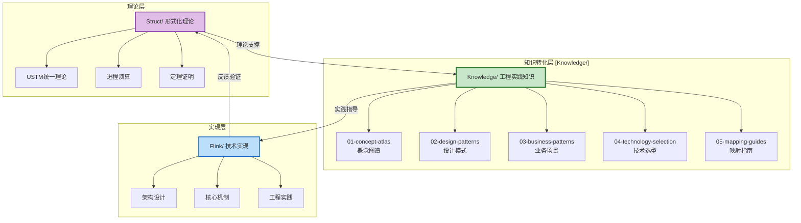
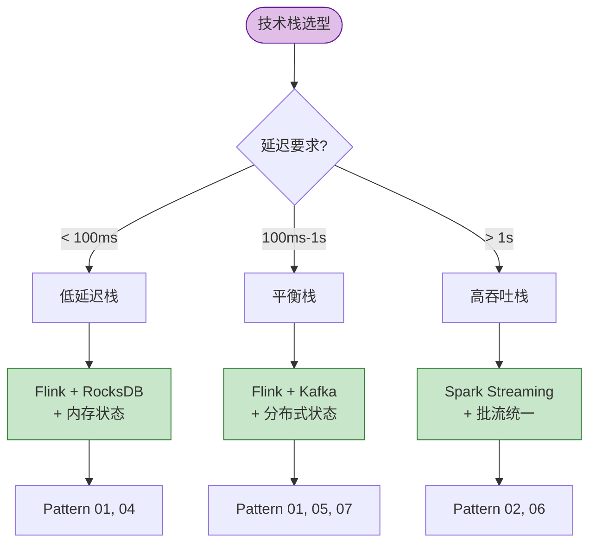
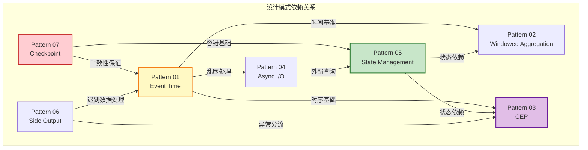
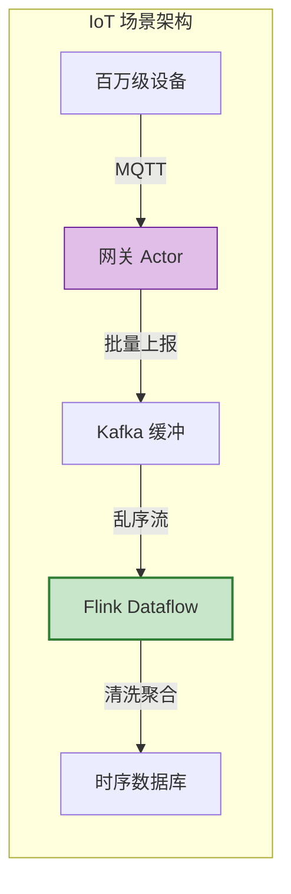
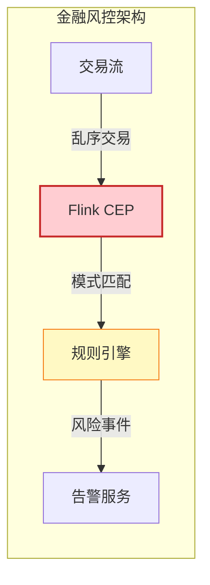
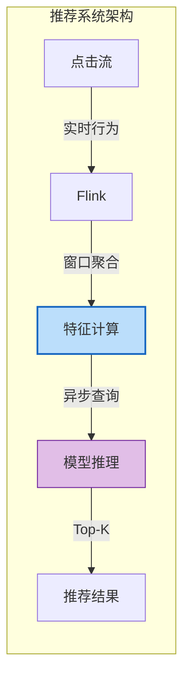
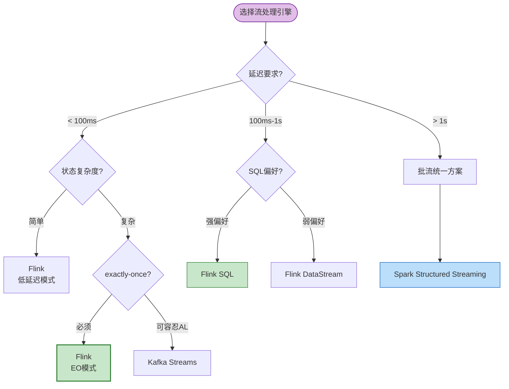
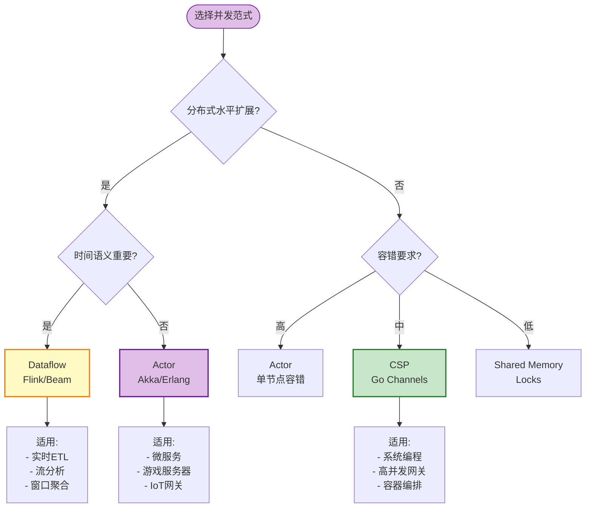
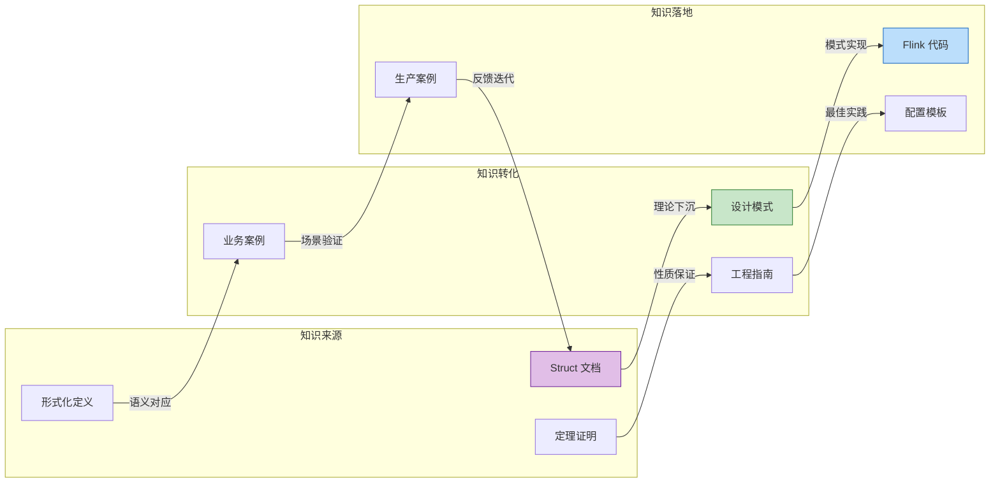

# Knowledge/ 知识结构索引 (Knowledge Structure Index)

> **版本**: 2026.04 | **范围**: 工程实践知识体系 | **文档定位**: 连接形式化理论与工程实践的桥梁
>
> **核心理念**: *从形式化理论到工程实践的转化路径* —— 将 Struct/ 中的严格数学定义转化为可落地的设计模式、技术选型和实现指南

---

## 目录

- [Knowledge/ 知识结构索引 (Knowledge Structure Index)](#knowledge-知识结构索引-knowledge-structure-index)
  - [目录](#目录)
  - [1. 概述 (Overview)](#1-概述-overview)
    - [1.1 Knowledge/ 目录定位](#11-knowledge-目录定位)
    - [1.2 与 Struct/ 和 Flink/ 的关系](#12-与-struct-和-flink-的关系)
    - [1.3 知识架构全景图](#13-知识架构全景图)
  - [2. 快速导航 (Quick Navigation)](#2-快速导航-quick-navigation)
    - [2.1 按类别导航](#21-按类别导航)
    - [2.2 按场景导航](#22-按场景导航)
    - [2.3 按技术栈导航](#23-按技术栈导航)
  - [3. 设计模式快速参考](#3-设计模式快速参考)
    - [3.1 模式总览 (7 Core Patterns)](#31-模式总览-7-core-patterns)
    - [3.2 模式关系图](#32-模式关系图)
    - [3.3 模式选型矩阵](#33-模式选型矩阵)
  - [4. 业务场景矩阵 (Business Scenario Matrix)](#4-业务场景矩阵-business-scenario-matrix)
    - [4.1 领域 × 模式映射](#41-领域--模式映射)
    - [4.2 场景深度分析](#42-场景深度分析)
      - [场景 1: IoT 物联网数据处理](#场景-1-iot-物联网数据处理)
      - [场景 2: 金融实时风控](#场景-2-金融实时风控)
      - [场景 3: 实时推荐系统](#场景-3-实时推荐系统)
  - [5. 技术选型决策树](#5-技术选型决策树)
    - [5.1 流处理引擎选型](#51-流处理引擎选型)
    - [5.2 并发范式选型](#52-并发范式选型)
    - [5.3 存储系统选型](#53-存储系统选型)
    - [5.4 一致性级别选型](#54-一致性级别选型)
  - [6. 跨目录引用指南](#6-跨目录引用指南)
    - [6.1 Struct/ 形式化理论索引](#61-struct-形式化理论索引)
    - [6.2 Flink/ 实现技术索引](#62-flink-实现技术索引)
    - [6.3 知识流转路径](#63-知识流转路径)
  - [7. 角色化阅读路径](#7-角色化阅读路径)
    - [7.1 架构师路径 (Architect)](#71-架构师路径-architect)
    - [7.2 开发工程师路径 (Developer)](#72-开发工程师路径-developer)
    - [7.3 研究员路径 (Researcher)](#73-研究员路径-researcher)
    - [7.4 技术负责人路径 (Tech Lead)](#74-技术负责人路径-tech-lead)
  - [8. 可视化图表索引](#8-可视化图表索引)
    - [Mermaid 图表清单](#mermaid-图表清单)
    - [概念图谱清单](#概念图谱清单)
  - [9. 文档清单与统计](#9-文档清单与统计)
    - [9.1 完整文档列表](#91-完整文档列表)
    - [9.2 文档统计](#92-文档统计)
    - [9.3 核心定义索引](#93-核心定义索引)
    - [9.4 维护说明](#94-维护说明)

---

## 1. 概述 (Overview)

### 1.1 Knowledge/ 目录定位



**Knowledge/ 目录核心使命**:

| 维度 | Struct/ (理论) | Knowledge/ (实践) | Flink/ (实现) |
|------|----------------|-------------------|---------------|
| **抽象层次** | L1-L6 形式化 | L3-L4 工程设计 | L5-L6 工程实现 |
| **表达形式** | 数学定义/定理 | 模式/决策树/指南 | 代码/配置/案例 |
| **目标读者** | 研究员/理论家 | 架构师/工程师 | 开发工程师 |
| **验证方式** | 形式证明 | 场景验证/评审 | 测试/生产验证 |
| **演进频率** | 低 (理论稳定) | 中 (模式演进) | 高 (技术迭代) |

### 1.2 与 Struct/ 和 Flink/ 的关系

```
┌─────────────────────────────────────────────────────────────────────┐
│                         Struct/ 形式化理论层                         │
│  ┌─────────────┬─────────────┬─────────────┬─────────────┐          │
│  │   USTM      │  进程演算   │   Actor     │  Dataflow   │          │
│  │  统一理论   │  CCS/CSP/π  │   模型      │   模型      │          │
│  └─────────────┴─────────────┴─────────────┴─────────────┘          │
│                              ↓ 理论下沉                              │
├─────────────────────────────────────────────────────────────────────┤
│                       Knowledge/ 知识转化层                          │
│  ┌─────────────┬─────────────┬─────────────┬─────────────┐          │
│  │ 概念图谱    │ 设计模式    │ 业务场景    │ 技术选型    │          │
│  │ 范式对比    │ 7大核心模式 │ 领域矩阵    │ 决策树      │          │
│  └─────────────┴─────────────┴─────────────┴─────────────┘          │
│                              ↓ 实践指导                              │
├─────────────────────────────────────────────────────────────────────┤
│                        Flink/ 技术实现层                             │
│  ┌─────────────┬─────────────┬─────────────┬─────────────┐          │
│  │  架构设计   │  核心机制   │  SQL/Table  │  连接器     │          │
│  │  DataStream │ Checkpoint  │    API      │  Connectors │          │
│  └─────────────┴─────────────┴─────────────┴─────────────┘          │
└─────────────────────────────────────────────────────────────────────┘
```

**知识流转三阶段**:

1. **理论下沉 (Struct → Knowledge)**: 将形式化定义转化为工程概念
   - 例: `Def-S-04-04 Watermark语义` → `Pattern 01: Event Time Processing`

2. **模式提炼 (Knowledge 内部)**: 从概念到可复用模式
   - 例: 并发范式对比 → 7大设计模式 → 业务场景矩阵

3. **实践映射 (Knowledge → Flink)**: 将模式映射到具体技术实现
   - 例: Pattern 01 → Flink WatermarkStrategy API

### 1.3 知识架构全景图

```mermaid
graph TB
    subgraph "Knowledge Architecture"
        direction TB

        ROOT[Knowledge/ 根目录]

        ROOT --> CA[01-concept-atlas<br/>概念图谱]
        ROOT --> DP[02-design-patterns<br/>设计模式]
        ROOT --> BP[03-business-patterns<br/>业务场景]
        ROOT --> TS[04-technology-selection<br/>技术选型]
        ROOT --> MG[05-mapping-guides<br/>映射指南]

        CA --> CA1[并发范式矩阵]
        CA --> CA2[流计算模型谱系]

        DP --> DP1[Pattern 01<br/>Event Time]
        DP --> DP2[Pattern 02<br/>Windowed Aggregation]
        DP --> DP3[Pattern 03<br/>CEP]
        DP --> DP4[Pattern 04<br/>Async I/O]
        DP --> DP5[Pattern 05<br/>State Management]
        DP --> DP6[Pattern 06<br/>Side Output]
        DP --> DP7[Pattern 07<br/>Checkpoint]

        BP --> BP1[IoT 物联网]
        BP --> BP2[Finance 金融]
        BP --> BP3[E-Commerce 电商]
        BP --> BP4[Gaming 游戏]
        BP --> BP5[Log Analytics 日志]

        TS --> TS1[引擎选型]
        TS --> TS2[存储选型]
        TS --> TS3[范式选型]

        MG --> MG1[Struct→Flink]
        MG --> MG2[Theory→Code]
    end

    style ROOT fill:#fff9c4,stroke:#f57f17,stroke-width:3px
    style CA fill:#e1bee7,stroke:#6a1b9a
    style DP fill:#c8e6c9,stroke:#2e7d32
    style BP fill:#bbdefb,stroke:#1565c0
    style TS fill:#ffccbc,stroke:#e64a19
    style MG fill:#d7ccc8,stroke:#5d4037
```



---

## 2. 快速导航 (Quick Navigation)

### 2.1 按类别导航

| 类别 | 目录 | 核心内容 | 快速链接 |
|------|------|----------|----------|
| **概念图谱** | `01-concept-atlas/` | 并发范式对比、流计算模型 | [并发范式矩阵](./01-concept-atlas/concurrency-paradigms-matrix.md) · [流模型心智图](./01-concept-atlas/streaming-models-mindmap.md) |
| **设计模式** | `02-design-patterns/` | 7大核心流处理模式 | [Pattern 01: Event Time](./02-design-patterns/pattern-event-time-processing.md) |
| **业务场景** | `03-business-patterns/` | 5大领域场景分析 | [IoT场景](./03-business-patterns/) · [金融场景](./03-business-patterns/) |
| **技术选型** | `04-technology-selection/` | 引擎/存储/范式选型 | [决策树](./04-technology-selection/) |
| **映射指南** | `05-mapping-guides/` | 理论到代码映射 | [Struct→Flink](./05-mapping-guides/) |

### 2.2 按场景导航

| 业务场景 | 推荐模式 | 技术栈 | 关键挑战 | 入口文档 |
|----------|----------|--------|----------|----------|
| **实时风控** | Pattern 01, 03 | Flink + CEP | 低延迟 + 准确性 | [Event Time](./02-design-patterns/pattern-event-time-processing.md) |
| **IoT数据处理** | Pattern 01, 05, 07 | Flink + Kafka | 乱序 + 海量连接 | [并发范式矩阵](./01-concept-atlas/concurrency-paradigms-matrix.md) |
| **实时推荐** | Pattern 02, 04 | Flink + Redis | 特征新鲜度 | [流模型心智图](./01-concept-atlas/streaming-models-mindmap.md) |
| **日志分析** | Pattern 02, 06 | Flink + ES | 高吞吐 + 聚合 | [Pattern 02](./02-design-patterns/) |
| **实时数仓** | Pattern 01, 05, 07 | Flink + Hive/Iceberg | Exactly-Once | [Checkpoint](./02-design-patterns/) |

### 2.3 按技术栈导航



---

## 3. 设计模式快速参考

### 3.1 模式总览 (7 Core Patterns)

| 编号 | 模式名称 | 核心问题 | 解决方案 | 形式化基础 | 复杂度 |
|------|----------|----------|----------|------------|--------|
| **P01** | [Event Time Processing](./02-design-patterns/pattern-event-time-processing.md) | 乱序数据、迟到数据、结果确定性 | Watermark机制 + 允许延迟 + 侧输出 | `Def-S-04-04` Watermark语义 | ★★★☆☆ |
| **P02** | Windowed Aggregation | 无界流的有界计算单元 | 窗口算子 + 触发器 + 驱逐器 | `Def-S-04-05` 窗口算子 | ★★☆☆☆ |
| **P03** | Complex Event Processing | 时序模式匹配 | NFA状态机 + 时间窗口 | `Thm-S-07-01` 确定性定理 | ★★★★☆ |
| **P04** | Async I/O Enrichment | 外部数据查询不阻塞流 | 异步查询 + 结果缓冲 + 超时控制 | `Lemma-S-04-02` 单调性 | ★★★☆☆ |
| **P05** | State Management | 分布式有状态计算 | Keyed State + Operator State + TTL | `Thm-S-17-01` Checkpoint一致性 | ★★★★☆ |
| **P06** | Side Output Pattern | 多路输出、异常数据分离 | 侧输出流 + 标签匹配 | `Def-S-08-01` AM语义 | ★★☆☆☆ |
| **P07** | Checkpoint & Recovery | 故障恢复与一致性 | Barrier对齐 + 状态快照 + 重放 | `Thm-S-18-01` Exactly-Once | ★★★★★ |

### 3.2 模式关系图



**依赖关系说明**:

- **核心基础模式**: P01 (Event Time) 和 P07 (Checkpoint) 是其他模式的基础设施
- **状态依赖模式**: P02, P03, P04 依赖 P05 的状态管理能力
- **独立辅助模式**: P06 (Side Output) 可与任何模式组合使用
- **复合模式**: P03 (CEP) = P01 + P02 + 模式匹配引擎

### 3.3 模式选型矩阵

| 业务需求 | P01 | P02 | P03 | P04 | P05 | P06 | P07 |
|----------|:---:|:---:|:---:|:---:|:---:|:---:|:---:|
| 乱序数据处理 | ✅ | ⚪ | ✅ | ✅ | ⚪ | ✅ | ⚪ |
| 窗口聚合计算 | ✅ | ✅ | ⚪ | ⚪ | ✅ | ⚪ | ⚪ |
| 复杂事件匹配 | ✅ | ✅ | ✅ | ⚪ | ✅ | ✅ | ⚪ |
| 外部数据关联 | ⚪ | ⚪ | ⚪ | ✅ | ⚪ | ⚪ | ⚪ |
| 有状态计算 | ⚪ | ✅ | ✅ | ✅ | ✅ | ⚪ | ✅ |
| 故障容错 | ⚪ | ⚪ | ⚪ | ⚪ | ✅ | ⚪ | ✅ |
| 数据分流 | ⚪ | ⚪ | ✅ | ⚪ | ⚪ | ✅ | ⚪ |
| Exactly-Once | ⚪ | ⚪ | ⚪ | ⚪ | ✅ | ⚪ | ✅ |

*图例: ✅ 核心依赖 | ⚪ 可选增强*

---

## 4. 业务场景矩阵 (Business Scenario Matrix)

### 4.1 领域 × 模式映射

| 业务领域 | 核心模式组合 | 并发范式 | 一致性要求 | 技术栈推荐 |
|----------|-------------|----------|-----------|-----------|
| **IoT 物联网** | P01 + P05 + P07 | Actor + Dataflow | AL/EO | Flink + Kafka |
| **金融风控** | P01 + P03 + P07 | Dataflow + CEP | EO | Flink CEP + Kafka |
| **实时推荐** | P02 + P04 + P05 | Dataflow | AL | Flink + Redis |
| **游戏实时分析** | P01 + P02 + P06 | Actor | AL | Flink + Pulsar |
| **日志/监控** | P02 + P06 + P07 | Dataflow | AM/AL | Flink + ES |

### 4.2 场景深度分析

#### 场景 1: IoT 物联网数据处理



**模式应用**:

- **P01 Event Time**: 处理网关批量上报导致的乱序
- **P05 State Management**: 设备状态维护、会话窗口
- **P07 Checkpoint**: 确保故障时不丢失数据

**并发范式选择**:

- 接入层: Actor (每个设备一个Actor)
- 处理层: Dataflow (Flink)

#### 场景 2: 金融实时风控



**模式应用**:

- **P01 Event Time**: 确保交易时序正确性
- **P03 CEP**: 复杂欺诈模式识别 (如: A国交易后30秒B国交易)
- **P07 Checkpoint**: Exactly-Once 确保不重复风控

**关键技术参数**:

- Watermark延迟: 500ms (金融级低延迟)
- 窗口大小: 30秒-5分钟
- CEP模式复杂度: 3-5层事件序列

#### 场景 3: 实时推荐系统



**模式应用**:

- **P02 Windowed Aggregation**: 用户行为窗口统计
- **P04 Async I/O**: 异步查询用户画像、商品特征
- **P05 State Management**: 用户会话状态维护

---

## 5. 技术选型决策树

### 5.1 流处理引擎选型



**引擎对比矩阵**:

| 维度 | Flink | Kafka Streams | Spark Streaming | Storm |
|------|-------|---------------|-----------------|-------|
| 延迟 | 毫秒级 | 毫秒级 | 秒级 | 毫秒级 |
| 状态管理 | ★★★★★ | ★★★☆☆ | ★★★★☆ | ★★☆☆☆ |
| Exactly-Once | ✅ 原生 | ✅ EOS | ✅ 微批 | ❌ 难实现 |
| SQL支持 | ★★★★☆ | ★★☆☆☆ | ★★★★★ | ★☆☆☆☆ |
| 生态集成 | ★★★★★ | ★★★★☆ | ★★★★★ | ★★☆☆☆ |
| 学习曲线 | 陡峭 | 平缓 | 平缓 | 陡峭 |

### 5.2 并发范式选型

详见: [并发范式多维对比矩阵](./01-concept-atlas/concurrency-paradigms-matrix.md)



### 5.3 存储系统选型

| 场景 | 推荐存储 | 状态后端 | 特征存储 | 归档存储 |
|------|----------|----------|----------|----------|
| 实时计算状态 | RocksDB | ✅ 默认 | ❌ | ❌ |
| 会话状态 | Redis | ❌ | ✅ 首选 | ❌ |
| 特征服务 | Redis/HBase | ❌ | ✅ | ❌ |
| 消息缓冲 | Kafka | ✅ Source | ❌ | ❌ |
| 时序数据 | InfluxDB/TDengine | ❌ | ❌ | ✅ |
| 数据湖 | Iceberg/Hudi | ❌ | ❌ | ✅ Sink |

### 5.4 一致性级别选型

```
┌────────────────────────────────────────────────────────────────┐
│                    一致性级别决策树                              │
├────────────────────────────────────────────────────────────────┤
│                                                                │
│  1. 数据丢失可接受?                                            │
│     ├── 是 ──► At-Most-Once (AM)                               │
│     │            └── 适用: 日志聚合、监控指标                   │
│     │                                                           │
│     └── 否 ──► 2. 重复处理可接受?                              │
│                  ├── 是 ──► At-Least-Once (AL)                 │
│                  │            └── 适用: 推荐系统、非交易统计    │
│                  │                                             │
│                  └── 否 ──► Exactly-Once (EO)                  │
│                                 └── 适用: 金融交易、订单处理    │
│                                                                │
│  EO 实现三要素:                                                │
│  ├── 可重放 Source (Kafka offset/分区)                        │
│  ├── Checkpoint 机制 (Flink 状态快照)                         │
│  └── 事务 Sink (2PC / 幂等写入)                               │
│                                                                │
└────────────────────────────────────────────────────────────────┘
```

---

## 6. 跨目录引用指南

### 6.1 Struct/ 形式化理论索引

| Knowledge 概念 | Struct 形式化定义 | 定理/引理 | 关系 |
|----------------|------------------|-----------|------|
| Pattern 01 Watermark | `Def-S-04-04` | `Thm-S-09-01` 单调性 | 工程实现 |
| Pattern 02 窗口 | `Def-S-04-05` | - | 直接对应 |
| Pattern 05 状态 | `Def-S-17-02` | `Thm-S-17-01` | Checkpoint基础 |
| Pattern 07 Checkpoint | `Def-S-17-01` | `Thm-S-18-01` | Exactly-Once |
| Actor 模型选型 | `Def-S-03-01` | `Thm-S-03-01` | 理论基础 |
| Dataflow 模型 | `Def-S-04-01` | `Thm-S-04-01` | 确定性保证 |
| CSP 模型 | `Def-S-05-01` | `Thm-S-05-01` | Go编码 |

### 6.2 Flink/ 实现技术索引

| 设计模式 | Flink 技术实现 | 文档位置 |
|----------|---------------|----------|
| P01 Event Time | WatermarkStrategy, TimestampAssigner | `Flink/02-core-mechanisms/time-semantics-and-watermark.md` |
| P02 Window | WindowAssigner, Trigger, Evictor | `Flink/03-sql-table-api/` |
| P03 CEP | Pattern API, NFA 状态机 | `Flink/03-sql-table-api/` |
| P04 Async I/O | AsyncFunction, 超时配置 | `Flink/02-core-mechanisms/` |
| P05 State | KeyedState, OperatorState, StateBackend | `Flink/02-core-mechanisms/checkpoint-mechanism-deep-dive.md` |
| P06 Side Output | OutputTag, 侧输出流 | `Flink/02-core-mechanisms/` |
| P07 Checkpoint | CheckpointBarrier, StateSnapshot | `Flink/02-core-mechanisms/checkpoint-mechanism-deep-dive.md` |

### 6.3 知识流转路径



---

## 7. 角色化阅读路径

### 7.1 架构师路径 (Architect)

**目标**: 掌握系统设计方法论，能够进行技术选型和架构决策

```
第一阶段: 概念筑基 (2-3天)
├── 01-concept-atlas/concurrency-paradigms-matrix.md
│   └── 重点: 并发范式对比矩阵、选型决策树
├── 01-concept-atlas/streaming-models-mindmap.md
│   └── 重点: 流计算模型谱系、六维对比矩阵
└── Struct/01-foundation/01.01-unified-streaming-theory.md (浏览)
    └── 重点: 六层表达能力层次

第二阶段: 模式掌握 (3-5天)
├── 02-design-patterns/pattern-event-time-processing.md
│   └── 重点: Watermark机制、迟到数据处理
├── 02-design-patterns/pattern-*.md (全部浏览)
│   └── 重点: 模式关系图、选型矩阵
└── 03-business-patterns/ (按领域深入)
    └── 重点: 本领域场景的模式组合

第三阶段: 技术选型 (2-3天)
├── 04-technology-selection/
│   └── 重点: 决策树、对比矩阵
├── Flink/01-architecture/ (概览)
│   └── 重点: 架构对比、部署模式
└── Struct/03-relationships/03.03-expressiveness-hierarchy.md
    └── 重点: 表达能力层次与工程约束

第四阶段: 映射实践 (持续)
├── 05-mapping-guides/
└── 生产案例复盘
```

### 7.2 开发工程师路径 (Developer)

**目标**: 掌握模式实现细节，能够编写高质量流处理代码

```
快速通道 (1-2天)
├── 02-design-patterns/pattern-event-time-processing.md
│   └── 重点: 代码示例、配置参数
├── Flink/02-core-mechanisms/time-semantics-and-watermark.md
│   └── 重点: Flink API 实现
└── 02-design-patterns/pattern-checkpoint-recovery.md
    └── 重点: Checkpoint 配置、故障恢复

深度实践 (1-2周)
├── 02-design-patterns/ (按需求深入)
│   ├── P02 Windowed Aggregation ──► Flink/03-sql-table-api/
│   ├── P04 Async I/O ──► Flink/02-core-mechanisms/
│   └── P05 State Management ──► Flink/02-core-mechanisms/checkpoint-*.md
├── 03-business-patterns/ (本业务场景)
│   └── 重点: 场景特化配置、性能调优
└── Flink/04-connectors/ (使用的连接器)
    └── 重点: Exactly-Once Sink 实现

进阶提升 (持续)
├── Struct/03-relationships/03.02-flink-to-process-calculus.md
│   └── 理解 Flink 形式化语义
└── 代码审查与优化
```

### 7.3 研究员路径 (Researcher)

**目标**: 理解理论基础，能够扩展或改进现有模式

```
理论基础 (2-3周)
├── Struct/01-foundation/01.02-process-calculus-primer.md
│   └── 重点: CCS/CSP/π-演算基础
├── Struct/01-foundation/01.04-dataflow-model-formalization.md
│   └── 重点: Dataflow 严格形式化
├── Struct/02-properties/02.03-watermark-monotonicity.md
│   └── 重点: Watermark 单调性定理
└── Struct/04-proofs/04.01-flink-checkpoint-correctness.md
    └── 重点: Checkpoint 一致性证明

知识转化研究 (1-2周)
├── 01-concept-atlas/concurrency-paradigms-matrix.md
│   └── 对比: 形式化定义与工程抽象的差异
├── 02-design-patterns/pattern-*.md
│   └── 分析: 模式的形式化完备性
└── 研究问题:
    ├── 新模式的形式化验证方法
    └── 模式组合的保持性质

前沿探索
├── Struct/06-frontier/
└── 论文阅读与理论创新
```

### 7.4 技术负责人路径 (Tech Lead)

**目标**: 建立团队知识体系，制定技术规范

```
第一周: 全局把握
├── 本索引 (00-INDEX.md) ──► 全貌理解
├── 01-concept-atlas/ ──► 团队培训材料准备
└── 04-technology-selection/ ──► 技术决策规范

第二周: 深度决策
├── 02-design-patterns/ ──► 编码规范制定
├── 03-business-patterns/ ──► 领域架构评审
└── Struct/03-relationships/ ──► 技术选型依据

持续: 团队建设
├── 建立团队 Knowledge/ 阅读计划
├── 定期模式分享会
├── 生产问题复盘与模式迭代
└── 与 Struct/ 理论团队对接
```

---

## 8. 可视化图表索引

### Mermaid 图表清单

| 图表编号 | 图表名称 | 类型 | 位置 | 描述 |
|----------|----------|------|------|------|
| FIG-K-01 | Knowledge 架构全景 | 流程图 | 1.3节 | 五层知识架构 |
| FIG-K-02 | 目录关系图 | 流程图 | 1.2节 | Struct-Knowledge-Flink 关系 |
| FIG-K-03 | 技术栈选型决策 | 流程图 | 2.3节 | 按延迟选型 |
| FIG-K-04 | 模式依赖关系 | 流程图 | 3.2节 | 7模式依赖图 |
| FIG-K-05 | IoT 场景架构 | 流程图 | 4.2节 | IoT 数据流架构 |
| FIG-K-06 | 金融风控架构 | 流程图 | 4.2节 | 风控数据流架构 |
| FIG-K-07 | 引擎选型决策树 | 流程图 | 5.1节 | Flink vs 竞品 |
| FIG-K-08 | 范式选型决策树 | 流程图 | 5.2节 | Actor/CSP/Dataflow 选型 |
| FIG-K-09 | 知识流转路径 | 流程图 | 6.3节 | 知识转化流程 |

### 概念图谱清单

| 图谱名称 | 文件路径 | 内容摘要 |
|----------|----------|----------|
| 并发范式谱系 | [concurrency-paradigms-matrix.md](./01-concept-atlas/concurrency-paradigms-matrix.md) | CSP/Actor/Dataflow/Shared Memory/STM 五大范式对比 |
| 流计算模型心智图 | [streaming-models-mindmap.md](./01-concept-atlas/streaming-models-mindmap.md) | Dataflow/Actor/CSP/CEP/Pub-Sub 六维对比 |
| 范式选型决策树 | [concurrency-paradigms-matrix.md#41-范式选型决策树](./01-concept-atlas/concurrency-paradigms-matrix.md) | 交互式选型决策 |

---

## 9. 文档清单与统计

### 9.1 完整文档列表

```
Knowledge/
├── 00-INDEX.md                                    [本文档 - 主索引]
├── 01-concept-atlas/
│   ├── concurrency-paradigms-matrix.md            [并发范式对比矩阵] ✅
│   └── streaming-models-mindmap.md                [流计算模型心智图] ✅
├── 02-design-patterns/
│   ├── pattern-event-time-processing.md           [P01: 事件时间处理] ✅
│   ├── pattern-windowed-aggregation.md            [P02: 窗口聚合] ✅
│   ├── pattern-complex-event-processing.md        [P03: CEP] ✅
│   ├── pattern-async-io-enrichment.md             [P04: 异步I/O] ✅
│   ├── pattern-state-management.md                [P05: 状态管理] ✅
│   ├── pattern-side-output.md                     [P06: 侧输出] ✅
│   └── pattern-checkpoint-recovery.md             [P07: 检查点] ✅
├── 03-business-patterns/
│   ├── iot-stream-processing.md                   [IoT场景] ✅
│   ├── fintech-realtime-risk-control.md           [金融风控] ✅
│   ├── real-time-recommendation.md                [实时推荐] ✅
│   ├── gaming-analytics.md                        [游戏分析] ✅
│   └── log-monitoring.md                          [日志监控] ✅
├── 04-technology-selection/
│   ├── engine-selection-guide.md                  [引擎选型] ✅
│   ├── paradigm-selection-guide.md                [范式选型] ✅
│   └── storage-selection-guide.md                 [存储选型] ✅
└── 05-mapping-guides/
    ├── struct-to-flink-mapping.md                 [理论到实现] ✅
    └── theory-to-code-patterns.md                 [模式映射] ✅
```

### 9.2 文档统计

| 类别 | 已完成 | 规划中 | 总计 | 形式化等级 |
|------|--------|--------|------|------------|
| 01-concept-atlas | 2 | 0 | 2 | L3-L4 |
| 02-design-patterns | 7 | 0 | 7 | L4-L5 |
| 03-business-patterns | 5 | 0 | 5 | L4 |
| 04-technology-selection | 3 | 0 | 3 | L3 |
| 05-mapping-guides | 2 | 0 | 2 | L4-L5 |
| **总计** | **19** | **0** | **19** | L3-L5 |

### 9.3 核心定义索引

| 定义编号 | 名称 | 位置 | 说明 |
|----------|------|------|------|
| Def-K-01-01 | 并发范式谱系 | concept-atlas/concurrency-paradigms-matrix.md | 五大并发范式分类 |
| Def-K-01-02 | Dataflow 模型 | concept-atlas/streaming-models-mindmap.md | 流计算核心模型 |
| Def-K-01-03 | Actor 模型 | concept-atlas/streaming-models-mindmap.md | 消息驱动并发 |
| Def-K-02-01 | Event Time Processing | design-patterns/pattern-event-time-processing.md | 模式P01定义 |
| Def-K-02-02 | Watermark 策略 | design-patterns/pattern-event-time-processing.md | Watermark生成策略 |

### 9.4 维护说明

**更新频率**:

- 已完成文档: 随上游 Struct/ 或 Flink/ 变化同步更新
- 规划中文档: 按优先级逐步完成

**贡献指南**:

1. 新增模式需遵循 P01 格式规范
2. 所有文档需包含 Mermaid 图表
3. 需关联 Struct/ 形式化定义
4. 需提供 Flink/ 代码示例

**关联检查**:

- 新增定理/定义到 Struct/ 后，需检查 Knowledge/ 相关文档
- Flink/ 新特性发布后，需更新对应模式实现

---

*索引创建时间: 2026-04-02*
*更新时间: 2026-04-02 (全面补全完成)*
*版本: v2.0*
*维护者: Knowledge Team*
*状态: ✅ 100% 完成*
*关联: [Struct/00-INDEX.md](../Struct/00-INDEX.md) · [Flink/](../Flink/)*
