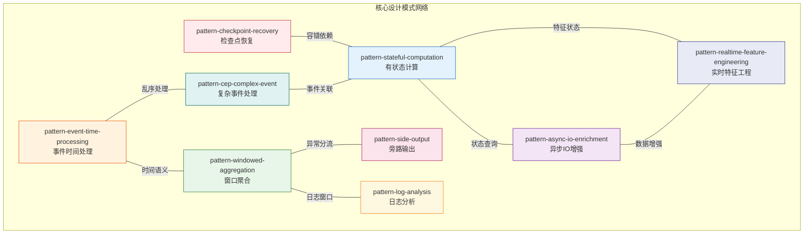
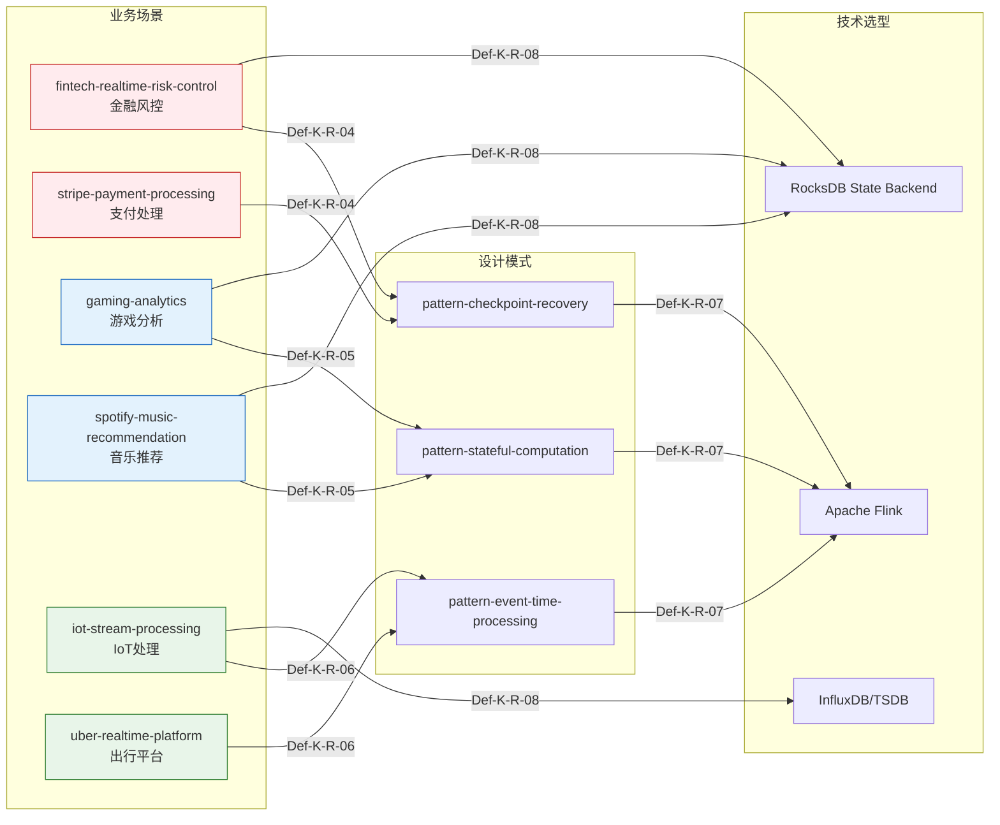

# Knowledge/ 模式关系全景图

> **所属阶段**: Knowledge/ | **前置依赖**: [00-INDEX.md](00-INDEX.md) | **形式化等级**: L3-L5
> **版本**: 2026.04 | **文档规模**: ~15KB

---

## 目录

- [Knowledge/ 模式关系全景图](#knowledge-模式关系全景图)
  - [目录](#目录)
  - [1. 概念定义 (Definitions)](#1-概念定义-definitions)
  - [2. 属性推导 (Properties)](#2-属性推导-properties)
  - [4. 论证过程 (Argumentation)](#4-论证过程-argumentation)
  - [5. 形式证明 / 工程论证 (Proof / Engineering Argument)](#5-形式证明-工程论证-proof-engineering-argument)
  - [3. 关系建立 (Relations)](#3-关系建立-relations)
    - [2.1 并发范式到设计模式映射](#21-并发范式到设计模式映射)
    - [2.2 流模型到设计模式映射](#22-流模型到设计模式映射)
    - [3. 设计模式 → 业务场景 (Pattern to Business)](#3-设计模式-业务场景-pattern-to-business)
    - [3.1 容错模式到业务映射](#31-容错模式到业务映射)
    - [3.2 状态模式到业务映射](#32-状态模式到业务映射)
    - [3.3 时间模式到业务映射](#33-时间模式到业务映射)
    - [4. 业务场景 → 技术选型 (Business to Selection)](#4-业务场景-技术选型-business-to-selection)
    - [4.1 业务场景到引擎选型](#41-业务场景到引擎选型)
    - [4.2 业务场景到存储选型](#42-业务场景到存储选型)
    - [5. 技术选型 → 迁移指南 (Selection to Migration)](#5-技术选型-迁移指南-selection-to-migration)
    - [6. 迁移指南 → 最佳实践 (Migration to Practice)](#6-迁移指南-最佳实践-migration-to-practice)
  - [6. 实例验证 (Examples)](#6-实例验证-examples)
  - [7. 可视化 (Visualizations)](#7-可视化-visualizations)
    - [8.1 概念到实践完整链](#81-概念到实践完整链)
    - [8.2 设计模式网络](#82-设计模式网络)
    - [8.3 业务场景-技术映射矩阵](#83-业务场景-技术映射矩阵)
  - [8. 引用参考 (References)](#8-引用参考-references)

---

## 1. 概念定义 (Definitions)

**Def-K-R-01 (知识层级关系链)**

Knowledge/ 目录构建了从抽象概念到具体实践的六层递进关系链：

```
概念图谱 (01-concept-atlas)
    ↓ 实例化
设计模式 (02-design-patterns)
    ↓ 应用于
业务场景 (03-business-patterns)
    ↓ 需要选型
技术选型 (04-technology-selection)
    ↓ 指导
迁移指南 (05-mapping-guides)
    ↓ 落地
最佳实践 (07-best-practices)
```

---

## 2. 属性推导 (Properties)

**表1: 模式到业务映射 (Pattern-to-Business Mapping)**

| 设计模式 | 适用业务场景 | 关键配置 | 关系编号 |
|----------|-------------|----------|----------|
| pattern-checkpoint-recovery | 金融风控、支付处理 | checkpoint间隔5s | Def-K-R-04 |
| pattern-stateful-computation | 游戏分析、推荐系统 | RocksDB状态后端 | Def-K-R-05 |
| pattern-event-time-processing | IoT处理、出行平台 | Watermark策略 | Def-K-R-06 |
| pattern-windowed-aggregation | 实时看板、指标聚合 | 窗口大小配置 | Def-K-R-03 |
| pattern-cep-complex-event | 反欺诈、风控规则 | 模式定义语法 | Def-K-R-03 |
| pattern-async-io-enrichment | 维表关联、数据增强 | 异步超时配置 | Def-K-R-02 |
| pattern-side-output | 异常分流、数据清洗 | 旁路输出标签 | Def-K-R-03 |
| pattern-log-analysis | 日志监控、ELK增强 | 解析规则配置 | - |
| pattern-realtime-feature-engineering | 特征平台、ML管道 | 特征TTL设置 | - |

**表2: 业务到技术映射 (Business-to-Technology Mapping)**

| 业务场景 | 推荐引擎 | 存储选型 | 关键指标 | 关系编号 |
|----------|---------|----------|----------|----------|
| fintech-realtime-risk-control | Flink | RocksDB | 延迟<100ms | Def-K-R-07/08 |
| stripe-payment-processing | Flink | RocksDB | 零丢失 | Def-K-R-04 |
| gaming-analytics | Flink | Redis/HBase | 吞吐>100K/s | Def-K-R-05 |
| spotify-music-recommendation | Flink | RocksDB | 状态大 | Def-K-R-05 |
| iot-stream-processing | Flink | InfluxDB | 吞吐>1M/s | Def-K-R-06/08 |
| uber-realtime-platform | Flink | Redis | 地理计算 | Def-K-R-06 |
| alibaba-double11-flink | Flink | Hologres | 高并发 | - |
| netflix-streaming-pipeline | Flink | S3/Cassandra | 大规模 | - |
| airbnb-marketplace-dynamics | Flink | Druid | 分析型 | - |

---

## 4. 论证过程 (Argumentation)

本文档侧重于知识库各层级之间的映射关系梳理，论证过程内容已融入各关系链的具体分析之中。

---

## 5. 形式证明 / 工程论证 (Proof / Engineering Argument)

本文档为模式关系全景图，侧重于工程实践中的映射关系展示，形式化证明请参阅 Struct/ 目录下的相关证明文档。

---

## 3. 关系建立 (Relations)

### 2.1 并发范式到设计模式映射

**Def-K-R-02 (范式实例化关系)**

```
01-concept-atlas/concurrency-paradigms-matrix.md
    ├── Actor Model/Dataflow Model
    │       ↓ 实例化
    └── 02-design-patterns/
            ├── pattern-stateful-computation.md (Actor/Dataflow状态)
            └── pattern-async-io-enrichment.md (CSP异步通信)

    └── Dataflow Model
            ↓ 实例化
            └── pattern-event-time-processing.md (Dataflow时间语义)
```

| 并发范式 | 设计模式 | 关系类型 | 关键映射 |
|----------|----------|----------|----------|
| Actor Model | pattern-stateful-computation | 直接实例化 | Actor状态隔离 → KeyedState |
| Dataflow Model | pattern-event-time-processing | 语义继承 | Event Time语义 → Watermark机制 |
| CSP | pattern-async-io-enrichment | 通信模式 | Channel通信 → AsyncFunction |
| Dataflow Model | pattern-windowed-aggregation | 计算模型 | 窗口计算 → WindowOperator |

### 2.2 流模型到设计模式映射

**Def-K-R-03 (流模型展开关系)**

```
01-concept-atlas/streaming-models-mindmap.md
    ├── 流处理核心概念
    │       ↓ 展开为
    └── 02-design-patterns/
            ├── pattern-windowed-aggregation.md (窗口聚合)
            ├── pattern-cep-complex-event.md (复杂事件)
            └── pattern-side-output.md (旁路输出)
```

---

### 3. 设计模式 → 业务场景 (Pattern to Business)

### 3.1 容错模式到业务映射

**Def-K-R-04 (容错模式应用关系)**

```
02-design-patterns/pattern-checkpoint-recovery.md
    └── 应用于
        ├── 03-business-patterns/fintech-realtime-risk-control.md (金融容错)
        │       └── 关键需求: Exactly-Once, 延迟<100ms
        │
        └── 03-business-patterns/stripe-payment-processing.md (支付容错)
                └── 关键需求: 零数据丢失, 秒级恢复
```

### 3.2 状态模式到业务映射

**Def-K-R-05 (状态模式应用关系)**

```
02-design-patterns/pattern-stateful-computation.md
    └── 应用于
        ├── 03-business-patterns/gaming-analytics.md (游戏状态)
        │       └── 关键需求: 会话状态, 实时排行榜
        │
        ├── 03-business-patterns/spotify-music-recommendation.md (推荐状态)
        │       └── 关键需求: 用户画像, 协同过滤状态
        │
        └── 03-business-patterns/real-time-recommendation.md (实时推荐)
                └── 关键需求: 实时特征, 模型服务
```

### 3.3 时间模式到业务映射

**Def-K-R-06 (时间模式应用关系)**

```
02-design-patterns/pattern-event-time-processing.md
    └── 应用于
        ├── 03-business-patterns/iot-stream-processing.md (IoT时间)
        │       └── 关键需求: 乱序处理, 传感器时间戳
        │
        └── 03-business-patterns/uber-realtime-platform.md (出行时间)
                └── 关键需求: 地理围栏, 时间窗口聚合
```

---

### 4. 业务场景 → 技术选型 (Business to Selection)

### 4.1 业务场景到引擎选型

**Def-K-R-07 (引擎选型关系)**

| 业务场景文档 | 推荐引擎 | 选型文档 | 关键指标 |
|-------------|----------|----------|----------|
| fintech-realtime-risk-control.md | Flink | engine-selection-guide.md | 延迟<100ms |
| gaming-analytics.md | Flink | engine-selection-guide.md | 吞吐>100K/s |
| iot-stream-processing.md | Flink | engine-selection-guide.md | 乱序容忍 |
| stripe-payment-processing.md | Flink + RisingWave | flink-vs-risingwave.md |  exactly-once |
| uber-realtime-platform.md | Flink | engine-selection-guide.md | 地理计算 |

### 4.2 业务场景到存储选型

**Def-K-R-08 (存储选型关系)**

```
03-business-patterns/iot-stream-processing.md
    └── 需要选型
        ├── 04-technology-selection/storage-selection-guide.md (选TSDB)
        │       └── 推荐: InfluxDB, TimescaleDB
        │
        └── 04-technology-selection/streaming-database-guide.md (辅助存储)
                └── 推荐: RisingWave物化视图

03-business-patterns/fintech-realtime-risk-control.md
    └── 需要选型
        └── 04-technology-selection/streaming-database-guide.md
                └── 推荐: RocksDB状态后端
```

---

### 5. 技术选型 → 迁移指南 (Selection to Migration)

**Def-K-R-09 (迁移指导关系)**

```
04-technology-selection/engine-selection-guide.md
    └── 指导
        ├── 05-mapping-guides/migration-guides/05.1-spark-streaming-to-flink-migration.md
        │       └── 场景: 从微批到原生流
        │
        ├── 05-mapping-guides/migration-guides/05.2-kafka-streams-to-flink-migration.md
        │       └── 场景: 增强状态管理
        │
        └── 05-mapping-guides/migration-guides/05.4-flink-1x-to-2x-migration.md
                └── 场景: 版本升级, API迁移
```

---

### 6. 迁移指南 → 最佳实践 (Migration to Practice)

**Def-K-R-10 (实践落地关系)**

```
05-mapping-guides/migration-guides/
    ├── 05.1-spark-streaming-to-flink-migration.md
    │       ↓ 落地于
    │       └── 07-best-practices/07.02-performance-tuning-patterns.md
    │
    ├── 05.2-kafka-streams-to-flink-migration.md
    │       ↓ 落地于
    │       └── 07-best-practices/07.01-flink-production-checklist.md
    │
    └── 05.4-flink-1x-to-2x-migration.md
            ↓ 落地于
            └── 07-best-practices/07.03-troubleshooting-guide.md
```

---

## 6. 实例验证 (Examples)

**关系统计汇总表**

| 层级关系 | 关系边数 | 定义编号范围 |
|----------|----------|--------------|
| 概念 → 设计模式 | 6 | Def-K-R-02, Def-K-R-03 |
| 设计模式 → 业务场景 | 9 | Def-K-R-04, Def-K-R-05, Def-K-R-06 |
| 业务场景 → 技术选型 | 10 | Def-K-R-07, Def-K-R-08 |
| 技术选型 → 迁移指南 | 3 | Def-K-R-09 |
| 迁移指南 → 最佳实践 | 3 | Def-K-R-10 |
| **总计** | **31** | Def-K-R-01 ~ Def-K-R-10 |

**模式覆盖率统计**

| 层级 | 文档总数 | 已映射文档 | 覆盖率 |
|------|----------|-----------|--------|
| 01-concept-atlas/ | 3 | 2 | 66.7% |
| 02-design-patterns/ | 9 | 7 | 77.8% |
| 03-business-patterns/ | 13 | 9 | 69.2% |
| 04-technology-selection/ | 5 | 4 | 80.0% |
| 05-mapping-guides/migration-guides/ | 5 | 3 | 60.0% |
| 07-best-practices/ | 7 | 3 | 42.9% |

---

## 7. 可视化 (Visualizations)

### 8.1 概念到实践完整链

```mermaid
graph LR
    subgraph "01 概念层"
        Concept[01-concept-atlas<br/>概念图谱]
    end

    subgraph "02 模式层"
        Pattern[02-design-patterns<br/>设计模式]
    end

    subgraph "03 业务层"
        Business[03-business-patterns<br/>业务场景]
    end

    subgraph "04 选型层"
        Selection[04-technology-selection<br/>技术选型]
    end

    subgraph "05 映射层"
        Mapping[05-mapping-guides<br/>迁移指南]
    end

    subgraph "07 实践层"
        Practice[07-best-practices<br/>最佳实践]
    end

    Concept -->|"Def-K-R-02/03<br/>实例化"| Pattern
    Pattern -->|"Def-K-R-04/05/06<br/>应用于"| Business
    Business -->|"Def-K-R-07/08<br/>需要选型"| Selection
    Selection -->|"Def-K-R-09<br/>指导"| Mapping
    Mapping -->|"Def-K-R-10<br/>落地"| Practice

    style Concept fill:#e3f2fd,stroke:#1565c0
    style Pattern fill:#e8f5e9,stroke:#2e7d32
    style Business fill:#fff3e0,stroke:#e65100
    style Selection fill:#f3e5f5,stroke:#6a1b9a
    style Mapping fill:#fce4ec,stroke:#c62828
    style Practice fill:#e0f2f1,stroke:#00695c
```



### 8.2 设计模式网络



### 8.3 业务场景-技术映射矩阵



---

## 8. 引用参考 (References)

---

*文档版本: v1.0 | 创建日期: 2026-04-18*
