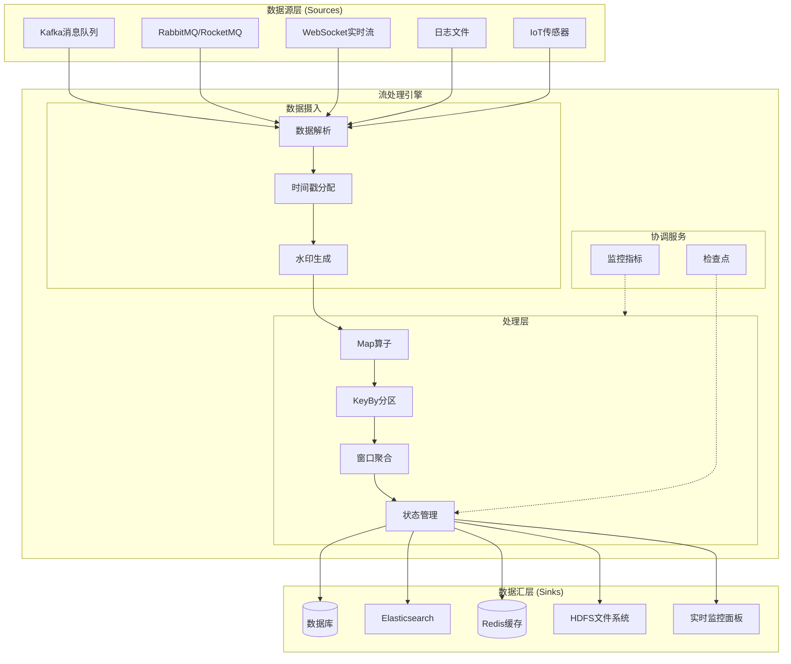
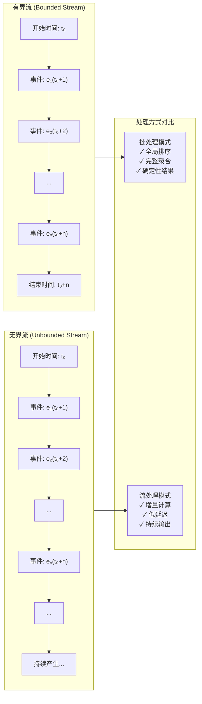
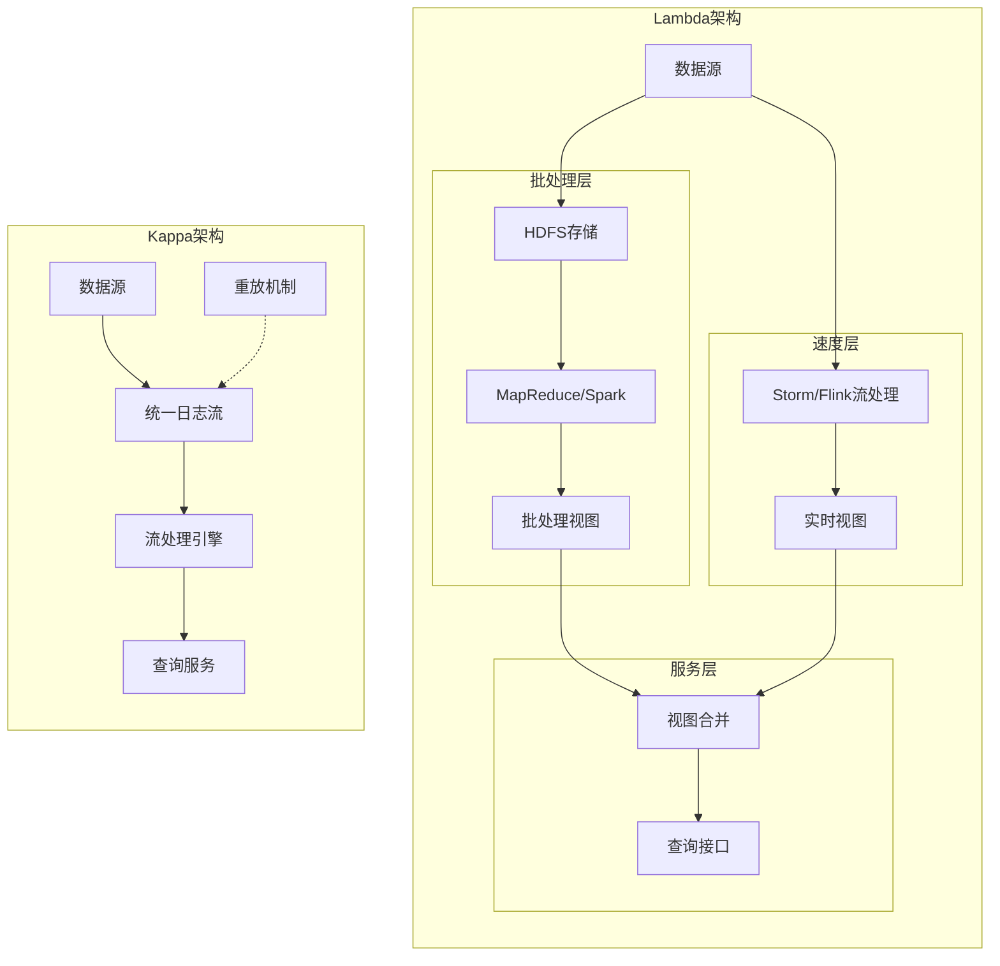
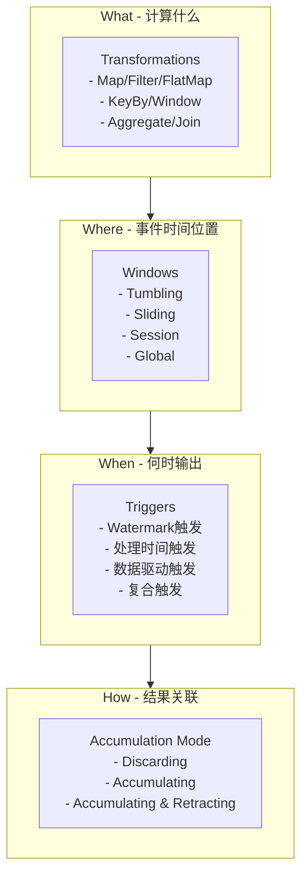

# 流处理基础概念

> **所属阶段**: Knowledge/01-concept-atlas | **前置依赖**: 无 | **形式化等级**: L2-L3 | **难度**: 初级 | **预计阅读时间**: 45分钟

---

## 1. 概念定义 (Definitions)

### 1.1 数据流的基本定义

**定义 1.1.1 (数据流)** [Def-K-01-01]

数据流（Data Stream）是一个无限序列 $S = \langle e_1, e_2, e_3, \ldots \rangle$，其中每个元素 $e_i = (v_i, t_i, k_i)$ 包含：

- $v_i$: 事件值（Value）
- $t_i$: 事件时间戳（Event Timestamp）
- $k_i$: 键（Key，可选）

数据流可形式化定义为从时间到事件值的偏函数：
$$S: \mathbb{T} \rightharpoonup \mathcal{V}$$

其中 $\mathbb{T}$ 为时间域（通常为 $(\mathbb{R}^+, \leq)$ 或 $(\mathbb{N}, \leq)$），$\mathcal{V}$ 为值域。

**定义 1.1.2 (有界流)** [Def-K-01-02]

有界流（Bounded Stream）是定义在有限时间区间 $[t_{start}, t_{end}]$ 上的数据流，满足：
$$S_{bounded} = \{ (v, t, k) \in S \mid t_{start} \leq t \leq t_{end} \}, \quad |S_{bounded}| < \infty$$

有界流具有明确的开始和结束边界，其基数（元素个数）是有限的。

**定义 1.1.3 (无界流)** [Def-K-01-03]

无界流（Unbounded Stream）是定义在无限时间域上的数据流，满足：
$$S_{unbounded} = \{ (v, t, k) \in S \mid t \in [t_{start}, \infty) \}, \quad |S_{unbounded}| = \infty$$

无界流没有预定义的结束时间，理论上会持续产生数据直至系统终止。

**定义 1.1.4 (流处理)** [Def-K-01-04]

流处理（Stream Processing）是一个计算过程 $P$，它将输入流 $S_{in}$ 映射到输出流 $S_{out}$：
$$P: S_{in} \rightarrow S_{out}$$

该过程具有以下特性：

1. **增量性**: 输出随输入的到达而逐步产生
2. **持续性**: 计算在数据到达时立即执行
3. **低延迟**: 端到端延迟通常要求低于秒级

**定义 1.1.5 (批处理)** [Def-K-01-05]

批处理（Batch Processing）是对有界数据集 $D$ 的离线计算过程：
$$B: D \rightarrow R$$

其中 $D$ 为静态数据集，$R$ 为计算结果。批处理假设数据在计算开始前已完全可用。

### 1.2 流处理系统的核心组件

**定义 1.1.6 (数据源)** [Def-K-01-06]

数据源（Source）是流处理系统的输入端点，负责产生或接收数据流。形式化定义为三元组：
$$Source = (O, \Sigma, \delta)$$

其中：

- $O$: 可观察事件集合
- $\Sigma$: 源状态集合
- $\delta: \Sigma \times O \rightarrow \Sigma$: 状态转移函数

**定义 1.1.7 (数据汇)** [Def-K-01-07]

数据汇（Sink）是流处理系统的输出端点，负责将处理结果持久化或转发。形式化定义为：
$$Sink = (I, \Gamma, \rho)$$

其中：

- $I$: 输入事件类型集合
- $\Gamma$: 目标存储状态
- $\rho: I \times \Gamma \rightarrow \Gamma$: 持久化函数

**定义 1.1.8 (算子)** [Def-K-01-08]

算子（Operator）是流处理中的基本计算单元，执行特定的数据转换：
$$Op: S_{in} \times \Theta \rightarrow S_{out}$$

其中 $\Theta$ 为算子参数/状态空间。常见算子类型包括：

- **映射（Map）**: $f: v \rightarrow v'$
- **过滤（Filter）**: $p: v \rightarrow \{true, false\}$
- **聚合（Aggregate）**: $g: 2^V \rightarrow V'$
- **连接（Join）**: $\Join: S_1 \times S_2 \rightarrow S_{out}$

### 1.3 实时性的形式化定义

**定义 1.1.9 (处理延迟)** [Def-K-01-09]

处理延迟（Processing Latency）是事件从产生到结果被消费的时间间隔：
$$\mathcal{L}(e) = t_{sink}(e) - t_{event}(e)$$

其中：

- $t_{event}(e)$: 事件 $e$ 的实际发生时间
- $t_{sink}(e)$: 事件 $e$ 的处理结果被Sink接收的时间

**定义 1.1.10 (实时处理)** [Def-K-01-10]

实时处理（Real-time Processing）是满足延迟约束的流处理：
$$\forall e \in S: \mathcal{L}(e) \leq \mathcal{L}_{max}$$

根据延迟要求可分为：

- **硬实时（Hard Real-time）**: 延迟约束必须严格满足，违反将导致系统失效
- **软实时（Soft Real-time）**: 延迟约束可偶尔违反，但需满足统计约束
- **近实时（Near Real-time）**: 秒级到分钟级延迟要求

---

## 2. 属性推导 (Properties)

### 2.1 有界流与无界流的基本性质

**引理 2.1.1 (有界流的完备性)** [Lemma-K-01-01]

有界流 $S_{bounded}$ 支持完整的集合操作，包括：

- 全局排序: 可基于 $t$ 建立全序关系
- 基数计算: $|S_{bounded}|$ 是良定义的有限值
- 完全聚合: $\bigoplus_{e \in S_{bounded}} v(e)$ 可在有限时间内完成

*证明*：由于 $S_{bounded}$ 定义在有限时间区间且元素个数有限，根据有限集合的性质，上述操作均可完成。∎

**引理 2.1.2 (无界流的偏序性质)** [Lemma-K-01-02]

无界流 $S_{unbounded}$ 上的事件只能建立偏序关系 $\preceq$：
$$e_i \preceq e_j \iff t_i \leq t_j$$

该偏序不是全序，因为存在并发事件对 $(e_i, e_j)$ 满足 $t_i = t_j$ 且 $k_i \neq k_j$。

**引理 2.1.3 (流的可分区性)** [Lemma-K-01-03]

任何数据流 $S$ 可基于键 $k$ 分区为不相交子流：
$$S = \bigcup_{k \in \mathcal{K}} S_k, \quad S_k = \{ e \in S \mid key(e) = k \}$$

且满足：
$$\forall k_i \neq k_j: S_{k_i} \cap S_{k_j} = \emptyset$$

### 2.2 流处理与批处理的等价性

**定理 2.2.1 (流批对偶性)** [Thm-K-01-01]

对于任意有界数据集 $D$，存在流处理程序 $P$ 与批处理程序 $B$ 产生相同结果：
$$\forall D: P(D) = B(D)$$

其中 $D$ 被视为在 $t = t_{end}$ 时刻完成的有界流。

*证明概要*：

1. 将批处理的输入数据 $D$ 标记为在 $t_{end}$ 完成的有界流
2. 流处理算子可模拟批处理的Map、Reduce操作
3. 窗口操作在 $t_{end}$ 触发可产生聚合结果
4. 根据Dataflow模型的统一性，二者计算结果等价。∎

**推论 2.2.1 (批处理作为流处理特例)** [Cor-K-01-01]

批处理是流处理在有界时间域上的特例：
$$BatchProcessing = StreamProcessing|_{t \in [t_{start}, t_{end}]}$$

### 2.3 流处理的时序特性

**命题 2.3.1 (流处理的事件序约束)** [Prop-K-01-01]

流处理系统必须处理三种事件顺序：

1. **事件序（Event Order）**: 事件实际发生的物理时间顺序
2. **摄入序（Ingestion Order）**: 事件进入系统的时间顺序
3. **处理序（Processing Order）**: 事件被算子处理的时间顺序

三者满足：
$$EventOrder \preceq IngestionOrder \preceq ProcessingOrder$$

（其中 $\preceq$ 表示"不晚于"的偏序关系）

**引理 2.3.1 (乱序事件的普遍性)** [Lemma-K-01-04]

在分布式系统中，乱序事件（Out-of-order Events）必然存在：
$$\exists e_i, e_j \in S: t_i < t_j \land t'_i > t'_j$$

其中 $t$ 为事件时间，$t'$ 为处理时间。

*证明*：考虑两个事件源 $A$ 和 $B$，事件 $e_A$ 在 $t=1$ 产生，$e_B$ 在 $t=2$ 产生。由于网络延迟的不确定性，$e_B$ 可能在 $e_A$ 之前到达处理节点。因此乱序必然存在。∎

---

## 3. 关系建立 (Relations)

### 3.1 Lambda架构与Kappa架构

**定义 3.1.1 (Lambda架构)** [Def-K-01-11]

Lambda架构是一种混合处理模式，同时维护：

- **批处理层（Batch Layer）**: 处理全量历史数据，保证准确性
- **速度层（Speed Layer）**: 处理实时流数据，提供低延迟
- **服务层（Serving Layer）**: 合并两层结果，提供统一视图

形式化表示为：
$$Result(t) = \alpha \cdot BatchResult(t) + (1-\alpha) \cdot SpeedResult(t)$$

**定义 3.1.2 (Kappa架构)** [Def-K-01-12]

Kappa架构是纯粹基于流处理的架构，通过重放机制实现批处理功能：
$$Result(t) = StreamProcessing(Replay(S, t_{start}, t))$$

**定理 3.1.1 (架构等价性)** [Thm-K-01-02]

在功能完备性上，Kappa架构可模拟Lambda架构：
$$\forall Lambda \exists Kappa: Kappa \Rightarrow Lambda$$

但Lambda架构在某些场景下具有更低的计算延迟。

### 3.2 流处理与Dataflow模型的关系

**定义 3.2.1 (Dataflow模型)** [Def-K-01-13]

Dataflow模型是Google提出的统一流批处理模型，核心概念包括：

- **What**: 计算什么结果（Transformations）
- **Where**: 在事件时间域的哪个位置（Windows）
- **When**: 何时输出结果（Triggers）
- **How**: 结果如何关联（Accumulation Mode）

**定理 3.2.1 (Dataflow的完备性)** [Thm-K-01-03]

Dataflow模型可表达所有合理的流批计算：
$$\forall Computation \in \{Stream, Batch\}: \exists DataflowProgram \cong Computation$$

### 3.3 流处理与Actor模型的关系

**定义 3.3.1 (流处理Actor)** [Def-K-01-14]

流处理Actor是Actor模型与流处理语义的结合：
$$StreamActor = (State, Behavior, Inbox, Outbox, T)$$

其中 $T$ 为时间语义处理器，处理事件时间相关的逻辑。

**定理 3.3.1 (Actor流同构)** [Thm-K-01-04]

流处理图可与Actor系统建立同构映射：
$$\phi: StreamGraph \rightarrow ActorSystem$$

满足：

- 算子 $\leftrightarrow$ Actor
- 数据流 $\leftrightarrow$ 消息传递
- 窗口触发 $\leftrightarrow$ 行为切换

### 3.4 流处理与关系代数的映射

**定义 3.4.1 (流关系代数)** [Def-K-01-15]

流关系代数扩展标准关系代数，引入时间维度：
$$R^T = R \times \mathbb{T}$$

其中 $\mathbb{T}$ 为时间类型。基本操作扩展如下：

- **选择**: $\sigma_{\theta}^T(R^T) = \{ r \in R \mid \theta(r) \land \tau(r) \in T \}$
- **投影**: $\pi_{A}^T(R^T) = \{ r[A] \mid r \in R \land \tau(r) \in T \}$
- **连接**: $R^T \Join_{\theta}^T S^T = \{ (r, s) \mid \theta(r, s) \land |\tau(r) - \tau(s)| \leq \delta \}$

**定理 3.4.1 (流SQL完备性)** [Thm-K-01-05]

流SQL（如Flink SQL、Kafka KSQL）在表达能力上等价于流关系代数：
$$StreamSQL \equiv StreamRelationalAlgebra$$

---

## 4. 论证过程 (Argumentation)

### 4.1 为什么需要流处理

**论题 4.1.1 (流处理的必然性)**

现代数据处理的低延迟需求使得流处理成为必然选择。

**论证**:

1. **业务需求驱动**:
   - 欺诈检测要求毫秒级响应
   - IoT监控要求实时告警
   - 金融交易要求即时结算

2. **数据特性变化**:
   - 数据产生速度超过存储能力
   - 数据价值随时间快速衰减
   - 数据时效性成为关键属性

3. **技术演进趋势**:
   - 内存计算成本下降
   - 网络带宽持续增长
   - 分布式系统成熟

**结论**: 流处理不是批处理的替代，而是数据处理的必要扩展。

### 4.2 有界与无界的边界讨论

**论题 4.2.1 (有界无界的相对性)**

有界流与无界流的区分是相对的，取决于观察者的视角。

**论证**:

考虑一个每日日志处理场景：

- **分钟级视角**: 当日日志是无界流（持续追加）
- **日级视角**: 单日日志是有界流（24小时后完成）
- **年级视角**: 全年日志是无界流（持续产生）

形式化表达：
$$Boundedness(S, \Delta t) = \begin{cases} true & \text{if } \exists t_{end}: \forall t > t_{end}, S(t) = \emptyset \\ false & \text{otherwise} \end{cases}$$

其中 $\Delta t$ 为观察时间窗口。

**结论**: 有界性是相对于观察时间粒度的属性。

### 4.3 实时性的成本分析

**论题 4.3.1 (实时性的权衡)**

追求更低的延迟必然带来成本增加。

**成本模型**:

设延迟要求为 $\mathcal{L}$，系统成本为 $C(\mathcal{L})$，则：
$$C(\mathcal{L}) = C_{base} + \frac{k}{\mathcal{L}^\alpha}, \quad \alpha > 1$$

成本组成：

1. **计算成本**: 更低的延迟需要更强的计算能力
2. **存储成本**: 维护状态需要内存资源
3. **网络成本**: 实时传输需要高带宽
4. **复杂性成本**: 系统设计和维护难度增加

**权衡策略**:

- 采用分层架构，不同延迟要求使用不同处理路径
- 使用近似算法，以精度换取延迟
- 利用资源弹性，按需扩展

---

## 5. 形式证明 / 工程论证 (Proof / Engineering Argument)

### 5.1 流处理正确性定理

**定理 5.1.1 (流处理结果确定性)** [Thm-K-01-06]

在确定性算子和有序输入的条件下，流处理产生确定性的输出：
$$\forall P \in Deterministic: \forall S: P(S) \text{ is deterministic}$$

*形式化证明*:

**前提条件**:

1. 算子 $P$ 是确定性的：相同输入总是产生相同输出
2. 输入流 $S$ 的事件时间是单调不减的
3. 水印机制正确推进

**证明过程**:

设 $P$ 由算子图 $G = (V, E)$ 组成，其中：

- $V = \{op_1, op_2, \ldots, op_n\}$ 为算子集合
- $E \subseteq V \times V$ 为数据流边

对于任意算子 $op_i \in V$，其状态转移函数为：
$$op_i: (State_i, Input_i) \rightarrow (State'_i, Output_i)$$

由于 $op_i$ 是确定性的：
$$\forall s, i: op_i(s, i) = op_i(s, i)$$

即相同状态和输入总是产生相同输出。

对于整个图 $G$，其执行可建模为状态机的转换序列：
$$(S_0, I_0) \xrightarrow{G} (S_1, O_1) \xrightarrow{G} (S_2, O_2) \xrightarrow{G} \cdots$$

由于：

1. 每个算子确定性保证了局部确定性
2. 事件时间单调性保证了触发顺序确定性
3. 水印机制保证了窗口计算触发点确定性

因此整个系统的执行是确定性的。∎

### 5.2 乱序处理的正确性

**定理 5.2.1 (乱序处理的完整性)** [Thm-K-01-07]

基于事件时间和水印的乱序处理可保证结果完整性：
$$\forall e \in S: t(e) \leq W(t) \Rightarrow e \text{ 已被处理}$$

其中 $W(t)$ 为时间 $t$ 时的水印值。

*证明*:

**定义**: 水印 $W$ 是一个单调不减的函数 $W: \mathbb{T}_{proc} \rightarrow \mathbb{T}_{event}$，满足：
$$\forall t_1 \leq t_2: W(t_1) \leq W(t_2)$$

**核心性质**: 时间戳不超过 $W(t)$ 的事件不会晚于 $W(t)$ 到达。

**证明**:

设窗口 $[t_s, t_e]$ 在水印 $W \geq t_e$ 时触发。

假设存在事件 $e$ 满足 $t(e) \in [t_s, t_e]$ 但未被包含在窗口结果中，则：

1. 要么 $e$ 在水印 $W \geq t_e$ 之后才到达
2. 要么系统实现有误

根据水印定义，若 $t(e) \leq W$，则 $e$ 必然在 $W$ 之前到达（否则水印承诺被违反）。

因此，在正确实现的水印机制下，窗口触发时所有应包含的事件都已被接收。

**边界情况**: 若允许延迟到达（Late Data），则：
$$Result = Result_{ontime} \cup Result_{late}$$

其中 $Result_{late}$ 通过侧输出（Side Output）机制处理。∎

### 5.3 流批统一性的工程论证

**工程定理 5.3.1 (统一执行引擎的可行性)** [Thm-K-01-08]

单一的执行引擎可同时高效支持流处理和批处理工作负载。

*工程论证*:

**架构设计**:

1. **统一的数据抽象**:
   - 批处理: 有界数据集 = 有限时间窗口的流
   - 流处理: 无界数据流 = 无限时间窗口的流

2. **统一的算子实现**:

   ```
   Map: ∀ T. (a → b) → Stream T a → Stream T b
   Filter: ∀ T. (a → Bool) → Stream T a → Stream T a
   Window: ∀ T W. WindowSpec W → Stream T a → Stream T [a]
   ```

3. **自适应执行策略**:
   - 有界数据: 采用批优化策略（向量化、谓词下推）
   - 无界数据: 采用流优化策略（流水线、增量计算）

**性能验证**:

根据Apache Flink的基准测试数据[^1]：

- 批处理性能与专用批处理引擎（如Spark SQL）相当
- 流处理延迟可控制在毫秒级
- 统一架构减少了维护两套系统的开销

---

## 6. 实例验证 (Examples)

### 6.1 流处理基础示例

**示例 6.1.1: 实时单词计数（Flink Java）**

```java
import org.apache.flink.api.common.eventtime.WatermarkStrategy;
import org.apache.flink.api.common.functions.FlatMapFunction;
import org.apache.flink.api.java.tuple.Tuple2;
import org.apache.flink.streaming.api.datastream.DataStream;
import org.apache.flink.streaming.api.environment.StreamExecutionEnvironment;
import org.apache.flink.streaming.api.windowing.assigners.TumblingEventTimeWindows;
import org.apache.flink.streaming.api.windowing.time.Time;
import org.apache.flink.util.Collector;

public class WordCount {
    public static void main(String[] args) throws Exception {
        // 创建执行环境
        final StreamExecutionEnvironment env =
            StreamExecutionEnvironment.getExecutionEnvironment();

        // 配置事件时间和水印
        env.getConfig().setAutoWatermarkInterval(200);

        // 从Kafka读取数据流
        DataStream<String> text = env
            .fromSource(
                KafkaSource.<String>builder()
                    .setBootstrapServers("localhost:9092")
                    .setTopics("input-topic")
                    .setGroupId("wordcount-group")
                    .setStartingOffsets(OffsetsInitializer.earliest())
                    .setValueOnlyDeserializer(new SimpleStringSchema())
                    .build(),
                WatermarkStrategy.forBoundedOutOfOrderness(
                    Duration.ofSeconds(5)),
                "Kafka Source"
            );

        // 分词并转换为(word, 1)对
        DataStream<Tuple2<String, Integer>> wordCounts = text
            .flatMap(new Tokenizer())
            .keyBy(value -> value.f0)
            .window(TumblingEventTimeWindows.of(Time.minutes(1)))
            .sum(1);

        // 输出到Sink
        wordCounts.print();

        // 执行程序
        env.execute("Streaming WordCount");
    }

    // 自定义分词算子
    public static class Tokenizer implements FlatMapFunction<String, Tuple2<String, Integer>> {
        @Override
        public void flatMap(String value, Collector<Tuple2<String, Integer>> out) {
            for (String word : value.toLowerCase().split("\\W+")) {
                if (word.length() > 0) {
                    out.collect(new Tuple2<>(word, 1));
                }
            }
        }
    }
}
```

**示例 6.1.2: 传感器数据过滤（Python）**

```python
from pyflink.datastream import StreamExecutionEnvironment
from pyflink.datastream.functions import MapFunction, FilterFunction
from pyflink.common.typeinfo import Types
from pyflink.datastream.connectors.kafka import KafkaSource, KafkaOffsetsInitializer
from pyflink.common.watermark_strategy import WatermarkStrategy
import json

class SensorReading:
    def __init__(self, sensor_id, timestamp, temperature, humidity):
        self.sensor_id = sensor_id
        self.timestamp = timestamp
        self.temperature = temperature
        self.humidity = humidity

class ParseSensorData(MapFunction):
    """解析JSON格式的传感器数据"""
    def map(self, value):
        data = json.loads(value)
        return SensorReading(
            data['sensor_id'],
            data['timestamp'],
            data['temperature'],
            data['humidity']
        )

class TemperatureAlertFilter(FilterFunction):
    """过滤异常温度读数"""
    def __init__(self, threshold):
        self.threshold = threshold

    def filter(self, reading):
        return reading.temperature > self.threshold

# 创建执行环境 env = StreamExecutionEnvironment.get_execution_environment()

# 配置Kafka数据源 source = KafkaSource.builder() \
    .set_bootstrap_servers("localhost:9092") \
    .set_topics("sensor-data") \
    .set_group_id("sensor-processor") \
    .set_starting_offsets(KafkaOffsetsInitializer.earliest()) \
    .set_value_only_deserializer(SimpleStringSchema()) \
    .build()

# 构建处理流程 readings = env.from_source(
    source,
    WatermarkStrategy.for_bounded_out_of_orderness(Duration.of_seconds(5)),
    "Sensor Source"
).map(ParseSensorData())

# 过滤高温告警 high_temp_alerts = readings.filter(TemperatureAlertFilter(80.0))

# 输出结果 high_temp_alerts.print()

# 执行 env.execute("Sensor Monitoring")
```

### 6.2 有界流与无界流的处理对比

**示例 6.2.1: 批处理模式（有界流）**

```java

import org.apache.flink.streaming.api.datastream.DataStream;

// 批处理:处理历史数据文件
DataStream<String> historicalData = env
    .readTextFile("hdfs://path/to/historical/logs");

DataStream<AnalyticsResult> batchResult = historicalData
    .map(this::parseLog)
    .keyBy(LogEntry::getUserId)
    .window(GlobalWindows.create())  // 全局窗口,处理全部数据
    .trigger(CountTrigger.of(10000)) // 每10000条触发一次
    .aggregate(new UserBehaviorAggregator());

batchResult.writeAsText("hdfs://output/batch-results");
```

**示例 6.2.2: 流处理模式（无界流）**

```java

import org.apache.flink.streaming.api.datastream.DataStream;
import org.apache.flink.streaming.api.windowing.time.Time;

// 流处理:实时处理Kafka数据
DataStream<String> realTimeData = env
    .fromSource(
        KafkaSource.<String>builder()
            .setBootstrapServers("kafka:9092")
            .setTopics("realtime-events")
            .build(),
        WatermarkStrategy.forBoundedOutOfOrderness(Duration.ofSeconds(10)),
        "Kafka Source"
    );

DataStream<AnalyticsResult> streamResult = realTimeData
    .map(this::parseEvent)
    .keyBy(Event::getUserId)
    .window(TumblingEventTimeWindows.of(Time.minutes(5)))
    .allowedLateness(Time.minutes(2))  // 允许2分钟延迟
    .sideOutputLateData(lateDataTag)   // 迟到的数据输出到侧流
    .aggregate(new RealTimeAggregator());

streamResult.addSink(new ElasticsearchSink.Builder<>()
    .setBulkFlushMaxActions(1000)
    .setHosts(new HttpHost("es", 9200))
    .build());
```

### 6.3 实时与批处理的统一

**示例 6.3.1: Flink Table API的统一处理**

```java
import org.apache.flink.table.api.EnvironmentSettings;
import org.apache.flink.table.api.TableEnvironment;
import org.apache.flink.table.api.Table;

public class UnifiedProcessing {
    public static void main(String[] args) {
        // 创建统一的Table Environment
        EnvironmentSettings settings = EnvironmentSettings
            .newInstance()
            .inStreamingMode()  // 切换为.inBatchMode()即可变为批处理
            .build();

        TableEnvironment tableEnv = TableEnvironment.create(settings);

        // 定义数据源(流模式或批模式)
        tableEnv.executeSql("""
            CREATE TABLE user_events (
                user_id STRING,
                event_type STRING,
                event_time TIMESTAMP(3),
                amount DECIMAL(10, 2),
                WATERMARK FOR event_time AS event_time - INTERVAL '5' SECOND
            ) WITH (
                'connector' = 'kafka',
                'topic' = 'user-events',
                'properties.bootstrap.servers' = 'localhost:9092',
                'format' = 'json'
            )
            """);

        // 定义Sink
        tableEnv.executeSql("""
            CREATE TABLE hourly_stats (
                hour_start TIMESTAMP(3),
                event_type STRING,
                total_amount DECIMAL(10, 2),
                event_count BIGINT,
                PRIMARY KEY (hour_start, event_type) NOT ENFORCED
            ) WITH (
                'connector' = 'jdbc',
                'url' = 'jdbc:mysql://localhost:3306/analytics',
                'table-name' = 'hourly_statistics'
            )
            """);

        // 统一的处理逻辑(适用于流和批)
        Table result = tableEnv.sqlQuery("""
            SELECT
                TUMBLE_START(event_time, INTERVAL '1' HOUR) as hour_start,
                event_type,
                SUM(amount) as total_amount,
                COUNT(*) as event_count
            FROM user_events
            GROUP BY
                TUMBLE(event_time, INTERVAL '1' HOUR),
                event_type
            """);

        // 执行插入
        result.executeInsert("hourly_stats");
    }
}
```

### 6.4 完整的流处理管道

**示例 6.4.1: 电商实时推荐管道**

```java

import org.apache.flink.streaming.api.environment.StreamExecutionEnvironment;
import org.apache.flink.streaming.api.datastream.DataStream;
import org.apache.flink.streaming.api.windowing.time.Time;

public class RealTimeRecommendationPipeline {

    public static void main(String[] args) throws Exception {
        StreamExecutionEnvironment env =
            StreamExecutionEnvironment.getExecutionEnvironment();
        env.enableCheckpointing(60000); // 每分钟检查点

        // 1. 用户行为事件流
        DataStream<UserEvent> userEvents = env
            .fromSource(
                KafkaSource.<UserEvent>builder()
                    .setBootstrapServers("kafka:9092")
                    .setTopics("user-behavior")
                    .setValueOnlyDeserializer(new UserEventDeserializationSchema())
                    .build(),
                WatermarkStrategy
                    .<UserEvent>forBoundedOutOfOrderness(Duration.ofSeconds(30))
                    .withTimestampAssigner((event, timestamp) -> event.getTimestamp()),
                "User Events"
            );

        // 2. 商品信息维表
        DataStream<ProductInfo> productStream = env
            .fromSource(
                KafkaSource.<ProductInfo>builder()
                    .setBootstrapServers("kafka:9092")
                    .setTopics("product-catalog")
                    .build(),
                WatermarkStrategy.noWatermarks(),
                "Product Catalog"
            );

        // 3. 构建产品维表状态
        MapStateDescriptor<String, ProductInfo> productStateDescriptor =
            new MapStateDescriptor<>("products", String.class, ProductInfo.class);

        BroadcastStream<ProductInfo> broadcastProducts = productStream
            .broadcast(productStateDescriptor);

        // 4. 关联用户行为与产品信息
        DataStream<EnrichedEvent> enrichedEvents = userEvents
            .keyBy(UserEvent::getUserId)
            .connect(broadcastProducts)
            .process(new ProductEnrichmentFunction(productStateDescriptor));

        // 5. 用户会话窗口聚合
        DataStream<UserSession> sessions = enrichedEvents
            .keyBy(EnrichedEvent::getUserId)
            .window(EventTimeSessionWindows.withGap(Time.minutes(30)))
            .aggregate(new SessionAggregator());

        // 6. 生成推荐
        DataStream<Recommendation> recommendations = sessions
            .keyBy(UserSession::getUserId)
            .process(new RecommendationGenerator());

        // 7. 输出到推荐服务
        recommendations.addSink(
            new FlinkKafkaProducer<>("recommendations",
                new RecommendationSerializer(),
                kafkaProps));

        env.execute("Real-time Recommendation Pipeline");
    }
}

class ProductEnrichmentFunction extends KeyedBroadcastProcessFunction<String, UserEvent, ProductInfo, EnrichedEvent> {
    private final MapStateDescriptor<String, ProductInfo> productStateDescriptor;

    public ProductEnrichmentFunction(MapStateDescriptor<String, ProductInfo> descriptor) {
        this.productStateDescriptor = descriptor;
    }

    @Override
    public void processElement(UserEvent event, ReadOnlyContext ctx, Collector<EnrichedEvent> out) {
        ReadOnlyBroadcastState<String, ProductInfo> products =
            ctx.getBroadcastState(productStateDescriptor);

        try {
            ProductInfo product = products.get(event.getProductId());
            if (product != null) {
                out.collect(new EnrichedEvent(event, product));
            }
        } catch (Exception e) {
            // 处理异常情况
        }
    }

    @Override
    public void processBroadcastElement(ProductInfo product, Context ctx, Collector<EnrichedEvent> out) {
        BroadcastState<String, ProductInfo> products = ctx.getBroadcastState(productStateDescriptor);
        products.put(product.getProductId(), product);
    }
}
```

---

## 7. 可视化 (Visualizations)

### 7.1 流处理系统架构图

以下展示了流处理系统的典型架构，包含数据源、处理引擎和数据汇三个主要层次：



### 7.2 有界流与无界流对比



### 7.3 Lambda架构与Kappa架构对比



### 7.4 流处理的Dataflow模型



### 7.5 流处理时间线

```mermaid
gantt
    title 流处理时间语义对比
    dateFormat X
    axisFormat %s

    section 事件产生
    Event 1    :0, 1
    Event 2    :2, 3
    Event 3    :5, 6
    Event 4    :7, 8
    Event 5    :10, 11

    section 事件时间轴
    Tumbling Window 1 : crit, 0, 5
    Tumbling Window 2 : crit, 5, 10

    section 处理时间轴
    Processing Window 1 : active, 0, 4
    Processing Window 2 : active, 4, 9
```



---

## 8. 引用参考 (References)

[^1]: Apache Flink Documentation, "DataStream API", 2025. <https://nightlies.apache.org/flink/flink-docs-stable/docs/dev/datastream/overview/>


---

## 附录: 核心概念速查表

| 概念 | 定义 | 关键属性 | 典型应用 |
|------|------|----------|----------|
| **数据流** | 带时间戳的事件序列 | 无限性、时序性、分区性 | 实时计算、事件驱动 |
| **有界流** | 有限时间区间的流 | 可完成、可排序、可聚合 | 历史数据处理、离线分析 |
| **无界流** | 无限时间区间的流 | 持续产生、需窗口处理 | 实时监控、流式ETL |
| **实时处理** | 满足延迟约束的计算 | 低延迟、增量性、持续性 | 欺诈检测、IoT处理 |
| **批处理** | 对有界数据的离线计算 | 高吞吐、完整性、确定性 | 报表生成、离线训练 |
| **水印** | 时间推进机制 | 单调性、完整性保证 | 乱序处理、窗口触发 |
| **窗口** | 时间/数据分组机制 | 边界定义、触发策略 | 聚合计算、模式分析 |

---

> **文档信息**
>
> - 版本: v1.0
> - 最后更新: 2026-04-11
> - 维护者: Knowledge Team
> - 相关文档: [01.02-time-semantics.md](./01.02-time-semantics.md), [01.03-window-concepts.md](./01.03-window-concepts.md)
