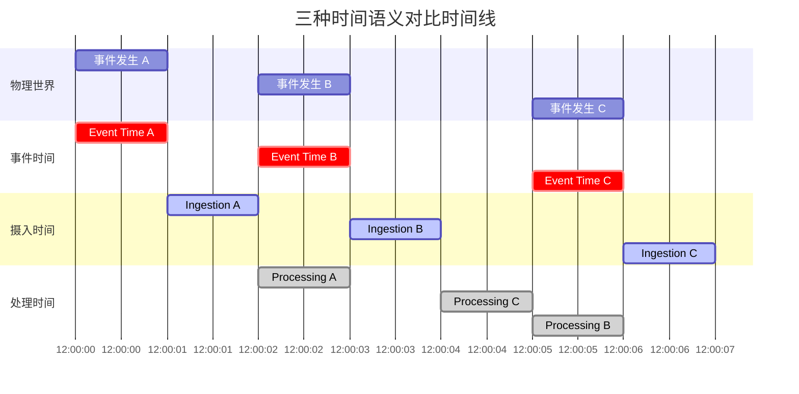
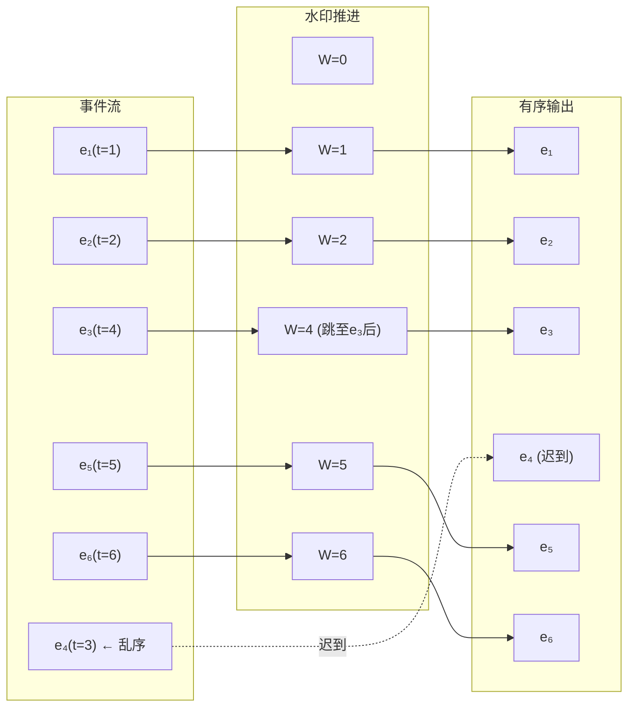
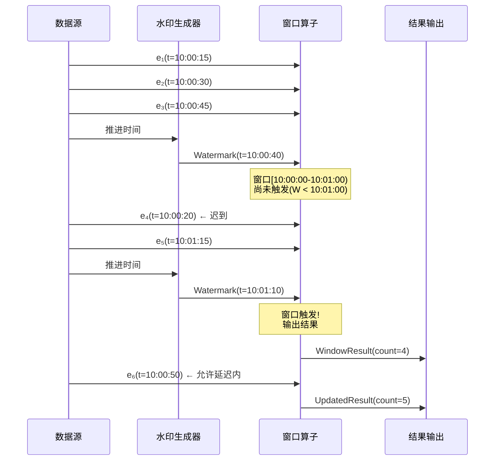
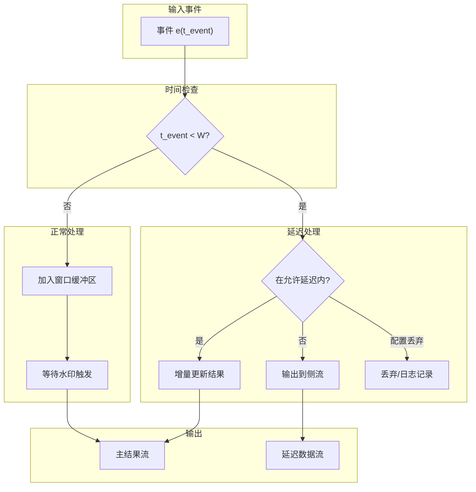
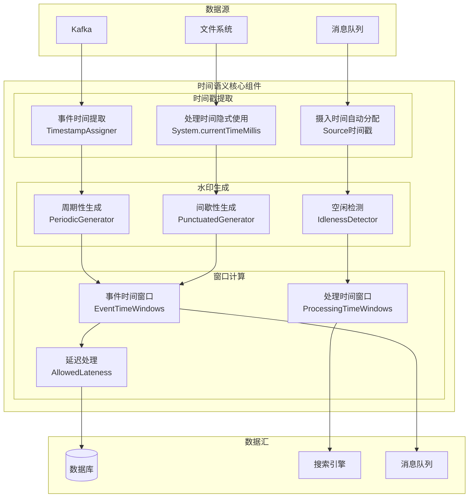

# 时间语义详解

> **所属阶段**: Knowledge/01-concept-atlas | **前置依赖**: [01.01-stream-processing-fundamentals.md](./01.01-stream-processing-fundamentals.md) | **形式化等级**: L3-L4 | **难度**: 中级 | **预计阅读时间**: 60分钟

---

## 1. 概念定义 (Definitions)

### 1.1 时间域的基本定义

**定义 1.1.1 (时间域)** [Def-K-02-01]

时间域 $\mathbb{T}$ 是一个全序集合 $(T, \leq)$，用于度量事件的发生和处理。在流处理系统中，我们主要关注三种时间域：

$$\mathbb{T} = \{ \mathbb{T}_{event}, \mathbb{T}_{proc}, \mathbb{T}_{ingest} \}$$

其中：

- $\mathbb{T}_{event}$: 事件时间域（Event Time）
- $\mathbb{T}_{proc}$: 处理时间域（Processing Time）
- $\mathbb{T}_{ingest}$: 摄入时间域（Ingestion Time）

**定义 1.1.2 (事件时间)** [Def-K-02-02]

事件时间 $t_{event}$ 是事件在实际物理世界中发生的时刻：
$$t_{event}: E \rightarrow \mathbb{T}_{event}, \quad t_{event}(e) = \text{事件发生的时间戳}$$

事件时间由事件源产生，通常嵌入在事件数据中，是客观的、不可改变的。

**定义 1.1.3 (处理时间)** [Def-K-02-03]

处理时间 $t_{proc}$ 是事件被算子处理的机器时间：
$$t_{proc}: E \times Op \rightarrow \mathbb{T}_{proc}, \quad t_{proc}(e, op) = \text{事件}e\text{被算子}op\text{处理的时间}$$

处理时间是主观的、相对的，取决于执行环境的时钟。

**定义 1.1.4 (摄入时间)** [Def-K-02-04]

摄入时间 $t_{ingest}$ 是事件进入流处理系统的时间：
$$t_{ingest}: E \rightarrow \mathbb{T}_{ingest}, \quad t_{ingest}(e) = \text{事件}e\text{到达Source的时间}$$

摄入时间介于事件时间和处理时间之间，通常由Source算子在接收事件时标记。

### 1.2 时间关系的形式化

**定义 1.2.1 (时间延迟)** [Def-K-02-05]

事件从产生到被处理的总延迟定义为：
$$\Delta t_{total}(e) = t_{proc}(e) - t_{event}(e)$$

总延迟可分解为：
$$\Delta t_{total} = \Delta t_{network} + \Delta t_{queue} + \Delta t_{compute}$$

其中：

- $\Delta t_{network}$: 网络传输延迟
- $\Delta t_{queue}$: 系统队列延迟
- $\Delta t_{compute}$: 计算处理延迟

**定义 1.2.2 (乱序度)** [Def-K-02-06]

流的乱序度（Disorder Degree）定义为事件到达顺序与事件时间顺序的偏离程度：
$$D(S) = \max_{e_i, e_j \in S} |i - j| \text{ s.t. } t_{event}(e_i) < t_{event}(e_j) \land t_{proc}(e_i) > t_{proc}(e_j)$$

对于完全有序的流，$D(S) = 0$；对于完全逆序的流，$D(S) = |S| - 1$。

**定义 1.2.3 (时间偏序)** [Def-K-02-07]

在分布式系统中，事件之间只能建立偏序关系 $\prec$（Happens-Before）：
$$e_i \prec e_j \iff t_{event}(e_i) < t_{event}(e_j) \lor (e_i \rightarrow e_j)$$

其中 $e_i \rightarrow e_j$ 表示 $e_i$ 因果影响 $e_j$。

### 1.3 水印的形式化定义

**定义 1.3.1 (水印)** [Def-K-02-08]

水印 $W$ 是一个单调不减的函数，将处理时间映射到事件时间：
$$W: \mathbb{T}_{proc} \rightarrow \mathbb{T}_{event}, \quad W(t_2) \geq W(t_1) \text{ if } t_2 \geq t_1$$

水印的核心语义承诺：
$$\forall e \in S: t_{event}(e) \leq W(t_{proc}) \Rightarrow e \text{ 已经到达或永远不会到达}$$

**定义 1.3.2 (完美水印)** [Def-K-02-09]

完美水印 $W_{perfect}$ 满足：
$$W_{perfect}(t) = \min_{e \in Pending(t)} t_{event}(e)$$

其中 $Pending(t)$ 为处理时间 $t$ 时仍未到达的事件集合。完美水印假设无延迟到达的事件。

**定义 1.3.3 (启发式水印)** [Def-K-02-10]

启发式水印 $W_{heuristic}$ 基于经验估计：
$$W_{heuristic}(t) = \max_{e \in Arrived(t)} t_{event}(e) - \delta_{lateness}$$

其中 $\delta_{lateness}$ 为估计的最大延迟，$Arrived(t)$ 为已到达事件集合。

**定义 1.3.4 (水印边界)** [Def-K-02-11]

水印与事件时间的边界（Lag）定义为：
$$Lag(t) = t - W(t)$$

当 $Lag(t) > 0$ 时，表示系统正在处理历史数据；当 $Lag(t) < 0$ 时（理论上不应发生），表示水印超前于处理时间。

### 1.4 窗口的时间语义

**定义 1.4.1 (时间窗口)** [Def-K-02-12]

时间窗口 $win$ 是事件时间轴上的一个区间：
$$win = [t_{start}, t_{end}) \subseteq \mathbb{T}_{event}$$

窗口包含所有事件时间落在区间内的事件：
$$Events(win) = \{ e \in S \mid t_{event}(e) \in win \}$$

**定义 1.4.2 (窗口触发)** [Def-K-02-13]

窗口触发条件 $Trigger$ 是一个谓词，决定何时输出窗口结果：
$$Trigger: (win, W, S) \rightarrow \{true, false\}$$

常见触发条件：

- **Watermark触发**: $Trigger_{wm} = (W \geq t_{end}(win))$
- **处理时间触发**: $Trigger_{proc} = (t_{proc} \geq t_{scheduled})$
- **计数触发**: $Trigger_{count} = (|Events(win)| \geq N)$

**定义 1.4.3 (允许延迟)** [Def-K-02-14]

允许延迟（Allowed Lateness）$\delta_{allowed}$ 扩展窗口的有效时间范围：
$$win_{effective} = [t_{start}, t_{end} + \delta_{allowed})$$

延迟到达的事件（Late Data）定义：
$$Late(win) = \{ e \in S \mid t_{event}(e) \in [t_{end}, t_{end} + \delta_{allowed}) \}$$

---

## 2. 属性推导 (Properties)

### 2.1 三种时间的基本性质

**引理 2.1.1 (时间序关系)** [Lemma-K-02-01]

对于任意事件 $e$，三种时间满足：
$$t_{event}(e) \leq t_{ingest}(e) \leq t_{proc}(e)$$

*证明*：

1. 事件必须先发生才能被系统摄入：$t_{event} \leq t_{ingest}$
2. 事件必须先被摄入才能被处理：$t_{ingest} \leq t_{proc}$

由传递性得证。∎

**引理 2.1.2 (事件时间的单调性)** [Lemma-K-02-02]

事件时间 $t_{event}$ 在物理世界中是单调不减的：
$$\forall i < j: t_{event}(e_i) \leq t_{event}(e_j)$$

但事件到达系统时，$t_{event}$ 的顺序可能被破坏（乱序）。

**引理 2.1.3 (处理时间的非确定性)** [Lemma-K-02-03]

处理时间 $t_{proc}$ 具有非确定性：
$$\forall e, op: t_{proc}(e, op) \sim \mathcal{N}(\mu, \sigma^2)$$

即同一事件在同一算子上的处理时间服从某种概率分布，受系统负载、资源竞争等因素影响。

### 2.2 水印的核心性质

**定理 2.2.1 (水印的单调性保证)** [Thm-K-02-01]

正确实现的水印函数满足单调不减：
$$\forall t_1, t_2 \in \mathbb{T}_{proc}: t_1 \leq t_2 \Rightarrow W(t_1) \leq W(t_2)$$

*证明*：

假设水印在某时刻后退：$\exists t_1 < t_2: W(t_1) > W(t_2)$

设 $W(t_1) = \tau_1$, $W(t_2) = \tau_2$，且 $\tau_1 > \tau_2$。

根据水印语义，在 $t_1$ 时刻，系统承诺所有事件时间 $\leq \tau_1$ 的事件已经到达或永远不会到达。

但在 $t_2 > t_1$ 时刻，水印 $\tau_2 < \tau_1$，这意味着某些事件时间 $\in (\tau_2, \tau_1]$ 的事件可能还未到达，与 $t_1$ 时刻的承诺矛盾。

因此水印必须单调不减。∎

**定理 2.2.2 (水印的完整性保证)** [Thm-K-02-02]

设窗口 $win = [t_s, t_e]$，在水印 $W \geq t_e$ 触发时，结果包含所有非延迟到达的事件：
$$Result(win)|_{W \geq t_e} = \bigoplus_{e \in Events(win) \setminus Late(win)} v(e)$$

*证明*：

1. 对于非延迟事件 $e \in Events(win) \setminus Late(win)$：
   - $t_{event}(e) \leq t_e \leq W(t_{trigger})$
   - 根据水印语义，$e$ 在触发前已经到达
   - 因此 $e$ 被包含在结果中

2. 对于延迟事件 $e \in Late(win)$：
   - 由定义，$e$ 在水印触发后才到达
   - 根据允许延迟策略，可能通过侧输出处理

3. 对于事件时间 $> t_e$ 的事件：
   - 不属于该窗口
   - 不会被包含

综上，结果包含所有应包含的非延迟事件。∎

**引理 2.2.1 (水印滞后与延迟的权衡)** [Lemma-K-02-04]

设水印滞后为 $Lag(t) = t - W(t)$，系统处理延迟为 $\mathcal{L}$，则：
$$\mathcal{L} \propto Lag(t)$$

即水印滞后越大，结果等待时间越长，延迟越高。

*证明*：窗口触发必须等待水印达到 $t_e$，而水印推进速度为 $dW/dt \approx 1 - d(Lag)/dt$。较大的 $Lag$ 意味着水印需要更长时间才能达到触发阈值。∎

### 2.3 乱序处理的性质

**定理 2.3.1 (乱序的必然性)** [Thm-K-02-03]

在分布式系统中，乱序事件必然存在：
$$\forall S_{distributed}: D(S) > 0$$

*证明*：

考虑两个独立的数据源 $A$ 和 $B$：

- $e_A$ 在 $t=0$ 产生，经网络延迟 $\delta_A$ 到达
- $e_B$ 在 $t=\epsilon$ 产生（$\epsilon$ 极小），经网络延迟 $\delta_B$ 到达

网络延迟具有不确定性：
$$\delta \sim \mathcal{U}(\delta_{min}, \delta_{max})$$

若 $\delta_B < \delta_A - \epsilon$，则 $e_B$ 先于 $e_A$ 到达，形成乱序。

由于网络延迟分布连续且独立，$P(\delta_B < \delta_A - \epsilon) > 0$，因此乱序必然存在。∎

**定理 2.3.2 (乱序度的有界性条件)** [Thm-K-02-04]

若网络延迟上界为 $\delta_{max}$，则乱序度有界：
$$D(S) \leq \frac{2\delta_{max}}{\lambda_{min}}$$

其中 $\lambda_{min}$ 为最小事件间隔。

*证明*：

考虑事件 $e_i$ 和 $e_{i+k}$：

- $e_i$ 产生时间 $t_i$，到达时间 $t_i + \delta_i$
- $e_{i+k}$ 产生时间 $t_i + k\lambda$，到达时间 $t_i + k\lambda + \delta_{i+k}$

乱序发生时：
$$t_i + \delta_i > t_i + k\lambda + \delta_{i+k}$$
$$\Rightarrow k\lambda < \delta_i - \delta_{i+k} \leq 2\delta_{max}$$

因此 $k \leq \frac{2\delta_{max}}{\lambda}$，乱序度有界。∎

---

## 3. 关系建立 (Relations)

### 3.1 时间语义与一致性模型的关系

**定义 3.1.1 (时间一致性)** [Def-K-02-15]

时间一致性是指处理结果与基于事件时间的离线计算结果的一致性：
$$Consistency_{time} = \{ Eventual, Strong, Causal \}$$

**定理 3.1.1 (事件时间与Exactly-Once的关系)** [Thm-K-02-05]

基于事件时间的处理配合Exactly-Once语义可实现确定性结果：
$$EventTime + ExactlyOnce \Rightarrow DeterministicResult$$

*证明*：

1. 事件时间确定了计算的基准时间线
2. Exactly-Once保证了每个事件只被处理一次
3. 水印机制确定了计算的触发点
4. 因此给定相同的输入事件集合，结果唯一确定

### 3.2 时间语义与窗口策略的关系

**定义 3.2.1 (时间窗口分类)** [Def-K-02-16]

基于不同时间维度的窗口策略：

| 窗口类型 | 时间基准 | 特性 | 适用场景 |
|---------|---------|------|---------|
| 事件时间窗口 | $\mathbb{T}_{event}$ | 确定性、可重放 | 需要准确性的分析 |
| 处理时间窗口 | $\mathbb{T}_{proc}$ | 低延迟、简单 | 实时监控、近似分析 |
| 摄入时间窗口 | $\mathbb{T}_{ingest}$ | 平衡性 | 中等延迟要求的场景 |

**定理 3.2.1 (窗口语义等价性)** [Thm-K-02-06]

在完美网络条件下（零延迟、有序），三种窗口语义等价：
$$\delta_{network} = 0 \land D(S) = 0 \Rightarrow EventTimeWin \equiv ProcTimeWin \equiv IngestTimeWin$$

### 3.3 水印与分布式快照的关系

**定义 3.3.1 (分布式快照)** [Def-K-02-17]

分布式快照（Chandy-Lamport算法）捕获全局一致性状态：
$$Snapshot = \{ State_{op} \mid op \in Operators \} \cup \{ InFlight_{messages} \}$$

**定理 3.3.1 (水印作为逻辑快照)** [Thm-K-02-07]

水印 $W$ 可视为事件时间 $t \leq W$ 的逻辑快照边界：
$$Snapshot(W) = \{ e \in S \mid t_{event}(e) \leq W \}$$

*证明*：

1. 水印 $W$ 承诺所有 $t_{event} \leq W$ 的事件已经到达
2. 因此这些事件构成的集合是完整的
3. 该集合可作为一致性检查点的基础

### 3.4 时间语义与SQL的关系

**定义 3.4.1 (流SQL的时间扩展)** [Def-K-02-18]

流SQL对标准SQL的时间扩展：

```sql
-- 事件时间窗口
SELECT
    TUMBLE_START(event_time, INTERVAL '1' HOUR) as window_start,
    user_id,
    COUNT(*) as event_count
FROM events
GROUP BY
    TUMBLE(event_time, INTERVAL '1' HOUR),
    user_id

-- 处理时间窗口
SELECT
    TUMBLE_START(PROCTIME(), INTERVAL '5' MINUTE) as window_start,
    COUNT(*) as event_count
FROM events
GROUP BY TUMBLE(PROCTIME(), INTERVAL '5' MINUTE)
```

**定理 3.4.1 (流SQL的时间完备性)** [Thm-K-02-08]

流SQL的时间扩展在表达能力上等价于Dataflow模型的时间语义：
$$StreamSQL_{time} \equiv Dataflow_{time}$$

---

## 4. 论证过程 (Argumentation)

### 4.1 为什么选择事件时间

**论题 4.1.1 (事件时间的优势)**

在流处理中，事件时间应作为首选的时间语义。

**论证**:

1. **结果确定性**:
   - 事件时间是客观、不变的
   - 基于事件时间的计算可重放、可验证
   - 批处理和流处理可产生一致结果

2. **乱序处理能力**:
   - 事件时间能正确处理乱序到达的事件
   - 水印机制提供完整的延迟处理框架

3. **业务语义匹配**:
   - 业务分析通常基于事件发生时间
   - 处理时间无法反映业务真实时序

**反例分析**: 处理时间窗口的问题

假设每小时统计订单金额：

- **12:00事件** 因网络延迟在 **12:05** 到达
- **12:03事件** 正常到达

若使用处理时间窗口：

- 12:00事件被计入12:05窗口，业务上错误
- 12:03事件计入正确窗口

若使用事件时间窗口：

- 两个事件都按实际发生时间统计，结果正确

### 4.2 水印策略的权衡分析

**论题 4.2.1 (水印策略的权衡)**

不同的水印策略在延迟和完整性之间存在权衡。

**策略对比**:

| 策略 | 实现方式 | 延迟 | 完整性 | 适用场景 |
|------|---------|------|--------|---------|
| 完美水印 | 假设有序到达 | 最低 | 可能丢失数据 | 内部系统、有序源 |
| 固定延迟水印 | $W = max(t_{event}) - \delta$ | 中等 | 可配置 | 一般场景 |
| 启发式水印 | 基于历史统计 | 自适应 | 统计保证 | 复杂网络环境 |
| 无水印 | 立即触发 | 最低 | 不完整 | 近似计算 |

**成本分析**:

设水印延迟为 $\delta$，则：

- **延迟成本**: $C_{latency} = f(\delta)$，通常线性增长
- **数据丢失风险**: $P_{loss} = P(t_{arrive} - t_{event} > \delta)$
- **总成本**: $C_{total} = C_{latency} + \lambda \cdot P_{loss}$（$\lambda$ 为数据价值系数）

最优水印延迟满足：
$$\frac{dC_{total}}{d\delta} = 0 \Rightarrow \frac{df}{d\delta} = -\lambda \cdot \frac{dP_{loss}}{d\delta}$$

### 4.3 延迟数据处理的策略

**论题 4.3.1 (延迟数据的处理策略)**

延迟到达的数据应根据业务需求采用不同策略。

**策略矩阵**:

```
                    延迟重要性
                    低        高
                  ┌─────────┬─────────┐
         低       │  丢弃   │  增量   │
到达频率          │ Drop   │ Update │
                  ├─────────┼─────────┤
         高       │  近似   │  重算   │
                  │Approx  │Recompute│
                  └─────────┴─────────┘
```

**策略详解**:

1. **丢弃策略 (Drop)**:
   - 实现：忽略延迟到达的事件
   - 优点：简单、低延迟
   - 缺点：结果不完整
   - 适用：近似计算、延迟数据价值低

2. **增量更新 (Incremental Update)**:
   - 实现：更新已输出结果
   - 优点：保持数据新鲜度
   - 缺点：增加系统复杂性
   - 适用：需要最终一致性的场景

3. **近似处理 (Approximate)**:
   - 实现：使用估计算法处理延迟数据
   - 优点：平衡延迟和准确性
   - 缺点：结果有误差
   - 适用：大规模数据、可接受近似结果

4. **重新计算 (Recompute)**:
   - 实现：重放历史数据重新计算
   - 优点：结果最准确
   - 缺点：资源消耗大
   - 适用：关键业务、数据修正

---

## 5. 形式证明 / 工程论证 (Proof / Engineering Argument)

### 5.1 水印正确性定理

**定理 5.1.1 (水印完整性的充分必要条件)** [Thm-K-02-09]

设水印生成策略为 $W$，系统产生正确完整结果的充分必要条件是：
$$\forall e \in S: t_{event}(e) \leq W(t_{arrive}(e) + \epsilon)$$

其中 $\epsilon$ 为极小正数。

*形式化证明*:

**必要性证明**:

假设存在事件 $e$ 满足 $t_{event}(e) \leq W(t_{arrive}(e))$ 不成立。

即：$t_{event}(e) > W(t_{arrive}(e))$

这意味着在 $e$ 到达时，水印已经超过了 $e$ 的事件时间，窗口可能已经触发。

因此 $e$ 被错误地排除在结果之外，完整性被破坏。

**充分性证明**:

假设对所有事件 $e$，都有 $t_{event}(e) \leq W(t_{arrive}(e) + \epsilon)$。

考虑任意窗口 $win = [t_s, t_e]$：

当水印推进到 $W \geq t_e$ 时触发。

对于任意事件 $e$ 满足 $t_{event}(e) \in [t_s, t_e]$：

- 若 $e$ 已到达：被包含在窗口计算中
- 若 $e$ 未到达：由条件，$W(t_{arrive}(e) + \epsilon) \geq t_{event}(e) > W(t_{current})$，矛盾

因此所有应到达的事件都已到达，结果完整。∎

### 5.2 乱序处理算法的正确性

**定理 5.2.1 (基于优先队列的乱序处理正确性)** [Thm-K-02-10]

使用优先队列（按事件时间排序）和缓冲机制的乱序处理算法产生正确的有序输出。

*算法描述*:

```
算法: OutOfOrderProcessor
输入: 乱序事件流 S,水印策略 W,缓冲区大小 B
输出: 有序事件流 S_ordered

初始化: priority_queue Q ← ∅

对于每个到达的事件 e:
    Q.insert(e, key=t_event(e))

    当 Q.peek().t_event ≤ W(current_time):
        e_ordered ← Q.extract_min()
        输出 e_ordered

    当 Q.size > B:
        // 缓冲区溢出处理
        e_overflow ← Q.extract_min()
        输出到延迟数据流
```

*正确性证明*:

**引理**: 当事件 $e$ 从优先队列中输出时，所有事件时间 $t \leq t_{event}(e)$ 的事件要么已输出，要么已到达且在队列中。

*归纳证明*:

**基础**: 第一个输出的事件 $e_1$ 满足 $t_{event}(e_1) \leq W$，根据水印定义，所有事件时间 $\leq t_{event}(e_1)$ 的事件已经到达，因此已排序。

**归纳**: 假设前 $k$ 个输出事件有序。对于第 $k+1$ 个事件 $e_{k+1}$：

- 由优先队列性质，$t_{event}(e_{k+1}) = \min_{e \in Q} t_{event}(e)$
- 由水印条件，所有事件时间 $\leq W$ 的事件已经到达
- 由于 $t_{event}(e_{k+1}) \leq W$，所有更小的事件时间的事件要么已输出，要么不可能存在（否则会在队列前端）

因此输出保持有序。∎

### 5.3 时间语义的实现复杂度分析

**工程定理 5.3.1 (事件时间实现复杂度)** [Thm-K-02-11]

事件时间语义的实现复杂度为 $O(n \log n + m)$，其中 $n$ 为事件数，$m$ 为窗口数。

*分析*:

1. **时间戳分配**: $O(n)$
2. **水印生成**: 每个源算子 $O(1)$，总体 $O(k)$（$k$ 为分区数）
3. **事件缓冲与排序**: 优先队列插入 $O(\log n)$，总体 $O(n \log n)$
4. **窗口管理**: 每个事件可能触发窗口计算，$O(m)$

相比之下，处理时间语义复杂度仅为 $O(n)$。

**权衡建议**:

- 数据量小、准确性要求高：使用事件时间
- 数据量大、延迟要求高：使用处理时间或启发式水印

---

## 6. 实例验证 (Examples)

### 6.1 三种时间的配置示例

**示例 6.1.1: 事件时间处理（Flink）**

```java
import org.apache.flink.api.common.eventtime.*;
import org.apache.flink.streaming.api.environment.StreamExecutionEnvironment;

import org.apache.flink.streaming.api.datastream.DataStream;
import org.apache.flink.api.common.eventtime.WatermarkStrategy;
import org.apache.flink.streaming.api.windowing.time.Time;


public class EventTimeExample {
    public static void main(String[] args) {
        StreamExecutionEnvironment env =
            StreamExecutionEnvironment.getExecutionEnvironment();

        // 设置事件时间语义
        // 使用WatermarkStrategy替代已弃用的setStreamTimeCharacteristic
env.getConfig().setAutoWatermarkInterval(200);
        // 配置水印生成策略
        WatermarkStrategy<MyEvent> strategy = WatermarkStrategy
            // 允许5秒乱序
            .<MyEvent>forBoundedOutOfOrderness(Duration.ofSeconds(5))
            // 自定义时间戳提取
            .withTimestampAssigner((event, timestamp) -> event.getEventTime());

        DataStream<MyEvent> stream = env
            .fromSource(source, strategy, "Event Source")
            .keyBy(MyEvent::getUserId)
            .window(TumblingEventTimeWindows.of(Time.minutes(1)))
            .allowedLateness(Time.seconds(30))  // 允许30秒延迟
            .sideOutputLateData(lateDataTag)     // 延迟数据侧输出
            .aggregate(new MyAggregator());
    }
}
```

**示例 6.1.2: 处理时间处理（Flink）**

```java
import org.apache.flink.streaming.api.environment.StreamExecutionEnvironment;

import org.apache.flink.streaming.api.datastream.DataStream;
import org.apache.flink.streaming.api.windowing.time.Time;


public class ProcessingTimeExample {
    public static void main(String[] args) {
        StreamExecutionEnvironment env =
            StreamExecutionEnvironment.getExecutionEnvironment();

        // 设置处理时间语义
        // 处理时间语义 - 不需要显式设置WatermarkStrategy
// Flink 1.12+ 默认使用事件时间,处理时间窗口使用ProcessingTimeWindow
        // 处理时间不需要水印策略
        DataStream<Event> stream = env
            .fromSource(source, WatermarkStrategy.noWatermarks(), "Source")
            .keyBy(Event::getKey)
            // 处理时间窗口
            .window(TumblingProcessingTimeWindows.of(Time.seconds(10)))
            .aggregate(new CountAggregate());
    }
}
```

**示例 6.1.3: 摄入时间处理（Flink）**

```java
import org.apache.flink.streaming.api.environment.StreamExecutionEnvironment;

import org.apache.flink.streaming.api.datastream.DataStream;
import org.apache.flink.streaming.api.windowing.time.Time;


public class IngestionTimeExample {
    public static void main(String[] args) {
        StreamExecutionEnvironment env =
            StreamExecutionEnvironment.getExecutionEnvironment();

        // 设置摄入时间语义
        // 摄入时间语义 - 使用WatermarkStrategy.forMonotonousTimestamps()
// 注意: Flink 1.12+ 建议使用事件时间替代摄入时间
        // 摄入时间自动使用源的系统时间
        DataStream<Event> stream = env
            .fromSource(source, WatermarkStrategy.forMonotonousTimestamps(), "Source")
            .keyBy(Event::getKey)
            .window(TumblingEventTimeWindows.of(Time.minutes(1)))
            .aggregate(new AverageAggregate());
    }
}
```

### 6.2 水印策略的详细配置

**示例 6.2.1: 周期性水印生成**

```java

import org.apache.flink.api.common.eventtime.WatermarkStrategy;

public class PeriodicWatermarkGenerator implements WatermarkGenerator<MyEvent> {

    private long maxTimestamp = Long.MIN_VALUE;
    private final long maxOutOfOrderness;

    public PeriodicWatermarkGenerator(Duration maxOutOfOrderness) {
        this.maxOutOfOrderness = maxOutOfOrderness.toMillis();
    }

    @Override
    public void onEvent(MyEvent event, long eventTimestamp, WatermarkOutput output) {
        // 更新最大时间戳
        maxTimestamp = Math.max(maxTimestamp, eventTimestamp);
    }

    @Override
    public void onPeriodicEmit(WatermarkOutput output) {
        // 周期性发射水印(默认每200ms)
        long watermark = maxTimestamp - maxOutOfOrderness;
        output.emitWatermark(new Watermark(watermark));
    }
}

// 使用自定义水印生成器
WatermarkStrategy<MyEvent> customStrategy = WatermarkStrategy
    .forGenerator(ctx -> new PeriodicWatermarkGenerator(Duration.ofSeconds(5)))
    .withTimestampAssigner((event, timestamp) -> event.getEventTime());
```

**示例 6.2.2: 间歇性水印生成（Punctuated）**

```java
public class PunctuatedWatermarkGenerator implements WatermarkGenerator<MyEvent> {

    @Override
    public void onEvent(MyEvent event, long eventTimestamp, WatermarkOutput output) {
        // 根据事件类型决定是否发射水印
        if (event.isWatermarkSignal()) {
            output.emitWatermark(new Watermark(eventTimestamp - 1000));
        }
    }

    @Override
    public void onPeriodicEmit(WatermarkOutput output) {
        // 间歇性策略不依赖周期性发射
    }
}
```

**示例 6.2.3: 水印空闲超时配置**

```java

// [伪代码片段 - 不可直接运行] 仅展示核心逻辑
import org.apache.flink.api.common.eventtime.WatermarkStrategy;

// 处理分区无数据的情况
WatermarkStrategy<MyEvent> strategyWithIdleness = WatermarkStrategy
    .<MyEvent>forBoundedOutOfOrderness(Duration.ofSeconds(5))
    .withTimestampAssigner((event, timestamp) -> event.getEventTime())
    .withIdleness(Duration.ofMinutes(1));  // 1分钟无数据视为空闲
```

### 6.3 延迟数据处理

**示例 6.3.1: 延迟数据侧输出**

```java

import org.apache.flink.streaming.api.environment.StreamExecutionEnvironment;
import org.apache.flink.streaming.api.datastream.DataStream;
import org.apache.flink.api.common.functions.AggregateFunction;
import org.apache.flink.streaming.api.windowing.time.Time;

public class LateDataHandlingExample {

    // 定义侧输出标签
    private static final OutputTag<Event> lateDataTag =
        new OutputTag<Event>("late-data") {};

    public static void main(String[] args) throws Exception {
        StreamExecutionEnvironment env =
            StreamExecutionEnvironment.getExecutionEnvironment();

        SingleOutputStreamOperator<WindowResult> result = env
            .fromSource(source, watermarkStrategy, "Source")
            .keyBy(Event::getKey)
            .window(TumblingEventTimeWindows.of(Time.minutes(5)))
            .allowedLateness(Time.minutes(2))  // 允许2分钟延迟
            .sideOutputLateData(lateDataTag)   // 延迟数据输出到侧流
            .aggregate(new WindowAggregateFunction());

        // 获取延迟数据流
        DataStream<Event> lateStream = result.getSideOutput(lateDataTag);

        // 处理延迟数据:写入日志或单独存储
        lateStream.addSink(new LateDataLogger());

        // 主结果流输出
        result.addSink(new ResultSink());

        env.execute();
    }
}
```

**示例 6.3.2: 延迟数据增量更新**

```java

import org.apache.flink.streaming.api.environment.StreamExecutionEnvironment;
import org.apache.flink.streaming.api.datastream.DataStream;
import org.apache.flink.api.common.state.ValueState;
import org.apache.flink.api.common.state.ValueStateDescriptor;

public class IncrementalLateDataUpdate {

    public static void main(String[] args) {
        StreamExecutionEnvironment env =
            StreamExecutionEnvironment.getExecutionEnvironment();

        env.setStateBackend(new RocksDBStateBackend("hdfs://checkpoints"));

        DataStream<Event> stream = env.fromSource(source, watermarkStrategy, "Source");

        // 使用ProcessFunction实现增量更新
        SingleOutputStreamOperator<Result> updatedResults = stream
            .keyBy(Event::getKey)
            .process(new IncrementalUpdateFunction());
    }

    static class IncrementalUpdateFunction extends KeyedProcessFunction<String, Event, Result> {

        // 状态:存储窗口结果
        private ValueState<WindowResult> resultState;
        // 状态:存储已见事件
        private ListState<Event> eventState;

        @Override
        public void open(Configuration parameters) {
            resultState = getRuntimeContext().getState(
                new ValueStateDescriptor<>("result", WindowResult.class));
            eventState = getRuntimeContext().getListState(
                new ListStateDescriptor<>("events", Event.class));
        }

        @Override
        public void processElement(Event event, Context ctx, Collector<Result> out)
                throws Exception {

            long eventTime = event.getTimestamp();
            long watermark = ctx.timerService().currentWatermark();

            // 检查是否为延迟数据
            if (eventTime < watermark) {
                // 延迟数据处理
                eventState.add(event);

                // 重新计算结果
                WindowResult currentResult = resultState.value();
                if (currentResult != null) {
                    WindowResult updatedResult = recalculate(currentResult, event);
                    resultState.update(updatedResult);
                    out.collect(new Result(updatedResult, true)); // 标记为更新结果
                }
            } else {
                // 正常数据,加入窗口计算
                eventState.add(event);
            }
        }

        @Override
        public void onTimer(long timestamp, OnTimerContext ctx, Collector<Result> out) {
            // 窗口触发时计算并输出结果
        }

        private WindowResult recalculate(WindowResult current, Event lateEvent) {
            // 增量重算逻辑
            return current.updateWith(lateEvent);
        }
    }
}
```

### 6.4 完整的时间语义管道

**示例 6.4.1: 电商订单实时分析管道**

```java

import org.apache.flink.streaming.api.environment.StreamExecutionEnvironment;
import org.apache.flink.streaming.api.datastream.DataStream;
import org.apache.flink.api.common.state.ValueState;
import org.apache.flink.api.common.state.ValueStateDescriptor;
import org.apache.flink.api.common.functions.AggregateFunction;
import org.apache.flink.streaming.api.windowing.time.Time;

public class OrderAnalyticsPipeline {

    public static void main(String[] args) throws Exception {
        StreamExecutionEnvironment env =
            StreamExecutionEnvironment.getExecutionEnvironment();

        // 配置事件时间和检查点
        // 使用WatermarkStrategy替代已弃用的setStreamTimeCharacteristic
env.getConfig().setAutoWatermarkInterval(200);
        env.enableCheckpointing(60000);
        env.getCheckpointConfig().setCheckpointTimeout(300000);

        // 订单事件源
        DataStream<OrderEvent> orders = env
            .fromSource(
                KafkaSource.<OrderEvent>builder()
                    .setBootstrapServers("kafka:9092")
                    .setTopics("orders")
                    .setGroupId("order-analytics")
                    .setValueOnlyDeserializer(new OrderDeserializationSchema())
                    .build(),
                WatermarkStrategy
                    .<OrderEvent>forBoundedOutOfOrderness(Duration.ofSeconds(30))
                    .withTimestampAssigner((order, ts) -> order.getOrderTime())
                    .withIdleness(Duration.ofMinutes(5)),
                "Order Source"
            );

        // 侧输出标签定义
        final OutputTag<OrderEvent> lateOrdersTag = new OutputTag<OrderEvent>("late-orders") {};
        final OutputTag<Alert> fraudAlertTag = new OutputTag<Alert>("fraud-alerts") {};

        // 1. 每小时销售额统计(事件时间窗口)
        SingleOutputStreamOperator<HourlySales> hourlySales = orders
            .keyBy(OrderEvent::getCategory)
            .window(TumblingEventTimeWindows.of(Time.hours(1)))
            .allowedLateness(Time.minutes(10))
            .sideOutputLateData(lateOrdersTag)
            .aggregate(
                new AggregateFunction<OrderEvent, SalesAcc, HourlySales>() {
                    @Override
                    public SalesAcc createAccumulator() {
                        return new SalesAcc();
                    }

                    @Override
                    public SalesAcc add(OrderEvent order, SalesAcc acc) {
                        acc.count++;
                        acc.totalAmount += order.getAmount();
                        return acc;
                    }

                    @Override
                    public HourlySales getResult(SalesAcc acc) {
                        return new HourlySales(acc.count, acc.totalAmount);
                    }

                    @Override
                    public SalesAcc merge(SalesAcc a, SalesAcc b) {
                        a.count += b.count;
                        a.totalAmount += b.totalAmount;
                        return a;
                    }
                }
            );

        // 2. 5分钟滑动窗口实时监控(处理时间窗口用于快速响应)
        DataStream<Metric> realTimeMetrics = orders
            .windowAll(TumblingProcessingTimeWindows.of(Time.minutes(5)))
            .aggregate(new RealTimeMetricsAggregate());

        // 3. 会话窗口分析用户行为
        DataStream<UserSession> sessions = orders
            .keyBy(OrderEvent::getUserId)
            .window(EventTimeSessionWindows.withDynamicGap(
                (OrderEvent order) -> Time.minutes(30)))
            .aggregate(new SessionAggregator());

        // 4. 异常检测(低延迟,使用处理时间)
        SingleOutputStreamOperator<OrderEvent> validatedOrders = orders
            .process(new FraudDetectionFunction(fraudAlertTag));

        DataStream<Alert> fraudAlerts = validatedOrders.getSideOutput(fraudAlertTag);

        // 5. 订单流与支付流关联(基于事件时间的Interval Join)
        DataStream<PaymentEvent> payments = env
            .fromSource(paymentSource, paymentWatermarkStrategy, "Payment Source");

        DataStream<EnrichedOrder> enrichedOrders = orders
            .keyBy(OrderEvent::getOrderId)
            .intervalJoin(payments.keyBy(PaymentEvent::getOrderId))
            .between(Time.minutes(-5), Time.minutes(30))  // 订单前后时间范围
            .process(new OrderPaymentJoinFunction());

        // Sink配置
        hourlySales.addSink(new ClickHouseSink<>("hourly_sales"));
        realTimeMetrics.addSink(new PrometheusSink());
        fraudAlerts.addSink(new AlertSink());
        enrichedOrders.addSink(new ElasticsearchSink<>());

        env.execute("Order Analytics Pipeline");
    }
}

// 欺诈检测ProcessFunction
class FraudDetectionFunction extends ProcessFunction<OrderEvent, OrderEvent> {

    private final OutputTag<Alert> alertTag;
    private ValueState<FraudPatternState> fraudState;

    public FraudDetectionFunction(OutputTag<Alert> alertTag) {
        this.alertTag = alertTag;
    }

    @Override
    public void open(Configuration parameters) {
        fraudState = getRuntimeContext().getState(
            new ValueStateDescriptor<>("fraud-state", FraudPatternState.class));
    }

    @Override
    public void processElement(OrderEvent order, Context ctx, Collector<OrderEvent> out)
            throws Exception {

        FraudPatternState state = fraudState.value();
        if (state == null) {
            state = new FraudPatternState();
        }

        // 使用处理时间进行快速检测
        long procTime = ctx.timerService().currentProcessingTime();

        // 检测规则:1分钟内同一用户超过5笔订单
        if (procTime - state.lastResetTime > 60000) {
            state.orderCount = 0;
            state.lastResetTime = procTime;
        }

        state.orderCount++;
        fraudState.update(state);

        if (state.orderCount > 5) {
            ctx.output(alertTag, new Alert("SUSPICIOUS_ACTIVITY", order.getUserId()));
        }

        out.collect(order);
    }
}
```

### 6.5 Python API示例

**示例 6.5.1: PyFlink时间语义配置**

```python
from pyflink.datastream import StreamExecutionEnvironment
from pyflink.datastream.window import TumblingEventTimeWindows
from pyflink.common.watermark_strategy import WatermarkStrategy
from pyflink.common.time import Duration

# 创建环境 env = StreamExecutionEnvironment.get_execution_environment()

# 事件时间处理 watermark_strategy = (WatermarkStrategy
    .for_bounded_out_of_orderness(Duration.of_seconds(5))
    .with_timestamp_assigner(lambda event, timestamp: event['event_time']))

# 从Kafka读取 deserializer = JsonDeserializationSchema.builder() \
    .type_info(type_info=Types.ROW([...])) \
    .build()

source = KafkaSource.builder() \
    .set_bootstrap_servers("kafka:9092") \
    .set_topics("events") \
    .set_group_id("pyflink-group") \
    .set_value_only_deserializer(deserializer) \
    .build()

stream = env.from_source(
    source,
    watermark_strategy,
    "Kafka Source"
)

# 窗口聚合 result = stream \
    .key_by(lambda x: x['user_id']) \
    .window(TumblingEventTimeWindows.of(Time.minutes(1))) \
    .allowed_lateness(Time.seconds(30)) \
    .aggregate(AverageAggregateFunction())

# 输出 result.print()

env.execute("PyFlink Time Semantics Example")
```

---

## 7. 可视化 (Visualizations)

### 7.1 三种时间语义对比



### 7.2 水印推进机制



### 7.3 窗口与水印交互



### 7.4 延迟数据处理流程



### 7.5 时间语义架构图



---

## 8. 引用参考 (References)


---

## 附录: 时间语义决策树

```
选择时间语义
│
├─ 需要结果可重放、确定性？
│  ├─ 是 → 选择事件时间
│  │        ├─ 乱序程度如何？
│  │        │  ├─ 有序 → forMonotonousTimestamps()
│  │        │  └─ 乱序 → forBoundedOutOfOrderness(δ)
│  │        │
│  │        └─ 延迟数据如何处理？
│  │           ├─ 丢弃 → 不配置
│  │           ├─ 允许延迟 → allowedLateness()
│  │           └─ 侧输出 → sideOutputLateData()
│  │
│  └─ 否 → 延迟要求如何？
│         ├─ 毫秒级 → 选择处理时间
│         └─ 秒级 → 选择摄入时间
│
└─ 数据源有空闲分区？
   └─ 是 → withIdleness(timeout)
```

---

> **文档信息**
>
> - 版本: v1.0
> - 最后更新: 2026-04-11
> - 维护者: Knowledge Team
> - 相关文档: [01.01-stream-processing-fundamentals.md](./01.01-stream-processing-fundamentals.md), [01.03-window-concepts.md](./01.03-window-concepts.md)
