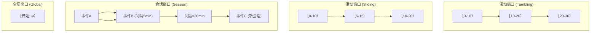
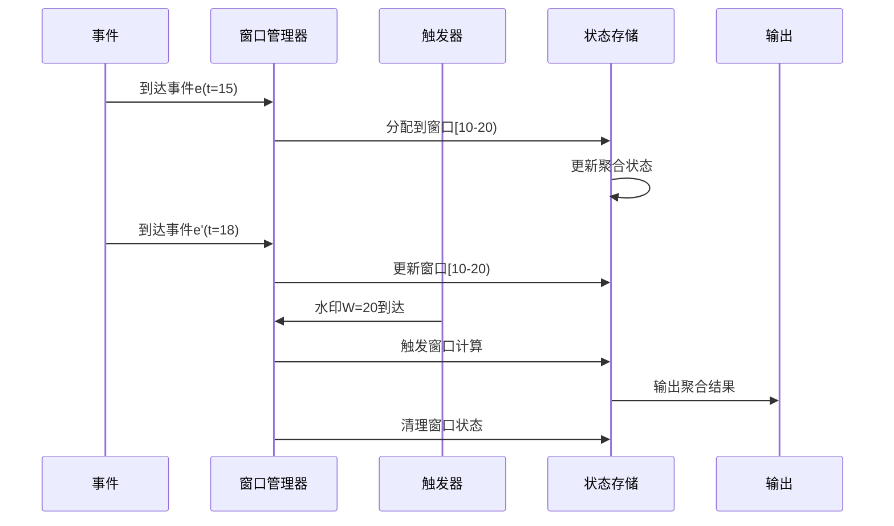

# 窗口概念详解

> **所属阶段**: Knowledge/01-concept-atlas | **前置依赖**: [01.02-time-semantics.md](./01.02-time-semantics.md) | **形式化等级**: L3-L4 | **难度**: 中级 | **预计阅读时间**: 50分钟

---

## 1. 概念定义 (Definitions)

### 1.1 窗口的基本定义

**定义 1.1.1 (窗口)** [Def-K-03-01]

窗口（Window）是数据流上的一个有限子集，用于将无限流切分为有限的数据块进行计算。形式化定义为：
$$W: S \rightarrow 2^S, \quad W(S) = \{ w_1, w_2, \ldots, w_n \}$$

其中每个窗口 $w_i$ 满足：

- **有限性**: $|w_i| < \infty$（时间窗口）或存在明确的计数上限
- **不相交性或重叠性**: 根据窗口类型，窗口之间可能不相交或有重叠
- **完备性**: $\bigcup_i w_i \subseteq S$（对于已到达数据）

**定义 1.1.2 (时间窗口)** [Def-K-03-02]

时间窗口是基于事件时间域 $\mathbb{T}$ 的区间：
$$win_{time} = [t_{start}, t_{end}) \subseteq \mathbb{T}$$

窗口包含所有事件时间落在该区间内的事件：
$$Events(win_{time}) = \{ e \in S \mid t_{event}(e) \in [t_{start}, t_{end}) \}$$

**定义 1.1.3 (计数窗口)** [Def-K-03-03]

计数窗口是基于元素数量的窗口，定义为：
$$win_{count} = \{ e_i \in S \mid i \in [n \cdot N, (n+1) \cdot N) \}$$

其中 $N$ 为窗口大小（元素数），$n$ 为窗口序号。

### 1.2 窗口类型的形式化定义

**定义 1.2.1 (滚动窗口 - Tumbling Window)** [Def-K-03-04]

滚动窗口将时间轴划分为固定长度且互不重叠的连续区间：
$$win_{tumbling}(k) = [k \cdot \Delta t, (k+1) \cdot \Delta t), \quad k \in \mathbb{N}$$

其中 $\Delta t$ 为窗口大小。滚动窗口满足不相交性：
$$\forall i \neq j: win_{tumbling}(i) \cap win_{tumbling}(j) = \emptyset$$

**定义 1.2.2 (滑动窗口 - Sliding Window)** [Def-K-03-05]

滑动窗口以固定步长推进，窗口之间可能存在重叠：
$$win_{sliding}(k) = [k \cdot \Delta s, k \cdot \Delta s + \Delta w), \quad k \in \mathbb{N}$$

其中：

- $\Delta w$: 窗口大小（Window Size）
- $\Delta s$: 滑动步长（Slide Size）
- 重叠条件: 当 $\Delta s < \Delta w$ 时，$win(k) \cap win(k+1) \neq \emptyset$

**定义 1.2.3 (会话窗口 - Session Window)** [Def-K-03-06]

会话窗口根据活动间隙动态划分，适用于非连续活动场景：
$$win_{session} = [t_{start}, t_{end}) \text{ where } t_{end} - t_{last} > \Delta g$$

其中：

- $\Delta g$: 会话间隔（Gap Duration）
- $t_{last}$: 窗口内最后一个事件的时间
- 窗口扩展规则: 若新事件 $e$ 满足 $t_{event}(e) - t_{last} \leq \Delta g$，则扩展窗口至包含 $e$

**定义 1.2.4 (全局窗口 - Global Window)** [Def-K-03-07]

全局窗口是包含所有事件的单一窗口：
$$win_{global} = [t_{min}, t_{max}) \text{ where } t_{max} \rightarrow \infty$$

全局窗口本身不触发计算，需要配合自定义触发器使用。

### 1.3 窗口的生命周期

**定义 1.3.1 (窗口创建)** [Def-K-03-08]

窗口创建条件 $Create$ 定义了何时实例化新窗口：
$$Create: (e, W) \rightarrow \{true, false\}$$

不同窗口类型的创建条件：

- **滚动/滑动窗口**: 事件时间 $t_{event}(e)$ 落入新窗口区间
- **会话窗口**: 现有会话窗口间隔超过 $\Delta g$

**定义 1.3.2 (窗口触发)** [Def-K-03-09]

窗口触发条件 $Trigger$ 定义了何时计算并输出窗口结果：
$$Trigger: (win, W, S) \rightarrow \{true, false\}$$

常见触发条件：

- **Watermark触发**: $Trigger_{wm} = (W \geq t_{end}(win))$
- **处理时间触发**: $Trigger_{proc} = (t_{proc} \geq t_{scheduled})$
- **元素计数触发**: $Trigger_{count} = (|Events(win)| \geq N)$

**定义 1.3.3 (窗口清除)** [Def-K-03-10]

窗口清除条件 $Purge$ 定义了何时释放窗口状态：
$$Purge: (win, t_{current}) \rightarrow \{true, false\}$$

默认清除策略：

- 触发后清除（Discarding）：输出后立即清除
- 触发后保留（Accumulating）：保留状态直到超过允许延迟

### 1.4 窗口的进阶概念

**定义 1.4.1 (窗口聚合模式)** [Def-K-03-11]

窗口聚合结果的处理模式：

1. **丢弃模式 (Discarding)**:
   $$Result_{new} = Aggregate(Events(win_{current}))$$
   每次触发独立计算当前窗口事件。

2. **累积模式 (Accumulating)**:
   $$Result_{new} = Result_{old} \oplus Aggregate(Events(win_{new}))$$
   在已有结果基础上累加新到达事件。

3. **累积与撤回模式 (Accumulating & Retracting)**:
   $$\langle Retract(Result_{old}), Emit(Result_{new}) \rangle$$
   先发送撤回旧结果，再发送新结果。

**定义 1.4.2 (允许延迟)** [Def-K-03-12]

允许延迟 $\delta_{lateness}$ 定义了窗口触发后仍接受延迟事件的时间范围：
$$win_{effective} = [t_{start}, t_{end} + \delta_{lateness})$$

延迟事件处理策略：

- **忽略**: 丢弃延迟事件
- **增量更新**: 更新已输出结果
- **侧输出**: 将延迟事件路由到单独流

---

## 2. 属性推导 (Properties)

### 2.1 窗口的基本性质

**引理 2.1.1 (窗口的有限性)** [Lemma-K-03-01]

对于固定大小的时间窗口，窗口内事件数期望有界：
$$E[|Events(win)|] = \lambda \cdot \Delta t$$

其中 $\lambda$ 为事件到达率，$\Delta t$ 为窗口大小。

**引理 2.1.2 (滚动窗口的不相交性)** [Lemma-K-03-02]

滚动窗口划分满足完备且不相交：
$$\bigcup_{k=0}^{\infty} win_{tumbling}(k) = \mathbb{T}, \quad win_{tumbling}(i) \cap win_{tumbling}(j) = \emptyset \text{ if } i \neq j$$

**引理 2.1.3 (滑动窗口的重叠度)** [Lemma-K-03-03]

滑动窗口的重叠度 $O$ 定义为：
$$O = \frac{\Delta w - \Delta s}{\Delta s}$$

每个事件可能被包含在 $\lceil \frac{\Delta w}{\Delta s} \rceil$ 个窗口中。

### 2.2 会话窗口的动态性质

**定理 2.2.1 (会话窗口的完备性)** [Thm-K-03-01]

会话窗口划分满足完备性和不相交性：
$$\bigcup_{win \in SessionWindows} Events(win) = S$$

且：
$$\forall win_i, win_j \in SessionWindows, i \neq j: Events(win_i) \cap Events(win_j) = \emptyset$$

**定理 2.2.2 (会话窗口的合并单调性)** [Thm-K-03-02]

会话窗口的合并操作满足单调性：
$$|Windows_{after}| \leq |Windows_{before}|$$

### 2.3 触发器的性质

**引理 2.3.1 (Watermark触发的完整性)** [Lemma-K-03-04]

Watermark触发器保证在完整数据上计算：
$$Trigger_{wm}(win, W) = true \Rightarrow \forall e \in Events(win): e \text{ has arrived}$$

---

## 3. 关系建立 (Relations)

### 3.1 窗口与SQL的关系

**定义 3.1.1 (流SQL窗口扩展)** [Def-K-03-13]

流SQL对标准GROUP BY的窗口扩展：

```sql
-- 滚动窗口
SELECT TUMBLE_START(event_time, INTERVAL '1' HOUR) as window_start,
       user_id, COUNT(*) as cnt
FROM orders
GROUP BY TUMBLE(event_time, INTERVAL '1' HOUR), user_id

-- 滑动窗口
SELECT HOP_START(event_time, INTERVAL '5' MINUTE, INTERVAL '1' HOUR),
       COUNT(*) as cnt
FROM events
GROUP BY HOP(event_time, INTERVAL '5' MINUTE, INTERVAL '1' HOUR)

-- 会话窗口
SELECT SESSION_START(event_time, INTERVAL '10' MINUTE),
       user_id, COUNT(*) as cnt
FROM clicks
GROUP BY SESSION(event_time, INTERVAL '10' MINUTE), user_id
```

### 3.2 窗口与时间语义的关系

**定义 3.2.1 (窗口时间基准)** [Def-K-03-14]

窗口可基于三种时间域定义：

| 时间基准 | 窗口类型 | 特点 |
|---------|---------|------|
| Event Time | EventTimeWindow | 准确性高，需水印触发 |
| Processing Time | ProcessingTimeWindow | 低延迟，简单 |
| Ingestion Time | IngestionTimeWindow | 平衡性 |

### 3.3 窗口与状态管理的关系

窗口计算依赖状态存储中间聚合结果，每个窗口对应一个状态实例。

---

## 4. 论证过程 (Argumentation)

### 4.1 窗口策略的选择

**决策矩阵**:

| 场景特征 | 推荐窗口 | 理由 |
|---------|---------|------|
| 固定时间统计 | 滚动窗口 | 不相交、无重复计算 |
| 趋势分析 | 滑动窗口 | 平滑、连续视角 |
| 用户行为分析 | 会话窗口 | 自然活动边界 |
| 批处理模拟 | 全局窗口 | 完整数据视图 |

### 4.2 触发策略的权衡

| 触发策略 | 延迟 | 完整性 | 适用场景 |
|---------|------|--------|---------|
| Watermark触发 | 中等 | 高 | 准确性优先 |
| 处理时间触发 | 低 | 中 | 实时性优先 |
| 计数触发 | 可变 | 低 | 数据驱动 |

---

## 5. 形式证明 / 工程论证 (Proof / Engineering Argument)

### 5.1 窗口划分完备性定理

**定理 5.1.1 (滚动窗口划分的完备性)** [Thm-K-03-03]

滚动窗口将时间轴划分为完备且不相交的集合：
$$\forall t \in \mathbb{T}: \exists! k: t \in win_{tumbling}(k)$$

*证明*:

**存在性**：对于任意 $t \in \mathbb{T}$，令 $k = \lfloor t / \Delta t \rfloor$，则 $k \cdot \Delta t \leq t < (k+1) \cdot \Delta t$。因此 $t \in win(k)$。

**唯一性**：假设存在 $k_1 \neq k_2$ 使得 $t \in win(k_1) \cap win(k_2)$。不失一般性，设 $k_1 < k_2$，则 $t \geq k_2 \cdot \Delta t \geq (k_1 + 1) \cdot \Delta t$，但 $t \in win(k_1)$ 要求 $t < (k_1 + 1) \cdot \Delta t$，矛盾。

因此窗口划分是唯一的。∎

### 5.2 会话窗口合并算法的正确性

**定理 5.2.1 (会话窗口合并的正确性)** [Thm-K-03-04]

会话窗口合并算法产生的窗口满足会话间隔约束。

*证明概要*:

**引理1**: 同一窗口内的事件满足会话间隔约束。

**引理2**: 不同窗口的事件不满足会话间隔约束。

综上，会话窗口划分正确。∎

---

## 6. 实例验证 (Examples)

### 6.1 基础窗口配置

**示例 6.1.1: 滚动窗口配置**

```java
// [伪代码片段 - 不可直接运行] 仅展示核心逻辑
import org.apache.flink.streaming.api.windowing.assigners.TumblingEventTimeWindows;
import org.apache.flink.streaming.api.windowing.time.Time;

import org.apache.flink.streaming.api.datastream.DataStream;


// 1小时滚动窗口
DataStream<Result> hourlyResult = stream
    .keyBy(Event::getUserId)
    .window(TumblingEventTimeWindows.of(Time.hours(1)))
    .aggregate(new CountAggregate());

// 带偏移的滚动窗口(对齐到整点)
DataStream<Result> alignedHourly = stream
    .keyBy(Event::getUserId)
    .window(TumblingEventTimeWindows.of(Time.hours(1), Time.minutes(0)))
    .aggregate(new SumAggregate());
```

**示例 6.1.2: 滑动窗口配置**

```java

// [伪代码片段 - 不可直接运行] 仅展示核心逻辑
import org.apache.flink.streaming.api.datastream.DataStream;
import org.apache.flink.streaming.api.windowing.time.Time;

// 5分钟窗口,1分钟滑动步长
DataStream<AverageMetric> slidingAvg = metrics
    .keyBy(Metric::getService)
    .window(SlidingEventTimeWindows.of(Time.minutes(5), Time.minutes(1)))
    .aggregate(new AverageAggregate());
```

**示例 6.1.3: 会话窗口配置**

```java

// [伪代码片段 - 不可直接运行] 仅展示核心逻辑
import org.apache.flink.streaming.api.datastream.DataStream;
import org.apache.flink.streaming.api.windowing.time.Time;

// 静态间隔会话窗口
DataStream<SessionResult> sessions = clicks
    .keyBy(ClickEvent::getUserId)
    .window(EventTimeSessionWindows.withGap(Time.minutes(30)))
    .aggregate(new SessionAggregator());

// 动态间隔会话窗口
DataStream<SessionResult> dynamicSessions = clicks
    .keyBy(ClickEvent::getUserId)
    .window(EventTimeSessionWindows.withDynamicGap(
        (ClickEvent event) -> {
            return event.isPremiumUser() ? Time.minutes(60) : Time.minutes(10);
        }))
    .aggregate(new SessionAggregator());
```

### 6.2 自定义触发器

```java
// 复合触发器:每100个元素或水印触发(先到先触发)
public static class ElementOrWatermarkTrigger<T> extends Trigger<T, TimeWindow> {
    private final long maxCount;
    private final ReducingStateDescriptor<Long> countDesc;

    public ElementOrWatermarkTrigger(long maxCount) {
        this.maxCount = maxCount;
        this.countDesc = new ReducingStateDescriptor<>("count",
            (a, b) -> a + b, LongSerializer.INSTANCE);
    }

    @Override
    public TriggerResult onElement(T element, long timestamp,
            TimeWindow window, TriggerContext ctx) throws Exception {
        ReducingState<Long> count = ctx.getPartitionedState(countDesc);
        count.add(1L);
        if (count.get() >= maxCount) {
            return TriggerResult.FIRE;
        }
        return TriggerResult.CONTINUE;
    }

    @Override
    public TriggerResult onEventTime(long time, TimeWindow window, TriggerContext ctx) {
        if (time == window.maxTimestamp()) {
            return TriggerResult.FIRE;
        }
        return TriggerResult.CONTINUE;
    }

    @Override
    public void clear(TimeWindow window, TriggerContext ctx) {
        ctx.getPartitionedState(countDesc).clear();
    }
}
```

### 6.3 允许延迟与侧输出

```java

// [伪代码片段 - 不可直接运行] 仅展示核心逻辑
import org.apache.flink.streaming.api.datastream.DataStream;
import org.apache.flink.streaming.api.windowing.time.Time;

// 延迟数据处理
SingleOutputStreamOperator<Result> mainResult = stream
    .keyBy(Event::getKey)
    .window(TumblingEventTimeWindows.of(Time.minutes(5)))
    .allowedLateness(Time.minutes(2))
    .sideOutputLateData(lateDataTag)
    .aggregate(new IncrementalAggregate());

// 获取延迟数据流
DataStream<Event> lateData = mainResult.getSideOutput(lateDataTag);
lateData.addSink(new LateDataLogger());
```

### 6.4 窗口Join操作

```java

// [伪代码片段 - 不可直接运行] 仅展示核心逻辑
import org.apache.flink.streaming.api.datastream.DataStream;
import org.apache.flink.streaming.api.windowing.time.Time;

// 窗口Join:订单和支付必须在5分钟内匹配
DataStream<EnrichedOrder> enrichedOrders = orders
    .join(payments)
    .where(Order::getOrderId)
    .equalTo(Payment::getOrderId)
    .window(TumblingEventTimeWindows.of(Time.minutes(5)))
    .apply((order, payment) -> new EnrichedOrder(order, payment));

// Interval Join
DataStream<OrderShipment> orderShipments = orders
    .keyBy(Order::getOrderId)
    .intervalJoin(shipments.keyBy(Shipment::getOrderId))
    .between(Time.minutes(5), Time.hours(24))
    .process(new ProcessJoinFunction<Order, Shipment, OrderShipment>() {
        @Override
        public void processElement(Order order, Shipment shipment,
                Context ctx, Collector<OrderShipment> out) {
            out.collect(new OrderShipment(order, shipment));
        }
    });
```

---

## 7. 可视化 (Visualizations)

### 7.1 窗口类型对比



### 7.2 窗口生命周期



### 7.3 滚动窗口与滑动窗口对比

```mermaid
gantt
    title 滚动窗口 vs 滑动窗口时间线
    dateFormat X
    axisFormat %d

    section 滚动窗口
    Window 1    :0, 10
    Window 2    :10, 20
    Window 3    :20, 30

    section 滑动窗口(重叠)
    Window 1    :0, 10
    Window 2    :5, 15
    Window 3    :10, 20
    Window 4    :15, 25
```



---

## 8. 引用参考 (References)


---

## 附录: 窗口选择决策树

```
选择窗口类型
│
├─ 需要固定时间边界？
│  ├─ 是 → 选择滚动窗口
│  │        ├─ 需要窗口对齐？
│  │        │  ├─ 是 → 设置偏移量(offset)
│  │        │  └─ 否 → 默认配置
│  │        └─ 窗口大小？
│  │           ├─ 小时级 → TumblingEventTimeWindows.of(Time.hours(n))
│  │           ├─ 分钟级 → TumblingEventTimeWindows.of(Time.minutes(n))
│  │           └─ 秒级 → TumblingEventTimeWindows.of(Time.seconds(n))
│  │
│  └─ 否 → 需要平滑趋势？
│         ├─ 是 → 选择滑动窗口
│         │        ├─ 窗口大小 > 滑动步长
│         │        └─ 重叠度 = 窗口大小 / 步长
│         │
│         └─ 否 → 按活动边界划分？
│                ├─ 是 → 选择会话窗口
│                │        ├─ 设置会话间隔(session gap)
│                │        └─ 考虑动态间隔
│                │
│                └─ 否 → 选择全局窗口 + 自定义触发器
```

---

> **文档信息**
>
> - 版本: v1.0
> - 最后更新: 2026-04-11
> - 维护者: Knowledge Team
> - 相关文档: [01.02-time-semantics.md](./01.02-time-semantics.md), [01.04-state-management-concepts.md](./01.04-state-management-concepts.md)
