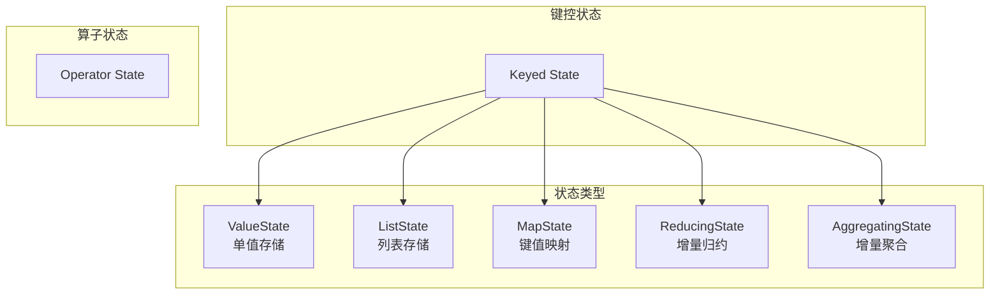
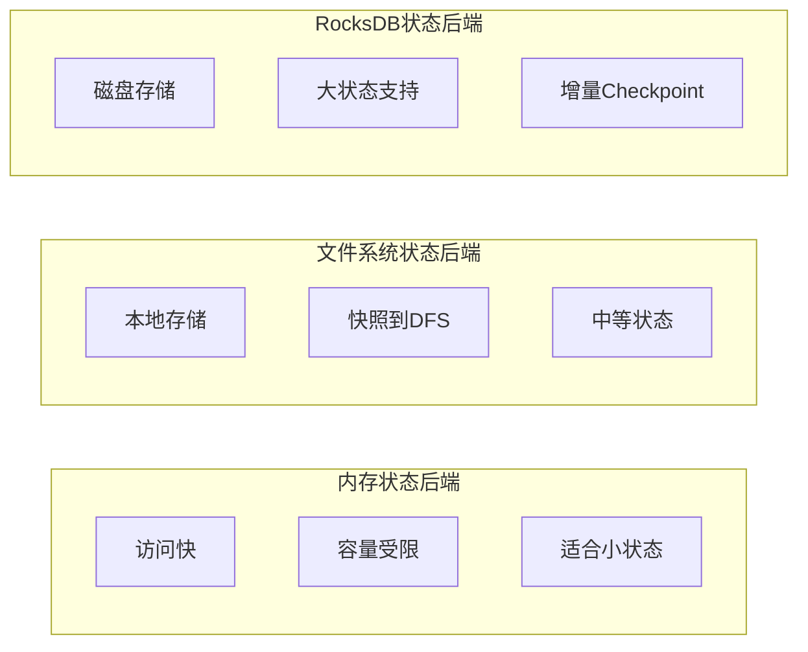

# 状态管理概念详解

> **所属阶段**: Knowledge/01-concept-atlas | **前置依赖**: [01.02-time-semantics.md](./01.02-time-semantics.md) | **形式化等级**: L3-L4 | **难度**: 高级 | **预计阅读时间**: 55分钟

---

## 1. 概念定义 (Definitions)

### 1.1 状态的基本定义

**定义 1.1.1 (状态)** [Def-K-04-01]

状态（State）是流处理算子在计算过程中需要持久化的数据，形式化定义为：
$$State: (K, V, T) \rightarrow V'$$

其中：

- $K$: 状态键空间（可选）
- $V$: 状态值空间
- $T$: 时间域（用于TTL）

状态是流处理中实现有状态计算（如聚合、关联、模式匹配）的基础。

**定义 1.1.2 (算子状态 - Operator State)** [Def-K-04-02]

算子状态绑定到算子实例，所有并行子任务共享同一状态逻辑：
$$OperatorState: Op \rightarrow 2^{(K \times V)}$$

算子状态的特点：

- 状态分区和数据分区独立
- 适用于Source/Sink状态管理
- 支持重分布（Redistribution）策略

**定义 1.1.3 (键控状态 - Keyed State)** [Def-K-04-03]

键控状态按数据键分区，每个键有独立的状态：
$$KeyedState: K \rightarrow V$$

键控状态的特点：

- 状态和数据按同一键分区
- 同键数据保证在同一子任务处理
- 支持更细粒度的状态管理

### 1.2 状态类型的形式化定义

**定义 1.2.1 (值状态 - ValueState)** [Def-K-04-04]

值状态存储单值：
$$ValueState: K \rightharpoonup V$$

操作接口：

- $value(): V$ - 获取当前值
- $update(V): \text{Unit}$ - 更新值
- $clear(): \text{Unit}$ - 清除状态

**定义 1.2.2 (列表状态 - ListState)** [Def-K-04-05]

列表状态存储元素列表：
$$ListState: K \rightharpoonup V^*$$

操作接口：

- $get(): List\langle V \rangle$ - 获取列表
- $add(V): \text{Unit}$ - 添加元素
- $update(List\langle V \rangle): \text{Unit}$ - 更新整个列表
- $clear(): \text{Unit}$ - 清除状态

**定义 1.2.3 (映射状态 - MapState)** [Def-K-04-06]

映射状态存储键值对映射：
$$MapState: K \rightarrow (K' \rightharpoonup V')$$

操作接口：

- $get(UK): UV$ - 获取键对应的值
- $put(UK, UV): \text{Unit}$ - 插入键值对
- $contains(UK): Boolean$ - 检查键是否存在
- $keys(): Iterator\langle UK \rangle$ - 获取所有键
- $values(): Iterator\langle UV \rangle$ - 获取所有值
- $remove(UK): \text{Unit}$ - 删除键值对

**定义 1.2.4 (归约状态 - ReducingState)** [Def-K-04-07]

归约状态通过归约函数增量聚合：
$$ReducingState: K \rightharpoonup V, \quad reduce: V \times V \rightarrow V$$

操作接口：

- $get(): V$ - 获取归约结果
- $add(V): \text{Unit}$ - 添加元素并触发归约
- $clear(): \text{Unit}$ - 清除状态

**定义 1.2.5 (聚合状态 - AggregatingState)** [Def-K-04-08]

聚合状态支持输入输出类型不同的聚合：
$$AggregatingState: K \rightharpoonup ACC, \quad aggregate: ACC \times IN \rightarrow ACC$$

其中 $ACC$ 为累加器类型，$IN$ 为输入类型，$OUT$ 为输出类型。

### 1.3 状态后端与存储

**定义 1.3.1 (状态后端)** [Def-K-04-09]

状态后端（State Backend）是状态存储的实现机制：
$$StateBackend = \{ MemoryStateBackend, FsStateBackend, RocksDBStateBackend \}$$

**定义 1.3.2 (内存状态后端)** [Def-K-04-10]

内存状态后端将状态存储在JVM堆内存：
$$MemoryStateBackend: State \rightarrow Heap$$

特点：

- 访问速度快
- 状态大小受限于JVM堆内存
- 不适用于大状态场景

**定义 1.3.3 (文件系统状态后端)** [Def-K-04-11]

文件系统状态Backend将状态快照存储在分布式文件系统：
$$FsStateBackend: State_{local} \rightarrow Heap, \quad Snapshot \rightarrow DFS$$

**定义 1.3.4 (RocksDB状态后端)** [Def-K-04-12]

RocksDB状态Backend使用嵌入式RocksDB存储状态：
$$RocksDBStateBackend: State \rightarrow RocksDB \rightarrow LocalDisk$$

特点：

- 支持大状态（可超出内存）
- 增量Checkpoint支持
- 读写性能略低于内存

### 1.4 状态TTL机制

**定义 1.3.5 (状态TTL)** [Def-K-04-13]

状态TTL（Time-To-Live）定义状态的生存时间：
$$TTL: State \rightarrow \mathbb{T}$$

当 $t_{current} - t_{lastAccess} > TTL$ 时，状态被标记为过期。

**定义 1.3.6 (过期策略)** [Def-K-04-14]

- **OnCreateAndWrite**: 创建和写入时更新过期时间
- **OnReadAndWrite**: 读写时更新过期时间

**定义 1.3.7 (清理策略)** [Def-K-04-15]

- **FullStateScan**: 全状态扫描清理
- **IncrementalCleanup**: 增量清理
- **RocksDBCompaction**: 利用RocksDB压缩清理

---

## 2. 属性推导 (Properties)

### 2.1 状态基本性质

**引理 2.1.1 (键控状态的局部性)** [Lemma-K-04-01]

键控状态满足数据局部性：
$$\forall k: State(k) \text{ and } Data(k) \text{ on same partition}$$

**引理 2.1.2 (状态操作的原子性)** [Lemma-K-04-02]

单次状态更新操作是原子的：
$$\forall op \in \{value, update, clear\}: op \text{ is atomic}$$

**定理 2.1.1 (状态一致性)** [Thm-K-04-01]

在Exactly-Once语义下，状态更新与输出保持一致性。

### 2.2 状态类型的关系

**引理 2.2.1 (状态类型的表达能力)** [Lemma-K-04-03]

各状态类型的表达能力：
$$MapState \succ ListState \succ ValueState$$

即MapState可以模拟其他两种状态类型。

**引理 2.2.2 (聚合状态与归约状态的关系)** [Lemma-K-04-04]

归约状态是聚合状态的特例：
$$ReducingState = AggregatingState|_{IN = OUT = ACC}$$

---

## 3. 关系建立 (Relations)

### 3.1 状态与Checkpoint的关系

状态是Checkpoint的核心内容，每个Checkpoint捕获所有算子状态的一致性快照。

### 3.2 状态与窗口的关系

窗口计算依赖状态存储中间聚合结果。每个窗口实例对应一个状态项。

### 3.3 状态与容错的关系

**定理 3.3.1 (状态恢复的正确性)** [Thm-K-04-02]

从Checkpoint恢复的状态与故障前状态一致：
$$State_{recovered} = State_{before\_failure}$$

---

## 4. 论证过程 (Argumentation)

### 4.1 状态类型选择

| 场景 | 推荐状态类型 | 理由 |
|-----|-------------|------|
| 计数器 | ValueState | 单值存储 |
| 事件缓冲 | ListState | 支持追加 |
| 维表关联 | MapState | 键值查找 |
| 聚合计算 | ReducingState/AggregatingState | 增量计算 |

### 4.2 状态后端选择

| 场景 | 推荐后端 | 理由 |
|-----|---------|------|
| 小状态、快速迭代 | MemoryStateBackend | 访问快、开发简单 |
| 中等状态、生产环境 | FsStateBackend | 平衡性能和可靠性 |
| 大状态、增量Checkpoint | RocksDBStateBackend | 支持大状态、增量备份 |

### 4.3 TTL设计考量

| 状态类型 | 推荐TTL | 清理策略 |
|---------|--------|---------|
| 会话状态 | 会话超时+缓冲 | OnReadAndWrite |
| 临时聚合 | 窗口延迟+缓冲 | OnCreateAndWrite |
| 维表缓存 | 业务过期时间 | OnReadAndWrite |

---

## 5. 形式证明 / 工程论证 (Proof / Engineering Argument)

### 5.1 增量聚合正确性

**定理 5.1.1 (增量聚合等价性)** [Thm-K-04-03]

对于满足结合律的聚合函数，增量聚合结果与全量聚合等价：
$$f_{incremental}(e_1, e_2, \ldots, e_n) = f_{batch}(\{e_1, e_2, \ldots, e_n\})$$

*证明*:

设 $f$ 满足结合律：$f(f(a, b), c) = f(a, f(b, c))$

**归纳证明**:

**基础**: $n = 2$ 时，$f(e_1, e_2) = f(e_2, e_1)$，由交换律成立。

**归纳**: 假设对 $n = k$ 成立，证明对 $n = k+1$ 成立：

$$f_{incremental}(e_1, \ldots, e_{k+1}) = f(f_{incremental}(e_1, \ldots, e_k), e_{k+1})$$

由归纳假设和结合律，可重排为：
$$= f_{batch}(\{e_1, \ldots, e_{k+1}\})$$

因此增量聚合正确。∎

### 5.2 状态后端性能分析

**定理 5.2.1 (状态后端复杂度)** [Thm-K-04-04]

| 后端类型 | 读复杂度 | 写复杂度 | 空间复杂度 |
|---------|---------|---------|-----------|
| MemoryStateBackend | $O(1)$ | $O(1)$ | $O(S)$ |
| RocksDBStateBackend | $O(\log N)$ | $O(\log N)$ | $O(S)$ |

其中 $S$ 为状态大小，$N$ 为RocksDB中的键数。

---

## 6. 实例验证 (Examples)

### 6.1 状态使用示例

**示例 6.1.1: ValueState使用**

```java

import org.apache.flink.api.common.state.ValueState;
import org.apache.flink.api.common.state.ValueStateDescriptor;
import org.apache.flink.api.common.typeinfo.Types;

public class CounterFunction extends KeyedProcessFunction<String, Event, Result> {
    private ValueState<Long> counterState;

    @Override
    public void open(Configuration parameters) {
        ValueStateDescriptor<Long> descriptor =
            new ValueStateDescriptor<>("counter", Types.LONG);
        counterState = getRuntimeContext().getState(descriptor);
    }

    @Override
    public void processElement(Event event, Context ctx, Collector<Result> out)
            throws Exception {
        Long current = counterState.value();
        if (current == null) {
            current = 0L;
        }
        current++;
        counterState.update(current);
        out.collect(new Result(event.getKey(), current));
    }
}
```

**示例 6.1.2: ListState使用**

```java
public class BufferFunction extends KeyedProcessFunction<String, Event, List<Event>> {
    private ListState<Event> eventListState;

    @Override
    public void open(Configuration parameters) {
        ListStateDescriptor<Event> descriptor =
            new ListStateDescriptor<>("events", Event.class);
        eventListState = getRuntimeContext().getListState(descriptor);
    }

    @Override
    public void processElement(Event event, Context ctx, Collector<List<Event>> out)
            throws Exception {
        eventListState.add(event);

        // 每10个事件输出一次
        List<Event> events = new ArrayList<>();
        eventListState.get().forEach(events::add);

        if (events.size() >= 10) {
            out.collect(events);
            eventListState.clear();
        }
    }
}
```

**示例 6.1.3: MapState使用**

```java
public class UserVisitFunction extends KeyedProcessFunction<String, Event, Stats> {
    private MapState<String, Integer> userVisitCount;

    @Override
    public void open(Configuration parameters) {
        MapStateDescriptor<String, Integer> descriptor =
            new MapStateDescriptor<>("user-visits", String.class, Integer.class);
        userVisitCount = getRuntimeContext().getMapState(descriptor);
    }

    @Override
    public void processElement(Event event, Context ctx, Collector<Stats> out)
            throws Exception {
        String userId = event.getUserId();
        Integer count = userVisitCount.get(userId);
        if (count == null) {
            count = 0;
        }
        userVisitCount.put(userId, count + 1);

        // 输出当前所有用户的访问统计
        Stats stats = new Stats();
        for (Map.Entry<String, Integer> entry : userVisitCount.entries()) {
            stats.add(entry.getKey(), entry.getValue());
        }
        out.collect(stats);
    }
}
```

### 6.2 TTL配置示例

```java

// [伪代码片段 - 不可直接运行] 仅展示核心逻辑
import org.apache.flink.streaming.api.windowing.time.Time;

// 配置状态TTL
StateTtlConfig ttlConfig = StateTtlConfig
    .newBuilder(Time.hours(24))
    .setUpdateType(StateTtlConfig.UpdateType.OnCreateAndWrite)
    .setStateVisibility(StateTtlConfig.StateVisibility.NeverReturnExpired)
    .cleanupFullSnapshot()
    .build();

ValueStateDescriptor<MyState> descriptor =
    new ValueStateDescriptor<>("my-state", MyState.class);
descriptor.enableTimeToLive(ttlConfig);
```

### 6.3 状态后端配置

```java
// [伪代码片段 - 不可直接运行] 仅展示核心逻辑
// RocksDB状态后端
EmbeddedRocksDBStateBackend rocksDbBackend =
    new EmbeddedRocksDBStateBackend(true); // 启用增量Checkpoint
env.setStateBackend(rocksDbBackend);
env.getCheckpointConfig().setCheckpointStorage("hdfs://checkpoints");

// 配置RocksDB内存
DefaultConfigurableOptionsFactory optionsFactory =
    new DefaultConfigurableOptionsFactory();
optionsFactory.setRocksDBOptions("max_background_jobs", "4");
optionsFactory.setRocksDBOptions("write_buffer_size", "64MB");
rocksDbBackend.setRocksDBOptions(optionsFactory);
```

---

## 7. 可视化 (Visualizations)

### 7.1 状态类型关系



### 7.2 状态后端对比



---

## 8. 引用参考 (References)


---

> **文档信息**
>
> - 版本: v1.0
> - 最后更新: 2026-04-11
> - 维护者: Knowledge Team
> - 相关文档: [01.03-window-concepts.md](./01.03-window-concepts.md), [01.05-consistency-models.md](./01.05-consistency-models.md)

---

*文档版本: v1.0 | 创建日期: 2026-04-19*
