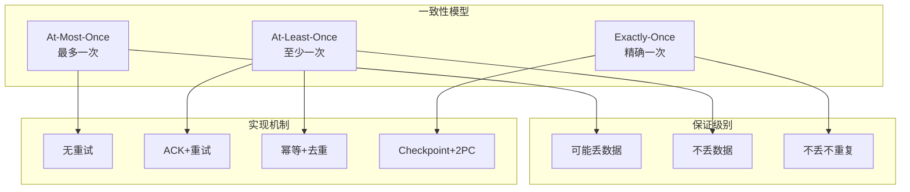
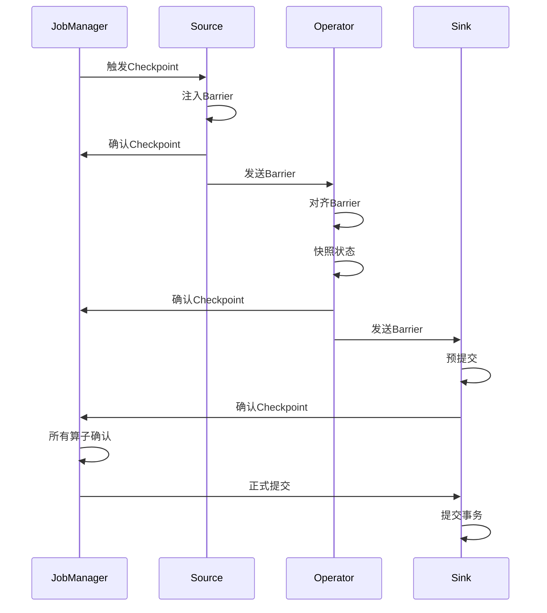

# 一致性模型详解

> **所属阶段**: Knowledge/01-concept-atlas | **前置依赖**: [01.04-state-management-concepts.md](./01.04-state-management-concepts.md) | **形式化等级**: L4-L5 | **难度**: 高级 | **预计阅读时间**: 60分钟

---

## 1. 概念定义 (Definitions)

### 1.1 一致性基本定义

**定义 1.1.1 (一致性模型)** [Def-K-05-01]

一致性模型定义了分布式系统中数据操作的可观察行为，规定了操作执行的有效顺序：
$$ConsistencyModel = \{ AtMostOnce, AtLeastOnce, ExactlyOnce \}$$

**定义 1.1.2 (At-Most-Once)** [Def-K-05-02]

At-Most-Once语义保证每条消息最多被处理一次：
$$\forall m \in Messages: Count_{process}(m) \leq 1$$

特点：

- 可能丢数据，不重复处理
- 实现最简单
- 适用于日志收集、指标上报等可容忍丢失的场景

**定义 1.1.3 (At-Least-Once)** [Def-K-05-03]

At-Least-Once语义保证每条消息至少被处理一次：
$$\forall m \in Messages: Count_{process}(m) \geq 1$$

特点：

- 不丢数据，可能重复处理
- 需要幂等性或去重机制
- 适用于大多数业务场景

**定义 1.1.4 (Exactly-Once)** [Def-K-05-04]

Exactly-Once语义保证每条消息恰好被处理一次：
$$\forall m \in Messages: Count_{process}(m) = 1$$

特点：

- 不丢数据，不重复处理
- 实现复杂，有性能开销
- 适用于金融交易、订单处理等关键业务

### 1.2 端到端一致性

**定义 1.2.1 (端到端Exactly-Once)** [Def-K-05-05]

从数据源到数据汇的完整链路Exactly-Once：
$$ExactlyOnce_{end-to-end} = ExactlyOnce_{source} \cap ExactlyOnce_{process} \cap ExactlyOnce_{sink}$$

端到端一致性要求：

1. **Source可重放**: 支持从特定位置重新消费数据
2. **处理幂等或事务**: 保证处理不重复
3. **Sink事务性**: 保证输出不重复

**定义 1.2.2 (幂等性)** [Def-K-05-06]

幂等操作多次执行结果相同：
$$\forall f: Idempotent(f) \iff \forall x: f(f(x)) = f(x)$$

在流处理中，幂等性是实现Exactly-Once的重要手段。

### 1.3 分布式快照

**定义 1.3.1 (Checkpoint)** [Def-K-05-07]

Checkpoint是分布式系统的一致性快照，捕获特定时刻的全局状态：
$$Checkpoint = \{ State_{op} \mid op \in Operators \} \cup \{ Position_{source} \}$$

**定义 1.3.2 (Barrier)** [Def-K-05-08]

Barrier是Checkpoint的特殊标记，随数据流流动以协调快照：
$$Barrier = (checkpoint\_id, timestamp)$$

Barrier保证：

- 所有算子在Barrier处对齐状态
- Barrier之前的数据全部处理完毕
- Barrier之后的数据属于下一个快照周期

---

## 2. 属性推导 (Properties)

### 2.1 一致性层次关系

**引理 2.1.1 (一致性蕴含关系)** [Lemma-K-05-01]

$$ExactlyOnce \Rightarrow AtLeastOnce$$

$$AtLeastOnce \nRightarrow AtMostOnce \text{ (一般情况下)}$$

**定理 2.1.1 (Exactly-Once的充分条件)** [Thm-K-05-01]

At-Least-Once + 幂等性 = Exactly-Once

*证明*:

设系统保证At-Least-Once，则每条消息至少被处理一次。

若所有操作都是幂等的，则：
$$process(m) = process(process(m)) = process^n(m)$$

因此即使消息被处理多次，最终结果与处理一次相同。∎

### 2.2 Checkpoint性质

**引理 2.2.1 (Barrier对齐的完备性)** [Lemma-K-05-02]

Barrier对齐保证所有算子状态的一致性视图。

**定理 2.2.1 (Checkpoint恢复的正确性)** [Thm-K-05-02]

从Checkpoint恢复的状态与故障前一致。

---

## 3. 关系建立 (Relations)

### 3.1 一致性与Checkpoint的关系

Checkpoint机制是实现Exactly-Once的基础，通过分布式快照保证状态一致性。

### 3.2 一致性与状态管理的关系

**定理 3.2.1 (状态一致性要求)** [Thm-K-05-03]

Exactly-Once要求状态更新与输出原子性提交。

### 3.3 一致性与Sink的关系

**定义 3.3.1 (两阶段提交Sink)** [Def-K-05-09]

两阶段提交（2PC）Sink保证输出的原子性：

1. **预提交阶段**: 将数据写入外部系统但不提交
2. **正式提交阶段**: Checkpoint完成后正式提交

---

## 4. 论证过程 (Argumentation)

### 4.1 一致性模型选择

| 场景 | 推荐一致性 | 理由 |
|-----|-----------|------|
| 日志收集 | At-Most-Once | 允许丢数据，追求高吞吐 |
| 指标统计 | At-Least-Once | 不丢数据，重复可接受 |
| 推荐系统 | At-Least-Once | 近似结果可接受 |
| 金融交易 | Exactly-Once | 必须精确一致 |
| 订单处理 | Exactly-Once | 不能重复扣款 |

### 4.2 实现机制对比

| 机制 | 开销 | 复杂度 | 适用场景 |
|-----|------|--------|---------|
| At-Most-Once | 最低 | 最简单 | 可容忍丢失 |
| At-Least-Once + 幂等 | 中等 | 中等 | 大多数业务 |
| At-Least-Once + 去重 | 中等 | 中等 | 非幂等操作 |
| Exactly-Once (2PC) | 高 | 复杂 | 关键业务 |

---

## 5. 形式证明 / 工程论证 (Proof / Engineering Argument)

### 5.1 两阶段提交的正确性

**定理 5.1.1 (2PC Exactly-Once)** [Thm-K-05-04]

两阶段提交协议在协调器和参与者都可用时保证Exactly-Once。

*证明概要*:

**阶段1: 预提交**

- 协调者询问所有参与者是否可以提交
- 参与者执行本地事务但不提交
- 参与者回复YES/NO

**阶段2: 正式提交**

- 若所有参与者回复YES，协调者发送COMMIT
- 参与者收到COMMIT后正式提交
- 若任参与者回复NO，协调者发送ROLLBACK

**正确性分析**:

1. **原子性**: 所有参与者要么全部提交，要么全部回滚
2. **一致性**: 事务前后系统状态一致
3. **隔离性**: 预提交阶段数据不可见
4. **持久性**: 提交后数据持久化

因此，2PC保证了端到端Exactly-Once。∎

### 5.2 Checkpoint算法的正确性

**定理 5.2.1 (Chandy-Lamport快照正确性)** [Thm-K-05-05]

Chandy-Lamport算法产生一致性快照。

*证明概要*:

**算法步骤**:

1. 协调者向所有Source注入Barrier
2. Barrier随数据流传播到下游算子
3. 算子收到所有输入的Barrier后快照状态
4. 快照完成后向下游发送Barrier

**一致性保证**:

- Barrier定义了逻辑时间点
- Barrier之前的数据全部处理
- Barrier之后的数据延迟处理
- 因此快照捕获一致的全局状态

---

## 6. 实例验证 (Examples)

### 6.1 Flink Exactly-Once配置

```java
// Checkpoint配置
env.enableCheckpointing(60000); // 每分钟Checkpoint
env.getCheckpointConfig().setCheckpointingMode(CheckpointingMode.EXACTLY_ONCE);
env.getCheckpointConfig().setMinPauseBetweenCheckpoints(30000);
env.getCheckpointConfig().setCheckpointTimeout(600000);
env.getCheckpointConfig().setMaxConcurrentCheckpoints(1);
env.getCheckpointConfig().enableExternalizedCheckpoints(
    ExternalizedCheckpointCleanup.RETAIN_ON_CANCELLATION);

// Exactly-Once Sink - Kafka
FlinkKafkaProducer<String> kafkaSink = new FlinkKafkaProducer<>(
    "output-topic",
    new SimpleStringSchema(),
    kafkaProps,
    FlinkKafkaProducer.Semantic.EXACTLY_ONCE
);
stream.addSink(kafkaSink);

// Exactly-Once Sink - JDBC (两阶段提交)
JdbcExactlyOnceSink<String> jdbcSink = JdbcExactlyOnceSink.sink(
    "INSERT INTO results (id, value) VALUES (?, ?)",
    (ps, value) -> {
        ps.setString(1, value.getId());
        ps.setString(2, value.getValue());
    },
    JdbcExecutionOptions.builder()
        .withBatchSize(1000)
        .withBatchIntervalMs(200)
        .build(),
    JdbcConnectionOptions.JdbcConnectionOptionsBuilder()
        .withUrl("jdbc:mysql://localhost:3306/mydb")
        .withDriverName("com.mysql.cj.jdbc.Driver")
        .withUsername("user")
        .withPassword("password")
        .build()
);
stream.addSink(jdbcSink);
```

### 6.2 幂等性实现示例

```java
// 幂等性更新 - 基于ID去重
public class IdempotentProcessFunction extends KeyedProcessFunction<String, Event, Result> {
    private ValueState<Set<String>> processedIds;

    @Override
    public void open(Configuration parameters) {
        ValueStateDescriptor<Set<String>> descriptor =
            new ValueStateDescriptor<>("processed-ids", TypeInformation.of(new TypeHint<Set<String>>() {}));
        processedIds = getRuntimeContext().getState(descriptor);
    }

    @Override
    public void processElement(Event event, Context ctx, Collector<Result> out)
            throws Exception {
        Set<String> ids = processedIds.value();
        if (ids == null) {
            ids = new HashSet<>();
        }

        if (!ids.contains(event.getId())) {
            // 处理事件
            Result result = process(event);
            out.collect(result);

            // 记录已处理
            ids.add(event.getId());
            processedIds.update(ids);
        }
    }
}
```

### 6.3 自定义两阶段提交Sink

```java
public class TwoPhaseCommitSink extends TwoPhaseCommitSinkFunction<Event, Transaction, Void> {

    public TwoPhaseCommitSink() {
        super(TypeInformation.of(Event.class).createSerializer(new ExecutionConfig()),
              TypeInformation.of(Transaction.class).createSerializer(new ExecutionConfig()));
    }

    @Override
    protected void invoke(Transaction transaction, Event value, Context context) {
        transaction.write(value);
    }

    @Override
    protected Transaction beginTransaction() {
        // 开启新事务
        return new Transaction();
    }

    @Override
    protected void preCommit(Transaction transaction) {
        // 预提交 - 数据写入但不提交
        transaction.flush();
    }

    @Override
    protected void commit(Transaction transaction) {
        // 正式提交
        transaction.commit();
    }

    @Override
    protected void abort(Transaction transaction) {
        // 回滚
        transaction.rollback();
    }
}
```

---

## 7. 可视化 (Visualizations)

### 7.1 一致性模型层次



### 7.2 Checkpoint流程



---

## 8. 引用参考 (References)


---

## 附录: 一致性模型决策矩阵

| 业务场景 | 可容忍丢失 | 可容忍重复 | 推荐一致性 | 实现方式 |
|---------|-----------|-----------|-----------|---------|
| 日志采集 | 是 | 否 | At-Most-Once | 无重试 |
| 监控指标 | 否 | 是 | At-Least-Once | ACK+重试 |
| 用户行为分析 | 否 | 是 | At-Least-Once | 幂等写入 |
| 推荐结果 | 否 | 是 | At-Least-Once | 幂等更新 |
| 订单处理 | 否 | 否 | Exactly-Once | 2PC |
| 支付交易 | 否 | 否 | Exactly-Once | 2PC+幂等 |
| 库存扣减 | 否 | 否 | Exactly-Once | 2PC+乐观锁 |

---

> **文档信息**
>
> - 版本: v1.0
> - 最后更新: 2026-04-11
> - 维护者: Knowledge Team
> - 相关文档: [01.04-state-management-concepts.md](./01.04-state-management-concepts.md), [01.01-stream-processing-fundamentals.md](./01.01-stream-processing-fundamentals.md)
