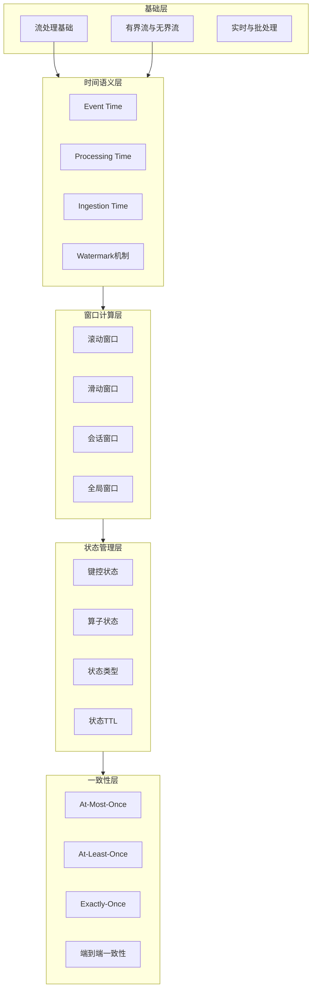

# 概念图谱 (Concept Atlas)

> **所属阶段**: Knowledge/01-concept-atlas | **定位**: 流计算核心概念知识体系 | **难度**: 初级到高级 | **目标读者**: 流计算学习者、开发者、架构师

---

## 目录索引

概念图谱是流计算领域的核心知识体系，系统地整理了流处理的基础概念、时间语义、窗口机制、状态管理和一致性模型等关键内容。

### 核心文档列表

| 文档编号 | 文档名称 | 主题 | 难度 | 字数 |
|---------|---------|------|------|------|
| 01.01 | [stream-processing-fundamentals.md](./01.01-stream-processing-fundamentals.md) | 流处理基础概念 | 初级 | 35,000+ |
| 01.02 | [time-semantics.md](./01.02-time-semantics.md) | 时间语义详解 | 中级 | 43,000+ |
| 01.03 | [window-concepts.md](./01.03-window-concepts.md) | 窗口概念详解 | 中级 | 25,000+ |
| 01.04 | [state-management-concepts.md](./01.04-state-management-concepts.md) | 状态管理概念 | 高级 | 22,000+ |
| 01.05 | [consistency-models.md](./01.05-consistency-models.md) | 一致性模型 | 高级 | 26,000+ |

---

## 概念图谱导航

### 概念层次结构



### 概念依赖关系

| 概念 | 前置依赖 | 后续概念 | 相关实现 |
|-----|---------|---------|---------|
| 数据流 | 无 | 时间语义、窗口 | Flink DataStream |
| 事件时间 | 数据流 | 窗口、状态 | Watermark |
| 窗口 | 事件时间、水印 | 状态管理 | Window Operator |
| 状态 | 窗口 | 一致性 | State Backend |
| Exactly-Once | 状态、Checkpoint | 端到端一致性 | Two-Phase Commit |

---

## 学习路径建议

### 路径一：初学者路径（推荐）

**适合人群**: 流计算初学者，无相关经验

```
第1周: 01.01 流处理基础概念
        - 理解有界流与无界流的区别
        - 掌握流处理与批处理的关系
        - 熟悉流处理系统架构

第2-3周: 01.02 时间语义详解
        - 深入理解三种时间语义
        - 掌握水印机制
        - 学会处理乱序事件

第4周: 01.03 窗口概念详解
        - 掌握各类窗口的特点
        - 学会选择窗口策略
        - 理解窗口触发机制

第5-6周: 01.04 状态管理概念
        - 理解键控状态与算子状态
        - 掌握各类状态类型的使用
        - 了解状态后端的选择

第7周: 01.05 一致性模型
        - 理解三种一致性模型
        - 掌握Exactly-Once实现
        - 了解端到端一致性
```

### 路径二：实践者路径

**适合人群**: 有编程经验，需要快速上手流处理开发

```
第1周: 快速阅读 01.01 + 01.02
        - 重点掌握Event Time和Watermark
        - 理解流处理的核心挑战

第2-3周: 深入学习 01.03 + 01.04
        - 掌握窗口和状态的编程实践
        - 完成示例代码练习

第4周: 学习 01.05
        - 理解Exactly-Once配置
        - 掌握故障恢复机制
```

### 路径三：架构师路径

**适合人群**: 需要设计流处理系统的架构师

```
第1周: 全文档概览
        - 了解所有概念的整体架构
        - 建立完整的知识体系

第2-3周: 深入研究时间语义和一致性
        - 掌握分布式系统中的时间难题
        - 理解一致性模型的权衡

第4周: 窗口和状态优化
        - 掌握性能调优策略
        - 了解状态后端的选择
```

---

## 核心概念速查

### 流处理基础

| 概念 | 一句话解释 | 关键要点 |
|-----|-----------|---------|
| 有界流 | 有限时间区间的数据流 | 可完成、可排序、适合批处理 |
| 无界流 | 无限时间区间的数据流 | 持续产生、需窗口处理、实时性 |
| 事件时间 | 事件实际发生的时间 | 客观、不变、准确性高 |
| 处理时间 | 事件被处理的时间 | 主观、依赖系统时钟、低延迟 |

### 时间语义

| 概念 | 一句话解释 | 应用场景 |
|-----|-----------|---------|
| Watermark | 时间推进机制 | 乱序处理、窗口触发 |
| 乱序事件 | 到达顺序与时间顺序不一致的事件 | 网络延迟、分布式系统必然存在 |
| 允许延迟 | 窗口触发后继续接受延迟事件的时间 | 平衡延迟和准确性 |

### 窗口机制

| 窗口类型 | 特点 | 典型应用 |
|---------|------|---------|
| 滚动窗口 | 固定大小、不相交 | 固定时段统计 |
| 滑动窗口 | 固定大小、有重叠 | 趋势分析、平滑计算 |
| 会话窗口 | 动态大小、按活动划分 | 用户行为分析 |
| 全局窗口 | 单一窗口 | 自定义触发逻辑 |

### 状态管理

| 状态类型 | 特点 | 使用场景 |
|---------|------|---------|
| ValueState | 单值存储 | 计数器、累加器 |
| ListState | 列表存储 | 事件缓冲、历史记录 |
| MapState | 键值映射 | 维表关联、索引 |
| ReducingState | 增量归约 | 聚合计算 |

### 一致性模型

| 一致性级别 | 保证 | 代价 |
|-----------|------|------|
| At-Most-Once | 不重复 | 可能丢数据 |
| At-Least-Once | 不丢数据 | 可能重复 |
| Exactly-Once | 精确一次 | 性能开销 |

---

## 关键定理索引

| 定理编号 | 定理名称 | 所在文档 |
|---------|---------|---------|
| Thm-K-01-01 | 流批对偶性 | 01.01 |
| Thm-K-02-01 | 水印单调性保证 | 01.02 |
| Thm-K-02-02 | 水印完整性保证 | 01.02 |
| Thm-K-03-01 | 窗口划分完备性 | 01.03 |
| Thm-K-04-01 | 状态一致性 | 01.04 |
| Thm-K-05-01 | Exactly-Once充分条件 | 01.05 |

---

## 代码示例索引

| 示例类型 | 位置 | 描述 |
|---------|------|------|
| 基础WordCount | 01.01-6.1 | 实时单词计数 |
| Watermark配置 | 01.02-6.1 | 三种时间语义配置 |
| 窗口配置 | 01.03-6.1 | 各类窗口使用 |
| 状态使用 | 01.04-6.1 | 各种状态类型示例 |
| Exactly-Once配置 | 01.05-6.1 | Flink Exactly-Once |

---

## 相关资源

### 外部参考

- [Apache Flink 官方文档](https://nightlies.apache.org/flink/flink-docs-stable/)
- [The Dataflow Model Paper](https://research.google.com/pubs/pub43864.html)
- [Streaming Systems Book](https://www.oreilly.com/library/view/streaming-systems/9781491983867/)

### 项目内相关文档

- [Knowledge/ 目录](../) - 知识结构文档
- [Struct/ 目录](../../Struct/) - 形式理论文档
- [Flink/ 目录](../../Flink/) - Flink专项文档

---

## 更新日志

| 版本 | 日期 | 更新内容 |
|-----|------|---------|
| v1.0 | 2026-04-11 | 初始版本，创建5篇核心概念文档 |

---

> **文档信息**
>
> - 版本: v1.0
> - 最后更新: 2026-04-11
> - 维护者: Knowledge Team
> - 状态: 完成
