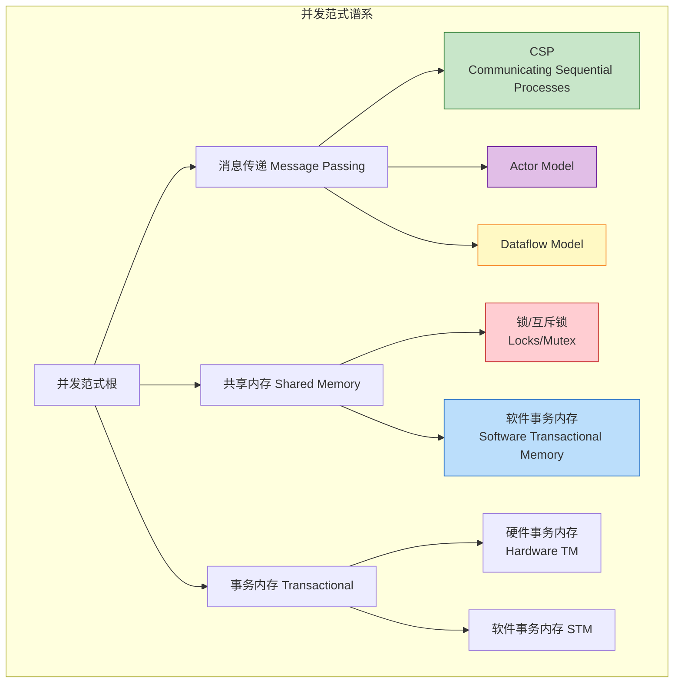
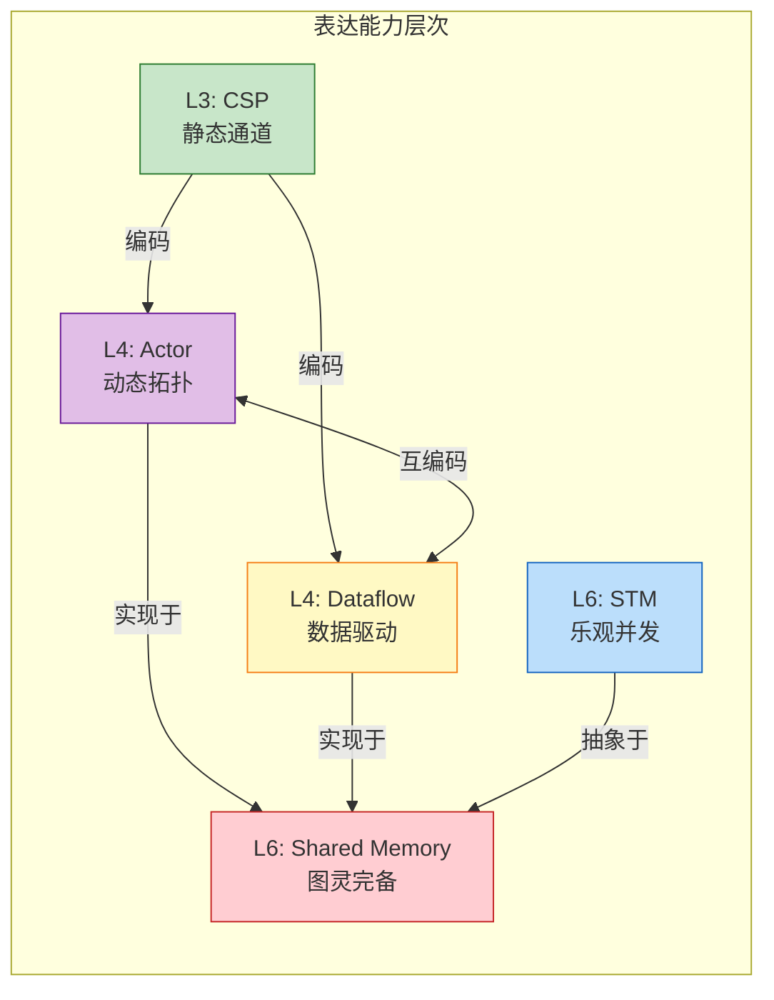
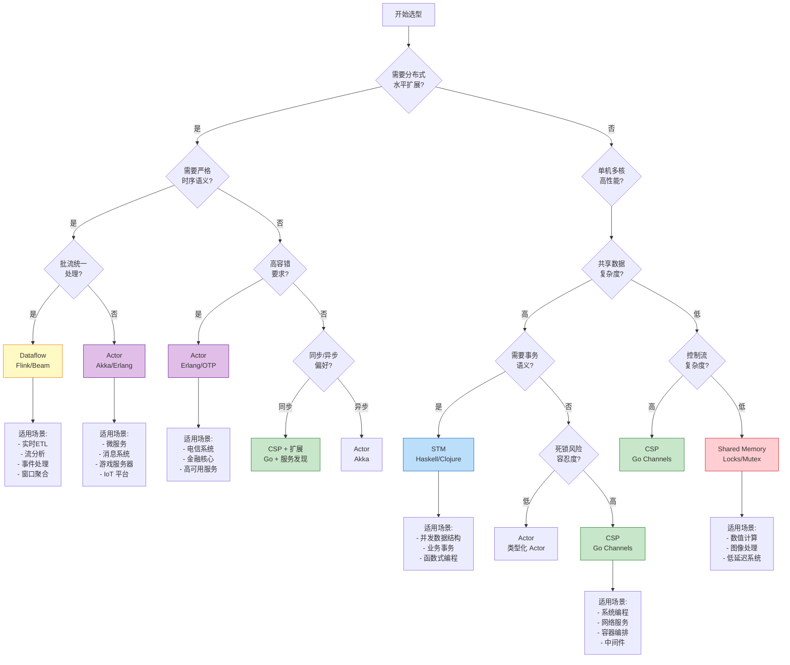
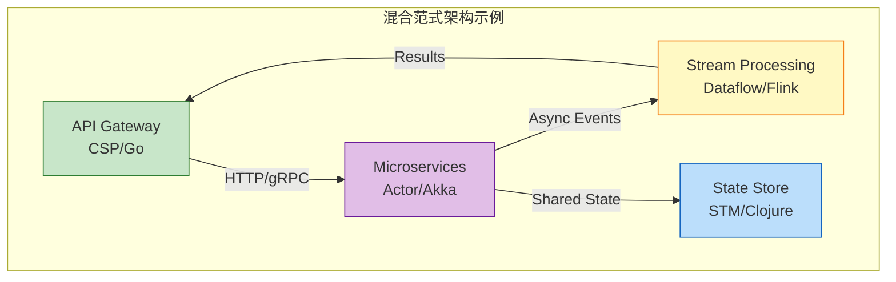
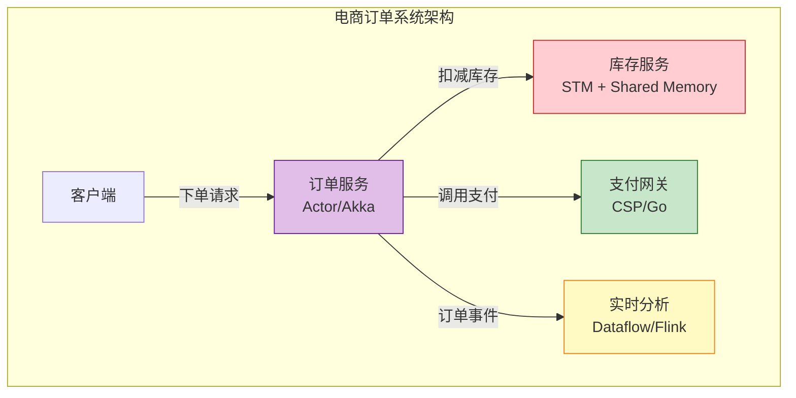
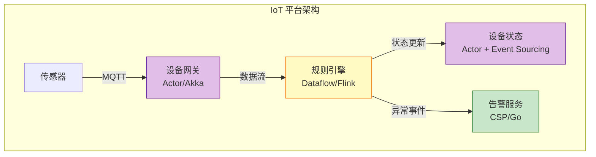
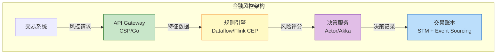
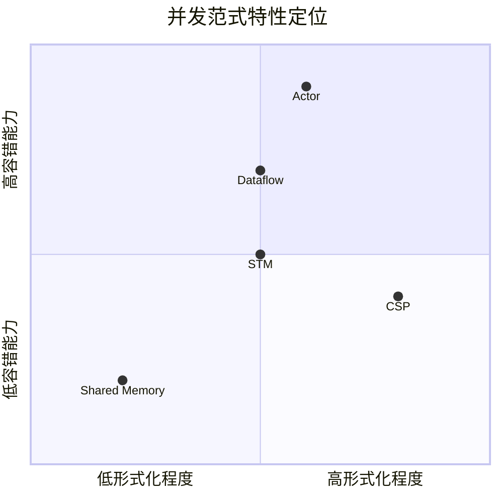

# 并发范式多维对比矩阵 (Concurrency Paradigms Comparison Matrix)

> **文档定位**: 并发计算核心范式的系统性对比与选型指南
> **形式化等级**: L3-L6 | **前置依赖**: [../../Struct/01-foundation/](../../Struct/01-foundation/)
> **版本**: 2026.04 | **文档规模**: ~20KB

---

## 目录

- [并发范式多维对比矩阵 (Concurrency Paradigms Comparison Matrix)](#并发范式多维对比矩阵-concurrency-paradigms-comparison-matrix)
  - [目录](#目录)
  - [1. 概念定义 (Definitions)](#1-概念定义-definitions)
    - [1.1 并发范式谱系](#11-并发范式谱系)
    - [1.2 各范式核心定义](#12-各范式核心定义)
      - [Def-K-01-01. CSP (Communicating Sequential Processes)](#def-k-01-01-csp-communicating-sequential-processes)
      - [Def-K-01-02. Actor Model](#def-k-01-02-actor-model)
      - [Def-K-01-03. Dataflow Model](#def-k-01-03-dataflow-model)
      - [Def-K-01-04. Shared Memory with Locks](#def-k-01-04-shared-memory-with-locks)
      - [Def-K-01-05. Software Transactional Memory (STM)](#def-k-01-05-software-transactional-memory-stm)
    - [1.3 范式表达能力层次](#13-范式表达能力层次)
  - [2. 属性/特征 (Properties)](#2-属性特征-properties)
    - [2.1 核心维度定义](#21-核心维度定义)
      - [Def-K-01-06. 通信风格 (Communication Style)](#def-k-01-06-通信风格-communication-style)
      - [Def-K-01-07. 状态隔离 (State Isolation)](#def-k-01-07-状态隔离-state-isolation)
      - [Def-K-01-08. 容错能力 (Fault Tolerance)](#def-k-01-08-容错能力-fault-tolerance)
      - [Def-K-01-09. 可扩展性 (Scalability)](#def-k-01-09-可扩展性-scalability)
      - [Def-K-01-10. 可组合性 (Composability)](#def-k-01-10-可组合性-composability)
      - [Def-K-01-11. 形式化程度 (Formality)](#def-k-01-11-形式化程度-formality)
    - [2.2 属性推导](#22-属性推导)
      - [Prop-K-01-01. 消息传递 vs 共享内存的复杂度分离](#prop-k-01-01-消息传递-vs-共享内存的复杂度分离)
      - [Prop-K-01-02. 同步通信的确定性优势](#prop-k-01-02-同步通信的确定性优势)
      - [Prop-K-01-03. 状态隔离与容错性的正相关性](#prop-k-01-03-状态隔离与容错性的正相关性)
  - [3. 关系/对比 (Relations)](#3-关系对比-relations)
    - [3.1 范式间表达能力关系](#31-范式间表达能力关系)
    - [3.2 关系详解](#32-关系详解)
      - [关系 1: CSP $\\subset$ Actor (表达能力弱于)](#关系-1-csp-subset-actor-表达能力弱于)
      - [关系 2: Actor $\\approx$ Dataflow (图灵完备等价)](#关系-2-actor-approx-dataflow-图灵完备等价)
      - [关系 3: Shared Memory $\\perp$ STM（语义不可比较）](#关系-3-shared-memory-perp-stm语义不可比较)
      - [关系 4: Dataflow $\\supset$ Kahn Process Network](#关系-4-dataflow-supset-kahn-process-network)
    - [3.3 大型对比矩阵](#33-大型对比矩阵)
      - [表 1: 核心特征对比矩阵](#表-1-核心特征对比矩阵)
      - [表 2: 状态与一致性对比矩阵](#表-2-状态与一致性对比矩阵)
      - [表 3: 容错与可靠性对比矩阵](#表-3-容错与可靠性对比矩阵)
      - [表 4: 可扩展性与性能对比矩阵](#表-4-可扩展性与性能对比矩阵)
      - [表 5: 可组合性与工程特性对比矩阵](#表-5-可组合性与工程特性对比矩阵)
      - [表 6: 形式化与验证对比矩阵](#表-6-形式化与验证对比矩阵)
  - [4. 论证/选型逻辑 (Argumentation)](#4-论证选型逻辑-argumentation)
    - [4.1 范式选型决策树](#41-范式选型决策树)
    - [4.2 场景驱动的选型论证](#42-场景驱动的选型论证)
      - [论证 1: 为什么高容错系统应选择 Actor 模型](#论证-1-为什么高容错系统应选择-actor-模型)
      - [论证 2: 为什么流处理系统应选择 Dataflow 模型](#论证-2-为什么流处理系统应选择-dataflow-模型)
      - [论证 3: 为什么系统编程应选择 CSP 模型](#论证-3-为什么系统编程应选择-csp-模型)
      - [论证 4: 为什么共享可变状态应选择 STM](#论证-4-为什么共享可变状态应选择-stm)
    - [4.3 混合范式策略](#43-混合范式策略)
  - [5. 工程实例 (Examples)](#5-工程实例-examples)
    - [5.1 实例 1: 电商订单系统范式选择](#51-实例-1-电商订单系统范式选择)
    - [5.2 实例 2: IoT 数据处理平台范式选择](#52-实例-2-iot-数据处理平台范式选择)
    - [5.3 实例 3: 金融风控系统范式选择](#53-实例-3-金融风控系统范式选择)
    - [5.4 反例分析](#54-反例分析)
      - [反例 1: 在流处理场景误用 Actor 模型](#反例-1-在流处理场景误用-actor-模型)
      - [反例 2: 在高并发网络服务中误用 Shared Memory](#反例-2-在高并发网络服务中误用-shared-memory)
      - [反例 3: 在容错系统中误用 STM](#反例-3-在容错系统中误用-stm)
  - [6. 可视化总结](#6-可视化总结)
    - [6.1 范式特性雷达图对比](#61-范式特性雷达图对比)
    - [6.2 范式适用场景总结](#62-范式适用场景总结)
  - [关联文档](#关联文档)
    - [上游依赖](#上游依赖)
    - [同层关联](#同层关联)
    - [下游应用](#下游应用)
  - [引用参考](#引用参考)

## 1. 概念定义 (Definitions)

### 1.1 并发范式谱系

并发编程领域存在多种**计算模型范式 (Concurrency Paradigms)**，它们从根本上回答了"并发单元如何交互"这一问题。本矩阵聚焦于五种核心范式：

### 1.2 各范式核心定义

#### Def-K-01-01. CSP (Communicating Sequential Processes)

**形式化定义**（参见 [../../Struct/01-foundation/01.05-csp-formalization.md](../../Struct/01-foundation/01.05-csp-formalization.md)）：

$$
\text{CSP} ::= \text{STOP} \mid \text{SKIP} \mid a \to P \mid P \mathbin{\square} Q \mid P \mathbin{\sqcap} Q \mid P \mathbin{|||} Q \mid P \mathbin{\parallel_A} Q
$$

**核心特征**：

- **同步通信**：通过显式通道进行握手式通信
- **静态命名**：通道名在语法层面固定
- **外部选择**：环境决定分支走向 ($\square$)
- **组合语义**：通过并行算子层次化组合

**代表实现**：Go Channels、Occam、FDR 模型检验器

---

#### Def-K-01-02. Actor Model

**形式化定义**（参见 [../../Struct/01-foundation/01.03-actor-model-formalization.md](../../Struct/01-foundation/01.03-actor-model-formalization.md)）：

$$
\mathcal{A} = (\alpha, b, m, \sigma)
$$

其中 $\alpha$ 为不可伪造地址，$b$ 为行为函数，$m$ 为 Mailbox，$\sigma$ 为私有状态。

**核心特征**：

- **异步消息传递**：通过 Mailbox 解耦发送与接收
- **位置透明**：ActorRef 隐藏物理位置
- **监督树**：层级化容错结构
- **动态创建**：运行时 spawn 新 Actor

**代表实现**：Erlang/OTP、Akka (Scala/Java)、Pekko

---

#### Def-K-01-03. Dataflow Model

**形式化定义**（参见 [../../Struct/01-foundation/01.04-dataflow-model-formalization.md](../../Struct/01-foundation/01.04-dataflow-model-formalization.md)）：

$$
\mathcal{G} = (V, E, P, \Sigma, \mathbb{T})
$$

其中 $V$ 为算子集合，$E$ 为数据依赖边，$P$ 为并行度函数，$\Sigma$ 为流类型签名，$\mathbb{T}$ 为时间域。

**核心特征**：

- **数据驱动执行**：算子触发由输入数据可用性决定
- **有向无环图**：计算拓扑表达为 DAG
- **时间语义**：事件时间/处理时间/Watermark
- **状态算子**：按键分区的有状态计算

**代表实现**：Apache Flink、Apache Beam、TensorFlow Dataflow

---

#### Def-K-01-04. Shared Memory with Locks

**形式化定义**：

$$
\mathcal{M} = (S, L, \mathcal{O}, \mathcal{T})
$$

其中 $S$ 为共享状态空间，$L$ 为锁集合，$\mathcal{O}$ 为操作集合，$\mathcal{T}$ 为线程集合。

**核心特征**：

- **显式同步**：通过锁/互斥量保护临界区
- **内存共享**：多线程直接访问同一内存地址
- **细粒度控制**：开发者精确控制同步粒度
- **风险暴露**：死锁、竞态条件、优先级反转

**代表实现**：Pthreads、Java synchronized、C++ std::mutex

---

#### Def-K-01-05. Software Transactional Memory (STM)

**形式化定义**：

$$
\text{STM} = (\mathcal{T}, \mathcal{V}, \mathcal{L}, \text{commit}, \text{abort})
$$

其中 $\mathcal{T}$ 为事务集合，$\mathcal{V}$ 为版本控制，$\mathcal{L}$ 为冲突检测机制。

**核心特征**：

- **乐观并发**：先执行后验证，冲突时回滚
- **原子性语义**：事务内操作要么全提交要么全放弃
- **可组合性**：事务可以嵌套组合
- **声明式同步**：无需显式锁管理

**代表实现**：Haskell STM、Clojure refs、Scala STM

---

### 1.3 范式表达能力层次

根据 [../../Struct/01-foundation/01.01-unified-streaming-theory.md](../../Struct/01-foundation/01.01-unified-streaming-theory.md) 的六层表达能力层次：

| 层次 | 范式 | 表达能力 | 可判定性 |
|------|------|----------|----------|
| L3 | CSP (有限状态) | 静态名称通信 | PSPACE-完全 |
| L4 | Actor、Dataflow | 动态拓扑、移动性 | 部分可判定 |
| L4 | π-演算 | 名字传递 | 不可判定 |
| L6 | Shared Memory、STM | 图灵完备 | 不可判定 |

---

## 2. 属性/特征 (Properties)

### 2.1 核心维度定义

#### Def-K-01-06. 通信风格 (Communication Style)

| 维度 | 描述 |
|------|------|
| **同步** | 发送方阻塞直到接收方就绪 |
| **异步** | 发送方立即返回，消息缓冲传递 |
| **直接** | 进程直接交互 |
| **间接** | 通过中间介质（通道、Mailbox、共享内存）交互 |

#### Def-K-01-07. 状态隔离 (State Isolation)

| 级别 | 描述 |
|------|------|
| **完全隔离** | 无共享状态，所有状态私有 |
| **受控共享** | 通过显式机制访问共享状态 |
| **完全共享** | 直接访问共享内存 |

#### Def-K-01-08. 容错能力 (Fault Tolerance)

| 级别 | 描述 |
|------|------|
| **原生支持** | 范式内置故障检测与恢复机制 |
| **框架支持** | 通过库/框架实现容错 |
| **应用层实现** | 开发者自行实现容错 |

#### Def-K-01-09. 可扩展性 (Scalability)

| 维度 | 描述 |
|------|------|
| **垂直扩展** | 单机多核利用率 |
| **水平扩展** | 分布式节点扩展能力 |
| **弹性** | 动态调整资源能力 |

#### Def-K-01-10. 可组合性 (Composability)

| 级别 | 描述 |
|------|------|
| **高** | 组件可自由组合，语义保持 |
| **中** | 组合需满足特定约束 |
| **低** | 组合困难，容易引入问题 |

#### Def-K-01-11. 形式化程度 (Formality)

| 级别 | 描述 |
|------|------|
| **严格** | 完整的形式语义、验证工具链 |
| **半形式** | 部分形式定义、类型系统 |
| **工程** | 主要依赖实现规范 |

---

### 2.2 属性推导

#### Prop-K-01-01. 消息传递 vs 共享内存的复杂度分离

**陈述**：消息传递范式将并发复杂度从"同步控制"转移到"协议设计"，而共享内存范式将复杂度保留在"同步控制"。

**推导**：

1. 共享内存需要显式锁管理（死锁预防、粒度选择、优先级处理）
2. 消息传递通过所有权转移消除数据竞争，但引入消息协议复杂性
3. 根据 [../../Struct/01-foundation/01.02-process-calculus-primer.md](../../Struct/01-foundation/01.02-process-calculus-primer.md) 的 π-演算分析，动态拓扑增加表达能力但降低可判定性
4. 工程实践表明，消息传递的故障隔离性更好，但延迟通常更高

#### Prop-K-01-02. 同步通信的确定性优势

**陈述**：同步通信（CSP 风格）比异步通信更容易推理和验证。

**推导**：

1. 同步通信消除了缓冲区溢出的不确定性
2. 根据 [../../Struct/01-foundation/01.05-csp-formalization.md](../../Struct/01-foundation/01.05-csp-formalization.md)，CSP 有限状态子集是 PSPACE-可判定的
3. 异步通信引入消息队列状态，状态空间爆炸更快
4. 但异步通信提供更好的吞吐量和解耦性

#### Prop-K-01-03. 状态隔离与容错性的正相关性

**陈述**：状态隔离程度与容错性正相关。

**推导**：

1. Actor 模型的完全状态隔离支持单 Actor 故障不影响其他 Actor（Lemma-S-03-02）
2. 共享内存模型的共享状态导致故障传播难以界定
3. Dataflow 模型的按键分区状态实现故障局部化
4. 监督树机制依赖于故障边界清晰（参见 Actor 形式化中的 Def-S-03-05）

---

## 3. 关系/对比 (Relations)

### 3.1 范式间表达能力关系

### 3.2 关系详解

#### 关系 1: CSP $\subset$ Actor (表达能力弱于)

**论证**（基于 [../../Struct/01-foundation/01.02-process-calculus-primer.md](../../Struct/01-foundation/01.02-process-calculus-primer.md) Thm-S-02-01）：

- **编码存在性**：CSP 可编码为 Actor 子集——将 Channel 建模为单消息缓冲 Actor，同步通信通过请求-应答协议模拟
- **分离结果**：Actor 支持动态创建地址和传递地址（移动性），CSP 的静态通道命名无法直接表达运行时拓扑变化
- **结论**：CSP $\subset$ Actor（表达能力层次 L3 $\subset$ L4）

#### 关系 2: Actor $\approx$ Dataflow (图灵完备等价)

**论证**（基于 [../../Struct/01-foundation/01.01-unified-streaming-theory.md](../../Struct/01-foundation/01.01-unified-streaming-theory.md)）：

- **Actor → Dataflow**：Actor 映射为 KeyedProcessor，Mailbox 映射为 Channel，动态创建映射为动态算子实例
- **Dataflow → Actor**：算子映射为 Actor，数据边映射为异步消息传递
- **关键差异**：Actor 是控制驱动（消息触发），Dataflow 是数据驱动（数据可用性触发）
- **结论**：两者图灵完备等价，但适用场景不同

#### 关系 3: Shared Memory $\perp$ STM（语义不可比较）

**论证**：

- Shared Memory 基于显式锁的悲观并发控制
- STM 基于乐观并发控制，冲突时回滚
- 两者在表达能力上等价（都是图灵完备），但语义不可直接比较
- STM 提供了更高的抽象层次，但可能引入事务冲突开销

#### 关系 4: Dataflow $\supset$ Kahn Process Network

**论证**（基于 [../../Struct/01-foundation/01.04-dataflow-model-formalization.md](../../Struct/01-foundation/01.04-dataflow-model-formalization.md)）：

- Dataflow 模型在 KPN 基础上增加了显式并行度、分区策略、时间语义
- Dataflow 支持有状态窗口聚合，KPN 假设纯函数转换
- Dataflow 的 Watermark 机制是 KPN 所没有的时序原语

---

### 3.3 大型对比矩阵

#### 表 1: 核心特征对比矩阵

| 维度 | CSP | Actor | Dataflow | Shared Memory | STM |
|------|-----|-------|----------|---------------|-----|
| **通信风格** | 同步/可选异步 | 异步 | 数据驱动 | 直接内存访问 | 事务边界内共享 |
| **通信介质** | Channel (显式) | Mailbox (隐式) | Data Stream | 共享内存 | 事务内存区域 |
| **同步语义** | 强同步 (握手) | 弱同步 (投递) | 无同步 (依赖驱动) | 显式同步原语 | 乐观并发 |
| **缓冲策略** | 可选有界缓冲 | 有界/无界邮箱 | 网络缓冲区 | 无缓冲 | 版本日志 |

#### 表 2: 状态与一致性对比矩阵

| 维度 | CSP | Actor | Dataflow | Shared Memory | STM |
|------|-----|-------|----------|---------------|-----|
| **状态隔离** | 完全隔离 | 完全隔离 | 按键分区隔离 | 完全共享 | 事务边界共享 |
| **状态位置** | 通道/无状态 | Actor 内部 | 算子本地状态 | 全局共享 | 版本化快照 |
| **一致性模型** | happens-before | 最终一致性 | Exactly-Once (可选) | 顺序一致性 | 原子性 |
| **状态持久化** | 需外部实现 | 事件溯源 | Checkpoint | 需外部实现 | 日志回放 |
| **竞态条件** | 无 (设计避免) | 单线程处理避免 | 按键分区避免 | 需要显式处理 | 事务检测 |

#### 表 3: 容错与可靠性对比矩阵

| 维度 | CSP | Actor | Dataflow | Shared Memory | STM |
|------|-----|-------|----------|---------------|-----|
| **容错机制** | 需应用层实现 | 监督树 (原生) | Checkpoint (原生) | 需应用层实现 | 事务回滚 |
| **故障隔离** | 通道故障传播 | Actor 级隔离 | Task 级隔离 | 难以界定 | 事务级隔离 |
| **故障恢复** | 无内置机制 | 重启策略 | 状态恢复 | 无内置机制 | 自动重试 |
| **容错粒度** | 进程级 | Actor 级 | 子任务级 | 无 | 事务级 |
| **故障检测** | 通道关闭感知 | link/monitor 机制 | 心跳检测 | 无 | 冲突检测 |

#### 表 4: 可扩展性与性能对比矩阵

| 维度 | CSP | Actor | Dataflow | Shared Memory | STM |
|------|-----|-------|----------|---------------|-----|
| **垂直扩展** | 优秀 (轻量 goroutine) | 优秀 (轻量进程) | 良好 (并行算子) | 优秀 (线程池) | 良好 |
| **水平扩展** | 需额外框架 | 原生支持 | 原生支持 | 需额外框架 | 有限支持 |
| **分布式支持** | 需扩展 (如 Go+etcd) | 原生支持 | 原生支持 | 需 DSM 系统 | 需分布式 STM |
| **延迟特征** | 低延迟 (同步) | 中等延迟 (异步) | 中等延迟 (批处理) | 极低延迟 | 低延迟 |
| **吞吐特征** | 高吞吐 (流式) | 高吞吐 (消息) | 极高吞吐 (批流) | 高吞吐 | 中等吞吐 |
| **资源开销** | 极低 (~2KB/goroutine) | 低 (~300B/Erlang进程) | 中等 | 中等 | 较高 (版本管理) |

#### 表 5: 可组合性与工程特性对比矩阵

| 维度 | CSP | Actor | Dataflow | Shared Memory | STM |
|------|-----|-------|----------|---------------|-----|
| **可组合性** | 高 (channel 作为一等公民) | 中 (需协议匹配) | 高 (算子链) | 低 (易引入死锁) | 高 (事务嵌套) |
| **类型安全** | 通道类型检查 | 消息类型检查 | 流类型签名 | 弱 (类型系统外) | 依赖语言 |
| **死锁风险** | 中 (循环等待) | 低 (超时机制) | 低 (DAG 拓扑) | 高 | 低 (冲突检测) |
| **活锁风险** | 低 | 低 | 低 | 中 | 中 (冲突重试) |
| **调试难度** | 中 | 中 | 低 (确定性) | 高 | 中 |
| **学习曲线** | 平缓 | 中等 | 陡峭 | 平缓 | 中等 |

#### 表 6: 形式化与验证对比矩阵

| 维度 | CSP | Actor | Dataflow | Shared Memory | STM |
|------|-----|-------|----------|---------------|-----|
| **形式化程度** | 严格 | 半形式 | 半形式 | 工程为主 | 半形式 |
| **进程代数基础** | CSP 代数 | 异步 π-演算 | Kahn 网络 | 无 | 事务逻辑 |
| **验证工具链** | FDR4 (模型检验) | 有限 (类型系统) | 有限 (静态分析) | 有限 (动态检测) | 依赖语言工具 |
| **互模拟理论** | 失败/迹等价 | 弱互模拟 | 观察等价 | 无 | 事务等价 |
| **可判定性** | PSPACE-完全 (有限子集) | 不可判定 | 不可判定 | 不可判定 | 依赖具体实现 |
| **形式证明支持** | 强大 | 中等 | 有限 | 弱 | 中等 |

---

## 4. 论证/选型逻辑 (Argumentation)

### 4.1 范式选型决策树

### 4.2 场景驱动的选型论证

#### 论证 1: 为什么高容错系统应选择 Actor 模型

**场景**：电信级通信系统（5G 核心网、短信网关）

**论证**：

1. **故障隔离需求**：电信系统要求单点故障不影响整体服务。Actor 模型的完全状态隔离（Def-S-03-01）确保单个 Actor 崩溃不会破坏其他 Actor 的状态。

2. **监督树机制**：Erlang/OTP 的监督树（Def-S-03-05）提供了声明式容错策略，支持 one_for_one、one_for_all 等重启策略，故障恢复代码与业务代码正交分离。

3. **热更新需求**：电信系统需要不停止服务进行更新。Actor 模型支持运行时代码热替换，监督树可以在新旧版本间协调重启。

4. **反例**：若使用 Shared Memory，共享状态的损坏可能导致级联故障，且难以界定故障边界。

**结论**：对于容错要求极高的系统，Actor 模型的原生容错抽象是最佳选择。

---

#### 论证 2: 为什么流处理系统应选择 Dataflow 模型

**场景**：大规模实时数据分析（广告竞价、用户行为分析）

**论证**：

1. **时间语义需求**：业务逻辑依赖事件发生时间而非处理时间。Dataflow 模型的事件时间语义（Def-S-04-04）和 Watermark 机制提供了乱序数据的正确处理能力。

2. **状态一致性**：Exactly-Once 语义（参见 [../../Struct/01-foundation/01.04-dataflow-model-formalization.md](../../Struct/01-foundation/01.04-dataflow-model-formalization.md)）通过 Checkpoint 机制保证，满足数据分析的准确性要求。

3. **水平扩展**：Dataflow 的并行度函数 $P: V \to \mathbb{N}^+$（Def-S-04-01）支持根据数据量动态调整并行度，实现弹性扩展。

4. **窗口抽象**：窗口算子（Def-S-04-05）将无限流切分为有限计算单元，支持 Tumbling、Sliding、Session 等多种窗口类型。

5. **反例**：若使用 Actor 模型实现相同功能，需要自行实现时间语义、窗口管理和状态恢复，复杂度极高。

**结论**：对于大规模流处理，Dataflow 模型提供的时间语义和容错机制是不可替代的。

---

#### 论证 3: 为什么系统编程应选择 CSP 模型

**场景**：云原生基础设施（Kubernetes、容器运行时）

**论证**：

1. **资源效率**：Go goroutine 约 2KB 初始栈，Actor 进程约 300B + JVM 开销（Go 对比分析），CSP 在资源受限环境更轻量。

2. **同步语义**：系统编程需要精确的同步控制。CSP 的同步通道提供了天然的 happens-before 关系（参见 [../../Struct/01-foundation/01.05-csp-formalization.md](../../Struct/01-foundation/01.05-csp-formalization.md)），简化并发推理。

3. **select 多路复用**：Go 的 `select` 语句提供原生多路选择能力，在实现超时、取消、优先级控制时极为高效。

4. **部署简单**：Go 编译为静态二进制文件，无需运行时依赖，适合容器化部署。

5. **反例**：若使用 Actor 模型，异步消息的 Mailbox 调度增加延迟，且需要额外的运行时系统。

**结论**：对于资源敏感、部署简单的系统编程，CSP 模型是更优选择。

---

#### 论证 4: 为什么共享可变状态应选择 STM

**场景**：并发数据结构（红黑树、跳表）实现

**论证**：

1. **组合性需求**：并发数据结构的复合操作（如先查询后修改）需要原子性保证。STM 的事务可组合性允许将多个操作封装为单一事务。

2. **死锁避免**：显式锁在复杂数据结构操作中容易产生死锁。STM 的乐观并发控制通过冲突检测和重试避免死锁。

3. **细粒度控制**：STM 支持细粒度的读写版本控制，在读多写少场景性能优于粗粒度锁。

4. **反例**：若使用 Shared Memory + Locks，需要仔细设计锁粒度，且难以保证复合操作的原子性。

**结论**：对于需要事务语义的共享可变状态，STM 提供了更安全的抽象。

---

### 4.3 混合范式策略

现代复杂系统往往采用**混合范式**策略：

**分层选型原则**：

| 层次 | 推荐范式 | 理由 |
|------|----------|------|
| 网络接入层 | CSP | 高并发、低延迟、资源高效 |
| 业务服务层 | Actor | 容错、弹性、分布式友好 |
| 数据处理层 | Dataflow | 时间语义、状态管理、水平扩展 |
| 状态管理层 | STM/Shared Memory | 事务一致性、性能优化 |

---

## 5. 工程实例 (Examples)

### 5.1 实例 1: 电商订单系统范式选择

**场景需求**：

- 高并发订单创建
- 库存一致性保证
- 实时订单状态更新
- 容错与故障恢复

**范式选型**：

**选型理由**：

1. **订单服务 (Actor)**：订单生命周期需要容错处理，监督树确保订单 Actor 崩溃后可恢复。订单 Actor 封装订单状态，避免共享。

2. **库存服务 (STM)**：库存扣减需要事务性保证（检查库存→扣减→记录），STM 确保复合操作原子性。

3. **支付网关 (CSP)**：支付接口调用需要超时控制和熔断机制，Go 的 `select` + `context` 提供完善的超时和取消语义。

4. **实时分析 (Dataflow)**：订单数据需要实时聚合统计，Flink 的窗口算子和 Exactly-Once 语义保证统计准确性。

---

### 5.2 实例 2: IoT 数据处理平台范式选择

**场景需求**：

- 百万级设备连接
- 高吞吐传感器数据
- 实时异常检测
- 设备状态管理

**范式选型**：

**选型理由**：

1. **设备网关 (Actor)**：每个设备映射为一个 Actor，天然支持百万级并发连接。监督树处理设备 Actor 故障。

2. **规则引擎 (Dataflow)**：传感器数据为无界流，需要 Watermark 机制处理乱序数据。窗口算子支持滑动窗口异常检测。

3. **设备状态 (Actor + Event Sourcing)**：设备状态变化通过事件溯源持久化，支持状态回溯和审计。

4. **告警服务 (CSP)**：告警需要低延迟通知，Go 的高并发网络处理能力满足需求。

---

### 5.3 实例 3: 金融风控系统范式选择

**场景需求**：

- 毫秒级延迟要求
- 复杂规则计算
- 事务一致性
- 审计与合规

**范式选型**：

**选型理由**：

1. **API 网关 (CSP)**：金融交易对延迟极度敏感，Go 的低 GC 开销和高性能网络栈满足要求。

2. **规则引擎 (Dataflow CEP)**：复杂事件处理 (CEP) 模式匹配需要窗口和序列操作，Flink CEP 提供声明式模式匹配。

3. **决策服务 (Actor)**：决策逻辑需要容错和高可用，监督树确保服务持续可用。

4. **交易账本 (STM + Event Sourcing)**：交易记录需要原子性和不可篡改性，STM 保证事务一致性，事件溯源提供审计追踪。

---

### 5.4 反例分析

#### 反例 1: 在流处理场景误用 Actor 模型

**场景**：尝试用 Akka Actor 实现实时广告竞价系统

**问题**：

1. Actor 缺乏内置的时间语义，难以处理广告竞价的时间窗口
2. Mailbox 的 FIFO 顺序与事件时间顺序不一致，导致竞价结果错误
3. 需要自行实现 Exactly-Once 语义，复杂度极高
4. 缺乏 Watermark 机制，无法判断何时可以输出竞价结果

**后果**：系统延迟高、准确性差、维护困难。

**正确做法**：采用 Dataflow 模型（Flink），利用其原生时间语义和窗口算子。

---

#### 反例 2: 在高并发网络服务中误用 Shared Memory

**场景**：尝试用 Java synchronized 实现高性能网关

**问题**：

1. 粗粒度锁导致严重的线程竞争，吞吐量低下
2. 细粒度锁设计复杂，容易产生死锁
3. 线程上下文切换开销大，延迟不稳定
4. 难以水平扩展到多机

**后果**：系统性能瓶颈明显，无法支撑高并发。

**正确做法**：采用 CSP 模型（Go），利用 goroutine 和 channel 的轻量并发。

---

#### 反例 3: 在容错系统中误用 STM

**场景**：尝试用 STM 实现分布式事务协调器

**问题**：

1. STM 主要针对单机共享内存，分布式 STM 实现复杂且不成熟
2. 分布式事务需要跨越网络，STM 的冲突检测难以扩展到分布式场景
3. 缺乏故障恢复机制，事务协调器崩溃后状态恢复困难

**后果**：系统可靠性差，数据一致性难以保证。

**正确做法**：采用 Actor 模型（Saga 模式）或 Dataflow 模型（两阶段提交），利用其原生分布式支持。

---

## 6. 可视化总结

### 6.1 范式特性雷达图对比

### 6.2 范式适用场景总结

| 场景特征 | 推荐范式 | 次选方案 |
|----------|----------|----------|
| 高容错分布式系统 | Actor | Dataflow |
| 大规模流处理 | Dataflow | Actor |
| 高性能网络服务 | CSP | Shared Memory |
| 并发数据结构 | STM | Shared Memory + Locks |
| 批流统一处理 | Dataflow | Actor + 批处理框架 |
| 实时控制系统 | CSP | Shared Memory |
| 复杂事务处理 | STM | Actor + Saga |

---

## 关联文档

### 上游依赖

- [../../Struct/01-foundation/01.01-unified-streaming-theory.md](../../Struct/01-foundation/01.01-unified-streaming-theory.md) — 统一流计算理论与六层表达能力层次
- [../../Struct/01-foundation/01.02-process-calculus-primer.md](../../Struct/01-foundation/01.02-process-calculus-primer.md) — 进程演算基础（CCS、CSP、π-calculus）

### 同层关联

- [../../Struct/01-foundation/01.03-actor-model-formalization.md](../../Struct/01-foundation/01.03-actor-model-formalization.md) — Actor 模型严格形式化
- [../../Struct/01-foundation/01.04-dataflow-model-formalization.md](../../Struct/01-foundation/01.04-dataflow-model-formalization.md) — Dataflow 模型严格形式化
- [../../Struct/01-foundation/01.05-csp-formalization.md](../../Struct/01-foundation/01.05-csp-formalization.md) — CSP 严格形式化
- [../../Struct/01-foundation/01.06-petri-net-formalization.md](../../Struct/01-foundation/01.06-petri-net-formalization.md) — Petri 网形式化（可作为 Shared Memory 形式化参考）

### 下游应用

- [../../NAVIGATION-INDEX.md](../../NAVIGATION-INDEX.md) — 项目综合导航索引
- [../../Struct/05-comparative-analysis/05.01-go-vs-scala-expressiveness.md](../../Struct/05-comparative-analysis/05.01-go-vs-scala-expressiveness.md) — Go vs Scala 表达能力对比

---

## 引用参考

---

*文档版本: 2026.04 | 形式化等级: L3-L6 | 状态: 核心骨架*
*文档规模: ~20KB | 关联矩阵: 6个大型对比表 | 决策树: 1个*
