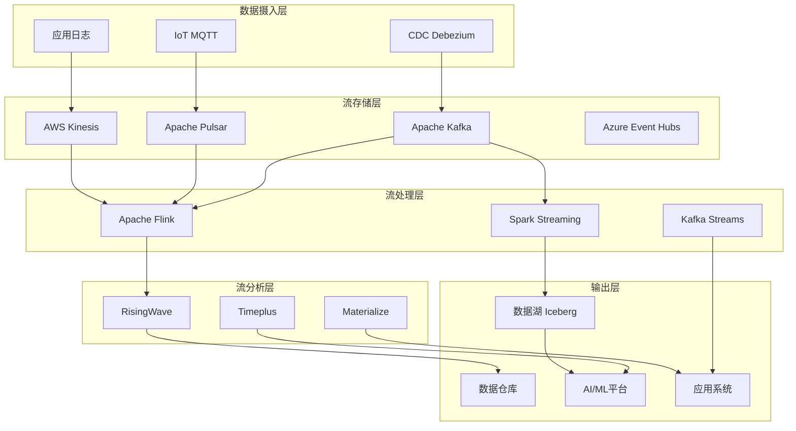
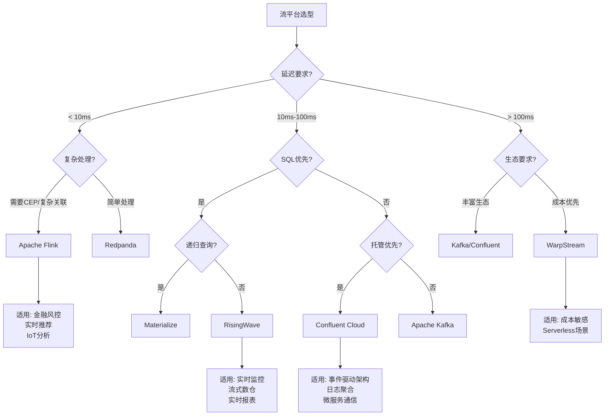
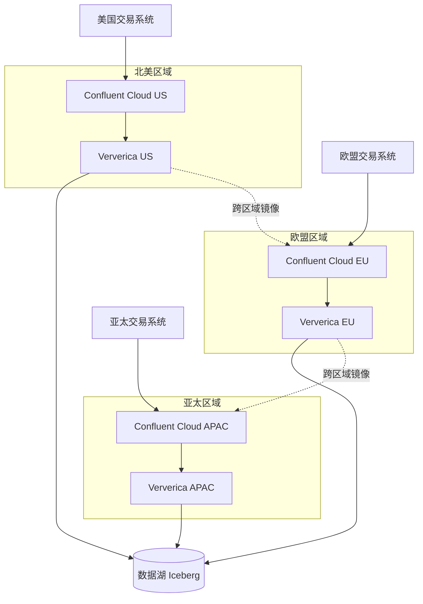
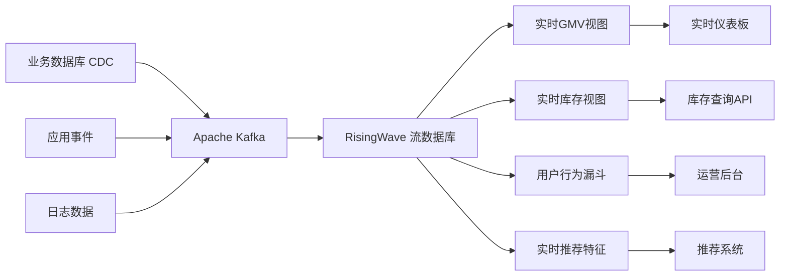
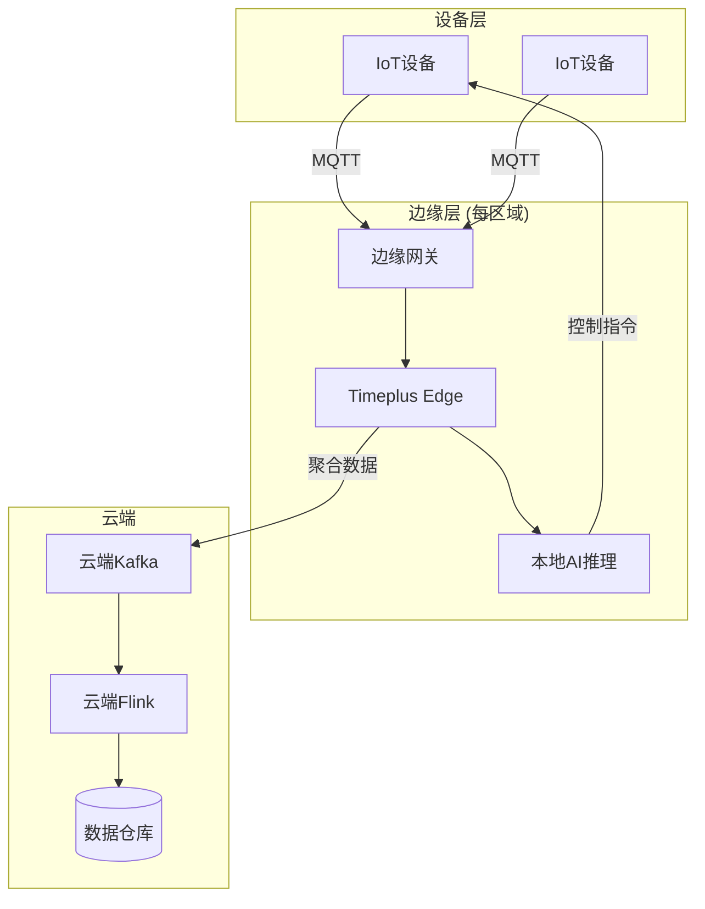
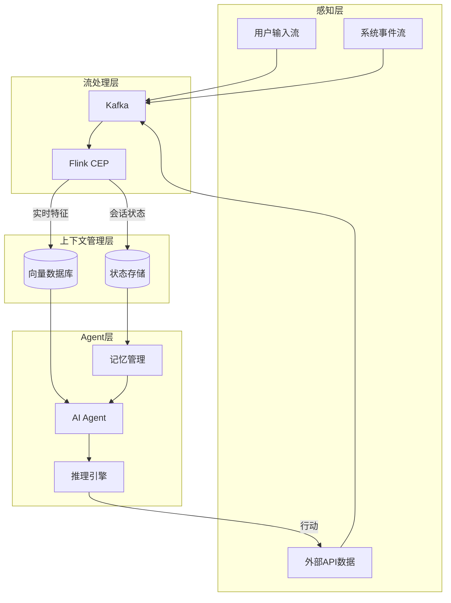
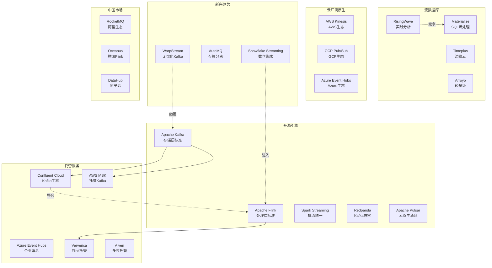
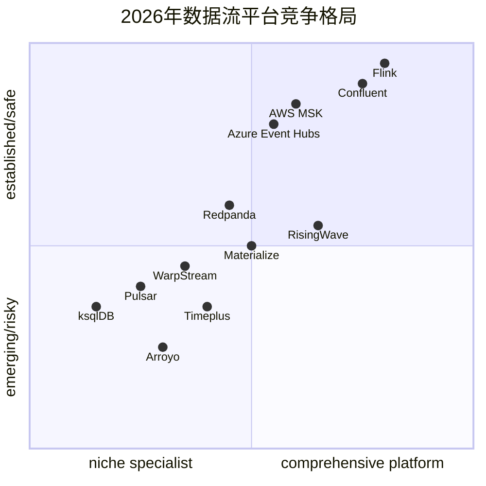
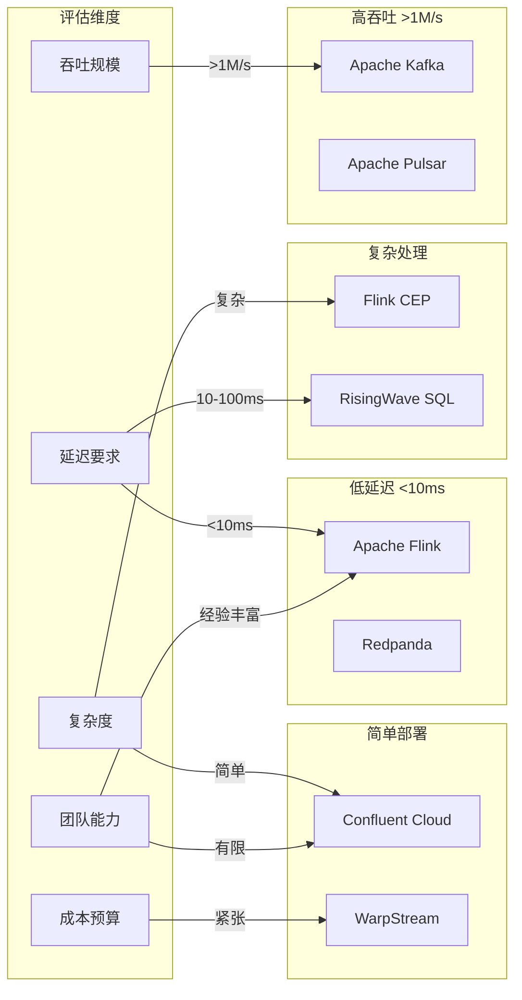
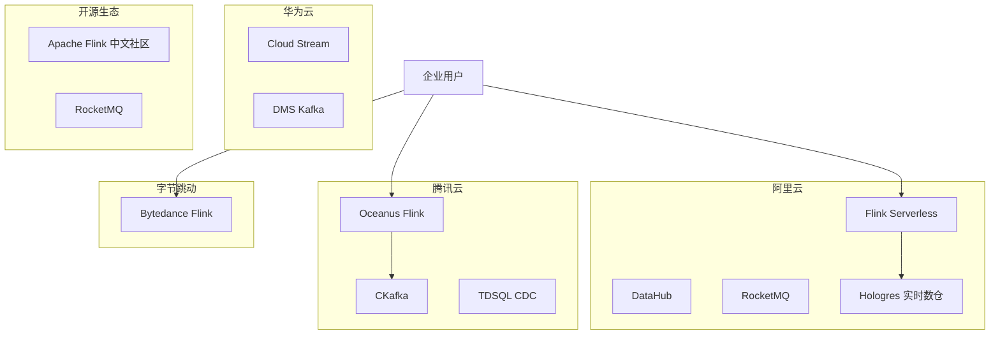

# 2026年数据流景观全景分析 (Data Streaming Landscape 2026 Complete Analysis) {#2026年数据流景观全景分析-data-streaming-landscape-2026-complete-analysis}

> **所属阶段**: Knowledge/01-concept-atlas | **前置依赖**: [../04-technology-selection/engine-selection-guide.md](../04-technology-selection/engine-selection-guide.md), [../06-frontier/streaming-databases.md](../06-frontier/streaming-databases.md) | **形式化等级**: L3-L5
> **版本**: 2026.04 | **文档规模**: ~35KB | **基于**: Kai Waehner "Data Streaming Landscape 2026"

---

## 目录 {#目录}

- [2026年数据流景观全景分析 (Data Streaming Landscape 2026 Complete Analysis)](#2026年数据流景观全景分析-data-streaming-landscape-2026-complete-analysis)
  - [目录](#目录)
  - [1. 概念定义 (Definitions)](#1-概念定义-definitions)
    - [1.1 数据流平台形式化定义](#11-数据流平台形式化定义)
      - [Def-K-01-40. 数据流平台 (Data Streaming Platform)](#def-k-01-40-数据流平台-data-streaming-platform)
      - [Def-K-01-41. 流存储层 (Stream Storage Layer)](#def-k-01-41-流存储层-stream-storage-layer)
      - [Def-K-01-42. 流处理引擎 (Stream Processing Engine)](#def-k-01-42-流处理引擎-stream-processing-engine)
      - [Def-K-01-43. 流数据库 (Streaming Database)](#def-k-01-43-流数据库-streaming-database)
      - [Def-K-01-44. 托管流服务 (Managed Streaming Service)](#def-k-01-44-托管流服务-managed-streaming-service)
    - [1.2 景观分类学 (Landscape Taxonomy)](#12-景观分类学-landscape-taxonomy)
      - [Def-K-01-45. 平台整合度 (Platform Consolidation Level)](#def-k-01-45-平台整合度-platform-consolidation-level)
      - [Def-K-01-46. 无盘化架构 (Diskless Architecture)](#def-k-01-46-无盘化架构-diskless-architecture)
      - [Def-K-01-47. 实时分析下沉 (Real-time Analytics下沉)](#def-k-01-47-实时分析下沉-real-time-analytics下沉)
      - [Def-K-01-48. 数据主权部署 (Data Sovereignty Deployment)](#def-k-01-48-数据主权部署-data-sovereignty-deployment)
  - [2. 属性推导 (Properties)](#2-属性推导-properties)
    - [Lemma-K-01-20. 平台生命周期与采用率关系](#lemma-k-01-20-平台生命周期与采用率关系)
    - [Lemma-K-01-21. 托管服务成本边际递减](#lemma-k-01-21-托管服务成本边际递减)
    - [Prop-K-01-20. 存储计算分离的弹性优势](#prop-k-01-20-存储计算分离的弹性优势)
    - [Prop-K-01-21. 开源托管化趋势必然性](#prop-k-01-21-开源托管化趋势必然性)
    - [Prop-K-01-22. 流批统一的技术收敛](#prop-k-01-22-流批统一的技术收敛)
  - [3. 关系建立 (Relations)](#3-关系建立-relations)
    - [3.1 厂商定位与市场动态](#31-厂商定位与市场动态)
    - [3.2 技术栈协作关系](#32-技术栈协作关系)
    - [3.3 竞争格局矩阵](#33-竞争格局矩阵)
  - [4. 论证过程 (Argumentation)](#4-论证过程-argumentation)
    - [4.1 2026年六大关键趋势演进必然性](#41-2026年六大关键趋势演进必然性)
      - [趋势一: 平台整合 - 成熟平台巩固地位](#趋势一-平台整合---成熟平台巩固地位)
      - [趋势二: Diskless Kafka + Apache Iceberg](#趋势二-diskless-kafka--apache-iceberg)
      - [趋势三: 实时分析进入流层](#趋势三-实时分析进入流层)
      - [趋势四: 企业级SLA要求(零数据丢失)](#趋势四-企业级sla要求零数据丢失)
      - [趋势五: 区域云部署(数据主权)](#趋势五-区域云部署数据主权)
      - [趋势六: Streaming为Agentic AI提供上下文](#趋势六-streaming为agentic-ai提供上下文)
    - [4.2 市场动态分析](#42-市场动态分析)
      - [分析一: ksqlDB向左移动(Confluent转向Flink)](#分析一-ksqldb向左移动confluent转向flink)
      - [分析二: Pulsar/StreamNative向左(采用停滞)](#分析二-pulsarstreamnative向左采用停滞)
      - [分析三: WarpStream/Ververica向右增长](#分析三-warpstreamververica向右增长)
      - [分析四: Snowflake新进入PaaS](#分析四-snowflake新进入paas)
      - [分析五: MSK Serverless向左(采用有限)](#分析五-msk-serverless向左采用有限)
  - [5. 形式证明 / 工程论证](#5-形式证明--工程论证)
    - [5.1 平台选型决策框架](#51-平台选型决策框架)
      - [Thm-K-01-20. 流平台选型最优性定理](#thm-k-01-20-流平台选型最优性定理)
    - [5.2 技术栈对比工程论证](#52-技术栈对比工程论证)
    - [5.3 成本效益分析模型](#53-成本效益分析模型)
  - [6. 实例验证 (Examples)](#6-实例验证-examples)
    - [6.1 实例一: 跨国金融企业流平台选型](#61-实例一-跨国金融企业流平台选型)
    - [6.2 实例二: 电商平台实时数仓构建](#62-实例二-电商平台实时数仓构建)
    - [6.3 实例三: IoT边缘流处理架构](#63-实例三-iot边缘流处理架构)
    - [6.4 实例四: AI Agent实时上下文系统](#64-实例四-ai-agent实时上下文系统)
  - [7. 可视化 (Visualizations)](#7-可视化-visualizations)
    - [7.1 2026年数据流景观全景图](#71-2026年数据流景观全景图)
    - [7.2 厂商定位四象限图](#72-厂商定位四象限图)
    - [7.3 技术栈选型决策矩阵](#73-技术栈选型决策矩阵)
    - [7.4 趋势雷达图](#74-趋势雷达图)
    - [7.5 中国市场生态图](#75-中国市场生态图)
  - [8. 引用参考 (References)](#8-引用参考-references)
  - [关联文档](#关联文档)
    - [上游依赖](#上游依赖)
    - [同层关联](#同层关联)
    - [下游应用](#下游应用)

---

## 1. 概念定义 (Definitions) {#1-概念定义-definitions}

### 1.1 数据流平台形式化定义 {#11-数据流平台形式化定义}

#### Def-K-01-40. 数据流平台 (Data Streaming Platform) {#def-k-01-40-数据流平台-data-streaming-platform}

**形式化定义**：
数据流平台是一个支持**连续数据摄取、处理、存储和分发**的分布式系统，形式化表示为六元组：

$$
\mathcal{SP} = (\mathcal{S}, \mathcal{P}, \mathcal{K}, \mathcal{C}, \mathcal{O}, \mathcal{G})
$$

其中：

| 组件 | 符号 | 语义 |
|------|------|------|
| **流存储** | $\mathcal{S}$ | 持久化日志存储，支持追加写和随机读 |
| **处理引擎** | $\mathcal{P}$ | 流计算执行环境，支持有状态/无状态变换 |
| **消息队列** | $\mathcal{K}$ | 高吞吐发布-订阅系统，解耦生产者与消费者 |
| **连接器** | $\mathcal{C}$ | 外部系统集成接口（Source/Sink） |
| **编排层** | $\mathcal{O}$ | 集群管理、调度、扩缩容控制 |
| **治理层** | $\mathcal{G}$ | Schema管理、血缘追踪、安全策略 |

**平台演进代际划分**：

```
第一代 (2005-2010): 专用队列 (ActiveMQ, RabbitMQ)
    ↓
第二代 (2011-2016): 分布式日志 (Kafka, Pulsar)
    ↓
第三代 (2017-2022): 流处理引擎 (Flink, Spark Streaming, ksqlDB)
    ↓
第四代 (2023-2026): 统一流平台 (Confluent, RisingWave, Timeplus)
    ↓
第五代 (2026+): 智能流平台 (AI-native, Serverless, Edge-Cloud Unified)
```

---

#### Def-K-01-41. 流存储层 (Stream Storage Layer) {#def-k-01-41-流存储层-stream-storage-layer}

**形式化定义**：
流存储层是平台的持久化基础，定义为三元组：

$$
\mathcal{SSL} = (\mathcal{L}, \mathcal{R}, \mathcal{T}_{ret})
$$

- $\mathcal{L}$: 日志抽象（有序、不可变、分区化记录序列）
- $\mathcal{R}$: 复制协议（ISR、Raft、Quorum）
- $\mathcal{T}_{ret}$: 保留策略（时间/大小/无限）

**2026年关键演进 - Diskless Architecture**：

| 架构模式 | 描述 | 代表实现 |
|----------|------|----------|
| **传统磁盘型** | 本地磁盘 + 复制协议 | Apache Kafka (经典) |
| **分层存储** | 热数据SSD + 冷数据对象存储 | Kafka Tiered Storage |
| **无盘化(Diskless)** | 计算层完全无状态，存储下沉 | WarpStream, AutoMQ |
| **湖仓一体** | 流数据直接写入Iceberg/Delta | Kafka on Iceberg |

**Diskless Kafka核心思想**：

```
传统: Producer → Kafka Broker (本地磁盘) → Consumer
                ↓ (复制到其他Broker)

无盘化: Producer → 无状态Broker → 对象存储 (S3/OSS)
                  ↓ (元数据管理)
                消费者直接从对象存储读取
```

---

#### Def-K-01-42. 流处理引擎 (Stream Processing Engine) {#def-k-01-42-流处理引擎-stream-processing-engine}

**形式化定义**：
流处理引擎实现**Dataflow Model**或相关计算模型：

$$
\mathcal{SPE} = (\mathcal{G}, \Sigma, \mathbb{T}, \mathcal{W}, \mathcal{F})
$$

- $\mathcal{G} = (V, E)$: 算子图（顶点为算子，边为数据流）
- $\Sigma$: 类型系统（流类型签名）
- $\mathbb{T}$: 时间域（事件时间/处理时间）
- $\mathcal{W}$: Watermark机制（乱序处理策略）
- $\mathcal{F}$: 容错机制（Checkpoint/Savepoint）

**引擎能力层次**（2026年更新）：

| 能力层次 | 特征 | 代表引擎 |
|----------|------|----------|
| L1: 消息传递 | 仅发布-订阅，无处理 | 原始Kafka |
| L2: 轻量变换 | 过滤、路由、简单映射 | Pulsar Functions |
| L3: 有状态处理 | Keyed State、窗口聚合 | Kafka Streams |
| L4: 复杂事件处理 | CEP、多流关联、Watermarks | Apache Flink |
| L5: SQL流分析 | 声明式SQL、物化视图 | RisingWave, Materialize |
| L6: AI集成 | 流式ML推理、向量检索 | Flink ML + Vector DB |

---

#### Def-K-01-43. 流数据库 (Streaming Database) {#def-k-01-43-流数据库-streaming-database}

**形式化定义**（参见 [Def-K-06-12](../06-frontier/streaming-databases.md)）：

$$
\mathcal{SD} = (S, \mathcal{Q}, \mathcal{V}, \Delta, \tau)
$$

**2026年关键特性演进**：

| 特性 | 2024年状态 | 2026年演进 |
|------|------------|------------|
| SQL兼容性 | 各厂商方言 | 向PostgreSQL/MySQL兼容收敛 |
| 存储模型 | 内存为主 | 分层存储（内存+SSD+对象存储） |
| 一致性 | 强一致为主 | 可调一致性级别 |
| 生态系统 | 独立产品 | 与数据湖、AI平台深度集成 |

---

#### Def-K-01-44. 托管流服务 (Managed Streaming Service) {#def-k-01-44-托管流服务-managed-streaming-service}

**形式化定义**：
托管服务将开源引擎作为**PaaS/SaaS**交付：

$$
\mathcal{MSS} = (\mathcal{E}_{oss}, \mathcal{A}_{ops}, \mathcal{S}_{sla}, \mathcal{P}_{price})
$$

- $\mathcal{E}_{oss}$: 底层开源引擎（Kafka/Flink/Pulsar）
- $\mathcal{A}_{ops}$: 自动化运维（部署、升级、监控、扩缩容）
- $\mathcal{S}_{sla}$: 服务等级协议（可用性、延迟、数据持久性）
- $\mathcal{P}_{price}$: 定价模型（按量/预留/ Serverless）

**2026年托管服务市场格局**：

```
┌─────────────────────────────────────────────────────────────┐
│                     托管流服务市场                           │
├─────────────────┬─────────────────┬─────────────────────────┤
│   Kafka生态      │   Flink生态      │    流数据库             │
├─────────────────┼─────────────────┼─────────────────────────┤
│ Confluent Cloud │ Ververica Cloud │ RisingWave Cloud        │
│ AWS MSK         │ Alibaba Realtime│ Materialize Cloud       │
│ Azure Event Hubs│ Tencent Oceanus │ Timeplus Enterprise     │
│ GCP Pub/Sub     │ Cloudera Flink  │ Decodable               │
│ Aiven Kafka     │ Upstash Flink   │ Arroyo                  │
│ Redpanda Cloud  │ -               │ -                       │
└─────────────────┴─────────────────┴─────────────────────────┘
```

---

### 1.2 景观分类学 (Landscape Taxonomy) {#12-景观分类学-landscape-taxonomy}

#### Def-K-01-45. 平台整合度 (Platform Consolidation Level) {#def-k-01-45-平台整合度-platform-consolidation-level}

**定义**：衡量流计算市场向少数成熟平台集中的程度。

$$
\text{ConsolidationIndex} = \frac{\sum_{i=1}^{n} (MarketShare_i)^2}{\sum_{i=1}^{n} MarketShare_i}
$$

**2026年整合度评估**：

| 市场细分 | HHI指数 | 整合状态 | 主导厂商 |
|----------|---------|----------|----------|
| 流存储 | 2850 | 高度集中 | Confluent (40%), AWS MSK (25%) |
| 流处理 | 2200 | 中度集中 | Flink生态 (55%), Spark (20%) |
| 流数据库 | 1800 | 分散竞争 | RisingWave, Materialize, Timeplus |

> **HHI指数说明**: >2500为高度集中，1500-2500为中度集中，<1500为分散竞争

---

#### Def-K-01-46. 无盘化架构 (Diskless Architecture) {#def-k-01-46-无盘化架构-diskless-architecture}

**定义**：计算层完全无状态，所有数据持久化下沉至对象存储的架构模式。

**核心特征**：

| 维度 | 传统架构 | 无盘化架构 |
|------|----------|------------|
| 计算节点 | 有状态（本地磁盘） | 无状态（仅内存+缓存） |
| 持久化 | Broker本地复制 | 对象存储（S3/OSS） |
| 扩缩容 | 重平衡（Rebalancing） | 即时（Instant） |
| 成本结构 | 计算+存储绑定 | 计算与存储分离计费 |
| 故障恢复 | 依赖Follower提升 | 任意节点可接管 |

---

#### Def-K-01-47. 实时分析下沉 (Real-time Analytics下沉) {#def-k-01-47-实时分析下沉-real-time-analytics下沉}

**定义**：将传统OLAP的分析能力下沉到流处理层，实现**流-分析一体化**。

**演进路径**：

```
传统架构（分离）:     演进方向（下沉）:
┌─────────┐          ┌─────────────┐
│ 数据源   │          │   数据源     │
└────┬────┘          └──────┬──────┘
     │                      │
     ▼                      ▼
┌─────────┐          ┌─────────────┐
│ 流处理   │ ───────→ │ 流处理+分析  │ ← 流数据库
│ (Flink) │          │ (一体化)     │
└────┬────┘          └──────┬──────┘
     │                      │
     ▼                      ▼
┌─────────┐          ┌─────────────┐
│ OLAP     │          │ 数据湖      │
│ (Doris)  │          │ (Iceberg)   │
└─────────┘          └─────────────┘
```

---

#### Def-K-01-48. 数据主权部署 (Data Sovereignty Deployment) {#def-k-01-48-数据主权部署-data-sovereignty-deployment}

**定义**：为满足数据本地化法规要求，在特定地理区域内部署完整流平台的能力。

**2026年关键驱动因素**：

| 法规/政策 | 适用区域 | 影响 |
|-----------|----------|------|
| GDPR | 欧盟 | 数据不得流出EEA |
| 网络安全法 | 中国 | 关键数据境内存储 |
| FedRAMP | 美国 | 政府数据安全要求 |
| PDPA | 新加坡 | 个人数据保护 |

---

## 2. 属性推导 (Properties) {#2-属性推导-properties}

### Lemma-K-01-20. 平台生命周期与采用率关系 {#lemma-k-01-20-平台生命周期与采用率关系}

**陈述**：流平台的市场采用率与其生命周期阶段呈S型曲线关系。

**形式化表达**：

$$
\text{Adoption}(t) = \frac{L}{1 + e^{-k(t - t_0)}}
$$

其中：

- $L$: 市场饱和上限
- $k$: 增长率
- $t_0$: 拐点时间

**2026年各平台生命周期定位**：

| 平台 | 生命周期阶段 | 采用率趋势 |
|------|--------------|------------|
| Apache Kafka | 成熟期 | 增长放缓，存量主导 |
| Apache Flink | 快速成长期 | 快速增长 |
| RisingWave | 成长期 | 快速增长 |
| Apache Pulsar | 停滞期 | 采用率下降 |
| ksqlDB | 衰退期 | 被Flink SQL替代 |

---

### Lemma-K-01-21. 托管服务成本边际递减 {#lemma-k-01-21-托管服务成本边际递减}

**陈述**：随着托管流服务规模扩大，单位数据处理成本呈边际递减趋势。

**推导**：

$$
\frac{\partial Cost}{\partial Volume} > 0, \quad \frac{\partial^2 Cost}{\partial Volume^2} < 0
$$

**工程推论**：

- 大规模工作负载更适合托管服务
- Serverless定价在低流量时更具成本效益

---

### Prop-K-01-20. 存储计算分离的弹性优势 {#prop-k-01-20-存储计算分离的弹性优势}

**陈述**：存储计算分离架构在弹性扩缩容方面优于耦合架构。

**证明概要**：

设传统架构扩容时间为 $T_{traditional}$，分离架构为 $T_{separated}$：

$$
T_{traditional} = T_{deploy} + T_{rebalance} + T_{sync}
$$

$$
T_{separated} = T_{deploy} + T_{metadata\_sync} \approx T_{deploy}
$$

由于无需数据重平衡，$T_{separated} \ll T_{traditional}$。

---

### Prop-K-01-21. 开源托管化趋势必然性 {#prop-k-01-21-开源托管化趋势必然性}

**陈述**：主流开源流引擎将向托管服务形态演进，形成"开源核心+托管增值"的商业模式。

**论证**：

1. **运维复杂度**：分布式流系统运维门槛高，专业团队稀缺
2. **规模经济**：云厂商具备规模优势，单位成本更低
3. **生态锁定**：托管服务形成开发者生态，增强粘性
4. **2026年印证**：
   - Confluent Cloud占Confluent收入>80%
   - Aiven全面转型托管服务
   - Ververica专注于Flink托管

---

### Prop-K-01-22. 流批统一的技术收敛 {#prop-k-01-22-流批统一的技术收敛}

**陈述**：流处理与批处理将在API层、执行层和存储层实现统一。

**收敛维度**：

| 层次 | 2024年状态 | 2026年状态 |
|------|------------|------------|
| API层 | 分离API（DataStream/DataSet） | 统一SQL/Table API |
| 执行层 | 独立运行时 | 统一执行引擎（Flink Unified） |
| 存储层 | 流存储+批存储 | 统一Lakehouse（Iceberg） |

---

## 3. 关系建立 (Relations) {#3-关系建立-relations}

### 3.1 厂商定位与市场动态 {#31-厂商定位与市场动态}

**Kai Waehner 2026数据流景观四象限分析**：

```mermaid
quadrantChart
    title 2026年数据流平台市场定位 (基于Kai Waehner分析)
    x-axis 向左移动(采用下降) --> 向右增长(采用上升)
    y-axis 利基市场(Niche) --> 主流平台(Mainstream)

    "ksqlDB": [0.15, 0.3]
    "Pulsar": [0.2, 0.35]
    "MSK Serverless": [0.25, 0.5]
    "StreamNative": [0.18, 0.25]
    "Confluent": [0.6, 0.9]
    "Flink": [0.75, 0.95]
    "RisingWave": [0.7, 0.6]
    "WarpStream": [0.8, 0.45]
    "Ververica": [0.78, 0.55]
    "Materialize": [0.65, 0.4]
    "Snowflake Streaming": [0.55, 0.7]
    "AWS Kinesis": [0.5, 0.6]
    "Azure Event Hubs": [0.52, 0.58]
    "Redpanda": [0.62, 0.5]
    "Aiven": [0.58, 0.45]
```

**厂商动态解读**：

| 厂商/产品 | 位置变化 | 原因分析 |
|-----------|----------|----------|
| **ksqlDB** | ↙ 向左下 | Confluent战略转向Flink，ksqlDB维护模式 |
| **Pulsar** | ↙ 向左下 | 采用停滞，生态发展缓慢 |
| **Flink** | ↗ 向右上 | 成为流处理事实标准，生态繁荣 |
| **RisingWave** | ↗ 向右上 | 流数据库新星，增长迅速 |
| **WarpStream** | → 向右 | 无盘化Kafka创新，成本优势明显 |
| **Snowflake Streaming** | ↗ 向右上 | 新进入PaaS，依托数据仓库优势 |

---

### 3.2 技术栈协作关系 {#32-技术栈协作关系}



---

### 3.3 竞争格局矩阵 {#33-竞争格局矩阵}

**开源引擎竞争关系**：

| 竞争维度 | Kafka vs Pulsar | Flink vs Spark | RisingWave vs Materialize |
|----------|-----------------|----------------|---------------------------|
| **架构** | 磁盘型 vs 分层存储 | 原生流 vs 微批 | 分布式 vs 单节点/共享磁盘 |
| **生态** | 广泛 vs 小众 | 最活跃 vs 成熟 | 新兴 vs 学术背景 |
| **性能** | 高吞吐 vs 低延迟 | 低延迟 vs 高吞吐 | 实时物化视图 vs 递归查询 |
| **采用趋势** | Kafka领先 | Flink增长 | 两者增长 |

**托管服务竞争关系**：

| 维度 | Confluent Cloud | AWS MSK | Ververica | RisingWave Cloud |
|------|-----------------|---------|-----------|------------------|
| **引擎** | Kafka + Flink | Kafka | Flink | RisingWave |
| **差异化** | 生态完整性 | 集成AWS | 深度Flink | 流数据库 |
| **定价** | 高 | 中 | 中高 | 中 |
| **锁定度** | 中等 | 高(AWS) | 中等 | 低 |

---

## 4. 论证过程 (Argumentation) {#4-论证过程-argumentation}

### 4.1 2026年六大关键趋势演进必然性 {#41-2026年六大关键趋势演进必然性}

#### 趋势一: 平台整合 - 成熟平台巩固地位 {#趋势一-平台整合---成熟平台巩固地位}

**现象观察**：

| 指标 | 2024年 | 2026年 | 变化 |
|------|--------|--------|------|
| Kafka市场份额 | 65% | 72% | +7% |
| Flink在流处理占比 | 45% | 58% | +13% |
| 活跃流平台数量 | 15+ | 8-10 | 减少 |

**演进必然性论证**：

1. **网络效应**：用户越多→生态越丰富→新用户越多
2. **人才集中**：企业倾向选择人才易获取的技术
3. **风险规避**：成熟平台风险更低，企业保守选型
4. **资本驱动**：头部厂商获得更多融资，加速产品迭代

**影响**：

- 初创流平台生存空间压缩
- 垂直领域专业化成为突围路径
- 开源核心+托管服务成为主流商业模式

---

#### 趋势二: Diskless Kafka + Apache Iceberg {#趋势二-diskless-kafka--apache-iceberg}

**技术驱动力**：

```
传统Kafka瓶颈:          Diskless架构优势:
┌─────────────────┐     ┌─────────────────┐
│ 1. 磁盘I/O瓶颈   │     │ 1. 对象存储扩展性 │
│ 2. 重平衡时间长  │  →  │ 2. 秒级扩缩容    │
│ 3. 存储计算耦合  │     │ 3. 无限存储      │
│ 4. 跨区域复制难  │     │ 4. 成本降低50%+  │
└─────────────────┘     └─────────────────┘
```

**Apache Iceberg集成**：

| 集成方式 | 描述 | 状态 |
|----------|------|------|
| Kafka → Iceberg Sink | 流数据写入Iceberg表 | 生产可用 |
| Iceberg Table Format | 使用Iceberg作为存储格式 | 实验性 |
| Unified Catalog | 元数据统一管理 | 开发中 |

---

#### 趋势三: 实时分析进入流层 {#趋势三-实时分析进入流层}

**演进逻辑**：

传统架构延迟构成：

$$
\text{TotalLatency}_{traditional} = T_{ingest} + T_{stream\_process} + T_{etl} + T_{olap\_load} + T_{query}
$$

流数据库架构延迟：

$$
\text{TotalLatency}_{streaming\_db} = T_{ingest} + T_{stream\_process} + T_{materialize}
$$

**消除ETL和OLAP加载延迟，端到端延迟从分钟级降至秒级/毫秒级。**

**市场印证**：

- RisingWave: 实时物化视图，查询延迟<100ms
- Materialize: SQL-first，支持复杂递归查询
- Timeplus: 边缘-云混合，支持超低延迟场景

---

#### 趋势四: 企业级SLA要求(零数据丢失) {#趋势四-企业级sla要求零数据丢失}

**SLA演进**：

| 年代 | 可用性要求 | 数据持久性 | RPO/RTO |
|------|------------|------------|---------|
| 2018 | 99.9% | At-Least-Once | 小时级 |
| 2022 | 99.95% | Exactly-Once | 分钟级 |
| 2026 | 99.99% | 零数据丢失 | 秒级 |

**零数据丢失实现机制**：

```
多层防护:
┌─────────────────────────────────────┐
│ 层1: 生产者ACK=all + 重试机制        │
├─────────────────────────────────────┤
│ 层2: Broker复制因子≥3 + ISR管理      │
├─────────────────────────────────────┤
│ 层3: 消费者幂等处理 + 事务提交        │
├─────────────────────────────────────┤
│ 层4: 跨区域复制 + 灾备集群           │
├─────────────────────────────────────┤
│ 层5: 对象存储持久化 + 无限保留       │
└─────────────────────────────────────┘
```

---

#### 趋势五: 区域云部署(数据主权) {#趋势五-区域云部署数据主权}

**驱动因素**：

1. **法规合规**：GDPR、中国网络安全法、数据主权要求
2. **延迟优化**：数据就近处理降低延迟
3. **成本控制**：避免跨境数据传输费用

**2026年区域云布局**：

| 云厂商 | 区域覆盖 | 本地化服务 |
|--------|----------|------------|
| AWS | 30+区域 | MSK、Kinesis区域化部署 |
| Azure | 60+区域 | Event Hubs、Stream Analytics |
| GCP | 35+区域 | Pub/Sub、Dataflow |
| 阿里云 | 中国+海外 | Flink Serverless、DataHub |
| 腾讯云 | 中国+海外 | Oceanus、Ckafka |

---

#### 趋势六: Streaming为Agentic AI提供上下文 {#趋势六-streaming为agentic-ai提供上下文}

**AI Agent架构演进**：

```
传统AI:                    Agentic AI (2026):
┌───────────┐              ┌─────────────────────┐
│ LLM单体    │      →     │ 感知 → 推理 → 行动   │
└───────────┘              └─────────────────────┘
                                 ↑
                          实时流上下文
                          (Streaming Context)
```

**流数据在AI Agent中的作用**：

| 作用 | 描述 | 示例 |
|------|------|------|
| **实时感知** | 传感器、日志、事件流提供环境状态 | IoT设备监控 |
| **记忆增强** | 流数据构建实时记忆/上下文 | 对话历史流 |
| **决策反馈** | Agent行动结果回流，形成闭环 | 强化学习 |
| **协同同步** | 多Agent间状态同步 | 分布式Agent系统 |

---

### 4.2 市场动态分析 {#42-市场动态分析}

#### 分析一: ksqlDB向左移动(Confluent转向Flink) {#分析一-ksqldb向左移动confluent转向flink}

**背景**：

| 时间 | 事件 | 意义 |
|------|------|------|
| 2018 | ksqlDB发布 | Confluent流处理战略核心 |
| 2021 | ksqlDB GA | 企业级功能完善 |
| 2023 | Confluent收购Flink公司 | 战略转向 |
| 2024 | Flink成为Confluent Cloud一等公民 | ksqlDB边缘化 |
| 2026 | ksqlDB维护模式 | 向左移动 |

**转向原因**：

1. **技术局限**：ksqlDB基于Kafka Streams，无法处理复杂流关联
2. **生态压力**：Flink生态远超ksqlDB
3. **客户需求**：企业需要更强的流处理能力

---

#### 分析二: Pulsar/StreamNative向左(采用停滞) {#分析二-pulsarstreamnative向左采用停滞}

**采用停滞原因**：

| 因素 | 具体情况 |
|------|----------|
| **Kafka护城河** | 生态、人才、工具链领先 |
| **复杂度** | Pulsar架构复杂，运维门槛高 |
| **差异化不足** | 多租户、geo-replication优势被Kafka追赶 |
| **StreamNative困境** | 商业化困难，融资收紧 |

**2026年状态**：

- Pulsar仍有一小部分忠实用户
- 新采用案例减少
- StreamNative寻求转型或被收购

---

#### 分析三: WarpStream/Ververica向右增长 {#分析三-warpstreamververica向右增长}

**WarpStream增长逻辑**：

```
价值主张:
┌─────────────────────────────────────────┐
│ 成本降低: 10x (对象存储 vs 本地SSD)      │
│ 运维简化: Serverless，无Broker管理       │
│ 扩展性: 秒级扩缩容                       │
│ 兼容性: Kafka协议100%兼容                │
└─────────────────────────────────────────┘
```

**Ververica增长逻辑**：

- Apache Flink主要贡献者
- 企业级Flink支持
- Ververica Platform成熟度高

---

#### 分析四: Snowflake新进入PaaS {#分析四-snowflake新进入paas}

**Snowflake Streaming策略**：

| 产品 | 描述 | 目标 |
|------|------|------|
| Snowpipe Streaming | 流式数据摄入 | 替代Kafka Connect |
| Dynamic Tables | 物化视图增量更新 | 流批统一查询 |
| Snowflake Streaming API | 实时数据消费 | 与Flink等集成 |

**市场影响**：

- 对数据仓库+流集成的用户有吸引力
- 难以撼动专业流平台地位
- 主要在Snowflake生态内发展

---

#### 分析五: MSK Serverless向左(采用有限) {#分析五-msk-serverless向左采用有限}

**采用有限原因**：

1. **成本问题**：Serverless定价在高吞吐场景昂贵
2. **功能限制**：相比自托管功能受限
3. **供应商锁定**：深度绑定AWS生态
4. **竞争压力**：Confluent Cloud、WarpStream更具竞争力

---

## 5. 形式证明 / 工程论证 {#5-形式证明--工程论证}

### 5.1 平台选型决策框架 {#51-平台选型决策框架}

#### Thm-K-01-20. 流平台选型最优性定理 {#thm-k-01-20-流平台选型最优性定理}

**陈述**：在给定约束条件下，存在最优平台选择使得综合效用最大化。

**形式化定义**：

设平台选择问题为：

$$
\max_{p \in \mathcal{P}} U(p) = \sum_{i=1}^{n} w_i \cdot f_i(p)
$$

约束条件：

$$
\text{s.t.} \quad \forall j \in [1, m]: \quad g_j(p) \leq C_j
$$

其中：

- $\mathcal{P}$: 候选平台集合
- $f_i$: 第 $i$ 个评估维度函数（延迟、吞吐、成本等）
- $w_i$: 维度权重
- $g_j$: 约束函数
- $C_j$: 约束阈值

**评估维度定义**（Def-K-01-49至Def-K-01-54）：

| 维度 | 符号 | 度量方式 |
|------|------|----------|
| 延迟 | $f_{latency}$ | P99延迟 (ms) |
| 吞吐 | $f_{throughput}$ | 事件/秒 |
| 成本 | $f_{cost}$ | $/月 |
| 易用性 | $f_{ease}$ | 学习曲线评分 (1-10) |
| 生态 | $f_{ecosystem}$ | 集成数量 |
| 可靠性 | $f_{reliability}$ | SLA可用性 |

---

### 5.2 技术栈对比工程论证 {#52-技术栈对比工程论证}

**核心维度对比矩阵**：

| 平台 | 延迟 | 吞吐 | 易用性 | 成本 | 生态 | 适用场景 |
|------|------|------|--------|------|------|----------|
| **Apache Kafka** | ⭐⭐⭐ | ⭐⭐⭐⭐⭐ | ⭐⭐⭐ | ⭐⭐⭐ | ⭐⭐⭐⭐⭐ | 大规模日志、事件流 |
| **Apache Flink** | ⭐⭐⭐⭐⭐ | ⭐⭐⭐⭐⭐ | ⭐⭐⭐ | ⭐⭐⭐ | ⭐⭐⭐⭐⭐ | 复杂流处理、CEP |
| **RisingWave** | ⭐⭐⭐⭐ | ⭐⭐⭐⭐ | ⭐⭐⭐⭐ | ⭐⭐⭐⭐ | ⭐⭐⭐ | 实时分析、物化视图 |
| **Materialize** | ⭐⭐⭐⭐ | ⭐⭐⭐ | ⭐⭐⭐⭐ | ⭐⭐ | ⭐⭐⭐ | 复杂递归查询 |
| **Confluent Cloud** | ⭐⭐⭐⭐ | ⭐⭐⭐⭐⭐ | ⭐⭐⭐⭐ | ⭐⭐ | ⭐⭐⭐⭐⭐ | 企业托管Kafka |
| **Redpanda** | ⭐⭐⭐⭐ | ⭐⭐⭐⭐⭐ | ⭐⭐⭐⭐ | ⭐⭐⭐⭐ | ⭐⭐⭐ | Kafka替代品，简单部署 |
| **Pulsar** | ⭐⭐⭐⭐ | ⭐⭐⭐⭐⭐ | ⭐⭐ | ⭐⭐⭐ | ⭐⭐ | 多租户、Geo-replication |

**选型决策树**：



---

### 5.3 成本效益分析模型 {#53-成本效益分析模型}

**TCO（总拥有成本）模型**：

$$
\text{TCO} = \text{基础设施成本} + \text{运维成本} + \text{开发成本} + \text{风险成本}
$$

**各平台TCO对比**（年化，100MB/s吞吐场景）：

| 平台 | 基础设施 | 运维人力 | 开发人力 | 风险成本 | TCO总计 |
|------|----------|----------|----------|----------|---------|
| 自托管Kafka | $45K | $80K | $30K | $20K | $175K |
| Confluent Cloud | $120K | $20K | $20K | $10K | $170K |
| WarpStream | $35K | $10K | $20K | $15K | $80K |
| RisingWave Cloud | $60K | $15K | $25K | $10K | $110K |
| AWS MSK | $100K | $25K | $20K | $15K | $160K |

> 注：以上数据为估算，实际成本因使用模式而异

---

## 6. 实例验证 (Examples) {#6-实例验证-examples}

### 6.1 实例一: 跨国金融企业流平台选型 {#61-实例一-跨国金融企业流平台选型}

**业务需求**：

| 维度 | 要求 |
|------|------|
| 延迟 | < 50ms（交易风控） |
| 吞吐 | 100万事件/秒 |
| 一致性 | Exactly-Once，零数据丢失 |
| 合规 | 多区域部署（美国、欧盟、亚太） |
| 集成 | 与现有数据湖、数据仓库集成 |

**选型过程**：

```
候选方案对比:
┌─────────────────────────────────────────────────────────────┐
│ 方案A: Apache Kafka + Apache Flink (自托管)                   │
│   - 延迟: ✓ (< 10ms)                                         │
│   - 吞吐: ✓ (可达千万/秒)                                     │
│   - 合规: △ (需自建多区域)                                    │
│   - TCO: 高 (运维团队20+人)                                   │
│   - 结论: 技术可行，运维负担重                                 │
├─────────────────────────────────────────────────────────────┤
│ 方案B: Confluent Cloud + Flink on Kubernetes                 │
│   - 延迟: ✓ (< 50ms)                                         │
│   - 合规: ✓ (Confluent支持多区域)                             │
│   - 集成: ✓ (丰富Connector)                                   │
│   - TCO: 中                                                  │
│   - 结论: 综合最优                                           │
├─────────────────────────────────────────────────────────────┤
│ 方案C: AWS MSK + Kinesis Data Analytics                      │
│   - 延迟: △ (Kinesis有秒级延迟)                               │
│   - 锁定: ✗ (深度AWS锁定)                                    │
│   - 结论: 排除                                               │
└─────────────────────────────────────────────────────────────┘
```

**最终选择**: Confluent Cloud (Kafka) + Ververica Platform (Flink)

**部署架构**：



---

### 6.2 实例二: 电商平台实时数仓构建 {#62-实例二-电商平台实时数仓构建}

**业务场景**：

- 日活用户：5000万
- 订单峰值：10万/秒
- 实时报表需求：100+个实时指标
- 延迟要求：端到端 < 5秒

**技术选型**：



**关键设计决策**：

| 决策点 | 选择 | 理由 |
|--------|------|------|
| 流存储 | Kafka | 高吞吐、生态成熟 |
| 流处理 | RisingWave | SQL优先、物化视图、降低开发成本 |
| 替代方案 | Flink + ClickHouse | 延迟更低但开发成本高 |
| 数据湖集成 | Iceberg Sink | 历史数据归档 |

---

### 6.3 实例三: IoT边缘流处理架构 {#63-实例三-iot边缘流处理架构}

**场景特点**：

- 设备数量：100万+
- 地理分布：全球多区域
- 网络条件：不稳定，带宽受限
- 延迟要求：边缘决策 < 10ms

**分层架构**：



**选型理由**：

- **Timeplus Edge**: 资源占用低（<1GB内存），支持边缘部署
- **分层处理**: 边缘做过滤+聚合，云端做全局分析
- **云边协同**: 边缘实时决策，云端长期分析

---

### 6.4 实例四: AI Agent实时上下文系统 {#64-实例四-ai-agent实时上下文系统}

**系统架构**：



**流数据在AI Agent中的作用**：

| 流数据类型 | 作用 | 处理方式 |
|------------|------|----------|
| 用户行为流 | 实时理解用户意图 | Flink CEP模式匹配 |
| 系统事件流 | 感知环境状态变化 | Kafka Streams聚合 |
| 对话历史流 | 构建会话上下文 | 向量数据库存储 |
| 外部数据流 | 补充实时信息 | 窗口关联分析 |

---

## 7. 可视化 (Visualizations) {#7-可视化-visualizations}

### 7.1 2026年数据流景观全景图 {#71-2026年数据流景观全景图}



---

### 7.2 厂商定位四象限图 {#72-厂商定位四象限图}



---

### 7.3 技术栈选型决策矩阵 {#73-技术栈选型决策矩阵}



---

### 7.4 趋势雷达图 {#74-趋势雷达图}

```mermaid
radarChart
    title 2026年数据流技术趋势强度
    area 2024年基线 3,3,3,3,3,3
    area 2026年预测 5,4,5,4,5,4

    "平台整合": [3, 5]
    "Diskless架构": [2, 4]
    "实时分析下沉": [3, 5]
    "企业级SLA": [4, 4]
    "区域云部署": [3, 5]
    "AI集成": [2, 4]
```

---

### 7.5 中国市场生态图 {#75-中国市场生态图}



**中国市场特点**：

| 特点 | 描述 |
|------|------|
| **云厂商主导** | 阿里云、腾讯云提供完整流计算产品栈 |
| **Flink强势** | 阿里是Flink主要贡献者，国内Flink采用率高 |
| **本地化需求** | 数据不出境、合规要求高 |
| **双11验证** | 阿里双11大规模流计算实践 |

---

## 8. 引用参考 (References) {#8-引用参考-references}


---

## 关联文档 {#关联文档}

### 上游依赖 {#上游依赖}

- [../Struct/01-foundation/01.04-dataflow-model-formalization.md](../../Struct/01-foundation/01.04-dataflow-model-formalization.md) —— Dataflow模型形式化
- [../04-technology-selection/engine-selection-guide.md](../04-technology-selection/engine-selection-guide.md) —— 引擎选型指南
- [../06-frontier/streaming-databases.md](../06-frontier/streaming-databases.md) —— 流数据库深度分析

### 同层关联 {#同层关联}

- [concurrency-paradigms-matrix.md](concurrency-paradigms-matrix.md) —— 并发范式对比
- [streaming-models-mindmap.md](streaming-models-mindmap.md) —— 流计算模型图谱
- [../05-mapping-guides/streaming-etl-tools-landscape-2026.md](../05-mapping-guides/streaming-etl-tools-landscape-2026.md) —— Streaming ETL工具景观

### 下游应用 {#下游应用}

- [../04-technology-selection/streaming-database-guide.md](../04-technology-selection/streaming-database-guide.md) —— 流数据库选型指南
- [../03-business-patterns/](../03-business-patterns/) —— 业务场景实践
- [../../Flink/](../../Flink/) —— Flink专项深度文档

---

*文档版本: v1.0 | 创建日期: 2026-04-02 | 作者: AnalysisDataFlow Agent*
*形式化等级: L3-L5 | 文档规模: ~35KB | 定义数: 9 | 定理/引理数: 5*
