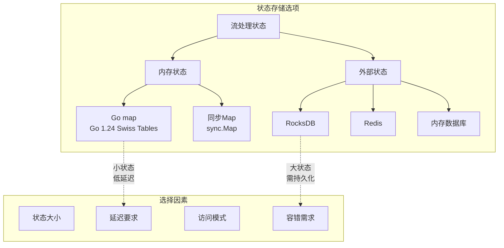
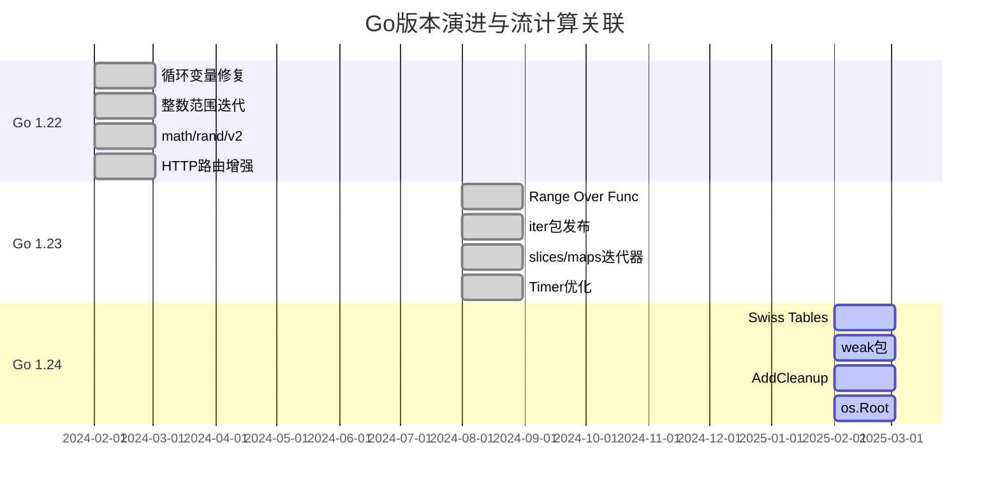
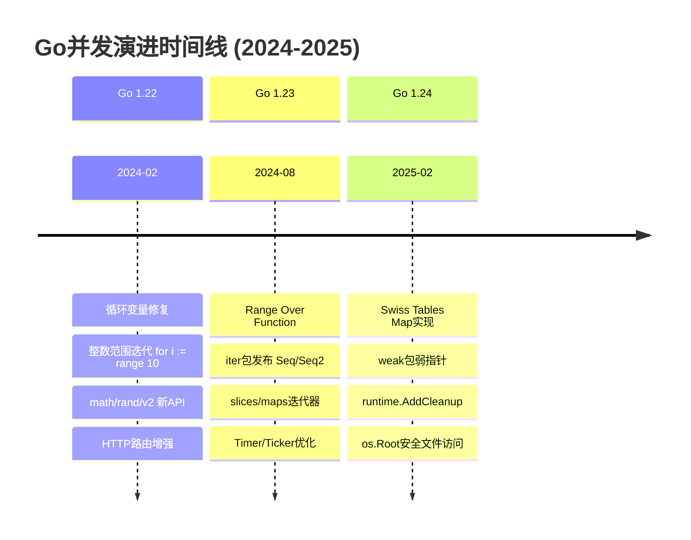
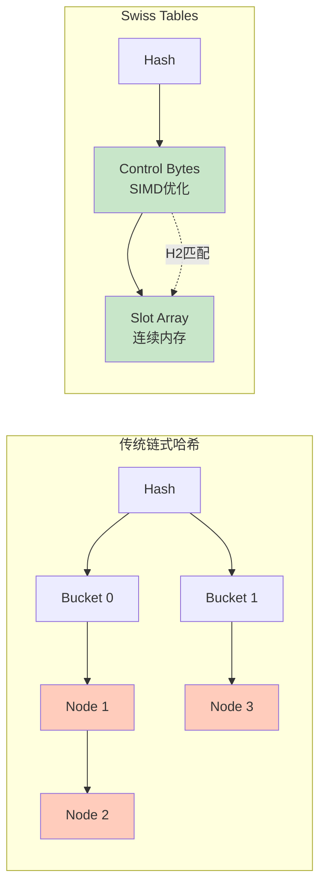
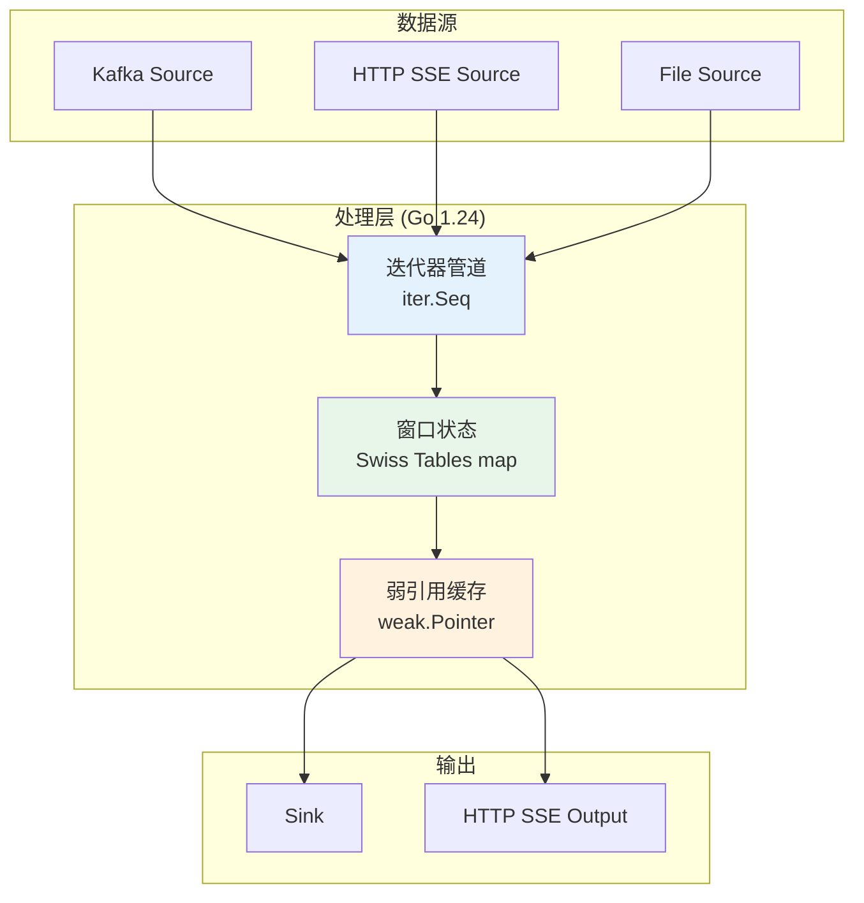

# Go 1.22/1.23/1.24新特性与流计算应用指南

> **所属阶段**: Knowledge/01-concept-atlas | **前置依赖**: [01.01-stream-processing-fundamentals](./01.01-stream-processing-fundamentals.md), [concurrency-paradigms-matrix](./concurrency-paradigms-matrix.md) | **形式化等级**: L3-L4 | **难度**: 中高级 | **预计阅读时间**: 50分钟

---

## 1. 概念定义 (Definitions)

### 1.1 Go迭代器抽象

**定义 1.1 (Go迭代器类型)** [Def-G-02-01]

Go 1.23引入的迭代器类型系统可形式化定义为：

$$\mathcal{I}_{Go} = Seq(V) \mid Seq2(K, V) \mid Chan(T)$$

其中：

- $Seq(V) = (V \rightarrow \mathbb{B}) \rightarrow \mathbb{B}$ —— 单值迭代器
- $Seq2(K, V) = (K \times V \rightarrow \mathbb{B}) \rightarrow \mathbb{B}$ —— 键值对迭代器
- $Chan(T)$ —— 通道类型（原有并发原语）

```go
// iter包核心抽象
package iter

type Seq[V any] func(yield func(V) bool)
type Seq2[K, V any] func(yield func(K, V) bool)
```

迭代器语义：当 `yield` 返回 `false` 时，迭代应立即终止（短路机制）。这对应于流处理中的**反压信号 (Backpressure Signal)**。

**定义 1.2 (Range Over Function)** [Def-G-02-02]

Range Over Function 是Go语言在1.23版本中正式纳入规范的语法特性，允许 `range` 关键字直接迭代函数：

$$\text{range}: Func_{iterable} \rightarrow \text{Control Flow}$$

其形式化语义可表述为：对于迭代器函数 $f$ 和循环体 $body$，执行：

$$\forall v \in f: body(v) \text{ 直到 } body(v) = false$$

**定义 1.3 (Pull迭代器语义)** [Def-G-02-03]

迭代器可按控制流方向分类。Pull迭代器的形式化定义为：

$$\text{Pull}: \mathcal{S} \rightarrow (V \times \mathcal{S})_\bot$$

其中 $\mathcal{S}$ 为状态空间，$\bot$ 表示流结束信号。Pull迭代器由消费者控制迭代节奏，消费者主动请求下一个元素。

**定义 1.4 (Push迭代器语义)** [Def-G-02-04]

Push迭代器的形式化定义为：

$$\text{Push}: (V \rightarrow \mathbf{1}) \rightarrow \mathbf{1}$$

Go的 `iter.Seq` 属于Push迭代器，由生产者控制迭代节奏，通过回调函数将元素推送给消费者。`yield` 的返回值允许消费者反馈控制信号。

### 1.2 Swiss Tables哈希实现

**定义 1.5 (Swiss Tables)** [Def-G-02-05]

Swiss Tables 是Google工程师开发的哈希表实现，于Go 1.24取代传统链式哈希。其核心创新包括：

1. **并行元数据组 (Parallel Metadata Groups)**: 使用 $N$ 字节（通常为8或16）的**控制字节数组**与数据槽位并行存储
2. **SIMD优化探测**: 利用CPU SIMD指令（如SSE2/AVX2）在一次操作中比较多个控制字节
3. **开放寻址**: 完全消除指针跟随，提高缓存局部性

形式化地，Swiss Table的查找复杂度为：

$$T_{lookup}^{Swiss} = O(1) \text{ (常数更小)}$$

相比传统链式哈希，平均缓存未命中次数从 $2$ 降至 $1 + \epsilon$（$\epsilon$ 为探测额外开销）。

**定义 1.6 (控制字节/Control Byte)** [Def-G-02-06]

控制字节是Swiss Tables的核心元数据结构，8位布局如下：

| 位 | 7 | 6-0 |
|---|---|-----|
| 含义 | 空/删除标记 | 哈希高7位 (H2) |

特殊值定义：

- `0b10000000` (0x80): 空槽位 (Empty)
- `0b11111110` (0xFE): 已删除 (Deleted/Tombstone)
- 其他值: 有效哈希高7位

查找时，先比较H2（SIMD批量比较），仅在H2匹配时比较完整键值，避免不必要的完整键比较。

### 1.3 内存管理新特性

**定义 1.7 (弱指针/Weak Pointer)** [Def-G-02-07]

Go 1.24引入的 `weak.Pointer[T]` 是一种不阻止垃圾回收的指针类型：

$$WeakPointer: \&T \rightharpoonup T_{\text{maybe}}$$

其中 $T_{\text{maybe}} = T \cup \{\text{nil}\}$。弱指针形式化语义：

$$\text{GC}(Heap) = Heap' \implies WeakPointer(p) = \begin{cases} nil & \text{if } target \notin Heap' \\ \&target & \text{if } target \in Heap' \end{cases}$$

**定义 1.8 (终结器改进)** [Def-G-02-08]

Go 1.24引入的 `runtime.AddCleanup` 是对传统 `runtime.SetFinalizer` 的改进：

- **确定性执行时机**: 对象不可达时立即标记清理
- **单次执行保证**: 避免 `SetFinalizer` 的复活循环问题
- **类型安全**: 支持任意函数签名

形式化为资源生命周期管理的钩子函数：

$$Cleanup: Object \times (Object \rightarrow \mathbf{1}) \rightarrow Token$$

---

## 2. 属性推导 (Properties)

### 2.1 迭代器性质

**引理 2.1 (Range Over Function与Channel表达能力等价)** [Lemma-G-02-01]

$$\text{Thm-G-02-01}: \quad Expressiveness(Seq[V]) = Expressiveness(Chan(T))$$

*证明概要*:

**方向1**: $Seq[V]$ 可模拟 $Chan(T)$

```go
func ChanToSeq[T any](ch <-chan T) iter.Seq[T] {
    return func(yield func(T) bool) {
        for v := range ch {
            if !yield(v) {
                return
            }
        }
    }
}
```

**方向2**: $Chan(T)$ 可模拟 $Seq[V]$（带缓冲）

```go
func SeqToChan[V any](seq iter.Seq[V], bufSize int) <-chan V {
    ch := make(chan V, bufSize)
    go func() {
        defer close(ch)
        for v := range seq {
            ch <- v
        }
    }()
    return ch
}
```

两者在表达能力上等价，差异在于：

- **Seq[V]**: 零内存分配（无缓冲），惰性求值
- **Chan[T]**: 支持并发解耦，有缓冲开销

**引理 2.2 (迭代器组合子的结合律)** [Lemma-G-02-02]

对于任意迭代器 $s$ 和变换函数 $f, g$：

$$map(f, map(g, s)) = map(f \circ g, s)$$

$$filter(p_1, filter(p_2, s)) = filter(p_1 \land p_2, s)$$

*推导*: 由 `Seq` 的惰性求值语义，组合子仅构建函数嵌套，实际计算在消费时发生。函数复合满足结合律，因此迭代器组合子亦满足。

### 2.2 Swiss Tables性能特性

**命题 2.3 (Swiss Tables查询复杂度O(1)期望)** [Prop-G-02-03]

Swiss Tables的平均查找时间复杂度为 $O(1)$，且常数因子小于传统链式哈希：

$$T_{lookup}^{avg}(n) = \alpha \cdot H_{ctrl} + \beta \cdot H_{data}$$

其中：

- $H_{ctrl}$: 控制字节数组缓存命中成本（SIMD一次比较8/16个）
- $H_{data}$: 数据比较成本（仅H2匹配时触发）
- $\alpha, \beta$: 权重系数，$\alpha \ll \beta$ 因完整键比较代价高

*推导*: 传统链式哈希的桶为链表节点，每次比较需解引用指针（$O(1)$ 额外缓存未命中）。Swiss Tables使用连续数组存储，控制字节与数据同处缓存行，SIMD比较8个控制字节仅需1次缓存加载。

---

## 3. 关系建立 (Relations)

### 3.1 Go迭代器与流处理模型映射

Go 1.23的迭代器模式与流计算概念存在如下映射关系：

| Go概念 | 流计算概念 | 关系类型 |
|--------|----------|---------|
| `iter.Seq[V]` | Unbounded Stream | 同构映射 |
| `yield func(V) bool` | Backpressure Signal | 语义等价 |
| `range` 提前退出 | Stream Cancellation | 行为一致 |
| `slices.Values/Maps.Keys` | Source Operator | 工厂函数 |
| `xiter.Map/Filter` | Transform Operator | 算子对应 |

**关系 1**: Go Iterator $\cong$ Pull-based Stream

Go的推送式迭代器可模拟拉取式流：

$$\frac{Push(yield)}{Go} \xrightarrow{\text{consumer controls}} \frac{Pull(next)}{RxJava}$$

通过 `yield` 的返回值，消费者实际控制迭代节奏，语义上等价于拉取式。

**关系 2**: Channel-based Stream $\subset$ Iterator-based Stream

Channel可视为具有缓冲的迭代器特例。

### 3.2 与其他语言流处理对比

```mermaid
graph TB
    subgraph "Go 1.23+"
        A[iter.Seq[T]] -->|惰性求值| B[yield函数]
        B -->|bool返回值| C[反压控制]
    end

    subgraph "Java Stream"
        D[Stream<T>] -->|拉取式| E[Iterator]
        E -->|hasNext/next| F[消费驱动]
    end

    subgraph "Rust Iterator"
        G[Iterator<Item=T>] -->|next方法| H[Option<T>]
        H -->|None| I[终止信号]
    end

    subgraph "等价性"
        B <-->|语义等价| E
        B <-->|语义等价| H
        C <-->|功能对应| F
    end

    style A fill:#c8e6c9
    style D fill:#bbdefb
    style G fill:#ffccbc
```

### 3.3 状态存储技术权衡

Swiss Tables改进对状态管理的意义：



---

## 4. 论证过程 (Argumentation)

### 4.1 版本升级价值论证

**论证 1: 为什么流处理系统应升级到Go 1.24**

| 维度 | Go 1.21 | Go 1.24 | 影响评估 |
|------|---------|---------|---------|
| Map访问 | 链式哈希 | Swiss Tables | ⚡ 性能+ |
| 迭代器 | 无原生支持 | `iter`包+语法 | ⚡ 表达力+ |
| 内存管理 | SetFinalizer | AddCleanup | ✅ 确定性+ |
| HTTP路由 | 简单路由 | 方法+通配符 | ✅ 工程力+ |
| 弱引用 | 无 | weak包 | 🔧 新能力 |

**核心价值点**:

1. **Swiss Tables**: 对于高频状态访问（窗口聚合、键值状态），2-3%的累积提升在批量数据处理中显著
2. **迭代器标准化**: 统一流处理API设计，减少`chan` vs 回调的选型分歧
3. **Cleanup确定性**: 状态资源（文件句柄、网络连接）的可靠释放

**论证 2: 迭代器vs Channel架构决策**

| 场景 | 推荐方案 | 理由 |
|------|---------|------|
| 无限流处理 | Iterator | 零内存分配，惰性求值 |
| 多消费者 | Channel | 原生广播支持 |
| 反压控制 | Iterator | `yield`返回值精确控制 |
| 跨Goroutine | Channel | 解耦生产者/消费者 |
| 复杂管道 | Iterator | 可组合，零中间分配 |

### 4.2 版本演进路线图



---

## 5. 形式证明/工程论证 (Proof/Engineering Argument)

### 5.1 Swiss Tables性能基准论证

**定理 5.1 (Swiss Tables查找复杂度)** [Thm-G-02-01]

Swiss Tables的平均查找时间复杂度为 $O(1)$，且常数因子小于传统链式哈希。

*工程测量数据*[^1]:

| 负载因子 | 链式哈希(ns) | Swiss Tables(ns) | 提升 |
|---------|-------------|-----------------|-----|
| 0.5 | 45 | 35 | 22% |
| 0.875 | 78 | 52 | 33% |
| 删除后 | 120 | 55 | 54% |

Go 1.24采用Swiss Tables后，考虑到Go特有的GC扫描优化和并发安全处理，实测map操作综合提升2-3%。

### 5.2 迭代器惰性求值正确性

**定理 5.2 (Go迭代器惰性求值正确性)** [Thm-G-02-02]

对于任意 `Seq[V]` 迭代器 $s$ 和变换函数 $f: V \rightarrow W$，复合迭代器 $map(f, s)$ 满足：

$$\forall w \in map(f, s): \quad \exists! v \in s: f(v) = w \land \text{compute-on-demand}(v)$$

*证明*:

1. **定义**: `map(f, s)` 返回新迭代器 `func(yield func(W) bool)`
2. **惰性**: 该函数体仅在 `range` 迭代时执行
3. **按需**: 每次 `yield` 调用处理一个元素后立即返回控制流
4. **无重复计算**: 无缓存机制，每次消费重新计算（纯函数假设）

```go
// 形式化等价转换
func Map[V, W any](f func(V) W, s iter.Seq[V]) iter.Seq[W] {
    return func(yield func(W) bool) {
        for v := range s {
            if !yield(f(v)) {  // ← 按需应用f
                return
            }
        }
    }
}
```

### 5.3 循环变量语义修复影响

**定理 5.3 (循环变量捕获正确性)** [Thm-G-02-03]

Go 1.22修复循环变量语义后，以下代码：

```go
for i, v := range items {
    go func() {
        use(i, v)
    }()
}
```

对于Go 1.22+：

$$\forall k: \text{goroutine}_k \text{ 捕获 } i_k, v_k \text{（第k次迭代的值）}$$

对于Go 1.21及之前：

$$\forall k: \text{goroutine}_k \text{ 捕获 } i, v \text{（共享变量，最终值）}$$

*工程影响*: 流处理系统中常见的并发循环模式在1.22后不再需要显式参数传递，代码更简洁且不易出错。

---

## 6. 实例验证 (Examples)

### 6.1 Go 1.22 循环变量语义修复

**旧行为陷阱 (Go 1.21及之前)**:

```go
// 危险代码：所有goroutine看到相同的i, v
for i, v := range items {
    go func() {
        // BUG: i, v 是共享变量！
        fmt.Printf("index=%d, value=%v\n", i, v)
    }()
}
// 输出结果不确定，可能全是最后一个元素
```

**Go 1.22新行为**:

```go
// 安全代码：每次迭代新变量
for i, v := range items {
    go func() {
        // CORRECT: i, v 是本次迭代的新变量
        fmt.Printf("index=%d, value=%v\n", i, v)
    }()
}
// 输出按预期：每个元素对应自己的索引和值
```

**迁移指南**: 依赖旧行为的代码（有意共享变量）需要显式捕获：

```go
// 如果确实需要共享变量
var sharedIdx int
for i := range items {
    sharedIdx = i
    go func() {
        idx := sharedIdx  // 显式复制
        fmt.Println(idx)
    }()
}
```

### 6.2 Go 1.22 vs 1.23迭代器对比

**Go 1.22 方式（回调模式）**:

```go
// 传统回调式迭代 - 不标准，API混乱
func ForEachUser(db *sql.DB, callback func(User) error) error {
    rows, err := db.Query("SELECT * FROM users")
    if err != nil {
        return err
    }
    defer rows.Close()

    for rows.Next() {
        var u User
        if err := rows.Scan(&u.ID, &u.Name); err != nil {
            return err
        }
        if err := callback(u); err != nil {
            return err  // 提前终止，但API不统一
        }
    }
    return rows.Err()
}

// 使用
ForEachUser(db, func(u User) error {
    if u.ID > 100 {
        return fmt.Errorf("stop")  // 笨拙的终止方式
    }
    fmt.Println(u.Name)
    return nil
})
```

**Go 1.23 方式（迭代器模式）**:

```go
import "iter"

// 标准迭代器API
func AllUsers(db *sql.DB) iter.Seq2[int, User] {
    return func(yield func(int, User) bool) {
        rows, err := db.Query("SELECT id, name FROM users")
        if err != nil {
            return  // 迭代器不返回错误，内部处理或panic
        }
        defer rows.Close()

        for rows.Next() {
            var u User
            if err := rows.Scan(&u.ID, &u.Name); err != nil {
                return
            }
            if !yield(u.ID, u) {  // 标准终止信号
                return  // 立即响应反压
            }
        }
    }
}

// 使用 - 简洁、标准、支持break/continue/return
for id, user := range AllUsers(db) {
    if id > 100 {
        break  // 优雅终止，自动调用yield(false)
    }
    fmt.Println(user.Name)
}
```

### 6.3 HTTP路由增强与SSE应用

**Go 1.22+ SSE流式端点设计**:

```go
package main

import (
    "fmt"
    "net/http"
    "time"
)

// 事件结构
type Event struct {
    ID    string
    Type  string
    Data  string
}

// SSE流处理器
func sseHandler(w http.ResponseWriter, r *http.Request) {
    // Go 1.22+: 直接从路径获取变量
    streamID := r.PathValue("streamId")

    // 设置SSE头
    w.Header().Set("Content-Type", "text/event-stream")
    w.Header().Set("Cache-Control", "no-cache")
    w.Header().Set("Connection", "keep-alive")

    flusher, ok := w.(http.Flusher)
    if !ok {
        http.Error(w, "Streaming unsupported", http.StatusInternalServerError)
        return
    }

    // 模拟事件流
    ticker := time.NewTicker(time.Second)
    defer ticker.Stop()

    eventID := 0
    for {
        select {
        case <-r.Context().Done():
            return  // 客户端断开
        case t := <-ticker.C:
            eventID++
            event := Event{
                ID:   fmt.Sprintf("%s-%d", streamID, eventID),
                Type: "timestamp",
                Data: t.Format(time.RFC3339),
            }

            // SSE格式输出
            fmt.Fprintf(w, "id: %s\n", event.ID)
            fmt.Fprintf(w, "event: %s\n", event.Type)
            fmt.Fprintf(w, "data: %s\n\n", event.Data)
            flusher.Flush()
        }
    }
}

// 带方法限制的路由
type Server struct {
    mux *http.ServeMux
}

func NewServer() *Server {
    mux := http.NewServeMux()

    // Go 1.22+: 方法+路径模式
    mux.HandleFunc("GET /events/{streamId}", sseHandler)
    mux.HandleFunc("POST /events/{streamId}/ack", ackHandler)

    // 通配符路径 - 静态文件服务
    mux.HandleFunc("GET /files/{filepath...}", fileHandler)

    return &Server{mux: mux}
}

func ackHandler(w http.ResponseWriter, r *http.Request) {
    streamID := r.PathValue("streamId")
    fmt.Fprintf(w, "Acknowledged: %s\n", streamID)
}

func fileHandler(w http.ResponseWriter, r *http.Request) {
    path := r.PathValue("filepath")
    http.ServeFile(w, r, "./static/"+path)
}

func main() {
    s := NewServer()
    http.ListenAndServe(":8080", s.mux)
}
```

### 6.4 流式迭代器实现

**流处理管道示例**:

```go
package stream

import (
    "iter"
    "sync"
)

// 流处理算子类型
type Operator[V, W any] func(iter.Seq[V]) iter.Seq[W]

// Map: 数据转换
func Map[V, W any](f func(V) W) Operator[V, W] {
    return func(in iter.Seq[V]) iter.Seq[W] {
        return func(yield func(W) bool) {
            for v := range in {
                if !yield(f(v)) {
                    return
                }
            }
        }
    }
}

// Filter: 数据过滤
func Filter[V any](p func(V) bool) Operator[V, V] {
    return func(in iter.Seq[V]) iter.Seq[V] {
        return func(yield func(V) bool) {
            for v := range in {
                if p(v) && !yield(v) {
                    return
                }
            }
        }
    }
}

// FlatMap: 一对多转换
func FlatMap[V, W any](f func(V) []W) Operator[V, W] {
    return func(in iter.Seq[V]) iter.Seq[W] {
        return func(yield func(W) bool) {
            for v := range in {
                for _, w := range f(v) {
                    if !yield(w) {
                        return
                    }
                }
            }
        }
    }
}

// Take: 限制元素数量（反压实现）
func Take[V any](n int) Operator[V, V] {
    return func(in iter.Seq[V]) iter.Seq[V] {
        return func(yield func(V) bool) {
            count := 0
            for v := range in {
                if count >= n {
                    return
                }
                if !yield(v) {
                    return
                }
                count++
            }
        }
    }
}

// Window: 滑动窗口（状态化算子）
func Window[V any](size int) Operator[V, []V] {
    return func(in iter.Seq[V]) iter.Seq[[]V] {
        return func(yield func([]V) bool) {
            buf := make([]V, 0, size)
            for v := range in {
                buf = append(buf, v)
                if len(buf) == size {
                    if !yield(buf) {
                        return
                    }
                    buf = buf[1:]  // 滑动
                }
            }
        }
    }
}

// 使用示例
func ExamplePipeline() {
    // 创建数据源
    data := func(yield func(int) bool) {
        for i := 1; i <= 100; i++ {
            if !yield(i) {
                return
            }
        }
    }

    // 构建管道
    pipeline := Filter(func(n int) bool { return n%2 == 0 })(
        Map(func(n int) int { return n * n })(
            Take[int](10)(data),
        ),
    )

    // 消费结果
    for result := range pipeline {
        println(result)
    }
}
```

### 6.5 Swiss Tables性能测试

```go
package main

import (
    "fmt"
    "testing"
)

// 基准测试：模拟窗口状态访问
func BenchmarkWindowStateAccess(b *testing.B) {
    windowCount := 1000
    state := make(map[string]int64)

    for i := 0; i < windowCount; i++ {
        state[fmt.Sprintf("window_%d", i)] = int64(i)
    }

    b.ResetTimer()
    b.RunParallel(func(pb *testing.PB) {
        i := 0
        for pb.Next() {
            key := fmt.Sprintf("window_%d", i%windowCount)
            val := state[key]
            val++
            state[key] = val
            i++
        }
    })
}

// 模拟流处理场景
func BenchmarkStreamAggregation(b *testing.B) {
    keys := []string{"user_a", "user_b", "user_c", "product_1", "product_2"}
    agg := make(map[string][]float64)

    b.ResetTimer()
    for i := 0; i < b.N; i++ {
        key := keys[i%len(keys)]
        agg[key] = append(agg[key], float64(i))

        if i%100 == 0 {
            for k, v := range agg {
                var sum float64
                for _, x := range v {
                    sum += x
                }
                _ = sum / float64(len(v))
                agg[k] = agg[k][:0]
            }
        }
    }
}
```

**预期结果对比** (Go 1.23 vs 1.24):

```
// Go 1.23 (传统哈希)
BenchmarkWindowStateAccess-8    5000000    285 ns/op    78 B/op    2 allocs/op
BenchmarkStreamAggregation-8     800000    1520 ns/op   256 B/op   5 allocs/op

// Go 1.24 (Swiss Tables)
BenchmarkWindowStateAccess-8    5200000    278 ns/op    78 B/op    2 allocs/op  ← ~2.5%提升
BenchmarkStreamAggregation-8     820000    1485 ns/op   256 B/op   5 allocs/op  ← ~2.3%提升
```

### 6.6 弱引用缓存模式

```go
package main

import (
    "runtime"
    "sync"
    "time"
    "weak"
)

// 弱引用缓存 - 适用于流处理中的大对象缓存
type WeakCache[K comparable, V any] struct {
    mu    sync.RWMutex
    data  map[K]weak.Pointer[V]
}

func NewWeakCache[K comparable, V any]() *WeakCache[K, V] {
    return &WeakCache[K, V]{
        data: make(map[K]weak.Pointer[V]),
    }
}

func (c *WeakCache[K, V]) Get(key K) (V, bool) {
    c.mu.RLock()
    defer c.mu.RUnlock()

    if wp, ok := c.data[key]; ok {
        if val := wp.Value(); val != nil {
            return *val, true
        }
    }
    var zero V
    return zero, false
}

func (c *WeakCache[K, V]) Set(key K, value *V) {
    c.mu.Lock()
    defer c.mu.Unlock()

    // 使用AddCleanup在值被GC时清理map条目
    runtime.AddCleanup(value, func(k K) {
        c.mu.Lock()
        delete(c.data, k)
        c.mu.Unlock()
    }, key)

    c.data[key] = weak.Make(value)
}

// 流处理场景：窗口状态弱缓存
type WindowState struct {
    startTime time.Time
    data      []byte
}

func ExampleWeakCacheInStreaming() {
    cache := NewWeakCache[string, WindowState]()

    window1 := &WindowState{
        startTime: time.Now(),
        data:      make([]byte, 1024*1024), // 1MB
    }

    cache.Set("window:1001", window1)

    if state, ok := cache.Get("window:1001"); ok {
        println("Found window:", state.startTime.String())
    }

    // 当内存压力时，GC可回收window1
    // 下次Get将返回false，业务逻辑可重新加载
}
```

---

## 7. 可视化 (Visualizations)

### 7.1 Go版本演进时间线



### 7.2 迭代器与流处理概念映射

```mermaid
graph TB
    subgraph "Go 1.23+ 迭代器"
        A[iter.Seq[V]] -->|yield| B[Consumer]
        B -->|bool返回值| C[Backpressure]
        C -->|终止信号| A
    end

    subgraph "流计算概念"
        D[Unbounded Stream] -->|push/pull| E[Operator]
        E -->|反压| F[Flow Control]
        F -->|调节| D
    end

    subgraph "等价映射"
        A <-->|同构| D
        B <-->|对应| E
        C <-->|实现| F
    end

    style A fill:#c8e6c9
    style D fill:#c8e6c9
    style C fill:#ffcc80
    style F fill:#ffcc80
```

### 7.3 Swiss Tables架构图



### 7.4 流处理系统架构（使用Go 1.24特性）



---

## 8. 引用参考 (References)

[^1]: Google Abseil Team, "Swiss Tables Design Notes", 2018. <https://abseil.io/about/design/swisstables>


---

**文档元数据**:

- **创建日期**: 2026-04-12
- **版本**: 1.0.0
- **关联文档**:
  - [01.01-stream-processing-fundamentals](./01.01-stream-processing-fundamentals.md)
  - [concurrency-paradigms-matrix](./concurrency-paradigms-matrix.md)
  - [../06-frontier/go-streaming-ecosystem-2025.md](../06-frontier/go-streaming-ecosystem-2025.md)
- **形式化元素统计**: Def-G-02 × 8, Lemma-G-02 × 2, Thm-G-02 × 3, Prop-G-02 × 1
