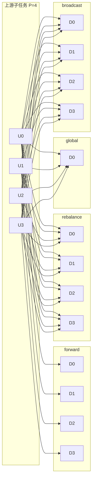
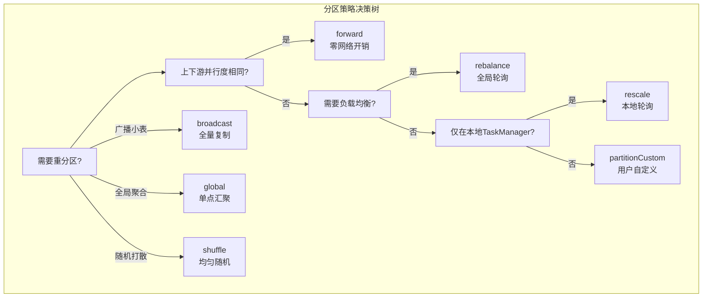

# 单输入转换算子与分区重分布算子详解

> 所属阶段: Knowledge/01-concept-atlas/operator-deep-dive | 前置依赖: [01.02-stream-abstraction.md](../01.01-stream-processing-fundamentals.md) | 形式化等级: L4

## 1. 概念定义 (Definitions)

本节对 Flink DataStream API 中的单输入转换算子（Unary Transformation Operators）与分区重分布算子（Partitioning Operators）进行严格的形式化定义，并建立其与函数式编程中 Functor/Monad 概念的对应关系。

### 1.1 流与算子的基本类型框架

**Def-O-03-01 (数据流类型)**
设类型参数 $\alpha$ 表示流中元素的类型，则 DataStream 可形式化表示为一个**有序事件序列**：
$$\text{DataStream}\langle\alpha\rangle \triangleq \mathbb{N} \to \alpha_\bot$$
其中 $\alpha_\bot \triangleq \alpha \cup \{\bot\}$ 表示可能包含空值（水印或延迟标记）的 lifted 类型。在离散事件语义下，流等价于一个带时间戳的事件多重集（timed event multiset）。

**Def-O-03-02 (单输入转换算子)**
单输入转换算子是一类高阶函数（Higher-Order Function），其类型签名为：
$$\text{UnaryOp} : (\alpha \to \beta_*) \to \text{DataStream}\langle\alpha\rangle \to \text{DataStream}\langle\beta\rangle$$
其中 $\beta_*$ 表示输出类型族（单个元素 $\beta$、零个元素 $\mathbf{0}$ 或多个元素 $[\beta]$）。

**Def-O-03-03 (分区重分布算子)**
分区重分布算子（Partitioner）不改变元素本身的类型与值，仅改变元素在并行子任务间的**物理分布**：
$$\text{Partitioner} : \text{DataStream}\langle\alpha\rangle \to \text{DataStream}\langle\alpha\rangle, \quad \text{s.t.} \quad \forall e \in S_{\text{out}} : e \in S_{\text{in}}$$
即输出流是输入流的一个**重排列**（rearrangement），保持元素的多重集不变。

### 1.2 各算子形式化定义

#### map —— 结构保持映射

**Def-O-03-04 (map 算子)**
$$\text{map} : (\alpha \to \beta) \to \text{DataStream}\langle\alpha\rangle \to \text{DataStream}\langle\beta\rangle$$
$$\text{map}(f)(\langle e_1, e_2, \dots \rangle) \triangleq \langle f(e_1), f(e_2), \dots \rangle$$
`map` 对输入流中的每个元素独立施加函数 $f$，输出流与输入流保持**一一对应**（1-to-1）的关系。

> **与函数式编程的对应**：`map` 正是 Functor 的核心操作 `fmap`。在 Haskell 中，`fmap :: Functor f => (a -> b) -> f a -> f b` [^5]。DataStream 在 `map` 操作下构成一个 Functor：它提供了一个将普通函数 "提升"（lift）到流上下文中的机制。

#### filter —— 谓词筛选

**Def-O-03-05 (filter 算子)**
$$\text{filter} : (\alpha \to \mathbb{B}) \to \text{DataStream}\langle\alpha\rangle \to \text{DataStream}\langle\alpha\rangle$$
$$\text{filter}(p)(\langle e_1, e_2, \dots \rangle) \triangleq \langle e_i \mid p(e_i) = \top \rangle$$
`filter` 保留满足谓词 $p$ 的元素，不满足者被丢弃。输出流长度 $\leq$ 输入流长度。

> **与函数式编程的对应**：`filter` 对应于高阶函数 `filter :: (a -> Bool) -> [a] -> [a]`，是函数式编程三大核心算子（map/filter/fold）之一 [^5][^7]。

#### flatMap —— 展开映射

**Def-O-03-06 (flatMap 算子)**
$$\text{flatMap} : (\alpha \to [\beta]) \to \text{DataStream}\langle\alpha\rangle \to \text{DataStream}\langle\beta\rangle$$
$$\text{flatMap}(f)(\langle e_1, e_2, \dots \rangle) \triangleq \text{concat}(\langle f(e_1), f(e_2), \dots \rangle)$$
其中 $\text{concat}$ 将列表的列表展平为一个列表。`flatMap` 允许**一对多**（1-to-N）的变换，每个输入元素可产生零个、一个或多个输出元素。

> **与函数式编程的对应**：`flatMap` 是 Monad 的核心操作 `bind`（记作 `>>=`）在流上的具体化 [^5][^6]。在 Haskell 中，`Monad m => m a -> (a -> m b) -> m b`。对于列表 Monad，`flatMap` 等价于 `concatMap`：先 `map` 再 `concat`。这一操作使得 DataStream 在 `flatMap` 下具备 Monad 结构，支持嵌套流的展平与链式组合。

#### mapPartition —— 分区批量映射

**Def-O-03-07 (mapPartition 算子)**
$$\text{mapPartition} : (\text{Iterator}\langle\alpha\rangle \to [\beta]) \to \text{DataStream}\langle\alpha\rangle \to \text{DataStream}\langle\beta\rangle$$
`mapPartition` 以**分区**（partition）为单位而非以**元素**为单位执行转换。每个并行子任务一次性获取该分区上的全部（或一批）元素作为迭代器，由用户函数批量处理。这减少了函数调用的开销，特别适合需要批量初始化的场景（如数据库连接池、模型加载）。

### 1.3 分区重分布算子定义

**Def-O-03-08 (分区函数)**
设并行度为 $P$，分区函数 $\pi : \alpha \times \mathbb{N} \to [0, P-1]$ 将元素映射到目标子任务索引。各分区策略的 $\pi$ 定义如下：

| 算子 | 分区函数 $\pi(e, P)$ | 状态依赖 | 确定性 |
|------|----------------------|----------|--------|
| `forward` | $\text{local}$（同子任务本地转发） | 无状态 | ✓ |
| `shuffle` | $\text{random}([0, P-1])$ | 无状态 | ✗ |
| `rebalance` | $(i + 1) \bmod P$（轮询） | 无状态 | ✓ |
| `rescale` | $(i + 1) \bmod P_{\text{local}}$（本地轮询） | 无状态 | ✓ |
| `global` | $0$（全部发往第0个子任务） | 无状态 | ✓ |
| `broadcast` | $[0, P-1]$（发往全部子任务） | 无状态 | ✓ |
| `partitionCustom` | 用户自定义 | 无状态/有状态 | 取决于实现 |

其中 `shuffle` 使用均匀随机分布，`rebalance` 使用全局轮询（round-robin），`rescale` 仅在上下游具有相同并行度时局部轮询。

## 2. 属性推导 (Properties)

### 2.1 单输入转换算子的代数性质

**Lemma-O-03-01 (map 的 Functor 定律)**
DataStream 上的 `map` 满足 Functor 的两条定律 [^5]：

1. **恒等律**：$\text{map}(\text{id}) = \text{id}$
2. **复合律**：$\text{map}(f \circ g) = \text{map}(f) \circ \text{map}(g)$

*证明*：由 Def-O-03-04，map 逐元素施加函数。对任意流 $S = \langle e_1, e_2, \dots \rangle$：
$$\text{map}(\text{id})(S) = \langle \text{id}(e_1), \text{id}(e_2), \dots \rangle = \langle e_1, e_2, \dots \rangle = \text{id}(S)$$
$$\text{map}(f \circ g)(S) = \langle f(g(e_1)), f(g(e_2)), \dots \rangle = \text{map}(f)(\text{map}(g)(S))$$
∎

**Lemma-O-03-02 (flatMap 的 Monad 定律)**
DataStream 上的 `flatMap` 满足 Monad 的三条核心定律 [^6]：

1. **左单位元**：$\text{flatMap}(f)(\text{singleton}(x)) = f(x)$
2. **右单位元**：$\text{flatMap}(\text{singleton})(M) = M$
3. **结合律**：$\text{flatMap}(g)(\text{flatMap}(f)(M)) = \text{flatMap}(\lambda x . \text{flatMap}(g)(f(x)))(M)$

其中 $\text{singleton}(x)$ 将单个元素提升为单元素流。

**Lemma-O-03-03 (filter 的幂等性)**
$$\text{filter}(p) \circ \text{filter}(p) = \text{filter}(p)$$
对同一谓词连续过滤两次等价于过滤一次。

**Lemma-O-03-04 (filter 与 map 的交换条件)**
当谓词 $p$ 仅依赖于未被 $f$ 修改的字段时（即 $p = p' \circ g$ 且 $g \circ f = g$），有：
$$\text{filter}(p) \circ \text{map}(f) = \text{map}(f) \circ \text{filter}(p)$$
否则二者**不可交换**，顺序会影响结果。

### 2.2 并行性与状态属性

**Prop-O-03-01 (单输入转换算子的并行保持性)**
`map`、`filter`、`flatMap`、`mapPartition` 均保持输入流的并行度，且**无需跨子任务协调**。设输入流并行度为 $P$，则输出流并行度亦为 $P$，且第 $i$ 个子任务的输出仅依赖于第 $i$ 个子任务的输入：
$$S_{\text{out}}^{(i)} = \text{op}(S_{\text{in}}^{(i)}), \quad \forall i \in [0, P-1]$$

**Prop-O-03-02 (分区重分布算子的无状态性)**
所有分区重分布算子（`shuffle`、`rebalance`、`rescale`、`forward`、`global`、`broadcast`、`partitionCustom`）均为**纯物理重分布算子**，不维护任何算子状态（Operator State 或 Keyed State），也不改变数据元素的值或类型。

## 3. 关系建立 (Relations)

### 3.1 与函数式编程核心概念的映射

Flink DataStream API 的设计深受函数式编程范式影响。以下表格建立了 Flink 算子与函数式编程核心概念之间的系统映射 [^5][^6][^7]：

| Flink 算子 | 函数式概念 | 类型类 (Type Class) | 核心操作 | 数学结构 |
|-----------|-----------|-------------------|---------|---------|
| `map` | 结构保持映射 | `Functor` | `fmap` / `<$>` | 范畴论中的自函子 (Endofunctor) |
| `filter` | 谓词筛选 | `Filterable` / `Witherable` | `filter` | 子结构选择 |
| `flatMap` | 嵌套展开 | `Monad` | `bind` / `>>=` / `join` | 单子 (Monad) |
| `mapPartition` | 批量折叠 | `Foldable` | `foldMap` | 幺半群作用 (Monoid Action) |
| `rebalance` | 负载均衡 | — | `distribute` | 均匀分布 |

> **深入理解 Functor-Monad 层级**：在范畴论中，每个 Monad 都是 Functor，但并非每个 Functor 都是 Monad [^6]。`map` 仅能应用纯函数 $a \to b$；而 `flatMap` 能应用产生新上下文（新流）的函数 $a \to m\,b$。这正是 Monad 比 Functor "更强" 的地方——它支持**上下文的组合与嵌套展平**。

### 3.2 与 SQL 语义的映射

| Flink 算子 | SQL 等价形式 | 说明 |
|-----------|-------------|------|
| `map(f)` | `SELECT f(col) FROM stream` | 投影变换 |
| `filter(p)` | `SELECT * FROM stream WHERE p` | 行筛选 |
| `flatMap(f)` | `SELECT * FROM stream, LATERAL(f(col))` | 横向展开 |
| `rebalance` | 无直接等价 | 物理优化 hint |

## 4. 论证过程 (Argumentation)

### 4.1 为什么 flatMap 是 Monad 而非仅仅是 Functor

考虑如下场景：输入流中的每个元素是一条 JSON 字符串，需要解析为对象列表后再展平输出。

使用仅支持 `map` 的 Functor：

```
Functor:  Stream<String> --map(parse)--> Stream<List<Object>>
结果: Stream<[[obj1, obj2], [obj3], [], ...]>
问题: 得到的是"流的列表的流"，需要额外 concat 操作
```

使用支持 `flatMap` 的 Monad：

```
Monad:    Stream<String> --flatMap(parseAndWrap)--> Stream<Object>
结果: Stream<[obj1, obj2, obj3, ...]>
优势: 自动完成 context flattening
```

`flatMap` 的本质是 `map` + `join`（展平），其中 `join : Stream<Stream<a>> -> Stream<a>` 是 Monad 的标志性操作 [^6]。没有 `join`，就无法消除嵌套的流上下文。

### 4.2 分区策略选择的决策论证

不同分区策略对应不同的通信成本与负载均衡特性：

- **`forward`**：零网络开销（同一 TaskManager 内直接内存引用传递），但要求上下游算子位于同一 TaskManager 的同一 slot 链中。
- **`shuffle`**：完全随机，适合消除数据倾斜，但破坏了事件的时间局部性（可能导致 watermark 传播异常）。
- **`rebalance`**：轮询分发，保证各下游子任务负载绝对均匀，但引入了全互联（all-to-all）的网络通信。
- **`rescale`**：仅在本地 TaskManager 内轮询，减少了跨网络流量，适合并行度调整场景。
- **`global`**：强制单点汇聚，并行度降为 1，通常仅用于全局聚合前的最终汇聚。
- **`broadcast`**：每个元素复制 $P$ 份，适合小维度表广播（Broadcast State Pattern）。

## 5. 形式证明 / 工程论证 (Proof / Engineering Argument)

### 5.1 mapPartition 的性能优势证明

**Thm-O-03-01 (mapPartition 的调用开销上界)**
设输入流有 $N$ 个元素，并行度为 $P$，则每个子任务处理 $N/P$ 个元素。

- `map` 的总函数调用次数：$N$（每个元素一次）
- `mapPartition` 的总函数调用次数：$P$（每个分区一次）

若每次函数调用的固定开销为 $c_0$，每个元素的处理开销为 $c_1$，则：
$$T_{\text{map}} = N \cdot (c_0 + c_1)$$
$$T_{\text{mapPartition}} = P \cdot c_0 + N \cdot c_1$$

当 $N \gg P$ 时，加速比趋近于：
$$\lim_{N \to \infty} \frac{T_{\text{map}}}{T_{\text{mapPartition}}} = \frac{c_0 + c_1}{c_1} = 1 + \frac{c_0}{c_1}$$

若 $c_0 \gg c_1$（如需要建立数据库连接），则 `mapPartition` 可获得数量级的性能提升。

### 5.2 分区重分布的确定性论证

**Thm-O-03-02 (分区策略的确定性分类)**
对于同一输入流在固定并行度下重复执行：

- **确定性策略**（`forward`, `rebalance`, `rescale`, `global`, `broadcast`）：输出元素的子任务分配完全可复现。
- **非确定性策略**（`shuffle`）：输出元素的子任务分配在多次执行间可能不同，除非显式设置随机种子。

此性质对**Exactly-Once 语义**的测试与调试至关重要：非确定性分区可能导致非确定性输出顺序，但不影响最终一致性（若下游算子满足交换律与结合律）。

## 6. 实例验证 (Examples)

### 6.1 map / filter / flatMap 代码示例

```java
StreamExecutionEnvironment env =
    StreamExecutionEnvironment.getExecutionEnvironment();
env.setParallelism(2);

DataStream<String> source = env.fromElements(
    "apple,banana",
    "cherry",
    "date,elderberry,fig"
);

// === map: 字符串转长度 ===
DataStream<Integer> lengths = source.map(new MapFunction<String, Integer>() {
    @Override
    public Integer map(String value) {
        return value.length();
    }
});

// === filter: 保留包含逗号的记录 ===
DataStream<String> multiFruit = source.filter(new FilterFunction<String>() {
    @Override
    public boolean filter(String value) {
        return value.contains(",");
    }
});

// === flatMap: 逗号分隔展平为单词流 ===
DataStream<String> words = source.flatMap(new FlatMapFunction<String, String>() {
    @Override
    public void flatMap(String value, Collector<String> out) {
        for (String word : value.split(",")) {
            out.collect(word.trim());
        }
    }
});

// === mapPartition: 批量处理 ===
DataStream<Integer> batchCounts = source.mapPartition(
    new MapPartitionFunction<String, Integer>() {
        @Override
        public void mapPartition(Iterable<String> values, Collector<Integer> out) {
            int count = 0;
            for (String v : values) count++;
            out.collect(count);
        }
    }
);

words.print();
env.execute("Single-Input Operators Demo");
```

### 6.2 分区重分布代码示例

```java
DataStream<Integer> numbers = env.fromElements(1, 2, 3, 4, 5, 6, 7, 8);

// 轮询重平衡，消除数据倾斜
DataStream<Integer> rebalanced = numbers.rebalance();

// 随机分区，适合均匀输入的负载均衡
DataStream<Integer> shuffled = numbers.shuffle();

// 本地转发（默认行为，上下游在同一slot链中）
DataStream<Integer> forwarded = numbers.forward();

// 全局汇聚到单个子任务
DataStream<Integer> global = numbers.global();

// 广播到所有子任务
DataStream<Integer> broadcasted = numbers.broadcast();

// 自定义分区：按奇偶分区
DataStream<Integer> custom = numbers.partitionCustom(
    new Partitioner<Integer>() {
        @Override
        public int partition(Integer key, int numPartitions) {
            return key % numPartitions;
        }
    },
    new KeySelector<Integer, Integer>() {
        @Override
        public Integer getKey(Integer value) { return value; }
    }
);
```

### 6.3 常见反模式与陷阱

**反模式 1：在 map 中执行有副作用的操作**

```java
// ❌ 错误：map 中修改外部状态
DataStream<Result> bad = stream.map(x -> {
    externalCounter++;  // 副作用！在分布式环境下不可复现
    return new Result(x, externalCounter);
});

// ✅ 正确：使用有状态算子（RichMapFunction + ValueState）
DataStream<Result> good = stream.map(new RichMapFunction<>() {
    private ValueState<Long> counterState;
    // ... open() 中初始化状态 ...
});
```

**反模式 2：flatMap 中产生过多输出导致反压**

```java
// ❌ 危险：单个元素可能产生数万输出，下游无法消费
stream.flatMap((value, out) -> {
    for (int i = 0; i < 100000; i++) {
        out.collect(expand(value, i));
    }
});

// ✅ 缓解：使用异步检查点 + 背压机制，或考虑窗口聚合
```

**反模式 3：shuffle 后接 keyed 操作导致不必要的全互联**

```java
// ❌ 低效：shuffle 破坏了 key 的局部性
stream.shuffle().keyBy(Event::getUserId).window(...)

// ✅ 正确：直接 keyBy，Flink 会自动哈希分区
stream.keyBy(Event::getUserId).window(...)
```

## 7. 可视化 (Visualizations)

### 图 1：单输入转换算子的数据流变换过程

以下 Mermaid 图展示了从源数据流经过 `map`、`filter`、`flatMap` 的逐层变换过程，以及各算子与 Functor/Monad 概念的对应关系。

```mermaid
graph TD
    subgraph "输入流 DataStream&lt;String&gt;"
        A1["'apple,banana'"]
        A2["'cherry'"]
        A3["'date,fig'"]
    end

    subgraph "map: f(s)=s.length → Functor fmap"
        B1["11"]
        B2["6"]
        B3["8"]
    end

    subgraph "filter: p(s)=s.contains(',')"
        C1["'apple,banana'"]
        C2["⊘ 丢弃"]
        C3["'date,fig'"]
    end

    subgraph "flatMap: split(s) → Monad bind/>>="
        D1["'apple'"]
        D2["'banana'"]
        D3["'date'"]
        D4["'fig'"]
    end

    A1 -->|map| B1
    A2 -->|map| B2
    A3 -->|map| B3

    A1 -->|filter| C1
    A2 -->|filter| C2
    A3 -->|filter| C3

    A1 -->|flatMap| D1
    A1 -->|flatMap| D2
    A3 -->|flatMap| D3
    A3 -->|flatMap| D4
    A2 -->|flatMap| "⊘ 零输出"

    style C2 fill:#ffcccc
    style D1 fill:#ccffcc
    style D2 fill:#ccffcc
    style D3 fill:#ccffcc
    style D4 fill:#ccffcc
```

### 图 2：分区重分布策略对比矩阵与执行拓扑

以下 Mermaid 图对比了七种分区策略在并行度 $P=4$ 时的数据分发模式。



**分区策略综合对比矩阵**：



## 8. 引用参考 (References)


[^5]: Wikipedia, "Functor", <https://en.wikipedia.org/wiki/Functor>

[^6]: Wikipedia, "Monad (functional programming)", <https://en.wikipedia.org/wiki/Monad_(functional_programming)>

[^7]: B. Milewski, "Monoidal Catamorphisms", 2020. <https://bartoszmilewski.com/2020/06/15/monoidal-catamorphisms/>
