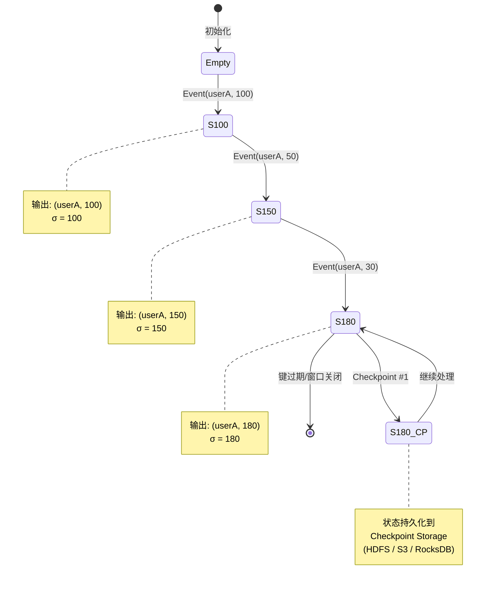
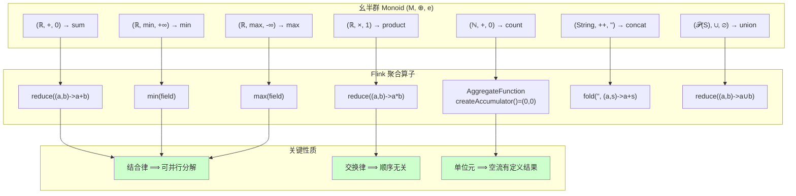

# 分组与聚合算子详解

> 所属阶段: Knowledge/01-concept-atlas/operator-deep-dive | 前置依赖: [01.06-single-input-operators.md](./01.06-single-input-operators.md), [02.06-stream-operator-algebra.md](../../../Struct/02-properties/02.06-stream-operator-algebra.md) | 形式化等级: L4

## 1. 概念定义 (Definitions)

本节对 Flink DataStream API 中的分组算子（`keyBy`）与聚合算子（`reduce`、`aggregate`、`fold`、`min`/`max`/`sum` 族）进行严格的形式化定义，并建立其与幺半群（Monoid）、范畴论中 Catamorphism 以及 SQL 聚合语义的深层对应。

### 1.1 分组流的类型定义

**Def-O-04-01 (KeyedStream 类型)**
设键类型为 $\mathcal{K}$，值类型为 $\mathcal{V}$，则 KeyedStream 是 DataStream 上的一个**按键索引的分区结构**：
$$\text{KeyedStream}\langle\mathcal{K}, \mathcal{V}\rangle \triangleq \mathcal{K} \to \text{DataStream}\langle\mathcal{V}\rangle$$
即 KeyedStream 将全局流按键 $k \in \mathcal{K}$ 划分为若干**逻辑子流**（logical sub-streams），每个键对应一个独立的、按时间顺序排列的事件序列。在物理执行层面，具有相同键的所有元素被路由到同一个并行子任务。

**Def-O-04-02 (keyBy 算子)**
$$\text{keyBy} : (\mathcal{V} \to \mathcal{K}) \to \text{DataStream}\langle\mathcal{V}\rangle \to \text{KeyedStream}\langle\mathcal{K}, \mathcal{V}\rangle$$
$$\text{keyBy}(\text{keySelector})(S) \triangleq \lambda k . \{ e \in S \mid \text{keySelector}(e) = k \}$$
`keyBy` 内部基于键的哈希值进行分区，等效于 $\text{hash}(k) \bmod P$。它**不产生新的数据内容**，仅改变数据的物理分布与逻辑分组。

### 1.2 聚合算子的形式化定义

#### reduce —— 滚动归约

**Def-O-04-03 (reduce 算子)**
$$\text{reduce} : (\mathcal{V} \times \mathcal{V} \to \mathcal{V}) \to \text{KeyedStream}\langle\mathcal{K}, \mathcal{V}\rangle \to \text{DataStream}\langle\mathcal{V}\rangle$$
设归约函数为 $\oplus : \mathcal{V} \times \mathcal{V} \to \mathcal{V}$，输入键 $k$ 对应的子流为 $\langle v_1, v_2, v_3, \dots \rangle$，则 `reduce` 的输出为：
$$\text{reduce}(\oplus)(\langle v_1, v_2, v_3, \dots \rangle) = \langle v_1, \; v_1 \oplus v_2, \; (v_1 \oplus v_2) \oplus v_3, \; \dots \rangle$$
每次收到新元素，即与当前累积值进行二元运算，输出**中间结果**。

> **与函数式编程的对应**：`reduce` 对应于函数式编程中的 `foldl`（左折叠）的增量版本 [^7]。在 Haskell 中，`foldl :: (b -> a -> b) -> b -> [a] -> b`。Flink 的 `reduce` 不需要显式初始值，其"单位元"即为流中的第一个元素。

#### aggregate —— 泛化聚合

**Def-O-04-04 (aggregate 算子)**
$$\text{aggregate} : \text{AggregateFunction}\langle\mathcal{V}, \mathcal{A}, \mathcal{R}\rangle \to \text{KeyedStream}\langle\mathcal{K}, \mathcal{V}\rangle \to \text{DataStream}\langle\mathcal{R}\rangle$$
其中 $\mathcal{A}$ 为**累加器类型**（accumulator），$\mathcal{R}$ 为**结果类型**（result），且满足：

- `createAccumulator() : () -> A` — 创建初始累加器
- `add(V, A) : V x A -> A` — 将元素加入累加器
- `getResult(A) : A -> R` — 从累加器提取结果
- `merge(A, A) : A x A -> A` — 合并两个累加器（用于会话窗口或 checkpoint）

`aggregate` 是 `reduce` 的**广义形式**，解除了输入类型 = 累加器类型 = 输出类型的约束。

#### fold —— 带初始值的折叠

**Def-O-04-05 (fold 算子)**
$$\text{fold} : \mathcal{A} \to (\mathcal{A} \times \mathcal{V} \to \mathcal{A}) \to \text{KeyedStream}\langle\mathcal{K}, \mathcal{V}\rangle \to \text{DataStream}\langle\mathcal{A}\rangle$$
$$\text{fold}(a_0, f)(\langle v_1, v_2, \dots \rangle) = \langle f(a_0, v_1), \; f(f(a_0, v_1), v_2), \; \dots \rangle$$
`fold` 与 `reduce` 的关键区别在于它接受一个**显式初始值** $a_0$。若 $a_0$ 是二元运算 $f$ 的单位元，则 `fold` 退化为 `reduce` 的语义。

> **注意**：Flink 1.4 起 `fold` 算子已被标记为 `@Deprecated`，建议使用 `aggregate` 替代 [^2]。

#### min / max / sum —— 字段级预定义聚合

**Def-O-04-06 (字段级聚合算子)**
设 $v \in \mathcal{V}$ 是一个复合类型（POJO 或 Tuple），$\pi_f : \mathcal{V} \to \mathbb{F}$ 为字段 $f$ 的投影函数：

- `sum(f)`：按字段 $f$ 滚动求和，输出类型保持 $\mathcal{V}$，非聚合字段保留**第一条记录**的值。
- `min(f)`：按字段 $f$ 取最小值，输出类型保持 $\mathcal{V}$，非聚合字段保留**第一条记录**的值。
- `minBy(f)`：按字段 $f$ 取最小值，输出类型保持 $\mathcal{V}$，非聚合字段保留**当前最小值所在完整记录**的值。
- `max(f)` / `maxBy(f)`：语义同 `min` / `minBy`，方向相反。

形式化地，设 $\oplus_{\text{sum}}$ 为加法，$\oplus_{\text{min}}$ 为取最小值：
$$\text{sum}(f)(\langle v_1, v_2, \dots \rangle)_i = v_{\text{first}} \text{ with } \pi_f \leftarrow \bigoplus_{j=1}^{i} \pi_f(v_j)$$
$$\text{minBy}(f)(\langle v_1, v_2, \dots \rangle)_i = v_{k} \text{ where } k = \arg\min_{1 \leq j \leq i} \pi_f(v_j)$$

### 1.3 状态模型定义

**Def-O-04-07 (聚合状态类型)**
Flink 的聚合算子在内部依赖以下状态抽象 [^1]：

| 状态类型 | 存储内容 | 适用算子 | 状态大小 |
|---------|---------|---------|---------|
| `ValueState<T>` | 单个累积值 | `reduce`（简化实现） | $O(1)$ per key |
| `ReducingState<T>` | 带归约函数的累积值 | `reduce` | $O(1)$ per key |
| `AggregatingState<IN, OUT>` | 带聚合函数的累积值 | `aggregate` | $O(1)$ per key |
| `ListState<T>` | 元素列表 | `process` / 全量窗口 | $O(N)$ per key |

形式化地，对于键 $k$，聚合状态 $\sigma_k$ 的演化遵循**状态转移系统**：
$$\sigma_k^{(0)} = \text{initial} \qquad \sigma_k^{(t+1)} = \text{update}(\sigma_k^{(t)}, v^{(t+1)})$$
其中 $v^{(t+1)}$ 是键 $k$ 在时刻 $t+1$ 到达的新元素。

## 2. 属性推导 (Properties)

### 2.1 Monoid 结构与聚合算子的对应

**Def-O-04-08 (幺半群 / Monoid)**
幺半群是一个三元组 $(M, \oplus, e)$，其中 $M$ 是集合，$\oplus : M \times M \to M$ 是二元运算，$e \in M$ 是单位元，满足 [^7][^8]：

1. **结合律**：$(a \oplus b) \oplus c = a \oplus (b \oplus c)$
2. **单位元**：$e \oplus a = a \oplus e = a$

**Lemma-O-04-01 (聚合算子的 Monoid 对应表)**
Flink 的预定义聚合操作均可表示为特定幺半群上的累积：

| Flink 算子 | 幺半群 $(M, \oplus, e)$ | 结合律 | 交换律 |
|-----------|------------------------|-------|-------|
| `sum` | $(\mathbb{R}, +, 0)$ | ✓ | ✓ |
| `product` | $(\mathbb{R}, \times, 1)$ | ✓ | ✓ |
| `min` | $(\mathbb{R}, \min, +\infty)$ | ✓ | ✓ |
| `max` | $(\mathbb{R}, \max, -\infty)$ | ✓ | ✓ |
| `count` | $(\mathbb{N}, +, 0)$ | ✓ | ✓ |
| `concat` | $(\text{String}, ++, "")$ | ✓ | ✗ |
| `union` | $(\mathcal{P}(S), \cup, \emptyset)$ | ✓ | ✓ |

> **关键洞察**：只有当二元运算 $\oplus$ 满足**结合律**时，Flink 的并行归约才是语义正确的。结合律保证了无论元素以何种顺序、在哪些子任务上被局部聚合，最终合并结果一致。若运算不满足结合律（如浮点减法、字符串拼接在有界窗口外的全局场景），则必须强制单线程执行或使用全量排序。

**Lemma-O-04-02 (reduce 的并行分解性)**
若归约函数 $\oplus$ 构成幺半群，则全局归约可分解为局部归约再合并：
$$\bigoplus_{i=1}^{N} v_i = \left(\bigoplus_{i \in P_1} v_i\right) \oplus \left(\bigoplus_{i \in P_2} v_i\right) \oplus \dots \oplus \left(\bigoplus_{i \in P_k} v_i\right)$$
其中 $\{P_1, P_2, \dots, P_k\}$ 是 $\{1, \dots, N\}$ 的任意划分。这是 Flink 能够在多个并行子任务上独立执行局部聚合、再合并结果的数学基础。

### 2.2 KeyedStream 的类型变换与状态依赖

**Prop-O-04-01 (KeyedStream 到 DataStream 的类型降维)**
聚合算子执行了一个"类型降维"操作：
$$\text{KeyedStream}\langle\mathcal{K}, \mathcal{V}\rangle \xrightarrow{\text{reduce/aggregate/fold}} \text{DataStream}\langle\mathcal{R}\rangle$$
分组信息 $\mathcal{K}$ 在输出类型中被"消除"，但仍在物理执行中决定状态的分区键。

**Prop-O-04-02 (聚合算子的状态依赖性)**
所有聚合算子（`reduce`、`aggregate`、`fold`、`min`/`max`/`sum`）均为**有状态算子**（Stateful Operators）。每个键 $k$ 维护独立的累加器状态：
$$\text{State}(k) = \begin{cases} \sigma_k^{(t)} & \text{若键 } k \text{ 曾在窗口 } t \text{ 前出现} \\ \text{undefined} & \text{否则} \end{cases}$$
状态通过 Flink 的 Checkpoint 机制实现容错，周期性地持久化到分布式存储（如 HDFS、RocksDB）。

**Prop-O-04-03 (min vs minBy 的语义差异)**
设输入序列为 $\langle (a_1, x_1), (a_2, x_2), \dots \rangle$，聚合字段为 $a$，伴随字段为 $x$：

- `min(a)` 输出：$\langle (a_1, x_1), (\min(a_1,a_2), x_1), (\min(a_1,a_2,a_3), x_1), \dots \rangle$
- `minBy(a)` 输出：$\langle (a_1, x_1), (a_{\arg\min}, x_{\arg\min}), (a_{\arg\min'}, x_{\arg\min'}), \dots \rangle$

即 `min` 是"投影后替换"，`minBy` 是"整条记录替换"。

## 3. 关系建立 (Relations)

### 3.1 与 SQL GROUP BY 的语义映射

Flink 的 `keyBy` + 聚合算子与 SQL 的 `GROUP BY` 存在深层的语义对应，但在流式场景下有重要区别 [^3][^9]：

| SQL 语义 | Flink 等价形式 | 关键区别 |
|---------|---------------|---------|
| `GROUP BY key` | `keyBy(KeySelector)` | SQL 在查询结束时输出单条结果；Flink 流式聚合**每输入一条即输出一条滚动结果** |
| `SUM(val)` | `.sum("val")` | Flink 默认无窗口时输出无限流；SQL 在有限表上输出单值 |
| `MIN(val)` | `.min("val")` | 同上，且 `min` 保留首次记录的非聚合字段 |
| `MIN(val) KEEP (DENSE_RANK FIRST)` | `.minBy("val")` | SQL 需显式指定 KEEP；Flink `minBy` 直接返回整条记录 |
| `AGG(...) OVER (PARTITION BY key)` | `keyBy(...).window(...).aggregate(...)` | Flink 窗口聚合更接近 SQL 的分析函数语义 |
| `COUNT(*)` | 需自定义 `AggregateFunction` | Flink 无内置 `count()` 直接算子，需通过 `aggregate` 实现 |

**核心区别**：SQL 的 `GROUP BY` 在有限数据集上产生**每组一条**结果；而 Flink 无窗口的滚动聚合（Rolling Aggregation）产生**每输入一条即输出一条**的增量结果流。若需要 SQL 式的"仅输出最终结果"，必须使用窗口（Window）或 `ProcessFunction` 显式控制输出时机。

### 3.2 与 Catamorphism 的对应

**Catamorphism**（折叠/垮塌态射）是函数式编程中对递归数据结构进行"折叠归约"的泛化概念 [^7][^8]。列表上的 `foldl` 是 Catamorphism 的特例：
$$\text{cata} : \text{Algebra}\,F\,A \to \mu F \to A$$

Flink 的聚合算子可视为流（无限列表）上的**增量 Catamorphism**：

- `reduce` $\approx$ `foldl` 的流式版本，代数结构为 $(\mathcal{V}, \oplus)$
- `aggregate` $\approx$ 广义 Catamorphism，支持不同的输入/累加器/输出类型
- `fold` $\approx$ `foldl` 带显式种子值

Monoidal Catamorphism 的关键性质是：若代数仅使用幺半群运算，则折叠可并行化 [^7]——这正是 Flink 能够在多个并行子任务上独立执行聚合的数学根基。

### 3.3 增量计算语义的形式化

**Def-O-04-09 (增量聚合)**
设聚合函数为 $\text{agg} : [\mathcal{V}] \to \mathcal{R}$。称聚合是**增量可计算的**（incrementally computable），若存在状态转移函数 $\delta$ 使得：
$$\text{agg}(v_1, \dots, v_n, v_{n+1}) = \delta(\text{agg}(v_1, \dots, v_n), v_{n+1})$$

**Lemma-O-04-03 (Flink 内置聚合的增量可计算性)**
`sum`、`min`、`max`、`count` 均满足增量可计算性：

- $\delta_{\text{sum}}(s, v) = s + v$
- $\delta_{\text{min}}(m, v) = \min(m, v)$
- $\delta_{\text{max}}(M, v) = \max(M, v)$
- $\delta_{\text{count}}(c, v) = c + 1$

而 `median`、`percentile`、`mode` 等统计量**不满足**增量可计算性，需要使用 `ProcessWindowFunction` 全量存储窗口元素后计算。

## 4. 论证过程 (Argumentation)

### 4.1 为什么结合律对分布式聚合至关重要

考虑一个非结合运算：字符串拼接在要求全局顺序时。假设流元素为 `["a", "b", "c"]`，并行度为 2：

- 子任务 0 接收 `["a", "b"]`，局部拼接为 `"ab"`
- 子任务 1 接收 `["c"]`，局部拼接为 `"c"`
- 合并：`"ab" + "c" = "abc"` ✓

但若并行调度导致：

- 子任务 0 接收 `["b", "c"]`，局部拼接为 `"bc"`
- 子任务 1 接收 `["a"]`，局部拼接为 `"a"`
- 合并：`"bc" + "a" = "bca"` ✗ (期望 `"abc"`)

因此，不满足结合律的运算在分布式环境下**除非保证单线程执行或全序分发**，否则无法正确并行归约。

### 4.2 aggregate 相对于 reduce 的通用性优势

`reduce` 要求输入类型 = 累加器类型 = 输出类型，这限制了其表达能力。考虑计算平均值：

- 使用 `reduce`：不可行，因为平均值需要维护 $(\text{sum}, \text{count})$ 二元组，但 `reduce` 要求输入和输出都是同一个类型。
- 使用 `aggregate`：定义 `Accumulator = (Double sum, Long count)`，输入 `Double`，输出 `Double`：

  ```
  createAccumulator() -> (0.0, 0L)
  add(value, acc) -> (acc.sum + value, acc.count + 1)
  getResult(acc) -> acc.sum / acc.count
  merge(acc1, acc2) -> (acc1.sum + acc2.sum, acc1.count + acc2.count)
  ```

这展示了 `aggregate` 的分离类型设计如何突破 `reduce` 的同质类型约束。

## 5. 形式证明 / 工程论证 (Proof / Engineering Argument)

### 5.1 聚合算子状态大小的上界证明

**Thm-O-04-01 (聚合状态的空间复杂度)**
设键空间为 $\mathcal{K}$，当前活跃键的数量为 $|K_{\text{active}}|$：

| 算子 | 单键状态大小 | 总状态大小 | 与输入规模关系 |
|------|------------|-----------|--------------|
| `reduce` | $O(|\mathcal{V}|)$ | $O(|K_{\text{active}}| \cdot |\mathcal{V}|)$ | 与输入流长度 $N$ 无关 |
| `aggregate` | $O(|\mathcal{A}|)$ | $O(|K_{\text{active}}| \cdot |\mathcal{A}|)$ | 与输入流长度 $N$ 无关 |
| `fold` | $O(|\mathcal{A}|)$ | $O(|K_{\text{active}}| \cdot |\mathcal{A}|)$ | 与输入流长度 $N$ 无关 |
| `ProcessWindowFunction` | $O(N_k \cdot |\mathcal{V}|)$ | $O(\sum_k N_k \cdot |\mathcal{V}|)$ | 与窗口内元素数成正比 |

*证明*：`reduce`/`aggregate`/`fold` 仅维护单个累加器值 per key，不保存历史元素。设 $\sigma_k$ 为键 $k$ 的状态，则 $|\sigma_k| = \text{const}$。总状态 $\Sigma = \bigcup_{k} \sigma_k$，故 $|\Sigma| = \sum_k |\sigma_k| = |K_{\text{active}}| \cdot O(1)$。∎

此性质是流式聚合能够**无限期运行**而不 OOM 的关键：状态空间仅取决于键的基数，而非事件总量。

### 5.2 增量聚合与全量聚合的等价性证明

**Thm-O-04-02 (增量聚合语义等价性)**
设 $\oplus$ 为结合律运算，$S = \langle v_1, v_2, \dots, v_N \rangle$ 为键 $k$ 的子流。令：

- 全量聚合：$A_{\text{full}}(S) = v_1 \oplus v_2 \oplus \dots \oplus v_N$
- 增量聚合输出序列：$A_{\text{inc}}(S) = \langle v_1, v_1 \oplus v_2, \dots, \bigoplus_{i=1}^{N} v_i \rangle$

则增量聚合的**最后一条输出**等于全量聚合：
$$\text{last}(A_{\text{inc}}(S)) = A_{\text{full}}(S)$$

且若 $\oplus$ 满足交换律，则增量聚合的输出与元素到达顺序无关（在窗口边界确定的前提下）。

## 6. 实例验证 (Examples)

### 6.1 keyBy + reduce 代码示例

```java
StreamExecutionEnvironment env =
    StreamExecutionEnvironment.getExecutionEnvironment();

// 输入: 用户交易流 (userId, amount)
DataStream<Tuple2<String, Double>> transactions = env.fromElements(
    Tuple2.of("userA", 100.0),
    Tuple2.of("userB", 200.0),
    Tuple2.of("userA", 50.0),
    Tuple2.of("userA", 30.0),
    Tuple2.of("userB", 80.0)
);

// keyBy + reduce: 滚动累加每个用户的交易金额
DataStream<Tuple2<String, Double>> rollingSum = transactions
    .keyBy(t -> t.f0)
    .reduce(new ReduceFunction<Tuple2<String, Double>>() {
        @Override
        public Tuple2<String, Double> reduce(
                Tuple2<String, Double> acc,
                Tuple2<String, Double> curr) {
            return Tuple2.of(acc.f0, acc.f1 + curr.f1);
        }
    });

rollingSum.print();
// 输出（滚动结果）:
// userA: 100.0
// userB: 200.0
// userA: 150.0  (100+50)
// userA: 180.0  (150+30)
// userB: 280.0  (200+80)
```

### 6.2 aggregate 计算平均值

```java
// 使用 AggregateFunction 计算每个用户的平均交易金额
DataStream<Tuple2<String, Double>> avgAmount = transactions
    .keyBy(t -> t.f0)
    .aggregate(new AggregateFunction<
            Tuple2<String, Double>,
            Tuple2<Double, Long>,  // 累加器: (sum, count)
            Tuple2<String, Double> // 输出: (userId, avg)
        >() {
        @Override
        public Tuple2<Double, Long> createAccumulator() {
            return Tuple2.of(0.0, 0L);
        }

        @Override
        public Tuple2<Double, Long> add(
                Tuple2<String, Double> value,
                Tuple2<Double, Long> accumulator) {
            return Tuple2.of(
                accumulator.f0 + value.f1,
                accumulator.f1 + 1
            );
        }

        @Override
        public Tuple2<String, Double> getResult(
                Tuple2<Double, Long> accumulator) {
            return Tuple2.of(
                "result",
                accumulator.f0 / accumulator.f1
            );
        }

        @Override
        public Tuple2<Double, Long> merge(
                Tuple2<Double, Long> a,
                Tuple2<Double, Long> b) {
            return Tuple2.of(a.f0 + b.f0, a.f1 + b.f1);
        }
    });
```

### 6.3 min / minBy / max / maxBy 对比

```java
// 输入: 传感器读数 (sensorId, temperature, timestamp)
DataStream<Tuple3<String, Double, Long>> sensors = env.fromElements(
    Tuple3.of("s1", 25.0, 1000L),
    Tuple3.of("s1", 28.0, 1001L),
    Tuple3.of("s1", 22.0, 1002L)
);

KeyedStream<Tuple3<String, Double, Long>, String> keyed =
    sensors.keyBy(t -> t.f0);

// min: 温度取最小，但 timestamp 保持第一条(1000L)
keyed.min(1).print();
// 输出: (s1,25.0,1000L), (s1,25.0,1000L), (s1,22.0,1000L)

// minBy: 温度取最小，timestamp 随最小值记录更新
keyed.minBy(1).print();
// 输出: (s1,25.0,1000L), (s1,25.0,1000L), (s1,22.0,1002L)
```

### 6.4 常见反模式

**反模式 1：在 reduce 中创建新对象导致 GC 压力**

```java
// ❌ 低效：每条记录都创建 Tuple2 新对象
.reduce((a, b) -> Tuple2.of(a.f0, a.f1 + b.f1))

// ✅ 优化：复用已有对象（仅当 Flink 管理状态副本时安全）
.reduce((a, b) -> {
    a.f1 += b.f1;
    return a;
})
```

**反模式 2：键选择器返回不稳定值**

```java
// ❌ 错误：返回包含时间戳的可变对象，导致同一记录被路由到不同子任务
keyBy(event -> new CompositeKey(event.getUserId(), System.currentTimeMillis()));

// ✅ 正确：键必须基于记录的稳定字段
keyBy(Event::getUserId);
```

**反模式 3：忘记聚合算子需要 keyBy**

```java
// ❌ 编译错误：reduce/aggregate/sum 等必须在 KeyedStream 上调用
stream.sum("amount");

// ✅ 正确
stream.keyBy(Event::getUserId).sum("amount");
```

## 7. 可视化 (Visualizations)

### 图 1：分组聚合的数据流与状态演化

以下 Mermaid 图展示了 `keyBy` + `reduce` 的完整执行流程：输入流按 `userId` 分组后，每个键维护独立的累加器状态，新事件到达时触发状态更新并输出滚动结果。

```mermaid
graph TD
    subgraph "输入流 DataStream&lt;Event&gt;"
        E1["(userA, 100)"]
        E2["(userB, 200)"]
        E3["(userA, 50)"]
        E4["(userA, 30)"]
        E5["(userB, 80)"]
    end

    subgraph "keyBy: hashPartition(userId)"
        K0["Task 0: userA"]
        K1["Task 1: userB"]
    end

    subgraph "状态存储 ValueState&lt;Double&gt; per key"
        S0["σ(userA): 0 → 100 → 150 → 180"]
        S1["σ(userB): 0 → 200 → 280"]
    end

    subgraph "输出流 DataStream&lt;Result&gt;"
        O1["(userA, 100)"]
        O2["(userB, 200)"]
        O3["(userA, 150)"]
        O4["(userA, 180)"]
        O5["(userB, 280)"]
    end

    E1 -->|hash(userA)%2=0| K0
    E3 -->|hash(userA)%2=0| K0
    E4 -->|hash(userA)%2=0| K0
    E2 -->|hash(userB)%2=1| K1
    E5 -->|hash(userB)%2=1| K1

    K0 -->|更新状态| S0
    K1 -->|更新状态| S1

    S0 -->|输出滚动结果| O1
    S0 -->|输出滚动结果| O3
    S0 -->|输出滚动结果| O4
    S1 -->|输出滚动结果| O2
    S1 -->|输出滚动结果| O5

    style S0 fill:#e6f3ff,stroke:#0066cc,stroke-width:2px
    style S1 fill:#e6f3ff,stroke:#0066cc,stroke-width:2px
```

### 图 2：聚合算子状态演化时序图

以下状态图展示了键 `userA` 的累加器状态随事件到达的演化过程，以及 Checkpoint 持久化点。



### 图 3：Monoid 结构与聚合算子对应图



## 8. 引用参考 (References)

[^1]: Apache Flink Documentation, "State Backends", 2025. <https://nightlies.apache.org/flink/flink-docs-stable/docs/ops/state/state_backends/>

[^2]: Apache Flink 1.7 Documentation, "Operators", 2018. <https://nightlies.apache.org/flink/flink-docs-release-1.7/dev/stream/operators/>

[^3]: T. Akidau et al., "The Dataflow Model: A Practical Approach to Balancing Correctness, Latency, and Cost in Massive-Scale, Unbounded, Out-of-Order Data Processing", PVLDB, 8(12), 2015.


[^7]: B. Milewski, "Monoidal Catamorphisms", 2020. <https://bartoszmilewski.com/2020/06/15/monoidal-catamorphisms/>

[^8]: Rosetta Code, "Catamorphism", <https://rosettacode.org/wiki/Catamorphism>

[^9]: Apache Flink Documentation, "Windows", 2025. <https://nightlies.apache.org/flink/flink-docs-stable/docs/dev/datastream/operators/windows/>
