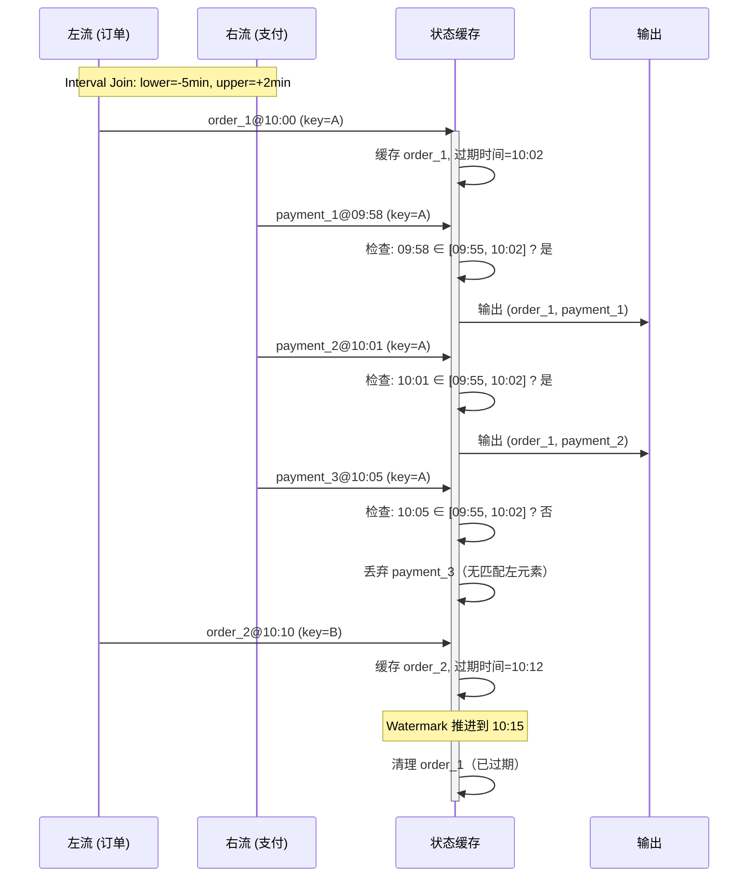
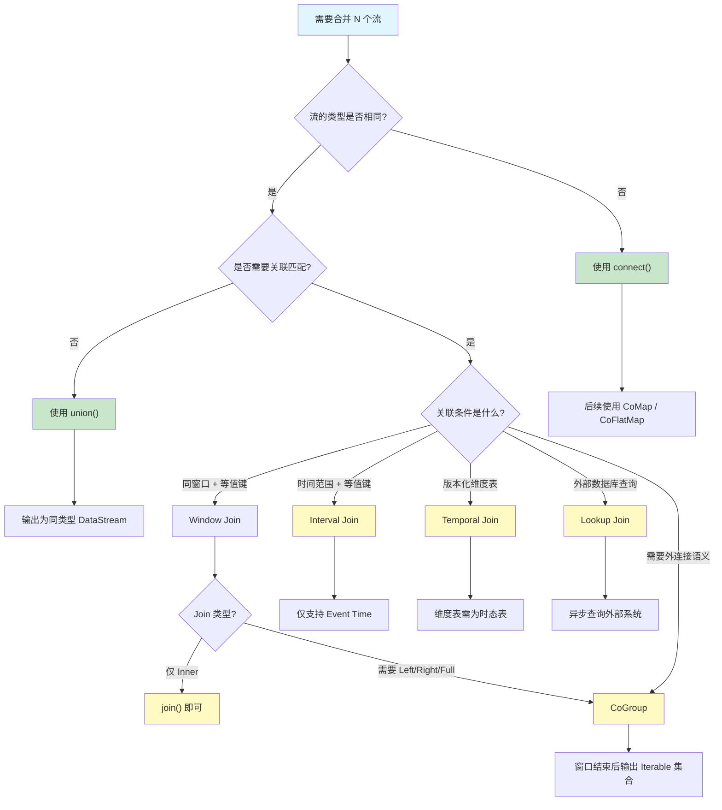

# 多流算子详解

> 所属阶段: Knowledge | 前置依赖: [01.04-state-management-concepts.md](../01.04-state-management-concepts.md), [01.12-time-semantics-glossary.md](01.12-time-semantics-glossary.md) | 形式化等级: L4

## 目录

- [多流算子详解](#多流算子详解)
  - [目录](#目录)
  - [1. 概念定义 (Definitions)](#1-概念定义-definitions)
  - [2. 属性推导 (Properties)](#2-属性推导-properties)
  - [3. 关系建立 (Relations)](#3-关系建立-relations)
    - [3.1 与关系代数的映射](#31-与关系代数的映射)
    - [3.2 与 Dataflow Model 的关联](#32-与-dataflow-model-的关联)
  - [4. 论证过程 (Argumentation)](#4-论证过程-argumentation)
    - [4.1 为什么 Flink 的 `union()` 不去重？](#41-为什么-flink-的-union-不去重)
    - [4.2 Interval Join 与 Window Join 的本质区别](#42-interval-join-与-window-join-的本质区别)
    - [4.3 Temporal Join vs Lookup Join 的选型论证](#43-temporal-join-vs-lookup-join-的选型论证)
  - [5. 形式证明 / 工程论证 (Proof / Engineering Argument)](#5-形式证明--工程论证-proof--engineering-argument)
    - [定理：CoGroup 的完备性——可表达任意窗口化的二流等值连接语义](#定理cogroup-的完备性可表达任意窗口化的二流等值连接语义)
    - [工程论证：多流算子的状态管理模型](#工程论证多流算子的状态管理模型)
  - [6. 实例验证 (Examples)](#6-实例验证-examples)
    - [6.1 Union 示例](#61-union-示例)
    - [6.2 Connect 与 CoMap 示例](#62-connect-与-comap-示例)
    - [6.3 Window Join 示例](#63-window-join-示例)
    - [6.4 Interval Join 示例](#64-interval-join-示例)
    - [6.5 CoGroup 实现 Left Join](#65-cogroup-实现-left-join)
    - [6.6 Temporal Join 示例（Table API / SQL）](#66-temporal-join-示例table-api--sql)
    - [6.7 Side Output 示例](#67-side-output-示例)
  - [7. 可视化 (Visualizations)](#7-可视化-visualizations)
    - [7.1 多流 Join 时序对齐逻辑](#71-多流-join-时序对齐逻辑)
    - [7.2 "我有 N 个流要合并，选哪个算子？" 决策树](#72-我有-n-个流要合并选哪个算子-决策树)
  - [8. 引用参考 (References)](#8-引用参考-references)

## 1. 概念定义 (Definitions)

本节对 Flink DataStream API 中涉及多条输入流的算子进行严格的形式化定义，并建立其与关系代数的对应关系。

**Def-O-05-01 (多流算子)**
设流处理系统中有 $n$ 条输入流 $S_1, S_2, \ldots, S_n$，其中每条流 $S_i = \langle E_i, \leq_i \rangle$ 是一个由带时间戳事件组成的全序或偏序集合。多流算子（Multi-Stream Operator）是一个映射 $\mathcal{M}: S_1 \times S_2 \times \cdots \times S_n \to S_{out}$，其输出流 $S_{out}$ 的元素由输入流元素依据特定的时间约束、键约束或类型约束组合而成。

**Def-O-05-02 (Union)**
Union 算子定义为：给定 $n$ 条同类型流 $S_1, \ldots, S_n \subseteq \mathcal{T}$（其中 $\mathcal{T}$ 为同一事件类型空间），
$$\text{Union}(S_1, \ldots, S_n) = \{ e \mid \exists i \in [1,n], e \in S_i \}$$
Union 不引入新的时间语义，事件保持其原始时间戳与顺序，本质上是关系代数并集运算 $\cup$ 在流上的直接推广，但**不要求**关系代数的 union-compatible 条件（即不强制检查属性域等价）。

**Def-O-05-03 (Connect)**
Connect 算子定义为：给定两条可能不同类型流 $S_A \subseteq \mathcal{T}_A$、$S_B \subseteq \mathcal{T}_B$，
$$\text{Connect}(S_A, S_B) = \text{ConnectedStreams}(S_A, S_B)$$
输出不是普通 `DataStream`，而是 `ConnectedStreams`，保留了两侧流的独立类型信息，后续通过 `CoMapFunction` 或 `CoFlatMapFunction` 分别处理。Connect 是笛卡尔积思想在流上的弱化形式——它不产生组合元组，仅将两个流置于同一算子上下文中。

**Def-O-05-04 (Window Join / Regular Join)**
Window Join 定义为：给定两条流 $S_A, S_B$，键选择函数 $k_A: \mathcal{T}_A \to \mathcal{K}$、$k_B: \mathcal{T}_B \to \mathcal{K}$，窗口分配器 $\mathcal{W}$，以及连接函数 $f: \mathcal{T}_A \times \mathcal{T}_B \to \mathcal{T}_{out}$，
$$\text{WindowJoin}(S_A, S_B; k_A, k_B, \mathcal{W}, f) = \bigcup_{w \in \mathcal{W}} \{ f(a,b) \mid a \in S_A \cap w, b \in S_B \cap w, k_A(a) = k_B(b) \}$$
Window Join 本质上是**内连接（Inner Join）**：只有当同一窗口、同一键在两个流中均存在元素时，才产生输出。这是关系代数等值连接（Equi-Join）在流窗口约束下的实例化。

**Def-O-05-05 (Interval Join)**
Interval Join 定义为：给定两条流 $S_A, S_B$，键选择函数 $k_A, k_B$，时间边界 $\text{lower}, \text{upper} \in \mathbb{R}$（lower $\leq$ upper），
$$\text{IntervalJoin}(S_A, S_B; k_A, k_B, \text{lower}, \text{upper}) = \{ (a,b) \mid k_A(a) = k_B(b) \land t(b) \in [t(a)+\text{lower},\; t(a)+\text{upper}] \}$$
其中 $t(\cdot)$ 表示事件的 event time。Interval Join 仅支持 event time，是一种**时间范围连接（Temporal Range Join / Theta Join）**，对应关系代数的 $\theta$-Join 中时间属性上的范围条件。

**Def-O-05-06 (CoGroup)**
CoGroup 定义为：给定两条流 $S_A, S_B$，键选择函数 $k_A, k_B$，窗口分配器 $\mathcal{W}$，以及协同分组函数 $g: 2^{\mathcal{T}_A} \times 2^{\mathcal{T}_B} \to 2^{\mathcal{T}_{out}}$，
$$\text{CoGroup}(S_A, S_B; k_A, k_B, \mathcal{W}, g) = \bigcup_{w \in \mathcal{W}} \bigcup_{k \in \mathcal{K}} g(S_A[w,k], S_B[w,k])$$
其中 $S_A[w,k] = \{ a \in S_A \cap w \mid k_A(a) = k \}$。与 Window Join 不同，CoGroup 将匹配的**整个 Iterable 集合**传递给用户函数，因此可以实现 Inner Join、Left Join、Right Join 乃至 Full Outer Join。

**Def-O-05-07 (Temporal Join / 时态表 Join)**
Temporal Join 定义为：给定事件流 $S_{evt} \subseteq \mathcal{T}_{evt}$ 和时态表流 $S_{temp} \subseteq \mathcal{T}_{temp} \times \mathbb{N}$（其中时态表元素携带版本时间戳 $v \in \mathbb{N}$），对于事件 $e \in S_{evt}$ 其查询时间戳为 $t(e)$，
$$\text{TemporalJoin}(e, S_{temp}; k, t) = \{ r \in S_{temp} \mid k(r) = k(e) \land v(r) = \max\{ v' \mid v' \leq t(e) \} \}$$
Temporal Join 关联的是事件时间点上**最新的有效版本**的维度记录，对应于 SQL:2011 标准中的 `AS OF SYSTEM TIME` 语义，是时态数据库（Temporal Database）中**有效时间（Valid Time）**概念在流处理中的实现。

**Def-O-05-08 (Lookup Join / 维表 Join)**
Lookup Join 定义为：给定事件流 $S_{evt}$ 和外部查找系统 $D$（如 MySQL、HBase、Redis），对于事件 $e \in S_{evt}$，
$$\text{LookupJoin}(e; D, k, q) = q(D, k(e))$$
其中 $q$ 为异步查询函数。Lookup Join 不在状态中缓存维度数据，而是对每个事件**实时查询**外部系统，延迟由外部系统响应时间决定。

**Def-O-05-09 (Side Output / 侧输出)**
侧输出定义为：给定主输出流 $S_{main}$、侧输出标签集合 $\{ L_1, \ldots, L_m \}$ 及分流谓词 $\{ p_1, \ldots, p_m \}$，
$$\text{SideOutput}(S; p_1, \ldots, p_m) = (S_{main}, S_{L_1}, \ldots, S_{L_m})$$
其中 $S_{L_i} = \{ e \in S \mid p_i(e) \land \neg\bigvee_{j<i} p_j(e) \}$（或根据实现策略可为非互斥）。侧输出将一个物理流在逻辑上切分为多个子流，与早期 `split()` 方法不同，侧输出允许输出**不同类型**的数据。

## 2. 属性推导 (Properties)

**Lemma-O-05-01 (Union 的结合律与交换律)**
Union 算子满足结合律与交换律：
$$\text{Union}(S_1, S_2, S_3) = \text{Union}(\text{Union}(S_1, S_2), S_3) = \text{Union}(S_1, \text{Union}(S_2, S_3))$$
$$\text{Union}(S_1, S_2) = \text{Union}(S_2, S_1)$$
*证明.* 由集合并集的定义直接可得。$\square$

**Lemma-O-05-02 (Window Join 的非交换性)**
Window Join 不满足交换律：若窗口定义不对称（如 Session Window），或触发语义依赖于流顺序，则
$$\text{WindowJoin}(S_A, S_B; \ldots) \neq \text{WindowJoin}(S_B, S_A; \ldots)$$
*证明.* Session Window 的合并行为取决于事件到达顺序；当左侧流先到达时，窗口可能提前形成并触发，而右侧流到达时窗口可能已关闭。$\square$

**Lemma-O-05-03 (Interval Join 的状态上界)**
Interval Join 中，为支持时间范围匹配，系统需在状态中缓存满足时间边界条件的元素。设时间边界为 $[\text{lower}, \text{upper}]$，事件到达率为 $\lambda$，则单键状态大小上界为：
$$|State_k| \leq \lambda \cdot (\text{upper} - \text{lower} + \delta_{wm})$$
其中 $\delta_{wm}$ 为 watermark 推进延迟。当 upper 或 lower 过大时，状态呈线性增长。
*证明.* 每个元素需缓存直到其所有可能匹配的时间范围过期，即 $t + \text{upper} + \delta_{wm}$ 时刻后方可清理。$\square$

**Lemma-O-05-04 (Temporal Join 的幂等性)**
对于同一事件时间 $t$ 的多次查询，Temporal Join 的结果是幂等的：
$$\text{TemporalJoin}(e, S_{temp}; t) = \text{TemporalJoin}(e, S_{temp}; t') \quad \text{若} \quad v_{max}(t) = v_{max}(t')$$
其中 $v_{max}(t)$ 为时间 $t$ 点最新有效的版本。这使得 Temporal Join 在容错恢复时不会产生不一致的结果。

## 3. 关系建立 (Relations)

### 3.1 与关系代数的映射

| Flink 算子 | 关系代数对应 | 核心差异 |
|-----------|------------|---------|
| `union()` | $\cup$ (Union) | 不强制 schema 兼容；不自动去重 |
| `connect()` | 无直接对应 | 类型系统层面操作，非集合运算 |
| `join()` (Window) | $\bowtie$ (Equi-Join) + 选择 ($\sigma_{time}$) | 增加窗口时间约束；仅 Inner Join |
| `coGroup()` | $\bowtie$ + 分组 ($\gamma$) | 暴露整个 Iterable，支持外连接 |
| `intervalJoin()` | $\bowtie_{\theta}$ (Theta Join) | 条件为时间范围；仅 Event Time |
| `temporalJoin()` | 时态连接 (Temporal Join) | 引入版本时间语义；SQL:2011 标准 |
| `lookupJoin()` | 嵌套循环连接 (Nested Loop) | 异步查询外部系统；无状态缓存 |

### 3.2 与 Dataflow Model 的关联

Google Dataflow Model [^1] 将窗口（Where）、触发器（When）、水印（How）作为核心维度。多流算子与 Dataflow Model 的对应关系如下：

- **Window Join** 直接对应 Dataflow Model 中的 `GroupByKeyAndWindow` 操作，在窗口边界内对两条流的相同 Key 进行分组。
- **Interval Join** 对应 Dataflow Model 中的**未对齐窗口（Unaligned Window）**概念——每个左侧元素定义一个以其为中心的动态窗口，右侧元素根据时间条件落入该窗口。
- **Temporal Join** 利用 Dataflow Model 中的**低水印（Low Watermark）**机制：维度表的版本推进由水印驱动，确保在关联事件到达时，所需版本已可用。

## 4. 论证过程 (Argumentation)

### 4.1 为什么 Flink 的 `union()` 不去重？

关系代数的 Union 运算要求：

1. 参与运算的关系具有相同的目（arity）；
2. 对应属性的域（domain）相容；
3. 结果自动去除重复元组。

Flink 的 `union()` 仅要求类型参数一致（由 Java/Scala 泛型保证），不检查属性名或语义等价性，也不执行去重操作。这是因为在无限流上维护全局去重状态的成本极高（需要记录所有已见元素）。若需去重，用户应显式使用 `keyBy()` + `state` 实现。

### 4.2 Interval Join 与 Window Join 的本质区别

| 维度 | Window Join | Interval Join |
|-----|------------|---------------|
| 窗口驱动 | 全局时钟驱动（Tumbling/Sliding/Session） | 事件驱动（每个左元素定义私有窗口） |
| 时间语义 | Event Time / Processing Time | 仅 Event Time |
| 匹配条件 | 同窗口 + 同键 | 时间范围 + 同键 |
| 输出语义 | Inner Join | Inner Join |
| 状态特征 | 窗口结束时统一清理 | 每个元素独立过期 |
| 适用场景 | 固定时间片的批量关联 | 事件时间邻近的实时关联 |

Interval Join 本质上是将 Theta Join 的条件限定为时间属性的范围比较 $t_B \in [t_A + l, t_A + u]$，在流处理中通过有序时间戳优化了状态清理效率。

### 4.3 Temporal Join vs Lookup Join 的选型论证

Temporal Join 和 Lookup Join 都用于关联维度数据，但核心差异在于**数据新鲜度与延迟的权衡**：

- **Temporal Join**：维度数据以流的形式持续更新，Join 时读取状态中的最新版本。优点是低延迟（无外部 I/O），缺点是维度数据必须能放入状态后端。
- **Lookup Join**：每次事件触发对外部系统的实时查询。优点是不受状态大小限制，缺点是延迟取决于外部系统 RTT，且对外部系统造成查询压力。

当维度表较小（如 < 1GB）、更新频繁时，优先使用 Temporal Join；当维度表极大（如用户画像全量表）、更新低频时，使用 Lookup Join。

## 5. 形式证明 / 工程论证 (Proof / Engineering Argument)

### 定理：CoGroup 的完备性——可表达任意窗口化的二流等值连接语义

**Thm-O-05-01** 对于任意两条流 $S_A, S_B$，任意窗口分配器 $\mathcal{W}$，以及任意连接类型 $\text{JoinType} \in \{ \text{INNER}, \text{LEFT}, \text{RIGHT}, \text{FULL} \}$，存在 CoGroup 的用户函数 $g$ 使得输出语义等价于该连接类型。

*证明.* 设窗口 $w \in \mathcal{W}$，键 $k \in \mathcal{K}$，记 $A = S_A[w,k]$，$B = S_B[w,k]$。CoGroup 将 $(A, B)$ 作为两个 `Iterable` 传递给 `CoGroupFunction`。定义：

- **INNER**: $g(A,B) = \{ f(a,b) \mid a \in A, b \in B \}$（当 $A \neq \emptyset \land B \neq \emptyset$ 时）
- **LEFT**: $g(A,B) = \{ f(a,b) \mid a \in A, b \in B \} \cup \{ f(a, \text{null}) \mid a \in A, B = \emptyset \}$
- **RIGHT**: $g(A,B) = \{ f(a,b) \mid a \in A, b \in B \} \cup \{ f(\text{null}, b) \mid b \in B, A = \emptyset \}$
- **FULL**: 合并 LEFT 与 RIGHT 语义

由于 CoGroup 不丢弃任何一侧的空集合，用户函数可以完整感知 $A = \emptyset$ 或 $B = \emptyset$ 的情况，因此上述四种语义均可实现。而 Window Join 的内部实现本质上就是 CoGroup 的一个特例（仅实现 INNER 语义）。$\square$

### 工程论证：多流算子的状态管理模型

多流算子的状态管理遵循以下原则：

1. **Union / Connect**：无状态算子，不维护任何键控状态。
2. **Window Join / CoGroup**：使用 `ListState` 缓存窗口内到达的元素，窗口触发后清理。
3. **Interval Join**：使用 `MapState<Timestamp, Element>` 按时间索引缓存元素，通过 watermark 定时器驱动过期清理。
4. **Temporal Join**：时态表侧使用 `ValueState<VersionedRecord>` 或 `MapState<Key, VersionedRecord>` 维护最新版本。
5. **Lookup Join**：原则上无状态（若启用缓存则为可选优化）。

Flink 的 Checkpoint 机制通过 barrier 对齐（或 unaligned checkpoint）保证这些状态的 exactly-once 一致性。

## 6. 实例验证 (Examples)

### 6.1 Union 示例

```java
DataStream<Event> stream1 = env.fromSource(source1, ...);
DataStream<Event> stream2 = env.fromSource(source2, ...);
DataStream<Event> stream3 = env.fromSource(source3, ...);

// Union 多条同类型流
DataStream<Event> merged = stream1.union(stream2, stream3);
```

### 6.2 Connect 与 CoMap 示例

```java
DataStream<String> stringStream = ...;
DataStream<Integer> intStream = ...;

ConnectedStreams<String, Integer> connected = stringStream.connect(intStream);

DataStream<String> result = connected.map(
    new CoMapFunction<String, Integer, String>() {
        @Override
        public String map1(String value) {
            return "STR:" + value;
        }
        @Override
        public String map2(Integer value) {
            return "INT:" + value;
        }
    }
);
```

### 6.3 Window Join 示例

```java
DataStream<Tuple2<String, Long>> left = ...;
DataStream<Tuple2<String, Long>> right = ...;

DataStream<String> joined = left
    .join(right)
    .where(l -> l.f0)
    .equalTo(r -> r.f0)
    .window(TumblingEventTimeWindows.of(Time.minutes(5)))
    .apply((l, r) -> l.f0 + ":" + l.f1 + "->" + r.f1);
```

### 6.4 Interval Join 示例

```java
DataStream<Order> orders = ...;
DataStream<Shipment> shipments = ...;

DataStream<EnrichedOrder> result = orders
    .keyBy(o -> o.getOrderId())
    .intervalJoin(shipments.keyBy(s -> s.getOrderId()))
    .between(Time.minutes(-10), Time.minutes(5))
    .lowerBoundExclusive()
    .process(new ProcessJoinFunction<Order, Shipment, EnrichedOrder>() {
        @Override
        public void processElement(Order left, Shipment right, Context ctx, Collector<EnrichedOrder> out) {
            out.collect(new EnrichedOrder(left, right));
        }
    });
```

### 6.5 CoGroup 实现 Left Join

```java
DataStream<Tuple2<String, Long>> left = ...;
DataStream<Tuple2<String, Long>> right = ...;

DataStream<String> leftJoined = left.coGroup(right)
    .where(l -> l.f0)
    .equalTo(r -> r.f0)
    .window(TumblingEventTimeWindows.of(Time.minutes(5)))
    .apply(new CoGroupFunction<...>() {
        @Override
        public void coGroup(Iterable<Tuple2<String, Long>> first,
                           Iterable<Tuple2<String, Long>> second,
                           Collector<String> out) {
            boolean hasRight = second.iterator().hasNext();
            for (Tuple2<String, Long> l : first) {
                if (hasRight) {
                    for (Tuple2<String, Long> r : second) {
                        out.collect("MATCH: " + l + " -> " + r);
                    }
                } else {
                    out.collect("NO_MATCH: " + l + " -> null");
                }
            }
        }
    });
```

### 6.6 Temporal Join 示例（Table API / SQL）

```sql
-- 订单流关联时态汇率表
SELECT o.order_id, o.amount, o.currency, r.rate, o.amount * r.rate as amount_usd
FROM Orders AS o
JOIN CurrencyRates FOR SYSTEM_TIME AS OF o.proctime AS r
ON o.currency = r.currency;
```

### 6.7 Side Output 示例

```java
final OutputTag<String> lateTag = new OutputTag<String>("late-data"){};
final OutputTag<String> errorTag = new OutputTag<String>("error-data"){};

SingleOutputStreamOperator<Event> mainStream = input
    .process(new ProcessFunction<Event, Event>() {
        @Override
        public void processElement(Event value, Context ctx, Collector<Event> out) {
            if (value.isValid()) {
                if (value.getTimestamp() < ctx.timerService().currentWatermark()) {
                    ctx.output(lateTag, value.toString());
                } else {
                    out.collect(value);
                }
            } else {
                ctx.output(errorTag, value.toString());
            }
        }
    });

DataStream<String> lateData = mainStream.getSideOutput(lateTag);
DataStream<String> errorData = mainStream.getSideOutput(errorTag);
```

## 7. 可视化 (Visualizations)

### 7.1 多流 Join 时序对齐逻辑

下图展示了 Interval Join 的时间范围匹配机制。左流元素 $a$（时间戳 $t_a$）定义一个时间区间 $[t_a + l, t_a + u]$，右流元素 $b$ 若时间戳落入该区间且键相同，则产生匹配。



### 7.2 "我有 N 个流要合并，选哪个算子？" 决策树



## 8. 引用参考 (References)

[^1]: T. Akidau et al., "The Dataflow Model: A Practical Approach to Balancing Correctness, Latency, and Cost in Massive-Scale, Unbounded, Out-of-Order Data Processing", PVLDB, 8(12), 2015.
