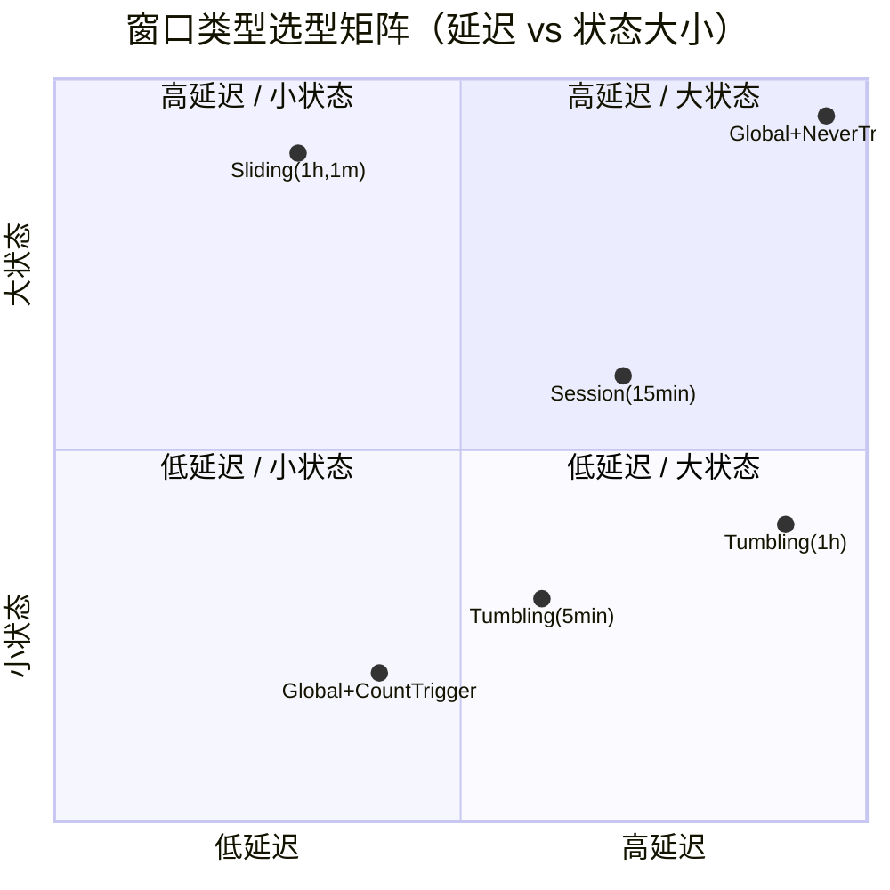

# 窗口算子详解

> 所属阶段: Knowledge | 前置依赖: [01.12-time-semantics-glossary.md](01.12-time-semantics-glossary.md), [../../../Flink/02-core/state-backends-deep-comparison.md](../../../Flink/02-core/state-backends-deep-comparison.md) | 形式化等级: L4

## 目录

- [窗口算子详解](#窗口算子详解)
  - [目录](#目录)
  - [1. 概念定义 (Definitions)](#1-概念定义-definitions)
  - [2. 属性推导 (Properties)](#2-属性推导-properties)
  - [3. 关系建立 (Relations)](#3-关系建立-relations)
    - [3.1 与 Dataflow Model 的对应](#31-与-dataflow-model-的对应)
    - [3.2 窗口类型与关系代数的类比](#32-窗口类型与关系代数的类比)
  - [4. 论证过程 (Argumentation)](#4-论证过程-argumentation)
    - [4.1 为什么 Global Window 默认永不触发？](#41-为什么-global-window-默认永不触发)
    - [4.2 Evictor 与增量聚合的冲突](#42-evictor-与增量聚合的冲突)
    - [4.3 allowedLateness 的状态代价](#43-allowedlateness-的状态代价)
  - [5. 形式证明 / 工程论证 (Proof / Engineering Argument)](#5-形式证明--工程论证-proof--engineering-argument)
    - [定理：EventTimeTrigger 的触发正确性](#定理eventtimetrigger-的触发正确性)
    - [工程论证：窗口类型 × 状态大小 × 延迟的权衡](#工程论证窗口类型--状态大小--延迟的权衡)
  - [6. 实例验证 (Examples)](#6-实例验证-examples)
    - [6.1 Tumbling Window 示例](#61-tumbling-window-示例)
    - [6.2 Sliding Window 示例](#62-sliding-window-示例)
    - [6.3 Session Window 示例](#63-session-window-示例)
    - [6.4 Global Window + Count Trigger](#64-global-window--count-trigger)
    - [6.5 增量聚合与全量聚合对比](#65-增量聚合与全量聚合对比)
    - [6.6 Allowed Lateness + Side Output](#66-allowed-lateness--side-output)
    - [6.7 自定义 Trigger 与 Evictor](#67-自定义-trigger-与-evictor)
  - [7. 可视化 (Visualizations)](#7-可视化-visualizations)
    - [7.1 不同窗口类型的事件分配](#71-不同窗口类型的事件分配)
    - [7.2 窗口类型 × 适用场景 × 状态大小 × 延迟对比矩阵](#72-窗口类型--适用场景--状态大小--延迟对比矩阵)
  - [8. 引用参考 (References)](#8-引用参考-references)

## 1. 概念定义 (Definitions)

**Def-O-06-01 (窗口与窗口分配器)**
设事件流 $S = \{ e_1, e_2, \ldots \}$，其中每个事件 $e_i = (v_i, t_i)$ 包含载荷 $v_i$ 和时间戳 $t_i \in \mathbb{T}$（$\mathbb{T}$ 为有序时间域）。窗口分配器（Window Assigner）是一个映射：
$$\mathcal{W}: S \to 2^{\mathbb{W}}$$
其中 $\mathbb{W}$ 为窗口标识空间。对于每个事件 $e_i$，$\mathcal{W}(e_i) \subseteq \mathbb{W}$ 表示该事件所属的一个或多个窗口集合。窗口 $w \in \mathbb{W}$ 具有起始时间 $w_{start}$ 和结束时间 $w_{end}$（$w_{start} \leq w_{end}$），窗口内所有事件满足 $w_{start} \leq t_i < w_{end}$（左闭右开区间）。

**Def-O-06-02 (滚动窗口 / Tumbling Window)**
滚动窗口分配器由固定窗口大小 $\Delta > 0$ 参数化：
$$\mathcal{W}_{\text{tumble}}(e_i) = \{ w_k \mid w_k = [k\Delta, (k+1)\Delta), k = \left\lfloor \frac{t_i}{\Delta} \right\rfloor \}$$
滚动窗口满足：

- **不重叠性**：$\forall w_a, w_b, w_a \neq w_b \Rightarrow w_a \cap w_b = \emptyset$
- **完备性**：$\bigcup_k w_k = \mathbb{T}$
- **单归属**：$|\mathcal{W}_{\text{tumble}}(e_i)| = 1$

**Def-O-06-03 (滑动窗口 / Sliding Window)**
滑动窗口分配器由窗口大小 $\Delta > 0$ 和滑动步长 $\delta > 0$（$\delta \leq \Delta$）参数化：
$$\mathcal{W}_{\text{slide}}(e_i) = \{ w_k \mid w_k = [k\delta, k\delta + \Delta), k \in \mathbb{Z}, k\delta \leq t_i < k\delta + \Delta \}$$
每个事件属于 $N = \lceil \Delta / \delta \rceil$ 个窗口（当 $\delta < \Delta$ 时 $N > 1$）。滑动窗口是滚动窗口在 $\delta = \Delta$ 时的特例。

**Def-O-06-04 (会话窗口 / Session Window)**
会话窗口分配器由会话间隙（gap）$g > 0$ 参数化。窗口通过动态合并产生：

- 初始化：每个事件 $e_i$ 初始化为单元素窗口 $w = [t_i, t_i + g)$
- 合并规则：若两个窗口 $w_a, w_b$ 满足 $w_a \cap w_b \neq \emptyset$，则合并为 $[\min(w_{a,start}, w_{b,start}), \max(w_{a,end}, w_{b,end}))$
- 迭代合并直到无交集窗口为止

会话窗口的大小和数量是**数据驱动**的，而非时钟驱动。同一键的事件序列若间隔均小于 $g$，则属于同一会话窗口。

**Def-O-06-05 (计数窗口 / Count Window)**
计数窗口由窗口元素数量 $N > 0$ 参数化，按到达顺序分配：
$$\mathcal{W}_{\text{count}}(e_i) = \{ w_k \mid w_k \text{ 包含第 } kN+1 \text{ 到第 } (k+1)N \text{ 个事件} \}$$
计数窗口基于**处理顺序**而非时间戳，不感知 event time，仅维护到达计数器。

**Def-O-06-06 (全局窗口 / Global Window)**
全局窗口分配器定义为：
$$\mathcal{W}_{\text{global}}(e_i) = \{ w_{\infty} \}, \quad w_{\infty} = [\min(\mathbb{T}), \max(\mathbb{T}))$$
全局窗口将所有事件分配到单一窗口，自身**永不触发**。必须配合自定义 Trigger 使用，否则不会输出任何结果。

**Def-O-06-07 (触发器 / Trigger)**
触发器是一个四元组 $\mathcal{T} = (\text{onElement}, \text{onEventTime}, \text{onProcessingTime}, \text{onMerge})$，返回触发结果 $\rho \in \{ \text{CONTINUE}, \text{FIRE}, \text{PURGE}, \text{FIRE\_AND\_PURGE} \}$：

- **CONTINUE**：无操作，继续等待
- **FIRE**：触发窗口函数计算，保留窗口状态
- **PURGE**：清空窗口元素，保留窗口元数据
- **FIRE\_AND\_PURGE**：触发计算并清空状态

**Def-O-06-08 (驱逐器 / Evictor)**
驱逐器 $\mathcal{E}$ 在 Trigger 的 FIRE 事件之后、窗口函数执行之前/之后，从窗口中选择性移除元素：
$$\mathcal{E}_{\text{before}}: 2^S \to 2^S, \quad \mathcal{E}_{\text{after}}: 2^S \times \mathcal{T}_{out} \to 2^S$$
驱逐器破坏了增量聚合的假设，因为窗口内容在触发后可能变化。

**Def-O-06-09 (允许延迟 / Allowed Lateness)**
设窗口 $w$ 的结束时间为 $w_{end}$，允许延迟 $\ell \geq 0$。则窗口的有效生命周期为 $[w_{start}, w_{end} + \ell)$：

- 事件 $e_i$ 满足 $t_i \in [w_{start}, w_{end})$ 且在水印推进到 $w_{end}$ 后到达，若 $t_i \geq w_{end} - \delta_{wm}$（水印时间）且当前处理时间 $< w_{end} + \ell$，则仍被加入窗口
- 当水印超过 $w_{end} + \ell$ 后，窗口状态被永久删除

## 2. 属性推导 (Properties)

**Lemma-O-06-01 (窗口分配器的覆盖性)**
Tumbling、Sliding、Session 窗口分配器均满足**覆盖性**：对于任意事件 $e_i$，$|\mathcal{W}(e_i)| \geq 1$。Global Window 显然满足。Count Window 满足（只要计数器正常推进）。

**Lemma-O-06-02 (滑动窗口的状态膨胀)**
滑动窗口中，每个事件属于 $N = \lceil \Delta / \delta \rceil$ 个窗口。设事件到达率为 $\lambda$（事件/秒），则单键每秒需维护的窗口引用数为 $\lambda \cdot N$。当 $\delta \ll \Delta$ 时（如 $\Delta = 1\text{h}, \delta = 1\text{s}$），$N = 3600$，状态量剧增。
*证明.* 由 Def-O-06-03，每个事件 $e_i$ 满足 $k\delta \leq t_i < k\delta + \Delta$ 的整数 $k$ 共有 $\lceil \Delta / \delta \rceil$ 个。$\square$

**Lemma-O-06-03 (会话窗口的合并闭包)**
对于同一键的事件序列按时间排序 $t_1 \leq t_2 \leq \cdots \leq t_n$，会话窗口合并后产生的窗口数 $m$ 满足：
$$m = 1 + |\{ i \mid 2 \leq i \leq n, t_i - t_{i-1} > g \}|$$
即窗口数等于"间隙跨越次数"加 1。
*证明.* 按时间顺序扫描，当且仅当相邻事件间隔超过 $g$ 时才产生新窗口，否则合并入当前窗口。$\square$

**Lemma-O-06-04 (水印与窗口关闭的时序关系)**
设水印函数为 $\omega(\tau)$（处理时间 $\tau$ 时的水印值），窗口 $w$ 的结束时间为 $w_{end}$。当 $\omega(\tau) \geq w_{end}$ 时，窗口进入"可触发"状态；当 $\omega(\tau) \geq w_{end} + \ell$（$\ell$ 为 allowed lateness）时，窗口被**彻底删除**。
*证明.* 水印语义保证所有 event time $< \omega(\tau)$ 的事件已到达（大概率）。因此当水印越过 $w_{end}$，系统认为窗口内数据已完整（忽略迟到事件）；当水印越过 $w_{end} + \ell$，即使 allowed lateness 也不再保留。$\square$

## 3. 关系建立 (Relations)

### 3.1 与 Dataflow Model 的对应

Google Dataflow Model [^1] 将数据处理解构为四个维度：

- **What**：计算什么结果 → 对应 Flink 的 Window Function
- **Where**：在 event time 的哪里计算 → 对应 Window Assigner
- **When**：在 processing time 的何时物化 → 对应 Trigger + Watermark
- **How**：早期结果与后期修正的关系 → 对应 Allowed Lateness + Accumulation Mode

Flink 的窗口算子是 Dataflow Model 的一个完整实现：

| Dataflow 维度 | Flink 实现 |
|-------------|-----------|
| What | `AggregateFunction` / `ReduceFunction` / `ProcessWindowFunction` |
| Where | `TumblingEventTimeWindows` / `SlidingEventTimeWindows` / `EventTimeSessionWindows` / `GlobalWindows` |
| When | `EventTimeTrigger` / `ProcessingTimeTrigger` / `ContinuousEventTimeTrigger` / `CountTrigger` |
| How | `allowedLateness()` + `sideOutputLateData()`（对应 Accumulating 模式） |

### 3.2 窗口类型与关系代数的类比

窗口化聚合可视为流上的一类**分组聚合（Grouping & Aggregation）**。关系代数中的分组操作 $\gamma$ 定义为：
$$\gamma_{G; a_1, \ldots, a_n}(R) = \{ (g, f_1(R_g), \ldots, f_n(R_g)) \mid g \in \pi_G(R) \}$$
其中 $R_g = \{ r \in R \mid r.G = g \}$。在流处理中，窗口扮演了"动态分组键"的角色：

- Tumbling Window $\approx$ 等宽分箱（equi-width binning）
- Session Window $\approx$ 基于密度的聚类（DBSCAN 的一维时间版本）
- Global Window $\approx$ 无分组的全局聚合（$\gamma_{\emptyset; \ldots}$）

## 4. 论证过程 (Argumentation)

### 4.1 为什么 Global Window 默认永不触发？

Global Window 的默认触发器是 `NeverTrigger`。这是因为全局窗口的结束时间为 `Long.MAX_VALUE`，在 event time 语义下水印永远无法达到该值。Global Window 的设计意图是：**由用户完全控制触发时机**，适用于以下场景：

- 基于元素数量触发的聚合（配合 `CountTrigger`）
- 基于外部信号触发的聚合（自定义 Trigger，如收到控制消息时触发）
- 需要全局排序或全局去重的场景

若误用 Global Window 而不指定 Trigger，作业将永远无输出——这是 Flink 新手最常见的窗口配置错误之一。

### 4.2 Evictor 与增量聚合的冲突

Flink 的窗口函数分为两类：

1. **增量聚合**：`ReduceFunction`、`AggregateFunction` —— 事件到达时立即部分聚合，窗口中仅存储聚合值
2. **全量聚合**：`ProcessWindowFunction` —— 窗口触发时遍历所有元素

当配置 Evictor 时，**增量聚合被禁用**。因为 Evictor 可能在触发后修改窗口内容（移除部分元素），而增量聚合值无法支持"减去被驱逐元素"的操作（除非聚合函数可逆）。Flink 内部会自动降级为全量聚合模式，这会带来显著的性能开销和状态膨胀。

### 4.3 allowedLateness 的状态代价

设窗口大小为 $\Delta$，允许延迟为 $\ell$，键空间大小为 $|K|$，则每个键在任意时刻需维护的"活跃窗口"数量为：
$$N_{active} = \left\lceil \frac{\Delta + \ell}{\Delta} \right\rceil = 2 \quad \text{(对于 Tumbling Window，当 } \ell < \Delta \text{ 时)}$$
对于 Sliding Window，$N_{active}$ 随 $\Delta / \delta$ 和 $\ell$ 线性增长。状态后端（RocksDB）需持久化这些窗口数据直至水印越过 $w_{end} + \ell$，因此 allowedLateness 直接决定了状态的 TTL 延长量。

## 5. 形式证明 / 工程论证 (Proof / Engineering Argument)

### 定理：EventTimeTrigger 的触发正确性

**Thm-O-06-01** 设窗口 $w$ 使用 `EventTimeTrigger`，水印推进函数为 $\omega(\tau)$。当且仅当 $\omega(\tau) \geq w_{end}$ 时，Trigger 返回 FIRE，且此后所有满足 $t_i < w_{end}$ 的事件要么已包含在窗口中，要么被正确路由到迟到数据处理路径。

*证明.*

- **充分性**：由水印定义 [^1]，$\omega(\tau) \geq w_{end}$ 意味着系统认为所有 event time $< w_{end}$ 的事件已到达。因此窗口内容已"完整"（在水印语义下），触发计算是正确的。
- **必要性**：若在水印到达 $w_{end}$ 前触发，则可能存在 event time $\in [\omega(\tau), w_{end})$ 的事件尚未到达，导致结果不完整。
- **迟到处理**：当 allowed lateness $\ell > 0$ 时，水印在 $[w_{end}, w_{end} + \ell)$ 区间内到达的事件仍被加入窗口（由 Def-O-06-09），并可能再次触发。当水印 $\geq w_{end} + \ell$ 后，若配置了 `sideOutputLateData()`，迟到事件被路由到侧输出；否则被丢弃。$\square$

### 工程论证：窗口类型 × 状态大小 × 延迟的权衡

窗口算子的选型需要在结果准确性、状态开销和输出延迟之间权衡：

| 窗口类型 | 状态增长模型 | 输出延迟 | 准确性风险 |
|---------|------------|---------|----------|
| Tumbling | $O(|K| \cdot \frac{T}{\Delta})$ | $\Delta + \delta_{wm}$ | 低 |
| Sliding | $O(|K| \cdot \frac{T}{\delta} \cdot \frac{\Delta}{\delta})$ | $\delta + \delta_{wm}$ | 中（重复计数） |
| Session | $O(|K| \cdot m)$，$m$ 为会话数 | 数据驱动 | 高（gap 敏感） |
| Global | $O(|K| \cdot N_{\text{elements}})$ | 完全由 Trigger 控制 | 低（若触发正确） |

其中 $|K|$ 为键空间基数，$T$ 为观测时间范围，$\delta_{wm}$ 为水印延迟。

## 6. 实例验证 (Examples)

### 6.1 Tumbling Window 示例

```java
DataStream<SensorReading> readings = ...;

DataStream<TemperatureStats> hourlyAvg = readings
    .keyBy(r -> r.getSensorId())
    .window(TumblingEventTimeWindows.of(Time.hours(1)))
    .aggregate(new AverageAggregate());
```

### 6.2 Sliding Window 示例

```java
// 每 5 秒计算过去 1 分钟的平均值
DataStream<Double> oneMinAvg = readings
    .keyBy(r -> r.getSensorId())
    .window(SlidingEventTimeWindows.of(Time.minutes(1), Time.seconds(5)))
    .aggregate(new AverageAggregate());
```

### 6.3 Session Window 示例

```java
// 用户会话：15 分钟无活动则会话结束
DataStream<UserSession> sessions = clickStream
    .keyBy(c -> c.getUserId())
    .window(EventTimeSessionWindows.withDynamicGap(
        (element) -> Time.minutes(15)))
    .aggregate(new SessionAggregate());
```

### 6.4 Global Window + Count Trigger

```java
// 每收到 100 个元素触发一次全局聚合
DataStream<Result> globalResult = stream
    .keyBy(e -> e.getCategory())
    .window(GlobalWindows.create())
    .trigger(CountTrigger.of(100))
    .aggregate(new SumAggregate());
```

### 6.5 增量聚合与全量聚合对比

```java
// 增量聚合：状态仅存储一个 Long 值
DataStream<Long> sum = stream
    .keyBy(e -> e.getKey())
    .window(TumblingEventTimeWindows.of(Time.minutes(5)))
    .reduce((a, b) -> new Event(a.getKey(), a.getValue() + b.getValue()));

// 全量聚合：状态存储窗口内所有元素
DataStream<ComplexResult> complex = stream
    .keyBy(e -> e.getKey())
    .window(TumblingEventTimeWindows.of(Time.minutes(5)))
    .process(new ProcessWindowFunction<Event, ComplexResult, String, TimeWindow>() {
        @Override
        public void process(String key, Context ctx, Iterable<Event> elements, Collector<ComplexResult> out) {
            List<Event> list = new ArrayList<>();
            elements.forEach(list::add);
            out.collect(new ComplexResult(key, ctx.window(), analyze(list)));
        }
    });
```

### 6.6 Allowed Lateness + Side Output

```java
final OutputTag<Event> lateOutputTag = new OutputTag<Event>("late-data"){};

SingleOutputStreamOperator<Result> result = events
    .keyBy(Event::getKey)
    .window(TumblingEventTimeWindows.of(Time.minutes(5)))
    .allowedLateness(Time.minutes(2))    // 允许迟到 2 分钟
    .sideOutputLateData(lateOutputTag)   // 超期迟到数据路由到侧输出
    .aggregate(new SumAggregate());

// 获取迟到数据流
DataStream<Event> lateEvents = result.getSideOutput(lateOutputTag);
lateEvents.addSink(new LateDataHandler());
```

### 6.7 自定义 Trigger 与 Evictor

```java
// 自定义 Trigger：每收到 10 个元素或水印越过窗口结束时触发
Trigger<Event, TimeWindow> customTrigger = new Trigger<Event, TimeWindow>() {
    private final ValueStateDescriptor<Integer> countDesc =
        new ValueStateDescriptor<>("count", Types.INT);

    @Override
    public TriggerResult onElement(Event element, long timestamp, TimeWindow window, TriggerContext ctx) {
        ValueState<Integer> count = ctx.getPartitionedState(countDesc);
        int current = count.value() == null ? 0 : count.value();
        count.update(current + 1);
        if (current + 1 >= 10) {
            return TriggerResult.FIRE;
        }
        ctx.registerEventTimeTimer(window.maxTimestamp());
        return TriggerResult.CONTINUE;
    }

    @Override
    public TriggerResult onEventTime(long time, TimeWindow window, TriggerContext ctx) {
        return time == window.maxTimestamp() ? TriggerResult.FIRE : TriggerResult.CONTINUE;
    }

    @Override
    public TriggerResult onProcessingTime(long time, TimeWindow window, TriggerContext ctx) {
        return TriggerResult.CONTINUE;
    }

    @Override
    public void clear(TimeWindow window, TriggerContext ctx) { }
};

// 使用 TimeEvictor：只保留最近 30 秒的数据
DataStream<Result> evictedResult = stream
    .keyBy(e -> e.getKey())
    .window(TumblingEventTimeWindows.of(Time.minutes(1)))
    .trigger(customTrigger)
    .evictor(TimeEvictor.of(Time.seconds(30)))
    .aggregate(new AverageAggregate());
```

## 7. 可视化 (Visualizations)

### 7.1 不同窗口类型的事件分配

下图展示了同一事件序列在四种窗口类型中的分配差异。时间轴上事件标记为 ●，窗口以方框表示。

```mermaid
gantt
    title 窗口类型事件分配对比
    dateFormat HH:mm
    axisFormat %H:%M

    section Tumbling(5min)
    W1 [00:00-00:05) :a1, 00:00, 5m
    W2 [00:05-00:10) :a2, 00:05, 5m
    W3 [00:10-00:15) :a3, 00:10, 5m

    section Sliding(5min,2min)
    W1 [00:00-00:05) :b1, 00:00, 5m
    W2 [00:02-00:07) :b2, 00:02, 5m
    W3 [00:04-00:09) :b3, 00:04, 5m
    W4 [00:06-00:11) :b4, 00:06, 5m

    section Session(gap=3min)
    Session1 :c1, 00:00, 4m
    Session2 :c2, 00:06, 5m

    section Global
    Global Window :d1, 00:00, 15m
```



**事件序列**：00:01, 00:02, 00:04, 00:06, 00:07, 00:09, 00:10, 00:12

| 窗口类型 | 事件分配结果 |
|---------|------------|
| Tumbling(5min) | W1: 00:01,00:02,00:04 / W2: 00:06,00:07,00:09 / W3: 00:10,00:12 |
| Sliding(5min,2min) | W1: 00:01,00:02,00:04 / W2: 00:02,00:04,00:06,00:07 / W3: 00:04,00:06,00:07,00:09 / W4: 00:06,00:07,00:09,00:10 |
| Session(gap=3min) | S1: 00:01,00:02,00:04 (gap 00:04→00:06 > 3min 断开会话) / S2: 00:06,00:07,00:09,00:10,00:12 |
| Global | 所有事件在一个窗口，依赖 Trigger 触发 |

### 7.2 窗口类型 × 适用场景 × 状态大小 × 延迟对比矩阵



| 窗口类型 | 适用场景 | 状态大小特征 | 典型输出延迟 | 关键配置参数 |
|---------|---------|------------|------------|------------|
| **Tumbling** | 周期性报表（小时/日统计）、计费批处理 | 小（每个事件仅属一个窗口） | 窗口大小 + 水印延迟 | `size` |
| **Sliding** | 移动平均、趋势监测、平滑指标 | 大（$\Delta/\delta$ 倍膨胀） | 滑动步长 + 水印延迟 | `size`, `slide` |
| **Session** | 用户行为分析、点击流会话、异常活动检测 | 中（取决于会话密度） | 会话结束时间不确定 | `gap` |
| **Count** | 批量处理固定条数、采样 | 小（仅计数器） | 到达 $N$ 个元素时 | `count` |
| **Global** | 全局排序、全局 Top-N、外部信号触发 | 极大（累积所有数据） | 完全由 Trigger 控制 | `trigger` |
| **WindowAll** | 非键控全局聚合（并行度=1） | 单点极大 | 同对应窗口类型 | 同对应窗口类型 |

## 8. 引用参考 (References)

[^1]: T. Akidau et al., "The Dataflow Model: A Practical Approach to Balancing Correctness, Latency, and Cost in Massive-Scale, Unbounded, Out-of-Order Data Processing", PVLDB, 8(12), 2015.
