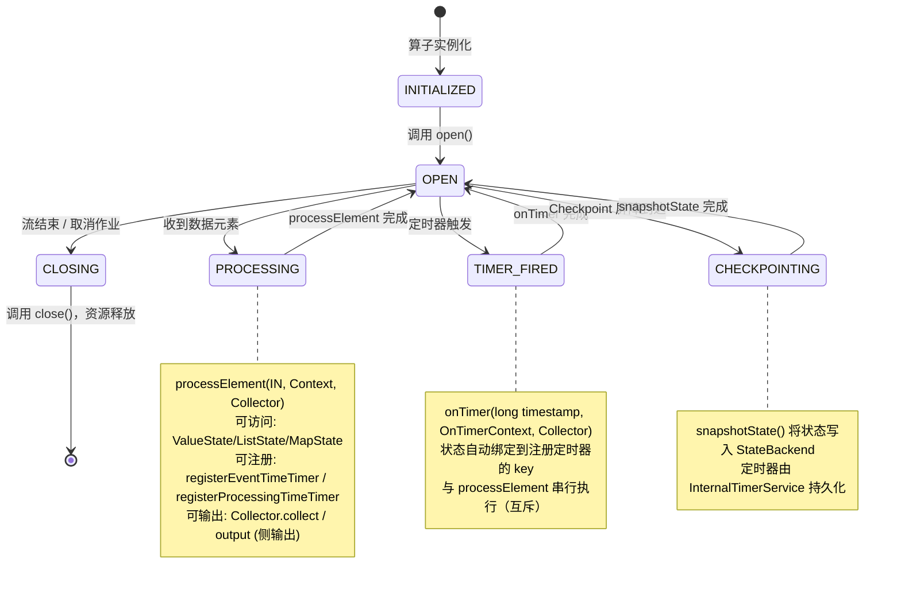
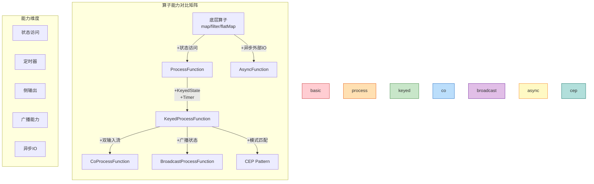
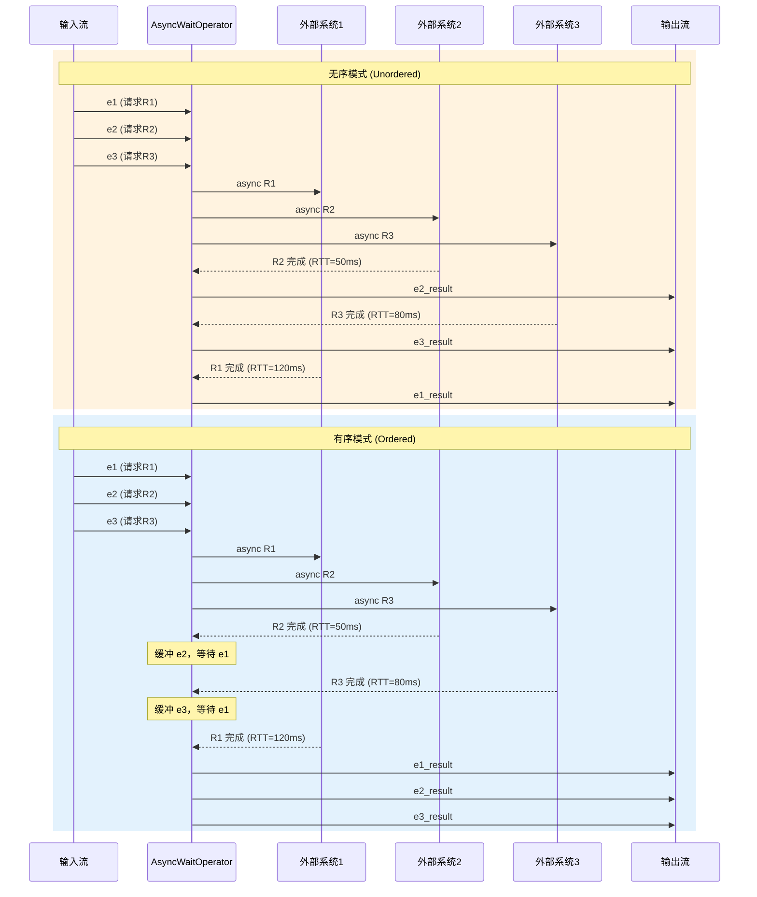

# 过程函数与异步算子深度解析

> **所属阶段**: Knowledge/01-concept-atlas/operator-deep-dive | **前置依赖**: [Flink/02-core/02.02-state-management.md](../../../Flink/02-core/02.02-state-management.md), [Flink/03-api/03.01-datastream-api.md](../../../Flink/03-api/03.01-datastream-api.md) | **形式化等级**: L3-L4
> **文档编号**: K-01-10 | **版本**: 2026.04 | **状态**: 完整

---

## 1. 概念定义 (Definitions)

### Def-K-01-10-01. 过程函数族 (ProcessFunction Family)

**定义**: Flink DataStream API 提供的一组**底层流处理操作算子**，允许用户访问流应用的基本构件（事件、状态、定时器）。过程函数族可视为具有状态与定时器访问权的增强型 `FlatMapFunction`。

**形式化类型签名**:

```
ProcessFunction[IN, OUT]          : DataStream[IN] → DataStream[OUT]
KeyedProcessFunction[KEY, IN, OUT] : KeyedStream[KEY, IN] → DataStream[OUT]
CoProcessFunction[IN1, IN2, OUT]   : ConnectedStream[IN1, IN2] → DataStream[OUT]
BroadcastProcessFunction[IN, BC, OUT] : BroadcastStream[BC] × DataStream[IN] → DataStream[OUT]
ProcessAllWindowFunction[IN, OUT, W] : AllWindowedStream[IN, W] → DataStream[OUT]
```

**核心接口方法**:

| 算子 | 核心方法 | 状态访问 | 定时器访问 | 侧输出 |
|------|---------|---------|-----------|--------|
| `ProcessFunction` | `processElement(IN, Context, Collector)` | 非Keyed流受限 | 无 | 支持 |
| `KeyedProcessFunction` | `processElement` + `onTimer` | 完整KeyedState | 事件/处理时间 | 支持 |
| `CoProcessFunction` | `processElement1` + `processElement2` + `onTimer` | 完整KeyedState | 事件/处理时间 | 支持 |
| `BroadcastProcessFunction` | `processElement` + `processBroadcastElement` | BroadcastState + KeyedState | 事件/处理时间 | 支持 |
| `ProcessAllWindowFunction` | `process(Context, Iterable, Collector)` | 无（仅窗口数据） | 无 | 支持 |

---

### Def-K-01-10-02. 异步I/O算子 (Async I/O Operators)

**定义**: Flink 1.2 引入的 `AsyncFunction` 与 `AsyncDataStream` 工具类，用于将**同步阻塞的外部系统调用**转换为**非阻塞的异步请求**，以提升流处理吞吐并降低延迟。

**形式化类型签名**:

```
AsyncFunction[IN, OUT] :
  asyncInvoke : IN × ResultFuture[OUT] → Unit
  timeout     : IN × ResultFuture[OUT] → Unit  (可选覆盖)

AsyncDataStream :
  orderedWait   : DataStream[IN] × AsyncFunction × Time × Capacity → DataStream[OUT]
  unorderedWait : DataStream[IN] × AsyncFunction × Time × Capacity → DataStream[OUT]
```

**输出模式语义**:

- **Ordered Mode**: 输出记录顺序与输入记录顺序严格一致。算子需缓冲先完成但尚未到序的结果，带来额外延迟与 Checkpoint 开销。
- **Unordered Mode**: 结果一旦完成立即输出。当使用处理时间时延迟最低；使用事件时间时，算子需缓存 watermark 之间的记录以维护顺序语义。

---

### Def-K-01-10-03. CEP Pattern API 核心原语

**定义**: Flink CEP (Complex Event Processing) 库提供的**声明式模式定义接口**，用于从事件流中检测符合特定序列模式的事件组合。Pattern API 可视为在流上执行的"正则表达式引擎"。

**核心构建原语**:

| 原语 | 语义 | 形式化描述 |
|------|------|-----------|
| `begin("name")` | 模式起始 | 创建初始模式节点 $P_0$ |
| `where(condition)` | 过滤条件 | $\{ e \mid e \in S \land \text{condition}(e) \}$ |
| `next("name")` | 严格连续 | $P_i \prec_{\text{immed}} P_{i+1}$，中间无其他事件 |
| `followedBy("name")` | 宽松连续 | $P_i \prec P_{i+1}$，中间允许无关事件 |
| `followedByAny("name")` | 非确定性宽松 | 允许多条匹配路径重叠 |
| `within(Time)` | 时间约束 | 模式必须在时间窗口 $[t_0, t_0 + \Delta]$ 内完成匹配 |
| `times(n)` | 精确重复 | $P_i^n$，恰好匹配 $n$ 次 |
| `optional()` | 可选匹配 | $P_i?$，匹配 0 次或 1 次 |
| `greedy()` | 贪婪匹配 | 在满足后续模式前提下最大化当前匹配长度 |

---

## 2. 属性推导 (Properties)

### Lemma-K-01-10-01. KeyedProcessFunction 状态作用域引理

**引理**: 在 `KeyedProcessFunction` 中，所有状态访问（`ValueState`/`ListState`/`MapState`/`ReducingState`/`AggregatingState`）与定时器回调 `onTimer` 均**绑定到当前 key 的作用域**。

**形式化表述**:

$$
\forall k \in \text{KeySpace}. \quad \text{state}_k \in \text{KeyedState}[k] \land \text{timer}_k \in \text{TimerService}[k]
$$

**证明**: 由 Flink Runtime 的 `InternalTimerServiceImpl` 实现保证。每个 key 拥有独立的命名空间(namespace)，状态后端按 `(key, namespace)` 二元组寻址。`onTimer` 回调时，Runtime 自动将执行上下文切换到注册定时器时的 key。∎

---

### Lemma-K-01-10-02. 异步算子有序模式缓冲区引理

**引理**: `AsyncDataStream.orderedWait` 在内部维护一个**有序结果缓冲区**。若记录 $e_i$ 的异步请求尚未完成，则所有 $j > i$ 的记录 $e_j$ 即使已完成也必须等待。

**形式化表述**:

$$
\text{output}(e_j) \text{ 被阻塞} \iff \exists i < j. \text{ status}(e_i) \neq \text{COMPLETED}
$$

**推论**: 有序模式的 Checkpoint 大小与缓冲区中未完成记录数成正比；无序模式的 Checkpoint 仅需保存 watermark 边界内的未完成记录。

---

### Prop-K-01-10-01. 过程函数 vs 高层算子能力扩展命题

**命题**: 过程函数族在表达能力上严格扩展了 `map` / `filter` / `flatMap` 等高层算子。

| 能力维度 | map/filter/flatMap | ProcessFunction | KeyedProcessFunction |
|---------|-------------------|-----------------|---------------------|
| 事件时间戳访问 | ❌ | ✅ | ✅ |
| Watermark 访问 | ❌ | ✅ | ✅ |
| 状态访问 | ❌ (仅RichFunction) | 受限 | 完整KeyedState |
| 定时器注册 | ❌ | ❌ | ✅ |
| 侧输出流 | ❌ | ✅ | ✅ |
| 广播状态 | ❌ | ❌ | ✅ (BroadcastProcessFunction) |

**证明**: 由 Flink API 设计保证。高层算子通过 `ProcessFunction` 实现（如 `map` 可编码为无状态 `ProcessFunction`），但高层算子不提供 `TimerService` 和 `KeyedState` 的完整访问接口。∎

---

## 3. 关系建立 (Relations)

### 关系 1: 过程函数族与底层实现的关系

Flink SQL 的算子实现底层大量依赖 `ProcessFunction`。例如：

- `STREAMING JOIN` → `CoProcessFunction`
- `Deduplication` → `KeyedProcessFunction` + `ValueState<Boolean>`
- `Pattern Match` (CEP) → `KeyedProcessFunction` + `NFA` (非确定有限自动机)

### 关系 2: AsyncFunction 与外部系统交互模式

```
同步模式 (阻塞):
  DataStream → [map: 调用外部API] → 等待响应 → 输出结果
  延迟 = sum(每个请求的RTT), 吞吐 = 1/RTT

异步模式 (非阻塞):
  DataStream → [AsyncFunction: 触发请求] → 立即返回
                ↓ (并发执行多个请求)
              ResultFuture.complete() → 输出结果
  延迟 ≈ max(并发请求的RTT), 吞吐 = capacity/RTT
```

### 关系 3: CEP Pattern 到 NFA 的编译关系

Flink CEP 将 Pattern API 声明编译为**非确定有限自动机 (NFA)**，每个 `Pattern` 对应 NFA 的状态转移。`next` 对应 ε-free 确定性转移，`followedBy` 对应带自环的非确定性转移，`within` 在 NFA 上附加超时边。

---

## 4. 论证过程 (Argumentation)

### 论证 1: KeyedProcessFunction 定时器语义辨析

**事件时间定时器** (`registerEventTimeTimer(timestamp)`):

- 触发条件: 当前 watermark $W \geq \text{timestamp}$
- 语义保证: 在该时间点之前（按事件时间）的所有记录均已到达
- 适用场景: 超时检测、窗口触发、基于业务时间的调度

**处理时间定时器** (`registerProcessingTimeTimer(timestamp)`):

- 触发条件: 机器 wall-clock 时间达到 timestamp
- 语义保证: 无事件时间语义，仅保证物理时间流逝
- 适用场景: 定期清理状态、心跳检测、物理时间限流

**关键区别**: 事件时间定时器受 watermark 推进速度影响；若上游延迟大，定时器可能显著滞后于处理时间。

### 论证 2: BroadcastState 的读写不对称性

在 `BroadcastProcessFunction` 中:

- `processBroadcastElement()`: **读写访问** BroadcastState，用于接收配置/规则更新
- `processElement()`: **只读访问** BroadcastState，防止并行实例状态不一致

这种不对称性是 Flink 保证**所有并行实例看到相同广播状态**的关键。若允许 `processElement` 修改广播状态，各实例将产生分叉视图，破坏一致性。

### 论证 3: CEP 连续语义的选择策略

| 连续策略 | 语义 | 内存开销 | 适用场景 |
|---------|------|---------|---------|
| `next()` | 严格紧邻 | 低 | 精确序列（如登录→操作） |
| `followedBy()` | 宽松连续 | 中 | 事件间允许干扰（如下单→支付） |
| `followedByAny()` | 非确定性宽松 | 高 | 重叠模式（如欺诈检测多路径） |

`followedByAny` 会产生**组合爆炸**，因为单个事件可能同时满足多个活跃模式分支。生产环境中建议优先使用 `followedBy`，仅在必要时使用 `followedByAny`。

---

## 5. 形式证明 / 工程论证 (Proof / Engineering Argument)

### Thm-K-01-10-01. KeyedProcessFunction 生命周期正确性定理

**定理**: KeyedProcessFunction 的生命周期状态机满足以下不变式：

$$
\text{INVARIANT}: \text{当前状态} \in \{ \text{OPEN}, \text{PROCESSING}, \text{TIMER}, \text{CLOSING} \} \land \text{state.scope} = \text{current.key}
$$

**状态机说明**:

1. `OPEN`: `open()` 执行，初始化状态和连接
2. `PROCESSING`: `processElement()` 执行，处理输入记录
3. `TIMER`: `onTimer()` 执行，处理定时器回调
4. `CLOSING`: `close()` 执行，清理资源

**证明**: 由 `OneInputStreamOperator` 的 `processElement` 和 `onEventTime`/`onProcessingTime` 调度的互斥性保证。Runtime 通过 `synchronized` 或 mailbox 模型确保 `processElement` 与 `onTimer` 不会并发执行于同一算子实例。∎

---

### Thm-K-01-10-02. 异步算子 Exactly-Once 语义保持定理

**定理**: 在启用 Checkpoint 的情况下，`AsyncWaitOperator` 的 ordered/unordered 模式均能保证端到端的 exactly-once 语义。

**证明要点**:

1. **状态快照**: `AsyncWaitOperator` 将**未完成异步请求队列**存入 Checkpoint 状态
2. **恢复**: 从 Checkpoint 恢复时，重新提交未完成请求（幂等性由用户保证）
3. **有序模式**: 缓冲区内容一并快照，恢复后按原序继续输出
4. **无序模式**: watermark 边界内的未完成请求被快照，恢复后重新触发

**用户义务**: 外部系统调用必须是**幂等**的，或提供**去重机制**（如事务ID）。∎

---

## 6. 实例验证 (Examples)

### 示例 1: KeyedProcessFunction — 温度持续上升报警

```java
// 监控传感器温度，若10秒内持续上升则报警
public class TemperatureAlertFunction
    extends KeyedProcessFunction<String, SensorReading, String> {

    private ValueState<Double> lastTempState;
    private ValueState<Long> timerState;

    @Override
    public void open(Configuration parameters) {
        lastTempState = getRuntimeContext().getState(
            new ValueStateDescriptor<>("lastTemp", Types.DOUBLE));
        timerState = getRuntimeContext().getState(
            new ValueStateDescriptor<>("timer", Types.LONG));
    }

    @Override
    public void processElement(SensorReading reading, Context ctx, Collector<String> out)
            throws Exception {
        Double lastTemp = lastTempState.value();
        if (lastTemp != null && reading.temperature > lastTemp) {
            // 温度上升，注册10秒后的定时器（若未注册）
            if (timerState.value() == null) {
                long timerTs = ctx.timestamp() + 10000;
                ctx.timerService().registerEventTimeTimer(timerTs);
                timerState.update(timerTs);
            }
        } else {
            // 温度下降或持平，删除定时器
            if (timerState.value() != null) {
                ctx.timerService().deleteEventTimeTimer(timerState.value());
                timerState.clear();
            }
        }
        lastTempState.update(reading.temperature);
    }

    @Override
    public void onTimer(long timestamp, OnTimerContext ctx, Collector<String> out)
            throws Exception {
        out.collect("ALERT: Sensor " + ctx.getCurrentKey()
            + " temperature consistently rising for 10s");
        timerState.clear();
    }
}
```

---

### 示例 2: CoProcessFunction — 双流Join超时处理

```java
public class OrderPayTimeoutFunction
    extends CoProcessFunction<OrderEvent, PayEvent, OrderResult> {

    private ValueState<OrderEvent> orderState;
    private ValueState<PayEvent> payState;
    private ValueState<Long> timerState;

    @Override
    public void processElement1(OrderEvent order, Context ctx, Collector<OrderResult> out)
            throws Exception {
        orderState.update(order);
        ctx.timerService().registerEventTimeTimer(order.eventTime + 600000); // 10分钟超时
        timerState.update(order.eventTime + 600000);
    }

    @Override
    public void processElement2(PayEvent pay, Context ctx, Collector<OrderResult> out)
            throws Exception {
        payState.update(pay);
        OrderEvent order = orderState.value();
        if (order != null) {
            out.collect(new OrderResult(order.orderId, "PAID"));
            ctx.timerService().deleteEventTimeTimer(timerState.value());
            orderState.clear();
            payState.clear();
        }
    }

    @Override
    public void onTimer(long timestamp, OnTimerContext ctx, Collector<OrderResult> out)
            throws Exception {
        OrderEvent order = orderState.value();
        if (order != null) {
            out.collect(new OrderResult(order.orderId, "TIMEOUT"));
        }
        orderState.clear();
        payState.clear();
    }
}
```

---

### 示例 3: AsyncFunction — 异步查询HBase

```java
public class HBaseAsyncLookup extends RichAsyncFunction<String, UserInfo> {
    private transient AsyncHBaseClient client;

    @Override
    public void open(Configuration parameters) throws Exception {
        client = new AsyncHBaseClient(hbaseConfig);
    }

    @Override
    public void asyncInvoke(String userId, ResultFuture<UserInfo> resultFuture) throws Exception {
        client.get(userId, new Callback<Result>() {
            @Override
            public void onSuccess(Result result) {
                UserInfo info = parseResult(result);
                resultFuture.complete(Collections.singletonList(info));
            }
            @Override
            public void onFailure(Throwable t) {
                resultFuture.completeExceptionally(t);
            }
        });
    }

    @Override
    public void timeout(String userId, ResultFuture<UserInfo> resultFuture) throws Exception {
        resultFuture.complete(Collections.singletonList(UserInfo.EMPTY));
    }
}

// 使用方式
DataStream<UserInfo> enriched = AsyncDataStream.unorderedWait(
    inputStream,
    new HBaseAsyncLookup(),
    1000, TimeUnit.MILLISECONDS,
    100 // 并发容量
);
```

---

### 示例 4: CEP Pattern API — 欺诈检测模式

```java
// 检测：用户登录后5分钟内，发生3次及以上金额>10000的交易
Pattern<TransactionEvent, ?> fraudPattern = Pattern
    .<TransactionEvent>begin("login")
    .where(new SimpleCondition<TransactionEvent>() {
        public boolean filter(TransactionEvent e) {
            return e.type.equals("LOGIN");
        }
    })
    .followedBy("large_tx")
    .where(new SimpleCondition<TransactionEvent>() {
        public boolean filter(TransactionEvent e) {
            return e.type.equals("TX") && e.amount > 10000;
        }
    })
    .timesOrMore(3)
    .greedy()
    .within(Time.minutes(5));

PatternStream<TransactionEvent> patternStream = CEP.pattern(
    txStream.keyBy(e -> e.userId),
    fraudPattern
);

patternStream
    .process(new PatternProcessFunction<TransactionEvent, Alert>() {
        public void processMatch(Map<String, List<TransactionEvent>> match, Context ctx,
                                 Collector<Alert> out) {
            List<TransactionEvent> txs = match.get("large_tx");
            out.collect(new Alert(match.get("login").get(0).userId,
                "FRAUD: " + txs.size() + " large transactions after login"));
        }
    });
```

---

## 7. 可视化 (Visualizations)

### 图 7.1: KeyedProcessFunction 生命周期状态图

KeyedProcessFunction 的生命周期由 Runtime 严格管理，以下状态图展示了从 `open()` 到 `close()` 的完整状态转移：



---

### 图 7.2: 算子能力对比矩阵（Mermaid表格图）

以下对比矩阵展示了各类过程函数与异步算子在关键能力维度上的差异：



**详细能力对比表**:

| 算子 | ValueState | ListState | MapState | Timer | SideOutput | BroadcastState | 异步IO |
|------|-----------|-----------|----------|-------|-----------|---------------|--------|
| `map/filter/flatMap` | ❌ | ❌ | ❌ | ❌ | ❌ | ❌ | ❌ |
| `ProcessFunction` | 非Keyed受限 | 非Keyed受限 | 非Keyed受限 | ❌ | ✅ | ❌ | ❌ |
| `KeyedProcessFunction` | ✅ | ✅ | ✅ | ✅ | ✅ | ❌ | ❌ |
| `CoProcessFunction` | ✅ | ✅ | ✅ | ✅ | ✅ | ❌ | ❌ |
| `BroadcastProcessFunction` | ✅ (Keyed侧) | ✅ (Keyed侧) | ✅ (Keyed侧) | ✅ | ✅ | ✅ (读写/只读) | ❌ |
| `ProcessAllWindowFunction` | ❌ | ❌ | ❌ | ❌ | ✅ | ❌ | ❌ |
| `AsyncFunction` | 可组合 | 可组合 | 可组合 | 可组合 | 可组合 | 可组合 | ✅ (核心) |
| `CEP Pattern` | 内部NFA | 内部NFA | 内部NFA | `within()` | ✅ | 可组合 | ❌ |

---

### 图 7.3: AsyncFunction 有序 vs 无序模式执行时序图



---

## 8. 引用参考 (References)


---

*文档创建时间: 2026-04-30 | 形式化等级: L3-L4 | 状态: 完整*
