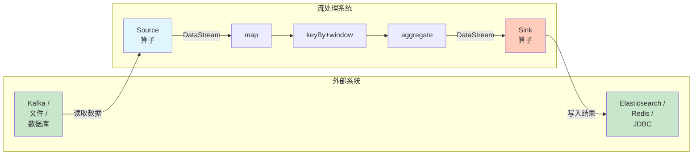
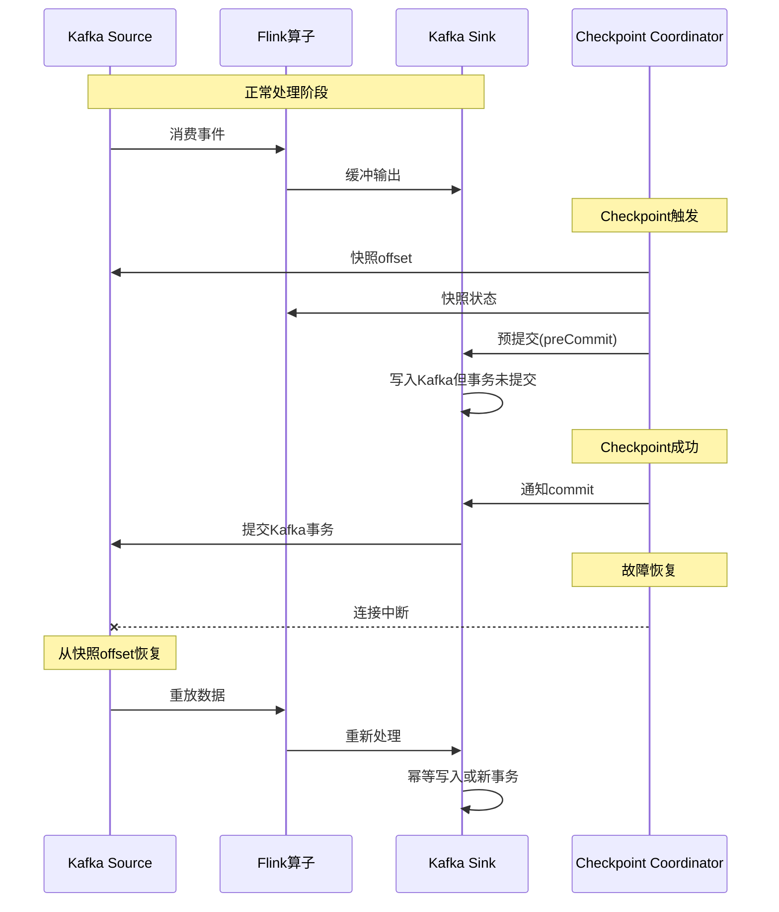
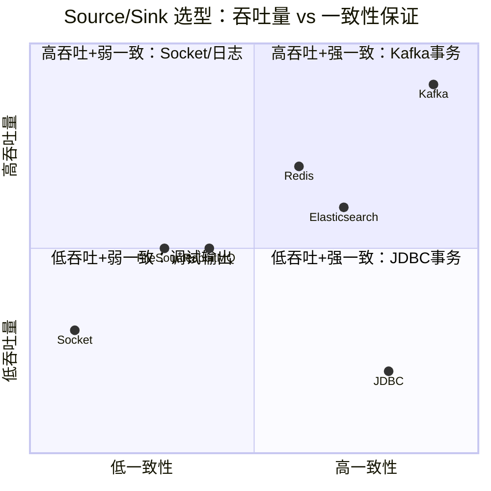

# Source/Sink 与 I/O 算子详解

> **所属阶段**: Knowledge/01-concept-atlas/operator-deep-dive | **前置依赖**: [03.05-stream-operator-taxonomy.md](../../../Struct/03-relationships/03.05-stream-operator-taxonomy.md), [01.08-multi-stream-operators.md](01.08-multi-stream-operators.md) | **形式化等级**: L3
> **文档定位**: 流处理系统边界的算子抽象——输入端的Source与输出端的Sink的形式化语义与exactly-once实现
> **版本**: 2026.04

---

## 目录

- [Source/Sink 与 I/O 算子详解](#sourcesink-与-io-算子详解)
  - [目录](#目录)
  - [1. 概念定义 (Definitions)](#1-概念定义-definitions)
    - [1.1 Source 的形式化定义](#11-source-的形式化定义)
    - [1.2 Sink 的形式化定义](#12-sink-的形式化定义)
    - [1.3 I/O 算子的边界语义](#13-io-算子的边界语义)
  - [2. 属性推导 (Properties)](#2-属性推导-properties)
    - [2.1 Source 的单调性](#21-source-的单调性)
    - [2.2 Sink 的幂等性条件](#22-sink-的幂等性条件)
  - [3. 关系建立 (Relations)](#3-关系建立-relations)
    - [3.1 Source/Sink 与中间算子的关系](#31-sourcesink-与中间算子的关系)
    - [3.2 连接器生态映射](#32-连接器生态映射)
  - [4. 论证过程 (Argumentation)](#4-论证过程-argumentation)
    - [4.1 Source 并行度与分区关系](#41-source-并行度与分区关系)
    - [4.2 Sink 两阶段提交的边界情况](#42-sink-两阶段提交的边界情况)
  - [5. 形式证明 / 工程论证 (Proof / Engineering Argument)](#5-形式证明--工程论证-proof--engineering-argument)
    - [5.1 Exactly-Once 端到端语义的形式化条件](#51-exactly-once-端到端语义的形式化条件)
  - [6. 实例验证 (Examples)](#6-实例验证-examples)
    - [6.1 Kafka Source + Exactly-Once 配置](#61-kafka-source--exactly-once-配置)
    - [6.2 JDBC Sink + 幂等写入](#62-jdbc-sink--幂等写入)
  - [7. 可视化 (Visualizations)](#7-可视化-visualizations)
    - [图 7.1 Source/Sink 作为系统边界的架构图](#图-71-sourcesink-作为系统边界的架构图)
    - [图 7.2 Exactly-Once 端到端保证机制图](#图-72-exactly-once-端到端保证机制图)
    - [图 7.3 Source/Sink 选型矩阵](#图-73-sourcesink-选型矩阵)
  - [8. 引用参考 (References)](#8-引用参考-references)

---

## 1. 概念定义 (Definitions)

### 1.1 Source 的形式化定义

**定义 1.1 (Source 算子)** [Def-O-08-01]

Source 是流处理系统的**零输入算子**，负责从外部系统产生数据流：

$$\text{Source}: \emptyset \times \Theta_{src} \rightarrow S$$

其中 $\Theta_{src} = (C, P, O, F)$ 为Source参数：

- $C$: 连接配置（connection configuration）
- $P$: 并行度（parallelism）
- $O$: 偏移量/位置信息（offset/position）
- $F$: 分区发现函数（partition discovery function）

**定义 1.2 (有界 Source)** [Def-O-08-02]

有界Source产生有界流：

$$\text{BoundedSource}: \emptyset \times \Theta_{src} \rightarrow S_{bounded}, \quad |S_{bounded}| < \infty$$

典型实例：FileSource、CollectionSource、BoundedKafkaSource（指定offset范围）。

**定义 1.3 (无界 Source)** [Def-O-08-03]

无界Source产生无界流：

$$\text{UnboundedSource}: \emptyset \times \Theta_{src} \rightarrow S_{unbounded}, \quad |S_{unbounded}| = \infty$$

典型实例：KafkaSource、SocketSource、MQTTSource、PulsarSource。

**定义 1.4 (Source 的偏移量函数)** [Def-O-08-04]

偏移量函数 $\phi_{src}$ 将Source的输出事件映射到其在数据源中的可恢复位置：

$$\phi_{src}: E \rightarrow \mathcal{P}, \quad \phi_{src}(e) = \text{position}(e)$$

其中 $\mathcal{P}$ 为位置空间（如Kafka的topic-partition-offset三元组）。

**定义 1.5 (Source 的单调读取保证)** [Def-O-08-05]

Source的偏移量读取满足单调递增：

$$\forall e_i, e_j \in S. \; i < j \implies \phi_{src}(e_i) \preceq \phi_{src}(e_j)$$

其中 $\preceq$ 为位置空间的偏序关系。

### 1.2 Sink 的形式化定义

**定义 1.6 (Sink 算子)** [Def-O-08-06]

Sink 是流处理系统的**零输出算子**，负责将数据流持久化到外部系统：

$$\text{Sink}: S \times \Theta_{sink} \rightarrow \emptyset$$

其中 $\Theta_{sink} = (C, P, W, T)$ 为Sink参数：

- $C$: 连接配置
- $P$: 并行度
- $W$: 写入语义（at-least-once / at-most-once / exactly-once）
- $T$: 事务协调器类型（两阶段提交 / 预写日志 / 幂等写入）

**定义 1.7 (幂等 Sink)** [Def-O-08-07]

幂等Sink满足：对同一事件的重复写入不产生副作用：

$$\text{Sink}(e) = \text{Sink}(\text{Sink}(e)), \quad \forall e \in S$$

**定义 1.8 (事务性 Sink)** [Def-O-08-08]

事务性Sink支持两阶段提交协议：

$$\text{TransactionalSink}: S \times \Theta_{sink} \xrightarrow{\text{prepare}} \Gamma \xrightarrow{\text{commit/abort}} \emptyset$$

其中 $\Gamma$ 为预提交状态空间。

### 1.3 I/O 算子的边界语义

**定义 1.9 (流处理系统的边界)** [Def-O-08-09]

流处理作业 $J$ 的边界由Source集合和Sink集合定义：

$$\partial J = (\mathcal{S}_{src}, \mathcal{S}_{sink}), \quad \mathcal{S}_{src} = \{src_1, \ldots, src_m\}, \quad \mathcal{S}_{sink} = \{sink_1, \ldots, sink_n\}$$

作业的完整语义为：

$$\llbracket J \rrbracket = \text{Sink}_n \circ \ldots \circ \text{Sink}_1 \circ f_{ops} \circ \text{Source}_m \circ \ldots \circ \text{Source}_1$$

其中 $f_{ops}$ 为中间算子组合。

---

## 2. 属性推导 (Properties)

### 2.1 Source 的单调性

**引理 2.1 (Source 偏移量的单调性保证)** [Lemma-O-08-01]

任何符合Source契约的实现，其偏移量读取必须单调不减：

$$\forall t_1 < t_2. \; \phi_{src}(S(t_1)) \preceq \phi_{src}(S(t_2))$$

*证明*: 反设存在 $t_1 < t_2$ 使得 $\phi_{src}(S(t_1)) \succ \phi_{src}(S(t_2))$，即读取到"回退"的偏移量。这将导致Checkpoint恢复后重复处理已确认的数据，破坏exactly-once语义。因此Source实现必须保证单调性。$\square$

### 2.2 Sink 的幂等性条件

**引理 2.2 (Sink 幂等性的充分条件)** [Lemma-O-08-02]

若Sink满足以下条件，则它是幂等的：

1. **唯一键约束**: 目标存储对事件的主键有唯一性约束
2. **UPSERT语义**: 写入操作是UPSERT（INSERT或UPDATE）而非纯INSERT
3. **确定性键生成**: 事件到主键的映射是确定函数 $k: E \rightarrow \mathcal{K}$

*证明*: 设同一事件 $e$ 被处理两次，生成键 $k(e)$。第一次写入创建记录 $(k(e), v(e))$。第二次写入因唯一键约束触发UPDATE，记录仍为 $(k(e), v(e))$。两次写入后状态相同，满足幂等定义。$\square$

---

## 3. 关系建立 (Relations)

### 3.1 Source/Sink 与中间算子的关系

| 关系维度 | Source | 中间算子 | Sink |
|---------|--------|---------|------|
| **输入数量** | 0 | 1或多 | 1 |
| **输出数量** | 1 | 1或多 | 0 |
| **状态类型** | Offset/ListState | Value/List/Map/ReducingState | TransactionState |
| **Checkpoint参与** | 是（offset快照） | 是（状态快照） | 是（预提交/提交） |
| **Exactly-once责任** | 可重放性 | 确定性处理 | 幂等性或事务性 |
| **故障恢复** | 从offset重放 | 从状态恢复 | 回滚未提交事务 |

### 3.2 连接器生态映射

| 外部系统 | Source能力 | Sink能力 | Exactly-once机制 | Flink连接器 |
|---------|-----------|---------|-----------------|------------|
| Apache Kafka | 分区消费、offset提交、自动发现 | 幂等写入、事务性写入 | Kafka事务 + Flink两阶段提交 | KafkaSource / KafkaSink |
| Apache Pulsar | 分区消费、cursor管理 | 幂等写入 | Pulsar事务 | PulsarSource |
| JDBC (MySQL/PostgreSQL) | 轮询/CDC | UPSERT/INSERT | 幂等UPSERT | JdbcSource / JdbcSink |
| Elasticsearch | 无官方Source | 幂等索引写入 | 幂等写入（_id作为键） | ElasticsearchSink |
| Redis | Stream消费 | SET/HSET | 幂等写入 | RedisSource / RedisSink |
| Files (HDFS/S3) | 分片读取 | 分区写入 | 幂等写入（覆盖模式） | FileSource / FileSink |
| Socket | 简单读取 | 简单写入 | 无 | SocketSource |
| RabbitMQ | Queue消费 | Queue写入 | 无（at-least-once） | RabbitMQSource/Sink |
| MQTT | Topic订阅 | Topic发布 | 无（at-least-once） | MQTTSource/Sink |

---

## 4. 论证过程 (Argumentation)

### 4.1 Source 并行度与分区关系

**论证**: Source的并行度 $P_{src}$ 与数据源分区数 $N_{partition}$ 的关系直接影响读取效率。

| 关系 | 行为 | 建议 |
|------|------|------|
| $P_{src} = N_{partition}$ | 每个并行子任务读取一个分区，最优 | ⭐ 推荐 |
| $P_{src} < N_{partition}$ | 部分子任务读取多个分区，可能负载不均 | ⚠️ 可接受 |
| $P_{src} > N_{partition}$ | 部分子任务空闲，浪费资源 | ❌ 不推荐 |

**Flink KafkaSource示例**:

```java
KafkaSource.<String>builder()
    .setBootstrapServers("kafka:9092")
    .setTopics("input-topic")
    .setGroupId("flink-consumer")
    .setStartingOffsets(OffsetsInitializer.earliest())
    .setValueOnlyDeserializer(new SimpleStringSchema())
    .build();
// 并行度应设置为topic分区数或其约数
```

### 4.2 Sink 两阶段提交的边界情况

**边界情况 1: Checkpoint超时**

- 场景: Checkpoint在Sink的preCommit阶段超时
- 行为: Flink认为Checkpoint失败，作业从上一个成功Checkpoint恢复
- Sink责任: 必须能够识别并回滚未完成的preCommit事务

**边界情况 2: Sink commit后Flink崩溃**

- 场景: Sink已成功commit，但Flink在commit确认前崩溃
- 行为: 恢复后Flink可能重放部分数据
- Sink责任: 必须幂等，或能识别已commit的事务ID

**边界情况 3: 多Sink的分布式事务**

- 场景: 作业有两个Sink，需要原子性commit
- 限制: Flink不支持跨多个外部系统的原子事务
- 解决方案: 每个Sink独立管理事务，接受最终一致性

---

## 5. 形式证明 / 工程论证 (Proof / Engineering Argument)

### 5.1 Exactly-Once 端到端语义的形式化条件

**定理 5.1 (端到端 Exactly-Once 条件)** [Thm-O-08-01]

流处理作业 $J$ 实现端到端exactly-once语义，当且仅当：

1. **Source可重放性**: $\forall e \in S. \; \phi_{src}(e)$ 可被持久化并在恢复时重新定位
2. **算子确定性**: 中间算子 $f_{ops}$ 对相同输入产生相同输出
3. **Sink幂等性或事务性**:
   - 幂等: $\text{Sink}(e) = \text{Sink}(\text{Sink}(e))$
   - 或事务: Sink支持两阶段提交的prepare/commit/abort

*证明*:

**可靠性 (No Duplicates)**:

- 设作业在Checkpoint $C_k$ 后崩溃
- Source从 $C_k$ 的offset恢复，不会重放 $C_k$ 之前的数据
- 算子从 $C_k$ 的状态恢复，产生确定性的中间结果
- 若Sink幂等，重放 $C_k$ 之后的数据不产生副作用
- 若Sink事务性，未commit的事务被abort，已commit的事务不重复

**完整性 (No Loss)**:

- Source的offset单调递增，不会跳过数据
- Checkpoint包含完整的算子状态和未确认的事务状态
- 恢复后所有 $C_k$ 之后的数据被重新处理

因此端到端exactly-once成立。$\square$

**推论 5.1.1 (端到端 Exactly-Once 不可能三角)** [Cor-O-08-01]

对于不支持事务的外部系统，若Sink不幂等且Source不可重放，则端到端exactly-once**不可实现**。

---

## 6. 实例验证 (Examples)

### 6.1 Kafka Source + Exactly-Once 配置

```java
// Kafka Source: 自动offset管理 + 可重放性
KafkaSource<String> source = KafkaSource.<String>builder()
    .setBootstrapServers("kafka:9092")
    .setTopics("input-topic")
    .setGroupId("flink-eos-group")
    .setStartingOffsets(OffsetsInitializer.earliest())
    .setProperty("isolation.level", "read_committed") // 只读取已提交事务的消息
    .setValueOnlyDeserializer(new SimpleStringSchema())
    .build();

// Kafka Sink: 事务性写入
checkpointingMode = CheckpointingMode.EXACTLY_ONCE;

KafkaSink<String> sink = KafkaSink.<String>builder()
    .setBootstrapServers("kafka:9092")
    .setRecordSerializer(KafkaRecordSerializationSchema.builder()
        .setTopic("output-topic")
        .setValueSerializationSchema(new SimpleStringSchema())
        .build())
    .setDeliveryGuarantee(DeliveryGuarantee.EXACTLY_ONCE)
    .setTransactionalIdPrefix("flink-sink-tx-")
    .build();

env.fromSource(source, WatermarkStrategy.noWatermarks(), "Kafka Source")
   .map(new ProcessFunction())
   .sinkTo(sink);
```

**关键配置解析**:

- `isolation.level=read_committed`: Source只消费已提交事务的消息，避免读到下游Sink的未提交数据
- `DeliveryGuarantee.EXACTLY_ONCE`: Sink使用Kafka事务API，每个Checkpoint对应一个Kafka事务
- `transactionalIdPrefix`: 唯一标识Flink事务，防止与外部生产者冲突

### 6.2 JDBC Sink + 幂等写入

```java
// 场景: 将聚合结果写入MySQL，按日期+维度键幂等更新

String upsertSql = "INSERT INTO daily_stats (dt, dim_key, metric_val) " +
    "VALUES (?, ?, ?) " +
    "ON DUPLICATE KEY UPDATE metric_val = VALUES(metric_val)";

JdbcSink.sink(
    upsertSql,
    (ps, stat) -> {
        ps.setString(1, stat.getDate());
        ps.setString(2, stat.getDimKey());
        ps.setLong(3, stat.getValue());
    },
    JdbcExecutionOptions.builder()
        .withBatchSize(100)
        .withBatchIntervalMs(200)
        .withMaxRetries(3)
        .build(),
    new JdbcConnectionOptions.JdbcConnectionOptionsBuilder()
        .withUrl("jdbc:mysql://mysql:3306/analytics")
        .withDriverName("com.mysql.cj.jdbc.Driver")
        .withUsername("flink")
        .withPassword("password")
        .build()
);
```

**幂等性保证**:

- 主键 `(dt, dim_key)` 保证唯一性
- `ON DUPLICATE KEY UPDATE` 实现UPSERT语义
- 同一统计结果多次写入不会产生重复记录

---

## 7. 可视化 (Visualizations)

### 图 7.1 Source/Sink 作为系统边界的架构图



### 图 7.2 Exactly-Once 端到端保证机制图



### 图 7.3 Source/Sink 选型矩阵



---

## 8. 引用参考 (References)


---

*关联文档*: [03.05-stream-operator-taxonomy.md](../../../Struct/03-relationships/03.05-stream-operator-taxonomy.md) | [01.08-multi-stream-operators.md](01.08-multi-stream-operators.md) | [04.02-flink-exactly-once-correctness.md](../../../Struct/04-proofs/04.02-flink-exactly-once-correctness.md)
