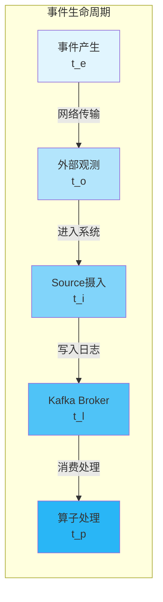
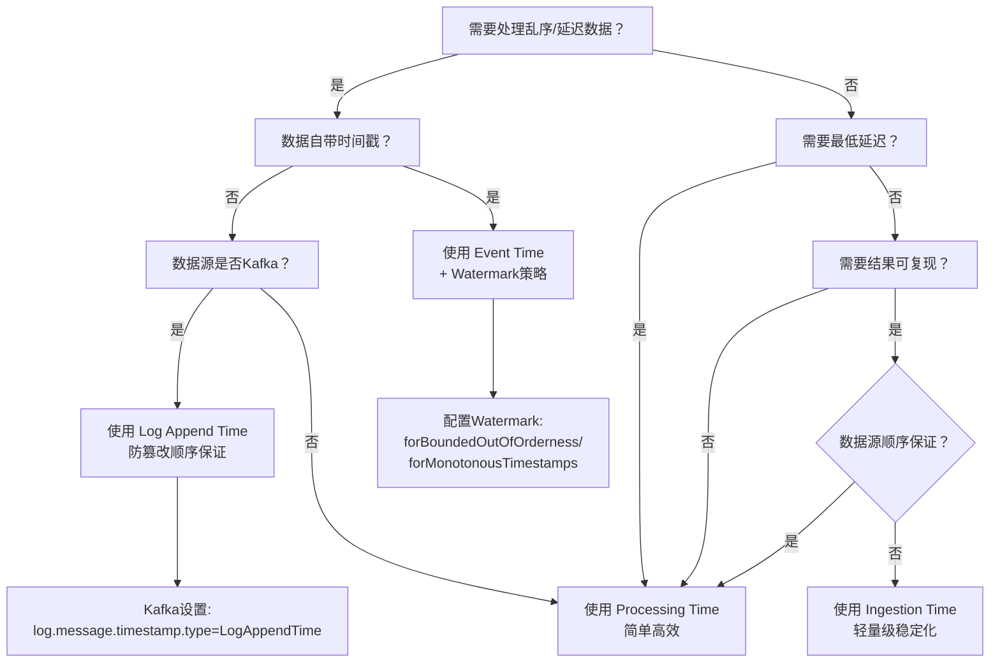
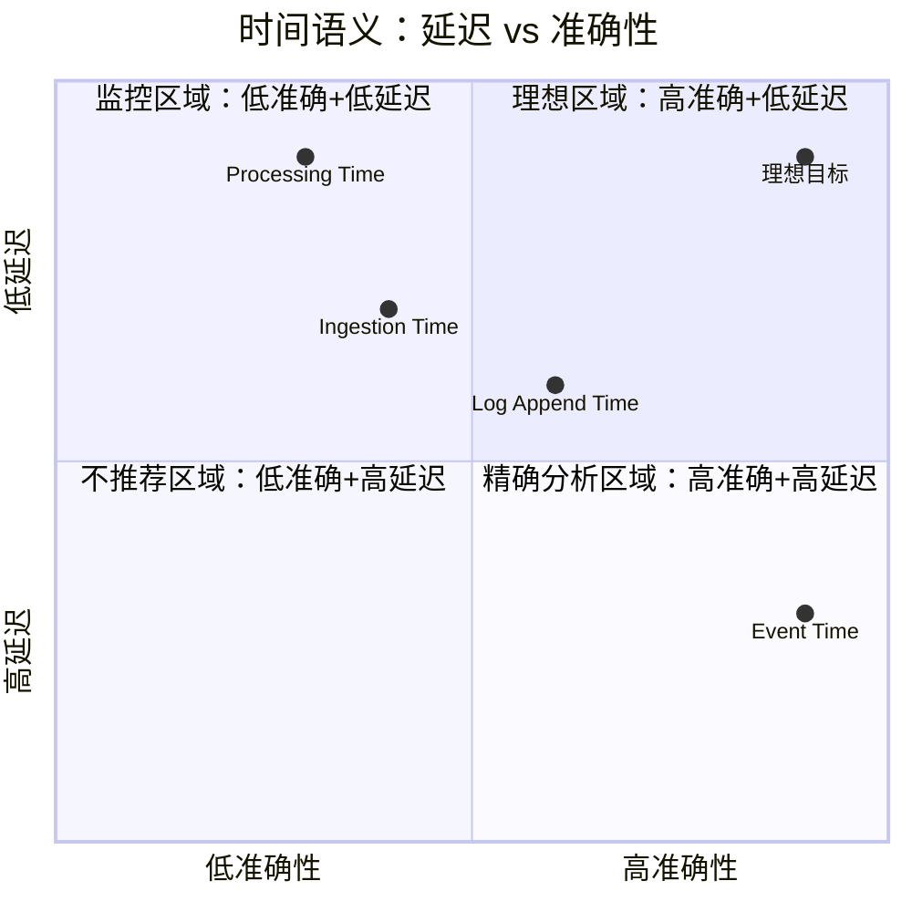

# 流处理时间语义统一术语表

> **所属阶段**: Knowledge/01-concept-atlas/operator-deep-dive | **前置依赖**: [01.02-time-semantics.md](../01.02-time-semantics.md), [01.06-single-input-operators.md](01.06-single-input-operators.md) | **形式化等级**: L3-L4
> **文档定位**: 消除流处理领域五种"时间"概念的混淆，建立严格的形式化边界与选型决策框架
> **版本**: 2026.04

---

## 目录

- [流处理时间语义统一术语表](#流处理时间语义统一术语表)
  - [目录](#目录)
  - [1. 概念定义 (Definitions)](#1-概念定义-definitions)
    - [1.1 五种时间语义的形式化定义](#11-五种时间语义的形式化定义)
    - [1.2 时间戳赋值机制](#12-时间戳赋值机制)
    - [1.3 Watermark 的形式化定义](#13-watermark-的形式化定义)
  - [2. 属性推导 (Properties)](#2-属性推导-properties)
    - [2.1 时间语义间的偏序关系](#21-时间语义间的偏序关系)
    - [2.2 各语义对乱序的处理能力](#22-各语义对乱序的处理能力)
  - [3. 关系建立 (Relations)](#3-关系建立-relations)
    - [3.1 时间语义与算子类型的关联](#31-时间语义与算子类型的关联)
    - [3.2 时间语义与窗口类型的映射](#32-时间语义与窗口类型的映射)
  - [4. 论证过程 (Argumentation)](#4-论证过程-argumentation)
    - [4.1 Processing Time 并非"坏的时间"](#41-processing-time-并非坏的时间)
    - [4.2 Ingestion Time 的"伪事件时间"陷阱](#42-ingestion-time-的伪事件时间陷阱)
    - [4.3 Event Time 的延迟-准确性权衡](#43-event-time-的延迟-准确性权衡)
  - [5. 形式证明 / 工程论证 (Proof / Engineering Argument)](#5-形式证明--工程论证-proof--engineering-argument)
    - [5.1 三种时间语义结果一致性定理](#51-三种时间语义结果一致性定理)
  - [6. 实例验证 (Examples)](#6-实例验证-examples)
    - [6.1 电商实时大屏：三种时间语义对比](#61-电商实时大屏三种时间语义对比)
    - [6.2 日志分析：无事件时间戳时的选择](#62-日志分析无事件时间戳时的选择)
  - [7. 可视化 (Visualizations)](#7-可视化-visualizations)
    - [图 7.1 五种时间语义概念依赖图](#图-71-五种时间语义概念依赖图)
    - [图 7.2 时间语义选型决策树](#图-72-时间语义选型决策树)
    - [图 7.3 时间语义多维对比矩阵](#图-73-时间语义多维对比矩阵)
  - [8. 引用参考 (References)](#8-引用参考-references)

---

## 1. 概念定义 (Definitions)

### 1.1 五种时间语义的形式化定义

**定义 1.1 (事件时间 Event Time)** [Def-K-01-12-01]

事件时间 $t_e$ 是事件在产生端实际发生的时间，通常嵌入在事件负载中：

$$t_e: E \rightarrow \mathbb{T}, \quad t_e(e) = \text{extractTimestamp}(e)$$

其中 $E$ 为事件空间，$\mathbb{T}$ 为时间域，$\text{extractTimestamp}: E \rightarrow \mathbb{T}$ 为时间戳提取函数。

- **来源**: 事件自身携带（如传感器记录时间、用户点击时间）
- **特性**: 与处理速度无关，反映物理现实，支持乱序处理
- **Wikipedia对齐**: "Event time is the time that each individual event occurred on its producing device" — Apache Flink Documentation[^1]

**定义 1.2 (处理时间 Processing Time)** [Def-K-01-12-02]

处理时间 $t_p$ 是事件被算子处理时的本地系统时间：

$$t_p(e, op) = \text{SystemClock}(\text{machine}(op))$$

其中 $op$ 为处理算子，$\text{machine}(op)$ 为算子所在机器。

- **来源**: 算子所在机器的本地系统时钟
- **特性**: 最低延迟、最高吞吐量、无确定性保证
- **Wikipedia对齐**: Processing time refers to "the system time of the machine that is executing the respective operation"[^1]

**定义 1.3 (摄入时间 Ingestion Time)** [Def-K-01-12-03]

摄入时间 $t_i$ 是事件首次进入流处理系统（Source算子）的时间：

$$t_i(e) = \text{SystemClock}(\text{machine}(\text{source}))$$

- **来源**: Source算子所在机器的系统时钟，在数据流入时一次性赋值
- **特性**: 在整个数据流中保持一致（不因下游算子处理速度变化而改变）
- **关键澄清**: Ingestion Time **不是** Event Time 的近似，而是 Processing Time 的稳定化版本

**定义 1.4 (观测时间 Observation Time)** [Def-K-01-12-04]

观测时间 $t_o$ 是事件被外部观测系统（如监控系统、审计系统）记录的时间：

$$t_o(e) = \text{SystemClock}(\text{machine}(\text{observer}))$$

- **来源**: 独立于流处理系统的第三方观测节点
- **特性**: 常用于合规审计、事后追溯，与流处理引擎无关
- **与摄入时间的区别**: 摄入时间是Source算子的时间，观测时间可能是网关、代理或日志收集器的时间

**定义 1.5 (日志追加时间 Log Append Time)** [Def-K-01-12-05]

日志追加时间 $t_l$ 是事件被追加到持久化日志（如Kafka broker）的时间：

$$t_l(e) = \text{SystemClock}(\text{machine}(\text{broker}))$$

- **来源**: 消息队列Broker在写入日志段时的系统时间
- **特性**: Kafka特有概念，由broker端生成，生产者无法伪造
- **使用场景**: 防止生产者篡改时间戳，用于审计和顺序保证

### 1.2 时间戳赋值机制

**定义 1.6 (时间戳赋值函数)** [Def-K-01-12-06]

时间戳赋值函数 $\tau$ 将原始事件映射到带时间戳的事件：

$$\tau: E \rightarrow E \times \mathbb{T}, \quad \tau(e) = (e, t^*(e))$$

其中 $t^*(e)$ 根据时间语义选择：

| 时间语义 | $t^*(e)$ 来源 | 赋值位置 | 赋值时机 |
|---------|-------------|---------|---------|
| Event Time | $e.\text{timestamp}$ | 用户自定义提取器 | 数据到达Source后 |
| Processing Time | $\text{SystemClock}$ | 每个算子本地 | 算子处理该事件时 |
| Ingestion Time | $\text{SystemClock}(\text{source})$ | Source算子 | 数据进入Source时 |
| Observation Time | $\text{SystemClock}(\text{observer})$ | 外部观测系统 | 观测到事件时 |
| Log Append Time | $\text{SystemClock}(\text{broker})$ | Kafka Broker | 写入日志段时 |

### 1.3 Watermark 的形式化定义

**定义 1.7 (Watermark)** [Def-K-01-12-07]

Watermark 是一个特殊的流元素 $w \in W$，携带时间戳 $t_w$ 并断言：

$$\forall e \in S. \; t_e(e) \leq t_w \implies e \text{ 已经到达或不会到达}$$

形式化定义为：

$$W: \mathbb{T} \rightarrow \mathcal{P}(E), \quad W(t) = \{ e \in S \mid t_e(e) \leq t \}$$

Watermark策略 $W_\delta$（允许最大延迟 $\delta$）：

$$W_\delta(t) = \max_{e \in \text{seen}} t_e(e) - \delta$$

**关键澄清**: Watermark **不是**独立的时间类型，而是**处理Event Time的机制**。在Processing Time语义下不需要Watermark；在Ingestion Time语义下Flink自动生成Watermark。

---

## 2. 属性推导 (Properties)

### 2.1 时间语义间的偏序关系

**引理 2.1 (时间语义的不一致性)** [Lemma-K-01-12-01]

对于同一事件 $e$，五种时间语义通常不满足全序关系：

$$t_e(e) \leq t_o(e) \leq t_i(e) \leq t_p(e, op_n)$$

其中 $op_n$ 为第 $n$ 个下游算子。但 $t_l(e)$ 与 $t_i(e)$ 的相对顺序取决于网络拓扑。

*证明*:

1. $t_e(e) \leq t_o(e)$: 事件必须先发生才能被观测
2. $t_o(e) \leq t_i(e)$: 观测通常发生在数据进入流系统之前或同时
3. $t_i(e) \leq t_p(e, op_1)$: 摄入时间是在Source处，处理时间是在算子处
4. $t_p(e, op_k) \leq t_p(e, op_{k+1})$: 下游算子的处理时间不早于上游

$\square$

**引理 2.2 (时间语义的确定性层次)** [Lemma-K-01-12-02]

五种时间语义的**结果可复现性**（Reproducibility）满足：

$$\text{Reproducibility}(t_e) > \text{Reproducibility}(t_l) > \text{Reproducibility}(t_i) > \text{Reproducibility}(t_o) > \text{Reproducibility}(t_p)$$

*证明概要*:

- Event Time基于事件自身属性，重放数据产生相同结果
- Log Append Time由broker控制，重放时可能因broker不同而变化
- Ingestion Time由Source机器时钟决定，重放时可能偏移
- Observation Time依赖外部系统，不可控
- Processing Time依赖处理速度，每次运行结果不同

$\square$

### 2.2 各语义对乱序的处理能力

**命题 2.3 (乱序处理能力谱系)** [Prop-K-01-12-01]

| 时间语义 | 乱序检测能力 | 乱序纠正能力 | 机制 |
|---------|------------|------------|------|
| Event Time | ✅ 完整 | ✅ 完整 | Watermark + allowedLateness + sideOutput |
| Log Append Time | ✅ 完整 | ❌ 无 | 基于broker写入顺序，不纠正仅检测 |
| Ingestion Time | ❌ 无 | ❌ 无 | 自动分配单调递增水印，但不处理真实乱序 |
| Observation Time | ❌ 无 | ❌ 无 | 与流处理引擎无关 |
| Processing Time | ❌ 无 | ❌ 无 | 按到达顺序处理，不区分事件实际顺序 |

---

## 3. 关系建立 (Relations)

### 3.1 时间语义与算子类型的关联

**定义 3.1 (时间语义-算子兼容性矩阵)** [Def-K-01-12-08]

| 算子类型 | Event Time | Processing Time | Ingestion Time |
|---------|-----------|----------------|---------------|
| map/filter/flatMap | ✅ 无关 | ✅ 无关 | ✅ 无关 |
| keyBy | ✅ 支持 | ✅ 支持 | ✅ 支持 |
| reduce/aggregate | ✅ 需Watermark | ✅ 即时触发 | ✅ 自动Watermark |
| window (tumbling/sliding) | ✅ 事件时间窗口 | ✅ 处理时间窗口 | ✅ 事件时间窗口 |
| window (session) | ✅ 事件时间会话 | ✅ 处理时间会话 | ⚠️ 不推荐 |
| ProcessFunction.onTimer | ✅ eventTimeTimer | ✅ processingTimeTimer | ✅ eventTimeTimer |
| CEP Pattern.within() | ✅ 事件时间超时 | ✅ 处理时间超时 | ⚠️ 不推荐 |
| asyncWait | ✅ 支持 | ✅ 支持 | ✅ 支持 |

**关键洞察**:

- **Session Window** 强依赖Event Time。若使用Processing Time，会话边界会因处理速度变化而漂移。
- **CEP Pattern** 在Processing Time下，超时检测基于系统时钟，可能因GC暂停而误判。

### 3.2 时间语义与窗口类型的映射

| 窗口类型 | 推荐时间语义 | 原因 |
|---------|------------|------|
| TumblingEventTimeWindow | Event Time | 精确对齐业务时间边界 |
| TumblingProcessingTimeWindow | Processing Time | 低延迟监控场景 |
| SlidingEventTimeWindow | Event Time | 重叠窗口需精确时间对齐 |
| SlidingProcessingTimeWindow | Processing Time | 滑动监控面板 |
| EventTimeSessionWindows | Event Time | 会话间隙基于事件实际间隔 |
| ProcessingTimeSessionWindows | Processing Time | 仅用于测试或低精度场景 |
| GlobalWindows | Event Time + Trigger | 全局窗口需自定义触发器 |

---

## 4. 论证过程 (Argumentation)

### 4.1 Processing Time 并非"坏的时间"

**常见误解**: "Processing Time不准确，应该总是用Event Time。"

**反驳论证**:

1. **延迟敏感场景**:  fraud detection要求亚秒级响应，Event Time的Watermark等待（通常秒级）不可接受。Processing Time是唯一选择。

2. **完全有序数据**: 若数据源保证顺序（如单分区Kafka + 单调时钟），Processing Time与Event Time等价，且 overhead 更低。

3. **系统指标监控**: "每秒处理多少条"、"算子背压状态"等系统级指标，其语义天然绑定Processing Time。

4. **形式化论证**: 设数据源为单生产者、网络延迟有界且时钟同步，则：
   $$\forall e_i, e_j. \; t_e(e_i) < t_e(e_j) \implies t_p(e_i) < t_p(e_j)$$
   此时Processing Time保持事件序，与Event Time等价。

### 4.2 Ingestion Time 的"伪事件时间"陷阱

**常见误用**: "我的数据没有事件时间戳，所以用Ingestion Time作为Event Time的替代。"

**陷阱分析**:

Ingestion Time在Source处赋值后，在数据流中**保持不变**。但这不等于Event Time：

1. **Source重放时偏移**: 若从Kafka重新消费历史数据，Ingestion Time是当前消费时间，而非原始生产时间。
2. **多Source不一致**: 多个Kafka分区的Source在不同机器上，时钟偏差导致Ingestion Time不连续。
3. **无法处理乱序**: Ingestion Time的Watermark是单调递增的，但这只是**掩盖**了乱序，而非**处理**乱序。

**正确做法**: 若数据无事件时间戳，应显式评估：

- 是否需要时间语义？→ 可能只需要Processing Time
- 是否需要顺序保证？→ 使用Kafka Log Append Time
- 是否需要近似事件时间？→ 在数据源处嵌入时间戳，而非依赖Ingestion Time

### 4.3 Event Time 的延迟-准确性权衡

**定理 4.1 (Event Time 延迟下界)** [Thm-K-01-12-01]

设事件最大乱序延迟为 $\Delta_{max}$，则Event Time窗口的最早触发时间为：

$$T_{trigger} \geq T_{window\_end} + \Delta_{max}$$

*证明*: Watermark $W(t) = \max t_e - \delta$。为保证不遗漏事件，需 $\delta \geq \Delta_{max}$。窗口触发条件是Watermark ≥ 窗口结束时间，即：
$$\max t_e - \delta \geq T_{window\_end}$$
当窗口内最后一个事件到达时，$\max t_e \geq T_{window\_end}$，因此：
$$T_{trigger} = T_{window\_end} + \delta \geq T_{window\_end} + \Delta_{max}$$

$\square$

**工程推论**: Event Time的准确性以延迟为代价。若业务要求窗口结果在窗口结束后立即输出，则必须接受部分 late data 被丢弃或发送至side output。

---

## 5. 形式证明 / 工程论证 (Proof / Engineering Argument)

### 5.1 三种时间语义结果一致性定理

**定理 5.1 (时间语义一致性条件)** [Thm-K-01-12-02]

设数据流 $S$ 满足以下条件：

1. **单源有序**: 所有事件来自单一有序源
2. **网络延迟有界**: $\forall e. \; t_i(e) - t_e(e) \leq \Delta$
3. **时钟同步**: Source与所有处理节点的时钟偏差 $\leq \epsilon$

则对于任意无状态算子 $op$，三种时间语义产生相同的输出序列：

$$\text{Output}(op, S, t_e) = \text{Output}(op, S, t_i) = \text{Output}(op, S, t_p)$$

*证明概要*:

1. 无状态算子（map/filter/flatMap）的输出仅依赖于输入事件值，与时间戳无关
2. 单源有序保证 $t_e$ 与 $t_i$ 与 $t_p$ 保持相同的事件顺序
3. 因此三种语义下事件到达算子的顺序相同，输出序列相同

$\square$

**推论 5.1.1 (一致性失效条件)** [Cor-K-01-12-01]

当以下任一条件破坏时，三种语义结果可能不一致：

- 多源合并（union/join）时各源延迟不同
- 使用有状态时间相关算子（window/session/CEP）
- 事件存在真实乱序

---

## 6. 实例验证 (Examples)

### 6.1 电商实时大屏：三种时间语义对比

**场景**: 统计"过去1分钟"的订单金额总和，刷新到大屏。

| 时间语义 | 行为 | 结果 | 适用性 |
|---------|------|------|--------|
| **Event Time** | 等待Watermark推进到窗口结束+延迟 | 准确反映"业务时间1分钟内"的订单 | ⭐⭐⭐ 推荐 |
| **Processing Time** | 系统时钟每1分钟触发 | 若处理延迟，可能包含"业务时间2分钟前"的订单 | ⭐⭐ 可接受（大屏允许近似） |
| **Ingestion Time** | Source时间每1分钟触发 | 若Kafka重消费，时间完全错乱 | ⭐ 不推荐 |

**Flink代码对比**:

```java
// Event Time（推荐）
stream.assignTimestampsAndWatermarks(
    WatermarkStrategy.<Order>forBoundedOutOfOrderness(Duration.ofSeconds(5))
        .withTimestampAssigner((order, ts) -> order.getOrderTime())
)
.keyBy(Order::getCategory)
.window(TumblingEventTimeWindows.of(Time.minutes(1)))
.aggregate(new SumAggregate());

// Processing Time（低延迟场景）
stream.keyBy(Order::getCategory)
.window(TumblingProcessingTimeWindows.of(Time.minutes(1)))
.aggregate(new SumAggregate());
```

### 6.2 日志分析：无事件时间戳时的选择

**场景**: Nginx日志没有标准事件时间戳字段，只有日志追加顺序。

**决策过程**:

1. 是否需要精确时间窗口？→ 否（仅按天统计PV）
2. 是否需要处理乱序？→ 否（单文件顺序读取）
3. 是否需要重放一致性？→ 是（同一份日志多次分析结果应相同）

**结论**: 使用 **Processing Time** 即可。若需防止因处理速度变化导致窗口漂移，可改用 **Ingestion Time** 作为轻量级稳定化方案。

**不推荐**: 用Ingestion Time假装Event Time。若日后需要精确时间分析，应在日志收集端嵌入时间戳。

---

## 7. 可视化 (Visualizations)

### 图 7.1 五种时间语义概念依赖图

五种时间语义在事件生命周期中的位置：



### 图 7.2 时间语义选型决策树



### 图 7.3 时间语义多维对比矩阵



---

## 8. 引用参考 (References)

[^1]: Apache Flink Documentation, "Event Time / Processing Time / Ingestion Time", <https://nightlies.apache.org/flink/flink-docs-stable/docs/concepts/time/>


---

*关联文档*: [01.02-time-semantics.md](../01.02-time-semantics.md) | [01.06-single-input-operators.md](01.06-single-input-operators.md) | [01.09-window-operators.md](01.09-window-operators.md)
