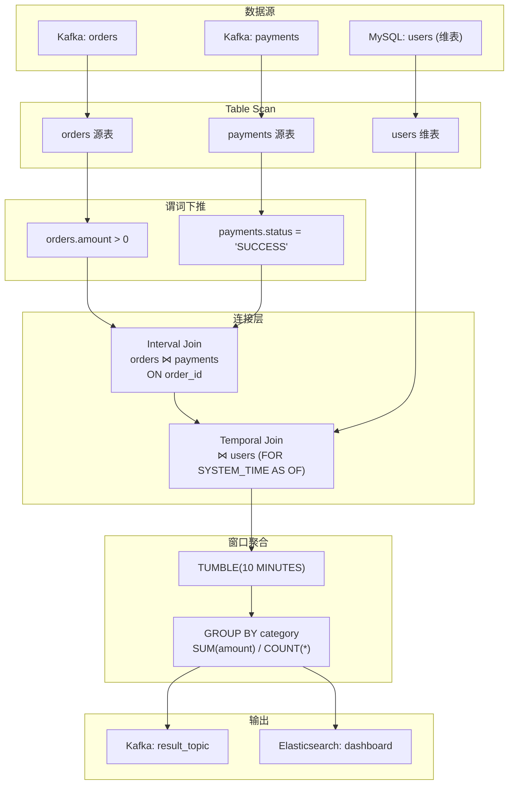
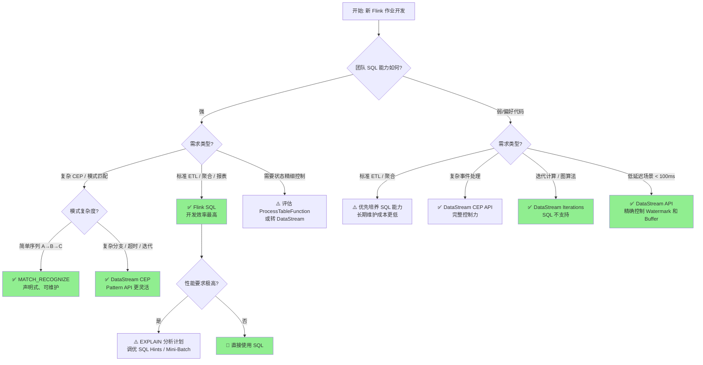

# Flink SQL/Table API 算子层：SQL 算子与 DataStream 算子的完整映射

> **所属阶段**: Knowledge/01-concept-atlas/operator-deep-dive | **前置依赖**: [Flink DataStream 算子体系](../../../Struct/03-relationships/03.05-stream-operator-taxonomy.md), [关系代数与流计算映射](../../../Struct/02-properties/02.06-stream-operator-algebra.md) | **形式化等级**: L4（工程严格定义 + 算子等价映射） | **最后更新**: 2026-04-30

---

## 目录

- [Flink SQL/Table API 算子层：SQL 算子与 DataStream 算子的完整映射](#flink-sqltable-api-算子层sql-算子与-datastream-算子的完整映射)
  - [目录](#目录)
  - [1. 概念定义 (Definitions)](#1-概念定义-definitions)
    - [1.1 关系代数与 SQL 算子的流式语义基础](#11-关系代数与-sql-算子的流式语义基础)
    - [1.2 SQL 算子的形式化定义](#12-sql-算子的形式化定义)
  - [2. 属性推导 (Properties)](#2-属性推导-properties)
  - [3. 关系建立 (Relations)](#3-关系建立-relations)
    - [3.1 SQL 子句 → DataStream 算子映射总表](#31-sql-子句--datastream-算子映射总表)
    - [3.2 SQL 窗口 TVF → DataStream Window Assigner 的精確映射](#32-sql-窗口-tvf--datastream-window-assigner-的精確映射)
  - [4. 论证过程 (Argumentation)](#4-论证过程-argumentation)
    - [4.1 SQL 优化规则与 Calcite 的关系](#41-sql-优化规则与-calcite-的关系)
    - [4.2 SQL 与 DataStream 的能力对比矩阵](#42-sql-与-datastream-的能力对比矩阵)
  - [5. 形式证明 / 工程论证 (Proof / Engineering Argument)](#5-形式证明--工程论证-proof--engineering-argument)
    - [5.1 SQL 窗口聚合与 DataStream 窗口算子的语义等价性定理](#51-sql-窗口聚合与-datastream-窗口算子的语义等价性定理)
    - [5.2 MATCH\_RECOGNIZE 到 CEP NFA 的编译正确性](#52-match_recognize-到-cep-nfa-的编译正确性)
  - [6. 实例验证 (Examples)](#6-实例验证-examples)
    - [6.1 同一业务逻辑的双实现对比：实时订单统计](#61-同一业务逻辑的双实现对比实时订单统计)
    - [6.2 OVER 窗口双实现：实时累计销售额](#62-over-窗口双实现实时累计销售额)
    - [6.3 MATCH\_RECOGNIZE 双实现：价格走势模式检测](#63-match_recognize-双实现价格走势模式检测)
  - [7. 可视化 (Visualizations)](#7-可视化-visualizations)
    - [7.1 SQL → DataStream 算子映射全景图](#71-sql--datastream-算子映射全景图)
    - [7.2 SQL 算子 DAG 示例：多流 Join + 窗口聚合](#72-sql-算子-dag-示例多流-join--窗口聚合)
    - [7.3 SQL vs DataStream 选型决策矩阵](#73-sql-vs-datastream-选型决策矩阵)
  - [8. 引用参考 (References)](#8-引用参考-references)

## 1. 概念定义 (Definitions)

### 1.1 关系代数与 SQL 算子的流式语义基础

**Def-SQL-01-01**（关系代数操作符的流式扩展）：设关系代数操作符集合为 $\mathcal{R} = \{\sigma, \pi, \bowtie, \cup, \cap, -, \gamma, \omega\}$，分别对应选择（Selection）、投影（Projection）、连接（Join）、并（Union）、交（Intersection）、差（Difference）、分组聚合（Group-Aggregation）和窗口聚合（Window-Aggregation）。在流处理上下文中，每个操作符被扩展为**增量式（Incremental）**语义：输入为无限事件流 $S = \langle e_1, e_2, \ldots \rangle$，输出为变更日志流（Changelog Stream）$C = \langle (+,r_1), (-,r_2), \ldots \rangle$，其中 $+$ 表示插入、$-$ 表示撤回、$*$ 表示更新。

**Def-SQL-01-02**（SQL 算子的流处理分类）：Flink SQL 算子按语义可分为四类：

1. **DML 算子**（Data Manipulation Language）：`INSERT`、`UPDATE`、`DELETE` 在流上的语义映射为追加（Append-Only）、撤回-再插入（Retract）和更新（Upsert）三种变更模式；
2. **DQL 算子**（Data Query Language）：`SELECT`、`WHERE`、`GROUP BY`、`HAVING`、`JOIN`、`ORDER BY`、`LIMIT` 对应关系代数到流算子的直接映射；
3. **窗口算子**（Window Operators）：`TUMBLE`、`HOP`、`SESSION`、`CUMULATE` 将无限流切分为有限时间片进行聚合；
4. **模式匹配算子**（Pattern Operators）：`MATCH_RECOGNIZE` 将 SQL:2016 标准的行模式识别映射为 Flink CEP（Complex Event Processing）状态机。

**Def-SQL-01-03**（Changelog 模式定义）：设表 $T$ 在时刻 $t$ 的物化视图为 $M_t(T)$，则 Flink SQL 算子产生的变更流遵循以下三种模式之一：

- **Append-Only 模式**：$\forall t, M_{t+1}(T) = M_t(T) \cup \{r_{new}\}$，仅产生 `+I`（插入）消息；
- **Retract 模式**：$M_{t+1}(T) = (M_t(T) \setminus \{r_{old}\}) \cup \{r_{new}\}$，产生 `-D`（删除）后接 `+I`（插入）消息对；
- **Upsert 模式**：$M_{t+1}(T) = (M_t(T) \setminus \{r_{key}\}) \cup \{r_{new}\}$，通过主键标识更新，产生 `+U`/`-U` 消息。

### 1.2 SQL 算子的形式化定义

**Def-SQL-01-04**（流选择算子 $\sigma^{stream}$）：给定流 $S$ 和谓词 $P$，流选择算子定义为：
$$\sigma^{stream}_P(S) = \{ e \in S \mid P(e) = \text{true} \}$$
输出为 Append-Only 流，当且仅当输入为 Append-Only 流。等价于 DataStream 的 `FilterFunction`。

**Def-SQL-01-05**（流投影算子 $\pi^{stream}$）：给定流 $S$ 和属性子集 $A = \{a_1, \ldots, a_k\}$，流投影算子定义为：
$$\pi^{stream}_A(S) = \{ \pi_A(e) \mid e \in S \}$$
其中 $\pi_A(e)$ 从事件 $e$ 中提取属性集 $A$。等价于 DataStream 的 `MapFunction`。

**Def-SQL-01-06**（流分组聚合算子 $\gamma^{stream}$）：给定流 $S$、分组键集 $G$、聚合函数集 $F = \{f_1, \ldots, f_m\}$，流分组聚合算子定义为：
$$\gamma^{stream}_{G,F}(S) = \{ (g, f_1(S_g), \ldots, f_m(S_g)) \mid g \in \text{dom}(G) \}$$
其中 $S_g = \{ e \in S \mid e.G = g \}$。在无窗口的流式 `GROUP BY` 中，输出为 Retract/Upsert 流；在窗口聚合中，输出为 Append-Only 流。

**Def-SQL-01-07**（流连接算子 $\bowtie^{stream}$）：给定流 $S_L, S_R$ 和连接条件 $\theta$，流连接算子定义为：
$$S_L \bowtie^{stream}_\theta S_R = \{ (l, r) \mid l \in S_L, r \in S_R, \theta(l, r) = \text{true} \}$$
Flink SQL 支持 `Regular Join`、`Interval Join`、`Temporal Join`、`Lookup Join` 四种语义变体，分别对应不同的状态保留策略和输出模式。

**Def-SQL-01-08**（窗口表值函数 TVF）：设时间属性列为 $\tau$，窗口参数为 $\phi$，窗口表值函数 $W$ 将事件流映射为带窗口边界列的扩展流：
$$W(S, \tau, \phi) = \{ (e, w_{start}(e), w_{end}(e), w_{time}(e)) \mid e \in S \}$$
其中 $w_{start}, w_{end}, w_{time}$ 由窗口类型和参数决定。Flink SQL 支持四类 TVF：

- `TUMBLE`：$w_{end} - w_{start} = \text{size}$，窗口间不重叠；
- `HOP`：滑动步长 $\text{slide}$，窗口间重叠率 $= \text{size}/\text{slide}$；
- `SESSION`：动态边界，由间隙阈值 $\text{gap}$ 决定会话起止；
- `CUMULATE`：累积步长 $\text{step}$，窗口右边界递增扩展至 $\text{size}$。

**Def-SQL-01-09**（OVER 窗口算子 $\omega^{stream}$）：给定有序流 $S$（按时间属性 $\tau$ 升序排列），OVER 窗口算子对每行 $e_i$ 计算：
$$\omega^{stream}_{P,O,B}(S, e_i) = f(\{ e_j \in S \mid e_j \in \text{Partition}(P, e_i) \land e_j \in \text{OrderRange}(O, B, e_i) \})$$
其中 $P$ 为 `PARTITION BY` 键，$O$ 为 `ORDER BY` 列，$B$ 为边界定义（`ROWS` 或 `RANGE`）。输出为 Append-Only 流，每输入一行产生一行输出。

**Def-SQL-01-10**（MATCH_RECOGNIZE 模式识别算子）：给定流 $S$、模式变量集 $\mathcal{V} = \{V_1, \ldots, V_n\}$、模式表达式 $\mathcal{P}$（正则式语法）、定义条件 $\mathcal{D}: \mathcal{V} \to \text{Predicate}$，模式识别算子定义为：
$$\mathcal{M}_{\mathcal{V},\mathcal{P},\mathcal{D}}(S) = \{ m \mid m \text{ 是 } S \text{ 的子序列}, m \models \mathcal{P} \land \forall V_i \in \mathcal{V}, \mathcal{D}(V_i)(m_{V_i}) = \text{true} \}$$
Flink 内部将 $\mathcal{M}$ 翻译为 NFA（Non-deterministic Finite Automaton）状态机，通过 Flink CEP 库执行。

---

## 2. 属性推导 (Properties)

**Lemma-SQL-01-01**（SQL `SELECT` 的变更模式保持性）：若输入流为 Append-Only 流，则纯 `SELECT`（无聚合、无连接）查询的输出仍为 Append-Only 流。
*证明*：`SELECT` 仅包含投影和选择操作，两者均为逐行转换（Row-wise Transformation），不改变行的存在性语义。$\square$

**Lemma-SQL-01-02**（窗口聚合的 Append-Only 保证）：基于 `TUMBLE`/`HOP`/`SESSION`/`CUMULATE` TVF 的窗口聚合，其输出始终为 Append-Only 流。
*证明*：窗口 TVF 将无限流切分为有限时间片，每个窗口在 Watermark 越过窗口终点后触发一次计算并输出单一结果行。窗口状态随后被清理，不存在后续更新。$\square$

**Lemma-SQL-01-03**（无窗口 `GROUP BY` 的 Retract 必然性）：在无窗口的流式 `GROUP BY` 聚合中，若分组键域 $\text{dom}(G)$ 无限且输入流持续到达，则输出必然为 Retract 或 Upsert 流。
*证明*：聚合函数（如 `SUM`、`COUNT`）的值随新事件到达而变化。设分组键 $g$ 在时刻 $t$ 的聚合值为 $v_t$，新事件 $e_{t+1}$ 到达后值为 $v_{t+1} \neq v_t$。为保持结果一致性，必须发出 `-D(v_t)` 和 `+I(v_{t+1})`（Retract 模式）或 `+U(v_{t+1})`（Upsert 模式）。$\square$

**Lemma-SQL-01-04**（OVER 窗口的逐行输出保持性）：OVER 窗口聚合不减少输出行数，即 $|\omega^{stream}(S)| = |S|$。
*证明*：OVER 算子为每行 $e_i$ 计算一个聚合值并将其附加为新增列，不执行分组折叠。因此输出流与输入流一一对应。$\square$

**Lemma-SQL-01-05**（MATCH_RECOGNIZE 的 Append-Only 约束）：`MATCH_RECOGNIZE` 算子仅接受 Append-Only 输入流，且输出也为 Append-Only 流。
*证明*：Flink CEP 库的状态机假设事件按时间单调递增到达，撤回或更新会破坏 NFA 状态的一致性。输出为检测到的新模式匹配，天然为追加语义。$\square$

**Prop-SQL-01-01**（SQL 算子与 DataStream 算子的局部等价性）：对于任意不含连接和子查询的单表 SQL 查询 $Q$，存在 DataStream 算子组合 $\mathcal{O}$ 使得 $Q$ 的语义与 $\mathcal{O}$ 等价。
*推导*：SQL 的 `SELECT`/`WHERE` 对应 `Map` + `Filter`；`GROUP BY` + 窗口对应 `KeyedProcessFunction` + 窗口状态；`OVER` 对应 `KeyedProcessFunction` + 队列状态；这些均为 DataStream API 的一阶可表达组合。$\square$

---

## 3. 关系建立 (Relations)

### 3.1 SQL 子句 → DataStream 算子映射总表

下表建立 Flink SQL 中每个核心子句与 DataStream API 算子的完整映射关系：

| SQL 子句 / 表达式 | DataStream 等价算子组合 | 状态需求 | 输出模式 | 备注 |
|:---|:---|:---|:---|:---|
| `SELECT a, b` | `map(new MapFunction<>())` | 无状态 | Append-Only | 投影 = 字段提取 + 可能类型转换 |
| `WHERE predicate` | `filter(new FilterFunction<>())` | 无状态 | 保持输入模式 | 选择 = 逐行谓词判断 |
| `SELECT expr(a)` | `map(new ScalarUDF())` | 无状态 | Append-Only | 标量函数映射 |
| `GROUP BY key` (无窗口) | `keyBy(key).process(new KeyedProcessFunction)` | 每个 key 一个 ValueState | Retract/Upsert | 持续维护聚合值 |
| `GROUP BY key + TUMBLE` | `keyBy(key).window(TumblingEventTimeWindows).aggregate()` | 每个窗口一个 ListState/Accumulator | Append-Only | Watermark 触发后清理 |
| `GROUP BY key + HOP` | `keyBy(key).window(SlidingEventTimeWindows).aggregate()` | 每个 key 同时维护 `size/slide` 个窗口状态 | Append-Only | 重叠窗口共享底层事件 |
| `GROUP BY key + SESSION` | `keyBy(key).window(EventTimeSessionWindows).aggregate()` | 每个活跃会话一个窗口状态 | Append-Only | 会话合并（Merge）需要特殊处理 |
| `GROUP BY key + CUMULATE` | `keyBy(key).window(new CumulativeWindowAssigner).aggregate()` | 累积步数个窗口状态 | Append-Only | 窗口内逐步扩展 |
| `OVER (PARTITION BY ... ORDER BY ... ROWS/RANGE)` | `keyBy(partitionKey).process(new KeyedProcessFunction)` + 内部队列/MapState | 时间范围内所有行或固定行数 | Append-Only | 当前限制：同 SELECT 中所有 OVER 窗口必须相同 |
| `JOIN` (Regular) | `join(otherStream).where(...).equalTo(...).window(...)` 或 `coGroup` | 左右流全量状态（或 TTL） | Retract/Upsert | 流-流连接需保留历史记录 |
| `JOIN` (Interval) | `keyBy(...).intervalJoin(...).between(...)` | 时间区间内匹配记录 | Append-Only | 更高效的流-流连接 |
| `JOIN` (Temporal) | `keyBy(...).process(new KeyedProcessFunction)` + 维表异步查询 | 维表缓存（LookupCache） | Append-Only | 右侧为版本化维表 |
| `JOIN` (Lookup) | 通过 `LookupTableSource` 异步 IO 查询 | 连接器层面的缓存 | Append-Only | 每次左流事件触发一次查询 |
| `ORDER BY` (流) | `keyBy(...).process(new KeyedProcessFunction)` + 排序缓冲区 | 时间范围内的排序缓冲区 | Append-Only | 仅支持 `ORDER BY time_attr` 后接 `LIMIT` |
| `LIMIT` / `FETCH` | 结合排序缓冲区取 Top-N | 排序缓冲区 + 计数 | Append-Only | 常与 `ORDER BY` 联用 |
| `MATCH_RECOGNIZE` | `CEP.pattern(input, pattern).process(new PatternProcessFunction())` | NFA 状态机 + 部分匹配缓冲区 | Append-Only | 内部翻译为 Flink CEP |
| `DISTINCT` | `keyBy(...).process(...)` + `ValueState<Boolean>` 去重 | 每个 key 一个布尔状态 | Retract/Upsert | 无窗口去重状态持续增长 |
| `UNION ALL` | `DataStream.union(otherStream)` | 无状态 | 保持输入模式 | 多流合并 |
| `INSERT INTO` | `addSink(new TableSink())` | 取决于 Sink | 取决于 Sink | 表连接器写入 |

### 3.2 SQL 窗口 TVF → DataStream Window Assigner 的精確映射

**Prop-SQL-01-02**（TUMBLE ↔ TumblingEventTimeWindows 的同构性）：Flink SQL 的 `TUMBLE(TABLE data, DESCRIPTOR(timecol), size)` 与 DataStream API 的 `TumblingEventTimeWindows.of(size)` 在事件时间语义下完全同构。
*说明*：两者均将事件时间轴划分为 $[n \cdot \text{size}, (n+1) \cdot \text{size})$ 的左闭右开区间，每条事件仅属于一个窗口，窗口触发条件均为 Watermark $\geq$ 窗口终点。$\square$

**Prop-SQL-01-03**（HOP ↔ SlidingEventTimeWindows 的同构性）：`HOP(TABLE data, DESCRIPTOR(timecol), slide, size)` 与 `SlidingEventTimeWindows.of(size, slide)` 完全同构。
*说明*：HOP 窗口的 `window_start` 序列满足 $w_i = i \cdot \text{slide}$，每条事件属于 $\lceil \text{size}/\text{slide} \rceil$ 个窗口。DataStream 的 `SlidingEventTimeWindows` 使用相同的分配策略。$\square$

**Prop-SQL-01-04**（SESSION ↔ EventTimeSessionWindows 的同构性）：`SESSION(TABLE data PARTITION BY key, DESCRIPTOR(timecol), gap)` 与 `EventTimeSessionWindows.withDynamicGap(...)` 在键控分区下同构。
*说明*：两者均基于事件间间隙 $\text{gap}$ 动态定义会话边界，支持会话合并（Gap 范围内的会话合并为一个）。SQL 的 `PARTITION BY` 对应 DataStream 的 `keyBy`。$\square$

**Prop-SQL-01-05**（CUMULATE 的 DataStream 等效实现）：`CUMULATE(TABLE data, DESCRIPTOR(timecol), step, size)` 在 DataStream 中等价于：先按 `size` 切分 Tumbling 窗口，再在窗口内按 `step` 增量触发多次聚合。
*说明*：CUMULATE 的语义是在每个基础滚动窗口内部，从起点开始按 `step` 逐步扩展右边界并输出中间结果。DataStream 中可通过自定义 `WindowAssigner` 或 `ProcessFunction` 实现相同语义。$\square$

---

## 4. 论证过程 (Argumentation)

### 4.1 SQL 优化规则与 Calcite 的关系

Flink SQL 的查询优化器基于 Apache Calcite 构建，采用 Volcano/Cascades 框架实现规则驱动（Rule-Based）与代价驱动（Cost-Based）的混合优化。Flink 在 Calcite 基础上扩展了流处理特有的优化规则集。

**Def-SQL-01-11**（Flink SQL 优化规则分类）：设优化规则集为 $\mathcal{R}_{Flink} = \mathcal{R}_{logical} \cup \mathcal{R}_{physical} \cup \mathcal{R}_{stream}$，其中：

- $\mathcal{R}_{logical}$：逻辑优化规则（继承自 Calcite），包括谓词下推、投影裁剪、常量折叠、子查询解相关等；
- $\mathcal{R}_{physical}$：物理优化规则，包括 Join 算法选择（Hash Join / Sort-Merge Join / Nested-Loop Join）、聚合两阶段优化（Local-Global）等；
- $\mathcal{R}_{stream}$：流处理特有规则，包括 Mini-Batch 聚合、Watermark 推断、Retract 传播优化等。

**核心优化规则详述**：

| 优化规则 | 作用描述 | 流处理影响 |
|:---|:---|:---|
| **谓词下推（Predicate Pushdown）** | 将 `WHERE` 条件尽可能下推至数据源扫描或早期算子，减少中间数据量 | 显著降低状态规模和网络传输 |
| **投影裁剪（Projection Pruning）** | 仅保留查询实际使用的列，丢弃未引用字段 | 减少序列化/反序列化开销 |
| **Join 重排序（Join Reordering）** | 基于统计信息和代价模型调整多表连接顺序 | 降低中间结果集大小，减少状态压力 |
| **子查询解相关（Subquery Decorrelation）** | 将相关子查询 `EXISTS`/`IN` 转为 Semi-Join，`NOT EXISTS`/`NOT IN` 转为 Anti-Join | 避免重复执行子查询，提升流处理吞吐量 |
| **聚合下推（Aggregate Pushdown）** | 将聚合操作尽可能推向数据源（如支持聚合下推的连接器） | 减少跨网络传输的原始数据量 |
| **Local-Global 聚合优化** | 将单节点聚合拆分为本地预聚合（Local）和全局合并（Global）两阶段 | 显著减少 Shuffle 数据量和状态大小 |
| **Mini-Batch 聚合** | 在微批时间间隔内缓冲输入，批量触发聚合计算 | 降低状态访问频率，提升吞吐 |
| **Watermark 推断与传播** | 自动推导并传播时间属性和 Watermark 策略 | 确保窗口算子的正确触发时机 |
| **Filter 条件下推至 Source** | 将可下推的过滤条件直接交给源连接器（如 Kafka 的 partition 过滤） | 减少从外部系统读取的数据量 |

### 4.2 SQL 与 DataStream 的能力对比矩阵

下表从表达能力、性能控制、开发效率三个维度对比 Flink SQL/Table API 与 DataStream API：

| 能力维度 | Flink SQL/Table API | DataStream API | 说明 |
|:---|:---|:---|:---|
| **声明式查询** | ✅ 原生支持标准 SQL | ❌ 需手写算子组合 | SQL 更适合分析师/BI 场景 |
| **复杂事件处理（CEP）** | ✅ `MATCH_RECOGNIZE`（子集） | ✅ 完整 Pattern API | SQL CEP 更易读但表达能力受限 |
| **精确时间控制** | ⚠️ 通过时间属性和 TVF 间接控制 | ✅ 直接操作 Watermark/Timer | DataStream 对 Latency 更可控 |
| **状态访问粒度** | ❌ 不可直接访问 | ✅ `ValueState`/`ListState`/`MapState` | DataStream 可自定义状态结构 |
| **异步 IO** | ✅ `Lookup Join` | ✅ `AsyncFunction` | 两者均支持异步外部查询 |
| **迭代计算（Iterations）** | ❌ 不支持 | ✅ `IterativeStream` | DataStream 支持图迭代算法 |
| **UDF/UDAF/UDTF** | ✅ 支持 | ✅ 支持 | Table API UDF 需额外类型转换 |
| **SQL 优化器自动优化** | ✅ Calcite 自动应用数百条规则 | ❌ 需手动优化算子链 | SQL 在简单查询上性能更优 |
| **逐行处理逻辑** | ⚠️ 通过 `ProcessTableFunction` 有限支持 | ✅ `ProcessFunction` 完全控制 | DataStream 适合复杂逐行逻辑 |
| **Exactly-Once 语义** | ✅ 自动保障 | ✅ 手动配置 Checkpoint | SQL 层自动集成容错 |
| **动态扩缩容** | ✅ 自动适配并行度 | ⚠️ 需手动调整 | SQL 作业更容易弹性伸缩 |
| **复杂类型处理** | ⚠️ 有限支持（`RAW` 类型绕过） | ✅ 完整泛型支持 | DataStream 对嵌套类型更友好 |
| **调试与可观测性** | ⚠️ 依赖 EXPLAIN 和 Plan | ✅ 算子粒度 Metrics | DataStream Web UI 更直观 |
| **批量 + 流统一** | ✅ 同一 SQL 支持 Batch/Streaming | ❌ 流批 API 分离 | Flink SQL 的流批一体优势 |

---

## 5. 形式证明 / 工程论证 (Proof / Engineering Argument)

### 5.1 SQL 窗口聚合与 DataStream 窗口算子的语义等价性定理

**Thm-SQL-01-01**（TUMBLE 窗口语义等价性）：设事件流 $S$ 的事件时间属性为 $\tau(e)$，`TUMBLE(TABLE S, DESCRIPTOR(τ), size)` 的语义等价于 DataStream API 的 `S.keyBy(...).window(TumblingEventTimeWindows.of(size)).aggregate(agg)`。

*证明框架*：

1. **窗口分配等价性**：对任意事件 $e \in S$，TUMBLE TVF 分配的窗口起点为 $w_{start}(e) = \lfloor \tau(e) / \text{size} \rfloor \cdot \text{size}$，终点为 $w_{end}(e) = w_{start}(e) + \text{size}$。DataStream 的 `TumblingEventTimeWindows.assignWindows(e)` 使用完全相同的计算公式。
2. **触发条件等价性**：两者均在 Watermark $\geq w_{end}$ 时触发窗口计算。Flink SQL TVF 底层通过 `WindowOperator` 实现，其触发逻辑与 DataStream `WindowOperator` 共享同一触发器框架。
3. **状态清理等价性**：窗口触发后，两者均调用 `clear()` 释放该窗口的 `ListState` 或 `AppendingState`，状态生命周期一致。
4. **输出语义等价性**：两者均对窗口内事件集合 $W = \{ e \in S \mid w_{start}(e) = w_{start} \}$ 应用聚合函数 $agg$，输出单一结果行。由于窗口分配、触发、聚合逻辑完全一致，输出流等价。$\square$

**Thm-SQL-01-02**（OVER ROWS 与 KeyedProcessFunction 状态队列的等价性）：设 `SUM(amount) OVER (PARTITION BY product ORDER BY order_time ROWS BETWEEN n PRECEDING AND CURRENT ROW)` 的语义等价于 DataStream 中维护长度为 $n+1$ 的 `ListState` 队列并逐行输出累加值的 KeyedProcessFunction。

*证明框架*：

1. **分区等价性**：SQL 的 `PARTITION BY product` 等价于 DataStream 的 `keyBy(product)`，确保同 `product` 的事件路由至同一算子实例。
2. **排序等价性**：SQL 的 `ORDER BY order_time` 与 DataStream 的事件时间排序一致（假设 Watermark 正确配置），保证队列内事件按时间序排列。
3. **边界计算等价性**：`ROWS BETWEEN n PRECEDING AND CURRENT ROW` 定义了以当前行为终点的固定长度 $n+1$ 行窗口。DataStream 的 `KeyedProcessFunction` 使用 `ListState` 维护最近 $n+1$ 行，新事件到达时加入队尾、移除队首（若长度超限），计算队列内 `amount` 之和。
4. **输出等价性**：两者均为每输入行产生一行输出，输出值为对应窗口内聚合值，因此输出流完全一致。$\square$

### 5.2 MATCH_RECOGNIZE 到 CEP NFA 的编译正确性

**Thm-SQL-01-03**（MATCH_RECOGNIZE 到 Flink CEP 的编译正确性）：任意符合 Flink 支持子集的 `MATCH_RECOGNIZE` 查询 $Q$ 可被编译为等价的 Flink CEP Pattern 程序 $P$，使得 $Q$ 的输出流与 $P$ 的输出流相同。

*证明框架*：

1. **模式变量映射**：SQL 的 `DEFINE` 子句将每个模式变量 $V_i$ 映射为布尔条件 $\mathcal{D}(V_i)$，等价于 CEP Pattern 的 `where(condition)` 方法。
2. **正则式映射**：SQL 的 `PATTERN` 子句使用正则式语法（连接、量词 `*`/`+`/`?`/`{n,m}`），CEP Pattern API 提供完全对应的 `next()`、`followedBy()`、`times(n,m)` 等构造子。
3. **时间约束映射**：SQL 的非标准扩展 `WITHIN INTERVAL` 映射为 CEP 的 `within(Time)` 方法，限制匹配的时间跨度。
4. **分区与排序映射**：SQL 的 `PARTITION BY` 映射为 CEP 之前的 `keyBy` 操作，`ORDER BY time_attr` 映射为 CEP 对事件时间排序的假设。
5. **输出映射**：SQL 的 `MEASURES` 子句映射为 CEP `PatternProcessFunction` 中的结果提取逻辑。
由于 Flink SQL Planner 在优化阶段调用 `MatchRecognize` 到 `DataStreamCEP` 的翻译规则（`MatchRecognizeTranslateRule`），上述映射由编译器自动保证正确性。$\square$

---

## 6. 实例验证 (Examples)

### 6.1 同一业务逻辑的双实现对比：实时订单统计

**业务需求**：按商品类别统计每 5 分钟内的订单总金额和订单数。

**Flink SQL 实现**：

```sql
-- 定义源表
CREATE TABLE orders (
    order_id STRING,
    category STRING,
    amount DECIMAL(10, 2),
    order_time TIMESTAMP(3),
    WATERMARK FOR order_time AS order_time - INTERVAL '5' SECOND
) WITH (
    'connector' = 'kafka',
    'topic' = 'orders',
    'format' = 'json'
);

-- 滚动窗口聚合
SELECT
    window_start,
    window_end,
    category,
    COUNT(*) AS order_count,
    SUM(amount) AS total_amount
FROM TABLE(
    TUMBLE(TABLE orders, DESCRIPTOR(order_time), INTERVAL '5' MINUTES)
)
GROUP BY window_start, window_end, category;
```

**DataStream API 实现**：

```java
StreamExecutionEnvironment env = StreamExecutionEnvironment.getExecutionEnvironment();
env.setStreamTimeCharacteristic(TimeCharacteristic.EventTime);

DataStream<Order> orders = env
    .addSource(new FlinkKafkaConsumer<>("orders", new OrderSchema(), properties))
    .assignTimestampsAndWatermarks(
        WatermarkStrategy.<Order>forBoundedOutOfOrderness(Duration.ofSeconds(5))
            .withIdleness(Duration.ofMinutes(1))
    );

DataStream<Result> result = orders
    .keyBy(order -> order.category)
    .window(TumblingEventTimeWindows.of(Time.minutes(5)))
    .aggregate(new OrderAggregateFunction());

result.addSink(new FlinkKafkaSink<>("result", new ResultSchema(), properties));
env.execute("OrderStats");

// 聚合函数定义
public static class OrderAggregateFunction
    implements AggregateFunction<Order, OrderAcc, Result> {

    @Override
    public OrderAcc createAccumulator() {
        return new OrderAcc(0, BigDecimal.ZERO);
    }

    @Override
    public OrderAcc add(Order value, OrderAcc accumulator) {
        accumulator.count++;
        accumulator.sum = accumulator.sum.add(value.amount);
        return accumulator;
    }

    @Override
    public Result getResult(OrderAcc accumulator) {
        return new Result(accumulator.count, accumulator.sum);
    }

    @Override
    public OrderAcc merge(OrderAcc a, OrderAcc b) {
        a.count += b.count;
        a.sum = a.sum.add(b.sum);
        return a;
    }
}
```

**对比分析**：

- SQL 版本 8 行核心逻辑，DataStream 版本约 40 行（含聚合函数定义）；
- SQL 由 Calcite 自动应用 Local-Global 优化和 Mini-Batch 优化，DataStream 需手动实现两阶段聚合；
- SQL 自动处理 Watermark 传播和类型系统，DataStream 需显式配置；
- DataStream 版本对 `AggregateFunction` 的内存布局和序列化有完全控制权。

### 6.2 OVER 窗口双实现：实时累计销售额

**业务需求**：计算每个客户最近 1 小时内的累计消费金额（每来一条订单输出当前累计值）。

**Flink SQL 实现**：

```sql
SELECT
    order_id,
    customer_id,
    amount,
    SUM(amount) OVER (
        PARTITION BY customer_id
        ORDER BY order_time
        RANGE BETWEEN INTERVAL '1' HOUR PRECEDING AND CURRENT ROW
    ) AS hour_running_total
FROM orders;
```

**DataStream API 实现**：

```java
DataStream<Order> orders = /* ... 源定义同前 ... */;

DataStream<Result> result = orders
    .keyBy(order -> order.customerId)
    .process(new KeyedProcessFunction<String, Order, Result>() {

        private MapState<Long, BigDecimal> state; // timestamp -> amount
        private ValueState<BigDecimal> sumState;

        @Override
        public void open(Configuration parameters) {
            StateTtlConfig ttlConfig = StateTtlConfig
                .newBuilder(Time.hours(1))
                .setUpdateType(StateTtlConfig.UpdateType.OnCreateAndWrite)
                .setStateVisibility(StateTtlConfig.StateVisibility.ReturnExpiredIfNotCleanedUp)
                .build();

            MapStateDescriptor<Long, BigDecimal> mapDescriptor =
                new MapStateDescriptor<>("events", Types.LONG, Types.BIG_DEC);
            mapDescriptor.enableTimeToLive(ttlConfig);
            state = getRuntimeContext().getMapState(mapDescriptor);

            ValueStateDescriptor<BigDecimal> sumDescriptor =
                new ValueStateDescriptor<>("sum", Types.BIG_DEC);
            sumDescriptor.enableTimeToLive(ttlConfig);
            sumState = getRuntimeContext().getState(sumDescriptor);
        }

        @Override
        public void processElement(Order order, Context ctx, Collector<Result> out)
                throws Exception {
            long timestamp = ctx.timestamp();
            long windowStart = timestamp - 3600_000; // 1 hour ago

            // 清理过期状态（也可依赖 TTL）
            Iterator<Map.Entry<Long, BigDecimal>> iter = state.iterator();
            while (iter.hasNext()) {
                Map.Entry<Long, BigDecimal> entry = iter.next();
                if (entry.getKey() < windowStart) {
                    BigDecimal currentSum = sumState.value() != null ? sumState.value() : BigDecimal.ZERO;
                    sumState.update(currentSum.subtract(entry.getValue()));
                    iter.remove();
                }
            }

            // 加入新事件
            state.put(timestamp, order.amount);
            BigDecimal currentSum = sumState.value() != null ? sumState.value() : BigDecimal.ZERO;
            currentSum = currentSum.add(order.amount);
            sumState.update(currentSum);

            out.collect(new Result(order.orderId, order.customerId, currentSum));
        }
    });
```

**对比分析**：

- SQL 版本 1 个 OVER 子句完成，DataStream 版本需手动维护 `MapState` + `ValueState` 和过期清理逻辑；
- SQL 由优化器自动处理状态 TTL（通过 `table.exec.state.ttl`），DataStream 需显式配置 `StateTtlConfig`；
- DataStream 版本可自定义过期清理策略（如惰性清理 vs 定时清理），SQL 版本依赖统一配置。

### 6.3 MATCH_RECOGNIZE 双实现：价格走势模式检测

**业务需求**：检测股票价格"先连续下跌后反弹"的模式（V 型底部）。

**Flink SQL 实现**：

```sql
SELECT *
FROM stock_prices
MATCH_RECOGNIZE (
    PARTITION BY symbol
    ORDER BY rowtime
    MEASURES
        START_ROW.rowtime AS start_tstamp,
        LAST(PRICE_DOWN.rowtime) AS bottom_tstamp,
        LAST(PRICE_UP.rowtime) AS end_tstamp,
        START_ROW.price AS start_price,
        LAST(PRICE_DOWN.price) AS bottom_price,
        LAST(PRICE_UP.price) AS end_price
    ONE ROW PER MATCH
    AFTER MATCH SKIP TO LAST PRICE_UP
    PATTERN (START_ROW PRICE_DOWN+ PRICE_UP)
    DEFINE
        PRICE_DOWN AS (
            LAST(PRICE_DOWN.price, 1) IS NULL
            AND PRICE_DOWN.price < START_ROW.price
        ) OR (PRICE_DOWN.price < LAST(PRICE_DOWN.price, 1)),
        PRICE_UP AS PRICE_UP.price > LAST(PRICE_DOWN.price, 1)
) MR;
```

**DataStream API（Flink CEP）实现**：

```java
Pattern<StockPrice, ?> pattern = Pattern.<StockPrice>begin("start")
    .where(new SimpleCondition<StockPrice>() {
        @Override
        public boolean filter(StockPrice price) {
            return price.price > 0; // START_ROW 条件恒真
        }
    })
    .next("down")
    .where(new IterativeCondition<StockPrice>() {
        private double lastDownPrice = Double.MAX_VALUE;
        private double startPrice;
        private boolean initialized = false;

        @Override
        public boolean filter(StockPrice price, Context<StockPrice> ctx) {
            if (!initialized) {
                // 获取 start 的价格
                for (StockPrice start : ctx.getEventsForPattern("start")) {
                    startPrice = start.price;
                }
                initialized = true;
            }
            boolean isDown = price.price < Math.min(startPrice, lastDownPrice);
            if (isDown) lastDownPrice = price.price;
            return isDown;
        }
    })
    .oneOrMore()
    .next("up")
    .where(new IterativeCondition<StockPrice>() {
        @Override
        public boolean filter(StockPrice price, Context<StockPrice> ctx) {
            double lastDown = Double.MAX_VALUE;
            for (StockPrice down : ctx.getEventsForPattern("down")) {
                lastDown = Math.min(lastDown, down.price);
            }
            return price.price > lastDown;
        }
    })
    .within(Time.minutes(30));

PatternStream<StockPrice> patternStream = CEP.pattern(
    stockPrices.keyBy(p -> p.symbol),
    pattern
);

DataStream<VShapeResult> result = patternStream.process(
    new PatternProcessFunction<StockPrice, VShapeResult>() {
        @Override
        public void processMatch(
                Map<String, List<StockPrice>> match,
                Context ctx,
                Collector<VShapeResult> out) {
            StockPrice start = match.get("start").get(0);
            List<StockPrice> downs = match.get("down");
            StockPrice up = match.get("up").get(0);

            out.collect(new VShapeResult(
                start.symbol,
                start.rowtime,
                downs.get(downs.size() - 1).rowtime,
                up.rowtime,
                start.price,
                downs.get(downs.size() - 1).price,
                up.price
            ));
        }
    }
);
```

**对比分析**：

- SQL 版本声明式表达模式结构，可读性远高于 CEP API；
- CEP API 提供更灵活的条件访问（`ctx.getEventsForPattern` 可遍历历史匹配事件），SQL 的 `DEFINE` 仅支持标准导航函数（`FIRST`/`LAST`）；
- SQL 版本由 Planner 自动优化状态布局，CEP API 需手动关注 `within` 时间约束以防止状态无限增长。

---

## 7. 可视化 (Visualizations)

### 7.1 SQL → DataStream 算子映射全景图

以下思维导图展示 Flink SQL 核心算子到 DataStream API 的完整映射层次：

```mermaid
graph TB
    subgraph SQL_Layer["Flink SQL / Table API 层"]
        DQL["DQL 查询层"]
        DML["DML 变更层"]
        WIN["窗口 TVF 层"]
        OVER["OVER 聚合层"]
        CEP["MATCH_RECOGNIZE 层"]
        OPT["Calcite 优化层"]
    end

    subgraph DS_Layer["DataStream API 层"]
        BASIC["基础转换算子"]
        KEYED["Keyed 算子"]
        WIN_DS["窗口算子"]
        PROCESS["ProcessFunction"]
        CEP_DS["CEP Pattern API"]
        CONNECT["连接器层"]
    end

    DQL -->|"SELECT/WHERE"| BASIC
    DQL -->|"GROUP BY"| KEYED
    DQL -->|"JOIN"| KEYED
    DQL -->|"ORDER BY LIMIT"| PROCESS

    DML -->|"INSERT"| CONNECT
    DML -->|"UPDATE/DELETE"| KEYED

    WIN -->|"TUMBLE"| WIN_DS
    WIN -->|"HOP"| WIN_DS
    WIN -->|"SESSION"| WIN_DS
    WIN -->|"CUMULATE"| WIN_DS

    OVER -->|"ROWS/RANGE"| PROCESS

    CEP -->|"PATTERN/DEFINE"| CEP_DS

    OPT -->|"优化后计划"| DS_Layer

    BASIC --> MAP["map()"]
    BASIC --> FILTER["filter()"]
    BASIC --> FLATMAP["flatMap()"]

    KEYED --> KEYBY["keyBy()"]
    KEYED --> REDUCE["reduce()"]
    KEYED --> AGG["aggregate()"]

    WIN_DS --> TUMBLE_DS["TumblingWindow"]
    WIN_DS --> SLIDING_DS["SlidingWindow"]
    WIN_DS --> SESSION_DS["SessionWindow"]

    PROCESS --> KPF["KeyedProcessFunction"]
    PROCESS --> PF["ProcessFunction"]
    PROCESS --> ASF["AsyncFunction"]

    CEP_DS --> PATTERN["Pattern<T>"]
    CEP_DS --> PPF["PatternProcessFunction"]
```



### 7.2 SQL 算子 DAG 示例：多流 Join + 窗口聚合

以下流程图展示一个典型实时数仓查询的算子 DAG：



### 7.3 SQL vs DataStream 选型决策矩阵

以下决策树帮助在不同场景下选择 SQL 或 DataStream API：



---

## 8. 引用参考 (References)
