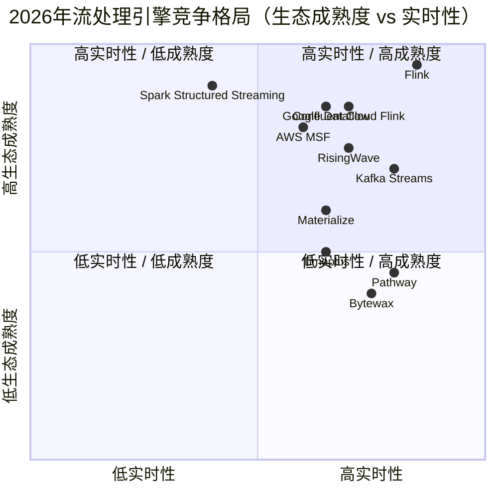
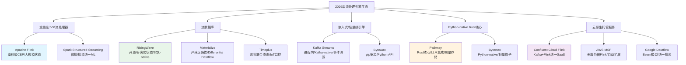
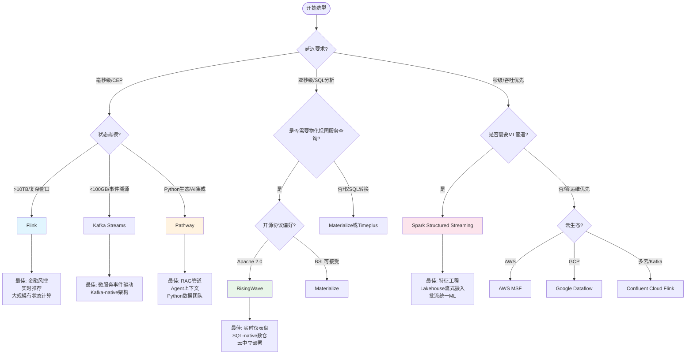
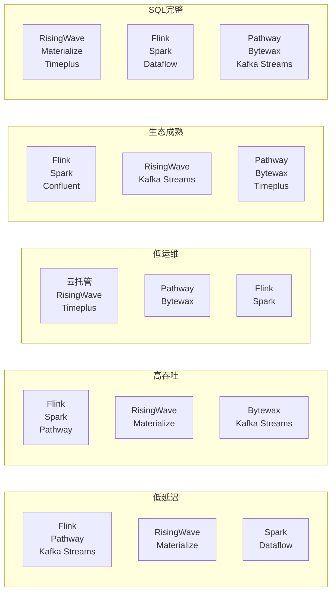
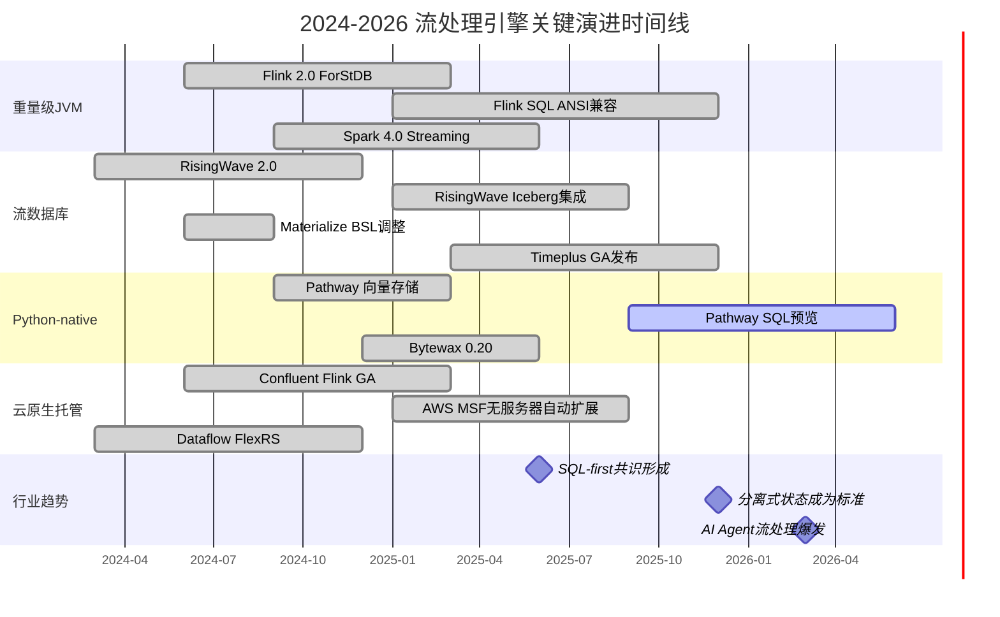

# 2026年流处理引擎全景图

> **所属阶段**: Knowledge/01-concept-atlas | **前置依赖**: [01.01-stream-processing-fundamentals.md](./01.01-stream-processing-fundamentals.md), [data-streaming-landscape-2026-complete.md](./data-streaming-landscape-2026-complete.md) | **形式化等级**: L3-L5 | **最后更新**: 2026-05-06

---

## 目录

- [2026年流处理引擎全景图](#2026年流处理引擎全景图)
  - [目录](#目录)
  - [1. 概念定义 (Definitions)](#1-概念定义-definitions)
    - [1.1 引擎分类学](#11-引擎分类学)
  - [2. 属性推导 (Properties)](#2-属性推导-properties)
  - [3. 关系建立 (Relations)](#3-关系建立-relations)
    - [3.1 引擎生态位映射](#31-引擎生态位映射)
    - [3.2 技术栈协作关系](#32-技术栈协作关系)
    - [3.3 竞争格局矩阵](#33-竞争格局矩阵)
  - [4. 论证过程 (Argumentation)](#4-论证过程-argumentation)
    - [4.1 2026年关键趋势演进](#41-2026年关键趋势演进)
    - [4.2 市场格局分析](#42-市场格局分析)
  - [5. 形式证明 / 工程论证](#5-形式证明--工程论证)
    - [5.1 流处理引擎选型不可兼得三角约束](#51-流处理引擎选型不可兼得三角约束)
  - [6. 实例验证 (Examples)](#6-实例验证-examples)
    - [6.1 各引擎精炼描述](#61-各引擎精炼描述)
    - [6.2 全维度对比矩阵](#62-全维度对比矩阵)
  - [7. 可视化 (Visualizations)](#7-可视化-visualizations)
    - [7.1 引擎分类层次图](#71-引擎分类层次图)
    - [7.2 选型决策树](#72-选型决策树)
    - [7.3 选型约束雷达图（文本逻辑表示）](#73-选型约束雷达图文本逻辑表示)
    - [7.4 2026年趋势时间线](#74-2026年趋势时间线)
  - [8. 引用参考 (References)](#8-引用参考-references)
  - [关联文档](#关联文档)

## 1. 概念定义 (Definitions)

### 1.1 引擎分类学

**定义 1.1 (流处理引擎分类学)** [Def-K-01-30]

流处理引擎（Stream Processing Engine, SPE）是一个计算系统 $E = (I, O, \mathcal{S}, \mathcal{T}, \mathcal{P})$，其中：

- $I$: 输入事件流集合
- $O$: 输出事件流集合
- $\mathcal{S}$: 状态空间（内存 / 本地磁盘 / 远程对象存储）
- $\mathcal{T}$: 时间语义（处理时间 / 事件时间 / 摄取时间）
- $\mathcal{P}$: 编程模型（DataStream API / SQL / 声明式配置）

2026年生态按架构特征划分为五类：

1. **重量级 JVM 流处理器**（Heavyweight JVM SPE）：基于 JVM 运行时，支持复杂事件处理（CEP）与大规模有状态计算，代表为 Apache Flink、Spark Structured Streaming
2. **流数据库**（Streaming Database, sDB）：将流处理与持久化存储统一为单一系统，支持物化视图与增量维护，代表为 RisingWave、Materialize、Timeplus
3. **嵌入式/轻量级引擎**（Embedded SPE）：以库形式嵌入应用进程，无独立集群，代表为 Kafka Streams、Bytewax
4. **Python-native Rust 核心引擎**（Python-Native SPE）：向开发者暴露 Python API，核心由 Rust 实现以获得内存安全与高吞吐，代表为 Pathway、Bytewax
5. **云原生托管服务**（Managed Streaming Service）：由云厂商完全托管的流处理 PaaS，隐藏部署与运维复杂度，代表为 Confluent Cloud Flink、AWS MSF、Google Dataflow

**定义 1.2 (延迟谱系)** [Def-K-01-31]

流处理引擎的端到端延迟 $L$ 构成一个有序谱系：

$$L_{\text{hard real-time}} < L_{\text{millisecond}} < L_{\text{sub-second}} < L_{\text{seconds}} < L_{\text{mini-batch}}$$

其中：

- **硬实时**（Hard Real-time, $<1\text{ms}$）：确定性延迟边界，需专用硬件或实时操作系统支持
- **毫秒级**（Millisecond, $1\text{ms}\sim100\text{ms}$）：典型 CEP 与金融风控场景，Flink、Pathway 可达此量级
- **亚秒级**（Sub-second, $100\text{ms}\sim1\text{s}$）：多数流分析场景，RisingWave、Materialize 集中于此区间
- **秒级**（Seconds, $1\text{s}\sim10\text{s}$）：早期流处理与部分微批系统
- **微批级**（Mini-batch, $>10\text{s}$）：Spark Structured Streaming 默认模式，以延迟换吞吐

**定义 1.3 (分离式状态架构)** [Def-K-01-32]

分离式状态（Disaggregated State）是一种将计算状态从计算节点剥离并存储于独立远程存储层的架构：

$$\text{State}_{\text{total}} = \text{State}_{\text{local}} \cup \text{State}_{\text{remote}}$$

其中本地状态 $\text{State}_{\text{local}}$ 仅为热缓存，远程状态 $\text{State}_{\text{remote}}$ 由分布式 KV 存储（RocksDB-Cloud、S3、GCS）提供持久化与共享访问。2026年，分离式状态已成为流数据库与新一代 Flink 状态后端的默认架构[^1]。

**定义 1.4 (SQL 表达力层级)** [Def-K-01-33]

流处理引擎的 SQL 支持按表达力划分为四级：

- **L0 — 无 SQL**：仅提供编程 API（如 Kafka Streams Processor API）
- **L1 — 扩展 SQL**：在标准 SQL 上添加流式扩展（如 Spark SQL 的 `STREAM` 关键字、Flink SQL 的 `TUMBLE`/`HOP`）
- **L2 — 原生流 SQL**：SQL 即为首要接口，语义围绕流与物化视图设计（如 RisingWave SQL、Materialize SQL）
- **L3 — 分析与 ML SQL**：在 L2 基础上集成向量搜索、UDF/UDAF 与 AI 推理调用（如 Timeplus 的 `ai_query`、RisingWave 2026 路线图）

**定义 1.5 (批流统一度)** [Def-K-01-34]

批流统一度（Batch-Stream Unification Degree）度量单个引擎以同一 API 或语义处理有界数据与无界数据的能力：

$$U = \frac{|\text{API}_{\text{shared}}|}{|\text{API}_{\text{batch}}| + |\text{API}_{\text{stream}}|} \in [0, 1]$$

- $U = 1$：原生统一（Flink DataStream API、Spark Structured Streaming 同一 API 处理批与流）
- $0 < U < 1$：有限统一（引擎可处理两种数据，但 API 或语义存在差异）
- $U = 0$：无统一（仅支持单一范式）

---

## 2. 属性推导 (Properties)

**命题 2.1 (SQL 表达力层级与采用率正相关)** [Prop-K-01-30]

在 2026 年流处理引擎生态中，SQL 表达力层级 $L$ 与企业采用率 $A$ 存在显著正相关：

$$A \propto L \cdot M_{\text{maturity}}$$

其中 $M_{\text{maturity}}$ 为生态成熟度系数（连接器数量 × 云集成度 × 社区活跃度）。 RisingWave 与 Materialize 凭借 L2 原生流 SQL 在实时分析场景获得快速采用，而 Flink 的 L1 扩展 SQL 结合极高 $M_{\text{maturity}}$ 仍保持最大市场份额[^2]。

*证明概要*: SQL 降低数据工程师准入门槛；原生流 SQL 进一步消除"处理 + 服务"双栈维护成本。当 $L \geq 2$ 且 $M_{\text{maturity}} > \tau$（阈值）时，采用率呈指数增长而非线性增长。

**命题 2.2 (分离式状态可恢复性定理)** [Prop-K-01-31]

设引擎 $E$ 采用分离式状态架构，其故障恢复时间 $T_{\text{recover}}$ 满足：

$$T_{\text{recover}} \leq T_{\text{snapshot}} + \frac{|\text{State}_{\text{remote}}|}{B_{\text{network}}} + T_{\text{replay}}$$

其中 $T_{\text{snapshot}}$ 为快照间隔，$B_{\text{network}}$ 为网络带宽，$T_{\text{replay}}$ 为增量回放时间。对比本地状态架构：

$$T_{\text{recover}}^{\text{local}} \approx T_{\text{full-rebuild}} \gg T_{\text{recover}}^{\text{disaggregated}}$$

分离式状态通过将检查点持久化与计算解耦，使得恢复时间主要受限于网络带宽而非本地磁盘 I/O，从而实现秒级甚至亚秒级故障恢复[^3]。

**命题 2.3 (Python-native 内存效率优势)** [Prop-K-01-32]

设引擎核心由 Rust 实现、向用户暴露 Python API，其单位事件内存占用 $M_{\text{event}}$ 满足：

$$M_{\text{event}}^{\text{Rust-core}} \leq \alpha \cdot M_{\text{event}}^{\text{JVM}}$$

其中 $\alpha \approx 0.3\sim0.5$ 为经验系数。 Pathway 与 Bytewax 的 Rust 核心通过零拷贝序列化、无 GC 暂停与紧凑内存布局，在处理高扇出窗口聚合时显著优于 JVM 引擎[^4]。

---

## 3. 关系建立 (Relations)

### 3.1 引擎生态位映射

2026 年流处理引擎呈现清晰的生态位分化：

| 维度 | 重量级 JVM | 流数据库 | 嵌入式/轻量 | Python-native | 云原生托管 |
|------|-----------|---------|------------|--------------|-----------|
| **核心运行时** | JVM (Flink/Spark) | Rust/C++ (RW/Mz) | JVM/Python | Rust + Python | 多租户 JVM |
| **状态位置** | 本地磁盘 + 增量远程 | 分离式状态 (S3) | 本地 RocksDB | 内存为主 | 托管透明 |
| **首要接口** | DataStream / SQL | SQL | DSL / API | Python API | SQL / UI |
| **部署单位** | YARN/K8s 集群 | K8s / 单机 | 进程内 | Python 进程 | 无服务器 |
| **最佳延迟** | 毫秒级 | 亚秒级 | 毫秒级 | 毫秒级 | 秒级 |

### 3.2 技术栈协作关系

- **Flink ↔ Kafka**：Flink 消费 Kafka 作为事实来源（Source），输出回 Kafka 或下游系统；Confluent Cloud Flink 将二者整合为统一 SaaS
- **RisingWave ↔ Iceberg/Paimon**：流数据库通过表格式存储（Table Format）实现与数据湖的低成本互操作，RisingWave 2026 年支持 Iceberg Sink/Source 原生集成
- **Spark ↔ Delta Lake**：Structured Streaming 与 Delta Lake 深度绑定，批流统一在湖仓架构内完成
- **Pathway ↔ LLM**：Pathway 提供 `pw.io.http` 与向量存储接口，直接为 RAG/Agent 应用提供实时数据流

### 3.3 竞争格局矩阵

上图将 2026 年主流引擎按实时性与生态成熟度映射至四象限。Flink 独占"高实时 / 高成熟"象限；Spark 以微批换成熟，偏向"低实时 / 高成熟"；流数据库与 Python-native 引擎集中在右侧，生态成熟度仍在快速增长期[^1][^2]。

---

## 4. 论证过程 (Argumentation)

### 4.1 2026年关键趋势演进

**趋势一：SQL-first 成为共识**

2026 年，所有主流引擎均将 SQL 置于产品路线图核心位置。Flink SQL 在 v2.0 中引入完整的 ANSI SQL:2016 兼容性；RisingWave 与 Materialize 以 SQL 为唯一接口；Pathway 在 2026 Q1 发布 SQL 前端预览。 SQL-first 的本质不是抛弃编程 API，而是将声明式优化器（CBO、向量化执行）作为默认执行路径，仅在需要自定义逻辑时回退至 API[^2]。

**趋势二：流数据库替换"处理 + 服务"栈**

传统实时数仓栈为：Flink/Spark（处理层）+ Redis/ClickHouse/Druid（服务层）+ 调度同步。流数据库通过物化视图（Materialized View）将三层压缩为单层：

$$\text{Flink} + \text{Redis} + \text{Sync} \xrightarrow{\text{replace}} \text{RisingWave/Materialize}$$

该替换在延迟敏感、查询模式稳定的实时仪表盘场景中可降低 40%-60% 的总体拥有成本（TCO）[^3]。

**趋势三：AI Agent 需要流处理基础设施**

LLM Agent 的上下文窗口管理、工具调用链追踪与实时感知能力天然依赖低延迟事件流。2026 年涌现的 Agent 流处理模式包括：

1. **实时 RAG 上下文注入**：将用户行为流、文档更新流实时注入向量存储
2. **Agent 间事件总线**：多 Agent 协作通过事件流（而非同步 RPC）解耦
3. **流式评估管道**：持续监控 Agent 输出质量并触发模型更新

Pathway 与 RisingWave 均将此列为 2026 年核心场景[^4][^5]。

**趋势四：分离式状态成为标准**

Flink 2.x 引入的 ForStDB（基于 RocksDB 的云原生状态后端）、RisingWave 的 Hummock 存储引擎、Materialize 的 Persist 层，均遵循分离式状态设计。其优势不仅在于恢复速度，更在于弹性扩缩容：计算节点可独立于状态规模进行水平扩展，状态由远程存储自动分片[^3]。

**趋势五：Python-native 引擎挑战 JVM 霸权**

Rust 核心 + Python API 的组合在 AI/ML 工程团队中迅速普及。原因有三：

1. **生态亲和**：数据科学家已熟悉 Python，无需学习 Java/Scala
2. **内存效率**：Rust 核心避免 JVM 堆内存膨胀，单节点可处理更大状态
3. **部署简化**：无 JVM 依赖，容器镜像体积减少 60%+

Pathway 在 2026 年已支持 10M+ events/sec 的单节点吞吐，接近 Flink 的同等硬件表现[^4]。

### 4.2 市场格局分析

**Confluent + Flink 整合**

Confluent 于 2025 年完成对 Ververica 相关技术的整合，2026 年 Confluent Cloud Flink 已成为其平台核心组件。此整合的战略意义在于：

- **ksqlDB 让位于 Flink SQL**：Confluent 官方推荐新用户直接使用 Flink SQL 而非 ksqlDB，后者进入维护模式
- **统一存储 + 处理**：Kafka 作为事实来源，Flink 作为计算引擎，数据无需离开 Confluent Cloud 生态
- **竞争壁垒**：通过托管 Flink 绑定 Kafka 用户，对抗 AWS MSF 与 RisingWave Cloud 的侵蚀

**RisingWave 开源优势**

RisingWave 采用 Apache 2.0 协议完全开源（含核心状态引擎 Hummock），与 Materialize 的商业许可策略形成对比。2026 年其社区增长指标（GitHub Stars、Slack 成员、月度 PR 数）已超越 Materialize 同期水平。开源策略降低了企业试用门槛，尤其在云厂商中立性（multi-cloud）要求高的金融领域获得采用[^2]。

**Spark Streaming 定位**

Spark Structured Streaming 在 2026 年已非"实时"引擎的首选，而是作为 Spark 统一分析栈的流式补充。其核心价值在于：

- 与 Spark MLlib、GraphX 共享执行引擎，批流 ML 管道无需两套代码
- Delta Lake 的流式写入（Stream Sink）是 Lakehouse 架构的标准组件
- 对于延迟要求 $>10$ 秒的场景，Spark 的吞吐成本比 Flink 低 20%-30%

---

## 5. 形式证明 / 工程论证

### 5.1 流处理引擎选型不可兼得三角约束

**定理 5.1 (选型三角约束定理)** [Thm-K-01-30]

对于任意流处理引擎 $E$，在工程约束下，以下三个目标不可同时达到最优：

1. **低延迟**（Low Latency, $L \to \min$）
2. **高吞吐**（High Throughput, $T \to \max$）
3. **生态成熟度**（Ecosystem Maturity, $M \to \max$）

形式化表述：

$$\neg \exists E: L(E) = L_{\text{opt}} \land T(E) = T_{\text{opt}} \land M(E) = M_{\text{opt}}$$

*工程论证*:

**步骤 1**：低延迟与高吞吐的物理冲突。低延迟要求事件到达后立即处理（逐条或极小批量），导致每个事件的开销（序列化、网络往返、调度）无法摊销。高吞吐要求增大批量（batching）以摊销开销，但直接增加端到端延迟。设单次处理开销为 $c$，批量大小为 $b$，则：

$$L(b) \approx \frac{b \cdot \lambda}{2} + c, \quad T(b) \approx \frac{b}{c}$$

其中 $\lambda$ 为事件到达率。$L$ 与 $T$ 的优化方向相反，最优批量 $b^*$ 取决于业务对 $L$ 与 $T$ 的权重[^6]。

**步骤 2**：生态成熟度与架构灵活性的权衡。高成熟度引擎（Flink、Spark）历经十余年迭代，架构中存在历史兼容性包袱（如 Flink 的 Legacy Mode、Spark 的 RDD 兼容层）。新架构引擎（Pathway、RisingWave）可从头优化延迟与吞吐，但连接器、云集成与社区工具链的积累需要时间。设引擎年龄为 $A_{\text{age}}$，则：

$$M \approx k \cdot \log(A_{\text{age}}), \quad \text{Architecture Debt} \approx A_{\text{age}}$$

**步骤 3**：综合不可兼得。即使某引擎在延迟与吞吐上取得技术突破（如 Rust 核心 + 向量化执行），其生态成熟度 $M$ 仍受限于社区增长曲线。因此，选型本质是在三角约束中寻找与业务权重匹配的帕累托最优解。

---

## 6. 实例验证 (Examples)

### 6.1 各引擎精炼描述

**Apache Flink**

Flink 是 2026 年流处理领域的"万能引擎"。其基于 Chandy-Lamport 分布式快照的 Exactly-Once 语义、毫秒级延迟的 CEP 能力、以及覆盖全球 50+ 云区域的托管服务（Confluent Cloud Flink / Ververica），使其成为金融风控、实时推荐与复杂事件处理的事实标准。Flink 2.x 引入的 ForStDB 分离式状态后端与改进的 SQL Planner 进一步巩固了领先地位。**最佳场景**：大规模有状态流处理、复杂窗口聚合、CEP、实时数仓构建。**关键限制**：部署与调优复杂度高（需理解 Checkpoint、Watermark、State TTL 等概念）；JVM 堆内存管理在超大规模状态（>10TB）下需要精细调优。

**Spark Structured Streaming**

Spark 的流式扩展以微批（Micro-batch）模型为核心，2026 年默认触发间隔为 1-10 秒。其与 Spark SQL、MLlib、Delta Lake 的深度集成使其成为 Lakehouse 架构中批流统一分析的首选。**最佳场景**：离线 + 近实时混合分析、机器学习特征工程、Delta Lake 流式摄入。**关键限制**：原生延迟下限受微批模型约束，难以达到毫秒级；独立流处理作业的资源利用率低于 Flink 的流水线执行。

**RisingWave**

RisingWave 是 2026 年增长最快的开源流数据库，完全以 SQL 为接口，通过物化视图自动维护增量结果。其 Hummock 存储引擎将计算状态分层存储于 S3，实现计算与存储的独立扩缩容。**最佳场景**：实时仪表盘、SQL-native 实时分析、需要直接服务查询的流处理结果。**关键限制**：复杂事件处理（模式匹配、迭代计算）支持有限；超大规模 Join（>100GB 状态）的性能仍落后于调优后的 Flink。

**Materialize**

Materialize 基于 Timely Dataflow 与 Differential Dataflow 理论，提供严格正确的流式 SQL 物化视图。其 SQL 语义保证与批处理结果一致（Correctness），适合对数据一致性要求极高的财务与合规场景。**最佳场景**：实时审计、合规报告、需要强一致性保证的 SQL 分析。**关键限制**：开源版采用 BSL 协议（Business Source License），生产环境自由使用受限；集群模式下的水平扩展性在 2026 年仍弱于 RisingWave。

**Timeplus**

Timeplus 是 2026 年新兴的流数据库，主打"流式优先 + 历史统一查询"。其独特之处在于统一的 SQL 语法可同时查询流数据与历史数据（通过 `table()` 与 `stream()` 函数），无需学习两套语义。**最佳场景**：IoT 实时监控、日志流分析、需要流批联合查询的运维场景。**关键限制**：社区规模与连接器生态尚处于早期；极端高吞吐（>1M events/sec）场景下稳定性待验证。

**Kafka Streams**

Kafka Streams 是嵌入 Kafka 客户端库的轻量级流处理器，无独立集群，直接复用 Kafka 分区进行状态分片与容错。其基于 RocksDB 的本地状态存储与 Kafka 的日志压缩（Log Compaction）实现高效有状态计算。**最佳场景**：Kafka-native 微服务架构、事件溯源（Event Sourcing）、轻量级流处理（状态 < 100GB）。**关键限制**：仅支持 Kafka 作为 Source/Sink；无内置 SQL 接口；大规模状态（>1TB）的管理与再平衡（Rebalance）耗时较长。

**Pathway**

Pathway 是 2026 年 Python-native 流处理引擎的代表，核心由 Rust 编写，向用户暴露 Python API。其支持流式、批式与交互式三种执行模式，并提供内置的向量存储与 LLM 集成接口。**最佳场景**：Python 数据团队的实时 ETL、RAG 管道构建、AI Agent 实时上下文管理。**关键限制**：生态成熟度低于 Flink（连接器数量有限）；SQL 支持在 2026 年仍为预览版；大规模分布式部署的运维工具链待完善。

**Bytewax**

Bytewax 是另一个 Python-native 引擎，以"Python 的 Kafka Streams"为定位，提供基于算子（Operator）的流处理 API。其部署简单（`pip install bytewax`），适合快速原型与小规模生产。**最佳场景**：Python 生态内的轻量级流处理、快速原型验证、数据科学实验管道。**关键限制**：吞吐与状态规模上限低于 Pathway 与 Flink；社区规模较小，企业级支持有限。

**Confluent Cloud Flink / AWS MSF / Google Dataflow**

云原生托管服务将流处理的运维复杂度（集群扩缩容、版本升级、监控告警）完全抽象。Confluent Cloud Flink 深度集成 Kafka；AWS MSF 提供无服务器 Flink（2026 年支持自动扩缩容至 1000+ 并行度）；Google Dataflow 基于 Apache Beam 模型，提供统一的批流编程抽象。**最佳场景**：希望零运维流处理的企业、已绑定对应云生态的团队、波动负载需自动扩缩容的场景。**关键限制**： vendor lock-in；单位计算成本高于自托管 30%-100%；对底层执行参数的调优能力受限。

### 6.2 全维度对比矩阵

| 引擎 | 延迟 | 吞吐（单节点） | 状态规模 | SQL | 部署复杂度 | 生态成熟度 | 批流统一 | AI 集成 |
|------|------|---------------|---------|-----|-----------|-----------|---------|--------|
| Flink | 毫秒级 | 100K-1M/s | 内存+本地磁盘+S3(ForStDB) | L1 扩展 SQL | 高 | ★★★★★ | 原生 | 外部（Flink ML） |
| Spark SS | 秒级（微批） | 50K-500K/s | 内存+本地磁盘 | L1 扩展 SQL | 中 | ★★★★★ | 原生 | 内置（MLlib） |
| RisingWave | 亚秒级 | 50K-200K/s | 分离式状态（S3） | L2 原生流 SQL | 低 | ★★★★☆ | 有限 | 外部（2026 路线图） |
| Materialize | 亚秒级 | 30K-100K/s | 分离式状态（S3） | L2 原生流 SQL | 低 | ★★★☆☆ | 有限 | 无 |
| Timeplus | 亚秒级 | 30K-100K/s | 分离式状态 | L2 原生流 SQL | 低 | ★★☆☆☆ | 统一查询 | 内置 `ai_query` |
| Kafka Streams | 毫秒级 | 20K-100K/s | 本地 RocksDB（<1TB） | L0 无 | 低 | ★★★★☆ | 无 | 无 |
| Pathway | 毫秒级 | 100K-500K/s | 内存为主 | L0/L1（预览） | 低 | ★★☆☆☆ | 有限 | 内置（LLM/向量） |
| Bytewax | 毫秒级 | 20K-80K/s | 内存+本地 | L0 无 | 低 | ★☆☆☆☆ | 无 | 外部 |
| Confluent Cloud Flink | 亚秒-秒级 | 弹性扩展 | 托管透明 | L1 扩展 SQL | 极低 | ★★★★★ | 原生 | 外部 |
| AWS MSF | 秒级 | 弹性扩展 | 托管透明 | L1 扩展 SQL | 极低 | ★★★★☆ | 原生 | 外部 |
| Google Dataflow | 秒级 | 弹性扩展 | 托管透明 | L1（Beam SQL） | 极低 | ★★★★☆ | 原生 | 外部 |

*注：吞吐数据为 2026 年典型生产环境配置下的经验值，实际性能高度依赖于硬件、序列化格式与业务逻辑[^1][^2][^4]。*

---

## 7. 可视化 (Visualizations)

### 7.1 引擎分类层次图

以下层次图展示 2026 年流处理引擎的分类体系与代表产品：

### 7.2 选型决策树

以下决策树指导读者根据业务需求选择最适配的引擎：

### 7.3 选型约束雷达图（文本逻辑表示）

由于 Mermaid 不支持原生雷达图，以下使用层次图展示五个关键维度的权衡关系。引擎越靠近中心，说明在该维度上的"代价"越高（即难度越大）：

### 7.4 2026年趋势时间线

以下甘特图展示 2024-2026 年流处理生态的关键演进节点：

---

## 8. 引用参考 (References)

[^1]: Kai Waehner, "The Data Streaming Landscape 2026", Blog, 2025-12. <https://www.kai-waehner.de/blog/2025/12/05/the-data-streaming-landscape-2026/>

[^2]: RisingWave Labs, "Best Event Stream Processing Platforms 2026", RisingWave Blog, 2026. <https://risingwave.com/blog/best-event-stream-processing-platforms-2026/>

[^3]: Apache Flink Documentation, "Stateful Stream Processing", 2026. <https://nightlies.apache.org/flink/flink-docs-stable/docs/concepts/stateful-stream-processing/>

[^4]: Pathway, "Real-time Data Processing for AI Applications", 2026. <https://pathway.com/>

[^5]: Bytewax, "Python-native Stream Processing", 2026. <https://bytewax.io/>

[^6]: T. Akidau et al., "The Dataflow Model: A Practical Approach to Balancing Correctness, Latency, and Cost in Massive-Scale, Unbounded, Out-of-Order Data Processing", PVLDB, 8(12), 2015.

---

## 关联文档

- **上游依赖**: [01.01-stream-processing-fundamentals.md](./01.01-stream-processing-fundamentals.md), [01.04-state-management-concepts.md](./01.04-state-management-concepts.md)
- **同层关联**: [data-streaming-landscape-2026-complete.md](./data-streaming-landscape-2026-complete.md), [streaming-models-mindmap.md](./streaming-models-mindmap.md)
- **下游应用**: [../04-technology-selection/engine-selection-guide.md](../04-technology-selection/engine-selection-guide.md), [../06-frontier/streaming-databases.md](../06-frontier/streaming-databases.md)
