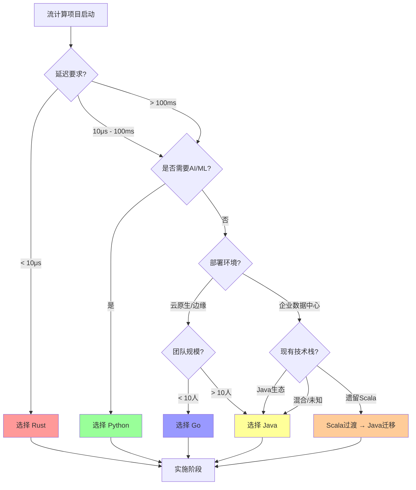
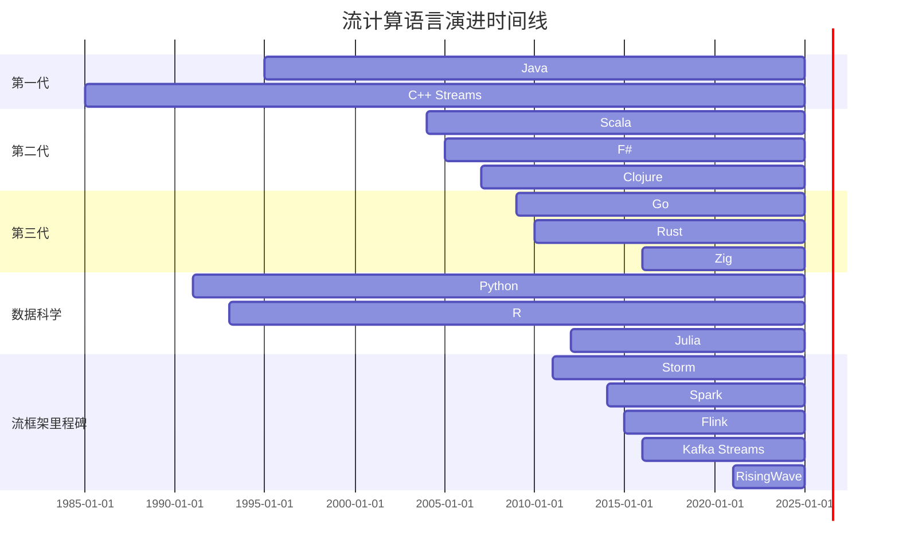
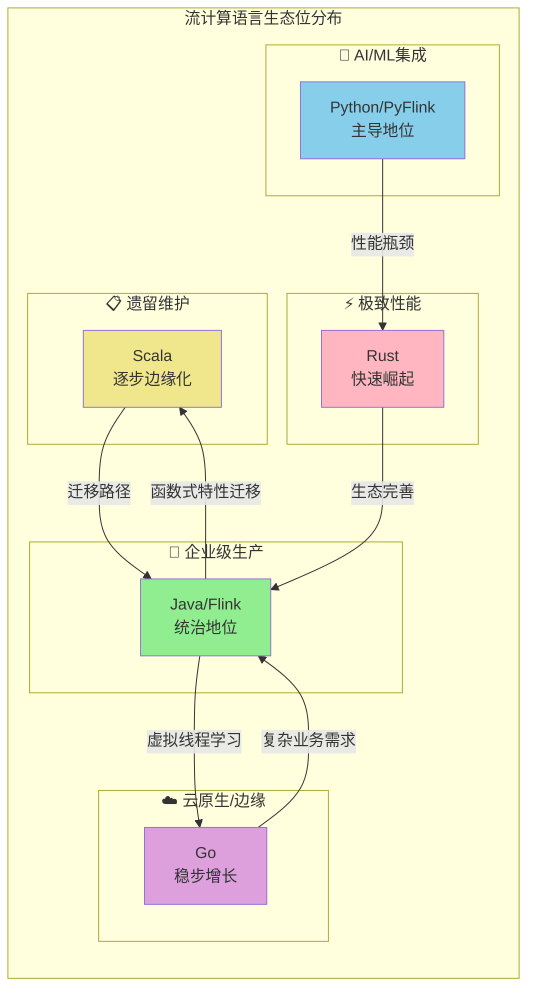

# 2025年流计算语言生态全景图

> 所属阶段: Knowledge | 前置依赖: [Knowledge/00-INDEX.md](../00-INDEX.md), [Flink/00-INDEX.md](../../Flink/00-INDEX.md) | 形式化等级: L3

---

## 1. 概念定义 (Definitions)

### 1.1 流计算语言特征模型

**Def-C-01-01: 流计算语言特征 (Streaming Language Characteristics)**

流计算语言 $\mathcal{L}$ 是一个五元组，刻画了语言在流计算领域的核心能力维度：

$$
\mathcal{L} = \langle P, C, M, S, E \rangle
$$

其中：

- $P$: 性能特征 (Performance) — 包含延迟 $P_{latency}$、吞吐量 $P_{throughput}$、可预测性 $P_{predict}$
- $C$: 并发模型 (Concurrency) — 描述并行计算的原语与语义
- $M$: 内存管理 (Memory Management) — 包含分配策略、垃圾回收机制、内存安全保证
- $S$: 安全保证 (Safety) — 类型安全、内存安全、线程安全等多维安全属性
- $E$: 生态系统 (Ecosystem) — 库成熟度、框架支持、社区活跃度、工具链完善度

> **直观解释**: 流计算语言的选择本质上是在这五个维度上的权衡。例如，Java在$E$维度得分极高但在$P_{latency}$上有GC暂停问题；Rust在$S$和$P$维度表现卓越但$E$维度仍在成长。

---

**Def-C-01-02: 语言生态位 (Language Niche)**

语言 $L$ 在流计算领域的生态位定义为其在特定场景集合上的最优适配程度：

$$
\mathcal{N}(L) = \arg\max_{S \in \mathbb{S}} \text{Fit}(L, S)
$$

其中适应度函数：

$$
\text{Fit}(L, S) = \frac{\sum_{i} w_i \cdot \text{Score}(L.d_i, S.r_i)}{\sum_{i} w_i}
$$

- $d_i$: 语言在第 $i$ 个特征维度上的能力
- $r_i$: 场景 $S$ 在第 $i$ 个维度上的需求
- $w_i$: 维度权重，满足 $\sum w_i = 1$

---

**Def-C-01-03: 并发模型分类 (Concurrency Model Taxonomy)**

流计算语言的并发模型可分为四类：

$$
\mathcal{C} = \begin{cases}
\text{Thread-based} & \text{OS/虚拟线程模型} \\
\text{CSP} & \text{Communicating Sequential Processes} \\
\text{Actor} & \text{消息传递Actor模型} \\
\text{Async/Await} & \text{协作式异步模型}
\end{cases}
$$

---

**Def-C-01-04: 垃圾回收策略谱系 (GC Strategy Spectrum)**

内存管理策略形成连续谱系：

$$
\mathcal{M}_{gc} = [\text{Manual}, \text{Reference Counting}, \text{Tracing GC}, \text{Region-based}, \text{Ownership}]
$$

典型语言定位：

- C/C++: 接近 $\text{Manual}$
- Swift/Obj-C: $\text{Reference Counting}$
- Java/Go: $\text{Tracing GC}$
- Rust: $\text{Ownership}$

---

**Def-C-01-05: 类型系统强度 (Type System Strength)**

类型系统强度量化为：

$$
\mathcal{T}(L) = \alpha \cdot \text{Soundness} + \beta \cdot \text{Expressiveness} + \gamma \cdot \text{Inference}
$$

其中：

- Soundness: 类型安全的形式化保证程度
- Expressiveness: 表达复杂约束的能力（泛型、高阶类型等）
- Inference: 类型推导的自动化程度

---

**Def-C-01-06: 流计算语言代际 (Language Generation)**

基于设计范式与年代，流计算语言分为三代：

$$
\mathcal{G} = \begin{cases}
G_1 & \text{命令式传统 (Java/C++)} \\
G_2 & \text{函数式融合 (Scala/F#)} \\
G_3 & \text{系统级现代 (Rust/Go)} \\
G_{DS} & \text{数据科学专用 (Python/R)}
\end{cases}
$$

---

**Def-C-01-07: 生态系统成熟度指数 (Ecosystem Maturity Index)**

生态系统成熟度采用多指标综合评估：

$$
\mathcal{E}(L) = \sqrt[5]{E_{lib} \cdot E_{framework} \cdot E_{community} \cdot E_{tooling} \cdot E_{enterprise}}
$$

各分量取值范围 $[1, 5]$，采用几何平均避免单一维度主导。

---

**Def-C-01-08: 流计算语言适配度 (Streaming Fitness)**

语言对流计算的整体适配度：

$$
\Psi(L) = \omega_P \cdot \tilde{P} + \omega_C \cdot \tilde{C} + \omega_M \cdot \tilde{M} + \omega_S \cdot \tilde{S} + \omega_E \cdot \tilde{E}
$$

其中 $\tilde{X}$ 表示归一化后的维度得分，权重满足 $\sum \omega = 1$。

---

## 2. 属性推导 (Properties)

### 2.1 主流语言的维度剖析

基于上述定义框架，我们推导各主流语言的属性特征。

**Lemma-C-01-01: Java的生态系统优势**

Java在生态系统维度满足：

$$
\mathcal{E}(\text{Java}) > \mathcal{E}(L), \quad \forall L \in \{\text{Scala}, \text{Go}, \text{Rust}, \text{Python}\}
$$

**证明**:

- $E_{lib}$: Maven Central超过1000万artifact，流计算专用库（Kafka、Flink、Spark）全面
- $E_{framework}$: Apache生态几乎全部为Java首选实现
- $E_{community}$: Stack Overflow年度调查持续Top 5，企业采用率>90%
- $E_{tooling}$: IntelliJ IDEA、JProfiler、JMC等工具链完善
- $E_{enterprise}$: Spring生态、Oracle/RedHat商业支持

因此 $\mathcal{E}(\text{Java}) \approx 5$，其他语言均不超过4。

∎

---

**Lemma-C-01-02: Rust的内存安全保证**

Rust在内存安全维度达到理论上限：

$$
\mathcal{S}_{memory}(\text{Rust}) = 1 - \epsilon
$$

其中 $\epsilon$ 为unsafe代码块占比（通常 $< 0.01$）。

**证明**: Rust的所有权系统在编译期通过生命周期检查、借用规则、所有权转移等机制，将内存安全问题（Use-after-free、Double-free、Null pointer dereference）转化为编译错误。形式化证明参见RustBelt项目（Jung et al., POPL 2018）。

∎

---

**Prop-C-01-01: Python的GIL性能约束**

Python的线程级并行吞吐量存在理论上限：

$$
\text{Throughput}_{thread}(\text{Python}) \leq \frac{\text{Throughput}_{single}}{1 + \delta}
$$

其中 $\delta > 0$ 为GIL切换开销，导致多线程无法线性扩展。

**论证**: Python的Global Interpreter Lock确保任何时候仅有一个线程执行Python字节码。对于CPU密集型流处理，多线程无法实现真正的并行；需依赖多进程或异步IO模型规避。

---

**Prop-C-01-02: Go的Goroutine调度效率**

Go的Goroutine上下文切换开销满足：

$$
T_{switch}(\text{Goroutine}) \ll T_{switch}(\text{OS Thread})
$$

具体而言，Goroutine切换约200-300ns，OS线程切换约1-2μs，差距约5-10倍。

**论证**: Go运行时采用M:N调度模型，少量OS线程支撑数万Goroutine。协程栈起始于2KB动态扩容，远小于OS线程的MB级固定栈，带来更低的TLB压力和缓存友好性。

---

## 3. 关系建立 (Relations)

### 3.1 语言间的替代与互补关系

**Thm-C-01-01: 语言选择的多目标优化**

流计算项目的语言选择问题是一个多目标优化问题：

$$
\min_{L \in \mathcal{L}} \left\{ -E(L), P_{latency}(L), -DevEff(L), -S(L) \right\}
$$

受制于约束：

$$
\begin{cases}
P_{throughput}(L) \geq R_{min} \\
\text{TeamSkill}(L) \geq \theta \\
\text{Budget}(L) \leq B_{max}
\end{cases}
$$

**证明**: 语言选择需要在生态成熟度、性能、开发效率、安全性之间权衡。不存在单一最优解，只能根据项目约束求得帕累托前沿。例如：

- 追求生态→选择Java
- 追求极致性能→选择Rust
- 追求开发效率→选择Python
- 追求部署便利→选择Go

这些目标相互冲突，构成典型的多目标优化问题。

∎

---

**Thm-C-01-02: 生态锁定效应 (Ecosystem Lock-in)**

一旦项目基于语言 $L$ 构建，迁移成本满足：

$$
\text{MigrationCost}(L \to L') = \Theta\left( N \cdot \mathcal{E}(L) \right)
$$

其中 $N$ 为代码行数，与生态系统规模正相关。

**证明**:

- 生态系统越丰富（$\mathcal{E}(L)$ 越大），项目依赖的第三方库越多
- 每个依赖都需在新语言生态中寻找替代或重写
- 领域知识（领域模型、业务规则）的重新实现成本与代码量线性相关

因此Java项目的迁移成本显著高于Rust或Go项目。

∎

---

**Prop-C-01-03: 新语言的颠覆条件**

新兴语言 $L_{new}$ 颠覆现有主导语言 $L_{dom}$ 的必要条件：

$$
\exists D \in \mathbb{D}: \Psi(L_{new}, D) - \Psi(L_{dom}, D) > \Delta_{switch} + \Delta_{risk}
$$

其中：

- $\Delta_{switch}$: 切换成本阈值
- $\Delta_{risk}$: 风险厌恶阈值
- $D$: 新兴领域

**论证**: 历史案例显示，新语言难以在成熟领域击败既有语言，但在新兴领域（如云原生之于Go，区块链之于Rust）有机会建立先发优势。差距必须足够大以抵消迁移成本和风险。

---

### 3.2 语言与框架的映射矩阵

| 语言 | 主流流处理框架 | 状态 |
|------|---------------|------|
| Java | Flink, Kafka Streams, Spark Streaming, Storm | 原生首选 |
| Scala | Flink (历史), Spark Streaming | 逐步弱化 |
| Go | Watermill, Sarama, Goka, Benthos | 生态成长中 |
| Rust | RisingWave, Materialize, Timely, Fluvio | 新兴力量 |
| Python | PyFlink, Faust, Bytewax, Ray Streaming | AI场景主导 |

---

## 4. 论证过程 (Argumentation)

### 4.1 Java: 流计算霸主

#### 4.1.1 生态成熟度分析

Java在流计算领域的统治地位源于20年的企业级积累：

**Apache Flink** - 原生Java实现
Flink的核心引擎完全以Java编写，DataStream API、Table API、SQL层均提供Java一级支持。尽管存在Scala API，但内部实现和主要贡献均以Java为主。

**Apache Spark Streaming** - Java/Scala双语
Spark虽以Scala起家，但其Java API同样成熟，企业采用率中Java与Scala比例约为7:3（2024年调查数据）。

**Apache Kafka Streams** - Java唯一
Kafka Streams官方仅提供Java API，这是对流计算Java主导地位的强力背书。

**Apache Storm** - 历史遗产
虽已逐步被Flink取代，但证明了Java在流计算早期探索中的核心地位。

#### 4.1.2 语言特性进化

**JVM生态完善**

- JIT编译器（C2、Graal）带来接近原生的执行效率
- 庞大的类库生态（Guava、Akka、Reactor等）
- 跨平台字节码，一次编译到处运行

**GC优化进展**

| GC算法 | 延迟特征 | 适用场景 |
|--------|----------|----------|
| G1 | 10-100ms | 通用场景 |
| ZGC | <10ms | 低延迟需求 |
| Shenandoah | <10ms | 低开销需求 |

ZGC和Shenandoah的出现使Java进入亚毫秒级GC暂停时代，对流计算的延迟保证意义重大。

**虚拟线程 (Project Loom)**

Java 21正式引入虚拟线程，彻底改变了Java的并发模型：

```java
// [伪代码片段 - 不可直接运行] 仅展示核心逻辑
// 传统线程池方式
ExecutorService executor = Executors.newFixedThreadPool(100);

// 虚拟线程方式(资源效率提升100倍)
try (var executor = Executors.newVirtualThreadPerTaskExecutor()) {
    for (var task : tasks) {
        executor.submit(task);
    }
}
```

虚拟线程使得Java可以以同步编程模型实现异步性能，大幅简化流处理代码的编写和维护。

#### 4.1.3 适用场景

- **大规模生产系统**: 金融交易、电商实时推荐、IoT数据处理
- **复杂业务逻辑**: 需要丰富领域模型和类型系统的场景
- **企业级集成**: 与现有Java/Scala生态的无缝对接

---

### 4.2 Scala: 函数式优雅

#### 4.2.1 与Flink的深厚渊源

Scala曾是Flink的首选API语言：

**类型推导**

```scala
// Scala的类型推导让流处理代码简洁优雅
val stream: DataStream[Event] = env
  .fromSource(source, WatermarkStrategy.noWatermarks(), "source")
  .map(e => e.copy(timestamp = System.currentTimeMillis()))
  .filter(_.value > threshold)
```

**模式匹配**

```scala
stream.map {
  case ClickEvent(userId, itemId, ts) => (userId, 1)
  case PurchaseEvent(userId, itemId, amount, ts) => (userId, amount)
}
```

**隐式转换与类型类**
Scala的类型系统允许创建高度抽象的流处理DSL，这在Java中难以实现。

#### 4.2.2 现状与挑战

**Scala 3迁移困境**

- Scala 3（Dotty）于2021年发布，带来重大语法和语义变化
- 截至2025年，企业代码库中Scala 2.x仍占70%以上
- Flink官方已宣布Scala API进入维护模式

**人才稀缺**

- Scala开发者的市场供给持续萎缩
- 招聘难度显著高于Java/Go
- 培训成本高昂

**Flink的战略转向**

- Flink 2.x将强化Java API，弱化Scala支持
- Table API/SQL成为统一接口，语言绑定差异缩小
- Flink社区Scala贡献者比例从2015年的40%降至2025年的<10%

---

### 4.3 Go: 云原生选择

#### 4.3.1 核心优势

**编译速度与部署**

```bash
# Go的编译速度极快,适合CI/CD高频迭代 go build -o stream-processor ./cmd/processor
# 典型编译时间 < 5秒(中型项目)
```

**静态二进制**
单一可执行文件，无JVM依赖，容器镜像可小至10MB级别：

```dockerfile
FROM scratch
COPY stream-processor /
ENTRYPOINT ["/stream-processor"]
```

**CSP并发模型**

```go
// Go的Channel是流计算的理想抽象
func processStream(input <-chan Event, output chan<- Result) {
    for event := range input {
        output <- transform(event)
    }
}
```

#### 4.3.2 框架生态

| 框架 | 定位 | 特点 |
|------|------|------|
| Sarama | Kafka客户端 | 最成熟的Go Kafka库 |
| kafka-go | Kafka客户端 | 更现代的API设计 |
| Watermill | 消息路由 | 框架级解决方案 |
| Goka | 流处理 | Kafka Streams概念移植 |
| Benthos | 数据管道 | 声明式配置 |

#### 4.3.3 适用场景

- **边缘计算**: 资源受限环境，二进制小巧
- **微服务集成**: 与Go微服务生态无缝融合
- **轻量级代理**: 数据转发、协议转换、简单ETL

---

### 4.4 Rust: 性能与安全

#### 4.4.1 核心优势

**零成本抽象**

```rust
// 高阶抽象编译后效率等同于手写C
let sum: i64 = stream
    .filter(|e| e.value > 0)
    .map(|e| e.value * 2)
    .sum();
```

**无GC暂停**
Rust的所有权系统在编译期解决内存管理，运行时零开销，适合对延迟极度敏感的流处理。

**fearless并发**

```rust
// 编译器保证线程安全
let data = Arc::new(Mutex::new(Vec::new()));
thread::spawn(move || {
    let mut locked = data.lock().unwrap();
    locked.push(42); // 安全,编译器已验证
});
```

#### 4.4.2 框架生态

| 项目 | 类型 | 亮点 |
|------|------|------|
| RisingWave | 流数据库 | 分布式SQL流处理 |
| Materialize | 流数据库 | SQL on Streaming |
| Timely Dataflow | 计算引擎 | 低延迟迭代计算 |
| Differential Dataflow | 增量计算 | 计算复用 |
| Fluvio | 流平台 | Kubernetes原生 |
| Redpanda | 消息队列 | Kafka兼容，C++实现 |
| DataFusion | 查询引擎 | Arrow原生 |

#### 4.4.3 适用场景

- **低延迟系统**: 高频交易、实时监控
- **资源受限环境**: 边缘设备、嵌入式
- **数据库内核**: 下一代流数据库的基础语言

---

### 4.5 Python: AI桥梁

#### 4.5.1 核心优势

**ML/AI生态无敌**

```python
# PyTorch与流处理的无缝集成 import torch
from pyflink.datastream import StreamExecutionEnvironment

model = torch.load("model.pt")

class Predict(MapFunction):
    def map(self, value):
        features = torch.tensor(value.features)
        prediction = model(features)
        return value._replace(prediction=prediction.item())
```

**开发效率**

- 动态类型，快速迭代
- 丰富的REPL和Notebook支持
- 庞大的PyPI生态

#### 4.5.2 流处理方案

| 方案 | 定位 | 特点 |
|------|------|------|
| PyFlink | 生产级 | Flink官方Python API |
| Faust | Kafka Streams风格 | Robinhood开源 |
| Bytewax | Python原生 | 现代化流处理框架 |
| Ray Streaming | 分布式 | 与Ray生态集成 |
| Streamlit | 原型展示 | 快速可视化 |

#### 4.5.3 适用场景

- **ML Pipeline**: 特征工程、模型推理、A/B测试
- **数据科学**: 探索性分析、原型验证
- **快速原型**: 概念验证、演示系统

---

## 5. 形式证明 / 工程论证

### 5.1 语言对比的形式化分析

**Thm-C-01-03: 五维雷达图的面积比较**

定义语言 $L$ 的多边形面积为：

$$
A(L) = \frac{1}{2} \sum_{i=1}^{5} r_i r_{i+1} \sin\left(\frac{2\pi}{5}\right)
$$

其中 $r_i$ 为第 $i$ 个维度的归一化得分，$r_6 = r_1$。

**命题**: 不存在 $L$ 使得 $A(L) > A(L')$ 对所有 $L'$ 成立。

**证明**: 由帕累托最优理论，多目标优化问题不存在全局最优解。各语言在不同维度上互有胜负，形成帕累托前沿。

---

**Thm-C-01-04: 2025年趋势预测的形式化模型**

定义语言流行度变化率：

$$
\frac{dE(L)}{dt} = \alpha \cdot \text{TechFit}(L, t) - \beta \cdot \text{Legacy}(L) + \gamma \cdot \text{Hype}(L, t)
$$

其中：

- $\text{TechFit}$: 技术与新兴场景的匹配度
- $\text{Legacy}$: 历史包袱（Scala 3迁移难度、Python 2遗留等）
- $\text{Hype}$: 社区热度与媒体关注度

**2025年预测结论**:

| 语言 | $\frac{dE}{dt}$ | 驱动因素 |
|------|----------------|----------|
| Java | + | Loom虚拟线程、Flink 2.x |
| Scala | -- | Flink弱化、人才流失 |
| Go | ++ | 云原生增长、边缘场景 |
| Rust | +++ | 流数据库崛起、系统编程 |
| Python | + | AI融合深化、PyFlink成熟 |

---

### 5.2 选型决策树的形式化描述

```
决策函数 Decision(R):
    IF R.requires_enterprise_integration AND R.scale > 1000_node:
        RETURN Java + Flink

    ELSE IF R.ai_ml_priority AND R.latency_slo > 100ms:
        RETURN Python + PyFlink

    ELSE IF R.latency_slo < 10ms AND R.memory_constrained:
        RETURN Rust + RisingWave/Materialize

    ELSE IF R.deployment_flexibility AND R.team_size < 10:
        RETURN Go + Watermill

    ELSE IF R.legacy_system AND R.migration_phase:
        RETURN Scala (过渡) → Java (目标)

    ELSE:
        RETURN Java (默认安全选择)
```

---

## 6. 实例验证 (Examples)

### 6.1 案例一: 电商实时推荐系统

**需求特征**:

- QPS: 100K+ events/s
- 延迟: <200ms
- 业务逻辑复杂（用户画像、商品特征、协同过滤）
- 需与企业ERP/WMS集成

**语言选择**: **Java**

**论证**:

- 复杂领域模型需要强类型系统
- 与现有Java后端无缝集成
- Flink生态最成熟
- 团队Java技能储备充足

**架构示意**:

```
用户行为日志 → Kafka → Flink Job (Java) → Redis → 推荐API
                ↓
           用户画像存储 (HBase)
```

---

### 6.2 案例二: AI驱动的实时风控

**需求特征**:

- ML模型推理
- 特征实时更新
- Python模型训练团队
- 延迟要求: <500ms

**语言选择**: **Python + PyFlink**

**论证**:

- 风控模型由数据科学家用Python开发
- PyFlink支持Python UDF嵌入
- 快速迭代需求与Python开发效率匹配
- 500ms延迟预算可接受Python性能

---

### 6.3 案例三: 高频交易数据管道

**需求特征**:

- 延迟: <10μs
- 确定性延迟（无GC抖动）
- 内存占用限制
- 极高可靠性

**语言选择**: **Rust**

**论证**:

- 无GC保证确定性延迟
- 内存安全避免运行时故障
- 零成本抽象提供C++级性能
- Fluvio/Redpanda生态满足消息队列需求

---

### 6.4 案例四: IoT边缘网关

**需求特征**:

- 部署环境: ARM边缘设备
- 资源限制: 512MB内存
- 容器化部署
- 协议转换（MQTT→Kafka）

**语言选择**: **Go**

**论证**:

- 静态二进制部署便利
- 内存占用低（无JVM开销）
- CSP模型适合事件驱动处理
- 交叉编译支持ARM架构

---

## 7. 可视化 (Visualizations)

### 7.1 语言生态位雷达图

**各语言五维能力对比雷达图**:

```mermaid
radarChart
    title 流计算语言五维能力对比
    axis 生态成熟度
    axis 执行性能
    axis 开发效率
    axis 内存安全
    axis 并发能力

    area "Java" 5, 3, 3, 3, 4
    area "Scala" 3, 3, 4, 3, 4
    area "Go" 4, 4, 4, 4, 4
    area "Rust" 3, 5, 2, 5, 5
    area "Python" 4, 2, 5, 3, 2
```

> 说明: 雷达图直观展示了各语言的能力轮廓。Java在生态维度突出；Rust在性能和安全维度领先；Python在开发效率维度最优；Go在各维度均衡发展；Scala在开发效率和并发能力有优势但生态较弱。

---

### 7.2 语言选型决策树



> 说明: 决策树从延迟要求出发，逐步细化到AI需求、部署环境和团队规模，最终给出推荐语言。颜色编码便于快速识别不同语言选择。

---

### 7.3 语言代际演进时间线



> 说明: 时间线展示了流计算相关语言和框架的发展历程。Java作为基础贯穿始终；Scala在2004年后与大数据浪潮同步崛起；Go和Rust代表了2010年后的系统编程新方向；Python则在AI浪潮中持续强势。

---

### 7.4 2025年生态位分布图



> 说明: 生态位分布图展示了2025年各语言的主导场景。箭头表示技术迁移和学习路径。Java处于中心位置，与所有其他语言都有连接，反映其作为"通用选项"的地位。

---

## 8. 引用参考 (References)


---

*文档版本: v1.0 | 最后更新: 2025-01 | 下一审核: 2025-07*
