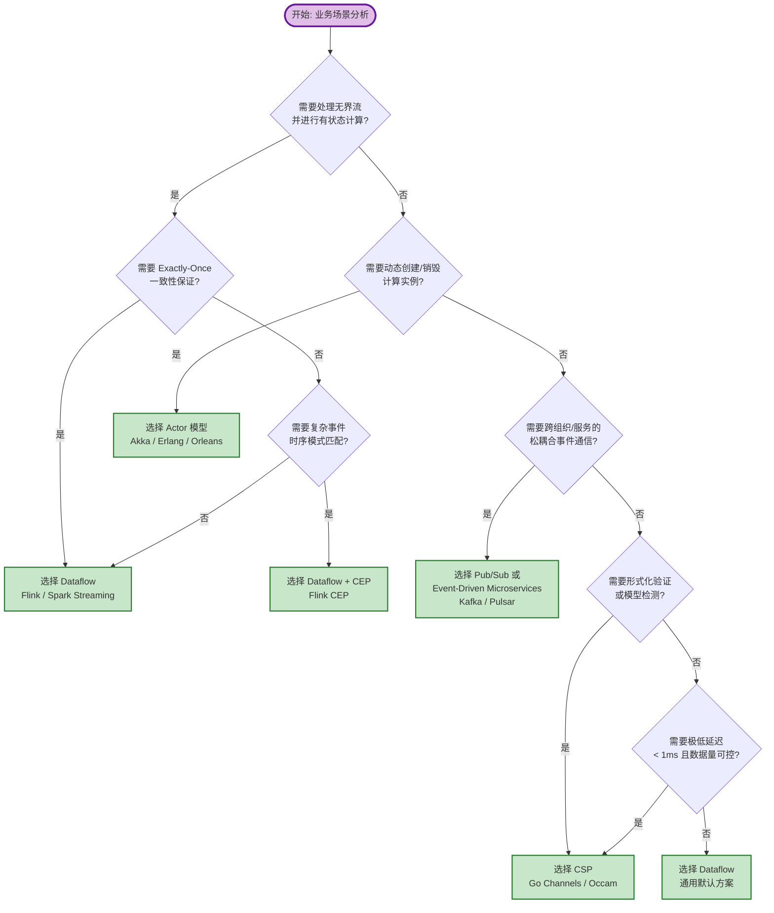
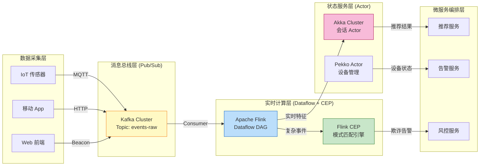

# 流计算模型概念图谱 (Streaming Models MindMap)

> 所属阶段: Knowledge/01-concept-atlas | 前置依赖: [../../Struct/01-foundation/01.02-process-calculus-primer.md](../../Struct/01-foundation/01.02-process-calculus-primer.md), [../../Struct/01-foundation/01.04-dataflow-model-formalization.md](../../Struct/01-foundation/01.04-dataflow-model-formalization.md) | 形式化等级: L3 (工程概念层)

---

## 目录

- [流计算模型概念图谱 (Streaming Models MindMap)](#流计算模型概念图谱-streaming-models-mindmap)
  - [目录](#目录)
  - [1. 概念定义 (Definitions)](#1-概念定义-definitions)
    - [Def-K-01-01 流计算模型 (Streaming Computation Model)](#def-k-01-01-流计算模型-streaming-computation-model)
    - [Def-K-01-02 Dataflow 模型](#def-k-01-02-dataflow-模型)
    - [Def-K-01-03 Actor 模型](#def-k-01-03-actor-模型)
    - [Def-K-01-04 CSP (Communicating Sequential Processes)](#def-k-01-04-csp-communicating-sequential-processes)
    - [Def-K-01-05 Pub/Sub (发布-订阅)](#def-k-01-05-pubsub-发布-订阅)
    - [Def-K-01-06 CEP (Complex Event Processing)](#def-k-01-06-cep-complex-event-processing)
    - [Def-K-01-07 微服务流 (Microservices Streaming)](#def-k-01-07-微服务流-microservices-streaming)
  - [2. 属性推导 (Properties)](#2-属性推导-properties)
    - [Prop-K-01-01 (Dataflow 的确定性保证)](#prop-k-01-01-dataflow-的确定性保证)
    - [Prop-K-01-02 (Actor 的局部顺序一致性)](#prop-k-01-02-actor-的局部顺序一致性)
    - [Prop-K-01-03 (CSP 的背压内建性)](#prop-k-01-03-csp-的背压内建性)
    - [Prop-K-01-04 (Pub/Sub 的吞吐-延迟权衡)](#prop-k-01-04-pubsub-的吞吐-延迟权衡)
    - [Prop-K-01-05 (CEP 的表达能力与状态爆炸)](#prop-k-01-05-cep-的表达能力与状态爆炸)
  - [3. 关系建立 (Relations)](#3-关系建立-relations)
    - [关系 1: Dataflow `≈` Actor（图灵完备等价）](#关系-1-dataflow-≈-actor图灵完备等价)
    - [关系 2: Dataflow `↦` CSP（异步 vs 同步的连续统）](#关系-2-dataflow-↦-csp异步-vs-同步的连续统)
    - [关系 3: Pub/Sub `⊂` Actor（解耦是地址匿名化的特例）](#关系-3-pubsub-⊂-actor解耦是地址匿名化的特例)
    - [关系 4: CEP `⊂` Dataflow（模式匹配是有状态算子的语法糖）](#关系-4-cep-⊂-dataflow模式匹配是有状态算子的语法糖)
    - [图 3.1 流计算模型分类心智图](#图-31-流计算模型分类心智图)
  - [4. 论证过程 (Argumentation)](#4-论证过程-argumentation)
    - [引理 4.1 (静态拓扑模型的调度可优化性)](#引理-41-静态拓扑模型的调度可优化性)
    - [引理 4.2 (动态拓扑模型的扩展弹性)](#引理-42-动态拓扑模型的扩展弹性)
    - [表 4.1 流计算模型六维对比矩阵](#表-41-流计算模型六维对比矩阵)
  - [5. 形式证明 / 工程论证 (Proof / Engineering Argument)](#5-形式证明-工程论证-proof-engineering-argument)
    - [定理 5.1 (流计算模型选型的充分条件)](#定理-51-流计算模型选型的充分条件)
    - [图 5.1 流计算模型选型决策树](#图-51-流计算模型选型决策树)
    - [引理 5.2 (混合模型的组合边界)](#引理-52-混合模型的组合边界)
  - [6. 实例验证 (Examples)](#6-实例验证-examples)
    - [示例 6.1 Dataflow 实例：实时用户行为分析（Flink）](#示例-61-dataflow-实例实时用户行为分析flink)
    - [示例 6.2 Actor 实例：物联网设备会话管理（Akka）](#示例-62-actor-实例物联网设备会话管理akka)
    - [示例 6.3 CSP 实例：高并发限流器（Go）](#示例-63-csp-实例高并发限流器go)
    - [示例 6.4 CEP + Pub/Sub 混合实例：金融风控实时告警](#示例-64-cep-pubsub-混合实例金融风控实时告警)
  - [7. 可视化 (Visualizations)](#7-可视化-visualizations)
    - [图 7.1 混合架构参考图：端到端流处理系统](#图-71-混合架构参考图端到端流处理系统)
  - [8. 引用参考 (References)](#8-引用参考-references)

## 1. 概念定义 (Definitions)

### Def-K-01-01 流计算模型 (Streaming Computation Model)

**定义**：流计算模型是一类针对**无界、持续到达数据序列**进行实时处理的计算范式抽象，其核心特征是将计算表达为数据在拓扑节点间的流动（flow），而非传统的"输入→计算→输出"批处理模式。

**工程直觉**：想象一条自动化装配流水线——零件（数据记录）源源不断地进入传送带，各个工位（算子/进程）按固定节奏对经过的零件进行加工。流模型关注的是"如何组织这条流水线"，而非"某个批次订单何时完成"。

**形式化锚点**：该定义的理论根基来自 Kahn 进程网络（KPN）中的连续函数语义与 FIFO 通道假设[^1]，详见 [Struct/01-foundation/01.04-dataflow-model-formalization.md](../../Struct/01-foundation/01.04-dataflow-model-formalization.md)。

---

### Def-K-01-02 Dataflow 模型

**定义**：Dataflow 模型将计算表达为一个有向图 $G=(V,E)$，其中顶点 $V$ 代表**算子（Operator）**，边 $E$ 代表**数据依赖通道**。数据以离散记录（Record）或令牌（Token）的形式在边上流动，算子在输入可用时被触发（fire）。

**变体层次**：

- **SDF (Synchronous Dataflow)**：静态生产-消费率，适用于 DSP 和嵌入式实时系统。
- **DDF (Dynamic Dataflow)**：动态生产-消费率，支持数据依赖的控制流（条件分支、迭代），是通用流处理引擎（Flink、Spark Streaming）的理论基础[^2]。

**关键工程属性**：

- 确定性（Determinism）：Kahn 语义保证输出历史唯一，与调度顺序无关。
- 并行度显式化：每个算子可配置独立并行度 $\lambda: V \to \mathbb{N}^+$。
- 时间语义内建：支持 EventTime / ProcessingTime / IngestionTime 三种时间抽象。

---

### Def-K-01-03 Actor 模型

**定义**：Actor 模型将计算抽象为一组独立的、通过**异步消息传递**进行交互的自治实体（Actor）。每个 Actor 封装了私有状态、邮箱（Mailbox）和行为函数，其生命周期内遵循"接收一条消息 → 更新状态 → 发送零条或多条消息"的串行处理模式[^3]。

**形式化对应**：在 Aπ (Actor π-Calculus) 中，Actor 配置可表示为 $\langle \alpha, \mu, P \rangle$，其中 $\alpha$ 是唯一地址，$\mu$ 是消息队列，$P$ 是行为进程。详见 [Struct/01-foundation/01.02-actor-model-formalization.md](../../Struct/01-foundation/01.03-actor-model-formalization.md)。

**工程直觉**：Actor 像是一群通过邮件往来的独立办公室职员。每个职员有自己的办公桌（状态）和收件箱（mailbox），处理邮件时不会被打扰（单线程语义），也可以给任意已知地址的同事发新邮件（动态拓扑）。

---

### Def-K-01-04 CSP (Communicating Sequential Processes)

**定义**：CSP 是一种基于**同步握手通信**的并发模型。进程通过显式命名的通道（Channel）进行交互，发送方和接收方必须同时在通道上就绪，通信才能完成。CSP 强调组合性代数（parallel composition、choice、hiding）与迹语义（trace semantics）分析[^4]。

**工程直觉**：CSP 的同步通信像是一次电话通话——双方必须同时拿起话筒才能交谈。如果一方未就绪，另一方会阻塞等待。这种" rendezvous "机制天然提供了背压（backpressure）和同步点。

**形式化锚点**：CSP 语法核心包括 $P \mathbin{\Box} Q$（外部选择）、$P \parallel_A Q$（同步并行）和 $P \setminus A$（隐藏）。详见 [Struct/01-foundation/01.03-csp-formalization.md](../../Struct/01-foundation/01.05-csp-formalization.md)。

---

### Def-K-01-05 Pub/Sub (发布-订阅)

**定义**：Pub/Sub 是一种以**主题（Topic）为中心**的消息分发范式。发布者（Publisher）将消息发送到逻辑主题，订阅者（Subscriber）通过订阅主题异步接收消息。发布者与订阅者之间完全解耦，无需知道对方的存在[^5]。

**与 Actor 的区别**：Pub/Sub 是"地址匿名化"的消息传递——消息不是发给某个特定 Actor，而是发到一个逻辑广播频道。这使得系统可以支持多对多通信，但失去了对消息接收者生命周期的直接控制。

---

### Def-K-01-06 CEP (Complex Event Processing)

**定义**：CEP 是一种在原始事件流上识别**复杂模式（Pattern）**的流计算变体。它将事件序列视为时间上的结构体，通过声明式规则（如 "A 发生后 5 分钟内出现 B，且期间没有 C"）从低层事件推导高层业务事件[^6]。

**与 Dataflow 的关系**：CEP 可以被视为 Dataflow 模型之上的一层"模式匹配 DSL"。在 Flink 中，CEP 库将模式规则编译为 NFA（Non-deterministic Finite Automaton），再嵌入到 DataStream 算子中执行。

---

### Def-K-01-07 微服务流 (Microservices Streaming)

**定义**：微服务流不是单一的理论模型，而是将流式数据交互作为服务间通信主路径的架构风格。它通常组合了 Pub/Sub（事件总线）、REST/gRPC（同步请求）和 Saga（长事务）模式，强调组织边界、独立部署和最终一致性[^7]。

**工程直觉**：如果说 Dataflow 是"单一大脑内的神经信号传递"，微服务流则是"多个独立大脑通过公共公告板交换信息"。关注点从"单个计算图的正确性"转向了"跨服务边界的契约与治理"。

---

## 2. 属性推导 (Properties)

### Prop-K-01-01 (Dataflow 的确定性保证)

**陈述**：在 Kahn 语义下，只要通道满足 FIFO 假设且算子是 Scott 连续函数，Dataflow 图的输出对于给定输入历史是唯一确定的，与算子的物理执行顺序无关。

**工程意义**：这意味着我们可以在不改变结果正确性的前提下，自由调整算子的调度策略、并行度分配或执行位置（本地/远程/容器）。这是 Flink 能够进行透明扩缩容和故障恢复的理论基础。

**来源**：该性质直接来自 Kahn Process Network 的不动点语义，详见 [Struct/02-properties/02.01-kahn-determinism.md](../../Struct/02-properties/02.01-determinism-in-streaming.md)。

---

### Prop-K-01-02 (Actor 的局部顺序一致性)

**陈述**：对于单个 Actor 实例，消息处理顺序严格等于 Mailbox 的入队顺序（FIFO），状态修改顺序与消息处理顺序一致。因此，单 Actor 内部不存在数据竞争。

**工程意义**：开发者无需在单 Actor 内部使用锁机制。但跨 Actor 的状态一致性需要通过消息传递的因果顺序（causal ordering）或外部协调机制（如两阶段提交）来保证。

**边界条件**：如果使用了自定义 Mailbox（如优先级队列）或 Dispatcher 将多个 Actor 调度到同一线程池，上述保证可能需要重新审视。

---

### Prop-K-01-03 (CSP 的背压内建性)

**陈述**：由于 CSP 的同步通信要求发送方和接收方同时就绪，当接收方处理速度低于发送方时，发送方会自然阻塞。这种阻塞行为等价于一种零额外开销的背压机制。

**工程意义**：在 Go 的 channel 实现中，无缓冲 channel 直接提供了 CSP 式的背压；而有缓冲 channel 则是 KPN 与 CSP 的折中——当缓冲区满时，发送方才阻塞。

---

### Prop-K-01-04 (Pub/Sub 的吞吐-延迟权衡)

**陈述**：Pub/Sub 系统通过引入持久化消息日志（如 Kafka 的 Log）和批处理消费来提升吞吐量，但代价是增加了端到端延迟。该权衡可形式化为：$\text{Latency} \propto \text{BatchSize} / \text{Throughput}$。

**工程意义**：在需要极低延迟（<10ms）的场景中，纯 Pub/Sub 往往不是最优选择；此时应倾向于 Dataflow（如 Flink）的直接网络传输或 CSP 的同步通道。

---

### Prop-K-01-05 (CEP 的表达能力与状态爆炸)

**陈述**：CEP 的模式表达能力与其内部状态机的状态数成正比。支持 Kleene 闭包（$A+$）、时间窗口和否定模式（$A$ 后没有 $B$）的 CEP 引擎，其内部 NFA 状态空间在最坏情况下呈指数级增长。

**工程意义**：过于复杂的 CEP 规则（如嵌套 5 层以上的 followedBy）会导致内存占用激增和匹配延迟增加。工程实践中建议将复杂模式拆分为多个简单子模式，通过中间 Topic 串联。

---

## 3. 关系建立 (Relations)

### 关系 1: Dataflow `≈` Actor（图灵完备等价） {#关系-1-dataflow--actor图灵完备等价}

**论证**：

- **Dataflow → Actor 编码**：每个 Dataflow 算子可以映射为一个 Actor，算子间的数据边映射为 Actor 间的消息通道，KeyedState 映射为 Actor 的私有状态。
- **Actor → Dataflow 编码**：每个 Actor 映射为 Dataflow 图中的一个有状态算子，Mailbox 映射为输入缓冲区，ActorRef 地址映射为虚拟分区键（Key）。

**差异点**：

| 维度 | Dataflow | Actor |
|------|----------|-------|
| 拓扑动态性 | 静态 DAG（运行期不可变） | 动态（可 spawn 新 Actor） |
| 状态共享 | Keyed State（按键分区共享） | 严格私有 |
| 容错策略 | Checkpoint + 重放 | 监督树（Supervision Tree） |
| 时间抽象 | EventTime / Watermark | 无内建时间模型 |

> **推断 [Theory→Model]**: Dataflow 与 Actor 在图灵完备意义上表达能力等价，但工程选型时应关注"拓扑是否动态"和"时间语义是否重要"[^8]。

---

### 关系 2: Dataflow `↦` CSP（异步 vs 同步的连续统） {#关系-2-dataflow--csp异步-vs-同步的连续统}

**论证**：

- Kahn 网络中的 FIFO 通道可以编码为 CSP 中的无限缓冲进程 $B = \mu X.(in?x \to out!x \to X)$。
- 差异在于：CSP 默认同步通信，而 Dataflow 默认异步通信（算子之间通过有界/无界缓冲区解耦）。
- Flink 的 Network Buffer Pool 和 Go 的有缓冲 channel 都是两者在工程上的折中实现。

---

### 关系 3: Pub/Sub `⊂` Actor（解耦是地址匿名化的特例） {#关系-3-pubsub--actor解耦是地址匿名化的特例}

**论证**：

- Pub/Sub 中的 "Topic" 可以看作一个特殊的 Broker Actor，所有 Publisher 向该 Actor 发送消息，Broker 再将消息广播给所有 Subscriber。
- 因此，Pub/Sub 是 Actor 模型的一种受限用法：Publisher 不知道 Subscriber 的具体地址，只知道 Broker 的地址。
- 这种匿名化带来了松耦合，但也丧失了 Actor 模型中"直接知道接收方生命周期"的能力。

---

### 关系 4: CEP `⊂` Dataflow（模式匹配是有状态算子的语法糖） {#关系-4-cep--dataflow模式匹配是有状态算子的语法糖}

**论证**：

- CEP 引擎（如 Flink CEP）的底层执行模型仍然是 Dataflow。模式规则被编译为状态机算子，嵌入到 DataStream DAG 中。
- CEP 在 Dataflow 基础上增加了时间窗口语义和 NFA 状态转移逻辑，但并未扩展 Dataflow 的基本表达能力。

---

### 图 3.1 流计算模型分类心智图

以下心智图展示了六种核心流计算模型在"控制驱动 vs 数据驱动"、"同步 vs 异步"连续统中的位置，以及它们与底层形式理论的映射关系。

```mermaid
graph TB
    subgraph "形式理论基础"
        FORMAL_KPN[KPN / Dataflow 理论<br/>see Struct/01-foundation/01.04]
        FORMAL_ACTOR[Actor Calculus Aπ<br/>see Struct/01-foundation/01.02]
        FORMAL_CSP[CSP 进程代数<br/>see Struct/01-foundation/01.03]
    end

    subgraph "流计算模型谱系"
        ROOT[流计算模型]
        ROOT --> DATA_DRIVEN[数据驱动 Data-Driven]
        ROOT --> MSG_DRIVEN[消息驱动 Message-Driven]
        ROOT --> SYNC_DRIVEN[同步控制 Sync-Control]

        DATA_DRIVEN --> DATAFLOW[Dataflow 模型<br/>Flink / Spark Streaming]
        DATA_DRIVEN --> CEP[CEP 复杂事件处理<br/>Flink CEP / Drools]

        MSG_DRIVEN --> ACTOR[Actor 模型<br/>Akka / Erlang / Orleans]
        MSG_DRIVEN --> PUBSUB[Pub/Sub 发布订阅<br/>Kafka / Pulsar / RabbitMQ]
        MSG_DRIVEN --> MICRO[Microservices 微服务流<br/>Event-Driven Architecture]

        SYNC_DRIVEN --> CSP_IMPL[CSP 实现<br/>Go Channels / Occam]
    end

    subgraph "关键区分维度"
        DIM1[拓扑动态性]<-->DIM1A[静态 DAG] & DIM1B[动态拓扑]
        DIM2[通信语义]<-->DIM2A[异步 FIFO] & DIM2B[同步握手]
        DIM3[时间抽象]<-->DIM3A[内建 EventTime] & DIM3B[无内建时间]
    end

    DATAFLOW -->|静态 DAG| DIM1A
    CEP -->|静态 DAG| DIM1A
    ACTOR -->|动态 spawn| DIM1B
    PUBSUB -->|动态订阅| DIM1B
    MICRO -->|动态服务发现| DIM1B

    DATAFLOW -->|异步 FIFO| DIM2A
    CEP -->|异步 FIFO| DIM2A
    ACTOR -->|异步消息| DIM2A
    PUBSUB -->|异步广播| DIM2A
    CSP_IMPL -->|同步握手| DIM2B

    DATAFLOW -->|EventTime / Watermark| DIM3A
    CEP -->|基于窗口时间| DIM3A
    ACTOR -->|无内建时间| DIM3B
    PUBSUB -->|无内建时间| DIM3B
    CSP_IMPL -->|无内建时间| DIM3B

    FORMAL_KPN --> DATAFLOW
    FORMAL_KPN --> CEP
    FORMAL_ACTOR --> ACTOR
    FORMAL_ACTOR --> PUBSUB
    FORMAL_ACTOR --> MICRO
    FORMAL_CSP --> CSP_IMPL

    style ROOT fill:#e1bee7,stroke:#6a1b9a,stroke-width:3px
    style DATAFLOW fill:#bbdefb,stroke:#1565c0
    style ACTOR fill:#bbdefb,stroke:#1565c0
    style CSP_IMPL fill:#bbdefb,stroke:#1565c0
    style CEP fill:#c8e6c9,stroke:#2e7d32
    style PUBSUB fill:#c8e6c9,stroke:#2e7d32
    style MICRO fill:#c8e6c9,stroke:#2e7d32
```



**图说明**：

- 紫色根节点代表"流计算模型"这一总范畴。
- 蓝色节点为独立的理论基础流派（Dataflow、Actor、CSP）。
- 绿色节点为基于蓝色节点构建的工程变体（CEP 基于 Dataflow，Pub/Sub 和 Microservices 基于 Actor 的异步消息思想）。
- 底层维度箭头展示了模型在拓扑、通信和时间三个核心属性上的分布。

---

## 4. 论证过程 (Argumentation)

### 引理 4.1 (静态拓扑模型的调度可优化性)

**陈述**：如果一个流计算模型的拓扑在编译期完全确定（如 Dataflow SDF、CSP 有限控制子集），则其调度策略可以在运行前进行静态分析和优化。

**工程论证**：

1. **前提分析**：Dataflow SDF 的生产-消费率是编译期常数，拓扑矩阵 $\Gamma$ 可以完全构造。CSP 的通道集合也是语法层静态的（见 [Struct/01-foundation/01.03-csp-formalization.md](../../Struct/01-foundation/01.05-csp-formalization.md)）。
2. **推导**：对于 SDF，求解 $\Gamma \cdot r = 0$ 可得到周期调度向量 $r$，进而计算关键路径和最大吞吐量。对于 CSP，FDR 等模型检测工具可以对有限状态子集进行穷尽验证。
3. **结论**：静态拓扑模型适合对延迟、吞吐或正确性有严格要求的领域（如 DSP、航空航天控制）。

---

### 引理 4.2 (动态拓扑模型的扩展弹性)

**陈述**：如果一个流计算模型支持运行期动态创建新节点（如 Actor 的 spawn、π-Calculus 的 $(\nu a)$），则系统可以根据负载自动扩展或收缩计算资源。

**工程论证**：

1. **前提分析**：Actor 的 `spawn` 操作可以创建具有独立 mailbox 和状态的新实例（见 [Struct/01-foundation/01.02-actor-model-formalization.md](../../Struct/01-foundation/01.03-actor-model-formalization.md)）。
2. **推导**：在 Akka Cluster 中，Actor 可以根据消息队列长度自动启动新实例（通过 Router/Pool 机制），或将 Actor 迁移到负载较低的节点。
3. **结论**：动态拓扑模型更适合负载波动大、需要弹性伸缩的互联网服务场景。

---

### 表 4.1 流计算模型六维对比矩阵

以下矩阵从工程选型的关键维度对比了六种流计算模型。评分采用 1-5 星制，★ 越多表示在该维度上表现越优。

| 维度 | Dataflow | Actor | CSP | Pub/Sub | CEP | Microservices |
|------|:--------:|:-----:|:---:|:-------:|:---:|:-------------:|
| **延迟 (Latency)** | ★★★☆☆<br/>(ms~s 级) | ★★★☆☆<br/>(μs~ms 级) | ★★★★☆<br/>(μs~ms 级) | ★★☆☆☆<br/>(ms~s 级) | ★★★☆☆<br/>(ms~s 级) | ★★☆☆☆<br/>(ms~s 级) |
| **吞吐 (Throughput)** | ★★★★★<br/>(高并行批处理) | ★★★☆☆<br/>(受限于 mailbox) | ★★★☆☆<br/>(同步开销大) | ★★★★★<br/>(磁盘顺序写) | ★★★☆☆<br/>(状态机匹配开销) | ★★★☆☆<br/>(网络序列化开销) |
| **状态管理** | ★★★★★<br/>(内建 Keyed/Operator State) | ★★★☆☆<br/>(私有状态，需手动持久化) | ★★☆☆☆<br/>(无内建状态) | ★★☆☆☆<br/>(Offset 管理) | ★★★★☆<br/>(NFA 状态窗口) | ★★★☆☆<br/>( Saga / 事件溯源 ) |
| **容错能力** | ★★★★★<br/>(Checkpoint +  Exactly-Once) | ★★★☆☆<br/>(监督树 + 持久化 Actor) | ★★★☆☆<br/>(进程重启) | ★★★★☆<br/>(多副本 + 重放) | ★★★★☆<br/>(依托底层 Dataflow) | ★★★☆☆<br/>( Saga / 补偿事务 ) |
| **表达能力** | ★★★★☆<br/>(图灵完备，静态拓扑) | ★★★★★<br/>(图灵完备，动态拓扑) | ★★★☆☆<br/>(L4，静态通道) | ★★★☆☆<br/>(消息路由) | ★★★★☆<br/>(时序模式匹配) | ★★★★☆<br/>(组合多种模式) |
| **形式化可验证性** | ★★★★☆<br/>(SDF 可判定，DDF 受限) | ★★☆☆☆<br/>(一般不可判定) | ★★★★★<br/>(FDR 模型检测) | ★★☆☆☆<br/>(协议验证为主) | ★★★☆☆<br/>(模式正确性验证) | ★★☆☆☆<br/>(契约测试为主) |

**矩阵解读**：

- **Dataflow** 在吞吐、状态管理和容错上表现最强，是"大规模有状态流处理"的首选。
- **Actor** 在表达能力和动态拓扑上最优，适合需要运行期创建/销毁计算实体、且对延迟敏感的场景。
- **CSP** 在延迟和形式化可验证性上占优，但吞吐和状态管理较弱，适合可验证的高并发控制和资源协调。
- **Pub/Sub** 吞吐最高，但延迟和状态管理较弱，适合解耦系统、日志聚合和事件总线。
- **CEP** 是 Dataflow 的能力增强包，专门解决"时序模式匹配"问题，不适合作为通用计算模型单独使用。
- **Microservices** 是架构层面的组合模型，其流处理能力取决于底层具体使用了 Pub/Sub、REST 还是 Actor。

---

## 5. 形式证明 / 工程论证 (Proof / Engineering Argument)

### 定理 5.1 (流计算模型选型的充分条件)

**陈述**：给定一个业务场景，若其满足以下条件集合中的某个子集，则存在唯一最优（帕累托最优）的流计算模型推荐。

**条件集合**：

- $C_1$: 需要处理无界数据流并进行有状态聚合（如窗口计算）。
- $C_2$: 需要严格的端到端一致性保证（Exactly-Once）。
- $C_3$: 需要运行期动态创建/销毁计算实例。
- $C_4$: 需要复杂的事件时序模式匹配。
- $C_5$: 需要跨组织/服务的松耦合通信。
- $C_6$: 需要形式化验证或模型检测。
- $C_7$: 需要极低的端到端延迟（< 1ms）且数据量可控。

**工程论证（决策树推导）**：

1. 若 $C_1 \land C_2$ 为真 → 选择 **Dataflow**（Flink）。Dataflow 模型内建了状态管理和 Checkpoint 机制，是目前唯一在工业规模上成熟支持 Exactly-Once 有状态流处理的模型。
2. 若 $C_3$ 为真且 $C_1$ 为假 → 选择 **Actor**（Akka/Pekko）。Actor 的动态 spawn 和地址传递能力在六模型中最强。
3. 若 $C_4$ 为真 → 在 **Dataflow** 之上叠加 **CEP**。CEP 本身不解决通用计算问题，必须依托 Dataflow 执行引擎。
4. 若 $C_5$ 为真且 $C_1 \land C_2$ 为假 → 选择 **Pub/Sub** 或 **Microservices**。当重点是服务解耦而非实时计算正确性时，Kafka / Pulsar 等消息总线是最经济的选择。
5. 若 $C_6$ 为真且 $C_3$ 为假 → 选择 **CSP**（Go/Occam）。CSP 的静态通道性质使得 FDR 等模型检测工具能够进行穷尽验证。
6. 若 $C_7$ 为真且 $C_1$ 为假 → 选择 **CSP** 的同步通信。CSP 的 rendezvous 机制消除了缓冲队列引入的排队延迟。

---

### 图 5.1 流计算模型选型决策树

以下决策树将上述六个条件编码为可交互的决策路径，帮助工程师快速定位适合自身场景的模型。



**决策树使用说明**：

- 菱形节点为决策问题，按优先级从高到低排列。
- 绿色椭圆节点为最终推荐。若多个条件同时满足，优先选择路径上先到达的叶子节点。
- 对于大多数互联网数据管道场景，**Dataflow（Flink）** 是保守但可靠的默认选择。

---

### 引理 5.2 (混合模型的组合边界)

**陈述**：在实际工程中，单一的流计算模型往往不足以覆盖整个系统。不同模型可以在系统边界处组合，但需要满足类型兼容、顺序保持和背压协调三个条件（参见 [Struct/03-relationships/03.02-hybrid-system-composition.md](../../Struct/03-relationships/03.02-flink-to-process-calculus.md)）。

**工程建议**：

- **Dataflow + Pub/Sub**：用 Kafka 作为 Flink 的 Source/Sink，实现"计算与存储解耦"。此时 Kafka Topic 的 partition 数应不小于 Flink Source 的并行度，以避免背压不均。
- **Actor + Dataflow**：用 Akka 处理用户请求和会话状态，用 Flink 处理后台批量分析。两者通过 Adapter（如 Akka Streams）桥接，需保证跨边界消息的类型一致和 FIFO 顺序。
- **CSP + Actor**：在 Go 微服务中，使用 gRPC（CSP 式的请求-响应）处理同步调用，使用 Kafka（Actor 式的异步消息）处理事件通知。

---

## 6. 实例验证 (Examples)

### 示例 6.1 Dataflow 实例：实时用户行为分析（Flink）

**场景**：电商平台需要实时统计每个用户在过去 5 分钟内的点击次数，用于动态推荐。

**模型选择依据**：该场景满足 $C_1$（有状态窗口聚合）和 $C_2$（推荐结果不能因故障而重复计算），因此选择 Dataflow（Flink）。

**核心代码骨架**：

```scala
val clicks: DataStream[ClickEvent] = env
  .addSource(new FlinkKafkaConsumer("clicks", schema, props))

val result = clicks
  .keyBy(_.userId)
  .window(TumblingEventTimeWindows.of(Time.minutes(5)))
  .aggregate(new ClickCountAggregate)
  .addSink(new FlinkKafkaProducer("recommendations", schema, props))
```

**模型对应关系**：

- `keyBy(_.userId)` → Dataflow 中的分区策略 $\pi$。
- `TumblingEventTimeWindows` → Dataflow 的时间窗口语义，依赖 Watermark 机制推进事件时间。
- `ClickCountAggregate` → 有状态算子，状态由 Flink 的 KeyedStateBackend 自动管理并通过 Checkpoint 持久化。

---

### 示例 6.2 Actor 实例：物联网设备会话管理（Akka）

**场景**：每个物联网设备连接到平台后，需要一个独立的会话 Actor 维护设备状态（在线/离线、固件版本、最后心跳时间）。当设备数从 1 万动态增长到 100 万时，系统需要弹性创建 Actor 实例。

**模型选择依据**：该场景满足 $C_3$（动态创建实例），且每个设备的状态天然隔离，因此选择 Actor 模型。

**核心代码骨架**：

```scala
class DeviceActor(deviceId: String) extends Actor {
  var status: DeviceStatus = DeviceStatus.Online
  var lastHeartbeat: Long = System.currentTimeMillis()

  def receive = {
    case Heartbeat(ts) =>
      lastHeartbeat = ts
      status = DeviceStatus.Online
    case GetStatus =>
      sender() ! status
    case TerminateSession =>
      context.stop(self)
  }
}

// 动态创建
val deviceActor = system.actorOf(
  Props(new DeviceActor(deviceId)),
  name = s"device-$deviceId"
)
```

**模型对应关系**：

- `DeviceActor` → Actor 配置 $\langle \alpha, \mu, P \rangle$ 中的行为进程 $P$。
- `var status` → Actor 的私有状态 $\sigma$。
- `context.stop(self)` → Actor 生命周期的动态终止，对应 Aπ 中的配置消失。

---

### 示例 6.3 CSP 实例：高并发限流器（Go）

**场景**：API 网关需要对下游服务进行精确限流：每秒最多处理 1000 个请求，超出的请求需要立即拒绝或排队等待。

**模型选择依据**：该场景要求严格的同步协调（令牌获取与请求处理必须原子完成），且状态简单（一个计数器），因此选择 CSP（Go channel）。

**核心代码骨架**：

```go
func rateLimiter(requests <-chan Request, responses chan<- Response) {
    ticker := time.NewTicker(time.Millisecond)
    tokens := make(chan struct{}, 1000)

    go func() {
        for range ticker.C {
            select {
            case tokens <- struct{}{}:
            default:
            }
        }
    }()

    for req := range requests {
        <-tokens  // CSP 同步: 必须等到令牌才能继续
        responses <- process(req)
    }
}
```

**模型对应关系**：

- `tokens <- struct{}{}` 和 `<-tokens` → CSP 中的同步通道通信 $c!v$ 和 $c?x$。
- `make(chan struct{}, 1000)` → 有界缓冲区，是 KPN 无限 FIFO 与 CSP 同步通道的工程折中。

---

### 示例 6.4 CEP + Pub/Sub 混合实例：金融风控实时告警

**场景**：银行交易流中，若同一账户在 30 秒内于两个不同国家发生 ATM 取款，则触发欺诈告警。告警信息通过 Kafka 推送到风控中心。

**模型选择依据**：该场景满足 $C_4$（复杂时序模式：A 国取款后 30 秒内 B 国取款），同时需要跨系统的松耦合通知，因此选择 **Dataflow + CEP** 处理模式匹配，**Pub/Sub** 分发告警。

**核心模式定义（Flink CEP）**：

```scala
val pattern = Pattern
  .begin[Transaction]("first")
  .where(_.country == "A")
  .next("second")
  .where(_.country == "B")
  .within(Time.seconds(30))

val alerts = CEP.pattern(transactions.keyBy(_.accountId), pattern)
  .process(new FraudAlertHandler)
  .addSink(new FlinkKafkaProducer("fraud-alerts", schema, props))
```

**模型对应关系**：

- `Pattern.begin(...).next(...).within(...)` → CEP 的声明式模式语言，底层编译为 NFA 状态转移图。
- `FlinkKafkaProducer` → 将计算结果发布到 Pub/Sub 系统，完成从"实时计算"到"事件通知"的模型过渡。

---

## 7. 可视化 (Visualizations)

### 图 7.1 混合架构参考图：端到端流处理系统

以下架构图展示了一个典型的现代企业级流处理系统如何组合使用 Dataflow、Actor、Pub/Sub 和 Microservices 四种模型。



**图说明**：

- **Pub/Sub（Kafka）** 作为系统的"主动脉"，承担数据持久化和解耦职责。
- **Dataflow（Flink）** 负责高吞吐、有状态的实时计算。
- **CEP** 在 Flink 内部识别异常模式并触发下游动作。
- **Actor（Akka/Pekko）** 管理长生命周期的用户/设备会话状态。
- **Microservices** 接收计算结果并提供业务 API。

---

## 8. 引用参考 (References)

[^1]: Kahn, G. (1974). "The semantics of a simple language for parallel programming." IFIP Congress.
[^2]: Lee, E.A. & Messerschmitt, D.G. (1987). "Synchronous data flow." Proc. IEEE, 75(9).
[^3]: Agha, G. (1986). "Actors: A Model of Concurrent Computation in Distributed Systems." MIT Press.
[^4]: Hoare, C.A.R. (1978). "Communicating Sequential Processes." CACM, 21(8).
[^5]: Eugster, P.T. et al. (2003). "The many faces of publish/subscribe." ACM Computing Surveys, 35(2).
[^6]: Luckham, D.C. (2002). "The Power of Events: An Introduction to Complex Event Processing in Distributed Enterprise Systems." Addison-Wesley.
[^7]: Newman, S. (2021). "Building Microservices: Designing Fine-Grained Systems." 2nd ed., O'Reilly.
[^8]: Akidau, T. et al. (2015). "The Dataflow Model: A Practical Approach to Balancing Correctness, Latency, and Cost in Massive-Scale, Unbounded, Out-of-Order Data Processing." PVLDB, 8(12).

---

**关联文档**：

- [../../Struct/01-foundation/01.02-process-calculus-primer.md](../../Struct/01-foundation/01.02-process-calculus-primer.md)
- [../../Struct/01-foundation/01.03-actor-model-formalization.md](../../Struct/01-foundation/01.03-actor-model-formalization.md)
- [../../Struct/01-foundation/01.05-csp-formalization.md](../../Struct/01-foundation/01.05-csp-formalization.md)
- [../../Struct/01-foundation/01.04-dataflow-model-formalization.md](../../Struct/01-foundation/01.04-dataflow-model-formalization.md)
- [../../Struct/02-properties/02.01-determinism-in-streaming.md](../../Struct/02-properties/02.01-determinism-in-streaming.md)
- [../../Struct/03-relationships/03.02-flink-to-process-calculus.md](../../Struct/03-relationships/03.02-flink-to-process-calculus.md)
