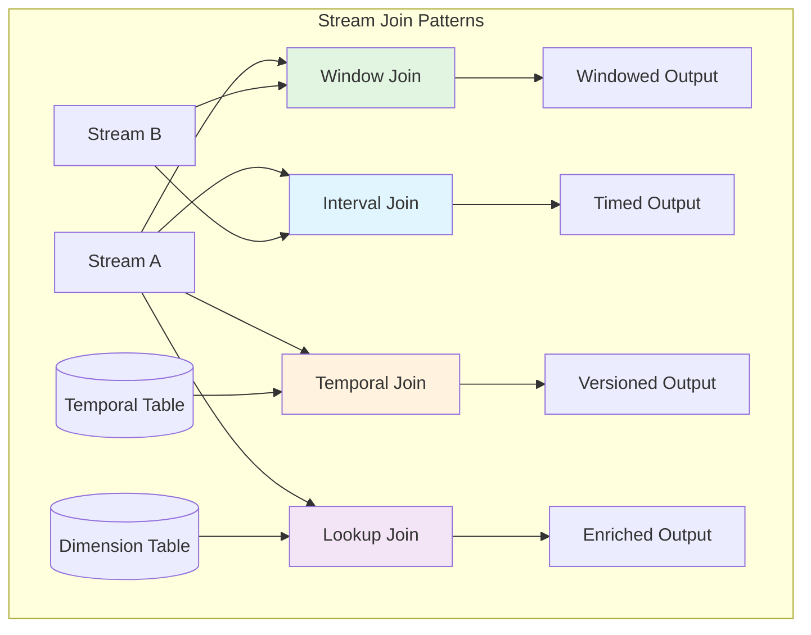
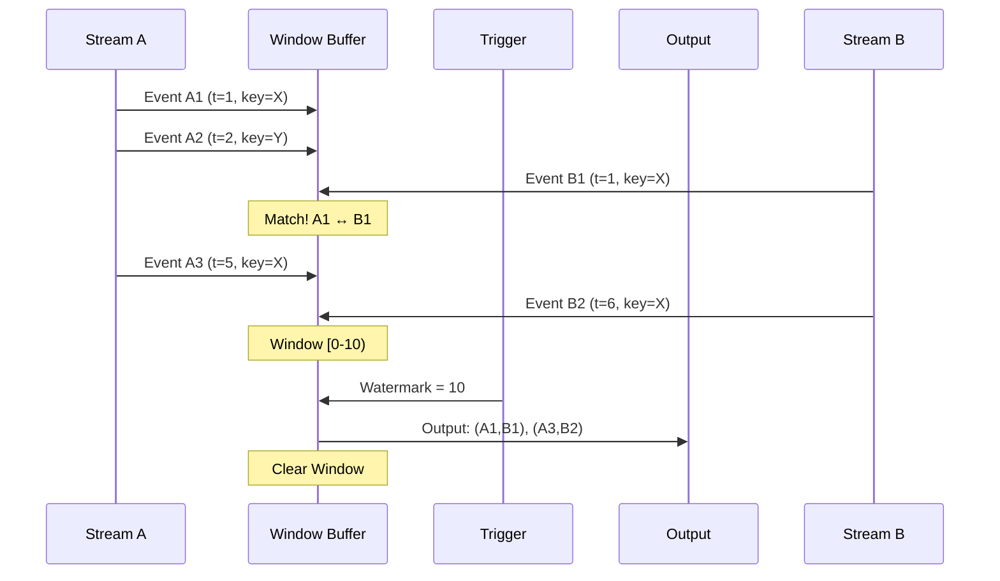
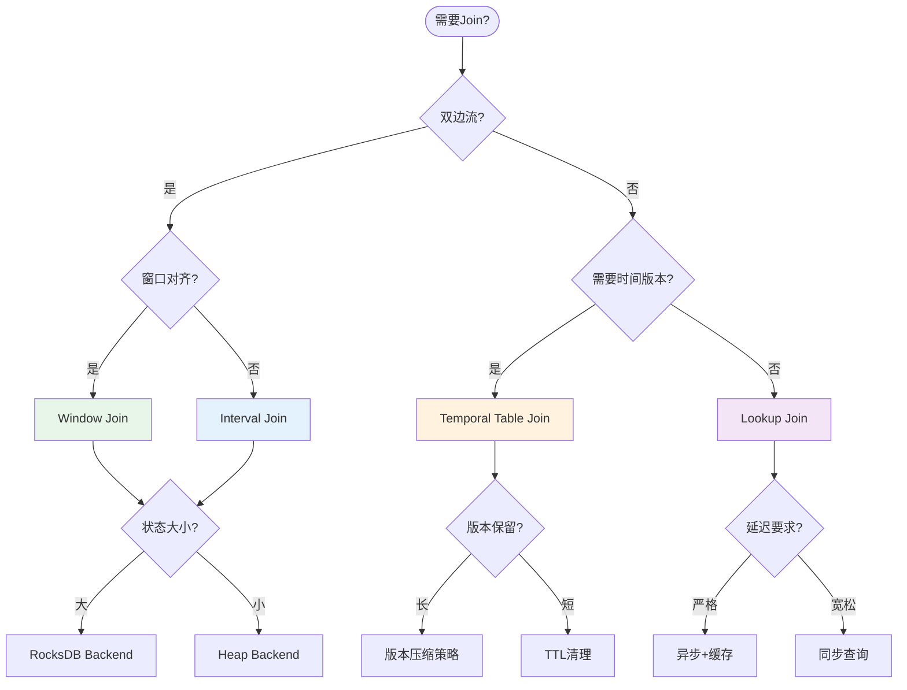

# Stream Join 模式

> **所属阶段**: Knowledge/02-design-patterns | **前置依赖**: [01.01-stream-processing-fundamentals.md](../01-concept-atlas/01.01-stream-processing-fundamentals.md) | **形式化等级**: L4-L5
>
> 本模式解决流计算中多流关联的核心挑战，提供五种标准Join模式及其形式化语义与工程实现。

---

## 目录

- [Stream Join 模式](#stream-join-模式)
  - [目录](#目录)
  - [1. 概念定义 (Definitions)](#1-概念定义-definitions)
    - [1.1 Stream Join 的本质](#11-stream-join-的本质)
    - [1.2 Window Join 模式](#12-window-join-模式)
    - [1.3 Interval Join 模式](#13-interval-join-模式)
    - [1.4 Temporal Table Join 模式](#14-temporal-table-join-模式)
    - [1.5 Lookup Join 模式](#15-lookup-join-模式)
  - [2. 属性推导 (Properties)](#2-属性推导-properties)
    - [2.1 Join 模式的形式化性质](#21-join-模式的形式化性质)
    - [2.2 状态需求分析](#22-状态需求分析)
    - [2.3 语义保证层次](#23-语义保证层次)
  - [3. 关系建立 (Relations)](#3-关系建立-relations)
    - [3.1 Join 模式之间的映射关系](#31-join-模式之间的映射关系)
    - [3.2 与基础概念的关联](#32-与基础概念的关联)
    - [3.3 模式选择决策矩阵](#33-模式选择决策矩阵)
  - [4. 论证过程 (Argumentation)](#4-论证过程-argumentation)
    - [4.1 Window Join 的边界分析](#41-window-join-的边界分析)
    - [4.2 Interval Join 的完整性证明](#42-interval-join-的完整性证明)
    - [4.3 Temporal Join 的一致性挑战](#43-temporal-join-的一致性挑战)
    - [4.4 Lookup Join 的容错设计](#44-lookup-join-的容错设计)
  - [5. 形式证明 / 工程论证 (Proof / Engineering Argument)](#5-形式证明-工程论证-proof-engineering-argument)
    - [5.1 Interval Join 的正确性证明](#51-interval-join-的正确性证明)
    - [5.2 Temporal Join 的版本一致性](#52-temporal-join-的版本一致性)
    - [5.3 工程实现的最佳实践论证](#53-工程实现的最佳实践论证)
  - [6. 实例验证 (Examples)](#6-实例验证-examples)
    - [6.1 Window Join 实现示例](#61-window-join-实现示例)
    - [6.2 Interval Join 实现示例](#62-interval-join-实现示例)
    - [6.3 Temporal Table Join 实现示例](#63-temporal-table-join-实现示例)
    - [6.4 Lookup Join 实现示例](#64-lookup-join-实现示例)
  - [7. 可视化 (Visualizations)](#7-可视化-visualizations)
    - [7.1 Stream Join 模式总览](#71-stream-join-模式总览)
    - [7.2 Window Join 执行流程](#72-window-join-执行流程)
    - [7.3 Interval Join 时间范围示意](#73-interval-join-时间范围示意)
    - [7.4 Join 模式选择决策树](#74-join-模式选择决策树)
  - [8. 引用参考 (References)](#8-引用参考-references)

---

## 1. 概念定义 (Definitions)

### 1.1 Stream Join 的本质

**Def-K-02-01 [Stream Join]**: 给定两个数据流 $S_A = \{(k, a, t_a)\}$ 和 $S_B = \{(k, b, t_b)\}$，其中 $k$ 为Join Key，$a, b$ 为载荷，$t_a, t_b$ 为时间戳。Stream Join 定义为从两个流到输出流的映射：

$$
\text{Join}_\theta: S_A \times S_B \to S_{out}
$$

其中 $\theta$ 为Join谓词，典型形式包括：

- 等值谓词: $\theta_{eq}: k_A = k_B$
- 时间谓词: $\theta_{time}: |t_A - t_B| \leq \delta$
- 复合谓词: $\theta = \theta_{eq} \land \theta_{time}$

### 1.2 Window Join 模式

**Def-K-02-02 [Window Join]**: 设 $W_A$ 和 $W_B$ 分别为流 $A$ 和 $B$ 上的窗口算子，Tumbling Window Join 定义为：

$$
\text{WindowJoin}(S_A, S_B, \theta) = \bigcup_{w \in \mathcal{W}} \{(a, b) \mid a \in W_A(w), b \in W_B(w), \theta(a, b)\}
$$

其中 $\mathcal{W}$ 为时间窗口的集合，$w$ 为单个窗口实例。窗口Join的核心约束是**两边记录必须落入同一窗口实例**。

**时间窗口类型映射**:

| 窗口类型 | 数学定义 | Join语义特性 |
|---------|---------|-------------|
| Tumbling | $w_i = [iT, (i+1)T)$ | 无重叠，每条记录仅参与一个窗口Join |
| Sliding | $w_i = [iT, iT+S)$ | 有重叠，记录可参与多个窗口Join |
| Session | $w = [t_{start}, t_{end})$ 其中 $t_{end} - gap$ 无活动 | 动态边界，同Session内的记录Join |

### 1.3 Interval Join 模式

**Def-K-02-03 [Interval Join]**: 给定Interval边界 $\delta_{lower} \leq 0 \leq \delta_{upper}$，Interval Join 定义为：

$$
\text{IntervalJoin}(S_A, S_B) = \{(a, b) \mid k_a = k_b \land t_b + \delta_{lower} \leq t_a \leq t_b + \delta_{upper}\}
$$

与Window Join不同，Interval Join**不依赖全局窗口边界**，而是基于**记录对之间的时间关系**。

**方向性变体**:

- 前向Join ($A \to B$): $t_a \leq t_b \leq t_a + \delta$
- 后向Join ($B \to A$): $t_b \leq t_a \leq t_b + \delta$
- 双向Join: $|t_a - t_b| \leq \delta$

### 1.4 Temporal Table Join 模式

**Def-K-02-04 [Temporal Table]**: Temporal Table 是一个随时间演化的关系表 $T: \mathbb{T} \to \mathcal{P}(Row)$，其中 $\mathbb{T}$ 为时间域，$\mathcal{P}(Row)$ 为行集合的幂集。在时间 $t$ 的有效内容记为 $T[t]$。

**Def-K-02-05 [Temporal Table Join]**: 给定事件流 $S$ 和Temporal Table $T$，Temporal Join 定义为：

$$
\text{TemporalJoin}(S, T) = \{(s, T[t_s]) \mid s \in S, t_s = \text{timestamp}(s), k_s = k_{T[t_s]}\}
$$

关键特性：**流记录的事件时间决定查询表的历史版本**。

### 1.5 Lookup Join 模式

**Def-K-02-06 [Lookup Join]**: 给定流 $S$ 和外部维表 $D$（如MySQL、Redis、HBase），Lookup Join 定义为：

$$
\text{LookupJoin}(S, D) = \{(s, D(k_s)) \mid s \in S, k_s = \text{key}(s)\}
$$

其中 $D(k)$ 表示对维表的实时查询操作。Lookup Join 是**同步点查询**，具有以下特性：

- 查询延迟: $L_{query} = RTT_{external} + T_{process}$
- 无状态依赖: 不依赖流的历史状态
- 可能失败: 需处理查询超时、连接失败

---

## 2. 属性推导 (Properties)

### 2.1 Join 模式的形式化性质

**Lemma-K-02-01 [Window Join 的确定性]**: 在Event Time语义下，Window Join 的输出仅依赖于输入流的事件时间顺序，与物理到达顺序无关。

*证明概要*: 设 $W$ 为基于Event Time的窗口分配函数。对于任意记录 $r$，$W(r)$ 仅由 $t_e(r)$ 决定。因此对于固定输入集合 $\{r_i\}$，窗口分配是确定的。Join操作 $\bowtie_\theta$ 在确定的两组记录上也是确定的。□

**Lemma-K-02-02 [Interval Join 的时间复杂度]**: 设流 $A$ 和 $B$ 在区间 $[0, T]$ 内的事件数分别为 $n_A$ 和 $n_B$，Interval Join 的最坏时间复杂度为 $O(n_A \cdot n_B)$，但通过基于Key的分区和排序可优化至 $O(n_A \log n_A + n_B \log n_B + |output|)$。

**Lemma-K-02-03 [Temporal Join 的幂等性]**: 对于同一流记录 $s$，多次执行 Temporal Join 只要 $T[t_s]$ 不变，结果保持一致：

$$
\text{TemporalJoin}(s, T) = \text{TemporalJoin}(s, T'), \quad \text{if } T[t_s] = T'[t_s]
$$

### 2.2 状态需求分析

**Prop-K-02-01 [Join 模式状态需求对比]**:

| Join模式 | 状态类型 | 状态大小 | 过期策略 |
|---------|---------|---------|---------|
| Window Join | 窗口缓冲区 | $O(|W| \cdot \lambda)$ | 窗口触发后清理 |
| Interval Join | 时间有序缓冲区 | $O(\delta \cdot \lambda)$ | 时间边界过期 |
| Temporal Join | 表历史版本 | $O(|T| \cdot retention)$ | TTL或版本清理 |
| Lookup Join | 无/缓存 | $O(cache\_size)$ | TTL淘汰 |

其中 $|W|$ 为窗口大小，$\lambda$ 为事件到达率，$\delta$ 为Interval宽度。

### 2.3 语义保证层次

**Prop-K-02-02 [At-Least-Once 下的 Join 语义]**:

- Window Join: 可能产生重复输出（窗口重算）
- Interval Join: 可能产生重复输出对
- Temporal Join: 可能重复查询同一历史版本
- Lookup Join: 可能重复查询外部系统

**Prop-K-02-03 [Exactly-Once 下的 Join 语义]**:
在Checkpoint一致性和两阶段提交的支持下，所有Join模式均可实现端到端Exactly-Once语义。

---

## 3. 关系建立 (Relations)

### 3.1 Join 模式之间的映射关系

```
┌─────────────────────────────────────────────────────────────────────────┐
│                        Stream Join 模式关系图谱                          │
├─────────────────────────────────────────────────────────────────────────┤
│                                                                         │
│  ┌──────────────┐      泛化关系       ┌──────────────┐                  │
│  │ Window Join  │◄──────────────────►│ Interval Join│                  │
│  │   (全局窗口)  │    窗口=固定区间    │  (记录级区间) │                  │
│  └──────┬───────┘                     └──────┬───────┘                  │
│         │                                    │                          │
│         │ 组合使用                            │ 组合使用                  │
│         ▼                                    ▼                          │
│  ┌──────────────┐                     ┌──────────────┐                  │
│  │   窗口+维表   │                     │   区间+维表   │                  │
│  │    Join      │                     │     Join     │                  │
│  └──────────────┘                     └──────────────┘                  │
│                                                                         │
│  ┌──────────────┐      互补关系       ┌──────────────┐                  │
│  │Temporal Table│◄──────────────────►│  Lookup Join │                  │
│  │   Join       │  历史版本 vs 实时   │              │                  │
│  │ (流驱动变化)  │                    │ (同步点查询)  │                  │
│  └──────────────┘                     └──────────────┘                  │
│                                                                         │
└─────────────────────────────────────────────────────────────────────────┘
```

### 3.2 与基础概念的关联

**与 Watermark 的关系**:

- Window Join: Watermark 触发窗口计算
- Interval Join: Watermark 释放过期状态
- Temporal Join: Watermark 推进表版本
- Lookup Join: 无直接依赖

**与 State Backend 的关系**:

- RocksDB 适合大状态 Window/Interval Join
- Heap State 适合低延迟 Temporal Join
- 无状态 Lookup Join 可绕过 State Backend

### 3.3 模式选择决策矩阵

| 场景特征 | 推荐模式 | 理由 |
|---------|---------|------|
| 双边流、同窗口聚合 | Window Join | 语义清晰，状态可预测 |
| 时间相关、非对齐窗口 | Interval Join | 灵活的时间约束 |
| 维表缓慢变化 | Temporal Join | 历史版本追溯 |
| 高基数维表 | Lookup Join | 避免状态膨胀 |
| 实时性要求高 | Lookup Join | 毫秒级延迟 |
| 需要重算能力 | Window/Interval | 状态可恢复 |

---

## 4. 论证过程 (Argumentation)

### 4.1 Window Join 的边界分析

**问题**: 当双边流的Watermark进展不一致时，Window Join 的行为如何？

**分析**: 设流 $A$ 的Watermark为 $W_A$，流 $B$ 的Watermark为 $W_B$。对于窗口 $[t_s, t_e)$：

- 触发条件: $\min(W_A, W_B) \geq t_e$
- 如果 $W_A \gg W_B$，流 $A$ 的记录将长期缓冲等待 $B$ 的Watermark追赶

**解决方案**: 配置 **Watermark Alignment** 或 **Idle Timeout**，避免单边Watermark停滞导致窗口永不触发。

### 4.2 Interval Join 的完整性证明

**问题**: Interval Join 如何保证不遗漏匹配的记录对？

**论证**: 设记录 $a$ 到达时间为 $t_a$，需要匹配满足 $t_a - \delta \leq t_b \leq t_a + \delta$ 的记录 $b$。

状态管理策略：

1. 维护 $B$ 流的时间有序缓冲区 $B_{buf}$
2. 当新 $a$ 到达时，在 $B_{buf}[t_a-\delta, t_a+\delta]$ 范围内扫描匹配
3. 当Watermark $W > t_a + \delta$ 时，从缓冲区中移除 $a$（所有可能的 $b$ 都已到达或已判定为迟到）

**完整性保证**: 对于任意满足Join条件的 $(a, b)$，当 $\max(t_a, t_b)$ 对应的Watermark推进到释放条件时，该记录对必然已被处理。

### 4.3 Temporal Join 的一致性挑战

**问题**: 如何处理表版本更新与流处理的竞态条件？

**场景**:

- $t=100$: 流记录 $s$ 到达，查询 $T[100]$ 得到版本 $v_1$
- $t=101$: 表更新，$T[100]$ 逻辑上应变为 $v_2$（回溯更新）
- $t=102$: 另一个 $s'$ 到达，查询 $T[102]$

**解决方案**:

- **Append-Only 表**: 仅支持追加，无回溯更新，Temporal Join 天然一致
- **CDC 驱动表**: 通过CDC记录表的变更历史，每个版本独立存储
- **撤回机制**: 支持Emit Retraction，当历史版本变更时发送撤回记录

### 4.4 Lookup Join 的容错设计

**问题**: 外部系统不可用时如何降级？

**降级策略矩阵**:

| 失败模式 | 处理策略 | 语义影响 |
|---------|---------|---------|
| 连接超时 | 重试+退避，最终失败时输出带空值的记录 | 部分数据缺失 |
| 查询超时 | 异步查询，超时返回默认值 | 可能使用过期数据 |
| 系统宕机 | 切换到备份数据源或缓存 | 可用性优先 |
| 数据不存在 | 输出左连接结果（流记录+null） | 语义正确 |

---

## 5. 形式证明 / 工程论证 (Proof / Engineering Argument)

### 5.1 Interval Join 的正确性证明

**Thm-K-02-01 [Interval Join 完整性]**: 在Event Time语义和有序假设下，Interval Join 算法输出所有且仅输出满足Join条件的记录对。

**形式化表述**: 设算法输出为 $Output$，理论满足条件的集合为 $Valid = \{(a,b) \mid k_a=k_b \land t_a-\delta \leq t_b \leq t_a+\delta\}$，则 $Output = Valid$。

**证明**:

*完备性 ($Valid \subseteq Output$)*:
设 $(a, b) \in Valid$，需证 $(a, b) \in Output$。

不妨设 $t_a \leq t_b$（对称情况类似）。当 $b$ 到达时（时间 $t_b$），$a$ 已在缓冲区（因为 $t_a \leq t_b$ 且 $a$ 先到达）。算法会在 $b$ 到达时扫描缓冲区中满足时间条件的 $a$，由于 $t_b \leq t_a + \delta$，该条件满足，故 $(a, b)$ 被输出。

*可靠性 ($Output \subseteq Valid$)*:
算法仅在显式检查 $k_a=k_b$ 和 $|t_a-t_b|\leq\delta$ 后输出记录对，故所有输出都满足Join条件。

*状态清理的正确性*:
当Watermark $W > t_a + \delta$ 时，任何后续的 $b$ 都有 $t_b \geq W > t_a + \delta$，不可能与 $a$ 匹配。因此清理 $a$ 不会丢失任何有效匹配。□

### 5.2 Temporal Join 的版本一致性

**Thm-K-02-02 [Temporal Join 快照隔离]**: 对于同一时间戳 $t$ 的多次查询，Temporal Join 返回相同的表版本。

**证明**: Temporal Table $T$ 定义为时间到版本状态的函数 $T: \mathbb{T} \to Version$。对于固定 $t$，$T[t]$ 是确定值。因此对于任意查询 $Q_1(t)$ 和 $Q_2(t)$，都有 $Q_1(t) = T[t] = Q_2(t)$。□

### 5.3 工程实现的最佳实践论证

**论证 1: Join State 的分区策略**

对于Keyed Join，按Join Key分区是最优策略：

- 网络: 相同Key的记录路由到同一节点，无跨节点Join
- 状态: 每个Key的状态独立，可并行管理
- 故障恢复: 单个Key的故障不影响其他Key

**论证 2: 状态后端的选择**

| Join类型 | 推荐后端 | 理由 |
|---------|---------|------|
| 小状态Window Join | Heap State | 低延迟，无序列化开销 |
| 大状态Window Join | RocksDB | 避免OOM，支持增量Checkpoint |
| Interval Join | RocksDB | 需要范围扫描，RocksDB的LSM树适合 |
| Temporal Join | RocksDB | 版本管理需要大容量存储 |
| Lookup Join | 无状态 | 不维护状态，仅使用异步I/O |

**论证 3: 异步 Lookup Join 的延迟分析**

设：

- 流吞吐: $\lambda$ records/s
- 外部查询RTT: $R$ ms
- 最大并发度: $C$

为维持吞吐，需要满足：

$$
C \geq \lambda \cdot R / 1000
$$

例如，$\lambda = 10000$ records/s，$R = 10$ ms，则 $C \geq 100$。需要足够的并发度来隐藏查询延迟。

---

## 6. 实例验证 (Examples)

### 6.1 Window Join 实现示例

**场景**: 实时订单与支付关联，统计支付成功率

```java
import org.apache.flink.streaming.api.windowing.assigners.TumblingEventTimeWindows;
import org.apache.flink.streaming.api.windowing.time.Time;
import org.apache.flink.api.java.tuple.Tuple2;

import org.apache.flink.streaming.api.environment.StreamExecutionEnvironment;
import org.apache.flink.streaming.api.datastream.DataStream;
import org.apache.flink.api.common.functions.AggregateFunction;


/**
 * Window Join 实现:订单流与支付流关联
 *
 * 业务逻辑:
 * - 订单流:包含订单ID、用户ID、订单金额、创建时间
 * - 支付流:包含支付ID、订单ID、支付状态、支付时间
 * - 目标:关联同一订单的创建和支付事件,计算支付成功率
 */
public class OrderPaymentWindowJoin {

    // 订单事件
    public static class OrderEvent {
        public String orderId;
        public String userId;
        public Double amount;
        public Long eventTime;

        public OrderEvent(String orderId, String userId, Double amount, Long eventTime) {
            this.orderId = orderId;
            this.userId = userId;
            this.amount = amount;
            this.eventTime = eventTime;
        }
    }

    // 支付事件
    public static class PaymentEvent {
        public String paymentId;
        public String orderId;
        public String status;  // SUCCESS, FAILED, PENDING
        public Long eventTime;

        public PaymentEvent(String paymentId, String orderId, String status, Long eventTime) {
            this.paymentId = paymentId;
            this.orderId = orderId;
            this.status = status;
            this.eventTime = eventTime;
        }
    }

    // 关联结果
    public static class OrderPaymentResult {
        public String orderId;
        public String userId;
        public Double amount;
        public String paymentStatus;
        public Long orderTime;
        public Long paymentTime;

        @Override
        public String toString() {
            return String.format("OrderPayment{orderId=%s, userId=%s, amount=%.2f, status=%s}",
                orderId, userId, amount, paymentStatus);
        }
    }

    public static void main(String[] args) throws Exception {
        StreamExecutionEnvironment env = StreamExecutionEnvironment.getExecutionEnvironment();
        env.setParallelism(4);

        // 配置事件时间和Watermark
        env.getConfig().setAutoWatermarkInterval(200);

        // 订单流 (Kafka Source)
        DataStream<OrderEvent> orderStream = env
            .fromSource(
                KafkaSource.<OrderEvent>builder()
                    .setBootstrapServers("kafka:9092")
                    .setTopics("orders")
                    .setGroupId("order-payment-join")
                    .setStartingOffsets(OffsetsInitializer.latest())
                    .setValueOnlyDeserializer(new OrderEventDeserializationSchema())
                    .build(),
                WatermarkStrategy.<OrderEvent>forBoundedOutOfOrderness(
                        Duration.ofSeconds(30))
                    .withTimestampAssigner((event, timestamp) -> event.eventTime),
                "Order Source"
            );

        // 支付流 (Kafka Source)
        DataStream<PaymentEvent> paymentStream = env
            .fromSource(
                KafkaSource.<PaymentEvent>builder()
                    .setBootstrapServers("kafka:9092")
                    .setTopics("payments")
                    .setGroupId("order-payment-join")
                    .setStartingOffsets(OffsetsInitializer.latest())
                    .setValueOnlyDeserializer(new PaymentEventDeserializationSchema())
                    .build(),
                WatermarkStrategy.<PaymentEvent>forBoundedOutOfOrderness(
                        Duration.ofSeconds(30))
                    .withTimestampAssigner((event, timestamp) -> event.eventTime),
                "Payment Source"
            );

        // Window Join 实现
        DataStream<OrderPaymentResult> joinedStream = orderStream
            .join(paymentStream)
            .where(order -> order.orderId)      // 左流Key选择器
            .equalTo(payment -> payment.orderId) // 右流Key选择器
            .window(TumblingEventTimeWindows.of(Time.minutes(5))) // 5分钟滚动窗口
            .apply(new JoinFunction<OrderEvent, PaymentEvent, OrderPaymentResult>() {
                @Override
                public OrderPaymentResult join(OrderEvent order, PaymentEvent payment) {
                    return new OrderPaymentResult(
                        order.orderId,
                        order.userId,
                        order.amount,
                        payment.status,
                        order.eventTime,
                        payment.eventTime
                    );
                }
            });

        // 统计支付成功率
        DataStream<PaymentStats> statsStream = joinedStream
            .windowAll(TumblingEventTimeWindows.of(Time.minutes(5)))
            .aggregate(new PaymentStatsAggregate());

        // 输出结果
        statsStream.addSink(new PaymentStatsSink());

        env.execute("Order-Payment Window Join");
    }
}

/**
 * 支付统计聚合函数
 */
class PaymentStatsAggregate implements AggregateFunction<
    OrderPaymentWindowJoin.OrderPaymentResult,
    PaymentStatsAccumulator,
    PaymentStats> {

    @Override
    public PaymentStatsAccumulator createAccumulator() {
        return new PaymentStatsAccumulator();
    }

    @Override
    public PaymentStatsAccumulator add(OrderPaymentWindowJoin.OrderPaymentResult value,
                                       PaymentStatsAccumulator accumulator) {
        accumulator.totalOrders++;
        if ("SUCCESS".equals(value.paymentStatus)) {
            accumulator.successOrders++;
        } else if ("FAILED".equals(value.paymentStatus)) {
            accumulator.failedOrders++;
        }
        accumulator.totalAmount += value.amount;
        return accumulator;
    }

    @Override
    public PaymentStats getResult(PaymentStatsAccumulator accumulator) {
        return new PaymentStats(
            accumulator.totalOrders,
            accumulator.successOrders,
            accumulator.failedOrders,
            accumulator.totalAmount,
            accumulator.successOrders * 100.0 / accumulator.totalOrders
        );
    }

    @Override
    public PaymentStatsAccumulator merge(PaymentStatsAccumulator a, PaymentStatsAccumulator b) {
        a.totalOrders += b.totalOrders;
        a.successOrders += b.successOrders;
        a.failedOrders += b.failedOrders;
        a.totalAmount += b.totalAmount;
        return a;
    }
}
```

### 6.2 Interval Join 实现示例

**场景**: 广告点击与转化归因，点击后30分钟内的转化归属该点击

```java
import org.apache.flink.streaming.api.windowing.time.Time;

import org.apache.flink.streaming.api.environment.StreamExecutionEnvironment;
import org.apache.flink.streaming.api.datastream.DataStream;
import org.apache.flink.api.common.state.ValueState;
import org.apache.flink.api.common.state.ValueStateDescriptor;
import org.apache.flink.api.common.typeinfo.Types;


/**
 * Interval Join 实现:广告点击归因
 *
 * 业务逻辑:
 * - 点击流:用户点击广告的事件
 * - 转化流:用户完成购买或注册等转化事件
 * - 归因窗口:点击后30分钟内发生的转化归属该点击
 */
public class AdAttributionIntervalJoin {

    // 点击事件
    public static class ClickEvent {
        public String clickId;
        public String adId;
        public String userId;
        public Long timestamp;

        public ClickEvent(String clickId, String adId, String userId, Long timestamp) {
            this.clickId = clickId;
            this.adId = adId;
            this.userId = userId;
            this.timestamp = timestamp;
        }
    }

    // 转化事件
    public static class ConversionEvent {
        public String conversionId;
        public String userId;
        public String conversionType;  // PURCHASE, SIGNUP, DOWNLOAD
        public Double value;
        public Long timestamp;

        public ConversionEvent(String conversionId, String userId,
                              String conversionType, Double value, Long timestamp) {
            this.conversionId = conversionId;
            this.userId = userId;
            this.conversionType = conversionType;
            this.value = value;
            this.timestamp = timestamp;
        }
    }

    // 归因结果
    public static class AttributionResult {
        public String clickId;
        public String adId;
        public String conversionId;
        public String userId;
        public Long timeGapMs;  // 点击到转化的间隔
        public Double conversionValue;

        @Override
        public String toString() {
            return String.format("Attribution{clickId=%s, adId=%s, conversion=%s, gap=%dms}",
                clickId, adId, conversionId, timeGapMs);
        }
    }

    public static void main(String[] args) throws Exception {
        StreamExecutionEnvironment env = StreamExecutionEnvironment.getExecutionEnvironment();

        // 点击流 - 用户ID作为Join Key
        DataStream<ClickEvent> clickStream = env
            .fromSource(
                KafkaSource.<ClickEvent>builder()
                    .setBootstrapServers("kafka:9092")
                    .setTopics("ad-clicks")
                    .setGroupId("attribution-join")
                    .build(),
                WatermarkStrategy.<ClickEvent>forBoundedOutOfOrderness(Duration.ofMinutes(2))
                    .withTimestampAssigner((event, ts) -> event.timestamp),
                "Click Source"
            );

        // 转化流
        DataStream<ConversionEvent> conversionStream = env
            .fromSource(
                KafkaSource.<ConversionEvent>builder()
                    .setBootstrapServers("kafka:9092")
                    .setTopics("conversions")
                    .setGroupId("attribution-join")
                    .build(),
                WatermarkStrategy.<ConversionEvent>forBoundedOutOfOrderness(Duration.ofMinutes(2))
                    .withTimestampAssigner((event, ts) -> event.timestamp),
                "Conversion Source"
            );

        // Interval Join:点击后0-30分钟内的转化
        DataStream<AttributionResult> attributedStream = clickStream
            .keyBy(click -> click.userId)
            .intervalJoin(conversionStream.keyBy(conv -> conv.userId))
            .between(Time.milliseconds(0), Time.minutes(30))  // 点击后0到30分钟
            .process(new ProcessJoinFunction<ClickEvent, ConversionEvent, AttributionResult>() {

                @Override
                public void processElement(
                    ClickEvent click,
                    ConversionEvent conversion,
                    Context ctx,
                    Collector<AttributionResult> out) {

                    // 计算时间间隔
                    long gapMs = conversion.timestamp - click.timestamp;

                    // 输出归因结果
                    out.collect(new AttributionResult(
                        click.clickId,
                        click.adId,
                        conversion.conversionId,
                        click.userId,
                        gapMs,
                        conversion.value
                    ));

                    // 记录指标
                    ctx.output(
                        new OutputTag<String>("metrics"){},
                        String.format("attribution_success,click=%s,gap=%d",
                            click.clickId, gapMs)
                    );
                }
            });

        // 按广告ID统计归因转化
        DataStream<AdAttributionStats> adStats = attributedStream
            .keyBy(result -> result.adId)
            .window(TumblingEventTimeWindows.of(Time.hours(1)))
            .aggregate(new AdAttributionAggregate());

        attributedStream.addSink(new AttributionSink());
        adStats.addSink(new AdStatsSink());

        env.execute("Ad Attribution Interval Join");
    }
}

/**
 * 自定义ProcessJoinFunction处理复杂归因逻辑
 */
class AdvancedAttributionProcess extends ProcessJoinFunction<
    AdAttributionIntervalJoin.ClickEvent,
    AdAttributionIntervalJoin.ConversionEvent,
    AdAttributionIntervalJoin.AttributionResult> {

    // 状态:记录每个用户最近的点击(用于去重)
    private ValueState<ClickInfo> lastClickState;

    @Override
    public void open(Configuration parameters) {
        StateTtlConfig ttlConfig = StateTtlConfig
            .newBuilder(Time.minutes(30))
            .setUpdateType(StateTtlConfig.UpdateType.OnCreateAndWrite)
            .setStateVisibility(StateTtlConfig.StateVisibility.NeverReturnExpired)
            .build();

        ValueStateDescriptor<ClickInfo> descriptor = new ValueStateDescriptor<>(
            "last-click", Types.POJO(ClickInfo.class));
        descriptor.enableTimeToLive(ttlConfig);
        lastClickState = getRuntimeContext().getState(descriptor);
    }

    @Override
    public void processElement(
        AdAttributionIntervalJoin.ClickEvent click,
        AdAttributionIntervalJoin.ConversionEvent conversion,
        Context ctx,
        Collector<AdAttributionIntervalJoin.AttributionResult> out) throws Exception {

        ClickInfo lastClick = lastClickState.value();

        // 多触点归因:优先归因给最近的点击
        if (lastClick == null || click.timestamp > lastClick.timestamp) {
            out.collect(new AdAttributionIntervalJoin.AttributionResult(
                click.clickId, click.adId, conversion.conversionId,
                click.userId, conversion.timestamp - click.timestamp,
                conversion.value
            ));

            // 更新最后点击状态
            lastClickState.update(new ClickInfo(click.clickId, click.timestamp));
        }
    }
}
```

### 6.3 Temporal Table Join 实现示例

**场景**: 汇率转换，使用历史汇率计算当时本地货币价值

```java
import org.apache.flink.table.api.Table;
import org.apache.flink.table.api.bridge.java.StreamTableEnvironment;

import org.apache.flink.streaming.api.environment.StreamExecutionEnvironment;
import org.apache.flink.streaming.api.datastream.DataStream;
import org.apache.flink.api.common.state.ValueState;
import org.apache.flink.api.common.state.ValueStateDescriptor;
import org.apache.flink.table.api.TableEnvironment;
import org.apache.flink.api.common.typeinfo.Types;


/**
 * Temporal Table Join 实现:历史汇率转换
 *
 * 业务逻辑:
 * - 订单流:包含交易金额和货币类型
 * - 汇率表:随时间变化的货币对汇率
 * - 目标:使用交易发生时的历史汇率计算USD价值
 */
public class CurrencyConversionTemporalJoin {

    public static void main(String[] args) throws Exception {
        StreamExecutionEnvironment env = StreamExecutionEnvironment.getExecutionEnvironment();
        StreamTableEnvironment tableEnv = StreamTableEnvironment.create(env);

        // 配置Temporal Table相关参数
        Configuration config = new Configuration();
        config.setString("table.exec.mini-batch.enabled", "true");
        config.setString("table.exec.mini-batch.allow-latency", "5s");
        config.setString("table.exec.mini-batch.size", "1000");
        tableEnv.getConfig().addConfiguration(config);

        // 创建订单流表
        tableEnv.executeSql("""
            CREATE TABLE orders (
                order_id STRING,
                currency STRING,
                amount DECIMAL(18, 4),
                order_time TIMESTAMP(3),
                WATERMARK FOR order_time AS order_time - INTERVAL '5' SECOND
            ) WITH (
                'connector' = 'kafka',
                'topic' = 'orders',
                'properties.bootstrap.servers' = 'kafka:9092',
                'format' = 'json'
            )
            """);

        // 创建汇率Temporal Table (来自CDC或版本化存储)
        tableEnv.executeSql("""
            CREATE TABLE exchange_rates (
                currency STRING,
                rate_to_usd DECIMAL(18, 8),
                update_time TIMESTAMP(3),
                WATERMARK FOR update_time AS update_time - INTERVAL '1' SECOND,
                PRIMARY KEY (currency, update_time) NOT ENFORCED
            ) WITH (
                'connector' = 'jdbc',
                'url' = 'jdbc:mysql://mysql:3306/finance',
                'table-name' = 'exchange_rates',
                'username' = 'flink',
                'password' = 'password',
                'scan.partition.column' = 'currency',
                'scan.partition.num' = '10'
            )
            """);

        // 定义Temporal Table
        tableEnv.executeSql("""
            CREATE TABLE rates_for_join AS
            SELECT currency, rate_to_usd, update_time
            FROM exchange_rates
            """);

        // SQL方式:Temporal Table Join
        Table resultTable = tableEnv.sqlQuery("""
            SELECT
                o.order_id,
                o.currency,
                o.amount,
                o.amount * r.rate_to_usd AS usd_amount,
                o.order_time,
                r.update_time AS rate_version
            FROM orders o
            LEFT JOIN rates_for_join FOR SYSTEM_TIME AS OF o.order_time r
            ON o.currency = r.currency
            """);

        // DataStream API方式实现相同逻辑
        DataStream<OrderEvent> orderStream = // ... 从Kafka读取

        // 创建Temporal Table Function
        Table exchangeRatesTable = tableEnv.from("exchange_rates");
        TemporalTableFunction ratesFunc = exchangeRatesTable
            .createTemporalTableFunction("update_time", "currency");
        tableEnv.registerFunction("Rates", ratesFunc);

        // 使用Temporal Table Function进行Join
        Table joinedTable = tableEnv.sqlQuery("""
            SELECT
                o.order_id,
                o.currency,
                o.amount,
                o.amount * r.rate_to_usd AS usd_amount
            FROM orders o,
                 LATERAL TABLE(Rates(o.order_time)) r
            WHERE o.currency = r.currency
            """);

        // 输出结果
        tableEnv.executeSql("""
            CREATE TABLE usd_orders (
                order_id STRING,
                original_currency STRING,
                original_amount DECIMAL(18, 4),
                usd_amount DECIMAL(18, 4),
                order_time TIMESTAMP(3)
            ) WITH (
                'connector' = 'jdbc',
                'url' = 'jdbc:postgresql://postgres:5432/analytics',
                'table-name' = 'usd_orders',
                'username' = 'flink',
                'password' = 'password'
            )
            """);

        resultTable.executeInsert("usd_orders");

        env.execute("Currency Conversion Temporal Join");
    }
}

/**
 * DataStream API实现的Temporal Join
 * 适用于更复杂的自定义逻辑
 */
class CustomTemporalJoinFunction extends KeyedCoProcessFunction<
    String, OrderEvent, RateUpdate, EnrichedOrder> {

    // 状态:货币的历史汇率版本(版本化状态)
    private MapState<Long, BigDecimal> rateHistoryState;
    private ValueState<Long> latestRateTimeState;

    @Override
    public void open(Configuration parameters) {
        MapStateDescriptor<Long, BigDecimal> descriptor = new MapStateDescriptor<>(
            "rate-history", Types.LONG, Types.BIG_DEC);
        rateHistoryState = getRuntimeContext().getMapState(descriptor);

        latestRateTimeState = getRuntimeContext().getState(
            new ValueStateDescriptor<>("latest-rate-time", Types.LONG));
    }

    @Override
    public void processElement1(
        OrderEvent order,
        Context ctx,
        Collector<EnrichedOrder> out) throws Exception {

        Long orderTime = order.getOrderTime();
        Long latestRateTime = latestRateTimeState.value();

        // 查找订单时间之前最新的汇率
        BigDecimal rate = findNearestRate(orderTime);

        if (rate != null) {
            BigDecimal usdAmount = order.getAmount().multiply(rate);
            out.collect(new EnrichedOrder(order, rate, usdAmount));
        } else {
            // 汇率未就绪,可以注册定时器延迟处理
            if (latestRateTime != null && orderTime > latestRateTime) {
                ctx.timerService().registerEventTimeTimer(orderTime);
                // 暂存订单
                // ... 使用ListState暂存
            }
        }
    }

    @Override
    public void processElement2(
        RateUpdate rateUpdate,
        Context ctx,
        Collector<EnrichedOrder> out) throws Exception {

        // 保存汇率版本
        rateHistoryState.put(rateUpdate.getUpdateTime(), rateUpdate.getRate());

        // 更新最新汇率时间
        Long currentLatest = latestRateTimeState.value();
        if (currentLatest == null || rateUpdate.getUpdateTime() > currentLatest) {
            latestRateTimeState.update(rateUpdate.getUpdateTime());
        }
    }

    @Override
    public void onTimer(
        long timestamp,
        OnTimerContext ctx,
        Collector<EnrichedOrder> out) throws Exception {
        // 处理暂存的等待汇率的订单
        // ...
    }

    private BigDecimal findNearestRate(Long orderTime) throws Exception {
        BigDecimal nearestRate = null;
        Long nearestTime = null;

        for (Map.Entry<Long, BigDecimal> entry : rateHistoryState.entries()) {
            Long rateTime = entry.getKey();
            if (rateTime <= orderTime) {
                if (nearestTime == null || rateTime > nearestTime) {
                    nearestTime = rateTime;
                    nearestRate = entry.getValue();
                }
            }
        }
        return nearestRate;
    }
}
```

### 6.4 Lookup Join 实现示例

**场景**: 用户ID补全用户信息，从MySQL维表查询用户档案

```java
import org.apache.flink.table.functions.AsyncTableFunction;
import java.util.concurrent.TimeUnit;

import org.apache.flink.streaming.api.environment.StreamExecutionEnvironment;
import org.apache.flink.streaming.api.datastream.DataStream;
import org.apache.flink.table.api.TableEnvironment;


/**
 * Lookup Join 实现:用户信息补全
 *
 * 业务逻辑:
 * - 用户行为流:包含用户ID和行为数据
 * - 用户维表:MySQL中存储的用户档案信息
 * - 目标:实时补全用户档案(年龄、地区、会员等级)
 */
public class UserEnrichmentLookupJoin {

    public static void main(String[] args) throws Exception {
        StreamExecutionEnvironment env = StreamExecutionEnvironment.getExecutionEnvironment();
        StreamTableEnvironment tableEnv = StreamTableEnvironment.create(env);

        // ===== SQL API方式 =====

        // 创建用户行为流表
        tableEnv.executeSql("""
            CREATE TABLE user_events (
                event_id STRING,
                user_id STRING,
                event_type STRING,
                event_properties STRING,
                event_time TIMESTAMP(3),
                WATERMARK FOR event_time AS event_time - INTERVAL '5' SECOND,
                INDEX user_id_idx(user_id)
            ) WITH (
                'connector' = 'kafka',
                'topic' = 'user-events',
                'properties.bootstrap.servers' = 'kafka:9092',
                'format' = 'json'
            )
            """);

        // 创建用户维表 (Lookup Table)
        tableEnv.executeSql("""
            CREATE TABLE user_profiles (
                user_id STRING,
                age INT,
                gender STRING,
                city STRING,
                member_level INT,
                register_time TIMESTAMP(3),
                PRIMARY KEY (user_id) NOT ENFORCED
            ) WITH (
                'connector' = 'jdbc',
                'url' = 'jdbc:mysql://mysql:3306/userdb',
                'table-name' = 'user_profiles',
                'username' = 'flink',
                'password' = 'password',
                'lookup.cache.max-rows' = '10000',
                'lookup.cache.ttl' = '10 min',
                'lookup.max-retries' = '3'
            )
            """);

        // Lookup Join 查询
        Table enrichedEvents = tableEnv.sqlQuery("""
            SELECT
                e.event_id,
                e.user_id,
                p.age,
                p.gender,
                p.city,
                p.member_level,
                e.event_type,
                e.event_time
            FROM user_events e
            LEFT JOIN user_profiles FOR SYSTEM_TIME AS OF e.event_time p
            ON e.user_id = p.user_id
            """);

        // 输出结果
        tableEnv.executeSql("""
            CREATE TABLE enriched_events_sink (
                event_id STRING,
                user_id STRING,
                age INT,
                gender STRING,
                city STRING,
                member_level INT,
                event_type STRING,
                event_time TIMESTAMP(3)
            ) WITH (
                'connector' = 'elasticsearch-7',
                'hosts' = 'http://elasticsearch:9200',
                'index' = 'enriched-events',
                'format' = 'json'
            )
            """);

        enrichedEvents.executeInsert("enriched_events_sink");

        // ===== DataStream API方式:异步Lookup Join =====

        DataStream<UserEvent> eventStream = env
            .fromSource(
                KafkaSource.<UserEvent>builder()
                    .setBootstrapServers("kafka:9092")
                    .setTopics("user-events")
                    .build(),
                WatermarkStrategy.forBoundedOutOfOrderness(Duration.ofSeconds(5)),
                "User Events"
            );

        // 异步Lookup Join
        DataStream<EnrichedUserEvent> asyncEnrichedStream = AsyncDataStream
            .unorderedWait(
                eventStream,
                new AsyncUserProfileLookup(),
                500,  // 超时500ms
                TimeUnit.MILLISECONDS,
                100   // 最大并发100
            );

        asyncEnrichedStream.addSink(new ElasticsearchSink<>());

        env.execute("User Enrichment Lookup Join");
    }
}

/**
 * 异步用户档案查询函数
 */
class AsyncUserProfileLookup extends RichAsyncFunction<UserEvent, EnrichedUserEvent> {

    private transient DataSource dataSource;
    private transient ExecutorService executor;

    @Override
    public void open(Configuration parameters) throws Exception {
        // 初始化连接池
        HikariConfig config = new HikariConfig();
        config.setJdbcUrl("jdbc:mysql://mysql:3306/userdb");
        config.setUsername("flink");
        config.setPassword("password");
        config.setMaximumPoolSize(20);
        config.setConnectionTimeout(3000);
        dataSource = new HikariDataSource(config);

        // 异步执行线程池
        executor = Executors.newFixedThreadPool(50);
    }

    @Override
    public void asyncInvoke(UserEvent event, ResultFuture<EnrichedUserEvent> resultFuture) {
        executor.submit(() -> {
            try (Connection conn = dataSource.getConnection();
                 PreparedStatement stmt = conn.prepareStatement(
                     "SELECT age, gender, city, member_level FROM user_profiles WHERE user_id = ?")) {

                stmt.setString(1, event.getUserId());
                ResultSet rs = stmt.executeQuery();

                if (rs.next()) {
                    UserProfile profile = new UserProfile(
                        rs.getInt("age"),
                        rs.getString("gender"),
                        rs.getString("city"),
                        rs.getInt("member_level")
                    );
                    resultFuture.complete(Collections.singletonList(
                        new EnrichedUserEvent(event, profile)
                    ));
                } else {
                    // 用户不存在,返回默认值
                    resultFuture.complete(Collections.singletonList(
                        new EnrichedUserEvent(event, UserProfile.UNKNOWN)
                    ));
                }
            } catch (Exception e) {
                // 查询失败处理
                resultFuture.complete(Collections.singletonList(
                    new EnrichedUserEvent(event, UserProfile.ERROR)
                ));
            }
        });
    }

    @Override
    public void close() throws Exception {
        if (dataSource != null) {
            dataSource.close();
        }
        if (executor != null) {
            executor.shutdown();
        }
    }
}

/**
 * 带缓存的异步Lookup
 */
class CachedAsyncUserLookup extends RichAsyncFunction<UserEvent, EnrichedUserEvent> {

    private transient Cache<String, UserProfile> cache;
    private transient DataSource dataSource;
    private transient ExecutorService executor;

    @Override
    public void open(Configuration parameters) {
        // Guava缓存配置
        cache = CacheBuilder.newBuilder()
            .maximumSize(10000)
            .expireAfterWrite(5, TimeUnit.MINUTES)
            .recordStats()
            .build();

        // ... 初始化数据源和线程池
    }

    @Override
    public void asyncInvoke(UserEvent event, ResultFuture<EnrichedUserEvent> resultFuture) {
        String userId = event.getUserId();
        UserProfile cached = cache.getIfPresent(userId);

        if (cached != null) {
            // 缓存命中,直接返回
            resultFuture.complete(Collections.singletonList(
                new EnrichedUserEvent(event, cached)
            ));
            return;
        }

        // 缓存未命中,异步查询
        executor.submit(() -> {
            try {
                UserProfile profile = queryFromDatabase(userId);
                cache.put(userId, profile);
                resultFuture.complete(Collections.singletonList(
                    new EnrichedUserEvent(event, profile)
                ));
            } catch (Exception e) {
                resultFuture.completeExceptionally(e);
            }
        });
    }

    private UserProfile queryFromDatabase(String userId) throws SQLException {
        // ... 查询逻辑
        return new UserProfile();
    }
}
```

---

## 7. 可视化 (Visualizations)

### 7.1 Stream Join 模式总览



### 7.2 Window Join 执行流程



### 7.3 Interval Join 时间范围示意

```mermaid
gantt
    title Interval Join 时间范围示意图
    dateFormat X
    axisFormat %s

    section Stream A
    Record A1    : 0, 1
    Record A2    : 5, 6

    section Stream B
    Record B1    : 0, 1
    Record B2    : 4, 5
    Record B3    : 8, 9

    section Matches
    A1-B1        : crit, 0, 1
    A2-B2        : crit, 4, 6

    section Interval
    A1 Range     : 0, 4
    A2 Range     : 2, 10
```



### 7.4 Join 模式选择决策树



---

## 8. 引用参考 (References)

---

*文档版本: v1.0 | 创建日期: 2026-04-18*
