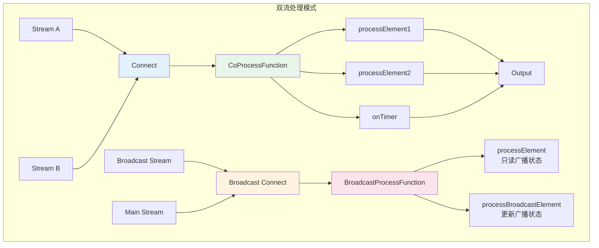
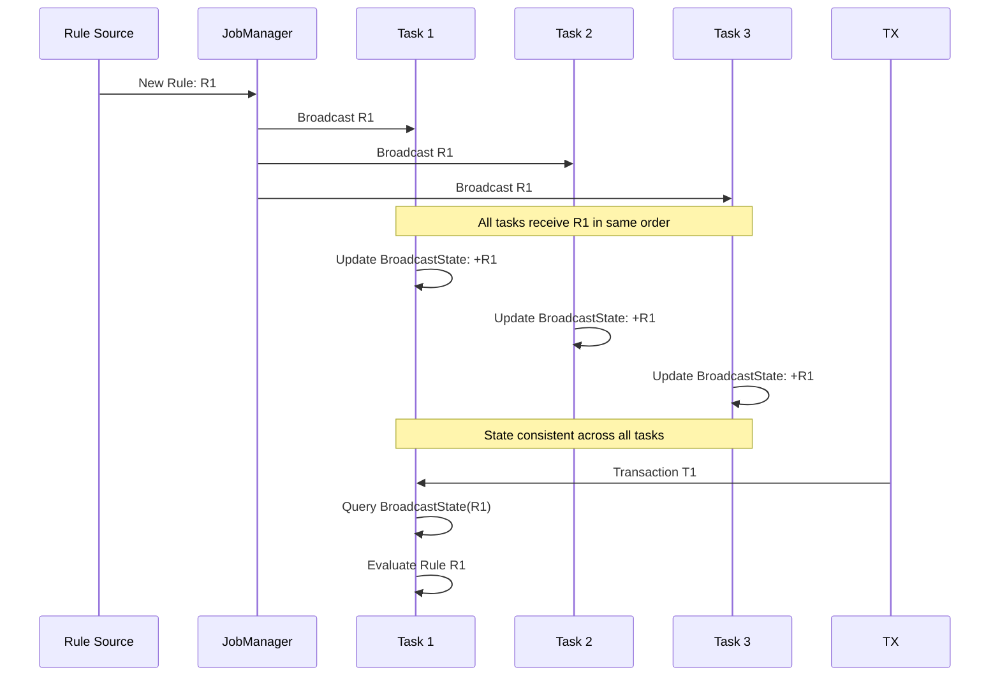
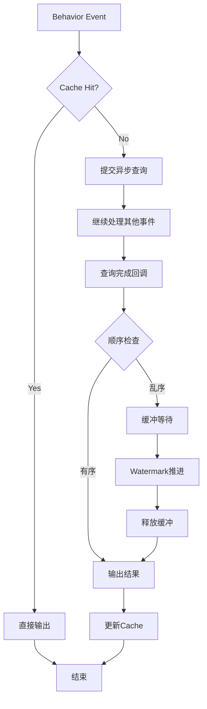

# 双流处理模式

> **所属阶段**: Knowledge/02-design-patterns | **前置依赖**: [02.01-stream-join-patterns.md](./02.01-stream-join-patterns.md) | **形式化等级**: L4-L5
>
> 本模式解决双流协作处理的核心挑战，涵盖Connect/CoProcess、Broadcast State、双流异步Join等高级模式。

---

## 目录

- [双流处理模式](#双流处理模式)
  - [目录](#目录)
  - [1. 概念定义 (Definitions)](#1-概念定义-definitions)
    - [1.1 双流处理的本质](#11-双流处理的本质)
    - [1.2 Connect 与 CoProcessFunction](#12-connect-与-coprocessfunction)
    - [1.3 Broadcast State 模式](#13-broadcast-state-模式)
    - [1.4 双流异步 Join](#14-双流异步-join)
  - [2. 属性推导 (Properties)](#2-属性推导-properties)
    - [2.1 Connect/CoProcess 的性质](#21-connectcoprocess-的性质)
    - [2.2 Broadcast State 的性质](#22-broadcast-state-的性质)
    - [2.3 双流异步 Join 的性质](#23-双流异步-join-的性质)
  - [3. 关系建立 (Relations)](#3-关系建立-relations)
    - [3.1 双流模式与 Join 模式的关系](#31-双流模式与-join-模式的关系)
    - [3.2 双流模式与其他概念的关系](#32-双流模式与其他概念的关系)
  - [4. 论证过程 (Argumentation)](#4-论证过程-argumentation)
    - [4.1 Connect vs Union 的选择](#41-connect-vs-union-的选择)
    - [4.2 Broadcast State 的适用边界](#42-broadcast-state-的适用边界)
    - [4.3 异步Join的完整性保证](#43-异步join的完整性保证)
  - [5. 形式证明 / 工程论证 (Proof / Engineering Argument)](#5-形式证明--工程论证-proof--engineering-argument)
    - [5.1 Broadcast State 的一致性证明](#51-broadcast-state-的一致性证明)
    - [5.2 CoProcessFunction 的表达能力](#52-coprocessfunction-的表达能力)
  - [6. 实例验证 (Examples)](#6-实例验证-examples)
    - [6.1 Connect 与 CoProcessFunction 实现](#61-connect-与-coprocessfunction-实现)
    - [6.2 Broadcast State 模式实现](#62-broadcast-state-模式实现)
    - [6.3 双流异步 Join 实现](#63-双流异步-join-实现)
  - [7. 可视化 (Visualizations)](#7-可视化-visualizations)
    - [7.1 双流处理模式总览](#71-双流处理模式总览)
    - [7.2 Broadcast State 机制](#72-broadcast-state-机制)
    - [7.3 异步双流 Join 流程](#73-异步双流-join-流程)
  - [8. 引用参考 (References)](#8-引用参考-references)

---

## 1. 概念定义 (Definitions)

### 1.1 双流处理的本质

**Def-K-02-07 [双流处理]**: 双流处理是指对流 $S_A$ 和 $S_B$ 进行协调计算，产生输出流 $S_{out}$ 的处理模式。与单流处理相比，双流处理需要解决以下核心问题：

$$
\text{DualStream}(S_A, S_B) = \{(o, t_o) \mid o = f(A_{buf}, B_{buf}), A_{buf} \subseteq S_A, B_{buf} \subseteq S_B\}
$$

其中 $A_{buf}$ 和 $B_{buf}$ 为双流在计算时刻的本地缓冲区状态。

### 1.2 Connect 与 CoProcessFunction

**Def-K-02-08 [Connect 操作]**: Connect 是将两个异构流合并为一个ConnectedStreams的操作，形式化为：

$$
\text{Connect}: S_A \times S_B \to S_{A \cup B}^{conn}
$$

其中 $S_A$ 和 $S_B$ 可以具有不同的数据类型：$Type(S_A) \neq Type(S_B)$。

**Def-K-02-09 [CoProcessFunction]**: CoProcessFunction 是作用于ConnectedStreams的双输入处理函数，定义两个独立的处理接口：

$$
\begin{aligned}
\text{processElement1}&: (e_A \in S_A, \text{Context}, \text{Collector}) \to \text{Action} \\
\text{processElement2}&: (e_B \in S_B, \text{Context}, \text{Collector}) \to \text{Action} \\
\text{onTimer}&: (\text{timestamp}, \text{Context}, \text{Collector}) \to \text{Action}
\end{aligned}
$$

### 1.3 Broadcast State 模式

**Def-K-02-10 [Broadcast Stream]**: Broadcast Stream 是将流 $S_B$ 广播到所有并行子任务的特殊流，确保每个子任务接收到完整的数据副本：

$$
\text{Broadcast}(S_B) = \{S_B^{(i)} \mid S_B^{(i)} = S_B, \forall i \in [1, N_{parallel}]\}
$$

其中 $N_{parallel}$ 为并行度，每个子任务 $i$ 都获得 $S_B$ 的完整副本。

**Def-K-02-11 [Broadcast State]**: Broadcast State 是与Broadcast Stream关联的特殊状态，具有以下特性：

- **只写状态**: 仅通过广播流更新
- **全量复制**: 所有子任务持有相同的状态副本
- **严格顺序**: 广播流的事件在所有子任务上按相同顺序处理

形式化为：

$$
\text{BroadcastState}^{(i)}[t] = \text{BroadcastState}^{(j)}[t], \quad \forall i, j, t
$$

### 1.4 双流异步 Join

**Def-K-02-12 [双流异步 Join]**: 双流异步 Join 是一种非阻塞的Join模式，当一侧数据到达时，异步查询另一侧的状态或外部存储：

$$
\text{AsyncDualJoin}(a, B_{state}) = \text{Future}\{(a, b) \mid b \in B_{state}, \theta(a, b)\}
$$

关键特性：

- **非阻塞**: 查询进行时继续处理其他事件
- **乱序完成**: 先发起的查询可能后完成
- **并发控制**: 需要限制并发查询数量

---

## 2. 属性推导 (Properties)

### 2.1 Connect/CoProcess 的性质

**Lemma-K-02-04 [类型保持]**: Connect 操作保持两个输入流的类型信息，允许在CoProcessFunction中分别处理不同类型的元素。

**Lemma-K-02-05 [Watermark 对齐]**: Connected Streams 的Watermark取两个流Watermark的最小值：

$$
W_{conn} = \min(W_A, W_B)
$$

这意味着如果一侧流的Watermark停滞，整个Connected Stream的处理都会延迟。

### 2.2 Broadcast State 的性质

**Lemma-K-02-06 [状态一致性]**: 在所有并行子任务中，Broadcast State 的内容始终保持一致。

*证明*: 广播流的数据被发送到所有子任务，且处理顺序相同（通过Flink的确定性路由保证）。因此，对于任意两个子任务 $i$ 和 $j$，在处理完相同数量的事件后，它们的状态必然相同。□

**Lemma-K-02-07 [无Key依赖]**: Broadcast State 不依赖于Key，所有子任务共享相同的命名空间。

**Prop-K-02-04 [Broadcast State 的限制]**:

- 广播侧不能访问非广播侧的状态
- 非广播侧可以读取但不能写入广播状态
- Checkpoint 时需要确保广播状态的一致性快照

### 2.3 双流异步 Join 的性质

**Lemma-K-02-08 [延迟隐藏]**: 设异步查询延迟为 $L$，并发度为 $C$，则系统可维持的最大吞吐为：

$$
\lambda_{max} = \frac{C}{L}
$$

**Lemma-K-02-09 [乱序输出]**: 异步Join的输出顺序可能与输入顺序不一致。对于输入序列 $(a_1, a_2)$，输出序列可能是 $(a_2 \bowtie b, a_1 \bowtie b)$。

---

## 3. 关系建立 (Relations)

### 3.1 双流模式与 Join 模式的关系

```
┌─────────────────────────────────────────────────────────────────────────┐
│                       双流处理模式关系图谱                               │
├─────────────────────────────────────────────────────────────────────────┤
│                                                                         │
│  ┌──────────────┐      基础能力        ┌──────────────┐                  │
│  │   Connect    │─────────────────────►│CoProcessFunc │                  │
│  │   (连接流)    │                      │ (协调处理)    │                  │
│  └──────┬───────┘                      └──────┬───────┘                  │
│         │                                     │                          │
│         │ 特化                                │ 特化                      │
│         ▼                                     ▼                          │
│  ┌──────────────┐                      ┌──────────────┐                  │
│  │Broadcast Conn│                      │Keyed CoProcess│                  │
│  │  (广播连接)   │                      │  (键控协调)   │                  │
│  └──────┬───────┘                      └──────┬───────┘                  │
│         │                                     │                          │
│         ▼                                     ▼                          │
│  ┌──────────────┐                      ┌──────────────┐                  │
│  │BroadcastState│                      │ Async Dual   │                  │
│  │  (广播状态)   │                      │    Join      │                  │
│  │              │                      │ (异步双流Join)│                  │
│  └──────────────┘                      └──────────────┘                  │
│                                                                         │
└─────────────────────────────────────────────────────────────────────────┘
```

### 3.2 双流模式与其他概念的关系

**与 Checkpoint 的关系**:

- Connect: 双流状态分别快照
- Broadcast State: 广播侧状态只需保存一份（所有子任务相同）
- Async Join: 需要处理 inflight 查询的一致性

**与 Watermark 的关系**:

- Connect: Watermark 取最小值
- Broadcast: 广播侧Watermark推进可以触发非广播侧的定时器
- Async Join: Watermark 推进时需等待所有 inflight 查询完成

---

## 4. 论证过程 (Argumentation)

### 4.1 Connect vs Union 的选择

**问题**: 何时使用 Connect，何时使用 Union？

**分析**:

| 特性 | Union | Connect |
|-----|-------|---------|
| 类型要求 | 必须相同 | 可以不同 |
| 处理函数 | 单输入 | 双输入独立处理 |
| 状态访问 | 单流状态 | 可协调双流状态 |
| 复杂度 | 简单 | 复杂但更灵活 |

**选择原则**:

- 类型相同且无需协调 → Union
- 类型不同或需要双流状态协调 → Connect

### 4.2 Broadcast State 的适用边界

**适用场景**:

- 配置流更新处理规则（规则广播到所有任务）
- 维表更新（小表广播到大流）
- 模型参数更新（ML模型广播）

**不适用场景**:

- 广播流数据量过大（网络压力）
- 需要动态分区（Broadcast State无Key概念）
- 高频更新（每次更新广播到所有子任务成本高）

### 4.3 异步Join的完整性保证

**问题**: 异步Join如何保证Exactly-Once语义？

**解决方案**:

1. **Checkpoint Barrier 对齐**: 等待所有 inflight 异步操作完成后再进行Checkpoint
2. **幂等输出**: 输出到支持幂等写入的外部系统
3. **两阶段提交**: 使用外部事务保证输出一致性

---

## 5. 形式证明 / 工程论证 (Proof / Engineering Argument)

### 5.1 Broadcast State 的一致性证明

**Thm-K-02-03 [Broadcast State 强一致性]**: 在所有并行子任务中，Broadcast State 在任何时刻都保持一致。

**证明**:

设广播流为 $S_B = \{b_1, b_2, ..., b_n\}$，并行度为 $P$。

1. **路由确定性**: Flink的确定性路由确保每个 $b_i$ 被发送到所有子任务的相同位置
2. **处理顺序**: 每个子任务按顺序处理 $\{b_1, b_2, ..., b_n\}$
3. **状态更新**: 设第 $k$ 步后的状态为 $State_k = f(State_{k-1}, b_k)$

由于所有子任务从相同的初始状态 $State_0$ 开始，应用相同的更新函数 $f$，以相同的顺序处理相同的事件序列，因此对于任意 $k$：

$$
State_k^{(i)} = State_k^{(j)}, \quad \forall i, j \in [1, P]
$$

即所有子任务的状态始终保持一致。□

### 5.2 CoProcessFunction 的表达能力

**Thm-K-02-04 [CoProcessFunction 完备性]**: CoProcessFunction 可以表达任何双流协调计算。

**证明概要**:

设任意双流协调计算为 $C: S_A \times S_B \to S_{out}$。可以构造对应的CoProcessFunction：

1. 使用ValueState存储 $S_A$ 的历史记录
2. 使用ValueState存储 $S_B$ 的历史记录
3. processElement1: 将 $e_A$ 存入状态，扫描 $S_B$ 状态进行计算
4. processElement2: 将 $e_B$ 存入状态，扫描 $S_A$ 状态进行计算
5. onTimer: 处理超时、清理过期状态

通过适当的状态管理和定时器设置，可以模拟任何双流计算。□

---

## 6. 实例验证 (Examples)

### 6.1 Connect 与 CoProcessFunction 实现

**场景**: 实时订单与库存匹配，库存不足时延迟处理

```java
/**
 * Connect 与 CoProcessFunction 实现：订单-库存匹配
 *
 * 业务逻辑：
 * - 订单流：用户下单请求
 * - 库存流：商品库存更新
 * - 目标：实时匹配订单与库存，库存不足时等待补货
 */
public class OrderInventoryCoProcess {

    // 订单事件
    public static class OrderEvent {
        public String orderId;
        public String productId;
        public int quantity;
        public double amount;
        public long timestamp;

        public OrderEvent(String orderId, String productId, int quantity,
                         double amount, long timestamp) {
            this.orderId = orderId;
            this.productId = productId;
            this.quantity = quantity;
            this.amount = amount;
            this.timestamp = timestamp;
        }
    }

    // 库存事件
    public static class InventoryEvent {
        public String productId;
        public int availableQuantity;
        public long timestamp;

        public InventoryEvent(String productId, int availableQuantity, long timestamp) {
            this.productId = productId;
            this.availableQuantity = availableQuantity;
            this.timestamp = timestamp;
        }
    }

    // 处理结果
    public static class OrderResult {
        public String orderId;
        public String productId;
        public int requestedQty;
        public int fulfilledQty;
        public String status;  // FULFILLED, PARTIAL, PENDING
        public long processTime;

        @Override
        public String toString() {
            return String.format("OrderResult{order=%s, product=%s, status=%s, qty=%d/%d}",
                orderId, productId, status, fulfilledQty, requestedQty);
        }
    }

    public static void main(String[] args) throws Exception {
        StreamExecutionEnvironment env = StreamExecutionEnvironment.getExecutionEnvironment();

        // 订单流
        DataStream<OrderEvent> orderStream = env
            .fromSource(
                KafkaSource.<OrderEvent>builder()
                    .setBootstrapServers("kafka:9092")
                    .setTopics("orders")
                    .build(),
                WatermarkStrategy.<OrderEvent>forBoundedOutOfOrderness(Duration.ofSeconds(5))
                    .withTimestampAssigner((e, ts) -> e.timestamp),
                "Orders"
            );

        // 库存流
        DataStream<InventoryEvent> inventoryStream = env
            .fromSource(
                KafkaSource.<InventoryEvent>builder()
                    .setBootstrapServers("kafka:9092")
                    .setTopics("inventory")
                    .build(),
                WatermarkStrategy.<InventoryEvent>forBoundedOutOfOrderness(Duration.ofSeconds(5))
                    .withTimestampAssigner((e, ts) -> e.timestamp),
                "Inventory"
            );

        // Connect 两个流
        ConnectedStreams<OrderEvent, InventoryEvent> connected =
            orderStream.connect(inventoryStream);

        // 使用 CoProcessFunction 处理
        DataStream<OrderResult> resultStream = connected
            .keyBy(
                order -> order.productId,      // 左流Key选择器
                inventory -> inventory.productId // 右流Key选择器
            )
            .process(new OrderInventoryMatcher());

        resultStream.addSink(new ResultSink());

        env.execute("Order-Inventory CoProcess");
    }
}

/**
 * 订单-库存匹配 CoProcessFunction
 */
class OrderInventoryMatcher extends CoProcessFunction<
    OrderInventoryCoProcess.OrderEvent,
    OrderInventoryCoProcess.InventoryEvent,
    OrderInventoryCoProcess.OrderResult> {

    // 库存状态
    private ValueState<Integer> inventoryState;
    // 待处理订单队列
    private ListState<OrderInventoryCoProcess.OrderEvent> pendingOrdersState;
    // 订单超时定时器
    private MapState<String, Long> orderTimerState;

    @Override
    public void open(Configuration parameters) {
        inventoryState = getRuntimeContext().getState(
            new ValueStateDescriptor<>("inventory", Types.INT));

        pendingOrdersState = getRuntimeContext().getListState(
            new ListStateDescriptor<>("pending-orders",
                Types.POJO(OrderInventoryCoProcess.OrderEvent.class)));

        orderTimerState = getRuntimeContext().getMapState(
            new MapStateDescriptor<>("order-timers", Types.STRING, Types.LONG));
    }

    @Override
    public void processElement1(
        OrderInventoryCoProcess.OrderEvent order,
        Context ctx,
        Collector<OrderInventoryCoProcess.OrderResult> out) throws Exception {

        Integer currentInventory = inventoryState.value();

        if (currentInventory == null) {
            currentInventory = 0;
        }

        if (currentInventory >= order.quantity) {
            // 库存充足，立即处理
            currentInventory -= order.quantity;
            inventoryState.update(currentInventory);

            out.collect(new OrderInventoryCoProcess.OrderResult(
                order.orderId, order.productId, order.quantity,
                order.quantity, "FULFILLED", ctx.timestamp()
            ));

            // 尝试处理待处理订单
            processPendingOrders(out, ctx);
        } else {
            // 库存不足，加入待处理队列
            pendingOrdersState.add(order);

            // 注册超时定时器（5分钟后）
            long timeout = ctx.timestamp() + TimeUnit.MINUTES.toMillis(5);
            ctx.timerService().registerEventTimeTimer(timeout);
            orderTimerState.put(order.orderId, timeout);

            out.collect(new OrderInventoryCoProcess.OrderResult(
                order.orderId, order.productId, order.quantity,
                0, "PENDING", ctx.timestamp()
            ));
        }
    }

    @Override
    public void processElement2(
        OrderInventoryCoProcess.InventoryEvent inventory,
        Context ctx,
        Collector<OrderInventoryCoProcess.OrderResult> out) throws Exception {

        // 更新库存
        inventoryState.update(inventory.availableQuantity);

        // 尝试处理待处理订单
        processPendingOrders(out, ctx);
    }

    @Override
    public void onTimer(
        long timestamp,
        OnTimerContext ctx,
        Collector<OrderInventoryCoProcess.OrderResult> out) throws Exception {

        // 检查超时的订单
        Iterator<Map.Entry<String, Long>> timerIter = orderTimerState.iterator();
        while (timerIter.hasNext()) {
            Map.Entry<String, Long> entry = timerIter.next();
            if (entry.getValue() <= timestamp) {
                // 订单超时，从待处理队列移除
                String orderId = entry.getKey();
                removePendingOrder(orderId);

                // 输出超时结果
                out.collect(new OrderInventoryCoProcess.OrderResult(
                    orderId, ctx.getCurrentKey().toString(), 0, 0,
                    "TIMEOUT", timestamp
                ));

                timerIter.remove();
            }
        }
    }

    private void processPendingOrders(
        Collector<OrderInventoryCoProcess.OrderResult> out,
        Context ctx) throws Exception {

        Integer currentInventory = inventoryState.value();
        if (currentInventory == null || currentInventory <= 0) {
            return;
        }

        // 按FIFO顺序处理待处理订单
        List<OrderInventoryCoProcess.OrderEvent> pending = new ArrayList<>();
        pendingOrdersState.get().forEach(pending::add);

        for (OrderInventoryCoProcess.OrderEvent order : pending) {
            if (currentInventory >= order.quantity) {
                // 可以处理
                currentInventory -= order.quantity;

                out.collect(new OrderInventoryCoProcess.OrderResult(
                    order.orderId, order.productId, order.quantity,
                    order.quantity, "FULFILLED", ctx.timestamp()
                ));

                // 删除定时器
                orderTimerState.remove(order.orderId);
            } else {
                // 库存不足，部分处理或跳过
                break;
            }
        }

        inventoryState.update(currentInventory);

        // 更新待处理队列
        pendingOrdersState.update(pending.stream()
            .filter(o -> orderTimerState.contains(o.orderId))
            .collect(Collectors.toList()));
    }

    private void removePendingOrder(String orderId) throws Exception {
        List<OrderInventoryCoProcess.OrderEvent> pending = new ArrayList<>();
        pendingOrdersState.get().forEach(pending::add);

        pendingOrdersState.update(pending.stream()
            .filter(o -> !o.orderId.equals(orderId))
            .collect(Collectors.toList()));
    }
}
```

### 6.2 Broadcast State 模式实现

**场景**: 动态规则引擎，规则变更实时生效

```java
/**
 * Broadcast State 实现：动态风控规则引擎
 *
 * 业务逻辑：
 * - 交易流：用户交易事件
 * - 规则流：风控规则更新（广播到所有任务）
 * - 目标：根据最新规则实时评估交易风险
 */
public class DynamicRuleEngine {

    // 交易事件
    public static class Transaction {
        public String transactionId;
        public String userId;
        public String cardId;
        public double amount;
        public String merchantCategory;
        public long timestamp;
        public String location;

        public Transaction(String transactionId, String userId, String cardId,
                          double amount, String merchantCategory,
                          long timestamp, String location) {
            this.transactionId = transactionId;
            this.userId = userId;
            this.cardId = cardId;
            this.amount = amount;
            this.merchantCategory = merchantCategory;
            this.timestamp = timestamp;
            this.location = location;
        }
    }

    // 风控规则
    public static class RiskRule {
        public String ruleId;
        public String ruleType;  // AMOUNT_LIMIT, VELOCITY_CHECK, GEO_ANOMALY
        public Map<String, Object> parameters;
        public int priority;
        public boolean enabled;

        public RiskRule(String ruleId, String ruleType,
                       Map<String, Object> parameters, int priority) {
            this.ruleId = ruleId;
            this.ruleType = ruleType;
            this.parameters = parameters;
            this.priority = priority;
            this.enabled = true;
        }
    }

    // 风险评估结果
    public static class RiskAssessment {
        public String transactionId;
        public String userId;
        public double riskScore;
        public List<String> triggeredRules;
        public String decision;  // APPROVE, REVIEW, DECLINE
        public long assessTime;

        @Override
        public String toString() {
            return String.format("RiskAssessment{tx=%s, score=%.2f, decision=%s, rules=%s}",
                transactionId, riskScore, decision, triggeredRules);
        }
    }

    public static void main(String[] args) throws Exception {
        StreamExecutionEnvironment env = StreamExecutionEnvironment.getExecutionEnvironment();

        // 交易流
        DataStream<Transaction> transactionStream = env
            .fromSource(
                KafkaSource.<Transaction>builder()
                    .setBootstrapServers("kafka:9092")
                    .setTopics("transactions")
                    .build(),
                WatermarkStrategy.<Transaction>forBoundedOutOfOrderness(Duration.ofSeconds(5))
                    .withTimestampAssigner((e, ts) -> e.timestamp),
                "Transactions"
            );

        // 规则流（将作为广播流）
        DataStream<RiskRule> ruleStream = env
            .fromSource(
                KafkaSource.<RiskRule>builder()
                    .setBootstrapServers("kafka:9092")
                    .setTopics("risk-rules")
                    .build(),
                WatermarkStrategy.<RiskRule>forBoundedOutOfOrderness(Duration.ofSeconds(1)),
                "Risk Rules"
            );

        // 创建广播状态描述符
        MapStateDescriptor<String, RiskRule> ruleStateDescriptor =
            new MapStateDescriptor<>(
                "risk-rules",
                Types.STRING,
                Types.POJO(RiskRule.class)
            );

        // 广播规则流
        BroadcastStream<RiskRule> broadcastRuleStream = ruleStream
            .broadcast(ruleStateDescriptor);

        // 连接交易流和广播规则流
        DataStream<RiskAssessment> assessmentStream = transactionStream
            .keyBy(tx -> tx.userId)
            .connect(broadcastRuleStream)
            .process(new RiskEvaluator(ruleStateDescriptor));

        // 分流处理
        OutputTag<RiskAssessment> highRiskTag = new OutputTag<RiskAssessment>("high-risk"){};
        OutputTag<RiskAssessment> reviewTag = new OutputTag<RiskAssessment>("review"){};

        SingleOutputStreamOperator<RiskAssessment> mainStream = assessmentStream
            .process(new RiskSplitter(highRiskTag, reviewTag));

        // 输出到不同下游
        mainStream.addSink(new ApproveSink());  // 通过的交易
        mainStream.getSideOutput(highRiskTag).addSink(new AlertSink());  // 高风险
        mainStream.getSideOutput(reviewTag).addSink(new ReviewSink());   // 待审核

        env.execute("Dynamic Risk Rule Engine");
    }
}

/**
 * 风险评估 BroadcastProcessFunction
 */
class RiskEvaluator extends KeyedBroadcastProcessFunction<
    String,  // Key类型
    DynamicRuleEngine.Transaction,  // 非广播输入
    DynamicRuleEngine.RiskRule,     // 广播输入
    DynamicRuleEngine.RiskAssessment> {  // 输出

    private final MapStateDescriptor<String, DynamicRuleEngine.RiskRule> ruleStateDescriptor;

    // 用户交易历史（非广播状态）
    private ListState<DynamicRuleEngine.Transaction> userHistoryState;

    public RiskEvaluator(MapStateDescriptor<String, DynamicRuleEngine.RiskRule> descriptor) {
        this.ruleStateDescriptor = descriptor;
    }

    @Override
    public void open(Configuration parameters) {
        userHistoryState = getRuntimeContext().getListState(
            new ListStateDescriptor<>("user-history",
                Types.POJO(DynamicRuleEngine.Transaction.class)));
    }

    @Override
    public void processElement(
        DynamicRuleEngine.Transaction transaction,
        ReadOnlyContext ctx,
        Collector<DynamicRuleEngine.RiskAssessment> out) throws Exception {

        // 读取广播状态（只读）
        ReadOnlyBroadcastState<String, DynamicRuleEngine.RiskRule> rules =
            ctx.getBroadcastState(ruleStateDescriptor);

        List<String> triggeredRules = new ArrayList<>();
        double totalRiskScore = 0.0;

        // 评估所有启用的规则
        for (Map.Entry<String, DynamicRuleEngine.RiskRule> entry : rules.immutableEntries()) {
            DynamicRuleEngine.RiskRule rule = entry.getValue();
            if (!rule.enabled) continue;

            double ruleScore = evaluateRule(transaction, rule);
            if (ruleScore > 0) {
                triggeredRules.add(rule.ruleId);
                totalRiskScore += ruleScore * rule.priority;
            }
        }

        // 归一化风险分数
        double normalizedScore = Math.min(totalRiskScore / 100.0, 1.0);

        // 决策
        String decision;
        if (normalizedScore < 0.3) {
            decision = "APPROVE";
        } else if (normalizedScore < 0.7) {
            decision = "REVIEW";
        } else {
            decision = "DECLINE";
        }

        out.collect(new DynamicRuleEngine.RiskAssessment(
            transaction.transactionId,
            transaction.userId,
            normalizedScore,
            triggeredRules,
            decision,
            ctx.currentWatermark()
        ));

        // 更新用户历史
        userHistoryState.add(transaction);

        // 清理过期历史（保留最近24小时）
        cleanupOldHistory(transaction.timestamp - TimeUnit.HOURS.toMillis(24));
    }

    @Override
    public void processBroadcastElement(
        DynamicRuleEngine.RiskRule rule,
        Context ctx,
        Collector<DynamicRuleEngine.RiskAssessment> out) throws Exception {

        // 更新广播状态（所有子任务都会执行）
        BroadcastState<String, DynamicRuleEngine.RiskRule> rules =
            ctx.getBroadcastState(ruleStateDescriptor);

        if (rule.enabled) {
            rules.put(rule.ruleId, rule);
            System.out.println("[Broadcast] Rule updated: " + rule.ruleId +
                " on task " + getRuntimeContext().getIndexOfThisSubtask());
        } else {
            rules.remove(rule.ruleId);
            System.out.println("[Broadcast] Rule removed: " + rule.ruleId);
        }
    }

    private double evaluateRule(DynamicRuleEngine.Transaction tx,
                               DynamicRuleEngine.RiskRule rule) {
        switch (rule.ruleType) {
            case "AMOUNT_LIMIT":
                double limit = (Double) rule.parameters.get("maxAmount");
                return tx.amount > limit ? (tx.amount - limit) / limit : 0;

            case "VELOCITY_CHECK":
                int maxTxPerHour = (Integer) rule.parameters.get("maxTxPerHour");
                // 计算最近1小时交易数
                long oneHourAgo = tx.timestamp - TimeUnit.HOURS.toMillis(1);
                long recentTxCount = StreamSupport.stream(userHistoryState.get().spliterator(), false)
                    .filter(t -> t.timestamp > oneHourAgo)
                    .count();
                return recentTxCount > maxTxPerHour ?
                    (recentTxCount - maxTxPerHour) / (double) maxTxPerHour : 0;

            case "GEO_ANOMALY":
                String lastLocation = getLastLocation();
                if (lastLocation != null && !lastLocation.equals(tx.location)) {
                    long timeGap = tx.timestamp - getLastTransactionTime();
                    double distance = calculateDistance(lastLocation, tx.location);
                    // 速度检查：如果移动速度超过合理范围
                    double speed = distance / (timeGap / 3600000.0);  // km/h
                    double maxSpeed = (Double) rule.parameters.get("maxSpeedKmH");
                    return speed > maxSpeed ? 1.0 : 0;
                }
                return 0;

            default:
                return 0;
        }
    }

    private void cleanupOldHistory(long cutoffTime) throws Exception {
        List<DynamicRuleEngine.Transaction> recent = new ArrayList<>();
        for (DynamicRuleEngine.Transaction tx : userHistoryState.get()) {
            if (tx.timestamp > cutoffTime) {
                recent.add(tx);
            }
        }
        userHistoryState.update(recent);
    }

    private String getLastLocation() throws Exception {
        return StreamSupport.stream(userHistoryState.get().spliterator(), false)
            .reduce((first, second) -> second)
            .map(t -> t.location)
            .orElse(null);
    }

    private long getLastTransactionTime() throws Exception {
        return StreamSupport.stream(userHistoryState.get().spliterator(), false)
            .reduce((first, second) -> second)
            .map(t -> t.timestamp)
            .orElse(0L);
    }

    private double calculateDistance(String loc1, String loc2) {
        // 简化的距离计算，实际应使用地理坐标
        return loc1.equals(loc2) ? 0 : 100;
    }
}

/**
 * 风险分流器
 */
class RiskSplitter extends ProcessFunction<
    DynamicRuleEngine.RiskAssessment,
    DynamicRuleEngine.RiskAssessment> {

    private final OutputTag<DynamicRuleEngine.RiskAssessment> highRiskTag;
    private final OutputTag<DynamicRuleEngine.RiskAssessment> reviewTag;

    public RiskSplitter(OutputTag<DynamicRuleEngine.RiskAssessment> highRiskTag,
                       OutputTag<DynamicRuleEngine.RiskAssessment> reviewTag) {
        this.highRiskTag = highRiskTag;
        this.reviewTag = reviewTag;
    }

    @Override
    public void processElement(
        DynamicRuleEngine.RiskAssessment assessment,
        Context ctx,
        Collector<DynamicRuleEngine.RiskAssessment> out) {

        switch (assessment.decision) {
            case "APPROVE":
                out.collect(assessment);
                break;
            case "REVIEW":
                ctx.output(reviewTag, assessment);
                break;
            case "DECLINE":
                ctx.output(highRiskTag, assessment);
                break;
        }
    }
}
```

### 6.3 双流异步 Join 实现

**场景**: 实时用户画像补全，异步查询多个数据源

```java
/**
 * 双流异步 Join 实现：用户行为实时画像
 *
 * 业务逻辑：
 * - 行为流：用户在APP上的操作事件
 * - 画像流：用户画像属性更新
 * - 目标：异步查询画像数据，实时生成完整行为记录
 */
public class AsyncDualStreamJoin {

    public static void main(String[] args) throws Exception {
        StreamExecutionEnvironment env = StreamExecutionEnvironment.getExecutionEnvironment();

        // 用户行为流
        DataStream<UserBehavior> behaviorStream = env
            .fromSource(
                KafkaSource.<UserBehavior>builder()
                    .setBootstrapServers("kafka:9092")
                    .setTopics("user-behavior")
                    .build(),
                WatermarkStrategy.forBoundedOutOfOrderness(Duration.ofSeconds(5)),
                "User Behavior"
            );

        // 用户画像更新流
        DataStream<ProfileUpdate> profileStream = env
            .fromSource(
                KafkaSource.<ProfileUpdate>builder()
                    .setBootstrapServers("kafka:9092")
                    .setTopics("profile-updates")
                    .build(),
                WatermarkStrategy.forBoundedOutOfOrderness(Duration.ofSeconds(5)),
                "Profile Updates"
            );

        // 方案1：使用 AsyncFunction + State 实现异步双流Join
        DataStream<EnrichedBehavior> enrichedStream = behaviorStream
            .keyBy(b -> b.userId)
            .process(new AsyncProfileEnricher());

        // 方案2：使用 Connected Streams + AsyncFunction
        DataStream<EnrichedBehavior> enrichedStream2 = behaviorStream
            .keyBy(b -> b.userId)
            .connect(profileStream.keyBy(p -> p.userId))
            .process(new AsyncCoProcessEnricher());

        enrichedStream.addSink(new ElasticsearchSink<>());

        env.execute("Async Dual Stream Join");
    }
}

/**
 * 异步画像补全处理器
 */
class AsyncProfileEnricher extends KeyedProcessFunction<String, UserBehavior, EnrichedBehavior> {

    // 本地画像缓存
    private ValueState<UserProfile> profileCacheState;
    // 待处理行为队列
    private ListState<UserBehavior> pendingBehaviorsState;
    // 异步查询Inflight
    private transient ExecutorService asyncExecutor;
    private transient RedisAsyncCommands<String, String> redisAsync;

    @Override
    public void open(Configuration parameters) {
        profileCacheState = getRuntimeContext().getState(
            new ValueStateDescriptor<>("profile-cache", Types.POJO(UserProfile.class)));

        pendingBehaviorsState = getRuntimeContext().getListState(
            new ListStateDescriptor<>("pending-behaviors", Types.POJO(UserBehavior.class)));

        // 初始化Redis异步连接
        RedisClient client = RedisClient.create("redis://redis:6379");
        StatefulRedisConnection<String, String> connection = client.connect();
        redisAsync = connection.async();

        asyncExecutor = Executors.newFixedThreadPool(20);
    }

    @Override
    public void processElement(
        UserBehavior behavior,
        Context ctx,
        Collector<EnrichedBehavior> out) throws Exception {

        UserProfile cachedProfile = profileCacheState.value();

        if (cachedProfile != null && isFresh(cachedProfile)) {
            // 缓存命中且新鲜，直接输出
            out.collect(enrich(behavior, cachedProfile));
        } else {
            // 缓存未命中或过期，异步查询
            pendingBehaviorsState.add(behavior);

            asyncExecutor.submit(() -> {
                try {
                    // 异步查询Redis
                    RedisFuture<Map<String, String>> future =
                        redisAsync.hgetall("profile:" + behavior.userId);

                    Map<String, String> profileData = future.get(500, TimeUnit.MILLISECONDS);

                    if (profileData != null && !profileData.isEmpty()) {
                        UserProfile profile = parseProfile(profileData);

                        // 输出到结果（注意：这里需要使用特殊的输出机制）
                        ctx.output(
                            new OutputTag<EnrichedBehavior>("async-result"){},
                            enrich(behavior, profile)
                        );

                        // 更新缓存
                        profileCacheState.update(profile);
                    }
                } catch (Exception e) {
                    // 查询失败，输出基础版本
                    ctx.output(
                        new OutputTag<EnrichedBehavior>("async-result"){},
                        enrichWithDefault(behavior)
                    );
                }
            });
        }
    }

    private boolean isFresh(UserProfile profile) {
        return System.currentTimeMillis() - profile.updateTime < TimeUnit.MINUTES.toMillis(5);
    }

    private EnrichedBehavior enrich(UserBehavior behavior, UserProfile profile) {
        return new EnrichedBehavior(
            behavior.userId,
            behavior.action,
            behavior.timestamp,
            profile.age,
            profile.gender,
            profile.city,
            profile.interests,
            profile.memberLevel
        );
    }

    private EnrichedBehavior enrichWithDefault(UserBehavior behavior) {
        return new EnrichedBehavior(
            behavior.userId, behavior.action, behavior.timestamp,
            null, null, null, null, 0
        );
    }

    private UserProfile parseProfile(Map<String, String> data) {
        return new UserProfile(
            Integer.parseInt(data.getOrDefault("age", "0")),
            data.get("gender"),
            data.get("city"),
            Arrays.asList(data.getOrDefault("interests", "").split(",")),
            Integer.parseInt(data.getOrDefault("level", "0")),
            System.currentTimeMillis()
        );
    }
}

/**
 * 更完整的异步双流 Join 实现
 * 使用 Flink 的 AsyncDataStream API
 */
class CompleteAsyncDualJoin {

    public static DataStream<EnrichedBehavior> implement(
            DataStream<UserBehavior> behaviorStream,
            DataStream<ProfileUpdate> profileStream) {

        // 先处理画像流，构建可查询的状态存储
        // 这里使用 Redis 作为外部状态存储

        // 画像更新写入 Redis
        profileStream.addSink(new RedisProfileSink());

        // 行为流异步查询 Redis 进行补全
        return AsyncDataStream.unorderedWait(
            behaviorStream,
            new AsyncProfileLookupFunction(),
            1000,  // 超时1秒
            TimeUnit.MILLISECONDS,
            100    // 最大并发100
        );
    }
}

/**
 * 异步画像查询函数
 */
class AsyncProfileLookupFunction extends RichAsyncFunction<UserBehavior, EnrichedBehavior> {

    private transient RedisAsyncCommands<String, String> redisAsync;
    private transient Meter lookupLatency;
    private transient Counter cacheHits;
    private transient Counter cacheMisses;

    @Override
    public void open(Configuration parameters) {
        RedisClient client = RedisClient.create("redis://redis:6379");
        StatefulRedisConnection<String, String> connection = client.connect();
        redisAsync = connection.async();

        // 注册指标
        lookupLatency = getRuntimeContext()
            .getMetricGroup()
            .meter("asyncLookupLatency", new DropwizardMeterWrapper(new Meter()));
        cacheHits = getRuntimeContext().getMetricGroup().counter("profileCacheHits");
        cacheMisses = getRuntimeContext().getMetricGroup().counter("profileCacheMisses");
    }

    @Override
    public void asyncInvoke(UserBehavior behavior, ResultFuture<EnrichedBehavior> resultFuture) {
        long startTime = System.currentTimeMillis();

        // 异步查询用户画像
        RedisFuture<Map<String, String>> future =
            redisAsync.hgetall("profile:" + behavior.userId);

        future.thenAccept(profileData -> {
            long latency = System.currentTimeMillis() - startTime;
            lookupLatency.markEvent(latency);

            EnrichedBehavior enriched;
            if (profileData != null && !profileData.isEmpty()) {
                cacheHits.inc();
                enriched = createEnrichedBehavior(behavior, profileData);
            } else {
                cacheMisses.inc();
                enriched = createEnrichedBehavior(behavior, null);
            }

            resultFuture.complete(Collections.singletonList(enriched));
        }).exceptionally(throwable -> {
            // 查询失败，返回默认值
            resultFuture.complete(Collections.singletonList(
                createEnrichedBehavior(behavior, null)
            ));
            return null;
        });
    }

    private EnrichedBehavior createEnrichedBehavior(
            UserBehavior behavior, Map<String, String> profileData) {

        if (profileData == null) {
            return new EnrichedBehavior(
                behavior.userId, behavior.action, behavior.timestamp,
                behavior.deviceId, behavior.sessionId,
                null, null, null, null, 0
            );
        }

        return new EnrichedBehavior(
            behavior.userId,
            behavior.action,
            behavior.timestamp,
            behavior.deviceId,
            behavior.sessionId,
            profileData.get("age"),
            profileData.get("gender"),
            profileData.get("city"),
            parseInterests(profileData.get("interests")),
            Integer.parseInt(profileData.getOrDefault("level", "0"))
        );
    }

    private List<String> parseInterests(String interests) {
        if (interests == null || interests.isEmpty()) {
            return Collections.emptyList();
        }
        return Arrays.asList(interests.split(","));
    }

    @Override
    public void close() {
        // 清理资源
    }
}
```

---

## 7. 可视化 (Visualizations)

### 7.1 双流处理模式总览



### 7.2 Broadcast State 机制



### 7.3 异步双流 Join 流程



---

## 8. 引用参考 (References)
