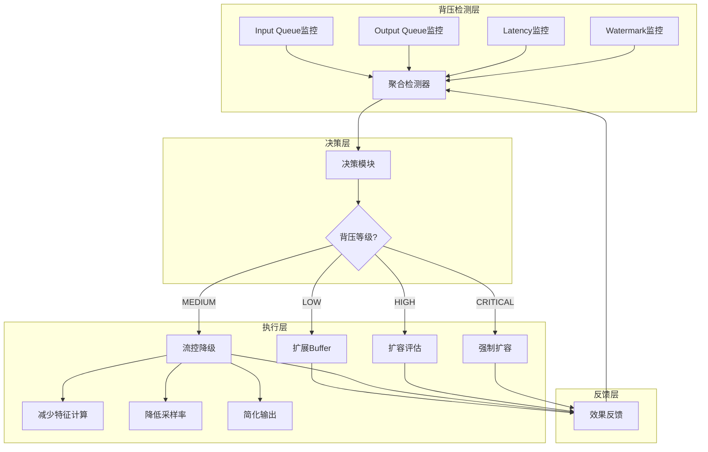
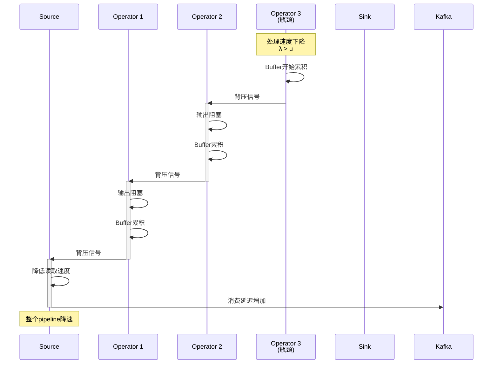
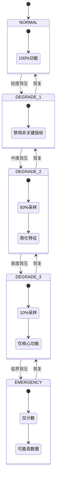

# 背压处理模式

> **所属阶段**: Knowledge/02-design-patterns | **前置依赖**: [02.01-stream-join-patterns.md](./02.01-stream-join-patterns.md) | **形式化等级**: L3-L5
>
> 本模式解决流处理系统中背压（Backpressure）的检测、缓解和恢复策略，保障系统稳定性和可用性。

---

## 目录

- [背压处理模式](#背压处理模式)
  - [目录](#目录)
  - [1. 概念定义 (Definitions)](#1-概念定义-definitions)
    - [1.1 背压的本质](#11-背压的本质)
    - [1.2 背压检测指标](#12-背压检测指标)
    - [1.3 背压缓解策略](#13-背压缓解策略)
    - [1.4 背压恢复机制](#14-背压恢复机制)
  - [2. 属性推导 (Properties)](#2-属性推导-properties)
    - [2.1 背压传播特性](#21-背压传播特性)
    - [2.2 缓解策略的有效性](#22-缓解策略的有效性)
    - [2.3 恢复机制的稳定性](#23-恢复机制的稳定性)
  - [3. 关系建立 (Relations)](#3-关系建立-relations)
    - [3.1 背压处理与其他模式的关系](#31-背压处理与其他模式的关系)
    - [3.2 与 Checkpoint 的交互](#32-与-checkpoint-的交互)
    - [3.3 与 Watermark 的关系](#33-与-watermark-的关系)
  - [4. 论证过程 (Argumentation)](#4-论证过程-argumentation)
    - [4.1 背压根因分析](#41-背压根因分析)
    - [4.2 流控降级策略设计](#42-流控降级策略设计)
    - [4.3 动态缓冲区设计](#43-动态缓冲区设计)
  - [5. 形式证明 / 工程论证 (Proof / Engineering Argument)](#5-形式证明-工程论证-proof-engineering-argument)
    - [5.1 背压传播的形式化模型](#51-背压传播的形式化模型)
    - [5.2 流控降级的最优性](#52-流控降级的最优性)
    - [5.3 工程实践论证](#53-工程实践论证)
  - [6. 实例验证 (Examples)](#6-实例验证-examples)
    - [6.1 背压检测实现](#61-背压检测实现)
    - [6.2 动态流控降级实现](#62-动态流控降级实现)
    - [6.3 弹性扩缩容实现](#63-弹性扩缩容实现)
  - [7. 可视化 (Visualizations)](#7-可视化-visualizations)
    - [7.1 背压处理架构](#71-背压处理架构)
    - [7.2 背压传播时序图](#72-背压传播时序图)
    - [7.3 降级策略状态机](#73-降级策略状态机)
  - [8. 引用参考 (References)](#8-引用参考-references)

---

## 1. 概念定义 (Definitions)

### 1.1 背压的本质

**Def-K-02-13 [背压 (Backpressure)]**: 在流处理系统中，当下游算子的处理速率 $\mu$ 低于上游算子的产生速率 $\lambda$ 时，数据在缓冲区累积，这种压力向上游传播的现象称为背压。形式化为：

$$
\text{Backpressure} \iff \lambda > \mu \land \frac{dB}{dt} > 0
$$

其中 $B$ 为缓冲区占用量。背压是流处理系统的**自我保护机制**，防止因数据堆积导致系统崩溃。

**Def-K-02-14 [背压传播]**: 设算子链为 $O_1 \to O_2 \to ... \to O_n$，若 $O_k$ 出现瓶颈，则背压向 $O_{k-1}, O_{k-2}, ..., O_1$ 传播，传播速度为：

$$
v_{prop} = \frac{\Delta B}{\Delta t} \cdot \frac{1}{C_{channel}}
$$

其中 $C_{channel}$ 为通道容量。

### 1.2 背压检测指标

**Def-K-02-15 [背压指标]**: 背压可通过以下指标量化：

| 指标 | 定义 | 阈值 | 告警级别 |
|-----|------|-----|---------|
| **输入队列占用率** | $\frac{Q_{in}}{Q_{max}}$ | > 0.8 | 高 |
| **输出队列占用率** | $\frac{Q_{out}}{Q_{max}}$ | > 0.7 | 中 |
| **处理延迟** | $T_{process} - T_{arrival}$ | > P99 500ms | 高 |
| **Watermark 延迟** | $T_{current} - W_{latest}$ | > 30s | 高 |
| **反压比例** | $\frac{T_{blocked}}{T_{total}}$ | > 0.5 | 极高 |

**Def-K-02-16 [临界背压]**: 当缓冲区占用率达到临界点 $\theta_{crit}$ 时，系统进入不稳定状态，丢包或OOM风险显著增加：

$$
\text{Critical Backpressure} \iff \frac{Q_{occupied}}{Q_{max}} \geq \theta_{crit}
$$

通常 $\theta_{crit} = 0.9$。

### 1.3 背压缓解策略

**Def-K-02-17 [流控降级]**: 流控降级是在背压发生时主动降低处理质量以维持吞吐的策略，形式化为：

$$
\text{Degradation}: (Q, \lambda) \to (Q', \lambda') \quad \text{where } Q' < Q, \lambda' \geq \lambda
$$

其中 $Q$ 为处理质量（如精度、完整性），$\lambda$ 为吞吐。

**Def-K-02-18 [动态缓冲]**: 动态缓冲是根据负载自动调整缓冲区容量的策略：

$$
B_{target} = \min(B_{max}, \alpha \cdot \lambda \cdot L_{target})
$$

其中 $\alpha$ 为安全系数，$L_{target}$ 为目标延迟。

### 1.4 背压恢复机制

**Def-K-02-19 [弹性扩缩容]**: 弹性扩缩容是根据背压程度自动调整并行度的机制：

$$
P_{new} = \lceil P_{current} \cdot \frac{\lambda}{\mu} \cdot \beta \rceil
$$

其中 $\beta$ 为扩容余量系数（通常1.2-1.5）。

---

## 2. 属性推导 (Properties)

### 2.1 背压传播特性

**Lemma-K-02-10 [背压传播单调性]**: 背压向上游传播时，上游算子的有效吞吐单调递减。

*证明*: 设算子 $O_i$ 的输出速率等于 $O_{i+1}$ 的输入速率。当 $O_{i+1}$ 产生背压，其输入速率被限制为 $\mu_{i+1}$。因此 $O_i$ 的输出速率也被限制为 $\mu_{i+1}$，递归向上游传播。□

**Lemma-K-02-11 [背压传播的延迟边界]**: 从下游瓶颈到Source的背压传播延迟有上界：

$$
T_{prop} \leq \sum_{i=1}^{n-1} \frac{B_{max}^{(i)}}{\lambda_i}
$$

其中 $B_{max}^{(i)}$ 为第 $i$ 个算子的最大缓冲区。

### 2.2 缓解策略的有效性

**Prop-K-02-05 [流控降级的吞吐保证]**: 设原始吞吐为 $\lambda_0$，降级后吞吐为 $\lambda_d$。若降级策略有效，则：

$$
\lambda_d \geq \lambda_0 \cdot (1 - \epsilon)
$$

其中 $\epsilon$ 为可接受的吞吐损失率（通常 < 0.1）。

**Prop-K-02-06 [动态缓冲的延迟-吞吐权衡]**: 增大缓冲区可提高吞吐但增加延迟：

$$
\frac{\partial \lambda}{\partial B} > 0, \quad \frac{\partial L}{\partial B} > 0
$$

最优缓冲区大小满足：

$$
B^* = \arg\max_B (\lambda(B) - \gamma \cdot L(B))
$$

其中 $\gamma$ 为延迟惩罚系数。

### 2.3 恢复机制的稳定性

**Lemma-K-02-12 [弹性扩容的稳定性条件]**: 弹性扩容系统稳定的条件是扩容决策延迟小于背压恶化时间：

$$
T_{scale} < T_{degrade} = \frac{B_{max} - B_{current}}{\lambda - \mu}
$$

**Prop-K-02-07 [回压解除的收敛性]**: 在固定负载和扩容策略下，回压解除过程是指数收敛的：

$$
B(t) = B_{max} \cdot e^{-kt}
$$

其中 $k$ 为收敛系数，取决于扩容速度和负载特性。

---

## 3. 关系建立 (Relations)

### 3.1 背压处理与其他模式的关系

```
┌─────────────────────────────────────────────────────────────────────────┐
│                       背压处理模式关系图谱                               │
├─────────────────────────────────────────────────────────────────────────┤
│                                                                         │
│  ┌──────────────┐      触发条件        ┌──────────────┐                  │
│  │   Backpressure│────────────────────►│   Detection  │                  │
│  │   (背压发生)  │                      │   (检测机制)  │                  │
│  └──────┬───────┘                      └──────┬───────┘                  │
│         │                                     │                          │
│         ▼                                     ▼                          │
│  ┌──────────────┐                      ┌──────────────┐                  │
│  │   Mitigation │◄────────────────────►│    Alerting  │                  │
│  │   (缓解策略)  │                      │   (告警通知)  │                  │
│  └──────┬───────┘                      └──────────────┘                  │
│         │                                                                │
│    ┌────┴────┬──────────┬──────────┐                                    │
│    ▼         ▼          ▼          ▼                                    │
│ ┌──────┐ ┌──────┐  ┌────────┐ ┌────────┐                               │
│ │Buffer│ │Degrade│  │ Scale  │ │Circuit │                               │
│ │Expand│ │Grade │  │  Out   │ │ Breaker│                               │ │
│ │(缓冲扩展)│ (降级) │  │ (扩容) │ │ (熔断) │                               │
│ └──┬───┘ └──┬───┘  └───┬────┘ └───┬────┘                               │
│    │        │          │          │                                     │
│    └────────┴────┬─────┴──────────┘                                     │
│                  ▼                                                      │
│           ┌──────────┐                                                  │
│           │ Recovery │                                                  │
│           │ (恢复)   │                                                  │
│           └──────────┘                                                  │
│                                                                         │
└─────────────────────────────────────────────────────────────────────────┘
```

### 3.2 与 Checkpoint 的交互

**背压对Checkpoint的影响**:

- 背压增加Checkpoint时间（数据流动缓慢）
- 极端背压可能导致Checkpoint超时
- 建议：在背压期间延长Checkpoint间隔

**Checkpoint对背压的影响**:

- 同步阶段会短暂阻塞数据流
- 可能触发临时背压
- 建议：使用增量Checkpoint和异步快照

### 3.3 与 Watermark 的关系

**背压的Watermark表现**:

- 背压导致Watermark推进缓慢
- Watermark延迟可作为背压的间接指标
- 建议：配置Watermark空闲超时，防止永久停滞

---

## 4. 论证过程 (Argumentation)

### 4.1 背压根因分析

**常见根因分类**:

| 类别 | 具体原因 | 检测方法 | 解决方案 |
|-----|---------|---------|---------|
| **计算密集型** | 复杂算法、大数据量处理 | CPU使用率 > 80% | 优化算法、并行化 |
| **I/O密集型** | 慢速Sink、网络延迟 | I/O等待高 | 异步I/O、批处理 |
| **状态访问** | 大状态、频繁状态读写 | State访问延迟高 | 状态优化、本地缓存 |
| **数据倾斜** | 某些Key数据量过大 | 子任务处理不均 | Key重分区、两阶段聚合 |
| **GC压力** | 堆内存不足、频繁GC | GC时间 > 10% | 调优GC、增加内存 |

### 4.2 流控降级策略设计

**降级层次**:

```
Level 0 (正常): 100% 功能,100% 质量
      ↓ [检测到轻度背压]
Level 1 (轻度): 禁用非关键指标,采样率 100%
      ↓ [中度背压]
Level 2 (中度): 禁用次要特征,采样率 50%
      ↓ [重度背压]
Level 3 (重度): 仅保留关键指标,采样率 10%
      ↓ [极端背压]
Level 4 (极限): 仅计数,采样率 1%,可能丢数据
```

**降级决策矩阵**:

| 背压程度 | 队列占用率 | 采样率 | 特征选择 | 输出目标 |
|---------|-----------|-------|---------|---------|
| 正常 | < 50% | 100% | 全部 | 主Sink |
| 轻度 | 50-70% | 100% | 移除低优先级 | 主Sink |
| 中度 | 70-85% | 50% | 仅核心特征 | 主Sink+日志 |
| 重度 | 85-95% | 10% | 仅计数 | 仅日志 |
| 极限 | > 95% | 1% | 仅存在性 | 丢弃或延迟 |

### 4.3 动态缓冲区设计

**缓冲区大小动态调整**:

```java
// 伪代码:基于负载的缓冲区调整
class AdaptiveBuffer {
    private int currentBufferSize;
    private final int minBufferSize;
    private final int maxBufferSize;

    public void adjustBuffer(double inputRate, double processRate, double currentLatency) {
        double ratio = inputRate / processRate;

        if (ratio > 1.5) {
            // 严重背压,增大缓冲区
            currentBufferSize = Math.min(currentBufferSize * 2, maxBufferSize);
        } else if (ratio > 1.2) {
            // 轻度背压,适度增大
            currentBufferSize = Math.min((int)(currentBufferSize * 1.5), maxBufferSize);
        } else if (ratio < 0.8 && currentLatency < targetLatency) {
            // 处理有余,可以减小缓冲区降低延迟
            currentBufferSize = Math.max(currentBufferSize / 2, minBufferSize);
        }
    }
}
```

---

## 5. 形式证明 / 工程论证 (Proof / Engineering Argument)

### 5.1 背压传播的形式化模型

**Thm-K-02-05 [背压传播模型]**: 在包含 $n$ 个算子的链式拓扑中，从第 $k$ 个算子产生的背压传播到Source的时间满足：

$$
T_{prop}^{(k)} = \sum_{i=1}^{k-1} \frac{B_{max}^{(i)}}{\mu^{(i+1)}}
$$

**证明**:

设第 $k$ 个算子的处理速率为 $\mu_k$，成为瓶颈。则第 $k-1$ 个算子的输出被限制为 $\mu_k$，其缓冲区以速率 $\lambda_{k-1} - \mu_k$ 填充。

填满缓冲区 $B_{max}^{(k-1)}$ 的时间为：

$$t_{k-1} = \frac{B_{max}^{(k-1)}}{\lambda_{k-1} - \mu_k} \approx \frac{B_{max}^{(k-1)}}{\mu_k}$$

（假设稳态时 $\lambda_{k-1} \approx \mu_{k-1}$）

递归向上游传播，总时间为：

$$T_{prop}^{(k)} = \sum_{i=1}^{k-1} t_i = \sum_{i=1}^{k-1} \frac{B_{max}^{(i)}}{\mu_{i+1}}$$

当传播到Source时，Source的输入被限制，完成背压传播。□

### 5.2 流控降级的最优性

**Thm-K-02-06 [最优降级策略]**: 在背压约束下，最大化处理质量的最优降级策略是优先降级低价值数据。

**证明概要**:

设数据集合为 $D = \{d_1, d_2, ..., d_n\}$，每个数据 $d_i$ 具有价值 $v_i$ 和处理成本 $c_i$。在背压约束 $\sum c_i \leq C_{max}$ 下，目标是最大化总价值：

$$
\max \sum_{i \in S} v_i \quad \text{s.t.} \quad \sum_{i \in S} c_i \leq C_{max}
$$

这是一个0-1背包问题，最优解是按价值密度 $\frac{v_i}{c_i}$ 降序选择。因此，优先处理高价值密度（高价值/低成本）的数据是最优策略。□

### 5.3 工程实践论证

**论证 1: 背压监控的采样频率**

设背压恶化特征时间为 $T_{degrade}$，监控采样间隔为 $T_{sample}$。为了及时检测背压：

$$
T_{sample} < \frac{T_{degrade}}{2}
$$

对于典型流处理系统，$T_{degrade}$ 在秒级，因此 $T_{sample}$ 应在500ms-1s范围。

**论证 2: 扩容的冷却期**

频繁扩缩容会导致系统不稳定。设扩容生效时间为 $T_{warmup}$，冷却期应满足：

$$
T_{cooldown} > 3 \cdot T_{warmup}
$$

**论证 3: 缓冲区大小的经验公式**

基于生产经验，推荐缓冲区大小：

$$
B_{recommended} = \lambda \cdot L_{target} \cdot (1 + \sigma)
$$

其中 $\lambda$ 为期望吞吐，$L_{target}$ 为目标延迟，$\sigma$ 为波动安全系数（通常0.2-0.3）。

---

## 6. 实例验证 (Examples)

### 6.1 背压检测实现

```java
/**
 * 背压检测器
 * 通过监控Flink Metrics实现实时背压检测
 */
public class BackpressureDetector {

    private final MetricReporter reporter;
    private final BackpressureListener listener;

    // 背压阈值配置
    private static final double QUEUE_THRESHOLD_HIGH = 0.8;
    private static final double QUEUE_THRESHOLD_CRITICAL = 0.95;
    private static final long LATENCY_THRESHOLD_MS = 5000;
    private static final long WATERMARK_LAG_THRESHOLD_MS = 30000;

    public BackpressureDetector(MetricReporter reporter, BackpressureListener listener) {
        this.reporter = reporter;
        this.listener = listener;
    }

    /**
     * 执行背压检测
     */
    public BackpressureStatus detect() {
        // 获取指标
        double inputQueueUsage = reporter.getInputQueueUsage();
        double outputQueueUsage = reporter.getOutputQueueUsage();
        long processingLatency = reporter.getProcessingLatency();
        long watermarkLag = reporter.getWatermarkLag();
        double backpressureRatio = reporter.getBackpressureRatio();

        // 计算背压等级
        BackpressureLevel level = calculateLevel(
            inputQueueUsage, outputQueueUsage,
            processingLatency, watermarkLag, backpressureRatio
        );

        // 识别瓶颈算子
        List<String> bottleneckOperators = identifyBottlenecks();

        BackpressureStatus status = new BackpressureStatus(
            level,
            inputQueueUsage,
            outputQueueUsage,
            processingLatency,
            watermarkLag,
            backpressureRatio,
            bottleneckOperators,
            System.currentTimeMillis()
        );

        // 触发监听器
        if (level != BackpressureLevel.NORMAL) {
            listener.onBackpressureDetected(status);
        }

        return status;
    }

    private BackpressureLevel calculateLevel(
        double inputQueue, double outputQueue,
        long latency, long watermarkLag, double backpressureRatio) {

        int score = 0;

        // 队列占用评分
        if (inputQueue > QUEUE_THRESHOLD_CRITICAL) score += 4;
        else if (inputQueue > QUEUE_THRESHOLD_HIGH) score += 2;

        if (outputQueue > QUEUE_THRESHOLD_HIGH) score += 1;

        // 延迟评分
        if (latency > LATENCY_THRESHOLD_MS * 2) score += 3;
        else if (latency > LATENCY_THRESHOLD_MS) score += 1;

        // Watermark滞后评分
        if (watermarkLag > WATERMARK_LAG_THRESHOLD_MS * 2) score += 2;
        else if (watermarkLag > WATERMARK_LAG_THRESHOLD_MS) score += 1;

        // 反压比例评分
        if (backpressureRatio > 0.8) score += 3;
        else if (backpressureRatio > 0.5) score += 1;

        // 根据总分判定等级
        if (score >= 8) return BackpressureLevel.CRITICAL;
        if (score >= 5) return BackpressureLevel.HIGH;
        if (score >= 3) return BackpressureLevel.MEDIUM;
        if (score >= 1) return BackpressureLevel.LOW;
        return BackpressureLevel.NORMAL;
    }

    private List<String> identifyBottlenecks() {
        List<String> bottlenecks = new ArrayList<>();
        Map<String, OperatorMetrics> operatorMetrics = reporter.getOperatorMetrics();

        for (Map.Entry<String, OperatorMetrics> entry : operatorMetrics.entrySet()) {
            String operatorId = entry.getKey();
            OperatorMetrics metrics = entry.getValue();

            // 识别瓶颈条件
            boolean isBottleneck =
                metrics.getInputQueueUsage() > QUEUE_THRESHOLD_HIGH ||
                metrics.getProcessingLatency() > LATENCY_THRESHOLD_MS ||
                metrics.getIdleTimeMs() < 100;  // 几乎无空闲时间

            if (isBottleneck) {
                bottlenecks.add(operatorId);
            }
        }

        return bottlenecks;
    }
}

/**
 * 背压监听器接口
 */
interface BackpressureListener {
    void onBackpressureDetected(BackpressureStatus status);
    void onBackpressureRecovered(BackpressureStatus status);
}

/**
 * 自动缓解背压的监听器实现
 */
class AutoRemediationListener implements BackpressureListener {

    private final BufferManager bufferManager;
    private final DegradationController degradationController;
    private final ScalingController scalingController;

    @Override
    public void onBackpressureDetected(BackpressureStatus status) {
        switch (status.getLevel()) {
            case LOW:
                // 轻度背压:优化缓冲区
                bufferManager.expandBuffer(1.2);
                break;

            case MEDIUM:
                // 中度背压:缓冲区扩展 + 轻度降级
                bufferManager.expandBuffer(1.5);
                degradationController.degrade(DegradationLevel.LEVEL_1);
                break;

            case HIGH:
                // 高度背压:积极降级 + 触发扩容评估
                degradationController.degrade(DegradationLevel.LEVEL_2);
                scalingController.evaluateScaling(status);
                break;

            case CRITICAL:
                // 临界背压:极限降级 + 强制扩容
                degradationController.degrade(DegradationLevel.LEVEL_3);
                scalingController.triggerScaling();
                break;
        }
    }

    @Override
    public void onBackpressureRecovered(BackpressureStatus status) {
        // 逐步恢复服务质量
        degradationController.recover();
        bufferManager.restoreBuffer();
    }
}
```

### 6.2 动态流控降级实现

```java
import org.apache.flink.streaming.api.functions.ProcessFunction;

import org.apache.flink.api.common.state.ValueState;
import org.apache.flink.api.common.state.ValueStateDescriptor;
import org.apache.flink.api.common.typeinfo.Types;


/**
 * 动态流控降级处理器
 * 根据背压程度自动调整处理策略
 */
public class AdaptiveDegradationProcessor
    extends ProcessFunction<RawEvent, EnrichedEvent> {

    // 降级级别状态
    private ValueState<DegradationLevel> degradationLevelState;

    // 采样状态
    private ValueState<Long> sampleCounterState;

    // 配置参数
    private final DegradationConfig config;

    public AdaptiveDegradationProcessor(DegradationConfig config) {
        this.config = config;
    }

    @Override
    public void open(Configuration parameters) {
        degradationLevelState = getRuntimeContext().getState(
            new ValueStateDescriptor<>("degradation-level",
                Types.POJO(DegradationLevel.class)));

        sampleCounterState = getRuntimeContext().getState(
            new ValueStateDescriptor<>("sample-counter", Types.LONG));
    }

    @Override
    public void processElement(RawEvent event, Context ctx, Collector<EnrichedEvent> out)
        throws Exception {

        DegradationLevel level = degradationLevelState.value();
        if (level == null) {
            level = DegradationLevel.LEVEL_0;
        }

        // 根据降级级别处理
        switch (level) {
            case LEVEL_0:  // 正常处理
                processNormal(event, out);
                break;

            case LEVEL_1:  // 轻度降级:禁用非关键字段
                processLevel1(event, out);
                break;

            case LEVEL_2:  // 中度降级:采样50%
                if (shouldSample(0.5)) {
                    processLevel2(event, out);
                }
                break;

            case LEVEL_3:  // 重度降级:采样10%,仅核心字段
                if (shouldSample(0.1)) {
                    processLevel3(event, out);
                }
                break;

            case LEVEL_4:  // 极限降级:仅计数
                if (shouldSample(0.01)) {
                    out.collect(createCountOnlyEvent(event));
                }
                break;
        }
    }

    private void processNormal(RawEvent event, Collector<EnrichedEvent> out) {
        // 完整处理:所有特征计算
        EnrichedEvent enriched = new EnrichedEvent();
        enriched.setEventId(event.getEventId());
        enriched.setTimestamp(event.getTimestamp());
        enriched.setUserId(event.getUserId());

        // 计算全部特征
        enriched.setFeatures(calculateAllFeatures(event));
        enriched.setMetrics(calculateAllMetrics(event));
        enriched.setQualityScore(1.0);

        out.collect(enriched);
    }

    private void processLevel1(RawEvent event, Collector<EnrichedEvent> out) {
        // 轻度降级:跳过低优先级特征
        EnrichedEvent enriched = new EnrichedEvent();
        enriched.setEventId(event.getEventId());
        enriched.setTimestamp(event.getTimestamp());
        enriched.setUserId(event.getUserId());

        // 仅计算核心特征
        enriched.setFeatures(calculateCoreFeatures(event));
        // 跳过非关键指标
        enriched.setMetrics(null);
        enriched.setQualityScore(0.8);

        out.collect(enriched);
    }

    private void processLevel2(RawEvent event, Collector<EnrichedEvent> out) {
        // 中度降级:简化处理
        EnrichedEvent enriched = new EnrichedEvent();
        enriched.setEventId(event.getEventId());
        enriched.setTimestamp(event.getTimestamp());

        // 使用近似算法
        enriched.setFeatures(calculateApproximateFeatures(event));
        enriched.setQualityScore(0.5);

        out.collect(enriched);
    }

    private void processLevel3(RawEvent event, Collector<EnrichedEvent> out) {
        // 重度降级:仅最基本处理
        EnrichedEvent enriched = new EnrichedEvent();
        enriched.setEventId(event.getEventId());
        enriched.setTimestamp(event.getTimestamp());
        enriched.setUserId(event.getUserId());

        // 仅提取基本信息
        enriched.setQualityScore(0.2);

        out.collect(enriched);
    }

    private boolean shouldSample(double rate) throws Exception {
        Long counter = sampleCounterState.value();
        if (counter == null) {
            counter = 0L;
        }

        counter++;
        sampleCounterState.update(counter);

        // 使用一致性采样
        return (counter % (int)(1.0 / rate)) == 0;
    }

    /**
     * 外部调用:更新降级级别
     */
    public void updateDegradationLevel(DegradationLevel newLevel) throws Exception {
        DegradationLevel current = degradationLevelState.value();
        if (current != newLevel) {
            degradationLevelState.update(newLevel);

            // 记录级别变更
            System.out.println(String.format(
                "Degradation level changed: %s -> %s at %d",
                current, newLevel, System.currentTimeMillis()
            ));
        }
    }

    private Map<String, Object> calculateAllFeatures(RawEvent event) {
        Map<String, Object> features = new HashMap<>();
        features.put("user_history", computeUserHistory(event));
        features.put("session_features", computeSessionFeatures(event));
        features.put("context_features", computeContextFeatures(event));
        features.put("ml_features", computeMLFeatures(event));
        return features;
    }

    private Map<String, Object> calculateCoreFeatures(RawEvent event) {
        Map<String, Object> features = new HashMap<>();
        features.put("user_history", computeUserHistory(event));
        features.put("session_features", computeSessionFeatures(event));
        // 跳过context_features和ml_features
        return features;
    }

    private Map<String, Object> calculateApproximateFeatures(RawEvent event) {
        Map<String, Object> features = new HashMap<>();
        // 使用近似算法
        features.put("user_history_approx", approximateUserHistory(event));
        return features;
    }

    // 辅助方法占位符
    private Object computeUserHistory(RawEvent event) { return null; }
    private Object computeSessionFeatures(RawEvent event) { return null; }
    private Object computeContextFeatures(RawEvent event) { return null; }
    private Object computeMLFeatures(RawEvent event) { return null; }
    private Object approximateUserHistory(RawEvent event) { return null; }
    private Map<String, Double> calculateAllMetrics(RawEvent event) { return null; }
    private EnrichedEvent createCountOnlyEvent(RawEvent event) { return new EnrichedEvent(); }
}
```

### 6.3 弹性扩缩容实现

```java
/**
 * 基于背压的自动扩缩容控制器
 */
public class BackpressureBasedAutoScaler {

    private final KubernetesClient k8sClient;
    private final FlinkRestClient flinkClient;
    private final ScalingConfig config;

    // 冷却期状态
    private volatile long lastScaleTime = 0;
    private volatile ScalingDirection lastScaleDirection = null;

    public BackpressureBasedAutoScaler(
        KubernetesClient k8sClient,
        FlinkRestClient flinkClient,
        ScalingConfig config) {

        this.k8sClient = k8sClient;
        this.flinkClient = flinkClient;
        this.config = config;
    }

    /**
     * 评估是否需要扩缩容
     */
    public ScalingDecision evaluateScaling(BackpressureStatus status) {
        // 检查冷却期
        if (System.currentTimeMillis() - lastScaleTime < config.getCooldownMs()) {
            return ScalingDecision.noOp("In cooldown period");
        }

        // 获取当前作业状态
        JobDetails jobDetails = flinkClient.getJobDetails();
        Map<String, OperatorMetrics> operatorMetrics = flinkClient.getOperatorMetrics();

        // 分析各算子的瓶颈情况
        List<ScalingTarget> targets = analyzeBottlenecks(operatorMetrics, status);

        if (targets.isEmpty()) {
            return ScalingDecision.noOp("No bottleneck detected");
        }

        // 计算建议并行度
        Map<String, Integer> proposedParallelism = new HashMap<>();
        for (ScalingTarget target : targets) {
            int currentParallelism = target.getCurrentParallelism();
            int proposed = calculateProposedParallelism(
                target, status, currentParallelism
            );

            // 限制最大并行度
            proposed = Math.min(proposed, config.getMaxParallelism());
            proposed = Math.max(proposed, config.getMinParallelism());

            if (proposed != currentParallelism) {
                proposedParallelism.put(target.getOperatorId(), proposed);
            }
        }

        if (proposedParallelism.isEmpty()) {
            return ScalingDecision.noOp("No scaling needed");
        }

        return ScalingDecision.scale(proposedParallelism);
    }

    /**
     * 执行扩缩容
     */
    public void executeScaling(ScalingDecision decision) {
        if (!decision.shouldScale()) {
            return;
        }

        Map<String, Integer> parallelismMap = decision.getProposedParallelism();

        try {
            // 保存当前Checkpoint
            String checkpointPath = flinkClient.triggerCheckpoint();

            // 停止作业(使用savepoint)
            String savepointPath = flinkClient.stopWithSavepoint(checkpointPath);

            // 更新配置
            FlinkDeployment deployment = k8sClient
                .resources(FlinkDeployment.class)
                .inNamespace(config.getNamespace())
                .withName(config.getDeploymentName())
                .get();

            // 修改并行度配置
            for (Map.Entry<String, Integer> entry : parallelismMap.entrySet()) {
                updateOperatorParallelism(deployment, entry.getKey(), entry.getValue());
            }

            // 应用更新
            k8sClient.resource(deployment).update();

            // 启动作业
            flinkClient.startFromSavepoint(savepointPath);

            // 更新冷却期状态
            lastScaleTime = System.currentTimeMillis();
            lastScaleDirection = decision.getDirection();

            System.out.println("Scaling executed successfully: " + parallelismMap);

        } catch (Exception e) {
            System.err.println("Scaling failed: " + e.getMessage());
            // 触发告警
            triggerScalingFailureAlert(e);
        }
    }

    private int calculateProposedParallelism(
        ScalingTarget target,
        BackpressureStatus status,
        int currentParallelism) {

        // 基于背压程度计算扩容因子
        double scaleFactor;
        switch (status.getLevel()) {
            case CRITICAL:
                scaleFactor = 2.0;
                break;
            case HIGH:
                scaleFactor = 1.5;
                break;
            case MEDIUM:
                scaleFactor = 1.3;
                break;
            default:
                scaleFactor = 1.0;
        }

        // 基于实际负载调整
        double loadRatio = target.getInputRate() / target.getOutputRate();
        scaleFactor = Math.max(scaleFactor, loadRatio * 1.2);

        // 应用扩容因子
        int proposed = (int) Math.ceil(currentParallelism * scaleFactor);

        // 对齐到2的幂次(Flink推荐)
        proposed = roundToPowerOfTwo(proposed);

        return proposed;
    }

    private List<ScalingTarget> analyzeBottlenecks(
        Map<String, OperatorMetrics> metrics,
        BackpressureStatus status) {

        List<ScalingTarget> targets = new ArrayList<>();

        for (Map.Entry<String, OperatorMetrics> entry : metrics.entrySet()) {
            OperatorMetrics m = entry.getValue();

            boolean isBottleneck =
                m.getInputQueueUsage() > 0.8 ||
                m.getBackpressureRatio() > 0.5 ||
                m.getProcessingLatency() > 5000;

            if (isBottleneck) {
                targets.add(new ScalingTarget(
                    entry.getKey(),
                    m.getParallelism(),
                    m.getInputRate(),
                    m.getOutputRate()
                ));
            }
        }

        return targets;
    }

    private int roundToPowerOfTwo(int n) {
        if (n <= 0) return 1;
        if ((n & (n - 1)) == 0) return n;
        return Integer.highestOneBit(n) << 1;
    }

    private void updateOperatorParallelism(
        FlinkDeployment deployment,
        String operatorId,
        int newParallelism) {

        // 更新Flink部署配置中的并行度设置
        // 具体实现取决于Flink Kubernetes Operator的API
    }

    private void triggerScalingFailureAlert(Exception e) {
        // 发送告警通知
    }
}

/**
 * 扩缩容配置
 */
class ScalingConfig {
    private int minParallelism = 1;
    private int maxParallelism = 128;
    private long cooldownMs = 300000;  // 5分钟冷却期
    private String namespace = "default";
    private String deploymentName = "flink-job";

    // Getters and setters...
    public int getMinParallelism() { return minParallelism; }
    public int getMaxParallelism() { return maxParallelism; }
    public long getCooldownMs() { return cooldownMs; }
    public String getNamespace() { return namespace; }
    public String getDeploymentName() { return deploymentName; }
}

/**
 * 扩缩容决策
 */
class ScalingDecision {
    private final boolean shouldScale;
    private final Map<String, Integer> proposedParallelism;
    private final String reason;

    public static ScalingDecision noOp(String reason) {
        return new ScalingDecision(false, Collections.emptyMap(), reason);
    }

    public static ScalingDecision scale(Map<String, Integer> parallelism) {
        return new ScalingDecision(true, parallelism, "Scaling needed");
    }

    // Constructor, getters...
    public ScalingDirection getDirection() {
        // 计算扩容或缩容方向
        return ScalingDirection.SCALE_UP;
    }
}
```

---

## 7. 可视化 (Visualizations)

### 7.1 背压处理架构



### 7.2 背压传播时序图



### 7.3 降级策略状态机



---

## 8. 引用参考 (References)

---

*文档版本: v1.0 | 创建日期: 2026-04-18*
