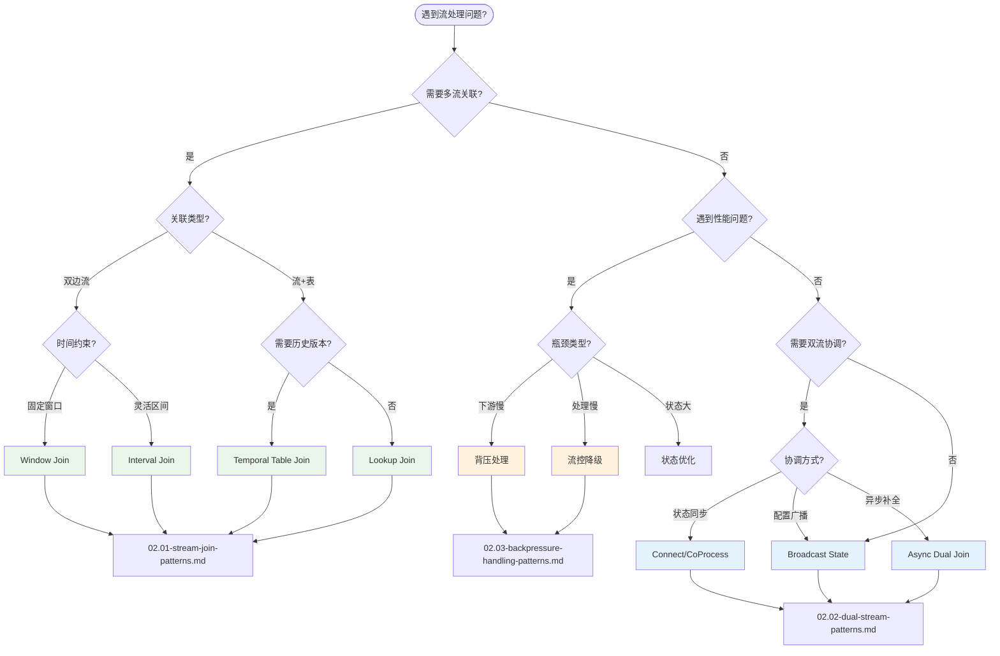

# 设计模式目录

> **所属阶段**: Knowledge/02-design-patterns | **形式化等级**: L3-L5
>
> 流计算设计模式索引，提供模式选择决策树和按场景分类的模式目录。

---

## 目录

- [设计模式目录](#设计模式目录)
  - [目录](#目录)
  - [设计模式总览](#设计模式总览)
    - [什么是流计算设计模式？](#什么是流计算设计模式)
    - [模式编号体系](#模式编号体系)
  - [模式选择决策树](#模式选择决策树)
  - [按场景分类](#按场景分类)
    - [1. 数据关联场景](#1-数据关联场景)
    - [2. 性能优化场景](#2-性能优化场景)
    - [3. 双流协调场景](#3-双流协调场景)
  - [模式速查表](#模式速查表)
    - [Stream Join 模式对比](#stream-join-模式对比)
    - [双流处理模式对比](#双流处理模式对比)
    - [背压处理策略矩阵](#背压处理策略矩阵)
  - [模式组合建议](#模式组合建议)
    - [典型组合模式](#典型组合模式)
  - [延伸阅读](#延伸阅读)
    - [核心文档](#核心文档)
    - [相关模式文档](#相关模式文档)
    - [形式化理论](#形式化理论)

---

## 设计模式总览

### 什么是流计算设计模式？

流计算设计模式是对流处理系统中**常见问题的可复用解决方案**的形式化描述。每个模式包含：

- **问题定义**: 模式所要解决的核心挑战
- **解决方案**: 经过验证的解决思路与实现
- **代码示例**: 可直接使用的工程实现
- **适用场景**: 明确的使用边界与限制

### 模式编号体系

本目录采用 `Def-K-02-{序号}` 的标准编号体系：

| 模式类别 | 编号范围 | 示例 |
|---------|---------|------|
| Stream Join | Def-K-02-01 ~ 02-06 | Def-K-02-01 [Stream Join] |
| 双流处理 | Def-K-02-07 ~ 02-12 | Def-K-02-08 [Connect 操作] |
| 背压处理 | Def-K-02-13 ~ 02-19 | Def-K-02-13 [背压] |

---

## 模式选择决策树



---

## 按场景分类

### 1. 数据关联场景

| 场景 | 推荐模式 | 文档 | 复杂度 |
|-----|---------|------|-------|
| 订单与支付实时关联 | Window Join | [02.01](02.01-stream-join-patterns.md) | ★★☆ |
| 广告点击归因 | Interval Join | [02.01](02.01-stream-join-patterns.md) | ★★★ |
| 历史汇率转换 | Temporal Table Join | [02.01](02.01-stream-join-patterns.md) | ★★★ |
| 用户信息补全 | Lookup Join | [02.01](02.01-stream-join-patterns.md) | ★☆☆ |
| 订单库存匹配 | Connect + CoProcess | [02.02](02.02-dual-stream-patterns.md) | ★★★ |
| 实时风控规则 | Broadcast State | [02.02](02.02-dual-stream-patterns.md) | ★★★ |

### 2. 性能优化场景

| 场景 | 推荐模式 | 文档 | 关键指标 |
|-----|---------|------|---------|
| 系统背压严重 | 背压检测 + 动态缓冲 | [02.03](02.03-backpressure-handling-patterns.md) | 队列占用率、延迟 |
| 高峰期降级 | 流控降级 | [02.03](02.03-backpressure-handling-patterns.md) | 采样率、功能裁剪 |
| 弹性扩缩容 | 自动扩容 | [02.03](02.03-backpressure-handling-patterns.md) | 并行度、冷却期 |

### 3. 双流协调场景

| 场景 | 推荐模式 | 文档 | 关键特性 |
|-----|---------|------|---------|
| 配置动态更新 | Broadcast State | [02.02](02.02-dual-stream-patterns.md) | 全任务同步 |
| 异构流处理 | Connect | [02.02](02.02-dual-stream-patterns.md) | 类型保持 |
| 异步外部查询 | Async I/O | [02.02](02.02-dual-stream-patterns.md) | 延迟隐藏 |

---

## 模式速查表

### Stream Join 模式对比

```
┌────────────────────┬──────────────────┬─────────────────┬─────────────────┐
│     模式            │    适用场景       │     状态需求     │    延迟特性     │
├────────────────────┼──────────────────┼─────────────────┼─────────────────┤
│ Window Join        │ 双边流、同窗口    │ 窗口缓冲区       │ 窗口结束触发    │
│ Interval Join      │ 时间相关、灵活    │ 时间有序缓冲     │ 即时匹配        │
│ Temporal Join      │ 历史版本追溯      │ 版本化状态       │ 即时查询        │
│ Lookup Join        │ 外部维表补全      │ 无/本地缓存      │ 同步/异步查询   │
└────────────────────┴──────────────────┴─────────────────┴─────────────────┘
```

### 双流处理模式对比

```
┌────────────────────┬──────────────────┬─────────────────┬─────────────────┐
│     模式            │    核心能力       │     状态类型     │    复杂度       │
├────────────────────┼──────────────────┼─────────────────┼─────────────────┤
│ Connect            │ 异构流协调        │ 双流独立状态     │ ★★☆            │
│ Broadcast State    │ 配置同步广播      │ 只读广播状态     │ ★★★            │
│ Async Dual Join    │ 异步非阻塞Join    │ 外部状态/缓存    │ ★★★            │
└────────────────────┴──────────────────┴─────────────────┴─────────────────┘
```

### 背压处理策略矩阵

```
┌────────────────────┬──────────────────┬─────────────────┬─────────────────┐
│     策略            │    触发条件       │     恢复速度     │    数据质量     │
├────────────────────┼──────────────────┼─────────────────┼─────────────────┤
│ 动态缓冲扩展        │ 队列占用 > 50%   │ 快              │ 无损失          │
│ 流控降级(L1)       │ 轻度背压         │ 快              │ 轻微下降        │
│ 流控降级(L2)       │ 中度背压         │ 较快            │ 中等下降        │
│ 流控降级(L3)       │ 重度背压         │ 较快            │ 明显下降        │
│ 弹性扩容           │ 持续背压         │ 慢(分钟级)      │ 无损失          │
└────────────────────┴──────────────────┴─────────────────┴─────────────────┘
```

---

## 模式组合建议

### 典型组合模式

**1. 实时风控系统**

```
用户行为流 ──┬─► Broadcast State ◄── 规则更新流
             │
             └─► CoProcessFunction ──► 风险评估结果
                    ▲
                    └── 查询用户画像 (Async Lookup)
```

**2. 实时数仓ETL**

```
业务流 ──► Window Join ──► Temporal Join ──► 清洗结果
              │                │
              └── 配置流 ──────┴── 汇率历史表
```

**3. 高可用推荐系统**

```
点击流 ──► Async Dual Join ──► 带降级处理 ──► 推荐结果
              │                    │
              └── 用户画像(缓存)    └── 背压检测
```

---

## 延伸阅读

### 核心文档

- [02.01 Stream Join 模式](02.01-stream-join-patterns.md) - Window Join、Interval Join、Temporal Join、Lookup Join
- [02.02 双流处理模式](02.02-dual-stream-patterns.md) - Connect/CoProcess、Broadcast State、Async Dual Join
- [02.03 背压处理模式](02.03-backpressure-handling-patterns.md) - 检测、动态缓冲、流控降级、弹性扩容

### 相关模式文档

- [pattern-event-time-processing.md](pattern-event-time-processing.md) - 事件时间处理
- [pattern-windowed-aggregation.md](pattern-windowed-aggregation.md) - 窗口聚合
- [pattern-stateful-computation.md](pattern-stateful-computation.md) - 有状态计算
- [pattern-async-io-enrichment.md](pattern-async-io-enrichment.md) - 异步IO补全

### 形式化理论

- [Struct/01-foundation/](../../Struct/01-foundation/) - 流计算理论基础
- [Struct/00-INDEX.md](../../Struct/00-INDEX.md) - 分布式一致性

---

*最后更新: 2026-04-11 | 文档版本: v1.0*
