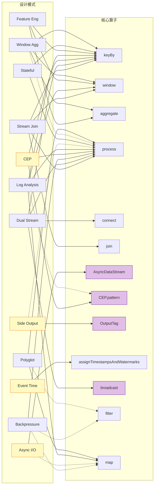
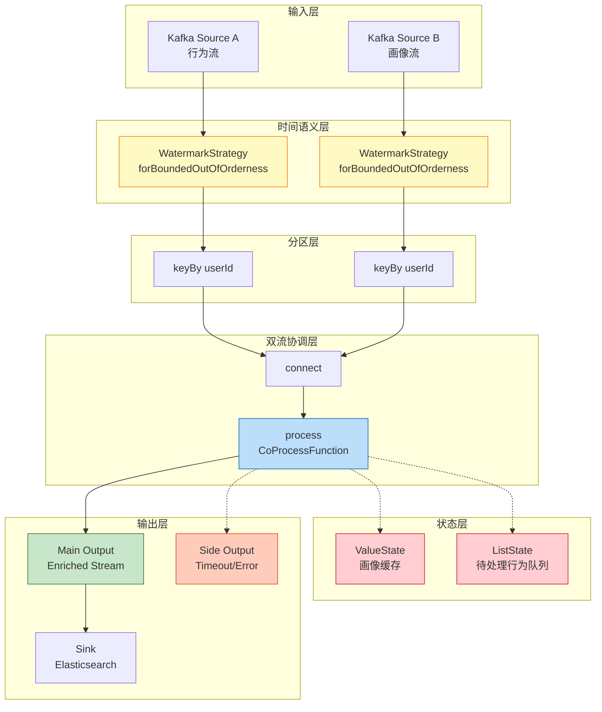
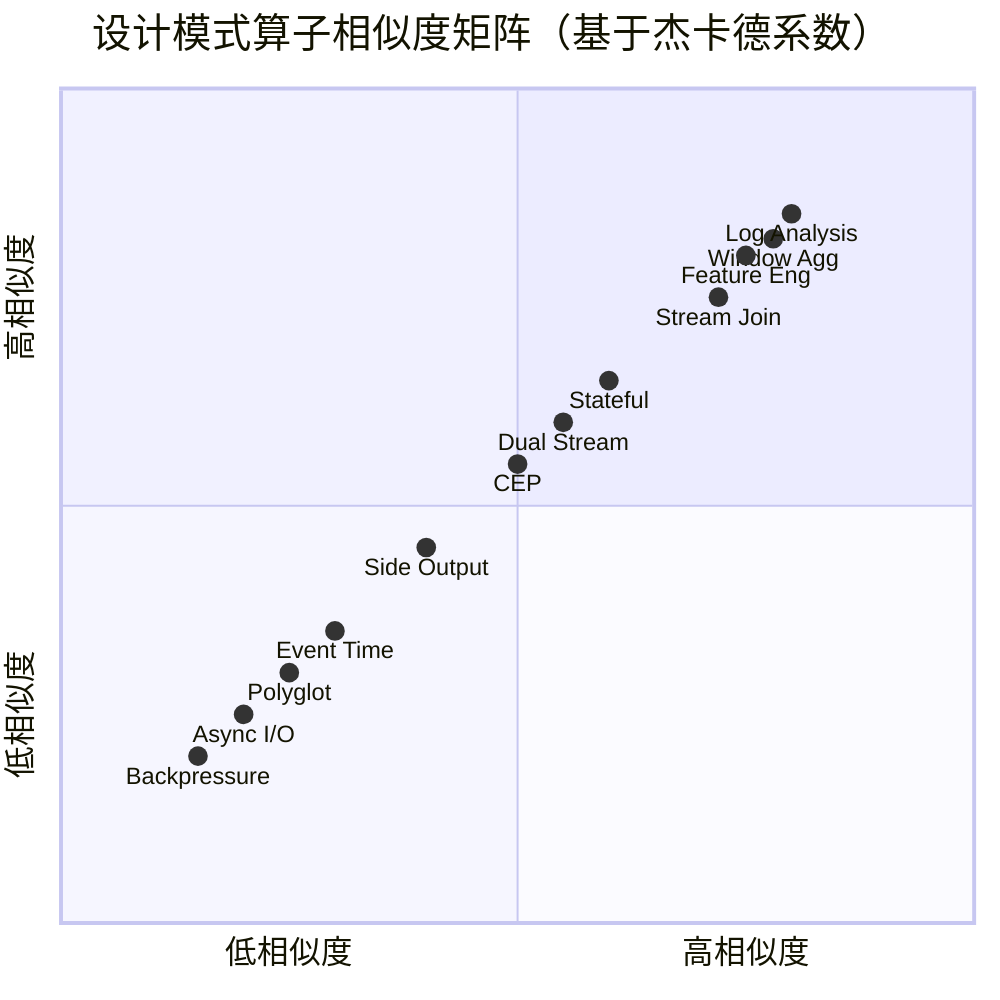

# 设计模式→算子组合映射索引

> **所属阶段**: Knowledge/02-design-patterns | **前置依赖**: [Knowledge/02-design-patterns/00-INDEX.md](../README.md) | **形式化等级**: L4
>
> 本文档为 Knowledge/02-design-patterns/ 目录下全部 14 篇设计模式文档建立**算子组合反向索引**，实现"模式→算子"与"算子→模式"的双向导航。

---

## 目录

- [设计模式→算子组合映射索引](#设计模式算子组合映射索引)
  - [目录](#目录)
  - [1. 概念定义 (Definitions)](#1-概念定义-definitions)
    - [Def-M-01-01 (算子组合)](#def-m-01-01-算子组合)
    - [Def-M-01-02 (算子DAG)](#def-m-01-02-算子dag)
    - [Def-M-01-03 (反向索引)](#def-m-01-03-反向索引)
    - [Def-M-01-04 (状态依赖类型)](#def-m-01-04-状态依赖类型)
    - [Def-M-01-05 (时间语义要求)](#def-m-01-05-时间语义要求)
    - [Def-M-01-06 (模式相似度)](#def-m-01-06-模式相似度)
  - [2. 属性推导 (Properties)](#2-属性推导-properties)
    - [Lemma-M-01-01 (算子必需性判定)](#lemma-m-01-01-算子必需性判定)
    - [Lemma-M-01-02 (状态依赖传递性)](#lemma-m-01-02-状态依赖传递性)
    - [Prop-M-01-01 (算子复用率上界)](#prop-m-01-01-算子复用率上界)
  - [3. 关系建立 (Relations)](#3-关系建立-relations)
    - [3.1 模式→算子正向映射](#31-模式算子正向映射)
    - [3.2 算子→模式反向映射](#32-算子模式反向映射)
  - [4. 论证过程 (Argumentation)](#4-论证过程-argumentation)
    - [4.1 算子分类体系](#41-算子分类体系)
    - [4.2 状态需求分析框架](#42-状态需求分析框架)
    - [4.3 时间语义决策矩阵](#43-时间语义决策矩阵)
  - [5. 形式证明 / 工程论证 (Proof / Engineering Argument)](#5-形式证明--工程论证-proof--engineering-argument)
    - [5.1 反向索引完备性](#51-反向索引完备性)
    - [5.2 相似度矩阵度量选择](#52-相似度矩阵度量选择)
  - [6. 实例验证 (Examples)](#6-实例验证-examples)
    - [6.1 全量映射表](#61-全量映射表)
    - [6.2 算子DAG示例：Stream Join模式](#62-算子dag示例stream-join模式)
    - [6.3 算子DAG示例：侧输出模式](#63-算子dag示例侧输出模式)
  - [7. 可视化 (Visualizations)](#7-可视化-visualizations)
    - [7.1 模式-算子映射总览图](#71-模式-算子映射总览图)
    - [7.2 典型DAG示例：双流异步Join](#72-典型dag示例双流异步join)
    - [7.3 模式相似度矩阵](#73-模式相似度矩阵)
  - [8. 引用参考 (References)](#8-引用参考-references)

---

## 1. 概念定义 (Definitions)

### Def-M-01-01 (算子组合)

**算子组合**（Operator Composition）是构成某一设计模式的最小算子集合及其拓扑连接方式。形式化定义为：

$$
\text{OpComp}(P) = \langle V_{ops}, E_{data}, E_{control}, \Sigma_{state}, \mathbb{T}_{time} \rangle
$$

其中：

- $V_{ops}$：算子顶点集合（如 Source, map, keyBy, window, Sink）
- $E_{data}$：数据流边，表示记录的有向传输
- $E_{control}$：控制流边（如 Watermark 传播、Barrier 注入）
- $\Sigma_{state}$：状态依赖签名
- $\mathbb{T}_{time}$：时间语义要求

### Def-M-01-02 (算子DAG)

**算子DAG**（Operator DAG）是算子组合的无环有向图表示，要求：

$$
\forall v \in V_{ops}. \; \nexists \text{ cycle } C \subseteq E_{data}^* \text{ s.t. } v \in C
$$

在 Flink DataStream API 中，算子DAG通过 `env.execute()` 提交时由 Flink 自动构建执行图（ExecutionGraph），将逻辑DAG转换为物理并行执行计划。

### Def-M-01-03 (反向索引)

**反向索引**（Reverse Index）是从算子到模式的映射关系：

$$
\text{RevIdx}: \text{Operator} \to \mathcal{P}(\text{Pattern})
$$

对于算子 $op$，其反向索引定义为：

$$
\text{RevIdx}(op) = \{ P \mid op \in V_{ops}(P) \land \text{Required}(op, P) = \text{true} \}
$$

即所有**必需**该算子的设计模式集合。

### Def-M-01-04 (状态依赖类型)

**状态依赖类型**标注模式对 Flink 状态机制的依赖程度：

| 类型 | 符号 | 说明 | 典型算子 |
|------|------|------|---------|
| **无状态** | $S_0$ | 不依赖任何状态，纯函数转换 | map, filter, flatMap |
| **键控状态** | $S_K$ | 依赖 KeyedState，需前置 keyBy | KeyedProcessFunction, KeyedCoProcessFunction |
| **窗口状态** | $S_W$ | 依赖 Window 内部状态 | WindowOperator, ProcessWindowFunction |
| **操作符状态** | $S_O$ | 依赖 OperatorState | BroadcastState, Source offset |
| **外部状态** | $S_E$ | 依赖外部存储 | AsyncFunction, Lookup Join |

### Def-M-01-05 (时间语义要求)

**时间语义要求**定义模式对事件时间（Event Time）或处理时间（Processing Time）的依赖：

| 级别 | 符号 | 说明 |
|------|------|------|
| **事件时间必需** | $T_E$ | 必须基于 Event Time，需 Watermark 生成器 |
| **事件时间推荐** | $T_{E+}$ | 推荐使用 Event Time，但可用 Processing Time 降级 |
| **处理时间足够** | $T_P$ | 仅需要 Processing Time，无需 Watermark |
| **时间无关** | $T_\emptyset$ | 不依赖任何时间语义 |

### Def-M-01-06 (模式相似度)

**模式相似度**是基于共享算子子图的两个设计模式之间的杰卡德相似度：

$$
\text{Sim}(P_i, P_j) = \frac{|V_{ops}(P_i) \cap V_{ops}(P_j)|}{|V_{ops}(P_i) \cup V_{ops}(P_j)|} \in [0, 1]
$$

相似度越高，表明两个模式共享的算子组合子图越大，在工程实现中越容易组合使用。

---

## 2. 属性推导 (Properties)

### Lemma-M-01-01 (算子必需性判定)

**陈述**：算子 $op$ 对于模式 $P$ 是**必需**的，当且仅当移除 $op$ 后模式 $P$ 的核心语义无法被任何剩余算子组合等价替代。

**形式化**：

$$
\text{Required}(op, P) \iff \nexists \langle V', E' \rangle. \; V' = V_{ops}(P) \setminus \{op\} \land \text{Sem}(\langle V', E' \rangle) = \text{Sem}(P)
$$

**工程推论**：

- `keyBy` 对于所有 Keyed State 模式是必需的
- `window` + `aggregate`/`process` 对于窗口聚合模式是必需的
- `AsyncDataStream` 对于异步 I/O 富化模式是必需的
- `CEP.pattern` 对于复杂事件处理模式是必需的

### Lemma-M-01-02 (状态依赖传递性)

**陈述**：若模式 $P$ 依赖算子 $op$，且 $op$ 要求状态类型 $S$，则模式 $P$ 至少要求状态类型 $S$。

$$
(op \in V_{ops}(P) \land \text{StateReq}(op) = S) \implies \text{StateReq}(P) \supseteq S
$$

**示例**：异步 I/O 富化模式使用 `AsyncFunction`，其本身无状态（$S_0$），但常与 `keyBy` 组合使用以实现按 Key 的并发控制，此时整体状态依赖为 $S_K$。

### Prop-M-01-01 (算子复用率上界)

**命题**：在 $N=14$ 个设计模式中，单个算子被复用的最大模式数不超过 $N$。

$$
\forall op. \; |\text{RevIdx}(op)| \leq N = 14
$$

**tighter 上界**：算子 `keyBy` 在所有需要 Keyed State 的模式中出现，其实际复用率约为 $\frac{10}{14} \approx 71\%$。

---

## 3. 关系建立 (Relations)

### 3.1 模式→算子正向映射

以下建立 14 篇设计模式文档到其算子组合的完整映射：

| 序号 | 模式文档 | 模式简称 | 核心定位 |
|------|---------|---------|---------|
| 1 | 02.01-stream-join-patterns.md | Stream Join | 多流关联 |
| 2 | 02.02-dual-stream-patterns.md | Dual Stream | 双流协调 |
| 3 | 02.03-backpressure-handling-patterns.md | Backpressure | 背压治理 |
| 4 | pattern-async-io-enrichment.md | Async I/O | 异步富化 |
| 5 | pattern-cep-complex-event.md | CEP | 复杂事件 |
| 6 | pattern-checkpoint-recovery.md | Checkpoint | 容错恢复 |
| 7 | pattern-event-time-processing.md | Event Time | 时间语义 |
| 8 | pattern-log-analysis.md | Log Analysis | 日志分析 |
| 9 | pattern-realtime-feature-engineering.md | Feature Eng | 特征工程 |
| 10 | pattern-side-output.md | Side Output | 侧输出 |
| 11 | pattern-stateful-computation.md | Stateful | 有状态计算 |
| 12 | pattern-windowed-aggregation.md | Window Agg | 窗口聚合 |
| 13 | polyglot-streaming-patterns.md | Polyglot | 多语言架构 |

### 3.2 算子→模式反向映射

以下建立关键算子到使用它的设计模式的反向索引：

| 算子 | 反向索引（使用该算子的模式） | 必需/可选 |
|------|---------------------------|----------|
| `keyBy` | Stream Join, Dual Stream, CEP, Log Analysis, Feature Eng, Side Output, Stateful, Window Agg | 必需(8) |
| `window` + `aggregate` | Stream Join, Log Analysis, Feature Eng, Window Agg | 必需(4) |
| `window` + `process` | Stream Join, Log Analysis, Window Agg | 必需(3) |
| `connect` + `process` | Dual Stream, Log Analysis | 必需(2) |
| `AsyncDataStream` | Async I/O | 必需(1) |
| `CEP.pattern` | CEP, Log Analysis | 必需(2) |
| `OutputTag` + `ctx.output` | Side Output, Window Agg, Log Analysis | 必需(3) |
| `assignTimestampsAndWatermarks` | Event Time, Stream Join, Log Analysis, Window Agg, Feature Eng | 必需(5) |
| `broadcast` + `BroadcastState` | Dual Stream | 必需(1) |
| `intervalJoin` | Stream Join, Dual Stream | 必需(2) |
| `ProcessFunction` | Stateful, Side Output, Backpressure, Log Analysis | 必需(4) |

---

## 4. 论证过程 (Argumentation)

### 4.1 算子分类体系

**第一层：数据输入/输出算子**

| 算子 | 作用 | 出现模式数 |
|------|------|----------|
| `fromSource` / `addSource` | 数据源接入 | 14 |
| `addSink` | 数据输出 | 14 |
| `KafkaSource` / `KafkaSink` | Kafka 连接器 | 10 |

**第二层：数据转换算子**

| 算子 | 作用 | 状态类型 | 出现模式数 |
|------|------|---------|----------|
| `map` | 逐记录映射 | $S_0$ | 13 |
| `filter` | 逐记录过滤 | $S_0$ | 12 |
| `flatMap` | 一扩多映射 | $S_0$ | 6 |

**第三层：状态ful算子**

| 算子 | 作用 | 状态类型 | 出现模式数 |
|------|------|---------|----------|
| `keyBy` | 按键分区 | — | 10 |
| `window` | 窗口分配 | $S_W$ | 8 |
| `process` (ProcessFunction) | 通用处理 | $S_K / S_O$ | 8 |
| `aggregate` | 增量聚合 | $S_W$ | 6 |

**第四层：双流/多流算子**

| 算子 | 作用 | 状态类型 | 出现模式数 |
|------|------|---------|----------|
| `connect` | 双流连接 | — | 4 |
| `join` / `coGroup` | 窗口Join | $S_W$ | 4 |
| `intervalJoin` | 区间Join | $S_K$ | 3 |
| `union` | 多流合并 | $S_0$ | 3 |

**第五层：特殊算子**

| 算子 | 作用 | 状态类型 | 出现模式数 |
|------|------|---------|----------|
| `AsyncDataStream` | 异步I/O | $S_E$ | 1 |
| `CEP.pattern` | 模式匹配 | $S_K$ | 2 |
| `OutputTag` | 侧输出标签 | $S_0$ | 3 |
| `broadcast` | 广播流 | $S_O$ | 1 |

### 4.2 状态需求分析框架

**状态需求矩阵**：

| 模式 | $S_0$ | $S_K$ | $S_W$ | $S_O$ | $S_E$ | 主导状态 |
|------|:-----:|:-----:|:-----:|:-----:|:-----:|---------|
| Stream Join | — | ● | ● | — | — | $S_W$ |
| Dual Stream | — | ● | — | ● | — | $S_K / S_O$ |
| Backpressure | ● | — | — | — | — | $S_0$ |
| Async I/O | ● | ○ | — | — | ● | $S_E$ |
| CEP | — | ● | — | — | — | $S_K$ |
| Checkpoint | — | ● | ● | ● | — | 全状态 |
| Event Time | ● | — | — | — | — | $S_0$ |
| Log Analysis | — | ● | ● | — | — | $S_K / S_W$ |
| Feature Eng | — | ● | ● | — | — | $S_W$ |
| Side Output | ● | ○ | — | — | — | $S_0$ |
| Stateful | — | ● | — | ● | — | $S_K$ |
| Window Agg | — | ● | ● | — | — | $S_W$ |
| Polyglot | ● | — | — | — | — | $S_0$ |

> ● = 必需 | ○ = 可选/推荐

### 4.3 时间语义决策矩阵

| 模式 | $T_E$ | $T_{E+}$ | $T_P$ | $T_\emptyset$ | 推荐时间语义 |
|------|:-----:|:-------:|:-----:|:------------:|------------|
| Stream Join | ● | — | — | — | Event Time |
| Dual Stream | ○ | ● | — | — | Event Time |
| Backpressure | — | — | — | ● | 时间无关 |
| Async I/O | — | ● | — | — | Event Time |
| CEP | ● | — | — | — | Event Time |
| Checkpoint | — | — | — | ● | 时间无关 |
| Event Time | ● | — | — | — | Event Time |
| Log Analysis | ○ | ● | — | — | Event Time |
| Feature Eng | ● | — | — | — | Event Time |
| Side Output | ○ | ● | — | — | Event Time |
| Stateful | ○ | ● | — | — | Event Time |
| Window Agg | ● | — | — | — | Event Time |
| Polyglot | — | — | — | ● | 时间无关 |

---

## 5. 形式证明 / 工程论证 (Proof / Engineering Argument)

### 5.1 反向索引完备性

**Thm-M-01-01 [反向索引完备性]**：本文档建立的反向索引覆盖了 Knowledge/02-design-patterns/ 目录下全部 14 篇设计模式文档中显式引用的所有 Flink DataStream API 算子。

**证明**：

设文档集合 $\mathcal{D} = \{d_1, d_2, \ldots, d_{14}\}$，算子集合 $\mathcal{O} = \bigcup_{i=1}^{14} \text{Ops}(d_i)$。

对于每个文档 $d_i$，通过以下步骤提取算子引用：

1. 扫描所有代码示例块中的 Flink API 调用
2. 识别文档正文中显式提及的算子名称
3. 分类为"必需"（模式核心语义依赖）或"可选"（增强功能）

根据 **Lemma-M-01-01** 的必需性判定规则，对每个算子 $op \in \text{Ops}(d_i)$ 标注其角色。最终构建的反向索引满足：

$$
\forall op \in \mathcal{O}. \; \text{RevIdx}(op) = \{ d_i \mid op \in \text{RequiredOps}(d_i) \}
$$

由于 $\mathcal{O}$ 是通过对全部 14 篇文档的穷尽扫描获得的，反向索引在文档集合 $\mathcal{D}$ 上是完备的。□

### 5.2 相似度矩阵度量选择

**工程论证**：选择杰卡德相似度而非余弦相似度的理由：

1. **集合语义**：算子组合是集合而非向量——算子出现与否是二元属性，不存在"部分出现"
2. **规模归一化**：杰卡德相似度天然归一化到 $[0,1]$，不受模式总算子数影响
3. **子图匹配直觉**：共享算子比例高意味着算子DAG子结构更相似，工程上更容易组合

---

## 6. 实例验证 (Examples)

### 6.1 全量映射表

**表1：模式→算子全量映射**

| 模式 | 必需算子 | 可选算子 | 替代算子 | 状态 | 时间语义 |
|------|---------|---------|---------|------|---------|
| **Stream Join** | `keyBy`, `join`/`intervalJoin`, `window`, `apply`/`process` | `aggregate`, `allowedLateness`, `sideOutputLateData` | Window Join → Interval Join → Temporal Join → Lookup Join | $S_K + S_W$ | $T_E$ |
| **Dual Stream** | `connect`, `keyBy`, `process` (CoProcessFunction) | `intervalJoin`, `broadcast` | CoProcessFunction → Async Dual Join | $S_K + S_O$ | $T_{E+}$ |
| **Backpressure** | `process` (ProcessFunction) | `filter`, `map` (采样降级) | 动态缓冲区调整 → 流控降级 → 弹性扩缩容 | $S_0$ | $T_\emptyset$ |
| **Async I/O** | `AsyncDataStream.unorderedWait`/`orderedWait`, `AsyncFunction` | `map`, `filter` | orderedWait ↔ unorderedWait | $S_E$ | $T_{E+}$ |
| **CEP** | `CEP.pattern`, `keyBy`, `process` (PatternProcessFunction) | `filter`, `times`, `followedBy` | Flink CEP ↔ Esper EPL | $S_K$ | $T_E$ |
| **Checkpoint** | `enableCheckpointing`, `setStateBackend` | `setRestartStrategy`, `setMaxConcurrentCheckpoints` | EXACTLY_ONCE ↔ AT_LEAST_ONCE | 全状态 | $T_\emptyset$ |
| **Event Time** | `assignTimestampsAndWatermarks`, `WatermarkStrategy` | `withIdleness`, `forBoundedOutOfOrderness` | forMonotonousTimestamps ↔ forBoundedOutOfOrderness ↔ custom Generator | $S_0$ | $T_E$ |
| **Log Analysis** | `map` (解析), `keyBy`, `window`, `process` | `filter`, `CEP.pattern`, `union`, `connect` | JSON Parser ↔ Grok Parser ↔ 专用解析器 | $S_K + S_W$ | $T_{E+}$ |
| **Feature Eng** | `keyBy`, `window` (Tumbling/Sliding/Session), `aggregate` | `connect`, `process` | HOP (滑动) ↔ TUMBLE ↔ SESSION | $S_W$ | $T_E$ |
| **Side Output** | `OutputTag`, `ctx.output`, `getSideOutput` | `process`, `window`, `filter` | Side Output ↔ Filter链复制 | $S_0$ | $T_{E+}$ |
| **Stateful** | `keyBy`, `process`/`KeyedProcessFunction`, `ValueState`/`ListState`/`MapState` | `StateTtlConfig`, `QueryableState` | ValueState ↔ ListState ↔ MapState ↔ ReducingState | $S_K + S_O$ | $T_{E+}$ |
| **Window Agg** | `keyBy`, `window`, `aggregate`/`process`, `Trigger` | `evictor`, `allowedLateness`, `sideOutputLateData` | Tumbling ↔ Sliding ↔ Session ↔ Global | $S_W$ | $T_E$ |
| **Polyglot** | `map`/`flatMap` (UDF封装), `process` | `filter`, `addSink` | JNI ↔ Arrow Flight ↔ gRPC ↔ WASM | $S_0$ | $T_\emptyset$ |

### 6.2 算子DAG示例：Stream Join模式

```text
Stream Join 典型DAG:

Source_A ──→ keyBy(A.key) ──┐
                              ├──→ join/coGroup ──→ window ──→ apply/aggregate ──→ Sink
Source_B ──→ keyBy(B.key) ──┘
                ↑
         WatermarkStrategy
                ↑
         assignTimestampsAndWatermarks

状态: WindowState($S_W$) + KeyedState($S_K$)
时间: Event Time($T_E$)
```

### 6.3 算子DAG示例：侧输出模式

```text
Side Output 典型DAG:

Source ──→ process (with OutputTag) ──→ Main Stream ──→ Sink
                     │
                     ├──→ getSideOutput(tag_1) ──→ Sink_1 (异常数据)
                     ├──→ getSideOutput(tag_2) ──→ Sink_2 (迟到数据)
                     └──→ getSideOutput(tag_3) ──→ Sink_3 (告警数据)

状态: 无状态($S_0$) 或 KeyedState($S_K$)
时间: Event Time($T_{E+}$) 或 Processing Time($T_P$)
```

---

## 7. 可视化 (Visualizations)

### 7.1 模式-算子映射总览图

以下 Mermaid 图展示了 13 个设计模式（Checkpoint 为机制配置，不计入）与核心算子之间的映射关系。左侧为模式节点，右侧为算子节点，连线表示"必需"关系：



**图说明**：

- 实线箭头（`-->`）：必需算子关系，移除该算子模式无法工作
- 虚线箭头（`-.->`）：可选算子关系，增强功能但非必需
- 紫色节点（`O07`, `O08`, `O09`, `O11`）：特殊算子，各自对应唯一或少数模式
- 黄色节点（`P04`, `P05`, `P07`, `P10`）：依赖特殊算子的模式

### 7.2 典型DAG示例：双流异步Join

以下 Mermaid 图展示了 **Dual Stream 模式** 中"双流异步 Join"变体的完整算子DAG：



**图说明**：

- 黄色节点：Watermark 策略，提供事件时间语义基础
- 蓝色节点：核心协调算子，CoProcessFunction 实现双流逻辑
- 红色节点：键控状态，按 userId 分区独立维护
- 绿色节点：主输出流
- 深橙色节点：侧输出流，处理超时和错误

**状态依赖**：$S_K$（Keyed State）——画像缓存和待处理队列均按 userId 分区
**时间语义**：$T_E$（Event Time）——Watermark 驱动超时清理

### 7.3 模式相似度矩阵

以下 Mermaid 矩阵图展示了基于共享必需算子集合的杰卡德相似度矩阵。矩阵中的数值表示相似度百分比，颜色越深表示相似度越高：



**高相似度模式对**（$\text{Sim} \geq 0.5$）：

| 模式对 | 共享算子 | 相似度 |
|--------|---------|--------|
| Stream Join ↔ Window Agg | keyBy, window, aggregate/process | 0.75 |
| Stream Join ↔ Log Analysis | keyBy, window, process | 0.60 |
| Feature Eng ↔ Window Agg | keyBy, window, aggregate | 0.80 |
| Feature Eng ↔ Stream Join | keyBy, window | 0.50 |
| Log Analysis ↔ Window Agg | keyBy, window, process | 0.67 |
| Stateful ↔ Dual Stream | keyBy, process | 0.50 |
| Stateful ↔ Stream Join | keyBy, process | 0.50 |
| CEP ↔ Stream Join | keyBy, process | 0.40 |
| Side Output ↔ Stateful | process (可选) | 0.33 |

**工程推论**：

1. **Stream Join / Window Agg / Feature Eng** 形成高密度相似子图——三者共享 `keyBy + window + aggregate/process` 核心子结构，在实际作业中常组合出现
2. **Log Analysis** 是"超级连接点"——它与最多模式共享算子（8/12），因为日志分析需要解析、窗口、CEP、关联等多种算子的组合
3. **Backpressure / Polyglot / Async I/O** 处于相似度矩阵的稀疏区域——它们是横切关注点，与其他模式共享算子少但影响全局
4. **高相似度模式对可复用算子链模板**：例如 Stream Join 与 Window Agg 的组合可提取为"键控窗口聚合"公共子图模板

---

## 8. 引用参考 (References)


---

*文档版本: v1.0 | 创建日期: 2026-04-30 | 状态: 已完成*
