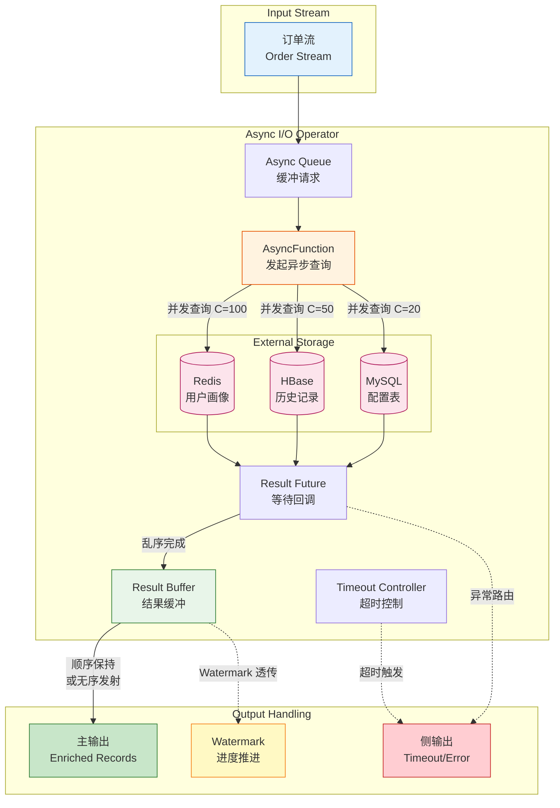

# 设计模式: 异步 I/O 富化 (Pattern: Async I/O Enrichment)

> **模式编号**: 04/7 | **所属系列**: Knowledge/02-design-patterns | **形式化等级**: L4-L5 | **复杂度**: ★★★☆☆
>
> 本模式解决流处理中**外部数据查询**与**流处理延迟**之间的核心矛盾，通过异步非阻塞 I/O 实现高吞吐、低延迟的数据富化。

---

## 目录

- [设计模式: 异步 I/O 富化 (Pattern: Async I/O Enrichment)](#设计模式-异步-io-富化-pattern-async-io-enrichment)
  - [目录](#目录)
  - [1. 概念定义 (Definitions)](#1-概念定义-definitions)
    - [Def-K-02-05 (异步 I/O 富化模式)](#def-k-02-05-异步-io-富化模式)
    - [Def-K-02-06 (AsyncFunction 接口)](#def-k-02-06-asyncfunction-接口)
    - [Def-K-02-07 (结果缓冲区)](#def-k-02-07-结果缓冲区)
    - [Def-K-02-08 (超时控制)](#def-k-02-08-超时控制)
  - [2. 属性推导 (Properties)](#2-属性推导-properties)
    - [Prop-K-02-01 (异步化吞吐量提升)](#prop-k-02-01-异步化吞吐量提升)
    - [Prop-K-02-02 (并发度与内存权衡)](#prop-k-02-02-并发度与内存权衡)
  - [3. 关系建立 (Relations)](#3-关系建立-relations)
    - [与 Watermark 单调性的关联](#与-watermark-单调性的关联)
    - [与 Checkpoint 机制的关联](#与-checkpoint-机制的关联)
  - [4. 论证过程 (Argumentation)](#4-论证过程-argumentation)
    - [4.1 同步 I/O 的性能瓶颈分析](#41-同步-io-的性能瓶颈分析)
    - [4.2 顺序保持 vs 无序处理的权衡](#42-顺序保持-vs-无序处理的权衡)
    - [4.3 外部服务故障的传播边界](#43-外部服务故障的传播边界)
  - [4.5 形式化保证 (Formal Guarantees)](#45-形式化保证-formal-guarantees)
    - [4.5.1 依赖的形式化定义](#451-依赖的形式化定义)
    - [4.5.2 满足的形式化性质](#452-满足的形式化性质)
    - [4.5.3 模式组合时的性质保持](#453-模式组合时的性质保持)
    - [4.5.4 边界条件与约束](#454-边界条件与约束)
  - [5. 形式证明 / 工程论证 (Proof / Engineering Argument)](#5-形式证明--工程论证-proof--engineering-argument)
  - [6. 实例验证 (Examples)](#6-实例验证-examples)
    - [6.1 Flink AsyncDataStream 完整示例](#61-flink-asyncdatastream-完整示例)
    - [6.2 Redis 异步查询实现](#62-redis-异步查询实现)
    - [6.3 超时与异常处理配置](#63-超时与异常处理配置)
  - [7. 可视化 (Visualizations)](#7-可视化-visualizations)
  - [8. 引用参考 (References)](#8-引用参考-references)

---

## 1. 概念定义 (Definitions)

### Def-K-02-05 (异步 I/O 富化模式)

**定义**: 异步 I/O 富化模式是一种流处理设计模式，通过非阻塞式并发查询外部数据存储，在**不阻塞主处理线程**的前提下，将外部数据关联到流记录上，实现数据富化 (enrichment)。

设流记录集合为 $\mathcal{R}$，外部数据存储为 $\mathcal{S}$，富化函数为 $f: \mathcal{R} \times \mathcal{S} \to \mathcal{R}'$。传统同步模式的处理延迟为：

$$
T_{\text{sync}} = |\mathcal{R}| \times (t_{\text{network}} + t_{\text{query}} + t_{\text{serialization}})
$$

异步模式的处理延迟为：

$$
T_{\text{async}} \approx \frac{|\mathcal{R}| \times t_{\text{avg}}}{C}
$$

其中 $C$ 为并发查询数，$t_{\text{avg}}$ 为平均单次查询时间。

**核心目标**:

1. **吞吐量最大化**: 允许单个算子实例并发处理多个 I/O 请求
2. **延迟最小化**: 避免记录等待 I/O 完成而阻塞后续处理
3. **资源可控**: 通过背压和超时机制防止资源耗尽

---

### Def-K-02-06 (AsyncFunction 接口)

**定义**: AsyncFunction 是 Flink 提供的异步处理接口，定义了异步 I/O 操作的基本契约。

```scala
// Flink AsyncFunction 核心接口
trait AsyncFunction[IN, OUT] extends Function {
  // 异步处理每个输入元素
  def asyncInvoke(input: IN, resultFuture: ResultFuture[OUT]): Unit

  // 超时回调（可选）
  def timeout(input: IN, resultFuture: ResultFuture[OUT]): Unit
}
```

**语义约束**:

1. **非阻塞承诺**: `asyncInvoke` 必须立即返回，不得执行同步 I/O
2. **结果回调**: 通过 `ResultFuture.complete()` 或 `completeExceptionally()` 返回结果
3. **单次完成**: 每个 `resultFuture` 只能被完成一次（Exactly-Once 语义）
4. **线程安全**: 实现必须考虑并发调用下的状态一致性

---

### Def-K-02-07 (结果缓冲区)

**定义**: 结果缓冲区是异步 I/O 算子内部维护的临时存储结构，用于缓存已完成但尚未按顺序发射的查询结果。

设缓冲区为 $B$，其状态可形式化为：

$$
B = \{(seq, result, status) \mid seq \in \mathbb{N}, result \in \mathcal{R}', status \in \{\text{PENDING}, \text{COMPLETED}\}\}
$$

其中 $seq$ 为记录序号，用于保证输出顺序。

**缓冲区管理策略**:

| 策略 | 描述 | 适用场景 |
|------|------|---------|
| **顺序保持 (Ordered)** | 按输入顺序发射结果，缓冲区按序号排序 | 需要严格顺序保证 |
| **无序处理 (Unordered)** | 结果完成立即发射，最小化延迟 | 顺序无关的富化 |

---

### Def-K-02-08 (超时控制)

**定义**: 超时控制是异步 I/O 的容错机制，定义了查询等待时间的上界。

给定超时参数 $\tau > 0$，对于在时间 $t_0$ 发起的查询 $q$，其超时条件为：

$$
\text{Timeout}(q) \iff t_{\text{now}} - t_0 > \tau
$$

超时后，系统可选择：

1. **丢弃记录**: 记录被路由到侧输出或忽略
2. **返回默认值**: 使用预设的兜底值继续处理
3. **重试**: 在限定次数内重新发起查询

---

## 2. 属性推导 (Properties)

### Prop-K-02-01 (异步化吞吐量提升)

**命题**: 设同步 I/O 的吞吐量为 $S_{\text{sync}} = \frac{1}{t_{\text{io}}}$，其中 $t_{\text{io}}$ 为单次 I/O 平均延迟。配置并发度为 $C$ 的异步 I/O 吞吐量满足：

$$
S_{\text{async}} = \frac{C}{t_{\text{io}}} = C \times S_{\text{sync}}
$$

**证明概要**:

1. 同步模式下，每个记录在 I/O 完成前独占处理线程
2. 异步模式下，线程发起 I/O 后立即返回处理队列取下一个记录
3. 理论上，单个线程可同时跟踪 $C$ 个在途 (in-flight) 查询
4. 因此吞吐量随并发度线性扩展，直到达到网络或外部服务瓶颈

**工程约束**: 实际吞吐量受限于

- 外部存储的 QPS 上限
- 网络连接池大小
- 算子内存缓冲区容量

---

### Prop-K-02-02 (并发度与内存权衡)

**命题**: 设记录平均大小为 $s$ 字节，并发度为 $C$，平均 I/O 延迟为 $t_{\text{io}}$，记录到达速率为 $\lambda$。顺序保持模式下，所需缓冲区内存 $M$ 满足：

$$
M \geq \lambda \times t_{\text{io}} \times s
$$

**推导**:

1. 在任意时刻，系统中同时存在约 $\lambda \times t_{\text{io}}$ 个在途请求
2. 每个请求关联一个输入记录（等待结果）和一个输出结果
3. 顺序保持模式需要缓存乱序完成的结果，直到前面序号的结果全部发出
4. 最坏情况下，缓冲区需要容纳全部在途记录

**权衡矩阵**:

| 并发度 $C$ | 吞吐量 | 内存需求 | 延迟 |
|-----------|-------|---------|------|
| 低 (10) | 中等 | 低 | 低 |
| 中 (100) | 高 | 中等 | 中等 |
| 高 (1000) | 很高 | 高 | 可能抖动 |

---

## 3. 关系建立 (Relations)

### 与 Watermark 单调性的关联

异步 I/O 算子作为 Dataflow 图中的一个节点，必须遵守 Watermark 单调性约束（详见 [Struct/02-properties/02.03-watermark-monotonicity.md](../../Struct/02-properties/02.03-watermark-monotonicity.md) 中的 **Lemma-S-04-02**）：

> **Lemma-S-04-02**: Watermark 在 Dataflow 图中的传播保持单调不减。

**关联论证**:

1. **顺序保持模式**: 异步算子按输入顺序发射结果，Watermark 可直接透传，单调性自然保持
2. **无序模式**: 需要特殊处理——Watermark 必须等待所有在途查询完成后才能推进，否则可能提前触发下游窗口，导致结果不完整

**形式化表达**:

设无序异步算子在时刻 $t$ 的 Watermark 为：

$$
w_{\text{async}}(t) = \min(w_{\text{in}}(t), \min_{q \in \text{InFlight}(t)} t_e(q))
$$

即输出 Watermark 取输入 Watermark 和所有在途查询事件时间的最小值。这保证了即使查询结果乱序到达，也不会破坏 Watermark 断言的语义。

---

### 与 Checkpoint 机制的关联

异步 I/O 算子参与 Checkpoint 时需要保证：

1. **在途请求状态**: 所有已发起但未完成的查询必须在 Checkpoint 中记录
2. **缓冲区状态**: 结果缓冲区的内容需要持久化
3. **恰好一次语义**: 恢复后，在途请求必须被重新发起或从已持久化的结果中恢复

Flink 的 AsyncFunction 通过以下机制实现：

- Checkpoint 触发时，暂停新查询的发起
- 等待当前在途查询完成或超时
- 将缓冲区状态和未完成查询序列化到状态后端

---

## 4. 论证过程 (Argumentation)

### 4.1 同步 I/O 的性能瓶颈分析

**问题描述**: 在实时风控场景中，每笔交易需要查询用户画像（存储于 Redis）进行风险评估。

```
同步处理流程:
─────────────────────────────────────────────────────►

  请求1 ──[查询Redis: 10ms]──► 结果1

  请求2 ──[查询Redis: 10ms]──► 结果2

  请求3 ──[查询Redis: 10ms]──► 结果3

吞吐量: 100 TPS (单线程)
```

**瓶颈分析**:

- Redis 查询延迟 10ms，单次处理吞吐量为 100 TPS
- 线程在 99% 的时间处于等待状态
- CPU 利用率极低，资源严重浪费

**异步化效果**:

```
异步处理流程 (并发度=100):
─────────────────────────────────────────────────────►

  请求1 ──[发起查询]─┐
  请求2 ──[发起查询]─┤
  请求3 ──[发起查询]─┤  并发处理，无等待
  ...              ─┤
  请求100 ─[发起查询]─┘

  结果2 ──[回调]──► (可能先完成)
  结果1 ──[回调]──►
  结果100 ─[回调]──►

吞吐量: 10,000 TPS (单线程)
```

---

### 4.2 顺序保持 vs 无序处理的权衡

**顺序保持模式**:

```
输入:  [A, B, C, D, E]
       │  │  │  │  │
       ▼  ▼  ▼  ▼  ▼
      [查询A][查询B][查询C][查询D][查询E]
       │     │     │     │     │
       ▼     ▼     ▼     ▼     ▼
完成: [A]   [B]   [C]   [D]   [E]  (可能乱序)
       │
       ▼
输出:  等待前面所有记录完成后按序发射
      ─────────────────────────────────►
      [A, B, C, D, E] (保持输入顺序)

代价: 需要缓冲区，延迟可能增加
```

**无序模式**:

```
输入:  [A, B, C, D, E]
       │  │  │  │  │
       ▼  ▼  ▼  ▼  ▼
      [查询A][查询B][查询C][查询D][查询E]
       │     │     │     │     │
       ▼     ▼     ▼     ▼     ▼
完成: [A]   [B]   [C]   [D]   [E]
       │
       ▼
输出:  立即发射
      ─────────────────────────────────►
      [B, A, D, C, E] (输出顺序与完成顺序一致)

代价: 可能破坏需要顺序保证的业务逻辑
```

**决策矩阵**:

| 场景 | 推荐模式 | 理由 |
|------|---------|------|
| 需要严格顺序保证 | 顺序保持 | 下游窗口聚合依赖输入顺序 |
| 独立记录处理 | 无序 | 最大化吞吐量，最小化延迟 |
| CEP 模式匹配 | 顺序保持 | 序列检测依赖事件顺序 |
| 简单字段补全 | 无序 | 无顺序依赖 |

---

### 4.3 外部服务故障的传播边界

**问题**: 外部存储（Redis/MySQL/HBase）故障时，如何防止级联故障？

**防御策略层次**:

```
┌─────────────────────────────────────────────────────────────┐
│                    故障传播防御层次                          │
├─────────────────────────────────────────────────────────────┤
│                                                             │
│  Level 1: 超时控制                                           │
│  ─────────────────                                           │
│  配置: timeout = 5s, maxConcurrentRequests = 100            │
│  行为: 超时的查询触发 timeout() 回调，记录可路由到侧输出      │
│                                                             │
│  Level 2: 异常处理                                           │
│  ─────────────────                                           │
│  配置: 捕获 Exception，返回默认值                            │
│  行为: 查询失败时继续使用降级数据，不打断流处理               │
│                                                             │
│  Level 3: 断路器 (Circuit Breaker)                           │
│  ─────────────────────────────                              │
│  配置: 连续失败 N 次后打开断路器，快速失败                    │
│  行为: 防止故障扩散，保护外部服务不被压垮                     │
│                                                             │
│  Level 4: 背压与限流                                         │
│  ────────────────────                                       │
│  配置: AsyncDataStream.unorderedWait(capacity = 1000)       │
│  行为: 缓冲区满时反压上游，防止内存溢出                       │
│                                                             │
└─────────────────────────────────────────────────────────────┘
```

---

## 4.5 形式化保证 (Formal Guarantees)

本节建立异步 I/O 富化模式与 Struct/ 理论层的形式化连接。

### 4.5.1 依赖的形式化定义

| 定义编号 | 名称 | 来源 | 在本模式中的作用 |
|----------|------|------|-----------------|
| **Def-S-04-04** | Watermark 语义 | Struct/01.04 | 异步算子必须保持 Watermark 单调性 |
| **Def-S-09-02** | Watermark 进度语义 | Struct/02.03 | 无序模式下 Watermark 推进约束 |
| **Def-S-17-02** | 一致全局状态 | Struct/04.01 | Checkpoint 捕获异步算子的全局状态 |
| **Def-S-18-02** | 端到端一致性 | Struct/04.02 | 异步 I/O 不破坏端到端 Exactly-Once |

### 4.5.2 满足的形式化性质

| 定理/引理编号 | 名称 | 来源 | 保证内容 |
|---------------|------|------|----------|
| **Lemma-S-04-02** | Watermark 单调性引理 | Struct/01.04 | 顺序保持模式下 Watermark 直接透传，单调性保持 |
| **Thm-S-17-01** | Checkpoint 一致性定理 | Struct/04.01 | 异步算子参与 Checkpoint 产生一致全局状态 |
| **Thm-S-18-01** | Exactly-Once 正确性定理 | Struct/04.02 | 异步 I/O 在 2PC Sink 配合下保持 Exactly-Once |
| **Lemma-S-18-04** | 算子确定性引理 | Struct/04.02 | 异步回调完成顺序不影响最终结果确定性 |

### 4.5.3 模式组合时的性质保持

**Async I/O + Event Time 组合**：

- 顺序保持模式：Watermark 透传，单调性保持 (Lemma-S-04-02)
- 无序模式：Watermark 取输入和所有在途查询的最小值

**Async I/O + Checkpoint 组合**：

- Checkpoint 暂停新查询发起，等待在途查询完成
- 状态包含缓冲区内容和未完成查询集合
- 恢复后重新发起未完成查询，保证 Thm-S-17-01

**Async I/O + Stateful Computation 组合**：

- 异步回调中可安全访问 Keyed State
- 状态更新在 Checkpoint 边界原子性持久化

### 4.5.4 边界条件与约束

| 约束条件 | 形式化描述 | 违反后果 |
|----------|-----------|----------|
| 并发度有界 | C ≤ C_max | 资源耗尽，背压失效 |
| 超时有限 | timeout = τ < ∞ | 无限等待导致 Checkpoint 超时 |
| 缓冲区有界 | |B| ≤ B_max | 内存溢出 |
| 回调确定性 | 相同输入 → 相同输出 | 非确定性导致结果不一致 |

---

## 5. 形式证明 / 工程论证 (Proof / Engineering Argument)

**定理 (Async I/O 吞吐量下界)**:

设外部存储的查询延迟服从分布 $D$ 且期望 $E[D] = \mu$，并发度为 $C$，则异步 I/O 算子的吞吐量 $S$ 满足：

$$
S \geq \frac{C}{\mu + \epsilon}
$$

其中 $\epsilon$ 为内部处理开销。

**工程论证**:

1. **Little's Law 应用**: 设系统中平均在途请求数为 $L$，到达率为 $\lambda$，平均驻留时间为 $W$，则 $L = \lambda W$
2. 在稳态下，$L \approx C$（达到最大并发度），$W \approx \mu$
3. 因此 $\lambda \approx \frac{C}{\mu}$
4. 实际吞吐量受限于 min($\lambda$, 外部服务 QPS 上限)

**Exactly-Once 语义保证**:

在 Flink Checkpoint 机制下，异步 I/O 算子保证 Exactly-Once 输出：

1. Checkpoint  Barrier 到达时，算子暂停发起新查询
2. 等待所有在途查询完成或超时
3. 将缓冲区和未完成查询状态持久化
4. 恢复时，从 Checkpoint 重建状态，重发未完成查询

**顺序保持的 Watermark 安全**:

在顺序保持模式下，Watermark 按序透传，不会破坏 Watermark 单调性。

**无序模式的 Watermark 安全**:

对于无序模式，设算子在时刻 $t$ 暂停（Checkpoint Barrier 到达），则：

$$
w_{\text{checkpointed}} = \min(w_{\text{in}}(t), \min_{q \in \text{InFlight}} t_e(q))
$$

恢复后，Watermark 从 $w_{\text{checkpointed}}$ 继续推进，保证不违反单调性约束。

---

## 6. 实例验证 (Examples)

### 6.1 Flink AsyncDataStream 完整示例

**场景**: 实时订单流需要查询 HBase 获取用户画像进行富化。

```scala
import org.apache.flink.streaming.api.scala._
import org.apache.flink.streaming.api.scala.async.{AsyncFunction, ResultFuture}
import org.apache.hadoop.hbase.{HBaseConfiguration, TableName}
import org.apache.hadoop.hbase.client._
import java.util.concurrent.{CompletableFuture, TimeUnit}
import scala.concurrent.{ExecutionContext, Future}
import scala.util.{Failure, Success}

// 定义输入输出类型
case class Order(orderId: String, userId: String, amount: Double, timestamp: Long)
case class EnrichedOrder(
  orderId: String,
  userId: String,
  amount: Double,
  timestamp: Long,
  userProfile: UserProfile
)
case class UserProfile(userId: String, creditScore: Int, vipLevel: Int)

/**
 * HBase 异步查询实现
 *
 * 复杂度: ★★★☆☆
 * - 使用 AsyncTable 进行异步查询
 * - 处理超时和异常情况
 * - 支持结果缓存（可选优化）
 */
class HBaseAsyncFunction extends AsyncFunction[Order, EnrichedOrder] {

  @transient private var connection: Connection = _
  @transient private var asyncTable: AsyncTable[AdvancedScanResultConsumer] = _

  // HBase 连接配置
  private val HBASE_ZK_QUORUM = "zk1,zk2,zk3"
  private val TABLE_NAME = "user_profiles"
  private val CF_PROFILE = "profile".getBytes
  private val COL_CREDIT = "credit_score".getBytes
  private val COL_VIP = "vip_level".getBytes

  override def open(parameters: Configuration): Unit = {
    val config = HBaseConfiguration.create()
    config.set("hbase.zookeeper.quorum", HBASE_ZK_QUORUM)
    connection = ConnectionFactory.createConnection(config)
    asyncTable = connection.getTable(TableName.valueOf(TABLE_NAME))
  }

  override def close(): Unit = {
    if (asyncTable != null) asyncTable.close()
    if (connection != null) connection.close()
  }

  /**
   * 核心异步查询方法
   * 必须非阻塞，立即返回
   */
  override def asyncInvoke(
    order: Order,
    resultFuture: ResultFuture[EnrichedOrder]
  ): Unit = {
    val get = new Get(order.userId.getBytes)
    get.addColumn(CF_PROFILE, COL_CREDIT)
    get.addColumn(CF_PROFILE, COL_VIP)

    // 异步查询 HBase
    val completableFuture = asyncTable.get(get)

    // 转换为 Scala Future 并处理结果
    val scalaFuture = Future {
      val result = completableFuture.get()
      if (result.isEmpty) {
        // 用户不存在，使用默认值
        UserProfile(order.userId, creditScore = 500, vipLevel = 0)
      } else {
        val creditScore = Option(result.getValue(CF_PROFILE, COL_CREDIT))
          .map(bytes => new String(bytes).toInt)
          .getOrElse(500)
        val vipLevel = Option(result.getValue(CF_PROFILE, COL_VIP))
          .map(bytes => new String(bytes).toInt)
          .getOrElse(0)
        UserProfile(order.userId, creditScore, vipLevel)
      }
    }(ExecutionContext.global)

    // 完成回调
    scalaFuture.onComplete {
      case Success(profile) =>
        val enriched = EnrichedOrder(
          order.orderId,
          order.userId,
          order.amount,
          order.timestamp,
          profile
        )
        resultFuture.complete(java.util.Collections.singletonList(enriched))

      case Failure(exception) =>
        // 查询失败，可以记录日志或返回默认值
        resultFuture.completeExceptionally(exception)
    }(ExecutionContext.global)
  }

  /**
   * 超时回调处理
   * 当查询超过配置的 timeout 时间时触发
   */
  override def timeout(
    order: Order,
    resultFuture: ResultFuture[EnrichedOrder]
  ): Unit = {
    // 超时处理：返回默认用户画像
    val defaultProfile = UserProfile(order.userId, creditScore = -1, vipLevel = -1)
    val enriched = EnrichedOrder(
      order.orderId,
      order.userId,
      order.amount,
      order.timestamp,
      defaultProfile
    )
    resultFuture.complete(java.util.Collections.singletonList(enriched))
  }
}

// 主流程
object AsyncEnrichmentJob {
  def main(args: Array[String]): Unit = {
    val env = StreamExecutionEnvironment.getExecutionEnvironment
    env.setParallelism(4)

    // 订单数据源 (Kafka)
    val orderStream: DataStream[Order] = env
      .fromSource(
        KafkaSource.builder[Order]()
          .setBootstrapServers("kafka:9092")
          .setTopics("orders")
          .setGroupId("async-enrichment")
          .setStartingOffsets(OffsetsInitializer.latest())
          .setValueOnlyDeserializer(new OrderDeserializer())
          .build(),
        WatermarkStrategy
          .forBoundedOutOfOrderness[Order](Duration.ofSeconds(5))
          .withTimestampAssigner((order, _) => order.timestamp),
        "Kafka Orders"
      )

    // 应用异步 I/O 富化
    val enrichedStream: DataStream[EnrichedOrder] = AsyncDataStream
      .unorderedWait(
        orderStream,                    // 输入流
        new HBaseAsyncFunction(),       // 异步函数
        5,                              // 超时时间 (秒)
        TimeUnit.SECONDS,               // 时间单位
        100                             // 并发度 (容量)
      )

    // 后续处理：风控评分
    val riskScoredStream = enrichedStream
      .map(enriched => calculateRiskScore(enriched))
      .filter(_.riskScore > 80)  // 高风险订单

    // 输出到告警系统
    riskScoredStream.addSink(
      KafkaSink.builder[RiskScoredOrder]()
        .setBootstrapServers("kafka:9092")
        .setRecordSerializer(...)
        .build()
    )

    env.execute("Async I/O Enrichment Job")
  }

  def calculateRiskScore(order: EnrichedOrder): RiskScoredOrder = {
    // 风控评分逻辑
    val baseScore = if (order.amount > 10000) 50 else 0
    val vipAdjustment = order.userProfile.vipLevel * 5
    val creditAdjustment = (order.userProfile.creditScore - 500) / 20

    RiskScoredOrder(
      order.orderId,
      order.userId,
      order.amount,
      baseScore - vipAdjustment + creditAdjustment
    )
  }
}
```

---

### 6.2 Redis 异步查询实现

**场景**: 使用 Redis 缓存用户地理位置信息，实现毫秒级查询。

```scala
import io.lettuce.core.{RedisClient, RedisFuture}
import io.lettuce.core.api.async.RedisAsyncCommands
import org.apache.flink.streaming.api.scala.async.{AsyncFunction, ResultFuture}

/**
 * Redis 异步查询实现 (使用 Lettuce 客户端)
 *
 * 复杂度: ★★☆☆☆
 * - Lettuce 原生支持异步/响应式 API
 * - 连接池复用，性能优异
 */
class RedisGeoAsyncFunction extends AsyncFunction[LocationQuery, LocationResult] {

  @transient private var redisClient: RedisClient = _
  @transient private var asyncCommands: RedisAsyncCommands[String, String] = _

  override def open(parameters: Configuration): Unit = {
    redisClient = RedisClient.create("redis://redis-cluster:6379")
    val connection = redisClient.connect()
    asyncCommands = connection.async()
  }

  override def close(): Unit = {
    if (asyncCommands != null) asyncCommands.getStatefulConnection.close()
    if (redisClient != null) redisClient.shutdown()
  }

  override def asyncInvoke(
    query: LocationQuery,
    resultFuture: ResultFuture[LocationResult]
  ): Unit = {
    val redisKey = s"geo:${query.userId}"

    // 异步获取地理位置
    val redisFuture: RedisFuture[String] = asyncCommands.get(redisKey)

    redisFuture.thenAccept { value =>
      val location = Option(value) match {
        case Some(geoStr) =>
          val parts = geoStr.split(",")
          GeoLocation(parts(0).toDouble, parts(1).toDouble)
        case None =>
          GeoLocation(0.0, 0.0)  // 默认值
      }

      resultFuture.complete(java.util.Collections.singletonList(
        LocationResult(query.userId, query.timestamp, location)
      ))
    }.exceptionally { ex =>
      resultFuture.completeExceptionally(ex)
      null
    }
  }

  override def timeout(
    query: LocationQuery,
    resultFuture: ResultFuture[LocationResult]
  ): Unit = {
    // 超时返回未知位置
    resultFuture.complete(java.util.Collections.singletonList(
      LocationResult(query.userId, query.timestamp, GeoLocation(-1.0, -1.0))
    ))
  }
}

// 使用顺序保持模式（如果顺序重要）
val orderedResult = AsyncDataStream
  .orderedWait(
    locationQueryStream,
    new RedisGeoAsyncFunction(),
    100,           // 100ms 超时
    TimeUnit.MILLISECONDS,
    1000           // 并发度 1000
  )
```

---

### 6.3 超时与异常处理配置

**配置最佳实践**:

```scala
// 完整的异步 I/O 配置示例
object AsyncIOConfig {

  /**
   * 配置 1: 高吞吐场景 (无序模式)
   * 适用: 日志富化、指标补全等顺序无关场景
   */
  def highThroughputConfig[IN, OUT](
    input: DataStream[IN],
    asyncFunc: AsyncFunction[IN, OUT]
  ): DataStream[OUT] = {
    AsyncDataStream.unorderedWait(
      input,
      asyncFunc,
      5, TimeUnit.SECONDS,    // 5秒超时
      1000                     // 高并发度
    )
  }

  /**
   * 配置 2: 顺序敏感场景 (有序模式)
   * 适用: 金融交易、风控场景
   */
  def orderedConfig[IN, OUT](
    input: DataStream[IN],
    asyncFunc: AsyncFunction[IN, OUT]
  ): DataStream[OUT] = {
    AsyncDataStream.orderedWait(
      input,
      asyncFunc,
      10, TimeUnit.SECONDS,   // 较长超时确保顺序
      100                     // 较低并发度减少缓冲
    )
  }

  /**
   * 配置 3: 容错优先场景
   * 适用: 外部服务不稳定时
   */
  def faultTolerantConfig[IN, OUT](
    input: DataStream[IN],
    asyncFunc: AsyncFunction[IN, OUT]
  )(implicit typeInfo: TypeInformation[OUT]): DataStream[OUT] = {

    // 定义侧输出标签用于收集超时/异常记录
    val timeoutTag = OutputTag[IN]("async-timeout")

    val mainStream = AsyncDataStream.unorderedWait(
      input,
      asyncFunc,
      3, TimeUnit.SECONDS,    // 短超时快速失败
      50                      // 保守并发度
    )

    mainStream
  }
}

/**
 * 带重试机制的异步函数基类
 */
abstract class RetryableAsyncFunction[IN, OUT](
  maxRetries: Int = 3,
  retryDelayMs: Long = 100
) extends AsyncFunction[IN, OUT] {

  override def asyncInvoke(input: IN, resultFuture: ResultFuture[OUT]): Unit = {
    executeWithRetry(input, resultFuture, 0)
  }

  private def executeWithRetry(
    input: IN,
    resultFuture: ResultFuture[OUT],
    attempt: Int
  ): Unit = {
    try {
      doAsyncInvoke(input, new ResultFuture[OUT] {
        override def complete(result: java.lang.Iterable[OUT]): Unit = {
          resultFuture.complete(result)
        }
        override def completeExceptionally(error: Throwable): Unit = {
          if (attempt < maxRetries && isRetryable(error)) {
            Thread.sleep(retryDelayMs * (attempt + 1))  // 指数退避
            executeWithRetry(input, resultFuture, attempt + 1)
          } else {
            resultFuture.completeExceptionally(error)
          }
        }
      })
    } catch {
      case e: Exception =>
        if (attempt < maxRetries && isRetryable(e)) {
          executeWithRetry(input, resultFuture, attempt + 1)
        } else {
          resultFuture.completeExceptionally(e)
        }
    }
  }

  // 子类实现实际异步逻辑
  def doAsyncInvoke(input: IN, resultFuture: ResultFuture[OUT]): Unit

  // 判断异常是否可重试
  def isRetryable(error: Throwable): Boolean = error match {
    case _: java.net.SocketTimeoutException => true
    case _: java.net.ConnectException => true
    case _: java.io.IOException => true
    case _ => false
  }
}
```

---

## 7. 可视化 (Visualizations)

以下 Mermaid 图展示了异步 I/O 富化模式的核心组件和数据流：



**图说明**：

- 蓝色节点：输入流，包含需要富化的记录
- 橙色节点：AsyncFunction，核心异步处理逻辑
- 绿色节点：主输出，富化后的记录
- 红色节点：侧输出，用于收集超时或异常记录
- 粉色节点：外部存储（Redis/HBase/MySQL）
- 黄色节点：Watermark 进度推进

**处理流程**：

1. 输入记录进入 Async Queue 缓冲
2. AsyncFunction 并发发起外部查询（C=并发度）
3. 查询结果通过 Result Future 回调返回
4. 结果进入缓冲区，根据配置决定顺序保持或无序发射
5. Timeout Controller 监控超时，超时时路由到侧输出

---

**顺序保持 vs 无序模式对比图**：

```mermaid
flowchart TB
    subgraph "Ordered Mode"
        O_IN[输入: A,B,C,D,E] --> O_Q[请求队列]
        O_Q -->|并发查询| O_EXT[(外部存储)]
        O_EXT -->|C先完成| O_BUF1[缓冲区: [C]]
        O_EXT -->|A完成| O_BUF2[缓冲区: [A,C]]
        O_EXT -->|B完成| O_BUF3[缓冲区: [A,B,C]]
        O_BUF3 -->|等待D,E| O_BUF4[缓冲区: [A,B,C,D,E]]
        O_BUF4 -->|按序发射| O_OUT[输出: A,B,C,D,E]

        O_BUF1 -.->|Watermark 暂停| O_W1[wm = min(t_e(A), t_e(C))]
        O_BUF4 -.->|Watermark 恢复| O_W2[wm = t_e(E)]
    end

    subgraph "Unordered Mode"
        U_IN[输入: A,B,C,D,E] --> U_Q[请求队列]
        U_Q -->|并发查询| U_EXT[(外部存储)]
        U_EXT -->|C先完成| U_OUT1[输出: C]
        U_EXT -->|A完成| U_OUT2[输出: A]
        U_EXT -->|E完成| U_OUT3[输出: E]
        U_EXT -->|B完成| U_OUT4[输出: B]
        U_EXT -->|D完成| U_OUT5[输出: D]

        U_OUT1 -.->|Watermark 推进| U_W1[wm = min(in_wm, in_flight)]
    end

    style O_OUT fill:#c8e6c9,stroke:#2e7d32
    style U_OUT1 fill:#c8e6c9,stroke:#2e7d32
    style U_OUT2 fill:#c8e6c9,stroke:#2e7d32
    style U_OUT3 fill:#c8e6c9,stroke:#2e7d32
    style U_OUT4 fill:#c8e6c9,stroke:#2e7d32
    style U_OUT5 fill:#c8e6c9,stroke:#2e7d32
    style O_W1 fill:#fff9c4,stroke:#f57f17
    style O_W2 fill:#fff9c4,stroke:#f57f17
    style U_W1 fill:#fff9c4,stroke:#f57f17
```

---

## 8. 引用参考 (References)


---

*文档版本: v1.0 | 更新日期: 2026-04-02 | 状态: 已完成*
