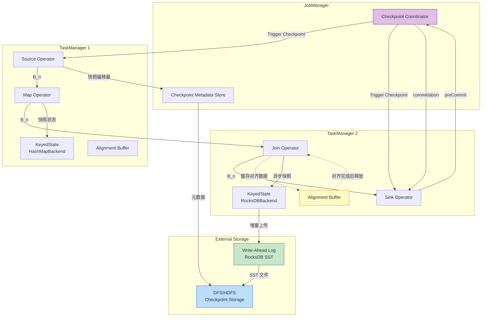
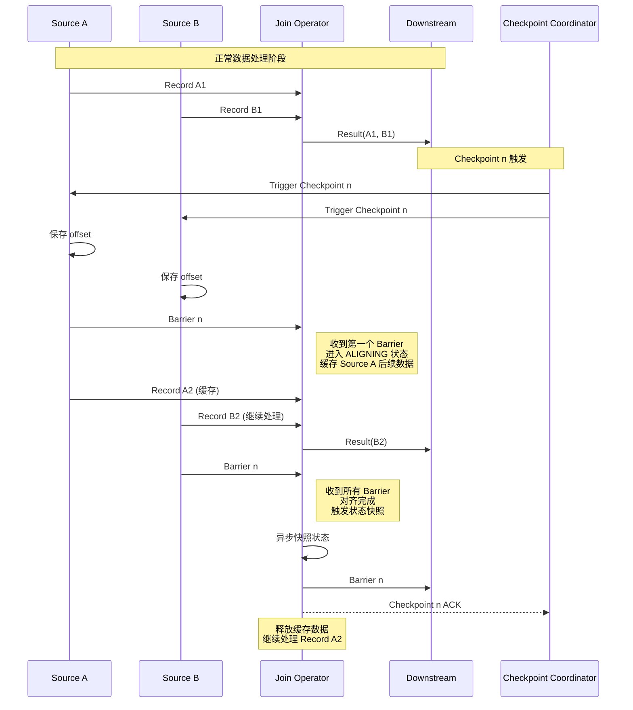
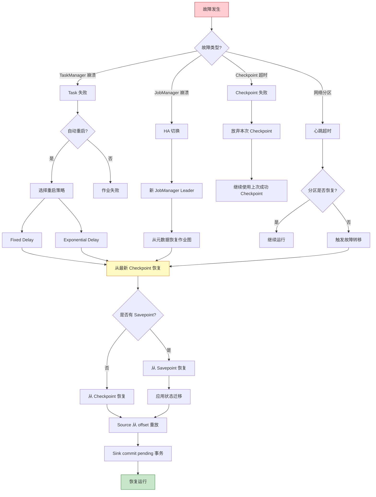
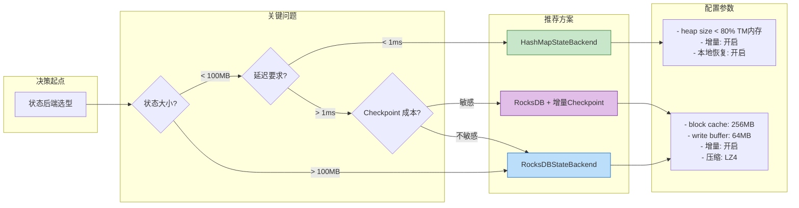

# 设计模式: Checkpoint 与故障恢复 (Pattern 07: Checkpoint & Recovery)

> **模式编号**: 07/7 | **所属系列**: Knowledge/02-design-patterns | **形式化等级**: L5 | **复杂度**: ★★★★★
>
> 本模式解决分布式流处理中的**故障恢复**与**一致性保障**问题，通过 Checkpoint 机制实现 Exactly-Once 语义，并提供完整的故障恢复策略。

---

## 目录

- [设计模式: Checkpoint 与故障恢复 (Pattern 07: Checkpoint \& Recovery)](#设计模式-checkpoint-与故障恢复-pattern-07-checkpoint-recovery)
  - [目录](#目录)
  - [1. 概念定义 (Definitions)](#1-概念定义-definitions)
    - [Def-K-02-07-01 (Checkpoint 机制)](#def-k-02-07-01-checkpoint-机制)
    - [Def-K-02-07-02 (Checkpoint Barrier)](#def-k-02-07-02-checkpoint-barrier)
    - [Def-K-02-07-03 (Barrier 对齐)](#def-k-02-07-03-barrier-对齐)
    - [Def-K-02-07-04 (状态后端)](#def-k-02-07-04-状态后端)
    - [Def-K-02-07-05 (故障恢复策略)](#def-k-02-07-05-故障恢复策略)
  - [2. 属性推导 (Properties)](#2-属性推导-properties)
    - [Lemma-K-02-07-01 (Barrier 传播单调性)](#lemma-k-02-07-01-barrier-传播单调性)
    - [Lemma-K-02-07-02 (对齐窗口有界性)](#lemma-k-02-07-02-对齐窗口有界性)
    - [Prop-K-02-07-01 (异步快照性能优势)](#prop-k-02-07-01-异步快照性能优势)
  - [3. 关系建立 (Relations)](#3-关系建立-relations)
    - [关系 1: Checkpoint 与 Chandy-Lamport 快照算法](#关系-1-checkpoint-与-chandy-lamport-快照算法)
    - [关系 2: Checkpoint 与 Exactly-Once 语义](#关系-2-checkpoint-与-exactly-once-语义)
  - [4. 论证过程 (Argumentation)](#4-论证过程-argumentation)
    - [4.1 对齐模式选择论证](#41-对齐模式选择论证)
    - [4.2 状态后端选型论证](#42-状态后端选型论证)
    - [4.3 增量 Checkpoint 有效性论证](#43-增量-checkpoint-有效性论证)
  - [8. 形式化保证 (Formal Guarantees)](#8-形式化保证-formal-guarantees)
    - [8.1 依赖的形式化定义](#81-依赖的形式化定义)
    - [8.2 满足的形式化性质](#82-满足的形式化性质)
    - [8.3 模式组合时的性质保持](#83-模式组合时的性质保持)
    - [8.4 边界条件与约束](#84-边界条件与约束)
  - [5. 形式证明 / 工程论证](#5-形式证明-工程论证)
    - [5.1 Checkpoint 一致性定理 (关联 Thm-S-17-01)](#51-checkpoint-一致性定理-关联-thm-s-17-01)
    - [5.2 Exactly-Once 正确性定理 (关联 Thm-S-18-01)](#52-exactly-once-正确性定理-关联-thm-s-18-01)
    - [5.3 故障恢复正确性工程论证](#53-故障恢复正确性工程论证)
  - [6. 实例验证 (Examples)](#6-实例验证-examples)
    - [6.1 Flink Checkpoint 基础配置](#61-flink-checkpoint-基础配置)
    - [6.2 高级 Checkpoint 配置](#62-高级-checkpoint-配置)
    - [6.3 状态后端配置与选型](#63-状态后端配置与选型)
    - [6.4 故障恢复与保存点管理](#64-故障恢复与保存点管理)
    - [6.5 状态迁移与升级](#65-状态迁移与升级)
  - [7. 可视化 (Visualizations)](#7-可视化-visualizations)
    - [7.1 Checkpoint 机制架构图](#71-checkpoint-机制架构图)
    - [7.2 Barrier 对齐时序图](#72-barrier-对齐时序图)
    - [7.3 故障恢复决策树](#73-故障恢复决策树)
    - [7.4 状态后端选型矩阵](#74-状态后端选型矩阵)
  - [9. 引用参考 (References)](#9-引用参考-references)

---

## 1. 概念定义 (Definitions)

### Def-K-02-07-01 (Checkpoint 机制)

**定义**: Checkpoint 是 Flink 实现的**分布式快照机制**，用于在流处理作业执行过程中周期性地捕获全局一致状态，以支持故障恢复。

形式化地，Checkpoint $C_n$ 定义为：

$$
C_n = \langle S_n^{(src)}, S_n^{(ops)}, S_n^{(sink)}, M_n \rangle
$$

其中：

- $S_n^{(src)}$: Source 算子的偏移量状态
- $S_n^{(ops)}$: 中间算子的 Keyed/Operator 状态
- $S_n^{(sink)}$: Sink 算子的事务状态
- $M_n$: 各通道上的在途消息集合

**Checkpoint 生命周期**:

```
触发 (Trigger) → 注入 (Inject) → 对齐 (Align) → 快照 (Snapshot) → 确认 (Ack) → 完成 (Complete)
```

**工程实现要点**:

- 异步执行：快照持久化与数据处理并行
- 增量存储：仅保存状态变更部分
- 一致性保证：通过 Barrier 对齐实现 Consistent Cut

---

### Def-K-02-07-02 (Checkpoint Barrier)

**定义**: Checkpoint Barrier 是 Flink 注入数据流的特殊控制事件，携带 Checkpoint ID，定义了逻辑时间边界。

形式化定义（参见 [Struct/04-proofs/04.01-flink-checkpoint-correctness.md](../../Struct/04-proofs/04.01-flink-checkpoint-correctness.md) 中的 Def-S-17-01）:

$$
B_n = \langle \text{type} = \text{BARRIER}, \; \text{cid} = n, \; \text{timestamp} = ts \rangle
$$

**Barrier 语义**:

- Barrier $B_n$ 之前的所有数据已处理完毕
- Barrier $B_n$ 之后的所有数据尚未处理
- Barrier 将无限流划分为有限段，每段可独立恢复

**传播规则**:

| 场景 | 行为 | 一致性影响 |
|------|------|-----------|
| Source | 在数据流中注入 Barrier | 标记可重放点 |
| 单输入算子 | 收到 Barrier 后立即快照并转发 | 无延迟 |
| 多输入算子 | 等待所有输入通道 Barrier 到达（对齐） | 保证一致性 |

---

### Def-K-02-07-03 (Barrier 对齐)

**定义**: Barrier 对齐是多输入算子确保 Checkpoint 一致性的核心机制，要求算子从所有输入通道接收到相同 Checkpoint ID 的 Barrier 后才触发状态快照。

形式化定义（参见 Def-S-17-03）:

$$
\text{Aligned}(v, n) \iff \forall ch_i \in In(v): B_n \in \text{Received}(v, ch_i)
$$

**对齐模式对比**:

```
┌─────────────────────────────────────────────────────────────────────────┐
│                        对齐模式对比矩阵                                  │
├─────────────────────┬─────────────────────┬─────────────────────────────┤
│ 特性                │ EXACTLY_ONCE        │ AT_LEAST_ONCE               │
├─────────────────────┼─────────────────────┼─────────────────────────────┤
│ 对齐要求            │ 必须等待所有Barrier │ 收到任一Barrier即快照       │
│ 缓存行为            │ 缓存已对齐通道数据  │ 不缓存，继续处理            │
│ 一致性保证          │ 强一致性            │ 最终一致性（可能重复）      │
│ 延迟影响            │ 存在对齐延迟        │ 无对齐延迟                  │
│ 适用场景            │ 金融、交易、计费    │ 日志、监控、近似统计        │
│ 吞吐量影响          │ 可能降低            │ 无影响                      │
└─────────────────────┴─────────────────────┴─────────────────────────────┘
```

---

### Def-K-02-07-04 (状态后端)

**定义**: 状态后端（State Backend）是 Flink 中负责状态存储、访问和 Checkpoint 持久化的可插拔组件。

**两种主要实现**:

| 特性 | HashMapStateBackend | RocksDBStateBackend |
|------|---------------------|---------------------|
| **存储位置** | JVM Heap 内存 | 本地磁盘 (RocksDB) |
| **状态大小限制** | 受限于 TaskManager 内存 | 受限于本地磁盘容量 |
| **访问延迟** | 极低 (内存直接访问) | 低 (内存 + 磁盘缓存) |
| **增量 Checkpoint** | 支持（需配置） | 原生支持（基于 SST） |
| **增量粒度** | 状态对象级别 | SST 文件级别 |
| **大状态支持** | 不适合 (> 100MB) | 适合 (TB 级) |
| **增量效率** | 一般（需序列化比较） | 高（利用 SST 不可变性） |

---

### Def-K-02-07-05 (故障恢复策略)

**定义**: 故障恢复策略定义了 Flink 作业在发生故障时如何从 Checkpoint 或保存点恢复执行的规则集合。

**恢复策略层次**:

```
恢复策略
├── 自动恢复 (Restart Strategies)
│   ├── Fixed Delay Restart: 固定延迟重启
│   ├── Exponential Delay Restart: 指数退避重启
│   └── No Restart: 不自动重启
├── 故障转移策略 (Failover Strategies)
│   ├── Region Failover: 区域级恢复（细粒度）
│   └── Full Failover: 全局恢复（默认）
└── 状态恢复 (State Recovery)
    ├── Latest Checkpoint: 从最新 Checkpoint 恢复
    ├── Specific Checkpoint: 从指定 Checkpoint 恢复
    └── Savepoint: 从保存点恢复（支持跨版本）
```

**保存点 (Savepoint) 特性**:

- 用户触发，生命周期独立于作业
- 支持状态格式升级和算子迁移
- 可用于作业版本回滚和 A/B 测试

---

## 2. 属性推导 (Properties)

### Lemma-K-02-07-01 (Barrier 传播单调性)

**陈述**: Checkpoint Barrier 在数据流图中沿有向边单调传播，不会跨越或倒退。

**形式化表述**:

对于任意边 $e = (u, v)$:

$$
\forall t_1 < t_2: \; B_n \in \text{Sent}(u, e, t_1) \implies B_n \in \text{Received}(v, e, t_2) \land \nexists m: B_n \prec m \prec B_n'
$$

**工程意义**:

- 保证 Checkpoint 边界的因果关系
- 防止乱序 Barrier 导致的状态不一致
- 为 Exactly-Once 提供时间基础

---

### Lemma-K-02-07-02 (对齐窗口有界性)

**陈述**: 在 EXACTLY_ONCE 模式下，对齐窗口（Alignment Window）的持续时间受 Checkpoint 超时时间约束。

**形式化表述**:

设 Checkpoint 超时时间为 $T_{timeout}$，则对于任意算子 $v$:

$$
\text{AW}(v, n) = t_{\text{last}}(B_n) - t_{\text{first}}(B_n) \leq T_{timeout}
$$

若超过 $T_{timeout}$，Checkpoint 被标记为 FAILED。

**工程实践**:

- 跨数据中心部署需增大超时时间
- 网络抖动场景建议启用 Unaligned Checkpoint
- 对齐窗口期间，已对齐通道数据被缓存

---

### Prop-K-02-07-01 (异步快照性能优势)

**陈述**: 异步快照机制在保持与同步快照语义等价的前提下，显著降低 Checkpoint 对处理延迟的影响。

**性能对比**:

| 指标 | 同步快照 | 异步快照 |
|------|---------|---------|
| 阻塞时间 | $O(|State|)$ | $O(1)$（状态引用拷贝） |
| 尾延迟 | 随状态大小线性增长 | 与状态大小无关 |
| 吞吐量下降 | 显著 | 轻微 |
| 内存占用 | 低 | 中等（双份状态引用） |

**结论**: 异步快照通过将持久化延迟到后台线程，实现了流处理的无阻塞连续性，是生产环境的推荐配置。

---

## 3. 关系建立 (Relations)

### 关系 1: Checkpoint 与 Chandy-Lamport 快照算法

**关系**: Flink Checkpoint 是 Chandy-Lamport 分布式快照算法[^1]在流处理场景下的结构化实现。

**映射对应**:

| Chandy-Lamport | Flink Checkpoint | 说明 |
|----------------|------------------|------|
| Marker 消息 | Checkpoint Barrier | 语义等价，均携带快照 ID |
| 进程状态记录 | 算子状态快照 | 本地状态的瞬时捕获 |
| 通道状态记录 | 对齐期间缓存的数据 | 显式记录在途消息 |
| 快照完成 | Checkpoint ACK | JobManager 显式收集确认 |

**关键增强**:

- **异步持久化**: 将状态序列化与上传分离，降低延迟
- **增量快照**: 仅备份变更部分，优化存储效率
- **两阶段提交 Sink**: 将外部系统事务与 Checkpoint 对齐

---

### 关系 2: Checkpoint 与 Exactly-Once 语义

**关系**: Checkpoint 一致性是实现端到端 Exactly-Once 语义的**必要不充分条件**。

**形式化表达**:

$$
\text{End-to-End-EO}(J) \implies \text{ConsistentCheckpoint}(Ops) \land \text{Replayable}(Src) \land \text{AtomicOutput}(Snk)
$$

**证明结构**（参见 [Struct/04-proofs/04.02-flink-exactly-once-correctness.md](../../Struct/04-proofs/04.02-flink-exactly-once-correctness.md)）:

```
┌─────────────────────────────────────────────────────────────────┐
│                   Exactly-Once 证明结构                         │
├─────────────────────────────────────────────────────────────────┤
│                                                                 │
│  Lemma-S-18-01: Source 可重放                                   │
│  └── 保证故障恢复后数据不丢失 (At-Least-Once)                   │
│                                                                 │
│  Lemma-S-18-03: 状态恢复一致性                                  │
│  └── Thm-S-17-01: Checkpoint 一致性定理                         │
│      └── 保证内部状态恢复正确                                   │
│                                                                 │
│  Lemma-S-18-02: 2PC 原子性                                      │
│  └── 保证外部输出不重复                                         │
│                                                                 │
│  Thm-S-18-01: Exactly-Once 正确性定理                           │
│  └── 三者合取得到端到端 Exactly-Once                            │
│                                                                 │
└─────────────────────────────────────────────────────────────────┘
```

---

## 4. 论证过程 (Argumentation)

### 4.1 对齐模式选择论证

**场景分析**:

| 场景 | 推荐模式 | 理由 |
|------|---------|------|
| 金融交易处理 | EXACTLY_ONCE | 资金计算必须精确，重复/丢失均不可接受 |
| 日志聚合分析 | AT_LEAST_ONCE | 近似统计可容忍少量重复，追求高吞吐 |
| 跨数据中心 Join | AT_LEAST_ONCE | 网络延迟大，对齐窗口易超时 |
| 实时推荐特征 | EXACTLY_ONCE | 用户行为特征需准确，影响推荐质量 |
| 监控告警 | AT_LEAST_ONCE | 告警可重复，不能丢但可重复 |

**决策流程**:

```
是否需要精确计数或资金计算?
├── 是 ──► EXACTLY_ONCE
│          - 配置对齐超时足够长
│          - 监控对齐延迟指标
└── 否 ──► 网络延迟是否 > 100ms?
            ├── 是 ──► AT_LEAST_ONCE
            │          - 或启用 Unaligned Checkpoint
            └── 否 ──► 吞吐敏感?
                        ├── 是 ──► AT_LEAST_ONCE
                        └── 否 ──► EXACTLY_ONCE
```

---

### 4.2 状态后端选型论证

**HashMapStateBackend 适用场景**:

- 状态大小 < 100MB
- 需要极低访问延迟（< 1ms）
- 短窗口聚合（分钟级）
- 配置参数状态

**RocksDBStateBackend 适用场景**:

- 状态大小 > 100MB 或未知
- 长窗口聚合（小时/天级）
- 大 Keyspace（百万级 Key）
- 增量 Checkpoint 优化存储成本

**性能基准**（典型场景）:

| 状态大小 | HashMap 访问延迟 | RocksDB 访问延迟 | 推荐 |
|---------|-----------------|-----------------|------|
| 10 MB | 0.1 μs | 5 μs | HashMap |
| 100 MB | 0.5 μs | 5 μs | HashMap |
| 1 GB | OOM | 10 μs | RocksDB |
| 100 GB | N/A | 50 μs | RocksDB |

---

### 4.3 增量 Checkpoint 有效性论证

**全量 vs 增量 Checkpoint**:

假设：

- 状态大小：10 GB
- 每秒变更：1%（100 MB）
- Checkpoint 间隔：5 分钟

| 指标 | 全量 Checkpoint | 增量 Checkpoint |
|------|----------------|----------------|
| 每次上传量 | 10 GB | ~100 MB |
| 网络带宽占用 | 高 | 低（约 1%） |
| Checkpoint 耗时 | 100s | 5s |
| 存储成本（30天） | 10 GB × 8640 = 86 TB | 10 GB + 100 MB × 8640 = 874 GB |
| 恢复时间 | 10 GB 下载 | 10 GB 下载（需合并） |

**结论**: 增量 Checkpoint 大幅降低网络带宽和存储成本，适合大状态场景。恢复时 Flink 自动合并增量文件，对用户透明。

---

## 8. 形式化保证 (Formal Guarantees)

本节建立 Checkpoint & Recovery 模式与 Struct/ 理论层的形式化连接，明确该模式依赖的定理、定义及其提供的语义保证。

### 8.1 依赖的形式化定义

| 定义编号 | 名称 | 来源 | 在本模式中的作用 |
|----------|------|------|-----------------|
| **Def-S-17-01** | Checkpoint Barrier 语义 | Struct/04.01 | Bₙ = ⟨BARRIER, cid, ts, source⟩ 形式化定义 |
| **Def-S-17-02** | 一致全局状态 | Struct/04.01 | G = ⟨𝒮, 𝒞⟩ 全局状态由算子状态和通道状态组成 |
| **Def-S-17-03** | Checkpoint 对齐 | Struct/04.01 | 多输入算子 Barrier 同步的形式化条件 |
| **Def-S-19-02** | 一致割集 | Struct/04.03 | happens-before 封闭性保证快照一致性 |
| **Def-S-18-03** | 两阶段提交协议 (2PC) | Struct/04.02 | Sink 端事务性提交的形式化模型 |

### 8.2 满足的形式化性质

| 定理编号 | 名称 | 来源 | 保证内容 |
|----------|------|------|----------|
| **Thm-S-17-01** | Checkpoint 一致性定理 | Struct/04.01 | Barrier 对齐保证一致割集，无孤儿消息 |
| **Thm-S-18-01** | Exactly-Once 正确性定理 | Struct/04.02 | Source ∧ Checkpoint ∧ 事务 Sink = 端到端 EO |
| **Thm-S-19-01** | Chandy-Lamport 一致性定理 | Struct/04.03 | Marker 协议产生一致全局状态 |
| **Thm-S-07-01** | 流计算确定性定理 | Struct/02.01 | 恢复后处理确定性，结果可复现 |

### 8.3 模式组合时的性质保持

**Checkpoint + Stateful Computation 组合**：

- Keyed State 快照满足 Thm-S-17-01 的一致性要求
- 增量 Checkpoint 不改变全局状态一致性语义

**Checkpoint + Async I/O 组合**：

- 异步算子在 Checkpoint 时暂停新查询
- 在途请求完成或超时后快照，保证状态一致性

**Checkpoint + Side Output 组合**：

- 侧输出是输出属性，非独立状态
- 恢复后分流决策确定性重放

### 8.4 边界条件与约束

| 约束条件 | 形式化描述 | 违反后果 |
|----------|-----------|----------|
| 对齐超时 | AW(v, n) ≤ T_timeout | Checkpoint 失败，状态不一致风险 |
| Barrier 单调性 | ∀t₁ < t₂: Bₙ 在 t₁ 发送 → t₂ 接收 | Barrier 跨越导致状态不一致 |
| 状态大小有限 | |S| < ∞ | OOM，Checkpoint 失败 |
| Source 可重放 | Read(Src, o) = f(o) | 数据丢失，无法恢复 |

---

## 5. 形式证明 / 工程论证

### 5.1 Checkpoint 一致性定理 (关联 Thm-S-17-01)

**定理声明**（引用 [Struct/04-proofs/04.01-flink-checkpoint-correctness.md](../../Struct/04-proofs/04.01-flink-checkpoint-correctness.md)）:

> **Thm-S-17-01**: Flink 的 Checkpoint 算法产生一个一致的全局状态。

形式化地，设 $\mathcal{G}_n = \langle \mathcal{S}^{(n)}, \mathcal{C}^{(n)} \rangle$ 为 Checkpoint $n$ 捕获的全局状态，则：

$$
\text{Consistent}(\mathcal{G}_n) \land \text{NoOrphans}(\mathcal{G}_n) \land \text{Reachable}(\mathcal{G}_n)
$$

**证明概要**:

1. **Barrier 传播不变式** (Lemma-S-17-01): 上游算子转发 Barrier 前已完成快照
2. **状态一致性引理** (Lemma-S-17-02): 对齐后的快照构成一致全局状态
3. **对齐点唯一性** (Lemma-S-17-03): 每个算子存在唯一的对齐时刻
4. **无孤儿消息** (Lemma-S-17-04): 全局状态中不存在孤儿消息

**工程意义**: Checkpoint 一致性保证了故障恢复后，系统状态对应于故障前某个真实可达的执行时刻，不会出现因果悖论状态。

---

### 5.2 Exactly-Once 正确性定理 (关联 Thm-S-18-01)

**定理声明**（引用 [Struct/04-proofs/04.02-flink-exactly-once-correctness.md](../../Struct/04-proofs/04.02-flink-exactly-once-correctness.md)）:

> **Thm-S-18-01**: 配置 Checkpoint 机制与两阶段提交（2PC）事务性 Sink 的 Flink 作业，能够实现端到端 Exactly-Once 语义。

**形式化表述**:

设 Flink 作业 $J = (Src, Ops, Snk)$ 满足：

1. $Src$ 是可重放的（Def-S-18-04）
2. $Ops$ 使用 Barrier 对齐的 Checkpoint 机制
3. $Snk$ 使用事务性 2PC 协议（Def-S-18-03）

则 $J$ 保证端到端 Exactly-Once：

$$
\forall r \in \text{Input}. \; |\{ e \in \text{Output} \mid \text{caused\_by}(e, r) \}| = 1
$$

**证明结构**:

```
At-Least-Once (无丢失)
├── Source 可重放引理 (Lemma-S-18-01)
│   └── 故障后从 Checkpoint 偏移量重放
│   └── 所有数据至少被处理一次

At-Most-Once (无重复)
├── 2PC 原子性引理 (Lemma-S-18-02)
│   └── preCommit 数据在 Checkpoint 成功前对外不可见
│   └── 故障恢复后，preCommitted 事务可安全 commit（幂等）
│   └── 或 abort 后重新处理进入新事务

Exactly-Once = At-Least-Once ∧ At-Most-Once
```

---

### 5.3 故障恢复正确性工程论证

**论证目标**: 证明 Flink 的故障恢复机制在各种故障场景下都能正确恢复作业状态。

**故障场景分类**:

| 故障类型 | 恢复策略 | 正确性保证 |
|---------|---------|-----------|
| TaskManager 崩溃 | 重启 Task，从 Checkpoint 恢复 | 状态一致性由 Thm-S-17-01 保证 |
| JobManager 崩溃 | HA 机制选举新 Leader，恢复作业 | 元数据由 ZooKeeper/Kubernetes 保证 |
| 网络分区 | 检测超时，触发故障转移 | 基于心跳机制，可配置超时 |
| Checkpoint 失败 | 放弃本次 Checkpoint，使用上次成功 | 不中断数据处理 |
| 状态后端故障 | 标记 Checkpoint 失败，重试 | 异步阶段失败不影响运行 |

**恢复过程正确性**:

```
恢复过程
1. 检测故障 (心跳超时 / 显式失败通知)
   ↓
2. 取消当前执行 (确保无残留状态)
   ↓
3. 选择恢复点 (最新成功 Checkpoint / 指定 Savepoint)
   ↓
4. 重新部署任务 (分配 Slot，恢复状态)
   ↓
5. Source 重放 (从 Checkpoint 偏移量开始)
   ↓
6. Sink 事务处理 (commit pending 事务)
   ↓
7. 恢复运行
```

**关键不变式**: 恢复后的状态与故障前某时刻状态一致，且后续处理确定性（Lemma-S-18-04）。

---

## 6. 实例验证 (Examples)

### 6.1 Flink Checkpoint 基础配置

```scala
import org.apache.flink.streaming.api.scala._
import org.apache.flink.streaming.api.CheckpointingMode
import java.util.concurrent.TimeUnit

val env = StreamExecutionEnvironment.getExecutionEnvironment

// ========== 基础 Checkpoint 配置 ==========

// 启用 Checkpoint，间隔 60 秒
env.enableCheckpointing(60000)

// 设置 Checkpoint 模式：EXACTLY_ONCE 或 AT_LEAST_ONCE
env.getCheckpointConfig.setCheckpointingMode(CheckpointingMode.EXACTLY_ONCE)

// Checkpoint 超时时间：5 分钟
env.getCheckpointConfig.setCheckpointTimeout(TimeUnit.MINUTES.toMillis(5))

// 并发 Checkpoint 数：1（防止 Checkpoint 堆积）
env.getCheckpointConfig.setMaxConcurrentCheckpoints(1)

// 两次 Checkpoint 最小间隔：30 秒（用于 AT_LEAST_ONCE）
env.getCheckpointConfig.setMinPauseBetweenCheckpoints(30000)

// 外部化 Checkpoint：作业取消后保留 Checkpoint
env.getCheckpointConfig.enableExternalizedCheckpoints(
  ExternalizedCheckpointCleanup.RETAIN_ON_CANCELLATION
)
```

---

### 6.2 高级 Checkpoint 配置

```scala
import org.apache.flink.streaming.api.scala._
import org.apache.flink.configuration.Configuration

// ========== 高级 Checkpoint 配置 ==========

val config = new Configuration()

// 1. Unaligned Checkpoint（低延迟场景）
// 适用于网络延迟大、对齐窗口长的场景
config.setBoolean(CheckpointingOptions.ENABLE_UNALIGNED, true)
config.setLong(
  CheckpointingOptions.ALIGNED_CHECKPOINT_TIMEOUT,
  TimeUnit.SECONDS.toMillis(30)
)

// 2. 增量 Checkpoint 配置
// RocksDB 原生支持增量 Checkpoint
config.setBoolean(
  CheckpointingOptions.INCREMENTAL_CHECKPOINTS,
  true
)

// 3. 本地恢复配置
// 优先从本地磁盘恢复，加速恢复过程
config.setBoolean(
  CheckpointingOptions.LOCAL_RECOVERY,
  true
)

// 4. Checkpoint 压缩
config.setBoolean(
  CheckpointingOptions.CHECKPOINTS_DIRECTORY,"hdfs:///checkpoints"
)

// 5. 应用配置
val env = StreamExecutionEnvironment.getExecutionEnvironment(config)
env.enableCheckpointing(60000)
```

---

### 6.3 状态后端配置与选型

```scala
import org.apache.flink.runtime.state.hashmap.HashMapStateBackend
import org.apache.flink.runtime.state.rocksdb.RocksDBStateBackend
import org.apache.flink.runtime.state.filesystem.FsStateBackend
import org.apache.flink.streaming.api.scala._

// ========== HashMapStateBackend（小状态、低延迟）==========

val hashMapBackend = new HashMapStateBackend()
env.setStateBackend(hashMapBackend)
env.getCheckpointConfig.setCheckpointStorage("hdfs:///checkpoints")

// 适用场景：
// - 状态大小 < 100MB
// - 需要亚毫秒级状态访问
// - 短窗口聚合

// ========== RocksDBStateBackend（大状态、增量 Checkpoint）==========

val rocksDBBackend = new EmbeddedRocksDBStateBackend(true) // true = 增量 Checkpoint
env.setStateBackend(rocksDBBackend)
env.getCheckpointConfig.setCheckpointStorage("hdfs:///checkpoints")

// RocksDB 调优配置
val rocksDBConfig = new RocksDBStateBackendConfig()
rocksDBConfig.setPredefinedOptions(PredefinedOptions.FLASH_SSD_OPTIMIZED)
rocksDBConfig.setEnableStatistics(true)

// 自定义 RocksDB 选项
rocksDBConfig.setRocksDBOptions("""
  max_background_jobs=4
  write_buffer_size=64MB
  target_file_size_base=32MB
  max_bytes_for_level_base=256MB
""")

// 适用场景：
// - 状态大小 > 100MB
// - 长窗口（小时/天）
// - 大 Keyspace（百万级 Key）
```

---

### 6.4 故障恢复与保存点管理

```scala
import org.apache.flink.api.common.restartstrategy.RestartStrategies
import org.apache.flink.api.common.time.Time
import org.apache.flink.streaming.api.scala._

// ========== 重启策略配置 ==========

// 1. 固定延迟重启（推荐）
env.setRestartStrategy(RestartStrategies.fixedDelayRestart(
  3,                    // 最大重启次数
  Time.of(10, TimeUnit.SECONDS)  // 每次重启间隔
))

// 2. 指数退避重启（应对瞬时故障）
env.setRestartStrategy(RestartStrategies.exponentialDelayRestart(
  Time.of(100, TimeUnit.MILLISECONDS),  // 初始延迟
  Time.of(10, TimeUnit.MINUTES),        // 最大延迟
  1.5,                                  // 指数乘数
  Time.of(5, TimeUnit.MINUTES),         // 重置延迟的基准时间
  0.1                                   // 抖动因子
))

// 3. 无重启（开发调试）
// env.setRestartStrategy(RestartStrategies.noRestart())

// ========== 故障转移策略 ==========

// 区域级故障转移（细粒度，仅恢复受影响任务）
env.setRestartStrategy(RestartStrategies.fixedDelayRestart(3, Time.seconds(10)))
// 配置：pipeline.fail-over-strategy: region

// ========== 保存点操作（命令行/API）==========

/*
# 触发保存点
flink savepoint <jobId> hdfs:///savepoints

# 从保存点恢复
flink run -s hdfs:///savepoints/savepoint-xxx \
  -c com.example.Job target/job.jar

# 从保存点恢复并允许跳过无法映射的状态
flink run -s hdfs:///savepoints/savepoint-xxx \
  --allowNonRestoredState \
  -c com.example.Job target/job.jar

# 取消作业并触发保存点
flink stop --savepointPath hdfs:///savepoints <jobId>
*/
```

---

### 6.5 状态迁移与升级

```scala
import org.apache.flink.api.common.state.{ValueState, ValueStateDescriptor}
import org.apache.flink.api.scala.typeutils.Types
import org.apache.flink.streaming.api.scala.function.ProcessFunction
import org.apache.flink.util.Collector

// ========== 状态 schema 演进示例 ==========

// V1 状态定义
case class UserStateV1(userId: String, count: Int)

// V2 状态定义（新增字段）
case class UserStateV2(userId: String, count: Int, lastUpdate: Long)

class StateMigrationFunction extends ProcessFunction[Event, Result] {

  // 使用 StateTtlConfig 管理状态生命周期
  private lazy val stateDescriptor = new ValueStateDescriptor[UserStateV2](
    "user-state",
    Types.CASE_CLASS[UserStateV2]
  )

  private lazy val userState: ValueState[UserStateV2] =
    getRuntimeContext.getState(stateDescriptor)

  override def processElement(
    event: Event,
    ctx: ProcessFunction[Event, Result]#Context,
    out: Collector[Result]
  ): Unit = {
    val current = userState.value()

    val newState = if (current == null) {
      // 初始化新状态
      UserStateV2(event.userId, 1, ctx.timestamp())
    } else {
      // 更新现有状态
      UserStateV2(
        current.userId,
        current.count + 1,
        ctx.timestamp()
      )
    }

    userState.update(newState)
    out.collect(Result(event.userId, newState.count))
  }
}

// ========== 算子 UID 配置（保存点兼容性）==========

val stream = env
  .fromSource(kafkaSource, WatermarkStrategy.noWatermarks(), "kafka-source")
  .uid("kafka-source-uid")  // 必须指定 UID 以支持保存点

  .map(new ParseFunction())
  .uid("parse-function-uid")

  .keyBy(_.userId)
  .process(new StateMigrationFunction())
  .uid("user-state-process-uid")

  .addSink(kafkaSink)
  .uid("kafka-sink-uid")
```

---

## 7. 可视化 (Visualizations)

### 7.1 Checkpoint 机制架构图



---

### 7.2 Barrier 对齐时序图



---

### 7.3 故障恢复决策树



---

### 7.4 状态后端选型矩阵



---

## 9. 引用参考 (References)

[^1]: Chandy, K. M., & Lamport, L. "Distributed Snapshots: Determining Global States of Distributed Systems." *ACM Transactions on Computer Systems*, 3(1), 1985, pp. 63-75. <https://doi.org/10.1145/214451.214456>


---

*文档版本: v1.0 | 更新日期: 2026-04-02 | 状态: 已完成*
