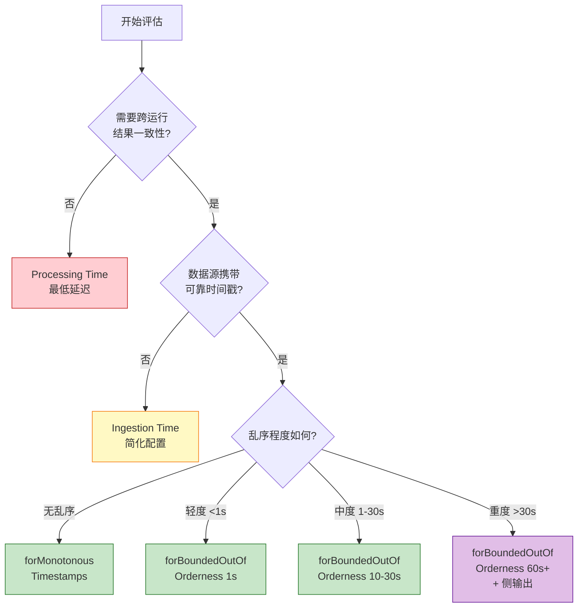
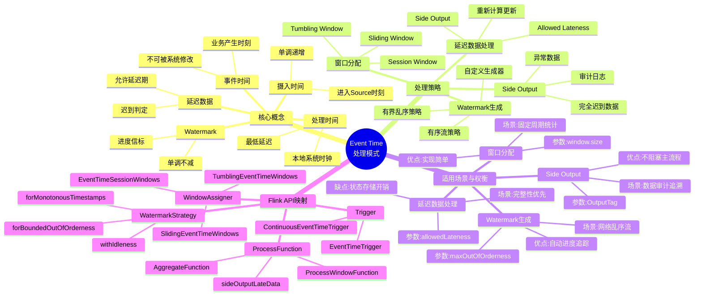
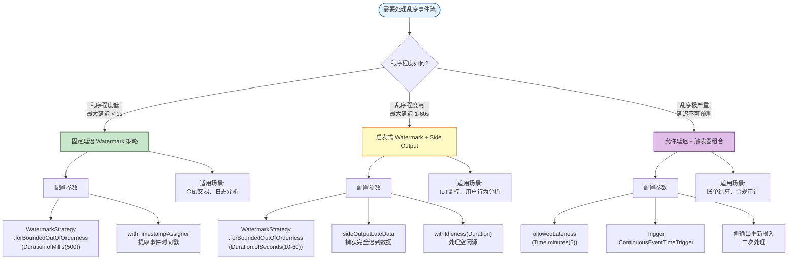
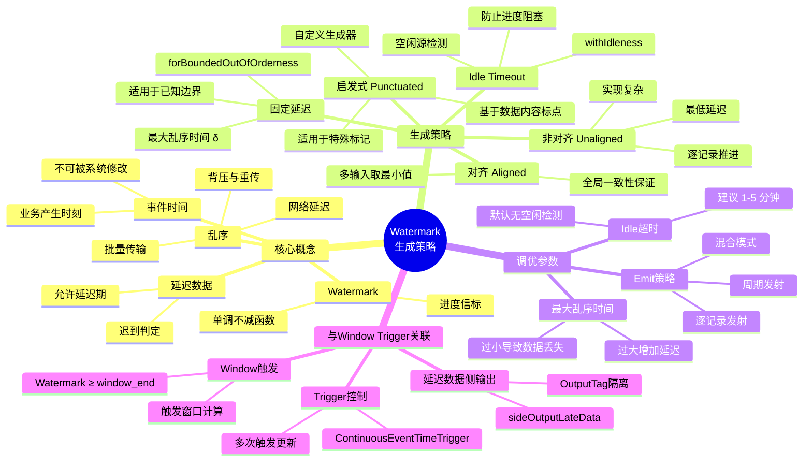
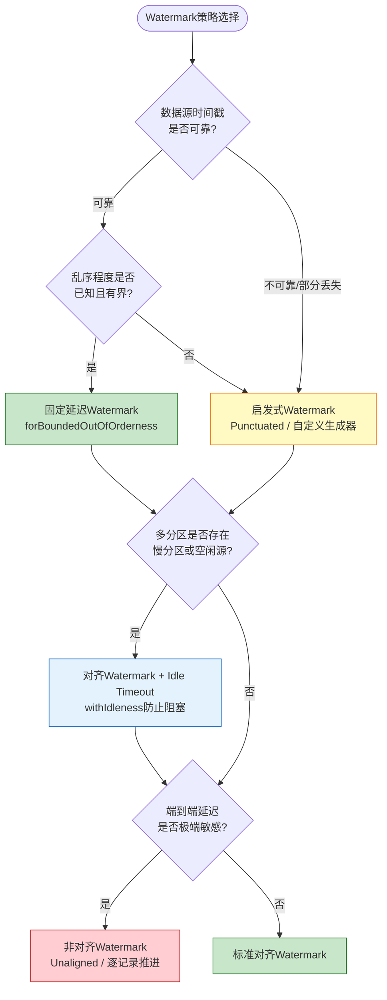

# 设计模式: 事件时间处理 (Pattern: Event Time Processing)

> 所属阶段: Knowledge | 前置依赖: [相关文档] | 形式化等级: L3

> **模式编号**: 01/7 | **所属系列**: Knowledge/02-design-patterns | **形式化等级**: L4-L5
>
> 本模式解决分布式流处理中**乱序数据**、**迟到数据**与**结果确定性**之间的核心矛盾，提供基于 Watermark 的进度追踪机制。

---

## 目录

- [设计模式: 事件时间处理 (Pattern: Event Time Processing)](#设计模式-事件时间处理-pattern-event-time-processing)
  - [目录](#目录)
  - [1. 概念定义 (Definitions)](#1-概念定义-definitions)
    - [Def-K-02-01 (事件时间)](#def-k-02-01-事件时间)
    - [Def-K-02-02 (Watermark)](#def-k-02-02-watermark)
    - [Def-K-02-03 (迟到数据)](#def-k-02-03-迟到数据)
  - [2. 属性推导 (Properties)](#2-属性推导-properties)
    - [Prop-K-02-01 (Watermark 单调性传播)](#prop-k-02-01-watermark-单调性传播)
    - [Prop-K-02-02 (迟到数据处理语义)](#prop-k-02-02-迟到数据处理语义)
  - [3. 关系建立 (Relations)](#3-关系建立-relations)
    - [与窗口聚合的关系](#与窗口聚合的关系)
    - [与 CEP 模式匹配的关系](#与-cep-模式匹配的关系)
    - [与 Checkpoint 机制的关系](#与-checkpoint-机制的关系)
  - [4. 论证过程 (Argumentation)](#4-论证过程-argumentation)
    - [4.1 分布式流处理的时序挑战](#41-分布式流处理的时序挑战)
    - [4.2 时间语义的选择论证](#42-时间语义的选择论证)
    - [4.3 适用场景分析](#43-适用场景分析)
  - [8. 形式化保证 (Formal Guarantees)](#8-形式化保证-formal-guarantees)
    - [8.1 依赖的形式化定义](#81-依赖的形式化定义)
    - [8.2 满足的形式化性质](#82-满足的形式化性质)
    - [8.3 模式组合时的性质保持](#83-模式组合时的性质保持)
    - [8.4 边界条件与约束](#84-边界条件与约束)
    - [8.5 工程实现与理论的对应](#85-工程实现与理论的对应)
  - [5. 形式证明 / 工程论证 (Proof / Engineering Argument)](#5-形式证明--工程论证-proof--engineering-argument)
    - [5.1 Watermark 单调性保证](#51-watermark-单调性保证)
    - [5.2 迟到数据处理的 Exactly-Once 兼容性](#52-迟到数据处理的-exactly-once-兼容性)
    - [5.3 空闲源处理的工程论证](#53-空闲源处理的工程论证)
  - [6. 实例验证 (Examples)](#6-实例验证-examples)
    - [6.1 Flink Watermark 生成策略](#61-flink-watermark-生成策略)
    - [6.2 窗口聚合与迟到数据处理](#62-窗口聚合与迟到数据处理)
    - [6.3 多输入算子的 Watermark 传播](#63-多输入算子的-watermark-传播)
    - [6.4 空闲源处理](#64-空闲源处理)
  - [7. 可视化 (Visualizations)](#7-可视化-visualizations)
    - [7.1 事件时间处理架构图](#71-事件时间处理架构图)
    - [7.2 时间语义决策树](#72-时间语义决策树)
    - [7.3 Event Time处理思维导图](#73-event-time处理思维导图)
    - [7.4 Event Time处理策略决策树](#74-event-time处理策略决策树)
    - [7.5 时间语义与处理策略定位矩阵](#75-时间语义与处理策略定位矩阵)
    - [7.6 Watermark生成策略思维导图](#76-watermark生成策略思维导图)
    - [7.7 Watermark策略选择决策树](#77-watermark策略选择决策树)
    - [7.8 Watermark策略对比矩阵](#78-watermark策略对比矩阵)
  - [9. 引用参考 (References)](#9-引用参考-references)

---

## 1. 概念定义 (Definitions)

### Def-K-02-01 (事件时间)

**定义**: 设 $\text{Record}$ 为流中所有可能记录的集合，$\mathbb{T} = \mathbb{R}_{\geq 0}$ 为时间域。事件时间是一个从记录到时间域的映射：

$$
t_e: \text{Record} \to \mathbb{T}
$$

对于任意记录 $r \in \text{Record}$，$t_e(r)$ 表示该记录在业务逻辑中产生时刻的时间戳，由数据源在生成记录时附加，且在后续处理过程中**不可被流处理系统修改** [^1][^2]。

---

### Def-K-02-02 (Watermark)

**定义**: Watermark 是流处理系统向数据流中注入的一种特殊进度信标，形式化为从数据流到时间域的单调函数（参见 **Def-S-04-04**）[^3][^4]：

$$
wm: \text{Stream} \to \mathbb{T} \cup \{+\infty\}
$$

设当前观察到的 watermark 值为 $w$，其语义断言为：

$$
\forall r \in \text{Stream}_{\text{future}}. \; t_e(r) \geq w \lor \text{Late}(r, w)
$$

即：所有事件时间严格小于 $w$ 的记录，要么已经到达并被处理，要么已被系统判定为"迟到"而不再被目标窗口接受。

---

### Def-K-02-03 (迟到数据)

**定义**: 给定一个已配置的允许延迟参数 $L \geq 0$（allowed lateness），记录 $r$ 相对于当前 watermark $w$ 的"迟到"判定谓词定义为（参见 **Def-S-09-02**）[^3][^4]：

$$
\text{Late}(r, w) \iff t_e(r) \leq w - L
$$

当 $L = 0$ 时，判定条件简化为 $t_e(r) \leq w$。当 $L > 0$ 时，系统在 watermark 越过窗口结束时间后仍保留一段宽限期。

---

## 2. 属性推导 (Properties)

### Prop-K-02-01 (Watermark 单调性传播)

**命题**: 在采用事件时间语义的 Dataflow DAG 中，任意算子的输出 Watermark 序列满足单调不减（**Thm-S-09-01**）。

对于图中任意算子 $v \in V$：

$$
\forall t_1 \leq t_2: \quad w_v(t_1) \leq w_v(t_2)
$$

**推导**:

1. Source 端的 Watermark 生成基于最大观察事件时间减去固定延迟，天然单调
2. 单输入算子直接透传 Watermark，保持单调性（**Lemma-S-04-02**）
3. 多输入算子取所有输入 Watermark 的最小值，最小值函数保持各输入的单调性
4. 因此整个 DAG 中 Watermark 不会倒退

**工程意义**: 该性质保证了窗口触发时刻的**唯一性**，防止同一窗口因 Watermark 倒退而重复触发。

---

### Prop-K-02-02 (迟到数据处理语义)

**命题**: 在 Flink 的 Checkpoint 机制下，引入 Allowed Lateness 不会破坏端到端 Exactly-Once 语义（**Prop-S-08-01**）。

**推导**:

1. 窗口首次触发时输出结果 $v_1$
2. 在 Allowed Lateness 期间，迟到数据到达触发窗口更新，输出修正结果 $v_2, v_3, ...$
3. 这些后续输出是"更新的结果"而非"重复输出"，通常带有时间戳或版本标识
4. Checkpoint 保证状态恢复的一致性，已确认的结果不会重复输出（**Thm-S-18-01**）

**约束条件**: Allowed Lateness 会增加状态保留时间，需权衡存储成本与结果完整性。

---

## 3. 关系建立 (Relations)

### 与窗口聚合的关系

事件时间是窗口聚合的基础时间基准 [^4][^6]：

- **Tumbling Window**、**Sliding Window**、**Session Window** 的边界均基于事件时间定义
- Watermark 单调性（**Thm-S-09-01**）保证窗口触发的幂等性
- 窗口聚合结果可作为下游 CEP 或状态计算的原子事件输入

### 与 CEP 模式匹配的关系

CEP 模式匹配依赖事件时间来定义序列顺序和时间窗口 [^8]：

- 模式中的 `.within(Time)` 约束需要事件时间作为度量基准
- 迟到事件可能破坏序列检测的完整性，需通过侧输出隔离
- Watermark 推进驱动 CEP 中的超时清理机制

### 与 Checkpoint 机制的关系

Checkpoint 是事件时间语义正确性的容错保障 [^3][^4]：

- Checkpoint 持久化 Watermark 状态，保证故障恢复后的单调性延续
- 恢复后的 Watermark 从 checkpointed 值继续推进，满足 **Lemma-S-04-02**
- 端到端 Exactly-Once 需要 Source 可重放、Checkpoint 一致性与事务 Sink 三者合取（**Thm-S-18-01**）

---

## 4. 论证过程 (Argumentation)

### 4.1 分布式流处理的时序挑战

在分布式流处理系统中，数据记录的**物理到达顺序**与其**业务发生顺序（事件时间）**存在本质性的不一致。这种不一致源于以下因素 [^1][^2]：

| 因素 | 描述 | 典型延迟范围 |
|------|------|-------------|
| **网络延迟** | 数据从产生到传输到处理节点的网络时延 | 10ms - 数秒 |
| **背压 (Backpressure)** | 下游处理缓慢导致上游数据堆积 | 数秒 - 数分钟 |
| **重传机制** | 网络丢包后的数据重传 | 数秒 - 数十秒 |
| **时钟漂移** | 分布式节点间系统时钟的不一致 | 毫秒 - 秒级 |
| **批量传输** | 边缘网关为节省带宽而进行的批量上报 | 数秒 - 数分钟 |

**形式化描述** [^3]：

设记录 $r$ 的事件时间为 $t_e(r)$，其到达处理系统的时间为 $t_a(r)$，则对于任意两个记录 $r_1, r_2$：

$$
t_e(r_1) < t_e(r_2) \nRightarrow t_a(r_1) < t_a(r_2)
$$

即事件时间的偏序关系与到达时间的偏序关系**不保持同构**。这种乱序特性使得基于到达顺序的窗口聚合可能产生**非确定性结果**。

**业务场景表现**:

- **金融风控**: 同一用户的多笔交易可能因网络路径不同而乱序到达，若使用 Processing Time 窗口，迟到事件将被错误地归入下一个窗口，导致风控规则漏判 [^5]
- **IoT 监控**: 边缘网关批量上报导致传感器数据乱序，若窗口在 Watermark 之前触发，关键数据将被遗漏 [^6]
- **CDC 同步**: 同一行数据的多个变更事件必须按事务提交顺序处理，乱序的 DELETE/UPDATE 将导致状态错误 [^7]

---

### 4.2 时间语义的选择论证

流处理系统通常提供三种时间语义，各有其适用边界 [^2][^4]：

| 语义 | 定义 | 特性 | 代价 | 适用场景 |
|------|------|------|------|---------|
| **Event Time** | 数据产生时的业务时间戳 | 与到达顺序解耦，保证结果确定性 | 需要 Watermark 管理和迟到数据处理 | 金融交易、用户行为分析、IoT 监控 |
| **Processing Time** | 算子处理的本地系统时间 | 最低延迟，无状态开销 | 结果依赖于执行时刻，非确定性 | 实时监控、近似统计、告警系统 |
| **Ingestion Time** | 数据进入 Source 时的系统时间 | 单调递增，无需用户配置 Watermark | 无法处理 Source 处的乱序 | 日志分析、简单 ETL |

**正确性保证层次关系** [^4]：

$$
\text{Processing Time} \subset \text{Ingestion Time} \subset \text{Event Time}
$$

任何 Processing Time 计算都可以被 Event Time 模拟（通过将处理时间作为伪事件时间），但反之不成立。因此在正确性维度上，Event Time 是其他两种语义的超集。

---

### 4.3 适用场景分析

**推荐使用场景** [^5][^6]：

| 场景 | 理由 | 典型 Watermark 配置 |
|------|------|-------------------|
| **金融交易风控** | 需要精确按交易时间汇总，结果可复现 | `forBoundedOutOfOrderness(500ms)` |
| **用户行为分析** | 乱序到达的点击流需要正确归属 | `forBoundedOutOfOrderness(10s)` |
| **IoT 传感器监控** | 网络延迟导致数据乱序，边缘网关批量上报 | `forBoundedOutOfOrderness(15s) + withIdleness(2min)` |
| **CDC 数据同步** | 保证变更顺序正确性，避免状态错误 | `forBoundedOutOfOrderness(1s)` |
| **实时推荐系统** | 特征 freshness 依赖正确的事件时间窗口 | `forBoundedOutOfOrderness(5s)` |

**不推荐使用场景** [^4]：

| 场景 | 理由 | 替代方案 |
|------|------|---------|
| **实时监控告警** | 延迟优先，近似即可 | Processing Time |
| **简单 ETL (无时钟源)** | 数据源无可靠时间戳 | Ingestion Time |
| **极低延迟要求 (<100ms)** | Watermark 延迟增加端到端延迟 | Processing Time + 后置校正 |

---

## 8. 形式化保证 (Formal Guarantees)

本节建立 Event Time Processing 模式与 Struct/ 理论层的形式化连接，明确该模式依赖的定理、定义及其提供的语义保证。

### 8.1 依赖的形式化定义

| 定义编号 | 名称 | 来源 | 在本模式中的作用 |
|----------|------|------|-----------------|
| **Def-S-04-04** | Watermark 语义 | Struct/01.04 | 定义 Watermark 为单调不减的进度指示器 $\omega(t) \leq t$，是本模式的核心抽象 |
| **Def-S-09-02** | Watermark 进度语义 | Struct/02.03 | 形式化 Watermark 的推进规则与迟到数据判定条件 |
| **Def-S-07-01** | 确定性流计算系统 | Struct/02.01 | 事件时间是实现确定性处理的六元组组成部分 |
| **Def-S-08-04** | Exactly-Once 语义 | Struct/02.02 | 迟到数据处理不破坏端到端一致性 |

### 8.2 满足的形式化性质

| 定理/引理编号 | 名称 | 来源 | 保证内容 |
|---------------|------|------|----------|
| **Thm-S-09-01** | Watermark 单调性定理 | Struct/02.03 | 保证窗口触发时刻的唯一性，防止同一窗口重复触发 |
| **Lemma-S-04-02** | Watermark 单调性引理 | Struct/01.04 | Watermark 在 Dataflow 图中传播保持单调不减 |
| **Thm-S-07-01** | 流计算确定性定理 | Struct/02.01 | 纯函数 + FIFO + 事件时间 $\to$ 确定性输出 |
| **Prop-S-08-01** | 端到端 Exactly-Once 分解 | Struct/02.02 | Source $\land$ Checkpoint $\land$ Sink 三要素合取 |

### 8.3 模式组合时的性质保持

**Event Time + Windowed Aggregation 组合**：

- Watermark 单调性（**Thm-S-09-01**）保证窗口触发的幂等性
- 允许延迟（Allowed Lateness）机制引入的修正输出仍保持 Exactly-Once 语义

**Event Time + Checkpoint 组合**：

- Checkpoint 持久化 Watermark 状态，保证故障恢复后的单调性延续
- 恢复后的 Watermark 从 checkpointed 值继续推进，满足 **Lemma-S-04-02**

### 8.4 边界条件与约束

| 约束条件 | 形式化描述 | 违反后果 |
|----------|-----------|----------|
| 乱序边界 $L \geq D_{\text{actual}}$ | Watermark 延迟参数必须大于等于实际乱序程度 | 数据丢失或结果不完整 |
| 单调性保持 | $\forall t_1 \leq t_2: w(t_1) \leq w(t_2)$ | 窗口重复触发，结果错误 |
| 空闲源处理 | `withIdleness(T)` 配置 | 停滞 Watermark 阻塞全局进度 |

### 8.5 工程实现与理论的对应

| 理论概念 | Flink API | 形式化基础 |
|----------|-----------|-----------|
| Watermark 生成 | `WatermarkStrategy.forBoundedOutOfOrderness()` | **Def-S-04-04** |
| 迟到数据处理 | `.allowedLateness()` + `.sideOutputLateData()` | **Def-S-09-02** |
| 空闲源处理 | `.withIdleness()` | **Thm-S-09-01** 扩展 |
| 事件时间提取 | `SerializableTimestampAssigner` | **Def-S-07-01** |

---

## 5. 形式证明 / 工程论证 (Proof / Engineering Argument)

### 5.1 Watermark 单调性保证

**定理声明**（引用 **Thm-S-09-01**）[^3]：

> 设 $\mathcal{G} = (V, E, P, \Sigma, \mathbb{T})$ 为一个采用事件时间语义的 Dataflow DAG。对于图中任意算子 $v \in V$，其输出 Watermark 序列满足单调不减：
> $$\forall v \in V, \; \forall t_1 \leq t_2: \quad w_v(t_1) \leq w_v(t_2)$$

**工程论证**:

1. **Source 端**: Watermark 生成策略基于 $\max(t_e) - \delta$，由于 $\max(t_e)$ 单调不减，生成的 Watermark 亦单调不减
2. **单输入算子** (Map/Filter): $w_{\text{out}} = w_{\text{in}} - d_{\text{proc}}$，直接透传保持单调性
3. **多输入算子** (Join/Union): $w_{\text{out}} = \min_i w_{\text{in}_i}$，最小值函数在各输入单调的前提下保持单调
4. 因此，整个数据流图中不存在 Watermark 倒退的路径

该定理保证了窗口触发时刻的**唯一性**，防止同一窗口因 Watermark 倒退而重复触发，是事件时间语义正确性的理论基础。

---

### 5.2 迟到数据处理的 Exactly-Once 兼容性

**工程论证目标**: 证明在启用 Allowed Lateness 和 Side Output 的情况下，Flink 作业仍能保持端到端 Exactly-Once 语义。

**论证结构**:

1. **状态一致性**: 窗口状态（包括尚未触发的窗口和允许延迟期内的窗口）通过 Checkpoint 机制持久化（**Thm-S-17-01**）
2. **输出确定性**: 同一窗口的多次触发（首次触发 + 迟到更新）是确定性的，因为触发条件仅依赖于 Watermark 推进和事件时间（**Thm-S-07-01**）
3. **无重复输出**: 若 Sink 使用事务性两阶段提交（2PC），则只有 Checkpoint 成功后的输出才会被提交；故障恢复后，未提交的事务会被回滚并重新计算（**Thm-S-18-01**）
4. **无数据丢失**: Source 从 Checkpoint 记录的偏移量重放，确保所有数据至少被处理一次（**Lemma-S-18-01**）

综上，Event Time + Allowed Lateness + Checkpoint + 事务 Sink 的组合满足端到端 Exactly-Once。

---

### 5.3 空闲源处理的工程论证

**问题**: 在多输入算子中，若一个输入源长时间无数据，其停滞的 Watermark 将通过最小值传播阻塞整个 DAG 的进度。

**解决方案的工程正确性**:

Flink 的 `withIdleness(Duration)` 机制在 Source 端引入空闲检测：

1. 当某 Source 在配置时长 $T$ 内未产生任何记录时，标记为 `IDLE`
2. 空闲 Source 不再参与下游 Watermark 的最小值计算
3. 当该 Source 恢复生产数据时，其 Watermark 从最新事件时间重新开始参与计算

**正确性保证**: 此机制不影响结果正确性，因为：

- 空闲期间确实没有新数据产生，因此不需要等待其 Watermark 推进来触发窗口
- 恢复后的 Watermark 从实际数据的事件时间生成，不会引入虚假的时间进度
- 已标记为空闲的 Source 若恢复时产生的事件时间早于当前全局 Watermark，该数据会被正确判定为迟到并通过侧输出处理

---

## 6. 实例验证 (Examples)

### 6.1 Flink Watermark 生成策略

**策略 1: 有序流 (Ordered Stream)** [^4][^6]

适用于 Kafka 单分区、有序日志等场景：

```scala
import org.apache.flink.api.common.eventtime.{SerializableTimestampAssigner, WatermarkStrategy}
import java.time.Duration

// 有序流:无乱序,Watermark 等于当前最大事件时间
val orderedWatermarkStrategy: WatermarkStrategy[SensorReading] =
  WatermarkStrategy
    .forMonotonousTimestamps[SensorReading]()
    .withTimestampAssigner(new SerializableTimestampAssigner[SensorReading] {
      override def extractTimestamp(element: SensorReading, recordTimestamp: Long): Long =
        element.timestamp
    })
    // 空闲源处理:2分钟内无数据视为空闲
    .withIdleness(Duration.ofMinutes(2))
```

**策略 2: 有界乱序 (Bounded Out-of-Orderness)** [^4][^5][^6]

最常用策略，适用于网络传输导致的乱序场景：

```scala
// 乱序交易流:容忍最大 10 秒乱序
val boundedWatermarkStrategy: WatermarkStrategy[Transaction] =
  WatermarkStrategy
    .forBoundedOutOfOrderness[Transaction](Duration.ofSeconds(10))
    .withTimestampAssigner((txn, _) => txn.timestamp)
    .withIdleness(Duration.ofMinutes(1))

// 应用于 DataStream
val streamWithWatermark: DataStream[Transaction] = env
  .fromSource(kafkaSource, boundedWatermarkStrategy, "Transaction Source")
```

**策略 3: 自定义生成器 (Custom Generator)** [^4]

适用于数据携带特殊标点（如心跳包）的场景：

```scala
import org.apache.flink.api.common.eventtime._

// 基于标点 Watermark 生成器
class PunctuatedWatermarkGenerator extends WatermarkGenerator[SensorReading] {
  private var maxTimestamp = Long.MinValue

  override def onEvent(
    event: SensorReading,
    eventTimestamp: Long,
    output: WatermarkOutput
  ): Unit = {
    maxTimestamp = math.max(maxTimestamp, eventTimestamp)

    // 特殊标记包触发 Watermark 推进
    if (event.isHeartbeatPacket) {
      output.emitWatermark(new Watermark(maxTimestamp))
    }
  }

  override def onPeriodicEmit(output: WatermarkOutput): Unit = {
    // 周期性发射,确保进度不被阻塞
    if (maxTimestamp > Long.MinValue) {
      output.emitWatermark(new Watermark(maxTimestamp - 1))
    }
  }
}
```

---

### 6.2 窗口聚合与迟到数据处理

**完整示例：IoT 传感器会话窗口** [^6]

```scala
import org.apache.flink.streaming.api.scala._
import org.apache.flink.streaming.api.windowing.assigners.SessionWindows
import org.apache.flink.streaming.api.windowing.time.Time
import org.apache.flink.streaming.api.scala.function.ProcessWindowFunction
import org.apache.flink.util.Collector

// 定义侧输出标签
val lateDataTag = OutputTag[SensorReading]("late-data")

// 带迟到数据处理的会话窗口
val sessionStream = sensorStream
  // 1. 分配时间戳和 Watermark
  .assignTimestampsAndWatermarks(
    WatermarkStrategy
      .forBoundedOutOfOrderness[SensorReading](Duration.ofSeconds(15))
      .withTimestampAssigner((reading, _) => reading.timestamp)
      .withIdleness(Duration.ofMinutes(2))
  )

  // 2. 按设备 ID 分区
  .keyBy(_.deviceId)

  // 3. 定义会话窗口(10分钟无活动则关闭)
  .window(EventTimeSessionWindows.withGap(Time.minutes(10)))

  // 4. 允许 30 秒延迟(Watermark 过后仍可更新)
  .allowedLateness(Time.seconds(30))

  // 5. 侧输出捕获完全迟到的数据
  .sideOutputLateData(lateDataTag)

  // 6. 窗口处理函数
  .process(new DeviceSessionAggregateFunction())

// 处理主输出
sessionStream.addSink(new InfluxDBSink())

// 处理迟到数据
val lateDataStream: DataStream[SensorReading] = sessionStream.getSideOutput(lateDataTag)
lateDataStream.addSink(new LateDataAuditSink())
```

**窗口聚合函数实现** [^6]：

```scala
class DeviceSessionAggregateFunction
  extends ProcessWindowFunction[SensorReading, DeviceSession, String, SessionWindow] {

  private var deviceState: ValueState[DeviceState] = _

  override def open(parameters: Configuration): Unit = {
    deviceState = getRuntimeContext.getState(
      new ValueStateDescriptor("device-state", classOf[DeviceState])
    )
  }

  override def process(
    deviceId: String,
    context: Context,
    readings: Iterable[SensorReading],
    out: Collector[DeviceSession]
  ): Unit = {
    // 按事件时间排序处理(处理乱序到达)
    val sortedReadings = readings.toVector.sortBy(_.timestamp)

    // 计算会话统计
    val statistics = calculateStatistics(sortedReadings)

    // 检测异常
    val anomalies = detectAnomalies(sortedReadings)

    // 构建会话结果
    val session = DeviceSession(
      deviceId = deviceId,
      sessionStart = context.window.getStart,
      sessionEnd = context.window.getEnd,
      readings = sortedReadings,
      statistics = statistics,
      anomalies = anomalies
    )

    out.collect(session)
  }
}
```

---

### 6.3 多输入算子的 Watermark 传播

**Join 操作的 Watermark 处理** [^3][^4]：

```scala
// 双流 Join:Watermark 取最小值
val joinedStream = transactionStream
  .join(userProfileStream)
  .where(_.userId)
  .equalTo(_.userId)
  .window(TumblingEventTimeWindows.of(Time.minutes(5)))
  .apply(new TransactionEnrichmentFunction())
```

在上述 Join 中，输出 Watermark 为：

$$
w_{\text{out}} = \min(w_{\text{transaction}}, w_{\text{profile}})
$$

这意味着如果 userProfileStream 进度缓慢，将阻塞整个 Join 的窗口触发。

**多源 Union 的空闲源处理** [^4][^6]：

```scala
// 多数据源 Union 场景
val sourceA = env.fromSource(kafkaSourceA,
  WatermarkStrategy.forBoundedOutOfOrderness[Event](Duration.ofSeconds(5)),
  "Source A"
)

val sourceB = env.fromSource(kafkaSourceB,
  WatermarkStrategy.forBoundedOutOfOrderness[Event](Duration.ofSeconds(10))
    .withIdleness(Duration.ofMinutes(5)),  // 关键:空闲源处理
  "Source B"
)

val unionedStream = sourceA.union(sourceB)
```

`withIdleness()` 配置确保当 Source B 在 5 分钟内无数据时，系统将其标记为空闲，不再参与 Watermark 最小值计算，防止阻塞全局进度。

---

### 6.4 空闲源处理

**问题描述**：在多输入算子中，若一个输入源长时间无数据（如夜间无交易的支付系统），其停滞的 Watermark 将通过最小值传播阻塞整个 DAG 的进度。

**解决方案** [^4][^6]：

```scala
// 空闲源检测配置
WatermarkStrategy
  .forBoundedOutOfOrderness[Event](Duration.ofSeconds(10))
  .withIdleness(Duration.ofMinutes(5))  // 5分钟无数据视为空闲
```

**实现原理**：

```
正常情况:
Source A wm=15 ──┐
                 ├─► min(15, 10) = 10 ──► Window 触发
Source B wm=10 ──┘

Source B 空闲后 (5分钟无数据):
Source A wm=25 ──┐
                 ├─► Source B 被标记为空闲,只考虑 Source A
Source B wm=10 ──┘ (空闲)

输出 wm=25 ──► Window 正常触发
```

---

## 7. 可视化 (Visualizations)

### 7.1 事件时间处理架构图

以下 Mermaid 图展示了事件时间处理模式的核心组件和数据流：

```mermaid
graph TB
    subgraph "Source Layer"
        S1[Data Source A<br/>Event Time: t_e]
        S2[Data Source B<br/>Event Time: t_e]
    end

    subgraph "Timestamp Assignment"
        TA1[Timestamp Assigner<br/>extract t_e from record]
        TA2[Timestamp Assigner<br/>extract t_e from record]
    end

    subgraph "Watermark Generation"
        WG1[Watermark Generator<br/>wm = max(t_e) - δ]
        WG2[Watermark Generator<br/>wm = max(t_e) - δ]
    end

    subgraph "Stream Processing"
        SP1[Map/Filter<br/>Pass-through]
        SP2[Join/Union<br/>wm_out = min(wm_in)]
        SP3[Window Operator<br/>Trigger: wm ≥ window_end]
    end

    subgraph "Output Handling"
        OH1[Main Output<br/>On-time Results]
        OH2[Side Output<br/>Late Data]
        OH3[State Backend<br/>RocksDB]
    end

    S1 --> TA1 --> WG1 --> SP1
    S2 --> TA2 --> WG2 --> SP2
    SP1 --> SP2 --> SP3
    SP3 --> OH1
    SP3 -.->|Late Data| OH2
    SP3 -.->|State| OH3

    style WG1 fill:#fff9c4,stroke:#f57f17
    style WG2 fill:#fff9c4,stroke:#f57f17
    style SP3 fill:#c8e6c9,stroke:#2e7d32
    style OH2 fill:#ffcdd2,stroke:#c62828
```

**组件职责说明**：

| 组件 | 职责 | 关键配置 |
|------|------|---------|
| Timestamp Assigner | 从记录中提取事件时间戳 | `SerializableTimestampAssigner` |
| Watermark Generator | 周期性生成 Watermark | `forBoundedOutOfOrderness()`, `withIdleness()` |
| Window Operator | 基于 Watermark 触发窗口 | `allowedLateness()`, `sideOutputLateData()` |
| Side Output | 捕获完全迟到的数据 | `OutputTag<>` |

---

### 7.2 时间语义决策树

以下决策树帮助在不同场景下选择合适的时间语义：



---

### 7.3 Event Time处理思维导图

以下思维导图以"Event Time处理模式"为中心，系统展示其核心概念、处理策略、适用场景与Flink API映射：



**四层结构说明**：

| 层级 | 内容 | 作用 |
|------|------|------|
| **第一层** | 核心概念 | 建立事件时间处理的术语体系 |
| **第二层** | 处理策略 | 提供可直接实施的技术选项 |
| **第三层** | 适用场景与权衡 | 指导工程选型与参数配置 |
| **第四层** | Flink API映射 | 建立理论概念与工程实现的直接对应 |

---

### 7.4 Event Time处理策略决策树

以下决策树针对**已确定使用 Event Time 语义**的场景，进一步指导具体处理策略的选择：



**决策条件说明**：

| 分支 | 决策条件 | 核心配置 | 延迟代价 |
|------|----------|----------|----------|
| **分支1: 固定延迟** | 乱序有界且边界已知，如单分区Kafka | `forBoundedOutOfOrderness(δ)` | δ |
| **分支2: 启发式+侧输出** | 乱序程度中等，部分数据可能大幅迟到 | `forBoundedOutOfOrderness(δ)` + `sideOutputLateData()` | δ + 侧输出处理延迟 |
| **分支3: 允许延迟+触发器** | 完整性要求极高，容忍高延迟 | `allowedLateness()` + `ContinuousEventTimeTrigger` | 允许延迟期 + 触发周期 |

---

### 7.5 时间语义与处理策略定位矩阵

以下矩阵展示不同时间语义和处理策略在**延迟-完整性**二维空间中的定位：

```mermaid
quadrantChart
    title 时间语义与处理策略在延迟-完整性维度的定位
    x-axis 低延迟 --> 高延迟
    y-axis 低完整性 --> 高完整性
    quadrant-1 高延迟-高完整性:精确统计
    quadrant-2 高延迟-低完整性:不推荐
    quadrant-3 低延迟-低完整性:近似监控
    quadrant-4 低延迟-高完整性:理想状态
    Event Time + Allowed Lateness: [0.85, 0.9]
    Event Time + Side Output: [0.65, 0.85]
    Event Time + 固定延迟Watermark: [0.45, 0.7]
    启发式Watermark + 触发器组合: [0.75, 0.8]
    Ingestion Time: [0.35, 0.5]
    Processing Time: [0.15, 0.2]
```

**矩阵解读**：

| 象限 | 特征 | 推荐策略 | 典型场景 |
|------|------|----------|----------|
| **Q1: 高延迟-高完整性** | 精确统计，容忍延迟 | Event Time + Allowed Lateness | 金融结算、合规报表 |
| **Q2: 高延迟-低完整性** | 不推荐，需重新评估架构 | — | — |
| **Q3: 低延迟-低完整性** | 近似监控，快速响应 | Processing Time | 实时监控告警 |
| **Q4: 低延迟-高完整性** | 理想状态，实际难以达到 | — | — |

---

### 7.6 Watermark生成策略思维导图

以下思维导图以 **"Watermark生成策略"** 为中心，放射状展开核心概念、生成策略、调优参数及与 Window/Trigger 的关联：



**四层结构说明**：

| 层级 | 内容 | 作用 |
|------|------|------|
| **第一层** | 核心概念 | 建立 Watermark 生成的术语与语义基础 |
| **第二层** | 生成策略 | 提供可直接实施的 Watermark 技术选型 |
| **第三层** | 调优参数 | 指导工程配置与性能权衡 |
| **第四层** | 与 Window/Trigger 关联 | 明确 Watermark 如何驱动窗口生命周期 |

---

### 7.7 Watermark策略选择决策树

以下决策树针对 **Watermark 生成策略** 的选择场景，从数据源可靠性、分区特性和延迟敏感度三个维度提供决策路径：



**决策条件说明**：

| 分支 | 决策条件 | 核心配置 | 适用场景 |
|------|----------|----------|----------|
| **分支1: 启发式** | 时间戳不可靠或乱序无界 | 自定义 `WatermarkGenerator` / 标点触发 | 日志补传、边缘网关批量上报 |
| **分支2: 固定延迟** | 时间戳可靠且乱序有界已知 | `forBoundedOutOfOrderness(δ)` | 金融交易、Kafka单分区日志 |
| **分支3: 对齐+Idle** | 多分区存在慢分区或夜间空闲 | `withIdleness(Duration)` | IoT多传感器、Union多源 |
| **分支4: 非对齐** | 端到端延迟要求极高（<100ms） | 非对齐Checkpoint + 最小Watermark延迟 | 高频交易、实时竞价 |

---

### 7.8 Watermark策略对比矩阵

以下矩阵在 **延迟-完整性**（X轴）与 **实现复杂度**（Y轴）二维空间中定位各 Watermark 策略：

```mermaid
quadrantChart
    title Watermark策略对比矩阵：延迟-完整性与实现复杂度
    x-axis 低延迟 --> 高完整性
    y-axis 简单实现 --> 复杂实现
    quadrant-1 高完整-复杂实现:生产级精确保证
    quadrant-2 高完整-简单实现:推荐首选
    quadrant-3 低延迟-简单实现:快速近似
    quadrant-4 低延迟-复杂实现:专家级精细调优
    固定延迟: [0.5, 0.15]
    启发式Punctuated: [0.6, 0.65]
    Per-Partition: [0.35, 0.5]
    对齐Watermark: [0.85, 0.25]
    非对齐Watermark: [0.15, 0.85]
```

**矩阵解读**：

| 策略 | 定位 | 延迟特征 | 完整性特征 | 实现复杂度 | 推荐场景 |
|------|------|----------|------------|------------|----------|
| **固定延迟** | Q2 附近 | 中等（δ延迟） | 中高（有界保证） | 低（单参数配置） | 通用首选，已知乱序边界 |
| **启发式 Punctuated** | Q1 偏左 | 取决于数据密度 | 取决于启发式质量 | 高（需自定义逻辑） | 数据携带特殊标点（心跳包） |
| **Per-Partition** | Q4 偏左 | 低（分区独立推进） | 低（分区失衡风险） | 中（需分区状态管理） | 分区延迟差异大的场景 |
| **对齐 Watermark** | Q2 偏右 | 高（受限于最慢输入） | 高（全局一致性） | 低（框架内置） | 多输入Join/Union默认 |
| **非对齐 Watermark** | Q4 右上 | 极低（逐记录） | 低（无全局边界保证） | 极高（需配合非对齐Checkpoint） | 极端延迟敏感（<100ms） |

> **选型建议**：
>
> - **默认选择**：固定延迟 `forBoundedOutOfOrderness`，参数易调且覆盖80%场景
> - **多源场景**：对齐 Watermark + `withIdleness` 解决慢分区阻塞
> - **特殊数据**：启发式 Punctuated 利用数据自身语义推进 Watermark
> - **极端延迟**：仅在端到端延迟要求 <100ms 时考虑非对齐方案，需承担完整性风险

---

## 9. 引用参考 (References)

[^1]: T. Akidau et al., "The Dataflow Model: A Practical Approach to Balancing Correctness, Latency, and Cost in Massive-Scale, Unbounded, Out-of-Order Data Processing," *PVLDB*, 8(12), 2015. <https://doi.org/10.14778/2824032.2824076>

[^2]: Apache Flink Documentation, "Event Time and Watermarks," 2025. <https://nightlies.apache.org/flink/flink-docs-stable/docs/concepts/time/>

[^3]: Watermark 单调性定理，详见 [Struct/02-properties/02.03-watermark-monotonicity.md](../../Struct/02-properties/02.03-watermark-monotonicity.md)

[^4]: Flink 时间语义与 Watermark，详见 [Flink/02-core/time-semantics-and-watermark.md](../../Flink/02-core/time-semantics-and-watermark.md)

[^5]: 金融风控实时欺诈检测案例，详见 [Flink/09-practices/09.01-case-studies/case-financial-realtime-risk-control.md](../../Flink/09-practices/09.01-case-studies/case-financial-realtime-risk-control.md)

[^6]: IoT 流处理工业案例，详见 [Flink/09-practices/09.01-case-studies/case-iot-stream-processing.md](../../Flink/09-practices/09.01-case-studies/case-iot-stream-processing.md)

[^7]: 实时 ETL 深度解析，详见 [Flink/09-practices/09.01-case-studies/case-realtime-analytics.md](../../Flink/09-practices/09.01-case-studies/case-realtime-analytics.md)

[^8]: CEP 复杂事件处理模式，详见 [Flink/03-api-patterns/flink-cep-deep-dive.md](../../Flink/03-api/03.02-table-sql-api/flink-sql-window-functions-deep-dive.md)


---

*文档版本: v1.2 | 更新日期: 2026-04-24 | 状态: 已完成*

---

*文档版本: v1.1 | 更新日期: 2026-04-24 | 状态: 已完成*

---

*文档版本: v1.0 | 创建日期: 2026-04-20*
