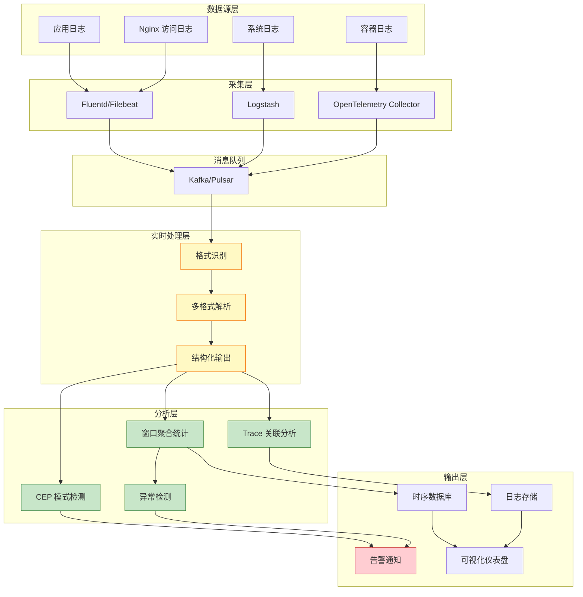
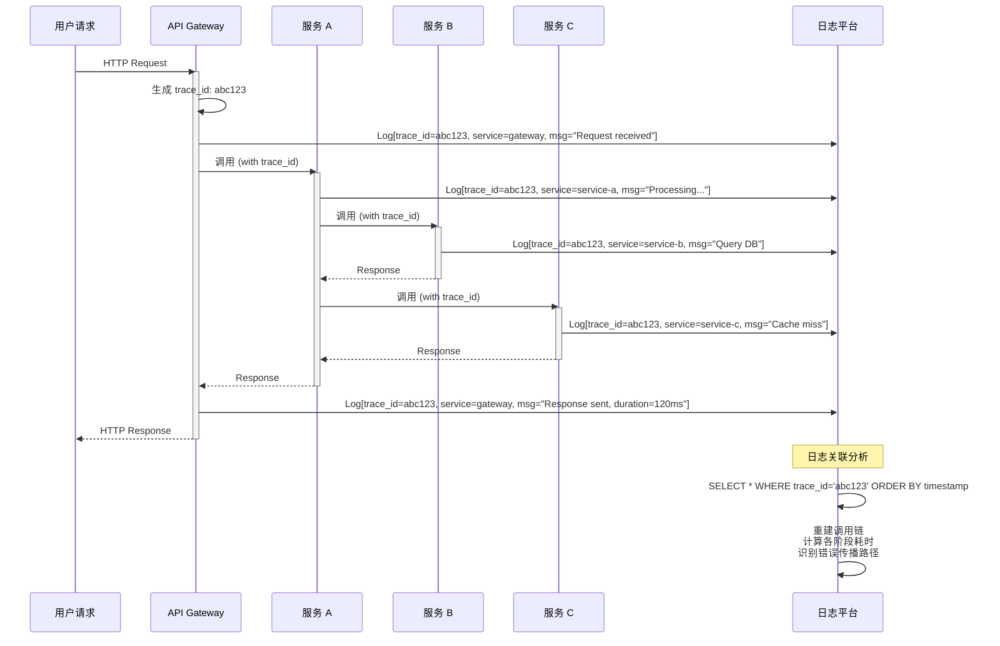

# 设计模式: 实时日志分析 (Pattern: Real-time Log Analysis)

> **模式编号**: 06/7 | **所属系列**: Knowledge/02-design-patterns | **形式化等级**: L4 | **复杂度**: ★★★☆☆
>
> 本模式解决**异构日志流**的实时解析、结构化、关联分析与异常检测问题，提供从原始日志到可行动洞察的完整处理链路。

---

## 目录

- [设计模式: 实时日志分析 (Pattern: Real-time Log Analysis)](#设计模式-实时日志分析-pattern-real-time-log-analysis)
  - [目录](#目录)
  - [1. 概念定义 (Definitions)](#1-概念定义-definitions)
    - [Def-K-02-13 (日志流模式)](#def-k-02-13-日志流模式)
    - [Def-K-02-14 (日志结构化)](#def-k-02-14-日志结构化)
    - [Def-K-02-15 (日志聚合与关联)](#def-k-02-15-日志聚合与关联)
  - [2. 属性推导 (Properties)](#2-属性推导-properties)
    - [Prop-K-02-03 (解析完备性)](#prop-k-02-03-解析完备性)
    - [Prop-K-02-04 (关联传递性)](#prop-k-02-04-关联传递性)
  - [3. 关系建立 (Relations)](#3-关系建立-relations)
    - [关系: Log Analysis `↦` Windowed Aggregation](#关系-log-analysis--windowed-aggregation)
    - [关系: Log Analysis `↦` CEP Pattern](#关系-log-analysis--cep-pattern)
  - [4. 论证过程 (Argumentation)](#4-论证过程-argumentation)
    - [4.1 日志格式解析策略矩阵](#41-日志格式解析策略矩阵)
    - [4.2 日志关联维度分析](#42-日志关联维度分析)
    - [4.3 异常检测算法选择](#43-异常检测算法选择)
  - [5. 形式证明 / 工程论证](#5-形式证明--工程论证)
    - [Thm-K-02-02 (日志关联完整性条件)](#thm-k-02-02-日志关联完整性条件)
  - [6. 实例验证 (Examples)](#6-实例验证-examples)
    - [6.1 多格式日志解析](#61-多格式日志解析)
    - [6.2 Trace ID 关联分析](#62-trace-id-关联分析)
    - [6.3 异常模式检测](#63-异常模式检测)
    - [6.4 性能异常诊断](#64-性能异常诊断)
  - [7. 可视化 (Visualizations)](#7-可视化-visualizations)
    - [日志分析架构图](#日志分析架构图)
    - [日志关联分析流程](#日志关联分析流程)
  - [8. 引用参考 (References)](#8-引用参考-references)

---

## 1. 概念定义 (Definitions)

本节建立实时日志分析模式的严格形式化基础，涵盖日志流模式、结构化日志和日志聚合关联的核心定义。这些概念是构建统一日志分析平台的基础抽象。

### Def-K-02-13 (日志流模式)

**日志流**（Log Stream）是由分布式系统组件持续产生的、带时间戳的文本记录序列 [^1][^2]：

$$
\mathcal{L} = \langle l_1, l_2, \ldots, l_n \rangle, \quad \forall i: l_i = (t_i, s_i, m_i, \rho_i)
$$

其中：

- $t_i \in \mathbb{T}$: 日志时间戳（产生或收集时间）
- $s_i \in \Sigma$: 日志来源标识（服务名、主机名、容器ID）
- $m_i \in \mathcal{M}$: 日志消息内容（结构化或半结构化文本）
- $\rho_i$: 元数据（日志级别、线程ID、类名等）

**日志流分类** [^2][^3]：

| 类型 | 特征 | 示例 | 处理挑战 |
|------|------|------|---------|
| **结构化日志** | 预定义 schema，机器可读 | `{"ts": "2024-01...", "level": "INFO", "msg": "..."}` | Schema 演进管理 |
| **半结构化日志** | 部分结构化，含自由文本 | Apache/Nginx 访问日志 | 正则/ Grok 解析 |
| **非结构化日志** | 纯自然语言文本 | 应用异常堆栈、用户日志 | NLP 提取关键信息 |
| **二进制日志** | 编码数据流 | Windows EVT、Protobuf 日志 | 解码与反序列化 |

**日志流的实时处理语义** [^1]：

$$
\text{Process}(\mathcal{L}, t) = \{ f(l_i) \mid l_i \in \mathcal{L} \land t_i \leq t \}
$$

其中 $f$ 是解析/转换函数。实时处理要求对于输入流的每个新元素，在有限时间内产生输出。

**直观解释**：日志流是系统运行时的"数字脉搏"，记录了从基础设施到业务逻辑的全栈行为。实时日志分析的目标是在数据产生后秒级/分钟级内提取洞察，而非传统的 T+1 离线分析。

---

### Def-K-02-14 (日志结构化)

**日志结构化**（Structured Logging）是将原始文本日志转换为统一 schema 的规范化记录的过程 [^2][^4]：

$$
\text{Parse}: \mathcal{L}_{raw} \times \mathcal{G} \to \mathcal{L}_{structured}
$$

其中：

- $\mathcal{G}$: 解析规则/模式集合（Grok 模式、正则表达式、JSON Schema）
- $\mathcal{L}_{structured}$: 结构化日志流，每条记录具有统一字段集

**结构化日志的标准字段** [^4][^5]：

| 字段 | 类型 | 语义 | 必选 |
|------|------|------|------|
| `@timestamp` | ISO8601 | 事件产生时间 | 是 |
| `level` | Enum | 日志级别 (DEBUG/INFO/WARN/ERROR/FATAL) | 是 |
| `service` | String | 产生日志的服务名 | 是 |
| `host` | String | 主机/容器标识 | 是 |
| `message` | String | 原始日志消息 | 是 |
| `trace_id` | String | 分布式追踪ID | 否 |
| `span_id` | String | 跨度ID | 否 |
| `thread` | String | 线程名 | 否 |
| `class` | String | 类/文件路径 | 否 |
| `metadata` | Object | 扩展字段 | 否 |

**解析失败处理策略** [^2]：

| 策略 | 语义 | 适用场景 |
|------|------|---------|
| **丢弃** | 跳过无法解析的记录 | 容忍数据损失 |
| **原始保留** | 仅填充基本字段，message 保留原文 | 审计合规要求 |
| **侧输出** | 将失败记录路由到独立流 | 事后分析修复 |
| **动态推断** | 使用 ML 自动提取字段 | 探索性分析 |

**直观解释**：日志结构化是统一分析的前提。不同来源的日志（Nginx 访问日志、Java 应用日志、Kubernetes 事件）必须通过结构化转换为"通用语言"，才能进行跨源关联分析。

---

### Def-K-02-15 (日志聚合与关联)

**日志聚合**（Log Aggregation）是将分散在多个源的日志流合并为统一视图的操作 [^3][^6]：

$$
\text{Aggregate}: \mathcal{P}(\mathcal{L}) \times \mathcal{C} \to \mathcal{L}_{unified}
$$

其中 $\mathcal{C}$ 是关联条件（Correlation Condition）。

**日志关联**（Log Correlation）是基于共享属性识别不同日志记录间关系的过程 [^6][^7]：

$$
\text{Correlate}(l_i, l_j) = \begin{cases}
\text{true} & \exists c \in \mathcal{C}: c(l_i) = c(l_j) \\
\text{false} & \text{otherwise}
\end{cases}
$$

**关联维度分类** [^6][^7]：

| 维度 | 关联键 | 关联范围 | 典型应用 |
|------|--------|---------|---------|
| **请求追踪** | `trace_id` | 跨服务调用链 | 分布式系统故障定位 |
| **会话关联** | `session_id` | 单用户交互周期 | 用户行为分析 |
| **资源关联** | `resource_id` | 基础设施实体 | 服务器/容器健康监控 |
| **时间关联** | 时间窗口 | 时间邻近事件 | 异常事件聚类 |
| **内容关联** | 字段匹配 | 相似错误模式 | 根因分析 |

**关联图模型** [^7]：

日志关联可建模为属性图 $G = (V, E, \lambda)$：

- $V$: 日志记录节点
- $E \subseteq V \times V$: 关联边
- $\lambda: E \to \mathcal{C}$: 边标签（关联类型）

**直观解释**：现代微服务架构中，单个用户请求可能经过数十个服务。日志关联通过 Trace ID 等机制"缝合"分散的日志片段，重建完整的请求生命周期，是故障诊断的核心能力。

---

## 2. 属性推导 (Properties)

### Prop-K-02-03 (解析完备性)

**陈述**：对于给定的解析规则集 $\mathcal{G}$，结构化函数 Parse 在 $\mathcal{G}$ 覆盖的格式集合上是完备（complete）的：

$$
\forall l \in \mathcal{L}_{raw}: \text{format}(l) \in \text{domain}(\mathcal{G}) \implies \text{Parse}(l, \mathcal{G}) \neq \bot
$$

**推导** [^2][^4]：

1. 设 $\mathcal{G} = \{g_1, g_2, \ldots, g_m\}$，每个 $g_i$ 对应一种日志格式
2. 对于任意 $l$，格式识别函数 $\text{format}(l)$ 确定其格式类型
3. 若 $\text{format}(l) = f_j$ 且 $\exists g_k \in \mathcal{G}: \text{handles}(g_k, f_j) = \text{true}$
4. 则 $\text{Parse}(l, g_k)$ 产生结构化输出（由解析规则的定义保证）∎

**工程推论**：解析完备性要求系统维护完整的格式规则库。当引入新服务/新日志格式时，必须同步更新 $\mathcal{G}$，否则将导致解析失败。

---

### Prop-K-02-04 (关联传递性)

**陈述**：日志关联关系 $\sim_c$ 对于关联键 $c$ 具有传递性：

$$
\forall l_i, l_j, l_k: (l_i \sim_c l_j) \land (l_j \sim_c l_k) \implies l_i \sim_c l_k
$$

其中 $l_i \sim_c l_j \iff c(l_i) = c(l_j)$。

**推导** [^6][^7]：

1. 由定义，$l_i \sim_c l_j \implies c(l_i) = c(l_j)$
2. 同理，$l_j \sim_c l_k \implies c(l_j) = c(l_k)$
3. 由等号的传递性：$c(l_i) = c(l_j) = c(l_k) \implies c(l_i) = c(l_k)$
4. 因此 $l_i \sim_c l_k$ ∎

**工程推论**：

- 传递性保证了关联的**等价类划分**——相同 trace_id 的所有日志属于同一请求轨迹
- 这为分布式追踪提供了理论基础：只需局部关联，即可重建全局调用链
- 注意：时间关联不具备传递性（$A$ 接近 $B$ 且 $B$ 接近 $C$ 不保证 $A$ 接近 $C$）

---

## 3. 关系建立 (Relations)

### 关系: Log Analysis `↦` Windowed Aggregation

**依赖关系** [^1][^8]：

实时日志分析依赖窗口聚合进行统计指标计算：

| 日志分析需求 | 窗口聚合模式 | 映射关系 |
|-------------|-------------|---------|
| 错误率统计 | 滚动窗口 + COUNT | 直接应用 Def-K-02-05 |
| 日志量趋势 | 滑动窗口 + SUM | 直接应用 Def-K-02-05 |
| 日志模式聚合 | 会话窗口 + 聚类 | 窗口大小 = 会话间隔 |

**语义编码** [^8]：

日志流的时间窗口聚合可形式化为：

$$
\text{LogAgg}(\mathcal{L}, W, f) = \{ (wid, f(\{l \in \mathcal{L} \mid t(l) \in wid\})) \mid wid \in W \}
$$

其中 $W$ 是窗口分配器（Def-K-02-01），$f$ 是聚合函数。

---

### 关系: Log Analysis `↦` CEP Pattern

**互补关系** [^7][^9]：

| 能力 | CEP 模式 | 日志分析 |
|------|---------|---------|
| 输入 | 结构化事件流 | 原始/结构化日志流 |
| 核心操作 | 事件序列模式匹配 | 解析 + 关联 + 统计 |
| 输出 | 复合事件 | 告警/洞察/报表 |
| 结合点 | 日志异常序列识别 | CEP 应用于解析后的日志流 |

**组合模式** [^9]：

```
原始日志流 → [解析结构化] → 结构化日志流 → [CEP 模式匹配] → 业务告警
                 ↑                                          ↓
            Log Analysis                              Pattern Detection
```

典型组合场景：

1. **安全入侵检测**：先结构化安全设备日志，再用 CEP 识别攻击链
2. **业务异常检测**：先提取业务日志字段，再用 CEP 识别异常交易序列
3. **运维故障预测**：先聚合系统指标日志，再用 CEP 识别故障前兆模式

---

## 4. 论证过程 (Argumentation)

### 4.1 日志格式解析策略矩阵

**解析器选择决策矩阵** [^2][^4][^10]：

| 日志格式 | 推荐解析器 | 复杂度 | 性能 | 灵活性 |
|---------|-----------|-------|------|-------|
| JSON | 原生 JSON 解析器 | $O(n)$ | 高 | 高（Schema 演进） |
| CSV/TSV | 分隔符解析器 | $O(n)$ | 极高 | 中（顺序敏感） |
| Log4j/Logback | 正则/Grok | $O(n \cdot m)$ | 中 | 高（模式可调） |
| Nginx/Apache | 专用解析器 | $O(n)$ | 高 | 低（格式固定） |
| Syslog | RFC 5424 解析器 | $O(n)$ | 高 | 中 |
| 二进制 | 专用解码器 |  varies | varies | 低 |
| 非结构化 | NLP/Regex | $O(n^2)$ | 低 | 低 |

**多格式混合流的处理策略** [^10]：

```
原始日志流
    │
    ▼
┌─────────────────────────────────────┐
│         格式识别路由层               │
│  ┌─────────┐ ┌─────────┐ ┌────────┐ │
│  │ JSON?   │ │ Syslog? │ │ Other? │ │
│  └────┬────┘ └────┬────┘ └───┬────┘ │
└───────┼───────────┼──────────┼──────┘
        ▼           ▼          ▼
   ┌─────────┐ ┌─────────┐ ┌─────────┐
   │ JSON    │ │ Syslog  │ │ Fallback│
   │ Parser  │ │ Parser  │ │ Parser  │
   └────┬────┘ └────┬────┘ └────┬────┘
        └───────────┴───────────┘
                    │
                    ▼
           ┌─────────────┐
           │ 统一结构化  │
           │ 输出流      │
           └─────────────┘
```

**性能权衡** [^10]：

- **严格模式**：预定义 Schema，解析快但灵活性低
- **动态模式**：运行时推断字段，灵活性高但开销大
- **混合模式**：核心字段严格解析，扩展字段动态提取

---

### 4.2 日志关联维度分析

**关联键选择决策树** [^6][^7]：

```
需要关联日志?
    │
    ├── 追踪跨服务请求? ──► 使用 trace_id (OpenTelemetry/W3C)
    │
    ├── 分析用户行为? ──► 使用 session_id + user_id
    │
    ├── 监控基础设施? ──► 使用 host_id / container_id
    │
    ├── 追踪特定资源? ──► 使用 resource_id (订单ID/交易ID)
    │
    └── 无显式关联键? ──► 使用时间窗口近似关联
            │
            ├── 高置信度需求? ──► 内容相似度匹配 (LSH/MinHash)
            │
            └── 容忍误关联? ──► 固定时间窗口聚合
```

**关联复杂度分析** [^7]：

| 关联类型 | 时间复杂度 | 空间复杂度 | 状态需求 |
|---------|-----------|-----------|---------|
| Trace ID 精确匹配 | $O(1)$ | $O(k)$ | 按 trace_id 索引 |
| Session 时间窗口 | $O(\log n)$ | $O(n)$ | 滑动窗口状态 |
| 内容相似度 | $O(n \cdot m)$ | $O(n)$ | 特征向量存储 |
| 图遍历关联 | $O(V + E)$ | $O(V + E)$ | 完整关联图 |

---

### 4.3 异常检测算法选择

**日志异常检测算法矩阵** [^11][^12]：

| 算法 | 检测目标 | 训练需求 | 实时性 | 可解释性 |
|------|---------|---------|-------|---------|
| **阈值规则** | 已知错误模式 | 无 | 极高 | 高 |
| **统计基线** | 离群点 | 历史数据 | 高 | 中 |
| **日志聚类** | 新日志模式 | 无/增量 | 中 | 低 |
| **LSTM/Seq2Seq** | 序列异常 | 大量标注 | 低 | 低 |
| **Isolation Forest** | 多维离群 | 历史数据 | 中 | 中 |
| **日志模板挖掘** | 未知错误 | 无监督 | 中 | 高 |

**实时异常检测流水线** [^11]：

```
结构化日志流
    │
    ▼
┌─────────────────────────────────────────┐
│  L1: 规则引擎 (毫秒级)                   │
│  ├── ERROR/FATAL 关键字匹配              │
│  ├── 已知异常模式正则                    │
│  └── 阈值告警 (QPS/错误率)               │
└─────────────────┬───────────────────────┘
                  ▼
┌─────────────────────────────────────────┐
│  L2: 统计基线 (秒级)                     │
│  ├── 滑动窗口统计特征                    │
│  ├── 3-sigma 离群检测                    │
│  └── 同比/环比趋势异常                   │
└─────────────────┬───────────────────────┘
                  ▼
┌─────────────────────────────────────────┐
│  L3: ML 模型 (分钟级)                    │
│  ├── 日志序列异常 (LSTM)                 │
│  ├── 异常日志聚类                        │
│  └── 根因分类模型                        │
└─────────────────────────────────────────┘
```

---

## 5. 形式证明 / 工程论证

### Thm-K-02-02 (日志关联完整性条件)

**陈述**：设分布式系统由 $n$ 个服务 $S = \{s_1, s_2, \ldots, s_n\}$ 组成，每个服务产生的日志流为 $\mathcal{L}_i$。若满足以下条件，则对于任意请求 $r$，其全链路日志可被完整关联：

1. **传播条件**：请求上下文（含 trace_id）在服务间调用时正确传播
2. **记录条件**：每个服务在处理请求时记录日志，并包含 trace_id
3. **时钟条件**：各服务时钟偏移小于关联窗口大小 $\Delta$
4. **收集条件**：所有 $\mathcal{L}_i$ 被可靠收集到统一存储/流

**工程论证** [^6][^7]：

**步骤 1：传播正确性**

设请求 $r$ 的调用链为 $s_{i_1} \to s_{i_2} \to \ldots \to s_{i_k}$。根据传播条件，trace_id 在每次调用边上都正确传递：

$$
\text{trace\_id}(s_{i_j}) = \text{trace\_id}(s_{i_{j+1}}) = \text{trace\_id}(r), \quad \forall j \in [1, k-1]
$$

**步骤 2：日志产生**

根据记录条件，每个服务 $s_{i_j}$ 产生日志记录 $l_j$ 满足：

$$
\text{trace\_id}(l_j) = \text{trace\_id}(r), \quad \forall j \in [1, k]
$$

**步骤 3：时间一致性**

设请求 $r$ 的开始时间为 $t_{start}$，结束时间为 $t_{end}$，有 $t_{end} - t_{start} \leq T_{max}$（请求超时上限）。

根据时钟条件，各服务时钟偏移 $\delta_i < \Delta$，则任意两个日志记录的时间戳差满足：

$$
|t(l_i) - t(l_j)| \leq T_{max} + 2\Delta
$$

当查询窗口 $\geq T_{max} + 2\Delta$ 时，可确保捕获全部关联日志。

**步骤 4：全量收集**

根据收集条件，所有 $l_j \in \bigcup_i \mathcal{L}_i$ 被收集到统一流。根据 Prop-K-02-04 的传递性，通过 trace_id 关联可重建完整调用链。

**结论**：

$$
\text{关联完整性} \iff \text{传播} \land \text{记录} \land \text{时钟} \land \text{收集}
$$

**工程推论** [^7]：

- 任一条件不满足都会导致关联断裂
- 时钟同步建议使用 NTP/PTP，典型容忍度 $\Delta = 1\text{s}$
- 关联查询窗口应设置为请求超时 + 时钟容忍度

---

## 6. 实例验证 (Examples)

### 6.1 多格式日志解析

**场景**：微服务集群中同时存在 JSON 格式应用日志、Nginx 访问日志和 Syslog 系统日志 [^10]。

```java
// Flink 多格式日志解析作业
DataStream<String> rawLogs = env
    .fromSource(kafkaSource, WatermarkStrategy.noWatermarks(), "Raw Logs");

// 格式识别分流
SplitStream<String> splitLogs = rawLogs
    .split(new OutputSelector<String>() {
        @Override
        public Iterable<String> selectOutputs(String value) {
            if (value.trim().startsWith("{")) {
                return Collections.singletonList("json");
            } else if (value.contains("nginx")) {
                return Collections.singletonList("nginx");
            } else {
                return Collections.singletonList("syslog");
            }
        }
    });

// JSON 日志解析
DataStream<StructuredLog> jsonLogs = splitLogs
    .select("json")
    .map(new RichMapFunction<String, StructuredLog>() {
        private transient ObjectMapper mapper;

        @Override
        public void open(Configuration parameters) {
            mapper = new ObjectMapper();
        }

        @Override
        public StructuredLog map(String value) throws Exception {
            JsonNode node = mapper.readTree(value);
            return StructuredLog.builder()
                .timestamp(parseTimestamp(node.get("@timestamp").asText()))
                .level(node.get("level").asText())
                .service(node.get("service").asText())
                .message(node.get("message").asText())
                .traceId(node.has("trace_id") ? node.get("trace_id").asText() : null)
                .build();
        }
    });

// Nginx 日志解析（Grok 模式）
DataStream<StructuredLog> nginxLogs = splitLogs
    .select("nginx")
    .map(new GrokParserFunction(
        "%{IP:client_ip} - %{USERNAME:auth} \\[%{HTTPDATE:timestamp}\\] " +
        "\"%{WORD:method} %{URIPATHPARAM:request} HTTP/%{NUMBER:httpversion}\" " +
        "%{INT:status} %{INT:bytes}"
    ));

// 统一结构化流
DataStream<StructuredLog> unifiedLogs = jsonLogs
    .union(nginxLogs)
    .assignTimestampsAndWatermarks(
        WatermarkStrategy
            .<StructuredLog>forBoundedOutOfOrderness(Duration.ofSeconds(5))
            .withTimestampAssigner((log, _) -> log.getTimestamp())
    );
```

---

### 6.2 Trace ID 关联分析

**场景**：追踪跨服务请求链路，识别慢请求和错误传播 [^6][^7]。

```java
// 按 trace_id 关联分析
unifiedLogs
    .filter(log -> log.getTraceId() != null)
    .keyBy(StructuredLog::getTraceId)
    .window(EventTimeSessionWindows.withGap(Time.seconds(30)))
    .process(new TraceAnalysisFunction());

// Trace 分析函数
class TraceAnalysisFunction extends ProcessWindowFunction<
    StructuredLog, TraceSummary, String, TimeWindow> {

    @Override
    public void process(
        String traceId,
        Context context,
        Iterable<StructuredLog> logs,
        Collector<TraceSummary> out) {

        // 按时间排序
        List<StructuredLog> sortedLogs = StreamSupport
            .stream(logs.spliterator(), false)
            .sorted(Comparator.comparing(StructuredLog::getTimestamp))
            .collect(Collectors.toList());

        // 计算统计指标
        long startTime = sortedLogs.get(0).getTimestamp();
        long endTime = sortedLogs.get(sortedLogs.size() - 1).getTimestamp();
        long duration = endTime - startTime;

        long errorCount = sortedLogs.stream()
            .filter(log -> "ERROR".equals(log.getLevel()) || "FATAL".equals(log.getLevel()))
            .count();

        Set<String> services = sortedLogs.stream()
            .map(StructuredLog::getService)
            .collect(Collectors.toSet());

        // 输出 Trace 摘要
        out.collect(new TraceSummary(
            traceId,
            startTime,
            duration,
            services.size(),
            sortedLogs.size(),
            errorCount,
            new ArrayList<>(services)
        ));
    }
}
```

**输出示例**：

| trace_id | duration_ms | service_count | log_count | error_count | services |
|---------|-------------|---------------|-----------|-------------|---------|
| abc123 | 2450 | 5 | 23 | 0 | [gateway, auth, user, order, payment] |
| def456 | 8900 | 3 | 8 | 2 | [gateway, auth, user] |
| ghi789 | 120 | 2 | 4 | 0 | [gateway, health] |

---

### 6.3 异常模式检测

**场景**：实时检测 ERROR 日志突增和已知错误模式 [^11][^12]。

```java
// 错误率窗口统计
DataStream<Alert> errorAlerts = unifiedLogs
    .filter(log -> "ERROR".equals(log.getLevel()))
    .keyBy(StructuredLog::getService)
    .window(SlidingEventTimeWindows.of(Time.minutes(5), Time.seconds(30)))
    .aggregate(new ErrorRateAggregate())
    .filter(rate -> rate.getErrorCount() > rate.getThreshold())
    .map(rate -> new Alert(
        "ERROR_RATE_SPIKE",
        rate.getService(),
        String.format("Error rate %.2f exceeds threshold %.2f",
            rate.getErrorRate(), rate.getThreshold())
    ));

// 已知错误模式 CEP 检测
Pattern<StructuredLog, ?> dbConnectionPattern = Pattern
    .<StructuredLog>begin("db_error")
    .where(log -> log.getMessage().contains("Connection refused"))
    .timesOrMore(5)
    .within(Time.minutes(1));

DataStream<Alert> dbAlerts = CEP.pattern(
    unifiedLogs.keyBy(StructuredLog::getService),
    dbConnectionPattern
).process(new PatternProcessFunction<StructuredLog, Alert>() {
    @Override
    public void processMatch(
        Map<String, List<StructuredLog>> match,
        Context ctx,
        Collector<Alert> out) {

        List<StructuredLog> errors = match.get("db_error");
        out.collect(new Alert(
            "DB_CONNECTION_STORM",
            errors.get(0).getService(),
            String.format("Database connection failures: %d in 1 minute", errors.size())
        ));
    }
});
```

---

### 6.4 性能异常诊断

**场景**：基于日志中的耗时字段识别慢请求和性能退化 [^11]。

```java
// 提取响应时间（从结构化日志的 duration_ms 字段）
DataStream<LatencyMetric> latencyMetrics = unifiedLogs
    .filter(log -> log.getMetadata() != null && log.getMetadata().containsKey("duration_ms"))
    .map(log -> new LatencyMetric(
        log.getService(),
        log.getTimestamp(),
        Long.parseLong(log.getMetadata().get("duration_ms")),
        log.getTraceId()
    ));

// 计算动态阈值（基于历史基线）
DataStream<ServiceLatencyStats> latencyStats = latencyMetrics
    .keyBy(LatencyMetric::getService)
    .window(SlidingEventTimeWindows.of(Time.minutes(10), Time.minutes(1)))
    .aggregate(new LatencyStatisticsAggregate());

// 慢请求检测
DataStream<SlowRequestAlert> slowRequests = latencyMetrics
    .keyBy(LatencyMetric::getService)
    .connect(latencyStats.keyBy(ServiceLatencyStats::getService))
    .process(new SlowRequestDetector());

// 慢请求检测逻辑
class SlowRequestDetector extends KeyedCoProcessFunction<
    String, LatencyMetric, ServiceLatencyStats, SlowRequestAlert> {

    private ValueState<ServiceLatencyStats> baselineState;

    @Override
    public void open(Configuration parameters) {
        baselineState = getRuntimeContext().getState(
            new ValueStateDescriptor<>("baseline", ServiceLatencyStats.class)
        );
    }

    @Override
    public void processElement1(
        LatencyMetric metric,
        Context ctx,
        Collector<SlowRequestAlert> out) throws Exception {

        ServiceLatencyStats baseline = baselineState.value();
        if (baseline == null) return;

        // P99 超过基线 2 倍判定为慢请求
        double threshold = baseline.getP99() * 2;
        if (metric.getLatency() > threshold) {
            out.collect(new SlowRequestAlert(
                metric.getService(),
                metric.getTraceId(),
                metric.getLatency(),
                threshold,
                baseline.getP99()
            ));
        }
    }

    @Override
    public void processElement2(
        ServiceLatencyStats stats,
        Context ctx,
        Collector<SlowRequestAlert> out) throws Exception {
        baselineState.update(stats);
    }
}
```

---

## 7. 可视化 (Visualizations)

### 日志分析架构图

以下架构图展示了实时日志分析的完整数据处理流水线 [^2][^10][^11]：



**图说明**：

- 黄色节点：日志解析处理（结构化核心）
- 绿色节点：分析层（窗口聚合、关联分析、CEP、异常检测）
- 红色节点：告警输出

---

### 日志关联分析流程

以下流程图展示了基于 Trace ID 的分布式日志关联过程 [^6][^7]：



**图说明**：

- Trace ID 贯穿整个请求生命周期
- 各服务独立记录日志，通过共享 trace_id 实现逻辑关联
- 日志平台通过 trace_id 查询重建完整调用链

---

## 8. 引用参考 (References)

[^1]: J. Kreps, "The Log: What every software engineer should know about real-time data's unifying abstraction," *LinkedIn Engineering Blog*, 2013. <https://engineering.linkedin.com/distributed-systems/log-what-every-software-engineer-should-know-about-real-time-datas-unifying>

[^2]: Fluentd Documentation, "Data Pipeline and Parsing," 2025. <https://docs.fluentd.org/configuration/parse-section>

[^3]: Elastic, "The Elastic Log Monitoring Solution," *Elastic Documentation*, 2025. <https://www.elastic.co/guide/en/observability/current/monitor-logs.html>

[^4]: OpenTelemetry, "Semantic Conventions for Logs," *OpenTelemetry Specification*, 2025. <https://opentelemetry.io/docs/specs/otel/logs/semantic_conventions/>

[^5]: Google Cloud, "Structured Logging Guide," *Google Cloud Documentation*, 2025. <https://cloud.google.com/logging/docs/structured-logging>

[^6]: OpenTelemetry, "Distributed Tracing and Correlation," *OpenTelemetry Documentation*, 2025. <https://opentelemetry.io/docs/concepts/signals/traces/>

[^7]: B. Sigelman et al., "Dapper, a Large-Scale Distributed Systems Tracing Infrastructure," *Google Technical Report*, 2010.

[^8]: 设计模式：窗口聚合，详见 [pattern-windowed-aggregation.md](./pattern-windowed-aggregation.md)

[^9]: 设计模式：复杂事件处理，详见 [pattern-cep-complex-event.md](./pattern-cep-complex-event.md)

[^10]: Logstash Documentation, "Grok Filter Plugin," *Elastic Documentation*, 2025. <https://www.elastic.co/guide/en/logstash/current/plugins-filters-grok.html>

[^11]: S. He et al., "LogHub: A Large Collection of System Log Datasets for AI-Driven Log Analytics," *IEEE International Symposium on Software Reliability Engineering (ISSRE)*, 2020.

[^12]: P. Nedelkoski et al., "Self-Attentive Classification-Based Anomaly Detection in Unstructured Logs," *IEEE International Conference on Data Mining (ICDM)*, 2020.

---

*文档版本: v1.0 | 更新日期: 2026-04-02 | 状态: 已完成*
