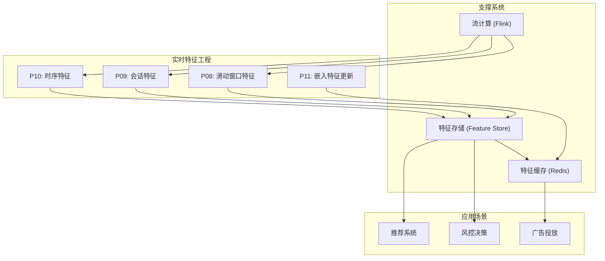
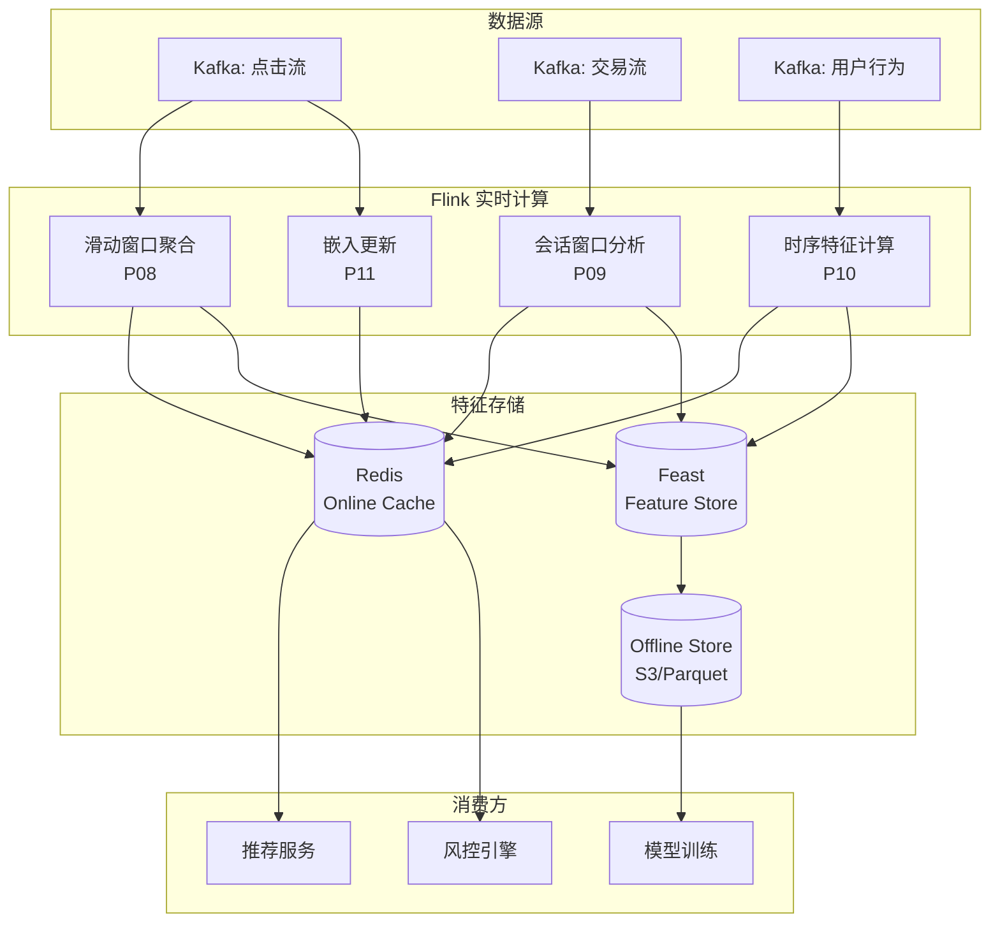
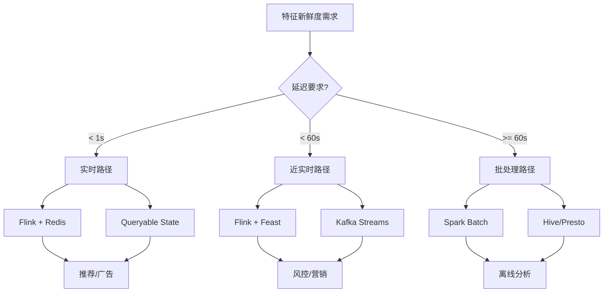
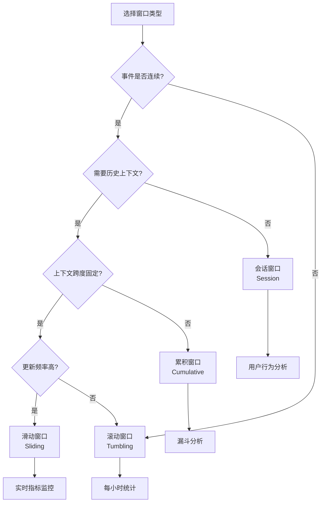

# 设计模式：实时特征工程 (Real-time Feature Engineering)

> 所属阶段: Knowledge/02-design-patterns | 前置依赖: [01-foundations/knowledge-streaming-semantics.md](../01-concept-atlas/streaming-models-mindmap.md) | 形式化等级: L4

---

## 1. 概念定义 (Definitions)

### Def-K-02-10: 特征新鲜度 (Feature Freshness)

**定义**: 特征新鲜度 $\mathcal{F}$ 定义为特征值计算时刻与当前时刻的最大允许时间偏差：

$$\mathcal{F}(f, t) = t - \tau_{\text{computed}}(f)$$

其中 $f$ 为特征值，$\tau_{\text{computed}}(f)$ 为该特征最后计算时间戳。

**新鲜度等级**:

| 等级 | 延迟要求 | 适用场景 |
|------|----------|----------|
| 实时 (Real-time) | $\mathcal{F} < 1\text{s}$ | 高频交易、实时推荐 |
| 近实时 (Near-real-time) | $1\text{s} \leq \mathcal{F} < 60\text{s}$ | 内容推荐、广告投放 |
| 准实时 (Quasi-real-time) | $60\text{s} \leq \mathcal{F} < 5\text{min}$ | 风控决策、用户画像 |
| 批处理 (Batch) | $\mathcal{F} \geq 5\text{min}$ | 离线分析、报表生成 |

### Def-K-02-11: 窗口特征聚合 (Windowed Feature Aggregation)

**定义**: 窗口特征聚合是在有界时间窗口 $\mathcal{W}$ 上对事件流 $\mathcal{S}$ 进行聚合运算的变换：

$$\text{Agg}(\mathcal{S}, \mathcal{W}, \oplus) = \{ \oplus \{ e \mid e \in \mathcal{S} \land \tau(e) \in \mathcal{W}_i \} \}_{i \in \mathcal{I}}$$

其中：

- $\mathcal{W} = \{ \mathcal{W}_i \}_{i \in \mathcal{I}}$ 为窗口序列
- $\oplus$ 为聚合运算符（sum, avg, count, max, min, etc.）
- $\tau(e)$ 为事件 $e$ 的时间戳

**窗口类型语义**:

- **滚动窗口 (Tumbling)**: $\mathcal{W}_i = [i \cdot L, (i+1) \cdot L)$，窗口无重叠
- **滑动窗口 (Sliding)**: $\mathcal{W}_i = [i \cdot S, i \cdot S + L)$，窗口重叠度 $\rho = 1 - S/L$
- **会话窗口 (Session)**: $\mathcal{W}_i$ 由不活动间隙 $g$ 动态分割

### Def-K-02-12: 特征存储 (Feature Store)

**定义**: 特征存储是一个支持双模式访问的特征管理子系统 $\mathcal{FS}$：

$$\mathcal{FS} = \langle \mathcal{O}, \mathcal{R}, \mathcal{M}, \mathcal{G} \rangle$$

其中：

- $\mathcal{O}$: 离线存储（列式存储，如 HDFS/S3 + Parquet）
- $\mathcal{R}$: 在线存储（低延迟 KV，如 Redis/Cassandra）
- $\mathcal{M}$: 元数据管理（特征定义、血缘、版本）
- $\mathcal{G}$: 治理层（访问控制、监控、SLA）

**一致性约束**: 在线特征 $f_{\text{online}}$ 与离线特征 $f_{\text{offline}}$ 须满足：

$$\mathbb{E}[f_{\text{online}}] = \mathbb{E}[f_{\text{offline}}] \quad \land \quad |f_{\text{online}} - f_{\text{offline}}| < \epsilon$$

---

## 2. 属性推导 (Properties)

### Lemma-K-02-04: 窗口边界事件处理的一致性

**命题**: 对于水印延迟为 $\delta$ 的流处理系统，窗口聚合结果最终一致性条件为：

$$\forall e: \tau(e) \in \mathcal{W}_i \implies e \text{ 被计入 } \mathcal{W}_i \lor \tau_{\text{proc}}(e) > T_{\text{watermark}}(\mathcal{W}_i) + \delta$$

**工程含义**: 延迟事件要么被正确处理，要么被明确丢弃/旁路，确保结果可重现。

### Lemma-K-02-05: 滑动窗口特征计算效率

**命题**: 对于窗口长度 $L$、滑动步长 $S$ 的滑动窗口，特征复用率 $\eta$ 为：

$$\eta = 1 - \frac{S}{L} = \rho \quad (S \leq L)$$

**推论**: 当 $\rho \geq 0.5$ 时，增量计算可降低 50%+ 的算力消耗。

### Lemma-K-02-06: 特征在线/离线一致性保证

**命题**: 使用相同计算逻辑（Compute Logic）和统一时间语义（Processing Time vs Event Time）时，特征偏差上界为：

$$\Delta = |\text{RT}(f) - \text{Batch}(f)| \leq \sum_{i} \omega_i \cdot \delta_i$$

其中 $\omega_i$ 为各数据源延迟权重，$\delta_i$ 为对应延迟。

---

## 3. 关系建立 (Relations)

### 3.1 特征工程与流计算模型的映射

| 特征工程概念 | 流计算对应物 | 关系类型 |
|-------------|-------------|----------|
| 特征新鲜度 | Watermark 延迟 | 等价约束 |
| 窗口聚合 | Window Operator | 直接映射 |
| 特征回填 | Backfill Job | 批流统一 |
| 特征服务 | Queryable State | 运行时暴露 |

### 3.2 设计模式关联图



---

## 4. 论证过程 (Argumentation)

### 4.1 P08: 滑动窗口特征 (Sliding Window Features)

**问题**: 如何在持续变化的流中计算"最近5分钟内的点击次数"这类特征？

**方案**: 滑动窗口聚合

**计算语义**:

- 窗口长度 $L = 5\text{min}$
- 滑动步长 $S = 10\text{s}$
- 特征值 $f_i = \text{count}(\{ e \mid \tau(e) \in [t_i - L, t_i] \})$

**增量优化策略**:

1. 维护环形缓冲区存储窗口内事件计数
2. 每 $S$ 秒输出一次结果，复用 $L-S$ 的重叠区域计算
3. 使用 Flink 的 `Evictor` 处理延迟数据

**反例分析**: 若采用非增量计算（每个窗口独立扫描全量数据），当 $L=1\text{h}, S=1\text{s}$ 时，计算复杂度为 $O(3600 \times \text{throughput})$，不可扩展。

### 4.2 P09: 会话特征 (Session Features)

**问题**: 如何捕获用户"一次访问"内的行为模式？

**方案**: 动态会话窗口

**会话定义**: 会话 $\mathcal{S}$ 是事件序列，满足：

- $\forall i: \tau(e_{i+1}) - \tau(e_i) \leq g$（间隙阈值，如 30min）
- 同一用户/设备的事件序列

**关键特征**:

- 会话时长: $|\mathcal{S}| = \max_i \tau(e_i) - \min_i \tau(e_i)$
- 会话深度: 页面浏览数 / 事件数
- 转化率: 目标事件数 / 总会话数

**边界处理**:

- 会话超时后延: 允许短暂等待延迟事件，窗口实际关闭时间 = 最后事件时间 + $g$
- 迟到事件: 超过最大延迟阈值后到达的事件启动新会话

### 4.3 P10: 时序特征 (Lagged Features)

**问题**: 如何捕获时间序列的依赖关系？

**方案**: 延迟特征与差分特征

**特征类型**:

1. **滞后特征 (Lagged)**: $f_t^{(k)} = f_{t-k}$，如"1小时前的库存量"
2. **差分特征 (Diff)**: $\Delta f_t^{(k)} = f_t - f_{t-k}$，如"1小时内价格变化"
3. **增长率**: $r_t^{(k)} = \frac{f_t - f_{t-k}}{f_{t-k}}$

**实现挑战**: 需要维护状态历史，Flink 中通过 `KeyProcessFunction` 或 `ConnectedStreams` 实现自连接。

### 4.4 P11: 嵌入特征实时更新 (Embedding Real-time Update)

**问题**: 如何将实时交互反馈融入预训练嵌入向量？

**方案**: 在线学习 + 近似最近邻 (ANN) 更新

**架构要点**:

1. **增量训练**: 用户实时行为触发小批量梯度更新
2. **热更新**: 新嵌入向量写入 Redis / Vector DB
3. **一致性**: 使用版本号区分不同迭代周期的嵌入

**权衡分析**:

- 更新频率 vs 计算成本：实时更新（每条事件）成本过高，通常采用微批（如 1min 窗口）
- 模型稳定性 vs 响应速度：引入滑动平均平滑更新：$\theta_{new} = \alpha \cdot \theta_{update} + (1-\alpha) \cdot \theta_{old}$

---

## 5. 形式证明 / 工程论证 (Proof / Engineering Argument)

### 5.1 Flink + Redis 特征缓存架构

**架构决策**: 为什么采用 Redis 作为在线特征缓存？

| 维度 | Redis | 备选 (Cassandra) | 决策 |
|------|-------|-----------------|------|
| 读延迟 | < 1ms (P99) | ~10ms | 实时推理要求低延迟 |
| 数据结构 | 丰富 (Hash, ZSet) | 有限 | 复杂特征存储需求 |
| 写入吞吐 | 100K+ ops/s | 更高 | 满足需求 |
| 运维复杂度 | 中等 | 较高 | 团队熟悉度 |

**热键问题处理**:

- 对超高频特征（如全局统计）采用本地缓存 + Redis 双级缓存
- 使用 Redis Cluster 分片，避免单节点热点

### 5.2 Flink + Feast 特征存储集成

**Feast 架构角色**:

```
┌─────────────────────────────────────────────────────────────┐
│                        Feast SDK                             │
├──────────────┬────────────────────┬─────────────────────────┤
│   Offline    │    Registry        │       Online            │
│   Store      │   (特征定义/元数据)  │       Store             │
│ (BigQuery/   ├────────────────────┤   (Redis/DynamoDB/      │
│  Snowflake)  │  特征血缘/版本控制   │    Bigtable)            │
└──────────────┴────────────────────┴─────────────────────────┘
         ▲                   ▲                    ▲
         │                   │                    │
    训练数据生成          特征发现              在线服务
```

**集成模式**:

1. **Push 模式**: Flink 作业将实时计算的特征写入 Feast Online Store
2. **Pull 模式**: 模型服务通过 Feast SDK 获取在线特征（Point-in-time correct）
3. **统一定义**: 特征在 Feast 中定义一次，自动生成 Flink SQL 和训练数据集

### 5.3 实时与离线特征一致性保证

**一致性威胁来源**:

1. **计算引擎差异**: Flink UDF vs Spark UDF 实现不一致
2. **数据源头差异**: Kafka vs 离线日志的延迟/丢失
3. **时间语义差异**: Event Time vs Processing Time 处理不一致

**工程对策**:

| 威胁 | 对策 |
|------|------|
| UDF 不一致 | 共享特征计算库（Python/Java 桥接或统一 DSL） |
| 数据差异 | 统一日志采集（Kafka 作为 Single Source of Truth） |
| 时间处理 | 统一使用 Event Time，明确 Watermark 策略 |
| 验证 | 建立特征监控 Dashboard，实时对比在线/离线特征分布 |

---

## 6. 实例验证 (Examples)

### 6.1 案例：推荐系统实时特征

**场景**: 电商实时个性化推荐

**特征设计**:

| 特征名 | 类型 | 计算方式 | 新鲜度 |
|--------|------|----------|--------|
| user_click_5m | 滑动窗口 | 最近5分钟点击商品数 | < 10s |
| user_category_pref | 会话特征 | 当前会话偏好类目 | < 30s |
| item_ctr_1h | 时序特征 | 商品1小时点击率 | < 1min |
| user_embedding | 嵌入特征 | 实时行为更新向量 | < 5min |

**Flink 实现片段**:

```sql
-- 滑动窗口特征:用户最近5分钟点击数
CREATE TABLE user_clicks (
    user_id STRING,
    item_id STRING,
    click_time TIMESTAMP(3),
    WATERMARK FOR click_time AS click_time - INTERVAL '5' SECOND
) WITH (
    'connector' = 'kafka',
    'topic' = 'click_events',
    ...
);

CREATE TABLE user_features (
    user_id STRING,
    click_count_5m BIGINT,
    window_start TIMESTAMP(3),
    PRIMARY KEY (user_id) NOT ENFORCED
) WITH (
    'connector' = 'redis',
    'command' = 'SET'
);

INSERT INTO user_features
SELECT
    user_id,
    COUNT(*) as click_count_5m,
    TUMBLE_START(click_time, INTERVAL '10' SECOND) as window_start
FROM user_clicks
GROUP BY
    user_id,
    HOP(click_time, INTERVAL '10' SECOND, INTERVAL '5' MINUTE);
```

### 6.2 案例：风控特征工程

**场景**: 金融交易实时风控决策

**特征设计**:

| 特征名 | 类型 | 计算方式 | 用途 |
|--------|------|----------|------|
| tx_amount_1h_sum | 滑动窗口 | 1小时内交易金额总和 | 异常检测 |
| device_risk_score | 会话特征 | 设备风险评级 | 设备指纹 |
| velocity_5m | 时序特征 | 5分钟交易频次 | 盗刷检测 |
| merchant_embedding | 嵌入特征 | 商户风险嵌入 | 关联分析 |

**会话窗口实现**:

```java
// Flink DataStream API:会话窗口统计用户行为
DataStream<Transaction> transactions = ...

DataStream<UserSessionFeature> sessionFeatures = transactions
    .keyBy(Transaction::getUserId)
    .window(EventTimeSessionWindows.withGap(Time.minutes(30)))
    .aggregate(new SessionAggregator())
    .addSink(new RedisSink<>());

// SessionAggregator 实现

import org.apache.flink.streaming.api.datastream.DataStream;
import org.apache.flink.api.common.functions.AggregateFunction;
import org.apache.flink.streaming.api.windowing.time.Time;

public class SessionAggregator implements
    AggregateFunction<Transaction, SessionAcc, UserSessionFeature> {

    @Override
    public SessionAcc createAccumulator() {
        return new SessionAcc();
    }

    @Override
    public SessionAcc add(Transaction tx, SessionAcc acc) {
        acc.addTransaction(tx);
        return acc;
    }

    @Override
    public UserSessionFeature getResult(SessionAcc acc) {
        return new UserSessionFeature(
            acc.getUserId(),
            acc.getTotalAmount(),
            acc.getTransactionCount(),
            acc.getUniqueMerchants(),
            acc.calculateRiskScore()
        );
    }
}
```

---

## 7. 可视化 (Visualizations)

### 7.1 实时特征工程架构全景图



### 7.2 特征新鲜度与系统组件关系



### 7.3 窗口类型决策树



---

## 8. 引用参考 (References)


---

*文档版本: v1.0 | 创建日期: 2026-04-02 | 形式化等级: L4*

---

*文档版本: v1.0 | 创建日期: 2026-04-20*
