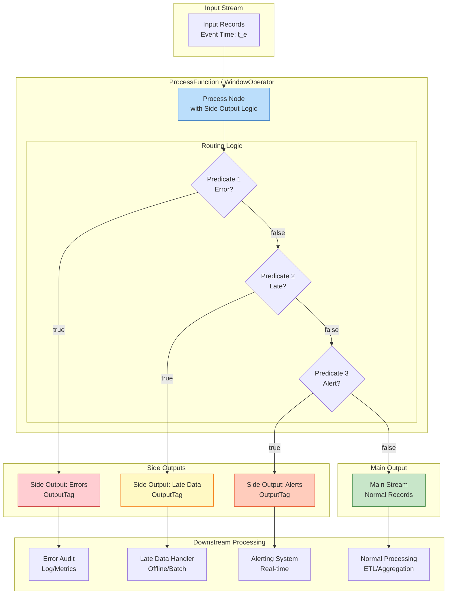
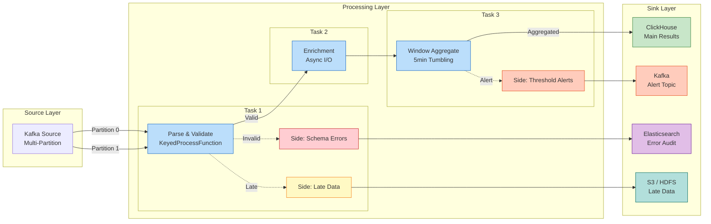

# 设计模式: 侧输出 (Pattern: Side Output)

> **模式编号**: 06/7 | **所属系列**: Knowledge/02-design-patterns | **形式化等级**: L4 | **复杂度**: ★★☆☆☆
>
> 本模式解决流处理中的**多路输出**、**异常数据分流**与**迟到数据处理**需求，通过显式的 OutputTag 机制实现主数据流与侧数据流的分离。

---

## 目录

- [设计模式: 侧输出 (Pattern: Side Output)](#设计模式-侧输出-pattern-side-output)
  - [目录](#目录)
  - [1. 概念定义 (Definitions)](#1-概念定义-definitions)
    - [Def-K-02-06 (侧输出流)](#def-k-02-06-侧输出流)
    - [Def-K-02-07 (OutputTag 标签)](#def-k-02-07-outputtag-标签)
    - [Def-K-02-08 (侧输出匹配谓词)](#def-k-02-08-侧输出匹配谓词)
    - [Def-K-02-09 (多路输出拓扑)](#def-k-02-09-多路输出拓扑)
  - [2. 属性推导 (Properties)](#2-属性推导-properties)
    - [Lemma-K-02-04 (侧输出 Watermark 继承性)](#lemma-k-02-04-侧输出-watermark-继承性)
    - [Lemma-K-02-05 (侧输出与主流的时序一致性)](#lemma-k-02-05-侧输出与主流的时序一致性)
    - [Lemma-K-02-06 (侧输出流的并发安全性)](#lemma-k-02-06-侧输出流的并发安全性)
  - [3. 关系建立 (Relations)](#3-关系建立-relations)
    - [关系 1: 侧输出与 AM 语义的关联](#关系-1-侧输出与-am-语义的关联)
    - [关系 2: 侧输出与迟到数据处理](#关系-2-侧输出与迟到数据处理)
    - [关系 3: 侧输出与异常数据分流](#关系-3-侧输出与异常数据分流)
  - [4. 论证过程 (Argumentation)](#4-论证过程-argumentation)
    - [引理 4.1 (侧输出不会阻塞主流)](#引理-41-侧输出不会阻塞主流)
    - [引理 4.2 (侧输出标签的类型安全性)](#引理-42-侧输出标签的类型安全性)
    - [反例 4.1 (错误使用 Filter 替代侧输出)](#反例-41-错误使用-filter-替代侧输出)
  - [5. 形式证明 / 工程论证](#5-形式证明--工程论证)
    - [Prop-K-02-03 (侧输出模式的多路分发正确性)](#prop-k-02-03-侧输出模式的多路分发正确性)
    - [工程论证: 侧输出与 Checkpoint 的协同](#工程论证-侧输出与-checkpoint-的协同)
  - [6. 实例验证 (Examples)](#6-实例验证-examples)
    - [示例 6.1: ProcessFunction 侧输出基础用法](#示例-61-processfunction-侧输出基础用法)
    - [示例 6.2: 窗口迟到数据侧输出](#示例-62-窗口迟到数据侧输出)
    - [示例 6.3: 异常数据分流与监控告警](#示例-63-异常数据分流与监控告警)
    - [示例 6.4: 数据质量报告生成](#示例-64-数据质量报告生成)
  - [7. 可视化 (Visualizations)](#7-可视化-visualizations)
    - [侧输出模式架构图](#侧输出模式架构图)
    - [多路输出数据流图](#多路输出数据流图)
  - [8. 引用参考 (References)](#8-引用参考-references)

---

## 1. 概念定义 (Definitions)

### Def-K-02-06 (侧输出流)

设 $ ext{Stream}(T)$ 为类型 $T$ 的数据流，**侧输出流**（Side Output Stream）是主数据流之外的一条或多条辅助输出通道，形式化定义为带标签的输出流集合：

$$
\text{SideOutput} = \{ (tag_i, \text{Stream}(T_i)) \mid tag_i \in \text{OutputTag}, \; T_i \in \text{Types} \}_{i=1}^{n}
$$

其中 $n \geq 1$ 为侧输出通道数量，$tag_i$ 为各通道的唯一标识符。

**侧输出算子** 定义为从输入流到多路输出的映射：

$$
\text{SideOutputOp}: \text{Stream}(T_{in}) \times \text{Predicate} \to \text{Stream}(T_{main}) \times \prod_{i=1}^{n} \text{Stream}(T_i)
$$

**直观解释**：侧输出流允许单个算子根据业务规则将输入数据分发到多个下游通道，而无需复制整个算子链。与 `filter().map()` 模式不同，侧输出在同一算子内部完成分流，保持了处理的局部性和一致性。

---

### Def-K-02-07 (OutputTag 标签)

**OutputTag** 是侧输出流的类型安全标识符，定义为携带类型参数的标签：

$$
\text{OutputTag}\langle T \rangle = (id: \text{String}, \text{type}: \text{Class}\langle T \rangle)
$$

其中：

- $id$ 为标签的唯一字符串标识
- $\text{type}$ 为输出数据的运行时类型信息，用于类型检查

**标签匹配规则**：对于输入记录 $r$ 和侧输出标签集合 $\mathcal{T} = \{tag_1, \dots, tag_n\}$，定义匹配函数：

$$
\text{match}(r, \mathcal{T}) = \begin{cases}
tag_i & \text{if } P_i(r) = \text{true} \land (\forall j < i. \; P_j(r) = \text{false}) \\
\bot & \text{if } \forall tag \in \mathcal{T}. \; P_{tag}(r) = \text{false}
\end{cases}
$$

其中 $P_i$ 为与 $tag_i$ 关联的匹配谓词，$\bot$ 表示不匹配任何侧输出（进入主输出）。

**直观解释**：OutputTag 通过泛型参数在编译期保证侧输出流的类型安全，避免运行时类型转换错误。标签的唯一标识符 $id$ 在运行时用于将记录路由到正确的下游通道。

---

### Def-K-02-08 (侧输出匹配谓词)

**匹配谓词** 是决定记录是否进入特定侧输出流的布尔函数：

$$
P: \text{Record} \times \text{Context} \to \{ \text{true}, \text{false} \}
$$

其中 $\text{Context}$ 包含处理上下文信息，如当前 watermark、处理时间、状态句柄等。

**常见谓词类型** [^2][^3]：

| 谓词类型 | 定义 | 适用场景 |
|---------|------|---------|
| **异常检测** | $P_{err}(r) = r.\text{isException} \lor r.\text{errorCode} \neq 0$ | 错误数据分离 |
| **迟到判定** | $P_{late}(r, w) = r.t_e \leq w - L$ | 迟到数据捕获 |
| **阈值过滤** | $P_{thresh}(r) = r.\text{value} > \theta$ | 异常值告警 |
| **正则匹配** | $P_{regex}(r) = r.\text{payload}.\text{matches}(pattern)$ | 格式验证失败 |
| **业务分流** | $P_{biz}(r) = r.\text{category} \in \{A, B\}$ | 多路业务分发 |

**直观解释**：匹配谓词是侧输出模式的核心决策逻辑，它决定了数据的生命周期走向。谓词可以是纯函数（基于记录本身），也可以是有状态的（结合窗口状态或历史统计）。

---

### Def-K-02-09 (多路输出拓扑)

**多路输出拓扑** 描述了带有侧输出的流处理 DAG 结构。设算子 $v$ 带有 $n$ 个侧输出，其输出拓扑定义为：

$$
\text{OutTopology}(v) = (v_{main}, \{ v_{side}^{(i)} \}_{i=1}^{n})
$$

其中：

- $v_{main}$ 为主输出通道，接收不匹配任何侧输出谓词的记录
- $v_{side}^{(i)}$ 为第 $i$ 个侧输出通道，由 $\text{OutputTag}_i$ 标识

**拓扑约束**：

$$
\forall r \in \text{Input}(v). \; r \in \text{Output}(v_{main}) \; \underline{\lor} \; \left( \bigvee_{i=1}^{n} r \in \text{Output}(v_{side}^{(i)}) \right)
$$

其中 $\underline{\lor}$ 表示排他或（exactly one），保证每条记录**有且仅有**一个输出目的地。

**直观解释**：多路输出拓扑确保数据分流是完备且互斥的——每条记录要么进入主输出，要么进入且仅进入一个侧输出通道。这一约束保证了数据不丢失、不重复分流。

---

## 2. 属性推导 (Properties)

### Lemma-K-02-04 (侧输出 Watermark 继承性)

**陈述**：在事件时间语义下，所有侧输出流继承其上游算子的输入 Watermark。

**形式化**：设算子 $v$ 的输入 Watermark 为 $w_{in}(t)$，其主输出和侧输出的 Watermark 分别为：

$$
w_{main}(t) = w_{in}(t - d_v) \quad \text{and} \quad w_{side}^{(i)}(t) = w_{in}(t - d_v)
$$

其中 $d_v$ 为算子 $v$ 的处理延迟。

**证明**：

侧输出机制在算子内部完成数据路由，不引入额外的网络传输或缓冲。根据 Watermark 传播规则（参见 pattern-event-time-processing.md），单输入算子的输出 Watermark 等于输入 Watermark 减去处理延迟。由于主输出和所有侧输出均来自同一算子实例，它们共享相同的处理延迟 $d_v$，因此 Watermark 保持一致。∎

> **工程意义**：侧输出流与主流具有相同的事件时间进度，这使得下游可以基于相同的时间基准进行窗口聚合。例如，迟到数据侧输出流可以再次进入窗口算子进行补偿计算。

---

### Lemma-K-02-05 (侧输出与主流的时序一致性)

**陈述**：对于同一输入记录 $r$，其进入主输出或侧输出的时序，与它在输入流中的顺序一致。

**形式化**：设记录在输入流中的顺序为 $<_{in}$，在输出流中的顺序为 $<_{out}$，则对于任意两条记录 $r_1, r_2$：

$$
r_1 <_{in} r_2 \implies (f(r_1) <_{out} f(r_2)) \lor (\text{side}(r_1) \land \text{side}(r_2) \land r_1 <_{side} r_2)
$$

其中 $f(r)$ 表示记录 $r$ 的输出通道，$\text{side}(r)$ 表示 $r$ 进入侧输出。

**证明**：

侧输出决策在算子处理记录的同步路径上完成。算子按 FIFO 顺序处理输入记录，每条记录在处理时立即决定其输出目的地。因此，记录间的相对顺序在处理过程中保持不变。∎

> **工程意义**：时序一致性保证了即使数据被分流到不同的输出通道，各通道内的数据顺序仍然保持。这对于需要保序处理的场景（如 CDC 数据同步）至关重要。

---

### Lemma-K-02-06 (侧输出流的并发安全性)

**陈述**：在多并行度场景下，同一侧输出标签的所有并行实例共同构成一个逻辑侧输出流，各并行实例间的数据互不干扰。

**形式化**：设算子 $v$ 的并行度为 $p$，第 $j$ 个并行实例为 $v^{(j)}$。对于侧输出标签 $tag$，其逻辑流为：

$$
\text{SideOutput}(tag) = \bigsqcup_{j=1}^{p} \text{SideOutput}^{(j)}(tag)
$$

其中 $\sqcup$ 表示不交并（disjoint union）。各并行实例的数据分区遵循输入流的分区策略。

**证明**：

Flink 的侧输出机制在每个 Task 实例上独立执行。由于流处理的数据分区模型（Data Parallelism），不同并行实例处理不同的键分区或轮询分区，因此它们的侧输出数据天然不重叠。下游算子通过相同的键分区或轮询消费策略可以重建完整的逻辑流。∎

> **工程意义**：侧输出具有良好的水平扩展性，不会因为启用侧输出而引入额外的全局瓶颈。

---

## 3. 关系建立 (Relations)

### 关系 1: 侧输出与 AM 语义的关联

侧输出模式与 Struct/02-properties/02.02-consistency-hierarchy.md 中定义的 **Def-S-08-02 (At-Most-Once 语义)** 存在关联：

**论证**：

在侧输出模式中，记录的路由决策是**原子性**的——每条记录在处理时刻被决定进入且仅进入一个输出通道。这一特性与 At-Most-Once 语义的"因果影响计数"上界约束形成对应：

$$
\forall r \in I. \; |\{ o \in \text{SideOutputs} \mid \text{caused_by}(o, r) \}| \leq 1
$$

即：每条输入记录对侧输出流的因果影响最多只有一次（实际上恰好一次，参见 Def-K-02-09 的排他或约束）。

> **工程对应**：在 Flink 中，侧输出路由发生在算子的 `processElement` 方法内部，与主输出 `out.collect()` 是互斥路径。这一设计确保了即使在故障恢复后，记录也不会被重复路由到多个输出通道。

---

### 关系 2: 侧输出与迟到数据处理

侧输出模式是迟到数据处理的**终极防线**，与事件时间窗口的 Allowed Lateness 机制形成层次化防御 [^2][^3]：

```
┌─────────────────────────────────────────────────────────────────────┐
│                    迟到数据处理层次                                  │
├─────────────────────────────────────────────────────────────────────┤
│                                                                     │
│  Level 1: Watermark 边界内                                           │
│  ─────────────────────────                                          │
│  条件: t_e(r) > current_watermark                                   │
│  行为: 正常纳入窗口计算                                              │
│                                                                     │
│  Level 2: Allowed Lateness                                          │
│  ─────────────────────────                                          │
│  条件: window_end ≤ t_e(r) ≤ window_end + L                         │
│  行为: 触发窗口更新，输出修正结果                                      │
│  配置: .allowedLateness(Time.minutes(10))                           │
│                                                                     │
│  Level 3: Side Output (完全迟到)                                     │
│  ─────────────────────────────                                      │
│  条件: t_e(r) < current_watermark - L (侧输出捕获)                   │
│  行为: 路由到迟到数据侧输出流，用于审计/离线补录                        │
│  配置: .sideOutputLateData(lateDataOutputTag)                       │
│                                                                     │
└─────────────────────────────────────────────────────────────────────┘
```

**形式化关系**：设迟到数据侧输出流为 $S_{late}$，则：

$$
S_{late} = \{ r \in I \mid \exists w. \; r.t_e \leq w - L \land \text{window}(r).\text{alreadyTriggered}(w) \}
$$

> **工程对应**：`sideOutputLateData()` 是 Flink Window API 的内置功能，当启用后，所有超出 Allowed Lateness 的记录自动进入指定的侧输出流，而非被静默丢弃。

---

### 关系 3: 侧输出与异常数据分流

侧输出模式是实现**数据质量治理**的关键机制，与异常检测系统形成闭环 [^4]：

```
┌─────────────────────────────────────────────────────────────────────┐
│                    数据质量治理闭环                                  │
├─────────────────────────────────────────────────────────────────────┤
│                                                                     │
│  ┌──────────────┐     正常数据      ┌──────────────┐               │
│  │              │ ─────────────────►│              │               │
│  │   Source     │                   │   Process    │               │
│  │              │ ────┬────────────►│   (Main)     │               │
│  └──────────────┘     │             └──────────────┘               │
│                       │                                            │
│                       │ 异常数据                                    │
│                       ▼                                            │
│              ┌──────────────┐                                      │
│              │   Side       │     ┌──────────────┐                │
│              │   Output     │────►│   Alerting   │                │
│              │   (Error)    │     │   / Audit    │                │
│              └──────────────┘     └──────────────┘                │
│                                                                     │
└─────────────────────────────────────────────────────────────────────┘
```

**形式化关系**：设异常检测谓词为 $P_{err}$，异常数据侧输出流为 $S_{err}$，则：

$$
S_{err} = \{ r \in I \mid P_{err}(r) = \text{true} \}
$$

异常数据可以进一步分流为多个子类别：

$$
S_{err} = S_{schema} \sqcup S_{business} \sqcup S_{threshold}
$$

分别对应：格式异常、业务规则异常、阈值超限异常。

---

## 4. 论证过程 (Argumentation)

### 引理 4.1 (侧输出不会阻塞主流)

**陈述**：侧输出数据的处理不会阻塞主输出流的正常处理进度。

**证明**：

在 Flink 的 ProcessFunction 中，侧输出通过 `ctx.output(tag, value)` 方法发送数据。该方法将记录直接写入对应的侧输出缓冲区，不经过网络发送（在同一 Task 内），且不会等待下游消费确认。因此：

1. **时间复杂度**：侧输出操作是 $O(1)$ 的缓冲区写入
2. **无阻塞**：不等待下游反压，缓冲满了才触发反压
3. **独立 Watermark**：侧输出 Watermark 的推进不影响主流 Watermark

因此，主流的处理延迟 $d_{main}$ 与侧输出数据量无关。∎

> **工程意义**：侧输出适合用于高频异常数据的捕获，无需担心异常数据路径的性能影响主业务流的实时性。

---

### 引理 4.2 (侧输出标签的类型安全性)

**陈述**：Flink 的 OutputTag 通过泛型参数保证编译期类型安全。

**证明**：

OutputTag 的定义为 `OutputTag<T>(String id)`，其中 `T` 是类型参数。当通过 `ctx.output(tag, value)` 发送数据时，编译器检查 `value` 的类型是否为 `T` 的子类型。若类型不匹配，编译失败而非运行时异常。

```scala
// 编译期类型检查
val intTag = OutputTag[Int]("int-output")
val stringTag = OutputTag[String]("string-output")

// 正确：类型匹配
ctx.output(intTag, 42)

// 编译错误：类型不匹配 (String 不是 Int)
ctx.output(intTag, "hello")
```

这一设计消除了运行时的 `ClassCastException` 风险。∎

> **工程意义**：类型安全保证了复杂多路输出场景下的代码可靠性，特别是在团队协作和代码重构时。

---

### 反例 4.1 (错误使用 Filter 替代侧输出)

**场景**：开发者使用 `filter().map()` 链式调用替代侧输出，试图实现数据分流。

```scala
// 错误做法：复制算子链
val mainStream = input
  .filter(_.isValid)
  .map(processValid)

val errorStream = input
  .filter(!_.isValid)
  .map(logError)
```

**分析**：

1. **状态重复**：若上游算子是有状态的（如 KeyedProcessFunction），`filter()` 操作会导致状态被复制到两个独立的算子链，内存占用翻倍
2. **处理不一致**：两个分支独立处理，若 `processValid` 和 `logError` 需要共享状态，无法保证一致性
3. **Watermark 分叉**：两个分支独立传播 Watermark，可能导致时序逻辑错误

**结论**：侧输出模式在单算子内完成分流，保持了状态共享和 Watermark 一致性，是 `filter()` 链的上位替代。∎

---

## 5. 形式证明 / 工程论证

### Prop-K-02-03 (侧输出模式的多路分发正确性)

**陈述**：设侧输出算子 $v$ 带有 $n$ 个侧输出标签 $\{tag_1, \dots, tag_n\}$，对于任意输入记录 $r$，侧输出模式保证：

$$
\exists! \; o \in \{o_{main}, o_{side}^{(1)}, \dots, o_{side}^{(n)}\}. \; r \in o
$$

其中 $\exists!$ 表示"存在且仅存在一个"。

**证明**：

**步骤 1: 完备性（至少一个输出）**

根据 Def-K-02-08 的匹配谓词定义，对于任意记录 $r$，匹配函数 $\text{match}(r, \mathcal{T})$ 要么返回某个 $tag_i$（当 $P_i(r) = \text{true}$），要么返回 $\bot$（当所有谓词为 false）。在后一种情况下，记录进入主输出。因此每条记录至少有一个输出目的地。

**步骤 2: 唯一性（至多一个输出）**

根据 Def-K-02-08 的匹配函数定义，当多个谓词同时满足时，选择第一个匹配的侧输出（按定义的顺序）。这保证了即使多个谓词为 true，记录也只进入一个侧输出通道。结合步骤 1，记录恰好进入一个输出通道。

**步骤 3: 结论**

由步骤 1 和步骤 2，侧输出模式满足完备且互斥的分发语义。∎

> **工程对应**：在 Flink 中，这一正确性由 `ProcessFunction` 的 `processElement` 方法保证——每条记录在处理函数中只能调用一次 `out.collect()`（主流）或 `ctx.output()`（侧输出），且执行路径由 `if-else` 链控制。

---

### 工程论证: 侧输出与 Checkpoint 的协同

**论证目标**：证明侧输出流的数据在 Checkpoint 机制下保持 Exactly-Once 语义。

**论证过程**：

1. **状态包含**：在 Flink 中，侧输出是算子的输出属性而非独立状态。Checkpoint 捕获的是算子的**输入偏移量**和**内部状态**（ValueState、ListState 等），不直接捕获输出缓冲区。

2. **一致性保证**：当从 Checkpoint 恢复时：
   - 算子状态恢复到快照时刻
   - Source 从快照偏移量开始重放数据
   - 每条记录重新经过 `processElement`，侧输出决策被重新执行

3. **Exactly-Once 保证**：由于算子处理是确定性的（纯函数或基于恢复后的状态），侧输出决策也是确定性的。因此，故障恢复后，每条记录会被路由到**相同的输出通道**，不会产生重复或错配。

**形式化**：设 Checkpoint $C_k$ 捕获的状态为 $\sigma_k$，对于记录 $r$：

$$
\text{route}(r, \sigma_k) = \text{route}(r, \text{recover}(C_k))
$$

其中 $\text{route}$ 为路由决策函数，$\text{recover}$ 为状态恢复函数。

> **工程约束**：侧输出下游的 Sink 也需要满足 Exactly-Once 要求（事务性或幂等），才能实现端到端的一致性保证（参见 Def-S-08-05）。

---

## 6. 实例验证 (Examples)

### 示例 6.1: ProcessFunction 侧输出基础用法

以下示例展示了如何在 `KeyedProcessFunction` 中使用侧输出实现异常数据分流 [^2][^3]：

```scala
import org.apache.flink.streaming.api.scala._
import org.apache.flink.util.Collector
import org.apache.flink.streaming.api.scala.function.KeyedProcessFunction
import org.apache.flink.api.common.state.{ValueState, ValueStateDescriptor}

// 定义数据模型
case class SensorReading(
  deviceId: String,
  temperature: Double,
  humidity: Double,
  timestamp: Long
)

// 定义侧输出标签（必须在类外定义，以支持类型擦除后的识别）
val highTempTag = OutputTag[SensorReading]("high-temperature")
val invalidDataTag = OutputTag[String]("invalid-data")

// 带侧输出的处理函数
class SensorMonitorFunction
  extends KeyedProcessFunction[String, SensorReading, SensorReading] {

  private var lastTempState: ValueState[Double] = _

  override def open(parameters: Configuration): Unit = {
    lastTempState = getRuntimeContext.getState(
      new ValueStateDescriptor[Double]("last-temp", classOf[Double])
    )
  }

  override def processElement(
    reading: SensorReading,
    ctx: KeyedProcessFunction[String, SensorReading, SensorReading]#Context,
    out: Collector[SensorReading]
  ): Unit = {

    // 1. 数据验证：异常数据进入侧输出
    if (reading.temperature < -100 || reading.temperature > 200) {
      ctx.output(invalidDataTag,
        s"Invalid temperature: ${reading.temperature} from ${reading.deviceId}")
      return
    }

    // 2. 阈值检测：高温告警进入侧输出
    if (reading.temperature > 80.0) {
      ctx.output(highTempTag, reading)
    }

    // 3. 正常数据进入主流
    out.collect(reading)

    // 4. 更新状态
    lastTempState.update(reading.temperature)
  }
}

// 使用示例
val sensorStream: DataStream[SensorReading] = // ... 输入流

val mainStream = sensorStream
  .keyBy(_.deviceId)
  .process(new SensorMonitorFunction())

// 获取侧输出流
val highTempStream: DataStream[SensorReading] = mainStream.getSideOutput(highTempTag)
val invalidDataStream: DataStream[String] = mainStream.getSideOutput(invalidDataTag)

// 各自处理
mainStream.addSink(new NormalDataSink())
highTempStream.addSink(new AlertSink())      // 实时告警
invalidDataStream.addSink(new AuditSink())   // 审计日志
```

**关键要点**：

- 侧输出标签必须在**类外**定义为静态对象（或 Scala 的 `val`），以确保 Flink 运行时能正确识别
- 一条记录可以同时进入主流和侧输出（如示例中的高温数据既告警又正常处理）
- 侧输出可以有不同的数据类型（`SensorReading` vs `String`）

---

### 示例 6.2: 窗口迟到数据侧输出

以下示例展示了如何使用侧输出捕获窗口聚合中的迟到数据 [^2][^3]：

```scala
import org.apache.flink.streaming.api.scala._
import org.apache.flink.streaming.api.windowing.assigners.TumblingEventTimeWindows
import org.apache.flink.streaming.api.windowing.time.Time

// 定义侧输出标签（必须在类外）
val lateDataTag = OutputTag[SensorReading]("late-data")

// 输入流（带 Watermark）
val sensorStream = env
  .fromSource(kafkaSource,
    WatermarkStrategy
      .forBoundedOutOfOrderness[SensorReading](Duration.ofSeconds(10))
      .withTimestampAssigner((reading, _) => reading.timestamp),
    "Sensor Source"
  )

// 窗口聚合，带迟到数据侧输出
val windowedStream = sensorStream
  .keyBy(_.deviceId)
  .window(TumblingEventTimeWindows.of(Time.minutes(5)))
  .allowedLateness(Time.minutes(2))           // 允许 2 分钟延迟
  .sideOutputLateData(lateDataTag)            // 完全迟到数据进入侧输出
  .aggregate(new SensorAverageAggregate())

// 主流：窗口聚合结果
windowedStream.addSink(new AggregationSink())

// 侧输出：迟到数据处理
val lateDataStream: DataStream[SensorReading] = windowedStream.getSideOutput(lateDataTag)

// 迟到数据可以：
// 1. 写入审计日志
lateDataStream.addSink(new LateDataAuditSink())

// 2. 或再次进入窗口进行补偿计算（延迟处理）
lateDataStream
  .keyBy(_.deviceId)
  .window(TumblingEventTimeWindows.of(Time.hours(1)))  // 更大窗口聚合
  .aggregate(new LateDataCompensationAggregate())
  .addSink(new CompensationSink())
```

**迟到数据处理策略对比**：

| 策略 | 适用场景 | 延迟 | 复杂度 |
|------|---------|------|--------|
| 直接丢弃 | 可容忍丢失的监控指标 | 无 | ★☆☆☆☆ |
| 侧输出审计 | 合规要求、数据质量追踪 | 低 | ★★☆☆☆ |
| 离线补录 | 金融交易、计费系统 | 高 | ★★★☆☆ |
| 动态窗口 | 实时性要求高的场景 | 中 | ★★★★☆ |

---

### 示例 6.3: 异常数据分流与监控告警

以下示例展示了多路侧输出实现细粒度的异常数据分流和监控告警 [^4]：

```scala
// 定义多路侧输出标签
object SideOutputTags {
  val schemaErrorTag = OutputTag[String]("schema-error")      // 格式异常
  val businessErrorTag = OutputTag[String]("business-error")  // 业务异常
  val thresholdAlertTag = OutputTag[AlertEvent]("threshold-alert") // 阈值告警
  val retryQueueTag = OutputTag[Event]("retry-queue")         // 可重试异常
}

class EventProcessingFunction extends ProcessFunction[RawEvent, ProcessedEvent] {
  import SideOutputTags._

  override def processElement(
    event: RawEvent,
    ctx: ProcessFunction[RawEvent, ProcessedEvent]#Context,
    out: Collector[ProcessedEvent]
  ): Unit = {

    // 1. JSON 解析异常
    val parsed = parseJson(event.payload) match {
      case Success(data) => data
      case Failure(e) =>
        ctx.output(schemaErrorTag,
          s"Schema error: ${e.getMessage}, raw: ${event.payload.take(200)}")
        return
    }

    // 2. 业务规则验证
    if (!validateBusinessRules(parsed)) {
      ctx.output(businessErrorTag,
        s"Business validation failed: ${parsed.orderId}, reason: ${getValidationErrors}")
      return
    }

    // 3. 阈值检测与告警
    val riskScore = calculateRiskScore(parsed)
    if (riskScore > 90) {
      ctx.output(thresholdAlertTag,
        AlertEvent(
          alertType = "CRITICAL_RISK",
          orderId = parsed.orderId,
          riskScore = riskScore,
          timestamp = ctx.timestamp()
        ))
    } else if (riskScore > 70) {
      ctx.output(thresholdAlertTag,
        AlertEvent(
          alertType = "HIGH_RISK",
          orderId = parsed.orderId,
          riskScore = riskScore,
          timestamp = ctx.timestamp()
        ))
    }

    // 4. 外部服务调用（可能失败）
    callExternalService(parsed) match {
      case Success(result) =>
        out.collect(ProcessedEvent(parsed.orderId, result, "SUCCESS"))

      case Failure(e: RetryableException) =>
        // 可重试异常进入重试队列
        ctx.output(retryQueueTag, event.copy(retryCount = event.retryCount + 1))

      case Failure(e) =>
        // 不可重试异常进入业务异常流
        ctx.output(businessErrorTag,
          s"External service failed: ${e.getMessage}, order: ${parsed.orderId}")
    }
  }
}

// 使用示例
val processedStream = rawEventStream
  .process(new EventProcessingFunction())

// 处理各侧输出流
processedStream.getSideOutput(schemaErrorTag)
  .addSink(new SchemaErrorMetricsSink())     // Prometheus 指标上报

processedStream.getSideOutput(businessErrorTag)
  .addSink(new BusinessErrorLogSink())       // 错误日志存储

processedStream.getSideOutput(thresholdAlertTag)
  .addSink(new AlertNotificationSink())      // 钉钉/企业微信告警

processedStream.getSideOutput(retryQueueTag)
  .keyBy(_.orderId)
  .process(new RetryFunction(maxRetries = 3)) // 带指数退避的重试
  .addSink(new FinalResultSink())
```

---

### 示例 6.4: 数据质量报告生成

以下示例展示了如何使用侧输出流生成实时数据质量报告 [^4][^5]：

```scala
// 数据质量指标
case class DataQualityMetrics(
  windowStart: Long,
  windowEnd: Long,
  totalRecords: Long,
  validRecords: Long,
  schemaErrors: Long,
  businessErrors: Long,
  lateRecords: Long,
  nullRate: Double,
  uniquenessRate: Double
)

class QualityAwareProcessFunction
  extends KeyedProcessFunction[String, Event, CleanEvent] {

  val schemaErrorTag = OutputTag[QualityEvent]("quality-metrics")

  // 状态：窗口级质量统计
  private var qualityState: ValueState[QualityAccumulator] = _

  override def open(parameters: Configuration): Unit = {
    qualityState = getRuntimeContext.getState(
      new ValueStateDescriptor("quality-state", classOf[QualityAccumulator])
    )

    // 注册定时器：每分钟输出质量报告
    val timerService = getRuntimeContext.getProcessingTimeService
    val now = timerService.getCurrentProcessingTime
    val nextMinute = ((now / 60000) + 1) * 60000
    ctx.timerService().registerProcessingTimeTimer(nextMinute)
  }

  override def processElement(
    event: Event,
    ctx: KeyedProcessFunction[String, Event, CleanEvent]#Context,
    out: Collector[CleanEvent]
  ): Unit = {
    val acc = Option(qualityState.value()).getOrElse(QualityAccumulator())
    acc.totalRecords += 1

    // 质量检查
    val checks = Seq(
      ("NULL_CHECK", event.userId != null && event.amount != null),
      ("RANGE_CHECK", event.amount >= 0 && event.amount < 1000000),
      ("FORMAT_CHECK", event.email.matches("""[^@]+@[^@]+"""))
    )

    val failedChecks = checks.filter(!_._2)

    if (failedChecks.isEmpty) {
      acc.validRecords += 1
      out.collect(CleanEvent.from(event))
    } else {
      // 记录质量异常
      failedChecks.foreach { case (checkName, _) =>
        acc.errorCounts(checkName) += 1
      }

      // 发送详细质量事件到侧输出
      ctx.output(schemaErrorTag, QualityEvent(
        eventId = event.id,
        failedChecks = failedChecks.map(_._1),
        timestamp = ctx.timestamp()
      ))
    }

    qualityState.update(acc)
  }

  override def onTimer(
    timestamp: Long,
    ctx: KeyedProcessFunction[String, Event, CleanEvent]#OnTimerContext,
    out: Collector[CleanEvent]
  ): Unit = {
    val acc = Option(qualityState.value()).getOrElse(QualityAccumulator())

    // 计算并输出质量指标
    val metrics = DataQualityMetrics(
      windowStart = timestamp - 60000,
      windowEnd = timestamp,
      totalRecords = acc.totalRecords,
      validRecords = acc.validRecords,
      schemaErrors = acc.errorCounts.getOrElse("FORMAT_CHECK", 0),
      businessErrors = acc.errorCounts.getOrElse("RANGE_CHECK", 0),
      lateRecords = acc.lateRecords,
      nullRate = 1.0 - acc.validRecords.toDouble / acc.totalRecords,
      uniquenessRate = acc.uniqueRecords.toDouble / acc.totalRecords
    )

    // 输出质量报告到侧输出
    ctx.output(schemaErrorTag, QualityEvent(
      eventId = "METRICS_REPORT",
      metrics = Some(metrics),
      timestamp = timestamp
    ))

    // 重置状态
    qualityState.clear()

    // 注册下一个定时器
    ctx.timerService().registerProcessingTimeTimer(timestamp + 60000)
  }
}

// 质量报告可视化
val qualityStream = processedStream.getSideOutput(schemaErrorTag)
  .filter(_.eventId == "METRICS_REPORT")
  .map(_.metrics.get)

qualityStream.addSink(new GrafanaMetricsSink())  // 实时大盘
qualityStream.addSink(new QualityReportSink())   // 定期邮件报告
```

---

## 7. 可视化 (Visualizations)

### 侧输出模式架构图

下图展示了侧输出模式的核心组件和数据流向：



**图说明**：

- **蓝色节点**：处理节点，包含路由决策逻辑
- **绿色节点**：主流输出，接收通过所有谓词检查的记录
- **红色/橙色/深橙节点**：三类侧输出，分别对应异常、迟到和告警场景
- **路由逻辑**：按顺序匹配谓词，保证排他性分发

---

### 多路输出数据流图

下图展示了侧输出模式在完整流处理管道中的应用：



**图说明**：

- **蓝色节点**：核心处理算子，使用 KeyedProcessFunction 和 Window
- **红色/黄色/橙色虚线**：侧输出流，分别进入不同的存储系统
- **绿色节点**：主流结果进入 OLAP 数据库
- **各存储用途**：
  - ClickHouse：实时分析查询
  - Elasticsearch：错误日志检索
  - S3/HDFS：离线补录数据源
  - Kafka：实时告警链路

---

## 8. 引用参考 (References)


[^2]: Apache Flink Documentation, "Side Outputs", 2025. <https://nightlies.apache.org/flink/flink-docs-stable/docs/dev/datastream/side_output/>

[^3]: Apache Flink Documentation, "Allowed Lateness & Side Outputs in Windows", 2025. <https://nightlies.apache.org/flink/flink-docs-stable/docs/dev/datastream/operators/windows/#allowed-lateness>

[^4]: 数据质量治理实践，详见 [AcotorCSPWorkflow/domain-mappings/DM-Data-Quality.md](../../AcotorCSPWorkflow/domain-mappings/DM-Data-Quality.md)

[^5]: T. Akidau et al., "The Dataflow Model: A Practical Approach to Balancing Correctness, Latency, and Cost in Massive-Scale, Unbounded, Out-of-Order Data Processing," *PVLDB*, 8(12), 2015.


---

*文档版本: v1.0 | 更新日期: 2026-04-02 | 状态: 已完成*
