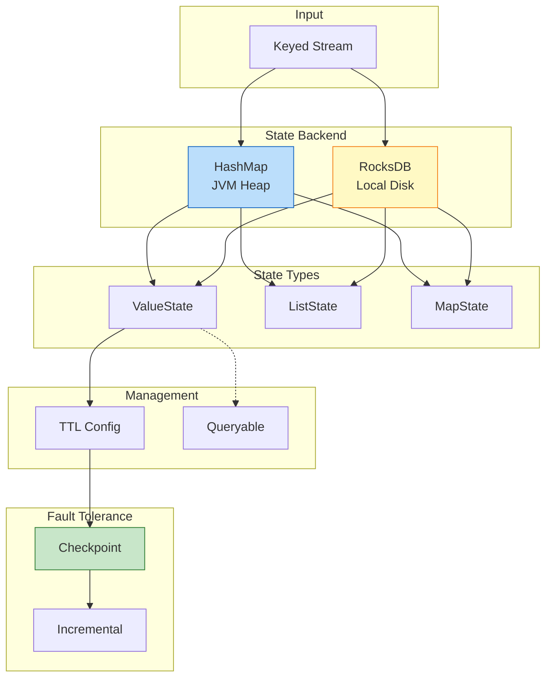

# 设计模式: 有状态计算 (Pattern: Stateful Computation)

> **模式编号**: 05/7 | **所属系列**: Knowledge/02-design-patterns | **形式化等级**: L4-L5
>
> 本模式解决分布式流处理中**状态一致性**、**容错恢复**与**大规模状态管理**之间的核心矛盾。

---

## 目录

- [设计模式: 有状态计算 (Pattern: Stateful Computation)](#设计模式-有状态计算-pattern-stateful-computation)
  - [目录](#目录)
  - [1. 问题与背景 (Problem)](#1-问题与背景-problem)
    - [1.1 分布式有状态计算的挑战](#11-分布式有状态计算的挑战)
    - [1.2 核心矛盾三角](#12-核心矛盾三角)
  - [2. 解决方案 (Solution)](#2-解决方案-solution)
    - [2.1 核心概念定义](#21-核心概念定义)
    - [2.2 状态后端选型](#22-状态后端选型)
    - [2.3 状态 TTL (Time-To-Live)](#23-状态-ttl-time-to-live)
    - [2.4 状态分区 (State Partitioning)](#24-状态分区-state-partitioning)
    - [2.5 可查询状态 (Queryable State)](#25-可查询状态-queryable-state)
    - [2.6 状态管理架构图](#26-状态管理架构图)
  - [3. 实现示例 (Implementation)](#3-实现示例-implementation)
    - [3.1 Keyed State 基础用法](#31-keyed-state-基础用法)
    - [3.2 状态 TTL 配置](#32-状态-ttl-配置)
    - [3.3 状态后端配置](#33-状态后端配置)
    - [3.4 Queryable State 实现](#34-queryable-state-实现)
  - [4. 适用场景 (When to Use)](#4-适用场景-when-to-use)
    - [4.1 推荐使用](#41-推荐使用)
    - [4.2 不推荐](#42-不推荐)
  - [6. 形式化保证 (Formal Guarantees)](#6-形式化保证-formal-guarantees)
    - [6.1 依赖的形式化定义](#61-依赖的形式化定义)
    - [6.2 满足的形式化性质](#62-满足的形式化性质)
    - [6.3 模式组合时的性质保持](#63-模式组合时的性质保持)
    - [6.4 边界条件与约束](#64-边界条件与约束)
    - [6.5 状态后端的形式化特性](#65-状态后端的形式化特性)
  - [5. 相关模式 (Related Patterns)](#5-相关模式-related-patterns)
  - [7. 引用参考 (References)](#7-引用参考-references)

---

## 1. 问题与背景 (Problem)

### 1.1 分布式有状态计算的挑战

在分布式流处理中，有状态计算需要维护跨事件的上下文信息：

| 挑战维度 | 问题描述 | 典型影响 |
|----------|----------|----------|
| **容错一致性** | 节点故障时如何恢复状态 | Exactly-Once 语义破坏 |
| **状态规模** | 海量键值对的存储与访问 | OOM、GC 停顿 |
| **状态过期** | 无效状态的清理 | 状态膨胀 |
| **外部查询** | 运行时状态的外部访问 | 可观测性不足 |

**形式化描述**：设算子在时刻 $t$ 的状态为 $S_t(o_i)$，有状态计算满足：

$$
\text{Output}(o_i, r_j, t) = f(r_j, S_{t-1}(o_i))
$$

即输出依赖于历史累积状态，使得故障恢复必须精确还原历史状态。

### 1.2 核心矛盾三角

```
         一致性 (Consistency)
              ▲
             /|\
            / | \
           /  |  \
          /   |   \
低延迟 ◄──────────────► 大规模
```

- 强一致性需要 Barrier 对齐，增加延迟
- 大规模状态需要磁盘存储，访问延迟高
- 低延迟要求内存计算，限制状态规模

---

## 2. 解决方案 (Solution)

### 2.1 核心概念定义

**Operator State**：绑定于算子实例，所有记录共享同一份状态 [^1]

**Keyed State**：按 key 分区，每个 key 拥有独立状态副本 [^1]：

$$
S_{keyed}: (TaskInstance \times Key) \to StateValue
$$

**State Backend**：负责状态存储、访问和快照的抽象层 [^2]：

$$
\mathcal{B} = (S_{storage}, \Phi_{access}, \Psi_{snapshot}, \Omega_{recovery})
$$

### 2.2 状态后端选型

| 特性 | HashMapStateBackend | RocksDBStateBackend |
|------|---------------------|---------------------|
| 存储位置 | JVM Heap | 本地磁盘 |
| 状态容量 | 几 MB - 几 GB | TB 级 |
| 访问延迟 | ~10-100 ns | 1-100 μs |
| 增量 Checkpoint | ❌ 不支持 | ✅ 原生支持 |

**选型决策树** [^9]：

```
状态大小 < TM 堆内存的 30% ?
├── 是 ──► HashMapStateBackend (低延迟)
└── 否 ──► RocksDBStateBackend (大状态)
```

### 2.3 状态 TTL (Time-To-Live)

TTL 定义状态的生存周期 [^6]：

$$
\text{Valid}(S_k, t) \iff t - \text{LastAccess}(S_k) < TTL
$$

**清理策略**：

| 策略 | 触发时机 | 适用后端 |
|------|----------|----------|
| Full Snapshot | Checkpoint 时 | 通用 |
| Incremental | 状态访问时 | 通用 |
| RocksDB Compaction | 压缩时 | RocksDB 专用 |

### 2.4 状态分区 (State Partitioning)

Keyed State 按 key 哈希分布到并行子任务 [^4]：

$$
\text{Partition}(key) = hash(key) \mod parallelism
$$

**保证**：同一 key 的所有记录路由到同一子任务，确保状态更新的串行化。

**状态类型** [^1]：

| 类型 | 描述 | 场景 |
|------|------|------|
| ValueState | 单值状态 | 计数器 |
| ListState | 列表状态 | 历史记录 |
| MapState | Map 结构 | 键值集合 |
| ReducingState | 可规约状态 | 增量聚合 |

### 2.5 可查询状态 (Queryable State)

允许外部客户端通过 RPC 读取算子状态 [^8]：

```
Client ──RPC──► Queryable State Server ◄──Local── Task Manager
                                                │
                                                ▼
                                          Keyed State
```

**限制**：只读访问、仅支持 Keyed State、网络开销较高。

### 2.6 状态管理架构图



---

## 3. 实现示例 (Implementation)

### 3.1 Keyed State 基础用法

```scala
class UserVisitCounter extends ProcessFunction[UserEvent, UserStats] {
  private var visitCountState: ValueState[Long] = _

  override def open(parameters: Configuration): Unit = {
    val descriptor = new ValueStateDescriptor[Long](
      "visit-count", classOf[Long]
    )
    visitCountState = getRuntimeContext.getState(descriptor)
  }

  override def processElement(
    event: UserEvent,
    ctx: Context,
    out: Collector[UserStats]
  ): Unit = {
    val currentCount = Option(visitCountState.value()).getOrElse(0L)
    val newCount = currentCount + 1
    visitCountState.update(newCount)
    out.collect(UserStats(event.userId, newCount))
  }
}
```

### 3.2 状态 TTL 配置

```scala
val ttlConfig = StateTtlConfig
  .newBuilder(Time.minutes(30))
  .setUpdateType(OnCreateAndWrite)
  .setStateVisibility(NeverReturnExpired)
  .cleanupFullSnapshot()
  .build()

val descriptor = new ValueStateDescriptor[SessionInfo](
  "session", classOf[SessionInfo]
)
descriptor.enableTimeToLive(ttlConfig)
```

### 3.3 状态后端配置

**HashMapStateBackend** (小状态)：

```scala
env.setStateBackend(new HashMapStateBackend())
env.getCheckpointConfig.setCheckpointStorage("hdfs:///checkpoints")
```

**RocksDBStateBackend** (大状态 + 增量) [^9]：

```scala
val rocksDbBackend = new EmbeddedRocksDBStateBackend(true) // true=增量
env.setStateBackend(rocksDbBackend)
env.getCheckpointConfig.setCheckpointStorage("hdfs:///checkpoints")
```

### 3.4 Queryable State 实现

```scala
val descriptor = new ValueStateDescriptor[UserProfile](
  "user-profile", classOf[UserProfile]
)
descriptor.setQueryable("queryable-user-profile")
```

外部查询 [^8]：

```scala
val client = new QueryableStateClient("jobmanager", 9069)
val future = client.getKvState(
  jobId, "queryable-user-profile", "user_123",
  keySerializer, stateDescriptor
)
```

---

## 4. 适用场景 (When to Use)

### 4.1 推荐使用

| 场景 | 理由 | 配置 |
|------|------|------|
| 会话窗口 | 跨事件维护会话 | ValueState + TTL |
| 累积指标 | 日/月累计统计 | ReducingState + 增量 Checkpoint |
| CEP 模式匹配 | NFA 状态机 | MapState + 短 TTL |
| 去重过滤 | 精确去重 | ValueState + 过期清理 |

### 4.2 不推荐

| 场景 | 理由 | 替代 |
|------|------|------|
| 纯无状态转换 | 无需状态 | map/filter |
| 大对象缓存 | 不适合缓存 | Redis |
| 跨作业共享 | 作业隔离 | 外部数据库 |

---

## 6. 形式化保证 (Formal Guarantees)

本节建立有状态计算模式与 Struct/ 理论层的形式化连接。

### 6.1 依赖的形式化定义

| 定义编号 | 名称 | 来源 | 在本模式中的作用 |
|----------|------|------|-----------------|
| **Def-S-03-01** | 经典 Actor 四元组 | Struct/01.03 | Keyed State 的并发模型基础：⟨α, b, m, σ⟩ |
| **Def-S-04-01** | Dataflow 图 (DAG) | Struct/01.04 | 状态算子作为带状态顶点 ⟨V, E, P, Σ, 𝕋⟩ |
| **Def-S-17-02** | 一致全局状态 | Struct/04.01 | Checkpoint 捕获的状态必须构成一致割集 |
| **Def-S-18-05** | 幂等性 | Struct/04.02 | 状态更新重放需满足幂等性 |

### 6.2 满足的形式化性质

| 定理/引理编号 | 名称 | 来源 | 保证内容 |
|---------------|------|------|----------|
| **Thm-S-03-01** | Actor 局部确定性定理 | Struct/01.03 | 单 Key 状态更新串行化，保证局部确定性 |
| **Lemma-S-03-01** | Actor 邮箱串行处理引理 | Struct/01.03 | 同一 Key 的消息按 FIFO 处理 |
| **Thm-S-17-01** | Checkpoint 一致性定理 | Struct/04.01 | 状态快照构成一致全局状态 |
| **Thm-S-18-01** | Exactly-Once 正确性定理 | Struct/04.02 | 状态恢复 + Source 重放 = Exactly-Once |
| **Lemma-S-18-03** | 状态恢复一致性引理 | Struct/04.02 | 恢复后状态与故障前某时刻一致 |

### 6.3 模式组合时的性质保持

**Stateful Computation + Event Time 组合**：

- 状态访问可结合事件时间戳实现时间窗口状态
- Watermark 驱动状态过期清理（TTL）

**Stateful Computation + Checkpoint 组合**：

- 状态后端实现 Thm-S-17-01 的快照要求
- 增量 Checkpoint 优化不改变一致性保证

**Stateful Computation + Windowed Aggregation 组合**：

- 窗口状态使用 Keyed State 实现
- 窗口触发器状态与计算状态分离存储

### 6.4 边界条件与约束

| 约束条件 | 形式化描述 | 违反后果 |
|----------|-----------|----------|
| Key 分区固定 | hash(k) mod parallelism 不变 | Key 漂移，状态丢失 |
| 状态大小有限 | |S| < ∞ | OOM，作业崩溃 |
| TTL 配置合理 | TTL < Checkpoint 间隔 × N | 状态膨胀，恢复时间增长 |
| 并发访问隔离 | 单 Key 单线程访问 | 数据竞争，状态损坏 |

### 6.5 状态后端的形式化特性

| 后端类型 | 存储模型 | 一致性保证 | 适用场景 |
|----------|----------|-----------|----------|
| HashMapStateBackend | 内存 KV | Thm-S-17-01 | 小状态 (<100MB) |
| RocksDBStateBackend | LSM-Tree | Thm-S-17-01 | 大状态 (TB级) |

---

## 5. 相关模式 (Related Patterns)

| 模式 | 关系 | 说明 |
|------|------|------|
| **Pattern 01: Event Time** | 依赖 | 状态计算依赖 Event Time 语义 [^10] |
| **Pattern 02: Windowed Aggregation** | 依赖 | 窗口内部使用 Keyed State [^11] |
| **Pattern 07: Checkpoint** | 依赖 | Checkpoint 是容错基础 [^2][^9] |

**形式化关联** [^12]：

本模式的形式化基础参见 [`Struct/02-properties/02.05-type-safety-derivation.md`](../../Struct/02-properties/02.05-type-safety-derivation.md)，其中 FGG 泛型性质为 Keyed State 的类型安全提供理论基础。

```
知识关联:
Struct/02-properties/02.05-type-safety-derivation.md
├── FGG 泛型 ──► KeyedState<T> 类型安全
└── DOT 路径依赖 ──► State-Key 绑定

Flink/02-core-mechanisms/
├── checkpoint-mechanism-deep-dive.md
├── exactly-once-end-to-end.md
└── time-semantics-and-watermark.md
```

---

## 7. 引用参考 (References)

[^1]: Flink State Documentation. <https://nightlies.apache.org/flink/flink-docs-stable/docs/dev/datastream/fault-tolerance/state/>

[^2]: Carbone et al., "State Management in Apache Flink," *PVLDB*, 2017.

[^6]: Flink State TTL. <https://nightlies.apache.org/flink/flink-docs-stable/docs/dev/datastream/fault-tolerance/state/#state-time-to-live-ttl>

[^8]: Flink Queryable State. <https://nightlies.apache.org/flink/flink-docs-stable/docs/dev/datastream/fault-tolerance/queryable_state/>

[^9]: Flink State Backend Selection. [Flink/06-engineering/state-backend-selection.md](../../Flink/09-practices/09.03-performance-tuning/state-backend-selection.md)

[^10]: Flink Time Semantics. [Flink/02-core-mechanisms/time-semantics-and-watermark.md](../../Flink/02-core/time-semantics-and-watermark.md)

[^11]: Flink Checkpoint Mechanism. [Flink/02-core-mechanisms/checkpoint-mechanism-deep-dive.md](../../Flink/02-core/checkpoint-mechanism-deep-dive.md)

[^12]: Type Safety Derivation. [Struct/02-properties/02.05-type-safety-derivation.md](../../Struct/02-properties/02.05-type-safety-derivation.md)

---

*文档版本: v1.0 | 更新日期: 2026-04-02*
