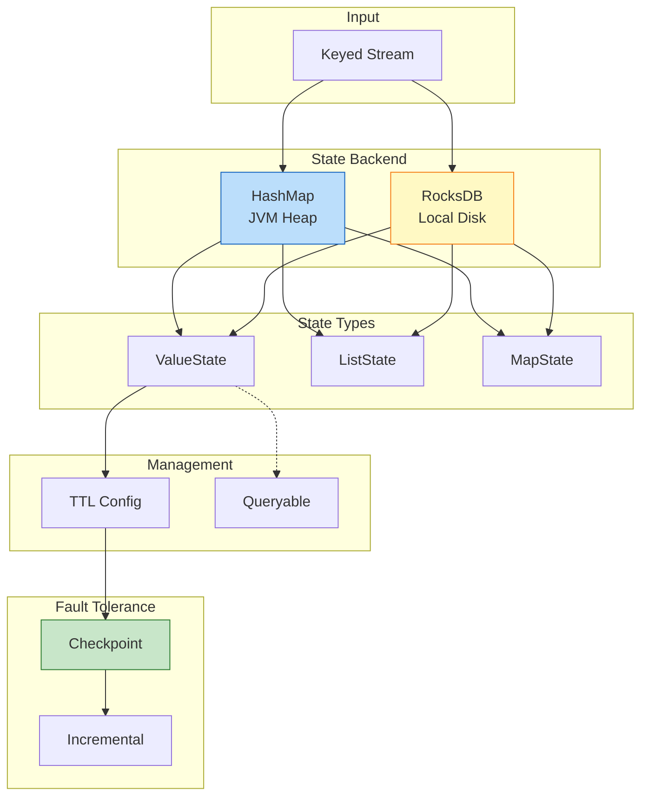
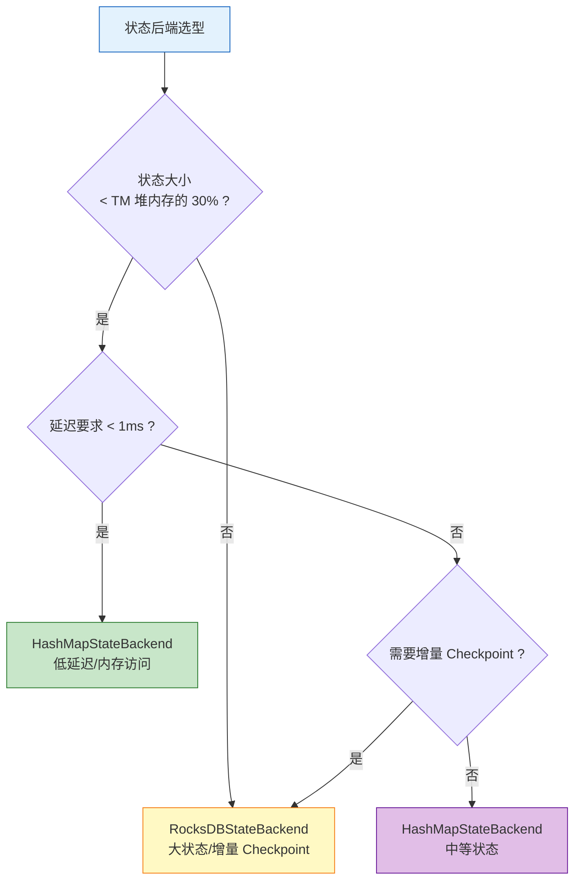

# 设计模式: 有状态计算 (Pattern: Stateful Computation)

> 所属阶段: Knowledge | 前置依赖: [相关文档] | 形式化等级: L3

> **模式编号**: 05/7 | **所属系列**: Knowledge/02-design-patterns | **形式化等级**: L4-L5
>
> 本模式解决分布式流处理中**状态一致性**、**容错恢复**与**大规模状态管理**之间的核心矛盾。

---

## 目录

- [设计模式: 有状态计算 (Pattern: Stateful Computation)](#设计模式-有状态计算-pattern-stateful-computation)
  - [目录](#目录)
  - [1. 概念定义 (Definitions)](#1-概念定义-definitions)
    - [Def-K-02-04 (Operator State)](#def-k-02-04-operator-state)
    - [Def-K-02-05 (Keyed State)](#def-k-02-05-keyed-state)
    - [Def-K-02-06 (State Backend)](#def-k-02-06-state-backend)
    - [Def-K-02-07 (状态 TTL)](#def-k-02-07-状态-ttl)
    - [Def-K-02-08 (可查询状态)](#def-k-02-08-可查询状态)
  - [2. 属性推导 (Properties)](#2-属性推导-properties)
    - [Prop-K-02-03 (状态分区确定性)](#prop-k-02-03-状态分区确定性)
    - [Prop-K-02-04 (TTL 有效性边界)](#prop-k-02-04-ttl-有效性边界)
    - [Prop-K-02-05 (状态后端访问延迟)](#prop-k-02-05-状态后端访问延迟)
  - [3. 关系建立 (Relations)](#3-关系建立-relations)
    - [与 Event Time 处理的关系](#与-event-time-处理的关系)
    - [与窗口聚合的关系](#与窗口聚合的关系)
    - [与 Checkpoint 机制的关系](#与-checkpoint-机制的关系)
  - [4. 论证过程 (Argumentation)](#4-论证过程-argumentation)
    - [4.1 分布式有状态计算的挑战](#41-分布式有状态计算的挑战)
    - [4.2 状态后端选型论证](#42-状态后端选型论证)
    - [4.3 适用场景分析](#43-适用场景分析)
  - [8. 形式化保证 (Formal Guarantees)](#8-形式化保证-formal-guarantees)
    - [8.1 依赖的形式化定义](#81-依赖的形式化定义)
    - [8.2 满足的形式化性质](#82-满足的形式化性质)
    - [8.3 模式组合时的性质保持](#83-模式组合时的性质保持)
    - [8.4 边界条件与约束](#84-边界条件与约束)
    - [8.5 状态后端的形式化特性](#85-状态后端的形式化特性)
  - [5. 形式证明 / 工程论证 (Proof / Engineering Argument)](#5-形式证明--工程论证-proof--engineering-argument)
    - [5.1 Keyed State 局部确定性论证](#51-keyed-state-局部确定性论证)
    - [5.2 增量 Checkpoint 一致性论证](#52-增量-checkpoint-一致性论证)
    - [5.3 状态后端选型的工程权衡](#53-状态后端选型的工程权衡)
  - [6. 实例验证 (Examples)](#6-实例验证-examples)
    - [6.1 Keyed State 基础用法](#61-keyed-state-基础用法)
    - [6.2 状态 TTL 配置](#62-状态-ttl-配置)
    - [6.3 状态后端配置](#63-状态后端配置)
    - [6.4 Queryable State 实现](#64-queryable-state-实现)
  - [7. 可视化 (Visualizations)](#7-可视化-visualizations)
    - [7.1 状态管理架构图](#71-状态管理架构图)
    - [7.2 状态后端选型决策树](#72-状态后端选型决策树)
    - [7.3 有状态处理模式思维导图](#73-有状态处理模式思维导图)
    - [7.4 状态类型与后端选择决策树](#74-状态类型与后端选择决策树)
  - [9. 引用参考 (References)](#9-引用参考-references)

---

## 1. 概念定义 (Definitions)

### Def-K-02-04 (Operator State)

**定义**: Operator State 是绑定于算子实例的全局状态，流中所有记录共享同一份状态副本 [^1]。

形式化地，设算子实例为 $o_i$，则：

$$
S_{\text{operator}}(o_i) \in \mathcal{V}
$$

其中 $\mathcal{V}$ 为状态值空间。Operator State 的典型用途包括：Kafka Source 的偏移量记录、Broadcast State 的全局配置表。

---

### Def-K-02-05 (Keyed State)

**定义**: Keyed State 是按 key 分区的局部状态，每个 key 拥有独立的状态副本 [^1]。

$$
S_{\text{keyed}}: (\text{TaskInstance} \times \text{Key}) \to \text{StateValue}
$$

Keyed State 的访问严格限制在 `keyBy()` 之后的算子中，Flink 保证同一 key 的所有记录路由到同一并行子任务，确保状态更新的串行化（**Thm-S-03-01**）。

**状态类型** [^1]：

| 类型 | 描述 | 场景 |
|------|------|------|
| ValueState | 单值状态 | 计数器 |
| ListState | 列表状态 | 历史记录 |
| MapState | Map 结构 | 键值集合 |
| ReducingState | 可规约状态 | 增量聚合 |

---

### Def-K-02-06 (State Backend)

**定义**: State Backend 是 Flink 中负责状态存储、访问和 Checkpoint 快照持久化的可插拔抽象层 [^2]。

$$
\mathcal{B} = (S_{\text{storage}}, \Phi_{\text{access}}, \Psi_{\text{snapshot}}, \Omega_{\text{recovery}})
$$

其中：

- $S_{\text{storage}}$: 物理存储介质（JVM Heap 或本地磁盘）
- $\Phi_{\text{access}}$: 状态读写接口
- $\Psi_{\text{snapshot}}$: 异步快照机制
- $\Omega_{\text{recovery}}$: 故障恢复流程

**主要实现对比**：

| 特性 | HashMapStateBackend | RocksDBStateBackend |
|------|---------------------|---------------------|
| 存储位置 | JVM Heap 内存 | 本地磁盘 (RocksDB) |
| 状态大小限制 | 受限于 TaskManager 内存 | 受限于本地磁盘容量 |
| 访问延迟 | 极低 (内存直接访问) | 低 (内存 + 磁盘缓存) |
| 增量 Checkpoint | 支持（需配置） | 原生支持（基于 SST） |
| 大状态支持 | 不适合 (> 100MB) | 适合 (TB 级) |

---

### Def-K-02-07 (状态 TTL)

**定义**: TTL (Time-To-Live) 定义了状态的有效生存周期，超过 TTL 的状态被视为过期并触发清理 [^6]。

$$
\text{Valid}(S_k, t) \iff t - \text{LastAccess}(S_k) < \text{TTL}
$$

**清理策略**：

| 策略 | 触发时机 | 适用后端 |
|------|----------|----------|
| Full Snapshot | Checkpoint 时 | 通用 |
| Incremental | 状态访问时 | 通用 |
| RocksDB Compaction | 压缩时 | RocksDB 专用 |

---

### Def-K-02-08 (可查询状态)

**定义**: 可查询状态 (Queryable State) 允许外部客户端通过 RPC 只读访问算子内部的 Keyed State [^8]。

```
Client ──RPC──► Queryable State Server ◄──Local── Task Manager
                                                │
                                                ▼
                                          Keyed State
```

**限制**：只读访问、仅支持 Keyed State、网络开销较高。Queryable State 在 Flink 1.17+ 中已标记为 deprecated，推荐使用 REST API 或外部存储替代 [^8]。

---

## 2. 属性推导 (Properties)

### Prop-K-02-03 (状态分区确定性)

**命题**: Keyed State 按 key 的哈希值分布到并行子任务，同一 key 的所有记录必然路由到同一子任务。

$$
\text{Partition}(key) = \text{hash}(key) \mod \text{parallelism}
$$

**推导**:

1. `keyBy()` 算子基于 key 的哈希值进行分区
2. Flink 的数据交换层保证同一分区号的数据发送到同一 Task 实例
3. 因此同一 key 的状态更新在单线程内串行执行
4. 结合 **Lemma-S-03-01** (Actor 邮箱串行处理引理)，Keyed State 的更新满足局部确定性（**Thm-S-03-01**）

---

### Prop-K-02-04 (TTL 有效性边界)

**命题**: 设状态最后访问时间为 $t_{\text{last}}$，TTL 为 $T$，则状态 $S_k$ 在时刻 $t$ 有效的充要条件为：

$$
t - t_{\text{last}} < T
$$

**工程约束**:

- TTL 清理是异步/惰性的，过期状态可能在清理前仍被短暂访问
- `StateVisibility.NeverReturnExpired` 配置可确保过期状态不会被返回
- TTL 设置应小于 Checkpoint 保留周期，避免状态膨胀导致恢复时间增长

---

### Prop-K-02-05 (状态后端访问延迟)

**命题**: 设状态大小为 $|S|$，HashMapStateBackend 的访问延迟为 $O(1)$，与状态大小无关；RocksDBStateBackend 的访问延迟为 $O(\log |S|)$（基于 LSM-Tree 的层级查找）。

**性能对比**（典型场景）:

| 状态大小 | HashMap 访问延迟 | RocksDB 访问延迟 | 推荐 |
|---------|-----------------|-----------------|------|
| 10 MB | ~0.1 μs | ~5 μs | HashMap |
| 100 MB | ~0.5 μs | ~5 μs | HashMap |
| 1 GB | OOM | ~10 μs | RocksDB |
| 100 GB | N/A | ~50 μs | RocksDB |

---

## 3. 关系建立 (Relations)

### 与 Event Time 处理的关系

有状态计算与 Event Time 深度耦合 [^10]：

- 状态访问可结合事件时间戳实现时间窗口状态（如会话窗口）
- Watermark 推进可驱动状态过期清理（TTL）
- 事件时间的单调性保证状态按正确时序更新

### 与窗口聚合的关系

窗口聚合内部依赖 Keyed State 实现 [^11]：

- Tumbling/Sliding/Session Window 的聚合结果存储在 ValueState 或 ListState 中
- 窗口触发器状态（Trigger State）与计算状态分离存储
- 窗口的 Allowed Lateness 机制依赖状态的持久化保留

### 与 Checkpoint 机制的关系

Checkpoint 是有状态计算容错的基础 [^2][^9]：

- 状态后端实现 **Thm-S-17-01** 的快照要求，捕获一致全局状态
- 增量 Checkpoint 仅持久化状态变更部分，优化存储效率但不改变一致性保证
- 故障恢复时从 Checkpoint 重建状态，结合 Source 重放实现 Exactly-Once（**Thm-S-18-01**）

---

## 4. 论证过程 (Argumentation)

### 4.1 分布式有状态计算的挑战

在分布式流处理中，有状态计算需要维护跨事件的上下文信息：

| 挑战维度 | 问题描述 | 典型影响 |
|----------|----------|----------|
| **容错一致性** | 节点故障时如何恢复状态 | Exactly-Once 语义破坏 |
| **状态规模** | 海量键值对的存储与访问 | OOM、GC 停顿 |
| **状态过期** | 无效状态的清理 | 状态膨胀 |
| **外部查询** | 运行时状态的外部访问 | 可观测性不足 |

**形式化描述**：设算子在时刻 $t$ 的状态为 $S_t(o_i)$，有状态计算满足：

$$
\text{Output}(o_i, r_j, t) = f(r_j, S_{t-1}(o_i))
$$

即输出依赖于历史累积状态，使得故障恢复必须精确还原历史状态。

**核心矛盾三角**：

```
         一致性 (Consistency)
              ▲
             /|\
            / | \
           /  |  \
          /   |   \
低延迟 ◄──────────────► 大规模
```

- 强一致性需要 Barrier 对齐，增加延迟
- 大规模状态需要磁盘存储，访问延迟高
- 低延迟要求内存计算，限制状态规模

---

### 4.2 状态后端选型论证

**HashMapStateBackend 适用场景** [^9]：

- 状态大小 < 100MB
- 需要极低访问延迟（< 1ms）
- 短窗口聚合（分钟级）
- 配置参数状态

**RocksDBStateBackend 适用场景** [^9]：

- 状态大小 > 100MB 或未知
- 长窗口聚合（小时/天级）
- 大 Keyspace（百万级 Key）
- 增量 Checkpoint 优化存储成本

**选型决策树** [^9]：

```
状态大小 < TM 堆内存的 30% ?
├── 是 ──► HashMapStateBackend (低延迟)
└── 否 ──► RocksDBStateBackend (大状态)
```

---

### 4.3 适用场景分析

**推荐使用** [^1][^9]：

| 场景 | 理由 | 配置 |
|------|------|------|
| 会话窗口 | 跨事件维护会话 | ValueState + TTL |
| 累积指标 | 日/月累计统计 | ReducingState + 增量 Checkpoint |
| CEP 模式匹配 | NFA 状态机 | MapState + 短 TTL |
| 去重过滤 | 精确去重 | ValueState + 过期清理 |

**不推荐** [^1]：

| 场景 | 理由 | 替代 |
|------|------|------|
| 纯无状态转换 | 无需状态 | map/filter |
| 大对象缓存 | 不适合缓存 | Redis |
| 跨作业共享 | 作业隔离 | 外部数据库 |

---

## 8. 形式化保证 (Formal Guarantees)

本节建立有状态计算模式与 Struct/ 理论层的形式化连接。

### 8.1 依赖的形式化定义

| 定义编号 | 名称 | 来源 | 在本模式中的作用 |
|----------|------|------|-----------------|
| **Def-S-03-01** | 经典 Actor 四元组 | Struct/01.03 | Keyed State 的并发模型基础：$\langle \alpha, b, m, \sigma \rangle$ |
| **Def-S-04-01** | Dataflow 图 (DAG) | Struct/01.04 | 状态算子作为带状态顶点 $\langle V, E, P, \Sigma, \mathbb{T} \rangle$ |
| **Def-S-17-02** | 一致全局状态 | Struct/04.01 | Checkpoint 捕获的状态必须构成一致割集 |
| **Def-S-18-05** | 幂等性 | Struct/04.02 | 状态更新重放需满足幂等性 |

### 8.2 满足的形式化性质

| 定理/引理编号 | 名称 | 来源 | 保证内容 |
|---------------|------|------|----------|
| **Thm-S-03-01** | Actor 局部确定性定理 | Struct/01.03 | 单 Key 状态更新串行化，保证局部确定性 |
| **Lemma-S-03-01** | Actor 邮箱串行处理引理 | Struct/01.03 | 同一 Key 的消息按 FIFO 处理 |
| **Thm-S-17-01** | Checkpoint 一致性定理 | Struct/04.01 | 状态快照构成一致全局状态 |
| **Thm-S-18-01** | Exactly-Once 正确性定理 | Struct/04.02 | 状态恢复 + Source 重放 = Exactly-Once |
| **Lemma-S-18-03** | 状态恢复一致性引理 | Struct/04.02 | 恢复后状态与故障前某时刻一致 |

### 8.3 模式组合时的性质保持

**Stateful Computation + Event Time 组合**：

- 状态访问可结合事件时间戳实现时间窗口状态
- Watermark 驱动状态过期清理（TTL）

**Stateful Computation + Checkpoint 组合**：

- 状态后端实现 **Thm-S-17-01** 的快照要求
- 增量 Checkpoint 优化不改变一致性保证

**Stateful Computation + Windowed Aggregation 组合**：

- 窗口状态使用 Keyed State 实现
- 窗口触发器状态与计算状态分离存储

### 8.4 边界条件与约束

| 约束条件 | 形式化描述 | 违反后果 |
|----------|-----------|----------|
| Key 分区固定 | $\text{hash}(k) \mod \text{parallelism}$ 不变 | Key 漂移，状态丢失 |
| 状态大小有限 | $\|S\| < \infty$ | OOM，作业崩溃 |
| TTL 配置合理 | TTL < Checkpoint 间隔 $\times N$ | 状态膨胀，恢复时间增长 |
| 并发访问隔离 | 单 Key 单线程访问 | 数据竞争，状态损坏 |

### 8.5 状态后端的形式化特性

| 后端类型 | 存储模型 | 一致性保证 | 适用场景 |
|----------|----------|-----------|----------|
| HashMapStateBackend | 内存 KV | **Thm-S-17-01** | 小状态 (<100MB) |
| RocksDBStateBackend | LSM-Tree | **Thm-S-17-01** | 大状态 (TB级) |

---

## 5. 形式证明 / 工程论证 (Proof / Engineering Argument)

### 5.1 Keyed State 局部确定性论证

**定理声明**（引用 **Thm-S-03-01**）[^12]：

> 在 Actor 模型中，单个 Actor 的局部执行是确定性的，即对于相同的初始状态和相同的消息序列，输出状态序列唯一。

**向 Flink Keyed State 的映射**:

1. Flink 的 `keyBy()` 将流按 key 分区，等价于为每个 key 创建一个逻辑 Actor
2. 同一 key 的所有记录按 FIFO 顺序投递到同一 Task 线程（**Lemma-S-03-01**）
3. Keyed State 的 `update()` 操作在单线程内串行执行，无数据竞争
4. 因此，Keyed State 的演化满足局部确定性

**工程意义**: 局部确定性是保证故障恢复后可复现性的基础。即使不同 key 的并行处理存在调度非确定性，单个 key 的状态演化路径是确定的。

---

### 5.2 增量 Checkpoint 一致性论证

**论证目标**: 证明增量 Checkpoint 在优化存储效率的同时，不破坏全局状态一致性（**Thm-S-17-01**）。

**论证结构**:

1. **状态快照的完备性**: 每次 Checkpoint 捕获的增量变更加上基线全量状态，可完整重建该时刻的全局状态
2. **SST 不可变性**: RocksDB 的 SST 文件一旦生成不再修改，增量快照只需引用新增 SST，天然满足一致性割集要求
3. **恢复正确性**: 恢复时 Flink 自动合并基线与增量文件，重建的状态与全量快照语义等价
4. **无孤儿消息**: 增量 Checkpoint 不改变 Barrier 对齐语义，因此在途消息的处理与全量快照一致（**Lemma-S-17-04**）

**结论**: 增量 Checkpoint 是 **Thm-S-17-01** 的优化实现，而非弱化实现。

---

### 5.3 状态后端选型的工程权衡

**权衡矩阵**:

| 维度 | HashMapStateBackend | RocksDBStateBackend |
|------|---------------------|---------------------|
| 访问延迟 | ~10-100 ns | 1-100 μs |
| 状态容量 | 几 MB - 几 GB | TB 级 |
| GC 影响 | 大状态导致频繁 Full GC | 对 JVM Heap 影响极小 |
| 增量 Checkpoint | 不支持（对象级比较开销大） | 原生支持（SST 级） |
| 恢复速度 | 快（内存加载） | 中等（需重建 LSM-Tree） |

**决策规则**:

$$
\text{Backend} = \begin{cases}
\text{HashMap} & \text{if } |S| < 0.3 \times \text{TM\_Heap} \land \text{Latency} < 1\text{ms} \\
\text{RocksDB} & \text{otherwise}
\end{cases}
$$

其中 $|S|$ 为预估状态大小，TM_Heap 为 TaskManager 堆内存。

---

## 6. 实例验证 (Examples)

### 6.1 Keyed State 基础用法

```scala
class UserVisitCounter extends ProcessFunction[UserEvent, UserStats] {
  private var visitCountState: ValueState[Long] = _

  override def open(parameters: Configuration): Unit = {
    val descriptor = new ValueStateDescriptor[Long](
      "visit-count", classOf[Long]
    )
    visitCountState = getRuntimeContext.getState(descriptor)
  }

  override def processElement(
    event: UserEvent,
    ctx: Context,
    out: Collector[UserStats]
  ): Unit = {
    val currentCount = Option(visitCountState.value()).getOrElse(0L)
    val newCount = currentCount + 1
    visitCountState.update(newCount)
    out.collect(UserStats(event.userId, newCount))
  }
}
```

---

### 6.2 状态 TTL 配置

```scala
val ttlConfig = StateTtlConfig
  .newBuilder(Time.minutes(30))
  .setUpdateType(OnCreateAndWrite)
  .setStateVisibility(NeverReturnExpired)
  .cleanupFullSnapshot()
  .build()

val descriptor = new ValueStateDescriptor[SessionInfo](
  "session", classOf[SessionInfo]
)
descriptor.enableTimeToLive(ttlConfig)
```

---

### 6.3 状态后端配置

**HashMapStateBackend** (小状态) [^9]：

```scala
env.setStateBackend(new HashMapStateBackend())
env.getCheckpointConfig.setCheckpointStorage("hdfs:///checkpoints")
```

**RocksDBStateBackend** (大状态 + 增量) [^9]：

```scala
val rocksDbBackend = new EmbeddedRocksDBStateBackend(true) // true=增量
env.setStateBackend(rocksDbBackend)
env.getCheckpointConfig.setCheckpointStorage("hdfs:///checkpoints")
```

---

### 6.4 Queryable State 实现

```scala
val descriptor = new ValueStateDescriptor[UserProfile](
  "user-profile", classOf[UserProfile]
)
descriptor.setQueryable("queryable-user-profile")
```

外部查询 [^8]：

```scala
val client = new QueryableStateClient("jobmanager", 9069)
val future = client.getKvState(
  jobId, "queryable-user-profile", "user_123",
  keySerializer, stateDescriptor
)
```

---

## 7. 可视化 (Visualizations)

### 7.1 状态管理架构图

以下 Mermaid 图展示了有状态计算模式的核心组件和层级关系：



---

### 7.2 状态后端选型决策树

以下决策树帮助在不同场景下选择合适的状态后端：



---

### 7.3 有状态处理模式思维导图

以下思维导图以"有状态处理模式"为中心，放射状展开核心概念、状态类型、适用场景及与容错机制的关联：

```mermaid
mindmap
  root((有状态处理模式))
    核心概念
      状态类型
        ValueState
          适用场景 计数器与累加器
          核心API value update clear
          性能特征 O(1)常数访问
        ListState
          适用场景 历史记录与序列缓存
          核心API add update get clear
          性能特征 追加O(1)遍历O(n)
        MapState
          适用场景 键值索引与配置表
          核心API put get contains clear
          性能特征 O(1)键查找
        ReducingState
          适用场景 增量聚合与去重
          核心API add get clear
          性能特征 自动规约仅保留结果
        AggregatingState
          适用场景 复杂累加器聚合
          核心API add get clear
          性能特征 聚合输入输出累加器
      状态后端
        HashMapStateBackend
          存储位置 JVM堆内存
          延迟特征 极低内存直接访问
          容量限制 受限于TM堆内存
        RocksDBStateBackend
          存储位置 本地磁盘LSM-Tree
          延迟特征 低内存加磁盘缓存
          容量限制 TB级受限于磁盘
      TTL管理
        过期判定 最后访问时间加TTL
        清理策略 FullSnapshot与Incremental
        RocksDB专用 Compaction清理
      状态一致性
        ExactlyOnce Barrier对齐加异步快照
        AtLeastOnce 不对齐可能重复
    与Checkpoint及ExactlyOnce关联
      Checkpoint机制
        全量快照 状态完整副本
        增量快照 SST差异引用
        恢复流程 基线加增量重建
      ExactlyOnce语义
        两阶段提交 预提交与确认
        幂等性保证 状态更新重放安全
        端到端实现 Source可重放与Sink幂等
```

---

### 7.4 状态类型与后端选择决策树

以下决策树展示从需求出发选择状态类型和状态后端的全流程，包含配置参数与权衡分析：

```mermaid
flowchart TD
    Start([需要维护流处理状态]) --> TypeQ{状态结构需求}

    TypeQ -->|单值 计数累加| TypeA[ValueState<br/>API value update clear<br/>性能 O(1)读写]
    TypeQ -->|序列 历史有序列表| TypeB[ListState<br/>API add update get clear<br/>性能 追加O(1)遍历O(n)]
    TypeQ -->|键值 索引配置| TypeC[MapState<br/>API put get contains clear<br/>性能 O(1)键查找]
    TypeQ -->|增量 聚合去重| TypeD[ReducingState<br/>API add get clear<br/>性能 自动规约保留结果]
    TypeQ -->|复杂 累加器聚合| TypeE[AggregatingState<br/>API add get clear<br/>性能 输入聚合输出累加器]

    TypeA --> BackendQ{状态大小与延迟要求}
    TypeB --> BackendQ
    TypeC --> BackendQ
    TypeD --> BackendQ
    TypeE --> BackendQ

    BackendQ -->|小状态 小于TM堆内存30%<br/>延迟小于1ms| A1[HashMapStateBackend<br/>配置 state.backend=hashmap<br/>适用 短窗口低延迟]
    BackendQ -->|大状态 大于100MB或未知| Q3{是否需要增量Checkpoint}
    BackendQ -->|中等状态 可能增长| Q4{延迟可接受范围}

    Q4 -->|延迟小于1ms| A1
    Q4 -->|延迟1至100微秒可接受| Q3

    Q3 -->|需要增量Checkpoint| A2[RocksDBStateBackend 增量<br/>配置 state.backend=rocksdb<br/>state.incremental-checkpoints=true<br/>适用 长窗口TB级大Keyspace]
    Q3 -->|不需要增量Checkpoint| Q5{状态访问模式}

    Q5 -->|大量随机读| A2
    Q5 -->|顺序写为主| A2
    Q5 -->|极低延迟且读多| A3[RocksDBStateBackend 内存调优<br/>配置 state.backend=rocksdb<br/>rocksdb.predefined-options=FLASH_SSD<br/>block-cache大小调优<br/>适用 中等状态需低延迟]

    A1 --> T1[权衡 低延迟但受内存限制<br/>风险 OOM与Full GC<br/>建议 配合短TTL使用]
    A2 --> T2[权衡 大状态支持但延迟较高<br/>优势 增量Checkpoint节省存储与网络<br/>建议 调优write-buffer与compaction]
    A3 --> T3[权衡 平衡延迟与容量<br/>注意 需调优block-cache与线程数<br/>建议 监控LSM层级与读放大]

    style Start fill:#e3f2fd,stroke:#1565c0
    style TypeA fill:#bbdefb,stroke:#1565c0
    style TypeB fill:#bbdefb,stroke:#1565c0
    style TypeC fill:#bbdefb,stroke:#1565c0
    style TypeD fill:#bbdefb,stroke:#1565c0
    style TypeE fill:#bbdefb,stroke:#1565c0
    style A1 fill:#c8e6c9,stroke:#2e7d32
    style A2 fill:#fff9c4,stroke:#f57f17
    style A3 fill:#e1bee7,stroke:#6a1b9a
```

---

## 9. 引用参考 (References)

[^1]: Flink State Documentation. <https://nightlies.apache.org/flink/flink-docs-stable/docs/dev/datastream/fault-tolerance/state/>

[^2]: Carbone et al., "State Management in Apache Flink," *PVLDB*, 2017.

[^6]: Flink State TTL. <https://nightlies.apache.org/flink/flink-docs-stable/docs/dev/datastream/fault-tolerance/state/#state-time-to-live-ttl>

[^8]: Flink Queryable State. <https://archive.org/web/*/https://nightlies.apache.org/flink/flink-docs-release-1.16/docs/dev/datastream/fault-tolerance/queryable_state/> <!-- 404 as of 2026-04: deprecated in Flink 1.17+ -->

[^9]: Flink State Backend Selection. [Flink/09-practices/09.03-performance-tuning/state-backend-selection.md](../../Flink/09-practices/09.03-performance-tuning/state-backend-selection.md)

[^10]: Flink Time Semantics. [Flink/02-core/time-semantics-and-watermark.md](../../Flink/02-core/time-semantics-and-watermark.md)

[^11]: Flink Checkpoint Mechanism. [Flink/02-core/checkpoint-mechanism-deep-dive.md](../../Flink/02-core/checkpoint-mechanism-deep-dive.md)

[^12]: Type Safety Derivation. [Struct/02-properties/02.05-type-safety-derivation.md](../../Struct/02-properties/02.05-type-safety-derivation.md)

---

*文档版本: v1.0 | 更新日期: 2026-04-02*

---

*文档版本: v1.0 | 创建日期: 2026-04-20*
