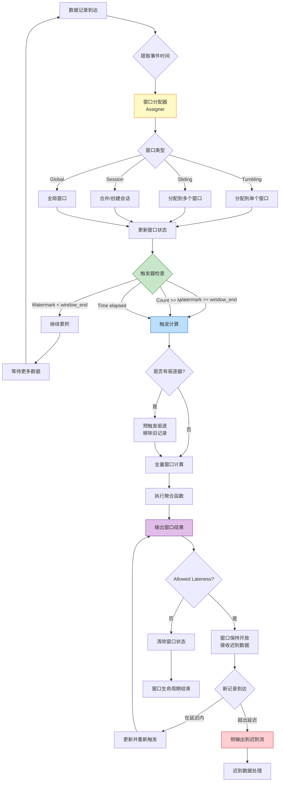

# 设计模式: 窗口聚合 (Pattern: Windowed Aggregation)

> **模式编号**: 02/7 | **所属系列**: Knowledge/02-design-patterns | **形式化等级**: L4 | **复杂度**: ★★☆☆☆
>
> 本模式将无界数据流切分为有限的时间桶进行聚合计算，解决流处理中**批处理语义**与**流式计算**之间的张力。

---

## 目录

- [设计模式: 窗口聚合 (Pattern: Windowed Aggregation)](#设计模式-窗口聚合-pattern-windowed-aggregation)
  - [目录](#目录)
  - [1. 概念定义 (Definitions)](#1-概念定义-definitions)
    - [Def-K-02-01 (窗口分配器)](#def-k-02-01-窗口分配器)
    - [Def-K-02-02 (窗口类型分类)](#def-k-02-02-窗口类型分类)
    - [Def-K-02-03 (触发器)](#def-k-02-03-触发器)
    - [Def-K-02-04 (驱逐器)](#def-k-02-04-驱逐器)
    - [Def-K-02-05 (窗口聚合函数)](#def-k-02-05-窗口聚合函数)
  - [2. 属性推导 (Properties)](#2-属性推导-properties)
    - [Prop-K-02-01 (窗口时间覆盖完备性)](#prop-k-02-01-窗口时间覆盖完备性)
    - [Prop-K-02-02 (窗口分配确定性)](#prop-k-02-02-窗口分配确定性)
  - [3. 关系建立 (Relations)](#3-关系建立-relations)
    - [关系: Windowed Aggregation `↦` Def-S-04-05](#关系-windowed-aggregation--def-s-04-05)
    - [关系: 窗口聚合与 Watermark](#关系-窗口聚合与-watermark)
  - [4. 论证过程 (Argumentation)](#4-论证过程-argumentation)
    - [4.1 窗口类型选择决策矩阵](#41-窗口类型选择决策矩阵)
    - [4.2 触发器策略对比分析](#42-触发器策略对比分析)
    - [4.3 驱逐器与增量计算的权衡](#43-驱逐器与增量计算的权衡)
  - [5. 形式证明 / 工程论证](#5-形式证明--工程论证)
    - [Thm-K-02-01 (窗口聚合正确性条件)](#thm-k-02-01-窗口聚合正确性条件)
  - [6. 实例验证 (Examples)](#6-实例验证-examples)
    - [6.1 Flink DataStream API 示例](#61-flink-datastream-api-示例)
    - [6.2 Flink SQL 示例](#62-flink-sql-示例)
    - [6.3 触发器与驱逐器组合使用](#63-触发器与驱逐器组合使用)
  - [7. 可视化 (Visualizations)](#7-可视化-visualizations)
    - [窗口类型对比图](#窗口类型对比图)
    - [窗口聚合执行流程](#窗口聚合执行流程)
  - [5.1 形式化保证总结 (Formal Guarantee Summary)](#51-形式化保证总结-formal-guarantee-summary)
    - [依赖的核心定义](#依赖的核心定义)
    - [依赖的核心定理](#依赖的核心定理)
    - [模式组合性质保持](#模式组合性质保持)
  - [8. 引用参考 (References)](#8-引用参考-references)

---

## 1. 概念定义 (Definitions)

本节建立窗口聚合模式的严格形式化基础，涵盖窗口分配器、窗口类型、触发器、驱逐器和聚合函数的核心定义。这些概念是流处理系统从逐记录计算向批量聚合扩展的基石。

### Def-K-02-01 (窗口分配器)

**窗口分配器**（Window Assigner）是将流中每条记录映射到一组时间窗口的函数 [^1][^2]：

$$
\text{Assigner}: \mathcal{D} \times \mathbb{T} \to \mathcal{P}(\text{WindowID})
$$

其中：

- $\mathcal{D}$ 为记录的数据域
- $\mathbb{T}$ 为事件时间域
- $\text{WindowID} = (wid, t_{start}, t_{end})$ 为窗口标识符，包含起始时间和结束时间

**分配器的核心属性** [^1]：

| 属性 | 数学描述 | 工程含义 |
|------|---------|---------|
| **时间覆盖** | $\bigcup_{wid \in W} [t_{start}, t_{end}) \supseteq \text{EventTimeRange}$ | 所有事件时间至少属于一个窗口 |
| **非负性** | $\forall wid: t_{end} > t_{start}$ | 窗口必须具有正的时间跨度 |
| **前向性** | 若 $t_e(r_1) < t_e(r_2)$，则 $t_{end}(W(r_1)) \leq t_{end}(W(r_2))$ | 窗口边界随事件时间单调不减 |

**直观解释**：窗口分配器是连接无界流与有限计算的基本抽象。它将连续的时间轴切分为离散的时间桶，使得批处理中的聚合操作（如 SUM、COUNT、AVG）能够在流上得到定义。

---

### Def-K-02-02 (窗口类型分类)

根据时间桶的划分策略，标准窗口类型定义如下 [^1][^2][^3]：

**滚动窗口**（Tumbling Window）：

$$
\text{Tumbling}(\delta): wid_n = [n\delta, (n+1)\delta), \quad n \in \mathbb{Z}
$$

- 窗口大小固定为 $\delta$
- 窗口间**互不重叠**：$wid_n \cap wid_{n+1} = \emptyset$
- 每条记录**精确属于一个窗口**

**滑动窗口**（Sliding Window）：

$$
\text{Sliding}(\delta, s): wid_n = [n \cdot s, n \cdot s + \delta), \quad n \in \mathbb{Z}
$$

- 窗口大小为 $\delta$，滑动步长为 $s$
- 当 $s < \delta$ 时，窗口间**存在重叠**
- 每条记录可能属于**多个窗口**（最多 $\lceil \delta/s \rceil$ 个）

**会话窗口**（Session Window）：

$$
\text{Session}(g, r_1, r_2, \ldots): wid = [t_{first}, t_{last} + g)
$$

其中：

- $g$ 为会话超时间隙（Session Gap）
- $t_{first}$ 为会话内首条记录的事件时间
- $t_{last}$ 为会话内末条记录的事件时间
- 会话在**无活动超过 $g$ 时间**后关闭

**全局窗口**（Global Window）：

$$
\text{Global}: wid_{global} = (-\infty, +\infty)
$$

- 只有一个全局窗口，包含所有记录
- 通常与**自定义触发器**配合使用
- 适用于**全局统计**或**按触发器驱动的聚合**

**窗口类型特征对比** [^3]：

| 窗口类型 | 窗口数量 | 记录归属 | 典型应用场景 |
|---------|---------|---------|-------------|
| Tumbling | $T/\delta$ | 单窗口 | 固定周期统计（每分钟PV） |
| Sliding | $T/s$ | 多窗口 | 移动平均（过去5分钟每10秒） |
| Session | 动态 | 单窗口 | 用户行为分析（会话时长） |
| Global | 1 | 全局 | 全局Top-N、自定义触发 |

---

### Def-K-02-03 (触发器)

**触发器**（Trigger）是决定窗口何时输出计算结果的谓词函数 [^1][^2]：

$$
\text{Trigger}: \text{WindowID} \times \mathbb{T}_{watermark} \times \text{State} \to \{\text{FIRE}, \text{CONTINUE}, \text{PURGE}\}
$$

**标准触发器类型** [^2][^3]：

| 触发器类型 | 触发条件 | 语义描述 |
|-----------|---------|---------|
| **Event Time** | $w \geq t_{end}$ | Watermark 越过窗口结束时间 |
| **Processing Time** | $t_{proc} \geq t_{end}$ | 处理时间到达窗口结束 |
| **Count** | $|S_{wid}| \geq N$ | 窗口内记录数达到阈值 |
| **Continuous** | $\Delta t_{proc} \geq \delta$ | 周期性触发（每N秒） |
| **Delta** | $\|v_{new} - v_{last}\| \geq \epsilon$ | 结果变化超过阈值 |

**触发器返回动作** [^2]：

- **FIRE**: 触发窗口计算并输出结果
- **CONTINUE**: 继续累积，不输出结果
- **PURGE**: 清空窗口状态（可选，常与 FIRE 组合）

**直观解释**：触发器是流处理中"何时计算"的控制机制。不同于批处理中数据全部到达后才计算，流处理的窗口需要在数据持续到达的同时，决定何时输出"当前最佳估计"。

---

### Def-K-02-04 (驱逐器)

**驱逐器**（Evictor）是在窗口触发前后，从窗口状态中选择性移除元素的函数 [^2][^3]：

$$
\text{Evictor}: \mathcal{P}(\mathcal{D}) \times \text{TriggerContext} \to \mathcal{P}(\mathcal{D})
$$

**标准驱逐器类型** [^2]：

| 驱逐器类型 | 作用时机 | 移除策略 |
|-----------|---------|---------|
| **CountEvictor** | 触发前 | 仅保留最近的 $N$ 条记录 |
| **TimeEvictor** | 触发前 | 仅保留最近 $\delta$ 时间内的记录 |
| **DeltaEvictor** | 触发前 | 基于数据属性差异移除旧记录 |

**驱逐器与增量计算的关系**：

```
┌─────────────────────────────────────────────────────────────┐
│                    驱逐器作用时机                            │
├─────────────────────────────────────────────────────────────┤
│                                                             │
│  1. 触发前驱逐 (Pre-Trigger)                                 │
│     ├── 输入: 窗口内所有记录                                 │
│     ├── 驱逐: 移除符合条件的旧记录                           │
│     └── 计算: 对剩余记录执行聚合函数                         │
│                                                             │
│  2. 触发后驱逐 (Post-Trigger)                                │
│     ├── 触发: 先对全部记录计算并输出                         │
│     ├── 驱逐: 再移除部分记录                                 │
│     └── 继续: 窗口保持打开，可继续累积                       │
│                                                             │
└─────────────────────────────────────────────────────────────┘
```

**直观解释**：驱逐器提供了"窗口内保留哪些数据"的细粒度控制。当窗口包含大量历史数据但只需要最近的数据时，驱逐器可以在计算前过滤，减少聚合函数的计算开销。

---

### Def-K-02-05 (窗口聚合函数)

**窗口聚合函数**（Window Aggregate Function）定义了如何将窗口内的多条记录合并为单个结果值 [^1][^2]：

$$
\text{Aggregate}: \mathcal{P}(\mathcal{D}) \to \mathcal{R}
$$

**聚合函数分类** [^3]：

| 聚合类型 | 是否可增量 | 是否需要去重 | 示例 |
|---------|-----------|-------------|------|
| **Distributive** | 是 | 否 | SUM, COUNT, MIN, MAX |
| **Algebraic** | 是 | 否 | AVG (需SUM+COUNT), STD |
| **Holistic** | 否 | 是 | MEDIAN, PERCENTILE, MODE |
| **Unique** | 是 | 是 | DISTINCT COUNT |

**增量聚合的代数条件** [^1]：

若聚合函数 $f$ 可表示为两个函数的组合 $f = g \circ h$，其中：

- $h: \mathcal{D} \to \mathcal{A}$ 将记录映射为中间累加器值
- $g: \mathcal{A} \to \mathcal{R}$ 将累加器转换为最终结果
- $h$ 满足**结合律**：$h(h(a, b), c) = h(a, h(b, c))$

则 $f$ 支持增量计算，状态复杂度为 $O(1)$。

**直观解释**：聚合函数是窗口计算的"核心逻辑"。区分可增量与不可增量的聚合，对于状态管理至关重要——Distributive 聚合只需常数状态，而 Holistic 聚合需要存储窗口内全部记录。

---

## 2. 属性推导 (Properties)

### Prop-K-02-01 (窗口时间覆盖完备性)

**陈述**：对于任意事件时间 $t \in \mathbb{T}$，至少存在一个窗口 $wid$ 使得 $t \in [t_{start}(wid), t_{end}(wid))$。

**推导** [^1]：

1. 滚动窗口：对于窗口大小 $\delta$，$t$ 必然属于窗口 $wid_{\lfloor t/\delta \rfloor} = [\lfloor t/\delta \rfloor \cdot \delta, (\lfloor t/\delta \rfloor + 1) \cdot \delta)$
2. 滑动窗口：同理，$t$ 属于所有满足 $n \cdot s \leq t < n \cdot s + \delta$ 的窗口
3. 会话窗口：由于会话边界由实际数据驱动，只要 $t$ 对应某条记录，该记录必属于某一会话
4. 全局窗口：显然覆盖所有时间

**工程推论**：时间覆盖完备性保证了"无数据遗漏"——任何事件时间戳的记录都会被至少一个窗口捕获。这是流处理系统与批处理语义等价的基础。 ∎

---

### Prop-K-02-02 (窗口分配确定性)

**陈述**：对于给定的窗口分配策略和固定的事件时间，记录的窗口归属是确定性的：

$$
\forall r_1, r_2: t_e(r_1) = t_e(r_2) \implies \text{Assigner}(r_1) = \text{Assigner}(r_2)
$$

**推导** [^2]：

1. 由 Def-K-02-02，所有标准窗口类型的边界计算均为确定性函数：
   - Tumbling: $wid = \lfloor t_e/\delta \rfloor \cdot \delta$
   - Sliding: $wid_n = [n \cdot s, n \cdot s + \delta)$，其中 $n$ 由 $t_e$ 唯一确定
   - Session: 窗口边界由数据驱动，但给定相同记录集，会话划分唯一

2. 窗口分配器仅依赖于 $t_e(r)$，不涉及随机性或外部状态

3. 因此，相同事件时间的记录必然映射到相同的窗口集合 ∎

**工程推论**：窗口分配的确定性保证了**结果可复现性**——相同输入流在重新运行时产生相同的窗口划分，这是调试和测试的关键前提。

---

## 3. 关系建立 (Relations)

### 关系: Windowed Aggregation `↦` Def-S-04-05

**编码存在性** [^4]：

本模式中的窗口聚合概念与 Struct/01-foundation/01.04-dataflow-model-formalization.md 中定义的 Def-S-04-05 (窗口形式化) 存在严格的映射关系：

| 本模式概念 | Def-S-04-05 对应 | 映射关系 |
|-----------|-----------------|---------|
| 窗口分配器 (Def-K-02-01) | $W: \mathcal{D} \to \mathcal{P}(\text{WindowID})$ | 直接对应 |
| 窗口类型 (Def-K-02-02) | 窗口分配器的具体实现 | 特化实现 |
| 触发器 (Def-K-02-03) | $T: \text{WindowID} \times \mathbb{T} \to \{\text{FIRE}, \text{CONTINUE}\}$ | 直接对应 |
| 窗口聚合函数 (Def-K-02-05) | $\bigoplus$ 聚合操作 | 语义等价 |
| 允许延迟 | $F \in \mathbb{T}$ | 直接对应 |

**差异说明**：

- Def-S-04-05 中未显式包含"驱逐器"概念，这是 Flink 等系统在 Dataflow 模型基础上的扩展
- Def-S-04-05 的窗口状态 $A$ 在本模式中细化为聚合函数的累加器语义

**结论**：本模式的窗口聚合是 Def-S-04-05 的工程实现细化，两者在核心语义上保持一致。

---

### 关系: 窗口聚合与 Watermark

**依赖关系** [^1][^2]：

窗口聚合的正确执行依赖于 Watermark 机制提供的进度保证：

$$
\text{Window Trigger} \circ \text{Watermark} \implies \text{Deterministic Output}
$$

**形式化描述** [^4]：

设窗口 $wid = [t_{start}, t_{end})$，当前 Watermark 为 $w$，允许延迟为 $F$，则：

| 条件 | 行为 | Watermark 作用 |
|------|------|---------------|
| $w < t_{end}$ | 窗口保持开放，继续累积 | 表明可能仍有数据到达 |
| $t_{end} \leq w < t_{end} + F$ | 触发计算，窗口仍开放接收迟到数据 | 正常触发 |
| $w \geq t_{end} + F$ | 触发最终计算，窗口关闭 | 允许延迟耗尽 |

**推论**：Watermark 的单调性（Lemma-S-04-02）保证了窗口触发的**幂等性**——同一窗口不会重复触发。

---

## 4. 论证过程 (Argumentation)

### 4.1 窗口类型选择决策矩阵

**选择标准** [^3][^5]：

| 业务需求 | 推荐窗口类型 | 理由 |
|---------|-------------|------|
| 固定周期统计（每分钟PV/UV） | Tumbling | 不重叠，统计结果互不干扰 |
| 移动统计（过去5分钟每10秒刷新） | Sliding | 重叠窗口支持平滑聚合 |
| 会话分析（用户访问时长） | Session | 动态边界匹配用户行为模式 |
| 全局Top-N/排行榜 | Global + Trigger | 全局视图配合自定义触发 |
| 异常检测（突变识别） | Session/Delta | 细粒度会话捕捉异常模式 |

**计算成本对比** [^3]：

假设流吞吐量为 $R$ 记录/秒，处理时间跨度为 $T$：

| 窗口类型 | 窗口实例数 | 单记录归属窗口数 | 状态复杂度 |
|---------|-----------|-----------------|-----------|
| Tumbling ($\delta$) | $T/\delta$ | 1 | $O(T/\delta \times \text{keys})$ |
| Sliding ($\delta$, $s$) | $T/s$ | $\delta/s$ | $O(T/s \times \text{keys})$ |
| Session ($g$) | 动态 | 1 | $O(\text{active sessions})$ |
| Global | 1 | 1 | $O(\text{keys})$ |

**关键观察**：滑动窗口的状态复杂度随重叠度 $\delta/s$ 线性增长。当 $\delta = 5$ 分钟，$s = 1$ 秒时，每条记录属于 300 个窗口，状态膨胀严重。

---

### 4.2 触发器策略对比分析

**触发器选择决策树** [^2][^3]：

```
是否需要结果实时性?
├── 否 ──► Event Time Trigger (Watermark到达触发，结果最准确)
└── 是 ──► 能否接受近似结果?
            ├── 否 ──► Processing Time Trigger (低延迟但可能遗漏)
            └── 是 ──► Continuous Trigger (周期性输出当前估计)
                        ├── 需要最终修正? ──► 允许延迟更新
                        └── 不需要修正? ──► 仅输出实时估计
```

**延迟-准确性权衡** [^1]：

| 触发策略 | 结果延迟 | 结果准确性 | 适用场景 |
|---------|---------|-----------|---------|
| Event Time | 高（Watermark延迟） | 高（完整数据） | 金融统计、报表 |
| Processing Time | 低（即时） | 低（可能遗漏迟到数据） | 实时监控 |
| Continuous + Allowed Lateness | 中 | 中（先近似后修正） | 实时推荐 |

---

### 4.3 驱逐器与增量计算的权衡

**使用驱逐器的场景** [^2][^3]：

| 场景 | 驱逐器类型 | 收益 |
|------|-----------|------|
| 只需要最近N条记录 | CountEvictor | 状态有界，支持无限流 |
| 只需要最近M分钟数据 | TimeEvictor | 状态自动过期 |
| 数据价值随时间衰减 | DeltaEvictor | 优先保留高价值数据 |

**与增量聚合的冲突** [^2]：

驱逐器与增量聚合存在**语义张力**：

- **增量聚合**（如 SUM、COUNT）依赖完整的累加器状态，驱逐历史数据会破坏累加器
- **解决方案**：
  1. 使用非增量聚合（ProcessWindowFunction），存储原始数据，触发前驱逐
  2. 不使用驱逐器，依赖状态 TTL 自动清理
  3. 自定义可驱逐的增量累加器（需保证结合律）

**工程建议**：若必须使用驱逐器，优先选择 ProcessWindowFunction + 预触发驱逐的组合。

---

## 5. 形式证明 / 工程论证

### Thm-K-02-01 (窗口聚合正确性条件)

**陈述**：设一个窗口聚合操作由以下参数定义：

- 窗口分配器 $W$（满足 Def-K-02-01）
- 触发器 $T$（满足 Def-K-02-03）
- 聚合函数 $\bigoplus$（满足 Def-K-02-05 的结合律条件）
- Watermark 策略满足 $w(t) = \max_{r \in \text{observed}} t_e(r) - L$

则当最大乱序容忍度 $L$ 大于等于实际数据乱序程度时，窗口聚合结果是**完整且正确**的。

**工程论证** [^1][^4]：

**步骤 1：建立 Watermark 保证**

由 Def-S-04-04，Watermark $w$ 的语义保证：所有事件时间 $\leq w$ 的记录要么已到达，要么永远不会到达。

**步骤 2：确定窗口触发条件**

窗口 $wid = [t_{start}, t_{end})$ 在 Event Time 触发器下的触发时刻为：
$$
\tau_{trigger} = \min\{t \mid w(t) \geq t_{end}\}
$$

**步骤 3：分析完整性条件**

设实际数据乱序程度为 $D_{actual}$，即对于任意记录 $r$，其到达延迟满足 $t_a(r) - t_e(r) \leq D_{actual}$。

- 当 $L \geq D_{actual}$ 时，Watermark 推进满足：
  $$
  w(t) = \max t_e - L \leq \max t_e - D_{actual} \leq \min_{r} t_a(r)
  $$
  即 Watermark 始终落后于最早可能到达时间，保证所有记录在触发前可达。

- 当 $L < D_{actual}$ 时，存在记录 $r$ 满足 $t_e(r) \leq t_{end}$ 但 $t_a(r) > \tau_{trigger}$，该记录被判定为迟到。

**步骤 4：结果正确性**

设窗口内属于键 $k$ 的记录集合为 $R_k$。

1. 由 Prop-S-04-01，聚合函数 $\bigoplus$ 的结合律保证：只要输入记录集合固定，结果与到达顺序无关
2. 当 $L \geq D_{actual}$，$R_k$ 包含所有应属记录，结果为**完整**
3. 当 $L < D_{actual}$，$R_k$ 为真子集，结果为**确定但不完整**

**结论** [^1]：

$$
\text{Result Correctness} = \begin{cases}
\text{Complete} & L \geq D_{actual} \\
\text{Deterministic but Incomplete} & L < D_{actual}
\end{cases}
$$

> **工程推论**：Watermark 延迟参数 $L$ 是流处理系统中"结果延迟"与"结果完整性"的显式权衡控制点。该定理为 Flink 的 `allowedLateness` 机制提供了理论依据 [^2][^3]。

---

## 6. 实例验证 (Examples)

### 6.1 Flink DataStream API 示例

**示例 1: 滚动窗口统计每5秒交易额** [^3][^6]

```java
import org.apache.flink.streaming.api.scala._
import org.apache.flink.streaming.api.windowing.assigners.TumblingEventTimeWindows
import org.apache.flink.streaming.api.windowing.time.Time

// 交易数据流
val transactionStream: DataStream[Transaction] = env
  .fromSource(kafkaSource, watermarkStrategy, "Transactions")

// 滚动窗口聚合：每5秒统计各币种交易总额
val windowedAgg = transactionStream
  .keyBy(_.currency)
  .window(TumblingEventTimeWindows.of(Time.seconds(5)))
  .aggregate(new SumAggregate())

// 聚合函数实现（增量聚合）
class SumAggregate extends AggregateFunction[Transaction, Double, Double] {
  override def createAccumulator(): Double = 0.0

  override def add(value: Transaction, accumulator: Double): Double =
    accumulator + value.amount

  override def getResult(accumulator: Double): Double = accumulator

  override def merge(a: Double, b: Double): Double = a + b
}
```

**示例 2: 滑动窗口计算过去1分钟每10秒的移动平均** [^3]

```java
// 滑动窗口：窗口大小60秒，滑动步长10秒
val slidingAgg = sensorStream
  .keyBy(_.sensorId)
  .window(SlidingEventTimeWindows.of(Time.minutes(1), Time.seconds(10)))
  .aggregate(new AverageAggregate())

// 平均值聚合（需维护SUM和COUNT）
class AverageAggregate extends AggregateFunction[SensorReading, (Double, Long), Double] {
  override def createAccumulator(): (Double, Long) = (0.0, 0L)

  override def add(value: SensorReading, acc: (Double, Long)): (Double, Long) =
    (acc._1 + value.temperature, acc._2 + 1)

  override def getResult(acc: (Double, Long)): Double = acc._1 / acc._2

  override def merge(a: (Double, Long), b: (Double, Long)): (Double, Long) =
    (a._1 + b._1, a._2 + b._2)
}
```

**示例 3: 会话窗口分析用户访问行为** [^3][^5]

```scala
// 会话窗口：5分钟无活动则关闭会话
val sessionAgg = clickStream
  .keyBy(_.userId)
  .window(EventTimeSessionWindows.withGap(Time.minutes(5)))
  .allowedLateness(Time.seconds(30))  // 允许30秒延迟更新
  .sideOutputLateData(lateDataTag)     // 迟到数据侧输出
  .process(new UserSessionFunction())

// 会话处理函数（全量窗口函数）
class UserSessionFunction extends ProcessWindowFunction[
  ClickEvent,           // 输入类型
  UserSession,          // 输出类型
  String,               // Key类型
  TimeWindow            // 窗口类型
] {

  override def process(
    userId: String,
    context: Context,
    events: Iterable[ClickEvent],
    out: Collector[UserSession]
  ): Unit = {

    val sortedEvents = events.toList.sortBy(_.timestamp)

    val sessionStart = context.window.getStart
    val sessionEnd = context.window.getEnd
    val clickCount = events.size
    val uniquePages = events.map(_.pageUrl).toSet.size

    // 检测会话内转化事件
    val hasConversion = events.exists(_.eventType == "PURCHASE")

    out.collect(UserSession(
      userId = userId,
      startTime = sessionStart,
      endTime = sessionEnd,
      duration = sessionEnd - sessionStart,
      clickCount = clickCount,
      uniquePages = uniquePages,
      converted = hasConversion
    ))
  }
}
```

---

### 6.2 Flink SQL 示例

**示例 1: TUMBLE 滚动窗口** [^3][^7]

```sql
-- 每5分钟统计各品类销售额
SELECT
  TUMBLE_START(event_time, INTERVAL '5' MINUTE) as window_start,
  TUMBLE_END(event_time, INTERVAL '5' MINUTE) as window_end,
  category,
  SUM(amount) as total_sales,
  COUNT(*) as order_count,
  AVG(amount) as avg_order_value
FROM orders
GROUP BY
  TUMBLE(event_time, INTERVAL '5' MINUTE),
  category;
```

**示例 2: HOP 滑动窗口** [^7]

```sql
-- 过去1小时每5分钟刷新的移动统计
SELECT
  HOP_START(event_time, INTERVAL '5' MINUTE, INTERVAL '1' HOUR) as window_start,
  HOP_END(event_time, INTERVAL '5' MINUTE, INTERVAL '1' HOUR) as window_end,
  product_id,
  SUM(quantity) as total_quantity,
  MAX(price) as max_price
FROM product_events
GROUP BY
  HOP(event_time, INTERVAL '5' MINUTE, INTERVAL '1' HOUR),
  product_id;
```

**示例 3: SESSION 会话窗口** [^7]

```sql
-- 会话窗口：20分钟无活动为会话边界
SELECT
  SESSION_START(event_time, INTERVAL '20' MINUTE) as session_start,
  SESSION_END(event_time, INTERVAL '20' MINUTE) as session_end,
  user_id,
  COUNT(*) as event_count,
  COLLECT(DISTINCT page_url) as visited_pages
FROM user_clicks
GROUP BY
  SESSION(event_time, INTERVAL '20' MINUTE),
  user_id;
```

**示例 4: 带 Watermark 的表定义** [^7]

```sql
-- 定义带事件时间和 Watermark 的表
CREATE TABLE sensor_readings (
  sensor_id STRING,
  temperature DOUBLE,
  humidity DOUBLE,
  event_time TIMESTAMP(3),
  -- 定义 Watermark：允许10秒乱序
  WATERMARK FOR event_time AS event_time - INTERVAL '10' SECOND
) WITH (
  'connector' = 'kafka',
  'topic' = 'sensor-data',
  'format' = 'json'
);

-- 使用窗口聚合
SELECT
  sensor_id,
  TUMBLE_START(event_time, INTERVAL '1' MINUTE) as window_start,
  AVG(temperature) as avg_temp,
  MAX(humidity) as max_humidity
FROM sensor_readings
GROUP BY
  sensor_id,
  TUMBLE(event_time, INTERVAL '1' MINUTE);
```

---

### 6.3 触发器与驱逐器组合使用

**场景：实时Top-N 排行榜，每10秒更新一次，只保留最近100条记录** [^3]

```java
import org.apache.flink.streaming.api.windowing.triggers.ContinuousTrigger
import org.apache.flink.streaming.api.windowing.evictors.CountEvictor

// 全局窗口 + 自定义触发器 + 驱逐器
val topNStream = scoreStream
  .keyBy(_.gameId)
  .window(GlobalWindows.create())  // 全局窗口

  // 每10秒触发一次计算
  .trigger(ContinuousTrigger.of(Time.seconds(10)))

  // 触发前只保留最近100条记录
  .evictor(CountEvictor.of(100))

  // 计算Top-N
  .process(new TopNFunction(10))

// Top-N计算函数
class TopNFunction(n: Int) extends ProcessWindowFunction[Score, RankEntry, String, GlobalWindow] {

  override def process(
    gameId: String,
    context: Context,
    scores: Iterable[Score],
    out: Collector[RankEntry]
  ): Unit = {

    // 由于驱逐器作用，scores最多包含100条记录
    val topN = scores
      .toList
      .sortBy(-_.points)  // 降序排列
      .take(n)
      .zipWithIndex

    topN.foreach { case (score, rank) =>
      out.collect(RankEntry(
        gameId = gameId,
        playerId = score.playerId,
        rank = rank + 1,
        points = score.points,
        timestamp = context.currentProcessingTime
      ))
    }
  }
}
```

**Watermarks 与窗口结合完整示例** [^3][^6]：

```java
// 完整的窗口聚合流程配置
DataStream<PageView> pageViews = env
  .fromSource(
    kafkaSource,
    // Watermark策略：允许5秒乱序，1分钟空闲检测
    WatermarkStrategy
      .<PageView>forBoundedOutOfOrderness(Duration.ofSeconds(5))
      .withIdleness(Duration.ofMinutes(1)),
    "Page Views"
  )
  .assignTimestampsAndWatermarks(
    WatermarkStrategy
      .<PageView>forBoundedOutOfOrderness(Duration.ofSeconds(5))
      .withTimestampAssigner((pv, _) -> pv.timestamp)
  );

// 窗口聚合：5秒滚动窗口，允许1分钟延迟
DataStream<PageViewStats> stats = pageViews
  .keyBy(_.pageUrl)
  .window(TumblingEventTimeWindows.of(Time.seconds(5)))
  .allowedLateness(Time.minutes(1))
  .sideOutputLateData(lateDataTag)
  .aggregate(new PageViewAggregate());

// 获取迟到数据流
DataStream<PageView> lateData = stats.getSideOutput(lateDataTag);
lateData.addSink(new LateDataLoggingSink());
```

---

## 7. 可视化 (Visualizations)

### 窗口类型对比图

以下图表展示了四种标准窗口类型的时间桶划分策略差异 [^1][^2][^3]：

```mermaid
gantt
    title 窗口类型时间划分对比 (假设时间轴 0-60秒)
    dateFormat X
    axisFormat %s

    section 滚动窗口 (δ=15s)
    Window 0-15     : 0, 15
    Window 15-30    : 15, 15
    Window 30-45    : 30, 15
    Window 45-60    : 45, 15

    section 滑动窗口 (δ=20s, s=10s)
    Window 0-20     : 0, 20
    Window 10-30    : 10, 20
    Window 20-40    : 20, 20
    Window 30-50    : 30, 20
    Window 40-60    : 40, 20

    section 会话窗口 (gap=15s)
    Session A (记录t=5,12)   : 5, 12
    Session B (记录t=25,32)  : 25, 12
    Session C (记录t=45,50,58): 45, 18

    section 全局窗口
    Global Window   : 0, 60
```



**图说明**：

- **滚动窗口**：固定大小（15秒）、不重叠，适合周期性统计
- **滑动窗口**：固定大小（20秒）、步长10秒，窗口间有50%重叠，适合移动平均
- **会话窗口**：动态边界，由记录间隔（>15秒gap）触发新会话，适合用户行为分析
- **全局窗口**：单一窗口覆盖全部时间，需配合触发器使用

---

### 窗口聚合执行流程

以下流程图展示了窗口聚合从数据到达、窗口分配到结果输出的完整生命周期 [^2][^3]：



**图说明**：

- 黄色节点：窗口分配器将记录路由到对应窗口
- 绿色节点：触发器决定何时进行计算
- 蓝色节点：触发计算后执行聚合
- 紫色节点：结果输出
- 红色节点：迟到数据处理

---

## 5.1 形式化保证总结 (Formal Guarantee Summary)

本节总结窗口聚合模式与 Struct/ 理论层的形式化连接。

### 依赖的核心定义

| 定义编号 | 名称 | 来源 | 作用 |
|----------|------|------|------|
| **Def-S-04-05** | 窗口形式化 | Struct/01.04 | WindowOp = (W, A, T, F) 窗口算子四元组 |
| **Def-S-04-04** | Watermark 语义 | Struct/01.04 | 窗口触发依赖 Watermark 单调性 |
| **Def-S-07-01** | 确定性流计算系统 | Struct/02.01 | 窗口分配确定性保证结果可复现 |

### 依赖的核心定理

| 定理编号 | 名称 | 来源 | 保证内容 |
|----------|------|------|----------|
| **Thm-S-09-01** | Watermark 单调性定理 | Struct/02.03 | 窗口触发时刻唯一性 |
| **Thm-S-04-01** | Dataflow 确定性定理 | Struct/01.04 | 窗口聚合结果与到达顺序无关 |
| **Thm-S-07-01** | 流计算确定性定理 | Struct/02.01 | 纯函数 + 事件时间 → 确定性 |

### 模式组合性质保持

| 组合模式 | 保持性质 | 证明依据 |
|----------|----------|----------|
| Window + Event Time | 触发确定性 | Thm-S-09-01 |
| Window + Checkpoint | 状态恢复一致性 | Thm-S-17-01 |
| Window + Async I/O | 聚合前富化顺序保持 | Lemma-S-04-02 |

---

## 8. 引用参考 (References)

[^1]: T. Akidau et al., "The Dataflow Model: A Practical Approach to Balancing Correctness, Latency, and Cost in Massive-Scale, Unbounded, Out-of-Order Data Processing," *PVLDB*, 8(12), 2015. <https://doi.org/10.14778/2824032.2824076>

[^2]: Apache Flink Documentation, "Windowing," 2025. <https://nightlies.apache.org/flink/flink-docs-stable/docs/dev/datastream/operators/windows/>

[^3]: Apache Flink Documentation, "Window Operators," 2025. <https://nightlies.apache.org/flink/flink-docs-stable/docs/dev/datastream/operators/windows/#window-assigners>

[^4]: 窗口形式化定义，详见 [Struct/01-foundation/01.04-dataflow-model-formalization.md](../../Struct/01-foundation/01.04-dataflow-model-formalization.md)

[^5]: 金融风控实时欺诈检测案例，详见 [AcotorCSPWorkflow/case-studies/CS-Financial-Risk-Control.md](../../AcotorCSPWorkflow/case-studies/CS-Financial-Risk-Control.md)

[^6]: IoT 流处理工业案例，详见 [AcotorCSPWorkflow/case-studies/CS-IoT-Stream-Processing.md](../../AcotorCSPWorkflow/case-studies/CS-IoT-Stream-Processing.md)

[^7]: Apache Flink SQL Documentation, "Windowing Table-Valued Functions," 2025. <https://nightlies.apache.org/flink/flink-docs-stable/docs/dev/table/sql/queries/window-tvf/>

---

*文档版本: v1.0 | 更新日期: 2026-04-02 | 状态: 已完成*
