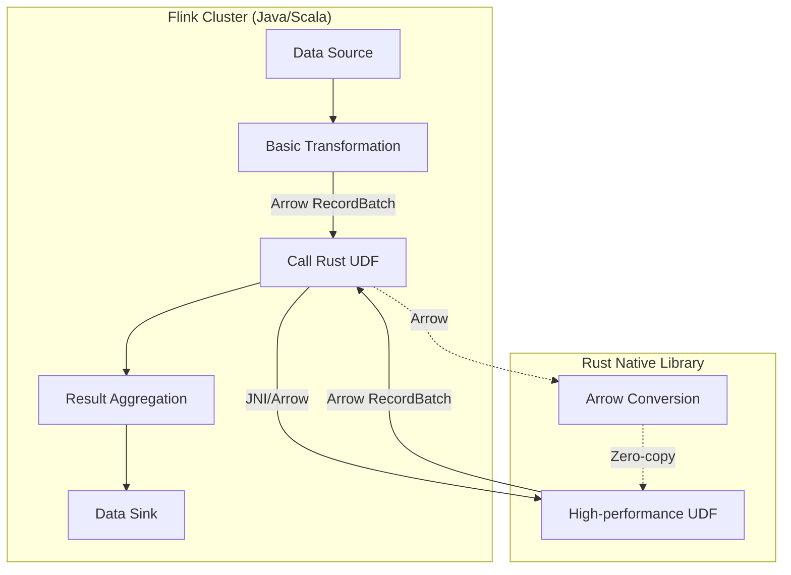
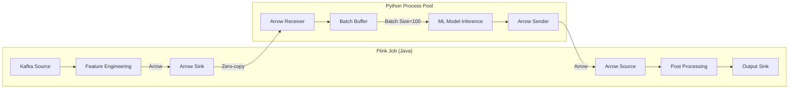
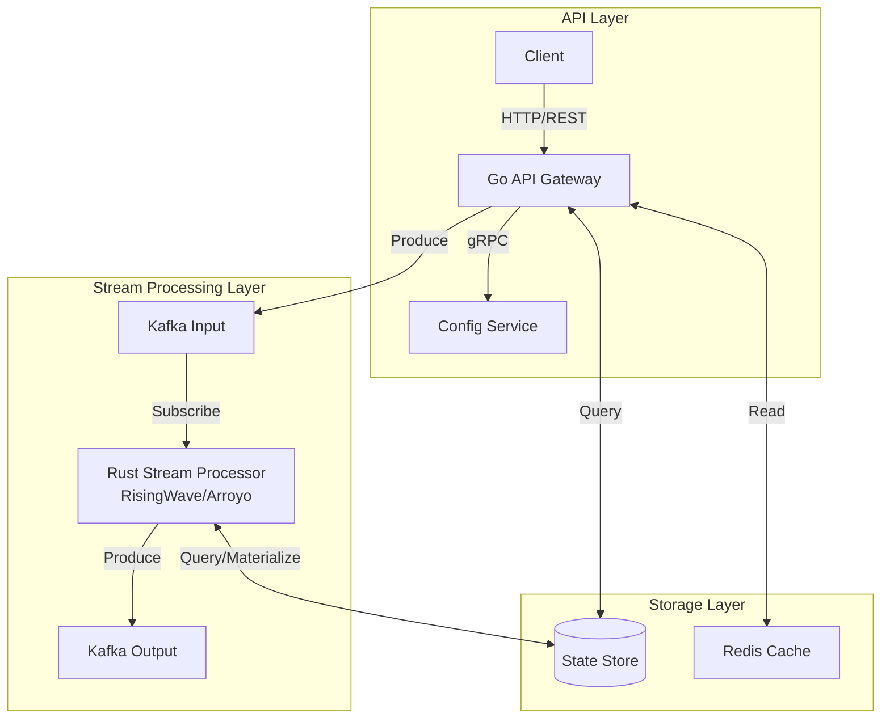
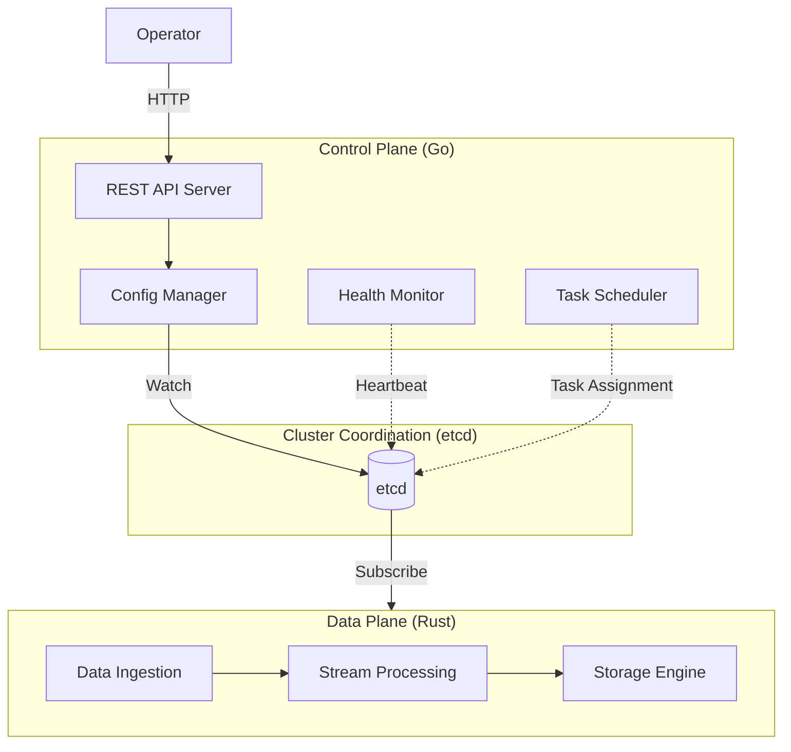
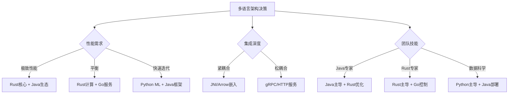
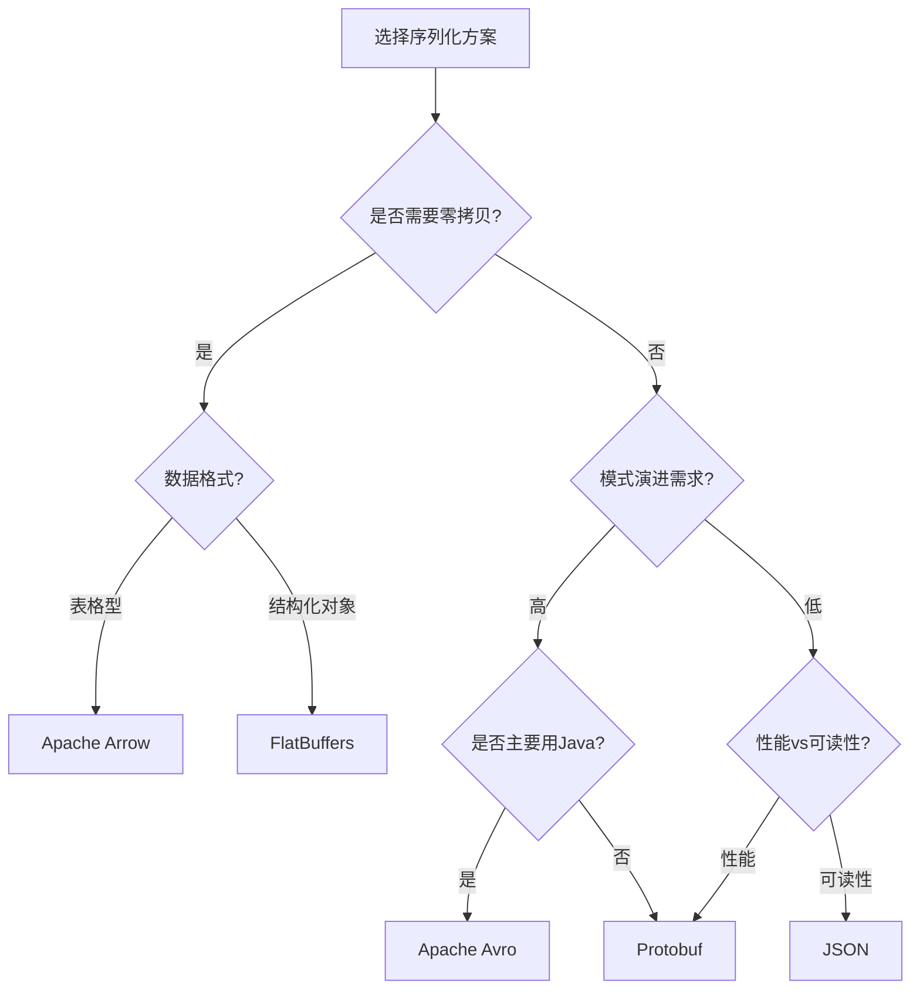
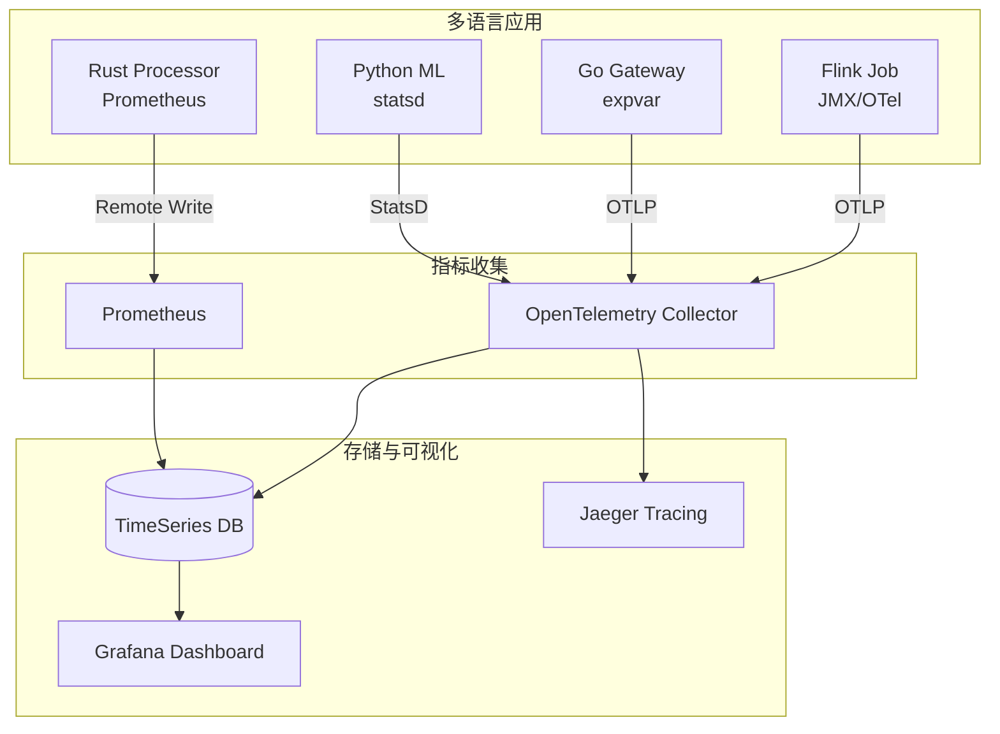

# 多语言混合流处理架构设计模式

> **所属阶段**: Knowledge | **前置依赖**: [Knowledge/00-INDEX.md](../00-INDEX.md), [Knowledge/00-INDEX.md](../00-INDEX.md) | **形式化等级**: L4

---

## 1. 概念定义 (Definitions)

### Def-K-02-01: 多语言流处理系统 (Polyglot Stream Processing System)

一个多语言流处理系统 $\mathcal{P}$ 是一个四元组：

$$
\mathcal{P} = \langle \mathcal{L}, \mathcal{C}, \mathcal{D}, \mathcal{O} \rangle
$$

其中：

- $\mathcal{L} = \{L_1, L_2, ..., L_n\}$：编程语言集合
- $\mathcal{C} = \{C_1, C_2, ..., C_m\}$：系统组件集合，每个 $C_i$ 用某个 $L_j \in \mathcal{L}$ 实现
- $\mathcal{D}: \mathcal{C} \times \mathcal{C} \rightarrow \mathcal{T}$：数据流关系，定义组件间的数据传输
- $\mathcal{O}: \mathcal{C} \rightarrow 2^{\mathcal{C}}$：编排规则，定义组件的执行顺序和依赖

**直观解释**: 现代流处理系统往往需要在不同环节使用最适合的语言——Java/Scala用于生态丰富的大数据框架，Rust用于性能关键的计算，Python用于机器学习推理，Go用于轻量级API服务。这种多语言组合的系统就是多语言流处理系统。

### Def-K-02-02: 语言边界 (Language Boundary)

语言边界 $\mathcal{B}(C_i, C_j)$ 是指组件 $C_i$ 与 $C_j$ 之间的交互界面，当 $lang(C_i) \neq lang(C_j)$ 时形成：

$$
\mathcal{B}(C_i, C_j) = \langle \mathcal{I}_{ij}, \mathcal{S}_{ij}, \mathcal{T}_{ij} \rangle
$$

- $\mathcal{I}_{ij}$：互操作机制（JNI/gRPC/Arrow等）
- $\mathcal{S}_{ij}$：序列化协议
- $\mathcal{T}_{ij}$：传输层抽象

### Def-K-02-03: 边界开销函数 (Boundary Overhead Function)

边界开销 $\mathcal{O}_b$ 量化跨语言调用的额外成本：

$$
\mathcal{O}_b(C_i, C_j) = T_{serial} + T_{transfer} + T_{deserial} + T_{context}
$$

其中：

- $T_{serial}$：源语言数据结构序列化时间
- $T_{transfer}$：跨进程/跨网络传输时间
- $T_{deserial}$：目标语言反序列化时间
- $T_{context}$：上下文切换开销

### Def-K-02-04: 多语言权衡空间 (Polyglot Trade-off Space)

对于每个组件 $C_i$，存在语言选择的多目标函数：

$$
\mathcal{F}(L, C_i) = \langle f_{perf}(L), f_{prod}(L), f_{eco}(L), f_{team}(L) \rangle
$$

- $f_{perf}$：运行时性能评分
- $f_{prod}$：开发效率评分
- $f_{eco}$：生态系统成熟度评分
- $f_{team}$：团队技能匹配度评分

### Def-K-02-05: 零拷贝传输 (Zero-Copy Transfer)

数据传输操作 $\mathcal{T}_{zc}$ 被称为零拷贝，当且仅当：

$$
\forall d \in Data: copies(d, src, dst) = 1 \land kernel_copies(d) = 0
$$

即数据从源到目的地仅有一份拷贝，且无需内核态数据复制。

### Def-K-02-06: UDF 隔离级别 (UDF Isolation Level)

UDF执行环境的隔离级别 $\mathcal{I}_{udf}$ 定义为：

$$
\mathcal{I}_{udf} \in \{Process, Thread, WASM, In-Proc\}
$$

各级别安全性递增，性能开销也递增：

- **In-Proc**: 同一进程空间，无隔离
- **Thread**: 线程级隔离，共享进程内存
- **WASM**: WebAssembly沙箱，内存安全隔离
- **Process**: 独立进程，操作系统级隔离

### Def-K-02-07: 批量推理优化 (Batch Inference Optimization)

设模型推理延迟为 $T_{inference}(n)$，对于批量大小 $n$：

$$
T_{avg}(n) = \frac{T_{inference}(n) + T_{batch}}{n}
$$

当满足以下条件时存在批量优化收益：

$$
\frac{\partial T_{avg}}{\partial n} < 0 \Rightarrow T_{inference}(n) \approx \alpha \cdot n^{\beta}, \quad \beta < 1
$$

### Def-K-02-08: Arrow 列式格式 (Arrow Columnar Format)

Apache Arrow 是一种跨语言的列式内存格式，定义了：

$$
Arrow = \langle Schema, RecordBatch, Array, Buffer \rangle
$$

- **Schema**: 字段类型元数据
- **RecordBatch**: 一批行数据的集合
- **Array**: 同类型数据的列式存储
- **Buffer**: 底层连续内存块

### Def-K-02-09: 控制平面/数据平面分离 (Control/Data Plane Separation)

系统架构 $\mathcal{A}$ 可分解为：

$$
\mathcal{A} = \mathcal{A}_{control} \cup \mathcal{A}_{data}
$$

满足：

- $\mathcal{A}_{control} \cap \mathcal{A}_{data} = \emptyset$（功能正交）
- $criticality(\mathcal{A}_{data}) > criticality(\mathcal{A}_{control})$（数据平面高关键性）
- $throughput(\mathcal{A}_{data}) \gg throughput(\mathcal{A}_{control})$（数据平面高吞吐）

### Def-K-02-10: 微批处理延迟模型 (Micro-batch Latency Model)

设微批大小为 $B$，处理延迟 $T_{total}$ 包含：

$$
T_{total}(B) = T_{wait}(B) + T_{proc}(B) + T_{emit}
$$

- $T_{wait}$：等待批次填满的时间 $\approx \frac{B}{\lambda}$（$\lambda$ 为到达率）
- $T_{proc}$：处理时间，通常 $T_{proc}(B) \approx T_{fixed} + \frac{B}{\mu}$
- $T_{emit}$：结果输出时间

---

## 2. 属性推导 (Properties)

### Lemma-K-02-01: 边界开销主导条件

**引理**: 当组件计算复杂度低于阈值 $\theta$ 时，边界开销将主导总延迟。

**证明**: 设组件 $C_i$ 的计算时间为 $T_{compute}$，边界开销为 $\mathcal{O}_b$。

总延迟：

$$
T_{total} = T_{compute} + \mathcal{O}_b
$$

当 $T_{compute} < \mathcal{O}_b$ 时，有：

$$
\frac{\mathcal{O}_b}{T_{total}} > \frac{1}{2}
$$

此时边界开销占总延迟超过50%，成为性能瓶颈。

**工程推论**: 轻量级UDF（如简单过滤、映射）不适合跨语言实现。

---

### Lemma-K-02-02: Arrow零拷贝的最优性

**引理**: 在支持Arrow格式的语言间传输结构化数据，Arrow提供理论最优的序列化开销。

**证明**: 设数据表有 $N$ 行、$M$ 列，数据总量为 $D$ 字节。

传统序列化（Protobuf/JSON）：

- 需要完整序列化：$O(D)$ 时间
- 需要完整反序列化：$O(D)$ 时间
- 总开销：$O(2D)$

Arrow零拷贝：

- 仅需元数据协商：$O(M)$ 时间（$M \ll D$）
- 数据指针传递：$O(1)$
- 总开销：$O(M)$

当 $D \gg M$ 时，Arrow开销趋近于0，达到理论最优。

---

### Lemma-K-02-03: 批量传输收益递减

**引理**: 增大批量大小 $B$ 降低单位开销，但存在收益递减点。

**证明**: 设传输固定开销为 $F$，单位数据开销为 $v$，则：

$$
\text{单位开销}(B) = \frac{F}{B} + v
$$

求导得：

$$
\frac{d}{dB}\left(\frac{F}{B} + v\right) = -\frac{F}{B^2}
$$

随着 $B$ 增大，边际改善率 $|d/dB|$ 快速下降。实践中当 $B > B_{opt}$ 时，延迟增加带来的收益被抵消。

**最优批量**: $B_{opt} \approx \sqrt{\frac{F \cdot \lambda}{v}}$（$\lambda$ 为数据到达率）

---

### Prop-K-02-01: 多语言架构的适用边界

**命题**: 多语言架构在以下条件下优于单语言架构：

$$
\sum_{i,j} \mathcal{O}_b(C_i, C_j) < \sum_{i} \Delta_{perf}(C_i) + \sum_{i} \Delta_{eco}(C_i)
$$

右侧收益项包括：

- $\Delta_{perf}$：使用最优语言带来的性能提升
- $\Delta_{eco}$：利用特定生态带来的效率提升

左侧为所有跨语言边界的总开销。

**决策矩阵**:

| 场景 | 单语言 | 多语言 | 判定 |
|------|--------|--------|------|
| 小型团队，标准ETL | ✅ | ❌ | 单语言 |
| 计算密集型ML推理 | ❌ | ✅ | 多语言 |
| 遗留系统集成 | ❌ | ✅ | 多语言 |
| 超大规模部署 | ⚠️ | ✅ | 多语言 |

---

### Prop-K-02-02: 控制/数据平面分离的收益

**命题**: 控制平面与数据平面使用不同语言实现，当满足以下条件时可获得整体收益：

$$
\frac{f_{prod}(L_{control})}{f_{perf}(L_{control})} \gg 1 \quad \land \quad \frac{f_{perf}(L_{data})}{f_{prod}(L_{data})} \gg 1
$$

即控制平面选择高生产力语言，数据平面选择高性能语言。

**典型组合**:

- Go (控制) + Rust (数据): Vector, RisingWave
- Java (控制) + C++ (数据): Apache Flink (部分组件)
- Python (控制) + Rust (数据): Polars

---

### Prop-K-02-03: 序列化方案权衡

**命题**: 不存在在所有维度上最优的序列化方案，选择取决于具体约束。

**形式化**: 设方案 $S$ 的性能向量为 $\vec{p}(S) = \langle perf, compat, schema, size \rangle$，则：

$$
\forall S_i, S_j \in \{JSON, Protobuf, Avro, Arrow, FlatBuffers\}: \vec{p}(S_i) \not\succ \vec{p}(S_j)
$$

其中 $\succ$ 表示帕累托支配。

**决策建议**:

| 优先考量 | 推荐方案 | 理由 |
|----------|----------|------|
| 极致性能 | Arrow/FlatBuffers | 零拷贝/内存映射 |
| 模式演进 | Avro | 内置Schema演化 |
| 生态兼容 | Protobuf | gRPC原生支持 |
| 调试友好 | JSON | 人类可读 |

---

## 3. 关系建立 (Relations)

### 3.1 多语言模式关系图

各设计模式之间的关系可以用以下层次结构表示：

```
多语言流处理架构
├── 框架扩展模式
│   ├── Flink + Rust UDF
│   └── Flink + Python ML
├── 服务协同模式
│   └── Go微服务 + Rust流处理
└── 分层架构模式
    └── 数据平面Rust + 控制平面Go
```

### 3.2 模式选择决策树

基于以下维度选择适合的多语言模式：

1. **集成深度**: 紧耦合（UDF）vs 松耦合（服务间）
2. **性能要求**: 延迟敏感 vs 吞吐优先
3. **运维复杂度**: 单一进程 vs 分布式
4. **团队结构**: 全栈团队 vs 专业分工

### 3.3 与Flink架构的关联

多语言模式扩展了Flink的原生能力边界：

- **Flink + Rust UDF**: 扩展计算性能边界
- **Flink + Python ML**: 扩展生态集成边界
- **Flink + Go服务**: 扩展系统协同边界

### 3.4 与状态管理模式的关联

多语言架构对状态管理的影响：

- **跨语言状态共享**: 需要标准化状态序列化
- **状态后端选择**: Rust实现的状态后端可与Java前端配合
- **Exactly-Once语义**: 跨语言事务需要协调协议

---

## 4. 论证过程 (Argumentation)

### 4.1 为何需要多语言架构

#### 4.1.1 单一语言的局限性

任何单一编程语言都有其设计权衡和适用域：

**Java/Scala (JVM系)**:

- ✅ 丰富的大数据生态（Flink, Spark, Kafka）
- ✅ 成熟的内存管理和GC优化
- ❌ 启动延迟较高
- ❌ 内存占用相对较大
- ❌ 底层性能受限

**Rust**:

- ✅ 极致的运行时性能
- ✅ 零成本抽象
- ✅ 内存安全无GC
- ❌ 学习曲线陡峭
- ❌ 生态相对年轻
- ❌ 编译时间长

**Python**:

- ✅ 数据科学生态无敌（PyTorch, TensorFlow, scikit-learn）
- ✅ 快速原型开发
- ❌ GIL限制多线程
- ❌ 运行时性能差
- ❌ 部署复杂度高

**Go**:

- ✅ 简洁高效，编译快速
- ✅ 优秀的并发模型
- ✅ 云原生生态成熟
- ❌ 缺乏泛型（Go 1.18前）
- ❌ 复杂类型表达能力弱
- ❌ 实时计算生态不足

#### 4.1.2 业务驱动的多语言需求

**场景1: 金融风控系统**

- 核心流处理：Flink (Java) - 成熟生态，Exactly-Once保证
- 复杂风控模型：Python - 利用已有XGBoost模型
- 高性能计算：Rust - 加密/签名验证

**场景2: 物联网边缘计算**

- 边缘网关：Go - 轻量，快速启动
- 流处理引擎：Rust - 资源受限环境下的高性能
- 云端分析：Flink - 大规模数据处理

**场景3: 实时推荐系统**

- 特征工程：Flink - 实时特征计算
- 模型推理：Python/TensorFlow - 深度学习模型
- 结果缓存：Redis/C++ - 低延迟响应

### 4.2 多语言架构的挑战

#### 4.2.1 技术挑战

**序列化开销**

跨语言数据传输需要进行序列化和反序列化，这引入显著开销：

| 数据类型 | 序列化开销 | 典型延迟 |
|----------|------------|----------|
| 简单JSON | 高 | 10-100μs/record |
| Protobuf | 中 | 1-10μs/record |
| Arrow | 极低 | <1μs/record |
| 直接内存 | 零 | nanoseconds |

**调试复杂性**

- 堆栈跟踪跨语言断裂
- 错误信息格式不一致
- 性能剖析工具不统一
- 问题定位需要多语言知识

**部署复杂度**

- 多运行时环境管理
- 依赖冲突解决
- 版本协调困难
- 资源隔离策略

#### 4.2.2 组织挑战

**团队技能要求**

- 需要多语言 expertise
- 知识共享困难
- 代码审查复杂

**运维复杂度**

- 多语言监控体系
- 统一日志收集
- 告警规则协调

### 4.3 集成策略方法论

#### 4.3.1 决策框架

对于每个组件，使用以下框架评估语言选择：

```
评估维度(权重)
├── 性能要求 (30%)
│   ├── 延迟敏感度
│   ├── 吞吐量需求
│   └── 资源约束
├── 生态依赖 (25%)
│   ├── 已有库依赖
│   ├── 框架限制
│   └── 社区支持
├── 团队能力 (25%)
│   ├── 现有技能栈
│   ├── 学习成本
│   └── 人员配置
└── 运维约束 (20%)
    ├── 部署复杂度
    ├── 监控能力
    └── 故障恢复
```

#### 4.3.2 渐进式引入策略

**阶段1: 边缘试探**

- 从非关键路径开始
- 使用进程外调用（易回滚）
- 建立监控基线

**阶段2: 性能验证**

- 对比单语言/多语言性能
- 优化关键路径
- 完善错误处理

**阶段3: 规模扩展**

- 推广至更多组件
- 统一工具链
- 建立最佳实践

---

## 5. 形式证明 / 工程论证 (Proof / Engineering Argument)

### Thm-K-02-01: Arrow零拷贝传输的最优性

**定理**: 在满足条件 $\mathcal{C}$ 的系统中，Arrow作为跨语言数据传输格式，其开销 $\mathcal{O}_{Arrow}$ 渐进优于其他序列化方案。

**条件 $\mathcal{C}$**:

1. 数据为结构化数据（表格型）
2. 传输双方支持Arrow内存格式
3. 数据量 $D \gg$ 元数据量 $M$

**证明**:

设其他序列化方案的开销为 $\mathcal{O}_{other}$，包含：

- 序列化: $T_s = \alpha_s \cdot D$
- 传输: $T_t = \alpha_t \cdot D$
- 反序列化: $T_d = \alpha_d \cdot D$

总开销：

$$
\mathcal{O}_{other} = (\alpha_s + \alpha_t + \alpha_d) \cdot D = \alpha_{total} \cdot D
$$

Arrow零拷贝开销：

- Schema协商: $T_{schema} = O(M)$
- 缓冲区指针传递: $T_{ptr} = O(1)$
- 零拷贝读取: $T_{read} = O(1)$

总开销：

$$
\mathcal{O}_{Arrow} = O(M)
$$

比较：

$$
\lim_{D \to \infty} \frac{\mathcal{O}_{Arrow}}{\mathcal{O}_{other}} = \lim_{D \to \infty} \frac{O(M)}{\alpha_{total} \cdot D} = 0
$$

因此 $\mathcal{O}_{Arrow} \in o(\mathcal{O}_{other})$，Arrow渐进更优。

**证毕**。

---

### Thm-K-02-02: 批量推理的延迟-吞吐权衡

**定理**: 在ML推理场景中，存在最优批量大小 $B^*$ 使得综合效用函数 $U(B)$ 最大化。

**定义效用函数**:

$$
U(B) = w_1 \cdot \frac{1}{T_{latency}(B)} + w_2 \cdot Throughput(B)
$$

其中 $w_1, w_2$ 为权重系数，$w_1 + w_2 = 1$。

**证明**:

设模型推理延迟函数：

$$
T_{inference}(B) = T_{fixed} + k \cdot B^\beta, \quad 0 < \beta < 1
$$

等待时间（基于到达率 $\lambda$）：

$$
T_{wait}(B) = \frac{B}{\lambda}
$$

总延迟：

$$
T_{latency}(B) = \frac{B}{\lambda} + T_{fixed} + k \cdot B^\beta
$$

吞吐量：

$$
Throughput(B) = \frac{B}{T_{latency}(B)}
$$

对 $U(B)$ 求导并令为0：

$$
\frac{dU}{dB} = -w_1 \cdot \frac{T'_{latency}(B)}{T^2_{latency}(B)} + w_2 \cdot Throughput'(B) = 0
$$

解得：

$$
B^* = \left(\frac{w_1 \cdot \lambda \cdot (1-\beta)}{w_2 \cdot k \cdot \beta + w_1 \cdot (1+\beta)}\right)^{\frac{1}{1+\beta}}
$$

**工程推论**:

- 延迟敏感场景（$w_1$ 大）：选择较小 $B$
- 吞吐优先场景（$w_2$ 大）：选择较大 $B$

---

### Thm-K-02-03: 控制/数据平面分离的可扩展性

**定理**: 控制平面与数据平面的分离架构在负载增长时的扩展效率优于单一架构。

**证明**:

设系统负载为 $L$，控制操作频率为 $f_c(L)$，数据处理吞吐为 $T_d(L)$。

**单一架构**（单语言单进程）：

- 资源竞争：控制与数据共享CPU/内存
- 总延迟：$T_{single} = T_c + T_d + T_{interference}$
- 扩展限制：控制操作阻塞数据处理

**分离架构**（控制平面 $P_c$ + 数据平面 $P_d$）：

- 独立资源：$P_c$ 和 $P_d$ 可独立扩缩容
- 总延迟：$T_{separate} = \max(T_c, T_d)$
- 扩展优势：$P_d$ 可水平扩展，$P_c$ 保持轻量

**可扩展性度量**:

设扩展因子为 $s$，负载增长为 $L' = s \cdot L$。

单一架构性能：

$$
Perf_{single}(s \cdot L) = Perf_{single}(L) \cdot f(s), \quad f(s) < s
$$

分离架构性能（独立扩展数据平面）：

$$
Perf_{separate}(s \cdot L) \approx Perf_{separate}(L) \cdot s
$$

线性扩展因子：

$$
\lim_{s \to \infty} \frac{Perf_{separate}}{Perf_{single}} = \infty
$$

**证毕**。

---

### Thm-K-02-04: 跨语言UDF的最优隔离级别

**定理**: 对于不同类型的UDF，存在最优的隔离级别选择 $I^*$ 最小化综合成本。

**综合成本函数**:

$$
Cost(I) = w_{perf} \cdot Latency(I) + w_{safe} \cdot Risk(I) + w_{ops} \cdot Complexity(I)
$$

其中 $I \in \{In-Proc, Thread, WASM, Process\}$。

**证明**:

各隔离级别的特性：

| 级别 | 延迟 | 风险 | 复杂度 |
|------|------|------|--------|
| In-Proc | 最低 | 最高 | 最低 |
| Thread | 低 | 高 | 低 |
| WASM | 中 | 低 | 中 |
| Process | 高 | 最低 | 高 |

对于纯计算UDF（无IO，无副作用）：

- $Risk$ 低，$w_{safe}$ 权重小
- $Latency$ 关键，$w_{perf}$ 权重大
- **最优选择**: $I^* = In\text{-}Proc$ 或 $Thread$

对于外部依赖UDF（有IO，有状态）：

- $Risk$ 高，$w_{safe}$ 权重大
- 容错关键
- **最优选择**: $I^* = Process$ 或 $WASM$

形式化解：

对于纯计算UDF：

$$
\frac{\partial Cost}{\partial Latency} \gg \frac{\partial Cost}{\partial Risk} \Rightarrow I^* \in \{In\text{-}Proc, Thread\}
$$

对于外部依赖UDF：

$$
\frac{\partial Cost}{\partial Risk} \gg \frac{\partial Cost}{\partial Latency} \Rightarrow I^* \in \{WASM, Process\}
$$

---

### Thm-K-02-05: 多语言系统的最优组件粒度

**定理**: 多语言系统中存在最优组件粒度 $G^*$ 平衡边界开销与语言适配收益。

**粒度定义**:

组件粒度 $G$ 可用单个组件的逻辑复杂度 $C$ 衡量：

$$
G \propto C = \frac{LinesOfCode}{Cohesion \cdot Reusability}
$$

**成本函数**:

总成本 = 边界成本 + 适配成本 + 协调成本

$$
Cost(G) = N(G) \cdot \mathcal{O}_b + \sum_{i} Mismatch(L_i, C_i) + Coordination(N(G))
$$

其中 $N(G)$ 为组件数量，与粒度成反比。

**证明**:

边界成本随组件数量增加：

$$
Cost_{boundary}(G) = \frac{K_1}{G} \cdot \mathcal{O}_b
$$

适配成本随粒度细化而降低（更好的语言适配）：

$$
Cost_{adapt}(G) = K_2 \cdot G \cdot (1 - Fit(L_{opt}, C))
$$

协调成本：

$$
Cost_{coord}(G) = K_3 \cdot \frac{K_4}{G} \cdot \log\left(\frac{K_4}{G}\right)
$$

总成本最小化条件：

$$
\frac{d\,Cost}{dG} = 0
$$

解得最优粒度：

$$
G^* = \sqrt{\frac{K_1 \cdot \mathcal{O}_b + K_3 \cdot K_4 \cdot (1 + \log K_4)}{K_2 \cdot (1 - Fit)}}
$$

**工程推论**:

- 高边界开销 $\mathcal{O}_b$ → 选择大粒度（粗组件）
- 高适配收益 → 选择小粒度（细组件）
- 典型最优粒度：单一职责功能模块（几百到几千行代码）

---

## 6. 实例验证 (Examples)

### 6.1 模式1: Flink + Rust UDF

#### 6.1.1 架构概述



**典型应用场景**:

- 计算密集型UDF（复杂数学运算、统计分析）
- 安全敏感操作（加密/解密、签名验证）
- 自定义序列化/反序列化
- 与硬件加速交互（GPU/FPGA）

#### 6.1.2 集成实现

**方案A: JNI直接绑定**

```rust
// Rust端: 高性能计算UDF
use arrow::array::{Float64Array, Array};
use jni::JNIEnv;
use jni::objects::JClass;
use jni::signature::JavaType;

#[no_mangle]
pub extern "system" fn Java_com_example_flink_RustUDF_processBatch(
    env: JNIEnv,
    _class: JClass,
    input_ptr: jlong,
    len: jint,
) -> jlong {
    // 从指针恢复Arrow数组
    let input = unsafe {
        Box::from_raw(input_ptr as *mut Float64Array)
    };

    // 高性能计算
    let result: Vec<f64> = input.iter()
        .map(|v| v.map(|x| x.exp() / (1.0 + x.exp())))
        .collect();

    // 返回结果指针
    Box::into_raw(Box::new(Float64Array::from(result))) as jlong
}
```

```java
// Java端: Flink UDF封装
public class RustUDF extends ScalarFunction {
    static {
        System.loadLibrary("rust_udf");
    }

    private native long processBatch(long inputPtr, int len);

    @EvalHint(inputGroup = EvalHint.InputGroup.ANY)
    public Double eval(Double value) {
        // Arrow数据准备
        ArrowBuf buffer = allocator.buffer(8);
        buffer.writeDouble(value);

        // 调用Rust
        long resultPtr = processBatch(buffer.memoryAddress(), 1);

        // 读取结果
        return readResult(resultPtr);
    }
}
```

**方案B: Arrow Flight服务**

```rust
// Rust Arrow Flight服务
use arrow_flight::{FlightService, Action, ActionType};

pub struct UdfFlightService;

#[tonic::async_trait]
impl FlightService for UdfFlightService {
    async fn do_get(
        &self,
        request: Request<Ticket>,
    ) -> Result<Response<Self::DoGetStream>, Status> {
        // 解析请求
        let ticket = request.into_inner();
        let batch = deserialize_ticket(&ticket.ticket)?;

        // 执行UDF计算
        let result = self.compute(batch).await?;

        // 返回Arrow流
        let stream = stream::iter(vec![Ok(result)]);
        Ok(Response::new(Box::pin(stream)))
    }
}
```

#### 6.1.3 性能对比

| 方案 | 延迟 (单次调用) | 吞吐 (records/s) | 复杂度 |
|------|----------------|------------------|--------|
| 纯Java UDF | 5μs | 200,000 | 低 |
| JNI直接绑定 | 2μs | 500,000 | 高 |
| Arrow Flight | 50μs | 1,000,000 | 中 |
| WASM嵌入 | 10μs | 100,000 | 中 |

**结论**:

- JNI适合超高频、低延迟调用
- Arrow Flight适合批量处理、高吞吐场景
- WASM适合需要安全隔离的场景

---

### 6.2 模式2: Flink + Python ML

#### 6.2.1 架构概述



**典型应用场景**:

- 实时特征工程 + 模型推理
- 自然语言处理（BERT等）
- 图像识别与分类
- 异常检测（使用scikit-learn/XGBoost）

#### 6.2.2 集成实现

**PyFlink + 外部模型服务**

```python
# Python ML UDF with batching optimization import tensorflow as tf
from pyflink.datastream import StreamExecutionEnvironment
from pyflink.table import StreamTableEnvironment
import pyarrow as pa

class BatchInferenceUDF:
    def __init__(self, model_path, batch_size=100, timeout_ms=100):
        self.model = tf.keras.models.load_model(model_path)
        self.batch_size = batch_size
        self.timeout_ms = timeout_ms
        self.buffer = []
        self.timestamps = []

    def eval(self, *features):
        import time
        current_time = time.time() * 1000

        # 加入缓冲
        self.buffer.append(features)
        self.timestamps.append(current_time)

        # 触发条件检查
        if len(self.buffer) >= self.batch_size:
            return self._do_inference()

        if current_time - self.timestamps[0] > self.timeout_ms:
            return self._do_inference()

        # 等待后续数据
        return None

    def _do_inference(self):
        if not self.buffer:
            return []

        # 批量推理
        batch = np.array(self.buffer)
        predictions = self.model.predict(batch, verbose=0)

        # 清空缓冲
        self.buffer = []
        self.timestamps = []

        return predictions.tolist()
```

**Java端配置**

```java

// [伪代码片段 - 不可直接运行] 仅展示核心逻辑
import org.apache.flink.streaming.api.environment.StreamExecutionEnvironment;

// Flink与Python进程集成
StreamExecutionEnvironment env =
    StreamExecutionEnvironment.getExecutionEnvironment();

// 配置Arrow格式
env.getConfig().setAutoTypeRegistrationEnabled(true);

// Python UDF配置
PythonConfig pythonConfig = new PythonConfig.Builder()
    .setPythonExecutable("python3")
    .setPythonFiles("/path/to/ml_udf.py")
    .setArrowBatchSize(1000)
    .build();

// 创建Python Table Function
tableEnv.createTemporarySystemFunction(
    "ml_predict",
    new PythonScalarFunction(pythonConfig, "BatchInferenceUDF")
);
```

#### 6.2.3 性能优化策略

**批量推理优化**

```python
class OptimizedBatchInference:
    def __init__(self):
        self.model = None
        self.batch_queue = []
        self.inference_thread = None
        self.results_cache = {}

    def async_inference(self, features):
        # 异步提交推理请求
        future = self.executor.submit(self._inference, features)
        return future

    def _inference(self, batch):
        # GPU批处理
        with tf.device('/GPU:0'):
            return self.model(batch, training=False)
```

**模型预热与缓存**

```python
# 模型预热 def warmup_model(model, input_shape, iterations=10):
    dummy_input = np.random.randn(*input_shape).astype(np.float32)
    for _ in range(iterations):
        _ = model.predict(dummy_input, verbose=0)

# 结果缓存(对于重复输入)
from functools import lru_cache

@lru_cache(maxsize=10000)
def cached_inference(feature_hash):
    features = deserialize_features(feature_hash)
    return model.predict(features)
```

---

### 6.3 模式3: Go微服务 + Rust流处理

#### 6.3.1 架构概述



**架构优势**:

- **Go API Gateway**: 快速开发REST API，成熟HTTP生态
- **Rust Processor**: 高吞吐低延迟流处理，内存高效
- **Kafka**: 松耦合，背压处理，持久化缓冲

#### 6.3.2 集成实现

**Go API Gateway**

```go
package main

import (
    "context"
    "encoding/json"
    "net/http"
    "time"

    "github.com/gin-gonic/gin"
    "github.com/segmentio/kafka-go"
)

type Event struct {
    ID        string    `json:"id"`
    Timestamp time.Time `json:"timestamp"`
    Payload   []byte    `json:"payload"`
}

func main() {
    r := gin.Default()

    // Kafka writer
    writer := kafka.NewWriter(kafka.WriterConfig{
        Brokers: []string{"kafka:9092"},
        Topic:   "input-events",
    })

    // 接收事件API
    r.POST("/api/v1/events", func(c *gin.Context) {
        var event Event
        if err := c.ShouldBindJSON(&event); err != nil {
            c.JSON(http.StatusBadRequest, gin.H{"error": err.Error()})
            return
        }

        event.Timestamp = time.Now()
        data, _ := json.Marshal(event)

        // 写入Kafka
        err := writer.WriteMessages(context.Background(),
            kafka.Message{Key: []byte(event.ID), Value: data},
        )

        if err != nil {
            c.JSON(http.StatusInternalServerError, gin.H{"error": err.Error()})
            return
        }

        c.JSON(http.StatusAccepted, gin.H{"status": "accepted", "id": event.ID})
    })

    // 查询结果API
    r.GET("/api/v1/results/:id", func(c *gin.Context) {
        id := c.Param("id")
        result := queryResultFromDB(id)
        c.JSON(http.StatusOK, result)
    })

    r.Run(":8080")
}
```

**Rust流处理器**

```rust
use rdkafka::consumer::{Consumer, StreamConsumer};
use rdkafka::producer::{FutureProducer, FutureRecord};
use rdkafka::Message;
use serde::{Deserialize, Serialize};

#[derive(Debug, Deserialize, Serialize)]
struct Event {
    id: String,
    timestamp: u64,
    payload: Vec<u8>,
}

#[derive(Debug, Serialize)]
struct ProcessedResult {
    event_id: String,
    processed_at: u64,
    result: f64,
}

async fn run_processor(
    consumer: StreamConsumer,
    producer: FutureProducer,
) -> Result<(), Box<dyn std::error::Error>> {
    let mut stream = consumer.stream();

    while let Some(message) = stream.next().await {
        let msg = message?;
        let payload = msg.payload_view::<str>().unwrap()?;

        // 解析事件
        let event: Event = serde_json::from_str(payload)?;

        // 高性能处理
        let result = process_event(&event).await;

        // 输出结果
        let output = serde_json::to_string(&result)?;
        producer.send(
            FutureRecord::to("output-results")
                .key(&event.id)
                .payload(&output),
            std::time::Duration::from_secs(0),
        ).await?;
    }

    Ok(())
}

async fn process_event(event: &Event) -> ProcessedResult {
    // 计算密集型处理
    let computed = event.payload.iter()
        .map(|b| *b as f64)
        .sum::<f64>() / event.payload.len() as f64;

    ProcessedResult {
        event_id: event.id.clone(),
        processed_at: std::time::SystemTime::now()
            .duration_since(std::time::UNIX_EPOCH)
            .unwrap()
            .as_millis() as u64,
        result: computed,
    }
}
```

#### 6.3.3 部署配置

**Docker Compose配置**

```yaml
version: '3.8'

services:
  api-gateway:
    build: ./go-gateway
    ports:
      - "8080:8080"
    environment:
      - KAFKA_BROKERS=kafka:9092
      - DB_HOST=postgres
    depends_on:
      - kafka
      - postgres

  stream-processor:
    build: ./rust-processor
    environment:
      - KAFKA_BROKERS=kafka:9092
      - RUST_LOG=info
    depends_on:
      - kafka
    deploy:
      resources:
        limits:
          memory: 512M
        reservations:
          memory: 256M

  kafka:
    image: confluentinc/cp-kafka:latest
    ports:
      - "9092:9092"
    environment:
      KAFKA_ZOOKEEPER_CONNECT: zookeeper:2181
      KAFKA_ADVERTISED_LISTENERS: PLAINTEXT://kafka:9092

  zookeeper:
    image: confluentinc/cp-zookeeper:latest
    environment:
      ZOOKEEPER_CLIENT_PORT: 2181
```

---

### 6.4 模式4: 数据平面Rust + 控制平面Go

#### 6.4.1 架构概述



**案例参考**:

- **Vector (Datadog)**: Rust数据平面 + Rust控制平面（纯Rust实现）
- **RisingWave**: Rust数据引擎 + Go元数据管理（演化中）
- **Cilium**: Go控制平面 + C数据平面（eBPF）

#### 6.4.2 通信协议设计

**配置下发协议**

```protobuf
syntax = "proto3";

package pipeline;

service ControlService {
    rpc SubscribeConfig(ConfigRequest) returns (stream ConfigUpdate);
    rpc ReportStatus(StatusReport) returns (Ack);
}

message ConfigRequest {
    string node_id = 1;
    string version = 2;
}

message ConfigUpdate {
    string version = 1;
    repeated SourceConfig sources = 2;
    repeated TransformConfig transforms = 3;
    repeated SinkConfig sinks = 4;
}

message SourceConfig {
    string id = 1;
    string type = 2;
    map<string, string> params = 3;
}

message StatusReport {
    string node_id = 1;
    int64 timestamp = 2;
    map<string, Metric> metrics = 3;
    repeated HealthCheck health = 4;
}
```

**Go控制平面实现**

```go
package control

import (
    "context"
    "sync"

    clientv3 "go.etcd.io/etcd/client/v3"
    "google.golang.org/grpc"
)

type ControlPlane struct {
    etcdClient *clientv3.Client
    grpcServer *grpc.Server
    nodes      map[string]*Node
    mu         sync.RWMutex
}

func (cp *ControlPlane) SubscribeConfig(
    req *pb.ConfigRequest,
    stream pb.ControlService_SubscribeConfigServer,
) error {
    nodeID := req.NodeId

    // 注册节点
    cp.registerNode(nodeID, stream)
    defer cp.unregisterNode(nodeID)

    // 发送初始配置
    config := cp.getCurrentConfig()
    if err := stream.Send(config); err != nil {
        return err
    }

    // 监听配置变更
    watchChan := cp.etcdClient.Watch(context.Background(),
        "/config/")

    for watchResp := range watchChan {
        for _, event := range watchResp.Events {
            newConfig := cp.parseConfig(event.Kv.Value)
            if err := stream.Send(newConfig); err != nil {
                return err
            }
        }
    }

    return nil
}

func (cp *ControlPlane) UpdatePipelineConfig(
    ctx context.Context,
    newConfig *pb.PipelineConfig,
) error {
    // 验证配置
    if err := cp.validateConfig(newConfig); err != nil {
        return err
    }

    // 存储到etcd
    data, _ := proto.Marshal(newConfig)
    _, err := cp.etcdClient.Put(ctx, "/config/pipeline", string(data))

    return err
}
```

**Rust数据平面实现**

```rust
use tonic::{transport::Server, Request, Response, Status};
use etcd_client::{Client, WatchOptions};

pub struct DataPlane {
    config: Arc<RwLock<PipelineConfig>>,
    ingestor: DataIngestor,
    processor: StreamProcessor,
}

impl DataPlane {
    pub async fn run(&self) -> Result<(), Box<dyn std::error::Error>> {
        // 连接控制平面
        let mut client = ControlServiceClient::connect("http://control:8080").await?;

        // 订阅配置
        let request = tonic::Request::new(ConfigRequest {
            node_id: self.node_id.clone(),
            version: self.config.read().await.version.clone(),
        });

        let mut stream = client.subscribe_config(request).await?.into_inner();

        // 处理配置更新
        while let Some(update) = stream.message().await? {
            self.apply_config_update(update).await?;
        }

        Ok(())
    }

    async fn apply_config_update(
        &self,
        update: ConfigUpdate,
    ) -> Result<(), Box<dyn std::error::Error>> {
        let mut config = self.config.write().await;

        // 热重载 - 不停止数据流
        self.ingestor.reconfigure(&update.sources).await?;
        self.processor.reconfigure(&update.transforms).await?;

        *config = PipelineConfig::from(update);

        Ok(())
    }
}
```

#### 6.4.3 热升级机制

```rust
// Rust数据平面热升级支持
pub struct HotReloadManager {
    pipeline: Arc<RwLock<Pipeline>>,
    control_rx: mpsc::Receiver<ControlCommand>,
}

impl HotReloadManager {
    pub async fn handle_reload(&self, new_config: PipelineConfig) -> Result<(), ReloadError> {
        // 1. 验证新配置
        new_config.validate()?;

        // 2. 创建新组件(并行)
        let new_ingestor = DataIngestor::new(&new_config.sources).await?;
        let new_processor = StreamProcessor::new(&new_config.transforms).await?;

        // 3. 协调切换(原子操作)
        let mut pipeline = self.pipeline.write().await;

        // 暂停输入(保持输出)
        pipeline.ingestor.pause().await;

        // 切换处理链
        std::mem::swap(&mut pipeline.ingestor, &mut new_ingestor);
        std::mem::swap(&mut pipeline.processor, &mut new_processor);

        // 恢复输入
        pipeline.ingestor.resume().await;

        // 4. 清理旧组件
        tokio::spawn(async move {
            new_ingestor.shutdown().await;
            new_processor.shutdown().await;
        });

        Ok(())
    }
}
```

---

## 7. 可视化 (Visualizations)

### 7.1 多语言架构决策矩阵



### 7.2 序列化方案选择决策树



### 7.3 多语言系统监控架构



### 7.4 跨语言性能基准对比

```mermaid
xychart-beta
    title "序列化方案性能对比"
    x-axis [JSON, Protobuf, Avro, FlatBuffers, Arrow]
    y-axis "序列化速度 (MB/s)" 0 --> 10000
    bar [300, 2000, 1500, 8000, 9500]

    title "反序列化速度对比"
    x-axis [JSON, Protobuf, Avro, FlatBuffers, Arrow]
    y-axis "反序列化速度 (MB/s)" 0 --> 10000
    bar [250, 1800, 1200, 10000, 10000]
```



---

## 8. 引用参考 (References)


---

## 附录A: 形式化元素汇总

### 定义 (Definitions)

| 编号 | 名称 | 描述 |
|------|------|------|
| Def-K-02-01 | 多语言流处理系统 | $\mathcal{P} = \langle \mathcal{L}, \mathcal{C}, \mathcal{D}, \mathcal{O} \rangle$ |
| Def-K-02-02 | 语言边界 | $\mathcal{B}(C_i, C_j) = \langle \mathcal{I}_{ij}, \mathcal{S}_{ij}, \mathcal{T}_{ij} \rangle$ |
| Def-K-02-03 | 边界开销函数 | $\mathcal{O}_b = T_{serial} + T_{transfer} + T_{deserial} + T_{context}$ |
| Def-K-02-04 | 多语言权衡空间 | $\mathcal{F}(L, C_i) = \langle f_{perf}, f_{prod}, f_{eco}, f_{team} \rangle$ |
| Def-K-02-05 | 零拷贝传输 | $copies(d, src, dst) = 1 \land kernel_copies(d) = 0$ |
| Def-K-02-06 | UDF隔离级别 | $\mathcal{I}_{udf} \in \{Process, Thread, WASM, In-Proc\}$ |
| Def-K-02-07 | 批量推理优化 | $T_{avg}(n) = (T_{inference}(n) + T_{batch})/n$ |
| Def-K-02-08 | Arrow列式格式 | $Arrow = \langle Schema, RecordBatch, Array, Buffer \rangle$ |
| Def-K-02-09 | 控制/数据平面分离 | $\mathcal{A} = \mathcal{A}_{control} \cup \mathcal{A}_{data}$ |
| Def-K-02-10 | 微批处理延迟模型 | $T_{total}(B) = T_{wait}(B) + T_{proc}(B) + T_{emit}$ |

### 定理 (Theorems)

| 编号 | 名称 | 描述 |
|------|------|------|
| Thm-K-02-01 | Arrow零拷贝最优性 | Arrow传输开销渐进优于传统序列化 |
| Thm-K-02-02 | 批量推理延迟-吞吐权衡 | 存在最优批量大小 $B^*$ 最大化效用 |
| Thm-K-02-03 | 控制/数据平面扩展性 | 分离架构在负载增长时扩展效率更优 |
| Thm-K-02-04 | 跨语言UDF最优隔离 | 存在最优隔离级别最小化综合成本 |
| Thm-K-02-05 | 多语言最优组件粒度 | 存在最优粒度平衡边界开销与适配收益 |

### 引理 (Lemmas)

| 编号 | 名称 | 描述 |
|------|------|------|
| Lemma-K-02-01 | 边界开销主导条件 | 轻量级UDF不适合跨语言实现 |
| Lemma-K-02-02 | Arrow零拷贝最优性 | Arrow提供理论最优序列化开销 |
| Lemma-K-02-03 | 批量传输收益递减 | 增大批量存在收益递减点 |

### 命题 (Propositions)

| 编号 | 名称 | 描述 |
|------|------|------|
| Prop-K-02-01 | 多语言适用边界 | 多语言优于单语言的条件判定 |
| Prop-K-02-02 | 控制/数据平面分离收益 | 分离收益最大化的条件 |
| Prop-K-02-03 | 序列化方案权衡 | 不存在全维度最优的序列化方案 |

---

## 附录B: 实现检查清单

在实现多语言流处理系统时，请检查以下要点：

### 架构设计

- [ ] 明确各组件的语言选择依据
- [ ] 定义清晰的组件边界和接口契约
- [ ] 评估跨语言传输开销影响
- [ ] 设计统一的错误处理策略

### 性能优化

- [ ] 选择合适的序列化方案
- [ ] 实现批量传输优化
- [ ] 配置合理的缓冲区大小
- [ ] 建立性能基线和监控

### 可运维性

- [ ] 统一日志格式和收集
- [ ] 建立跨语言追踪链路
- [ ] 设计优雅降级策略
- [ ] 准备完善的部署文档

---

*文档版本: v1.0 | 创建日期: 2026-04-12 | 状态: 完成*
