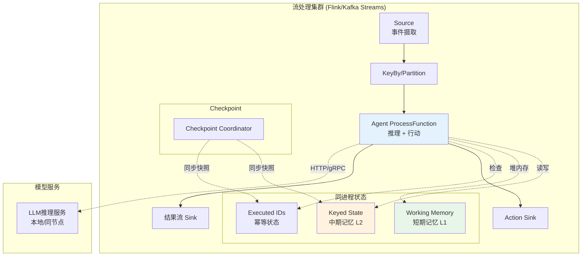
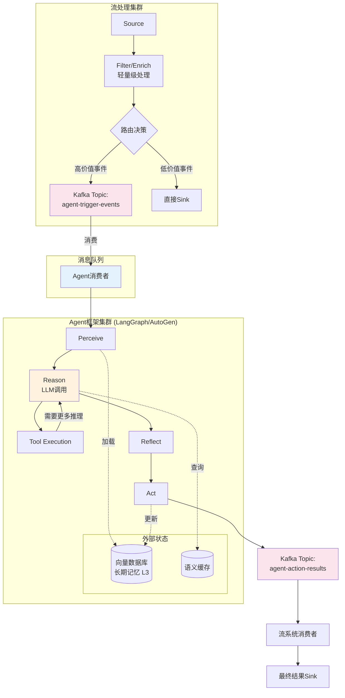
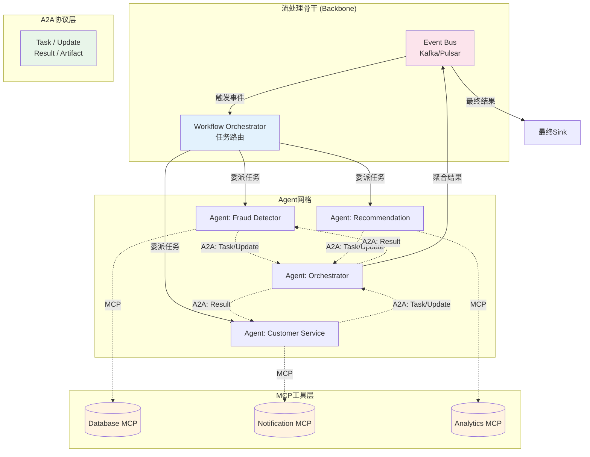
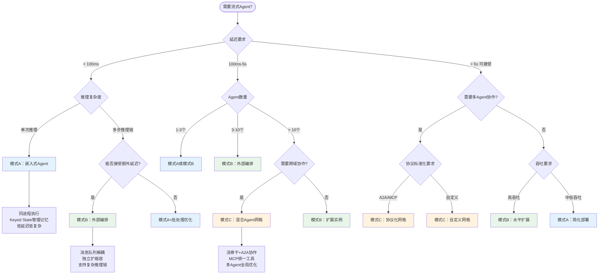

# 流式Agent架构模式

> **所属阶段**: Knowledge/02-design-patterns | **前置依赖**: [pattern-stateful-computation.md](./pattern-stateful-computation.md), [pattern-async-io-enrichment.md](./pattern-async-io-enrichment.md), [../06-frontier/streaming-mcp-a2a-integration.md](../06-frontier/streaming-mcp-a2a-integration.md) | **形式化等级**: L4-L5
>
> 本文档提炼AI Agent与流处理融合的通用设计模式，独立于具体平台（Flink/Confluent/RisingWave），覆盖感知-推理-行动循环的流式实现、三种核心架构模式、状态管理、容错设计、延迟-成本权衡与安全治理。

---

## 目录

- [流式Agent架构模式](#流式agent架构模式)
  - [目录](#目录)
  - [1. 概念定义 (Definitions)](#1-概念定义-definitions)
    - [1.1 流式Agent系统](#11-流式agent系统)
    - [1.2 感知-推理-行动循环](#12-感知-推理-行动循环)
    - [1.3 嵌入式Agent（模式A）](#13-嵌入式agent模式a)
    - [1.4 外部Agent编排（模式B）](#14-外部agent编排模式b)
    - [1.5 混合Agent网格（模式C）](#15-混合agent网格模式c)
    - [1.6 Agent记忆分层](#16-agent记忆分层)
    - [1.7 记忆流与流状态的统一](#17-记忆流与流状态的统一)
  - [2. 属性推导 (Properties)](#2-属性推导-properties)
    - [2.1 模式A延迟下界](#21-模式a延迟下界)
    - [2.2 模式B可扩展性](#22-模式b可扩展性)
    - [2.3 模式C一致性](#23-模式c一致性)
    - [2.4 记忆一致性引理](#24-记忆一致性引理)
  - [3. 关系建立 (Relations)](#3-关系建立-relations)
    - [3.1 三种模式的关系图谱](#31-三种模式的关系图谱)
    - [3.2 与流处理核心概念的映射](#32-与流处理核心概念的映射)
    - [3.3 与Agent协议标准的关联](#33-与agent协议标准的关联)
  - [4. 论证过程 (Argumentation)](#4-论证过程-argumentation)
    - [4.1 模式选择的边界条件](#41-模式选择的边界条件)
    - [4.2 延迟-成本权衡分析](#42-延迟-成本权衡分析)
    - [4.3 反例：非幂等Action的灾难场景](#43-反例非幂等action的灾难场景)
  - [5. 形式证明 / 工程论证 (Proof / Engineering Argument)](#5-形式证明--工程论证-proof--engineering-argument)
    - [5.1 流式Agent Exactly-Once Action定理](#51-流式agent-exactly-once-action定理)
    - [5.2 工程实践论证](#52-工程实践论证)
  - [6. 实例验证 (Examples)](#6-实例验证-examples)
    - [6.1 模式A：嵌入式Agent伪代码](#61-模式a嵌入式agent伪代码)
    - [6.2 模式B：外部Agent编排伪代码](#62-模式b外部agent编排伪代码)
    - [6.3 模式C：混合Agent网格配置示例](#63-模式c混合agent网格配置示例)
  - [7. 可视化 (Visualizations)](#7-可视化-visualizations)
    - [7.1 模式A：嵌入式Agent架构](#71-模式a嵌入式agent架构)
    - [7.2 模式B：外部Agent编排架构](#72-模式b外部agent编排架构)
    - [7.3 模式C：混合Agent网格架构](#73-模式c混合agent网格架构)
    - [7.4 模式选择决策树](#74-模式选择决策树)
  - [8. 引用参考 (References)](#8-引用参考-references)

---

## 1. 概念定义 (Definitions)

### 1.1 流式Agent系统

**Def-K-02-30 [流式Agent系统 (Streaming Agent System)]**: 流式Agent系统是一个六元组 $\mathcal{S}_A = \langle \mathcal{E}, \mathcal{A}, \mathcal{M}, \mathcal{T}, \mathcal{O}, \mathcal{K} \rangle$，其中：

- $\mathcal{E}$：事件流空间，元素为带时间戳的感知事件 $e = (payload, t_{event}, t_{proc})$
- $\mathcal{A}$：Agent集合，每个Agent $a \in \mathcal{A}$ 具有局部状态 $s_a$ 和行为策略 $\pi_a$
- $\mathcal{M}$：记忆空间，分层存储Agent的历史上下文
- $\mathcal{T}$：工具集合（Tools），Agent可调用的外部能力
- $\mathcal{O}$：观察函数族 $\{o_a: \mathcal{E} \to \mathcal{P}_a\}$，将事件映射为Agent的感知输入
- $\mathcal{K}$：知识库，包含领域知识与Agent行为约束

系统在离散时间步 $t$ 上的演化由感知-推理-行动循环驱动。流式Agent系统的核心特征是将传统Agent的**离散轮次交互**转化为**连续流式处理**，要求每个事件的处理满足实时性约束 $L_{max}$。

### 1.2 感知-推理-行动循环

**Def-K-02-31 [感知-推理-行动循环 (Perceive-Reason-Act Loop, PRA)]**: PRA循环是Agent处理流事件的基本单元，形式化为状态转换函数：

$$
\text{PRA}: S \times E \to S \times A \times \mathcal{P}(T)
$$

其中 $S$ 为Agent状态空间，$E$ 为输入事件空间，$A$ 为行动空间，$T$ 为工具调用集合。一次PRA循环包含三个阶段：

1. **感知 (Perceive)**: $o_t = \text{Observe}(e_t, s_{t-1})$，将原始事件 $e_t$ 与当前状态结合生成观察 $o_t$
2. **推理 (Reason)**: $(s'_t, \tau_t) = \text{Reason}(o_t, m_t, \mathcal{K})$，基于观察、记忆 $m_t$ 和知识库生成新状态和工具调用计划 $\tau_t$
3. **行动 (Act)**: $(s_t, r_t) = \text{Act}(\tau_t, s'_t)$，执行工具调用并收集结果 $r_t$，更新最终状态

PRA循环在流式上下文中的关键约束是**时间边界**：

$$
T_{PRA} = T_{perceive} + T_{reason} + T_{act} \leq L_{max}
$$

其中 $T_{reason}$ 通常包含LLM推理调用，是延迟的主要贡献项。

### 1.3 嵌入式Agent（模式A）

**Def-K-02-32 [嵌入式Agent (Embedded Agent, 模式A)]**: 嵌入式Agent是将Agent的推理能力作为流处理引擎内部算子（Operator/UDF）执行的模式。形式化定义为：

$$
\mathcal{M}_A = \langle \mathcal{F}, \phi_{agent}, \mathcal{S}_{keyed}, \mathcal{G} \rangle
$$

其中：

- $\mathcal{F}$：流处理框架（Flink/Spark Streaming/Kafka Streams）
- $\phi_{agent}$：Agent推理函数，作为UDF或ProcessFunction嵌入
- $\mathcal{S}_{keyed}$：Keyed State存储Agent的短期记忆与中间状态
- $\mathcal{G}$：检查点机制，保证Agent状态与流状态的一致性

模式A的核心特征是**同构执行**——Agent推理与流处理在同一进程空间内完成，通信通过内存引用而非网络。典型实例包括Confluent Streaming Agents（Agent作为Kafka Streams的Processor）和Flink AI Agents（FLIP-531）[^1][^5]。

### 1.4 外部Agent编排（模式B）

**Def-K-02-33 [外部Agent编排 (External Agent Orchestration, 模式B)]**: 外部Agent编排是将流处理引擎作为事件源和Action Sink，由独立Agent框架（LangGraph、AutoGen等）完成推理与行动的模式：

$$
\mathcal{M}_B = \langle \mathcal{F}_{stream}, \mathcal{F}_{agent}, \mathcal{Q}, \mathcal{R}, \eta \rangle
$$

其中：

- $\mathcal{F}_{stream}$：流处理框架，负责事件摄取、窗口计算和初步过滤
- $\mathcal{F}_{agent}$：外部Agent框架，负责LLM推理、记忆管理和工具编排
- $\mathcal{Q}$：消息队列（Kafka/Pulsar），作为两个框架之间的异步边界
- $\mathcal{R}$：反馈通道，将Action结果回流到流处理系统
- $\eta$：事件-Action映射函数，定义流输出如何触发Agent工作流

模式B的核心特征是**异构解耦**——流处理与Agent推理在独立的运行时中执行，通过消息队列解耦。这种架构允许Agent框架独立扩缩容，但引入了跨系统的延迟和一致性挑战[^2][^4]。

### 1.5 混合Agent网格（模式C）

**Def-K-02-34 [混合Agent网格 (Hybrid Agent Mesh, 模式C)]**: 混合Agent网格是将Multi-Agent系统与流处理骨干网络融合，通过标准化协议实现Agent间协作与流事件路由的模式：

$$
\mathcal{M}_C = \langle \mathcal{B}, \mathcal{N}, \mathcal{P}_{A2A}, \mathcal{P}_{MCP}, \mathcal{W} \rangle
$$

其中：

- $\mathcal{B}$：流处理骨干（Backbone），提供可靠事件传输和全局状态视图
- $\mathcal{N}$：Agent节点集合，每个节点是具有独立身份和能力的Agent
- $\mathcal{P}_{A2A}$：A2A（Agent-to-Agent）协议，定义Agent间通信语义[^3]
- $\mathcal{P}_{MCP}$：MCP（Model Context Protocol）协议，标准化Agent与工具的交互[^6]
- $\mathcal{W}$：工作流编排器，根据事件类型将任务路由到合适的Agent节点

模式C的核心特征是**多Agent协作**与**协议标准化**。流处理骨干提供高吞吐、低延迟的事件总线，A2A协议实现Agent间的任务委托和结果聚合，MCP协议统一工具访问接口。

### 1.6 Agent记忆分层

**Def-K-02-35 [Agent记忆分层 (Agent Memory Hierarchy)]**: Agent记忆按时间跨度和访问模式分为三层：

| 层级 | 名称 | 时间跨度 | 存储介质 | 访问延迟 | 形式化表示 |
|-----|------|---------|---------|---------|-----------|
| L1 | 短期记忆 (Working Memory) | 单次PRA循环 | 堆内存/寄存器 | $< 1\mu s$ | $m^{(1)}_t \subseteq s_t$ |
| L2 | 中期记忆 (Session Memory) | 一个Session（分钟~小时） | Keyed State | $1-10 ms$ | $m^{(2)}_t: K \to \mathcal{H}$ |
| L3 | 长期记忆 (Long-term Memory) | 永久 | 向量数据库/外部存储 | $10-100 ms$ | $m^{(3)} \in \mathcal{V}^d$ |

其中 $K$ 为Key空间（如用户ID、会话ID），$\mathcal{H}$ 为历史记录空间，$\mathcal{V}^d$ 为向量空间。三层记忆的访问遵循**层级优先原则**：

$$
\text{Recall}(q) = \begin{cases}
m^{(1)}_t & \text{if } q \in \text{Dom}(m^{(1)}_t) \\
m^{(2)}_t(k) & \text{else if } k = \kappa(q) \land m^{(2)}_t(k) \neq \emptyset \\
\text{NN}(q, m^{(3)}) & \text{otherwise}
\end{cases}
$$

这里 $\kappa(q)$ 为查询到Key的映射函数，$\text{NN}$ 为向量近邻检索。

### 1.7 记忆流与流状态的统一

**Def-K-02-36 [记忆流 (Memory Stream)]**: 记忆流是Agent记忆更新操作的有序序列，与流处理系统的状态更新日志同构：

$$
\mathcal{MS} = \langle (\delta_1, t_1), (\delta_2, t_2), ..., (\delta_n, t_n) \rangle
$$

其中每个 $\delta_i = (op, key, value)$ 表示一次记忆操作（插入/更新/删除）。记忆流与流状态 $\mathcal{S}_{keyed}$ 的统一通过**状态机同构**实现：

$$
\mathcal{S}_{keyed}(k, t) = \text{Fold}(\mathcal{MS}_k^{\leq t}, \emptyset)
$$

即Key $k$ 在时间 $t$ 的状态等于对其记忆流前缀应用折叠函数的结果。这一同构使得Agent记忆的容错可以复用流处理系统的Checkpoint机制。

---

## 2. 属性推导 (Properties)

### 2.1 模式A延迟下界

**Prop-K-02-30 [嵌入式Agent延迟下界]**: 在模式A中，单次事件的处理延迟满足下界：

$$
L_A \geq T_{infer} + T_{state\_access} + T_{emit}
$$

其中：

- $T_{infer}$：模型推理时间（LLM调用或嵌入模型），通常为 $10-500ms$
- $T_{state\_access}$：Keyed State读写延迟，通常为 $0.1-5ms$
- $T_{emit}$：结果向下游发射的网络/序列化开销，通常为 $0.01-1ms$

在批处理优化下（Batch Inference），设批量大小为 $b$，则摊销延迟为：

$$
\bar{L}_A(b) = \frac{T_{infer}(b)}{b} + T_{state\_access} + T_{emit}
$$

**证明概要**: 模式A中Agent推理与流处理同进程执行，无跨网络通信。延迟由三部分串行组成，因此总延迟不小于各部分之和。批处理优化将 $b$ 个事件的推理成本摊薄，但引入额外的缓冲等待时间 $T_{buffer}(b)$，因此端到端延迟为 $\bar{L}_A(b) + T_{buffer}(b)$。存在最优批量 $b^*$ 使得总延迟最小。 □

### 2.2 模式B可扩展性

**Prop-K-02-31 [外部Agent编排可扩展性]**: 模式B的端到端吞吐 $\Theta_B$ 受限于流处理框架吞吐 $\Theta_{stream}$、消息队列吞吐 $\Theta_{queue}$ 和Agent框架吞吐 $\Theta_{agent}$ 的最小值：

$$
\Theta_B = \min\left(\Theta_{stream}, \Theta_{queue}, \Theta_{agent}\right)
$$

在水平扩展条件下，设Agent框架实例数为 $n$，则：

$$
\Theta_B(n) = \min\left(\Theta_{stream}, \Theta_{queue}, n \cdot \Theta_{agent}^{(unit)}\right)
$$

当 $n \geq \frac{\min(\Theta_{stream}, \Theta_{queue})}{\Theta_{agent}^{(unit)}}$ 时，系统达到可扩展性上限。

**推导**: 模式B采用生产者-消费者模型，三个组件构成串行管道。根据流水线理论，管道吞吐由最慢环节决定。Agent框架通常是最慢环节（因LLM推理成本高），因此扩展Agent实例数是提升系统吞吐的关键。然而，Agent实例的无状态扩展受限于消息队列的分区数和事件Key的分布。若存在数据倾斜，某些分区的Agent实例可能成为新的瓶颈。 □

### 2.3 模式C一致性

**Prop-K-02-32 [混合Agent网格事件一致性]**: 在模式C中，设骨干网络提供顺序保证 $G$（如Kafka的分区顺序），则Agent网格的全局事件处理满足：

$$
\forall a_i, a_j \in \mathcal{N}, \forall e_x, e_y \in \mathcal{E}: \\
(e_x \prec_G e_y) \land \text{Process}(a_i, e_x) \land \text{Process}(a_j, e_y) \Rightarrow \\
\text{Effect}(e_x) \prec_{causal} \text{Effect}(e_y)
$$

即骨干网络的顺序保证可提升为因果顺序保证，前提是Agent间的Action不存在循环依赖。

**证明概要**: 骨干网络 $G$ 保证同一分区内的顺序投递。A2A协议的异步消息传递天然满足因果一致性（若实现Lamport时钟或向量时钟）[^3]。当Agent $a_i$ 处理 $e_x$ 后通过A2A向 $a_j$ 发送消息 $m$，$a_j$ 在收到 $m$ 后才处理 $e_y$（或确保 $e_y$ 的处理感知到 $m$ 的效果），则 $\text{Effect}(e_x) \prec_{causal} \text{Effect}(e_y)$。若存在循环依赖（如 $a_i$ 等待 $a_j$ 的结果而 $a_j$ 等待 $a_i$ 的结果），则可能导致死锁，破坏一致性。 □

### 2.4 记忆一致性引理

**Lemma-K-02-30 [记忆流与状态一致性]**: 若记忆流 $\mathcal{MS}$ 的Checkpoint与流处理系统的Checkpoint同步完成，则恢复后的Agent记忆与流状态满足：

$$
\forall k, t_{cp}: \mathcal{S}_{keyed}(k, t_{cp}) = \text{Fold}(\mathcal{MS}_k^{\leq t_{cp}}, \emptyset)
$$

**证明**: 设Checkpoint $C_t$ 在逻辑时间 $t$ 触发。流处理系统保证 $C_t$ 包含所有在 $t$ 之前处理完成的事件的状态效果。记忆流 $\mathcal{MS}$ 作为状态更新日志，其Checkpoint截断点与 $C_t$ 对齐。恢复时，从 $C_t$ 重启流状态，同时从 $\mathcal{MS}^{\leq t}$ 重建记忆，两者基于同一事件前缀，因此必然一致。 □

---

## 3. 关系建立 (Relations)

### 3.1 三种模式的关系图谱

三种架构模式并非互斥，而是构成一个**能力-复杂度光谱**：

```
┌─────────────────────────────────────────────────────────────────┐
│                     流式Agent架构模式光谱                         │
├─────────────────────────────────────────────────────────────────┤
│                                                                 │
│  复杂度 ◄─────────────────────────────────────────────► 能力   │
│                                                                 │
│  模式A (嵌入式)          模式B (外部编排)         模式C (混合网格) │
│     │                       │                        │          │
│     ▼                       ▼                        ▼          │
│  ┌──────┐              ┌──────────┐            ┌──────────┐    │
│  │低延迟│◄────────────►│弹性扩展  │◄──────────►│多Agent协作│    │
│  │简单部署│            │框架解耦  │            │协议标准化│    │
│  │状态本地│            │异构集成  │            │全局优化  │    │
│  └──────┘              └──────────┘            └──────────┘    │
│     │                       │                        │          │
│     └───────────────────────┼────────────────────────┘          │
│                             ▼                                   │
│                        渐进演进路径                              │
│                                                                 │
└─────────────────────────────────────────────────────────────────┘
```

**渐进演进路径**：

- **阶段1（模式A）**：单一Agent嵌入流处理，解决实时推理需求
- **阶段2（模式B）**：Agent能力外迁，解决复杂推理链和框架灵活性
- **阶段3（模式C）**：Multi-Agent协作，解决跨领域、跨组织的智能体协同

### 3.2 与流处理核心概念的映射

流式Agent架构模式与流处理核心概念存在如下映射关系：

| 流处理概念 | 模式A映射 | 模式B映射 | 模式C映射 |
|-----------|----------|----------|----------|
| **Operator** | Agent UDF | 流端过滤/路由算子 | 骨干网络路由节点 |
| **Keyed State** | Agent短期+中期记忆 | 无（状态在Agent框架） | Agent节点本地状态 |
| **Checkpoint** | Agent状态+流状态联合快照 | 流Checkpoint + Agent事务 | 分布式快照 + A2A确认 |
| **Watermark** | 推理截止时间触发器 | Agent批次触发信号 | 全局同步屏障 |
| **Backpressure** | LLM推理速率限制 | 队列堆积 + Agent限流 | 骨干网络背压传播 |
| **Side Output** | 低置信度事件分流 | Agent异常回流 | Agent间委托消息 |

### 3.3 与Agent协议标准的关联

**MCP协议（模式B/C）**[^6]:
MCP定义了Agent与外部工具、数据源和上下文的标准化交互接口。在模式B中，MCP统一了流处理系统与Agent框架之间的Tool调用语义；在模式C中，MCP是Agent节点访问共享工具池的标准协议。

**A2A协议（模式C）**[^3]:
A2A协议定义了Agent之间的任务委托、能力发现和结果返回机制。在模式C中，A2A协议运行在流处理骨干之上，将流事件转化为Agent间的结构化对话（Task → Update → Result → Artifact）。

**FLIP-531（模式A）**[^5]:
Apache Flink的FLIP-531提出了在Flink中原生支持AI Agent的标准接口，包括模型服务发现、推理请求批处理和Agent状态管理。这为模式A提供了框架级的实现路径。

---

## 4. 论证过程 (Argumentation)

### 4.1 模式选择的边界条件

三种模式的选择取决于系统的核心约束维度：

| 约束维度 | 模式A适用 | 模式B适用 | 模式C适用 |
|---------|----------|----------|----------|
| **延迟要求** | $< 100ms$ | $100ms - 5s$ | $> 500ms$（可接受协调开销）|
| **吞吐要求** | 中（受单节点LLM限制） | 高（可独立扩展Agent） | 高（分布式处理）|
| **推理复杂度** | 单次LLM调用 | 多步推理链 | Multi-Agent协作推理 |
| **状态规模** | 单Key状态 $< 100MB$ | 无限制（外部存储） | 分布式状态 |
| **部署复杂度** | 低（单一集群） | 中（双系统运维） | 高（多节点+协议栈）|
| **Agent数量** | 1-3 | 1-10 | 10+ |

**边界案例论证**：

- **案例1：实时欺诈检测** — 延迟要求 $< 50ms$，单次推理即可判定，选择模式A
- **案例2：客户服务自动化** — 需要多轮对话和知识库检索，延迟可接受1-3s，选择模式B
- **案例3：供应链多Agent协调** — 涉及采购、物流、库存等多个领域Agent，选择模式C

### 4.2 延迟-成本权衡分析

Agent推理的延迟-成本权衡是流式Agent系统的核心工程挑战。设事件到达率为 $\lambda$，推理成本为 $c$（每千Token的API费用），则：

**实时推理（逐事件）**：

$$
L_{realtime} = T_{infer}, \quad C_{realtime} = \lambda \cdot c \cdot n_{token}
$$

**批量推理**：

$$
L_{batch}(b) = T_{wait}(b) + T_{infer}(b), \quad C_{batch}(b) = \frac{\lambda}{b} \cdot c \cdot n_{token}(b)
$$

其中 $T_{wait}(b) = \frac{b}{\lambda}$ 为等待批量填满的时间。批量推理通常具有次线性成本增长：$n_{token}(b) < b \cdot n_{token}(1)$，因为系统提示（system prompt）可被复用。

**模型缓存策略**：

为降低重复推理成本，可引入语义缓存（Semantic Cache）：

$$
\text{Cache}(q) = \begin{cases}
v & \text{if } \exists (q', v) \in \mathcal{C}: \text{Sim}(q, q') > \theta \\
\text{Infer}(q) & \text{otherwise}
\end{cases}
$$

缓存命中率 $h$ 直接影响平均成本：$C_{avg} = h \cdot C_{cache} + (1-h) \cdot C_{infer}$。在流式场景中，相邻事件往往语义相似（如同一用户的连续行为），因此缓存命中率可达 $30-60\%$。

### 4.3 反例：非幂等Action的灾难场景

**场景设定**：模式A中，Agent执行Action为"向用户账户扣款"。系统在Checkpoint $C_t$ 之后、下次Checkpoint之前失败。

**非幂等情况**：

1. 事件 $e_1$ 到达，Agent执行扣款Action，成功扣款 $\$100$
2. 系统崩溃，Checkpoint尚未完成
3. 系统从 $C_t$ 恢复，$e_1$ 被重放
4. Agent再次执行扣款Action，再次扣款 $\$100$
5. **结果**：用户被扣款 $\$200$，但仅应扣 $\$100$

**分析**：此场景违反了Exactly-Once语义。根因在于：

- 流处理系统保证状态的Exactly-Once恢复
- 但Agent的Action（副作用）发生在流处理系统外部
- 流系统的Checkpoint不包含外部副作用的状态

**缓解策略**：

1. **幂等Action设计**：为每个事件分配唯一ID，Action执行前检查"是否已处理"
2. **两阶段提交**：Action先预提交，Checkpoint完成后再确认提交
3. **幂等Token**：流系统生成幂等Token，Agent执行Action时携带该Token

---

## 5. 形式证明 / 工程论证 (Proof / Engineering Argument)

### 5.1 流式Agent Exactly-Once Action定理

**Thm-K-02-30 [流式Agent Exactly-Once Action定理]**: 在流式Agent系统中，若满足以下三个条件，则Agent的外部Action满足Exactly-Once语义：

1. **幂等性条件**：每个Action $a$ 具有幂等标识符 $id(a)$，且执行端支持幂等去重
2. **状态-Action原子性条件**：Agent内部状态更新与Action日志写入是原子的
3. **Checkpoint覆盖条件**：每次Action执行后，在最多 $T_{cp}$ 时间内完成Checkpoint

则对于任意事件 $e$，其触发的Action在系统任意故障恢复后至多被执行一次且至少被执行一次。

**证明**：

*定义*：设事件 $e$ 在时间 $t$ 被处理，触发Action $a_e$。定义 $C(e)$ 为覆盖 $e$ 处理的最小Checkpoint（即 $e$ 的处理在Checkpoint $C$ 之前完成，且 $C$ 包含 $e$ 的状态效果）。

*情况1：无故障*。Action $a_e$ 正常执行一次，满足Exactly-Once。

*情况2：故障发生在 $C(e)$ 之前*。此时 $e$ 的处理状态未持久化，系统从上一个Checkpoint $C_{prev}$ 恢复。由于流处理系统的Exactly-Once保证，$e$ 会被重放并重新处理。根据条件3，重放后的处理必然在 $T_{cp}$ 内触发新的Checkpoint $C'(e)$。此时 $a_e$ 会被再次执行。

由条件2，Action日志与状态更新原子写入。设Action执行端维护已处理幂等ID集合 $D$。当 $a_e$ 首次执行时，$id(a_e)$ 被写入 $D$；重放后再次执行时，执行端检测到 $id(a_e) \in D$，跳过实际执行但返回成功。因此：

$$
\text{VisibleEffect}(a_e) = 1 \quad \text{(恰好一次可见效果)}
$$

*情况3：故障发生在 $C(e)$ 之后*。此时 $e$ 的处理状态已持久化，系统从 $C(e)$ 恢复。流系统不会重放 $e$（因偏移量已提交）。因此 $a_e$ 不会再次执行。

*边界情况：故障发生在Action执行与Checkpoint之间*。设Action在 $t_a$ 执行，Checkpoint在 $t_c$ 完成，$t_a < t_{fail} < t_c$。此时：

- 若Action执行端已记录 $id(a_e)$（条件2保证原子性），但流系统未确认Checkpoint，则恢复后 $e$ 被重放。执行端去重保证不重复执行。
- 若Action执行端尚未记录 $id(a_e)$（网络延迟），则恢复后 $e$ 被重放，$a_e$ 再次执行。此时Action执行端最终会有两条记录，但业务效果仍为一次（因执行端去重）。

综上，在所有故障场景下，$a_e$ 的业务可见效果恰好为一次。□

### 5.2 工程实践论证

**论证1：Checkpoint间隔与Action耐久性的权衡**

设Checkpoint间隔为 $\Delta_{cp}$，系统MTBF（平均故障间隔）为 $T_{MTBF}$。则每次Action在Checkpoint前丢失的概率为：

$$
P_{loss} = \frac{\Delta_{cp}}{T_{MTBF}}
$$

为保证 $P_{loss} < 0.001$（99.9%耐久性），需满足：

$$
\Delta_{cp} < 0.001 \cdot T_{MTBF}
$$

对于生产环境 $T_{MTBF} = 30$ 天，则 $\Delta_{cp} < 43$ 分钟。这与流处理系统推荐的Checkpoint间隔（1-10分钟）一致。

**论证2：Agent推理的批处理最优大小**

设LLM推理延迟与批量大小关系为 $T_{infer}(b) = T_0 + \alpha \cdot b^\beta$，其中 $0 < \beta < 1$（次线性增长）。则端到端延迟为：

$$
L(b) = \frac{b}{\lambda} + T_0 + \alpha \cdot b^\beta
$$

对 $b$ 求导并令为0：

$$
\frac{dL}{db} = \frac{1}{\lambda} + \alpha \beta b^{\beta-1} = 0
$$

由于 $\frac{1}{\lambda} > 0$ 且 $\alpha \beta b^{\beta-1} > 0$，延迟函数在 $b > 0$ 上单调递增。因此最优批量为 $b^* = 1$，即**逐事件处理在纯延迟指标下最优**。然而，考虑成本指标：

$$
C(b) = \frac{\lambda}{b} \cdot (c_0 + c_1 \cdot n_{token}(b))
$$

若 $n_{token}(b)$ 具有显著的固定开销（如系统提示复用），则存在 $b > 1$ 使得 $C(b)$ 显著降低。实际最优解需在延迟SLO和成本预算之间取折中。

**论证3：模式C中A2A协议的吞吐量上界**

设A2A协议的消息大小为 $s_m$，骨干网络带宽为 $B$，Agent节点数为 $n$。则全连接的A2A消息交换吞吐上界为：

$$
\Theta_{A2A} \leq \frac{B}{n \cdot s_m}
$$

这是因为每个事件可能触发 $O(n)$ 个Agent间的消息交换。当 $n$ 增大时，协议开销呈线性增长。缓解策略包括：

1. **分层路由**：不采用全连接，而是通过工作流编排器 $\mathcal{W}$ 进行选择性路由
2. **消息聚合**：将多个小消息聚合为批次传输
3. **本地优先**：优先将任务路由到同一区域的Agent节点

---

## 6. 实例验证 (Examples)

### 6.1 模式A：嵌入式Agent伪代码

```java
/**
 * 模式A：嵌入式Agent（Flink ProcessFunction风格）
 * Agent作为流处理算子内部执行，状态由Keyed State管理
 */
public class EmbeddedAgentFunction
    extends KeyedProcessFunction<String, RawEvent, AgentAction> {

    // L2中期记忆：Keyed State存储会话历史
    private ValueState<List<Message>> sessionMemoryState;

    // L1短期记忆：当前推理上下文（堆内存）
    private WorkingMemory workingMemory;

    // 推理服务客户端（本地或同进程）
    private transient InferenceClient inferenceClient;

    // 工具注册表
    private Map<String, Tool> toolRegistry;

    // 幂等性保障：已执行Action ID集合
    private ValueState<Set<String>> executedActionIdsState;

    @Override
    public void open(Configuration parameters) {
        // 初始化状态描述符
        sessionMemoryState = getRuntimeContext().getState(
            new ValueStateDescriptor<>("session-memory",
                Types.LIST(Types.POJO(Message.class))));

        executedActionIdsState = getRuntimeContext().getState(
            new ValueStateDescriptor<>("executed-actions",
                Types.SET(Types.STRING)));

        // 初始化推理客户端（模式A：本地或同节点）
        inferenceClient = new LocalInferenceClient("llm-model-v1");

        // 注册工具
        toolRegistry = new HashMap<>();
        toolRegistry.put("send_alert", new SendAlertTool());
        toolRegistry.put("update_profile", new UpdateProfileTool());
        toolRegistry.put("query_database", new QueryDatabaseTool());
    }

    @Override
    public void processElement(RawEvent event, Context ctx,
            Collector<AgentAction> out) throws Exception {

        String eventId = event.getEventId();
        String userId = ctx.getCurrentKey();

        // 1. 感知 (Perceive)
        Observation observation = perceive(event);

        // 2. 加载记忆
        List<Message> sessionMemory = sessionMemoryState.value();
        if (sessionMemory == null) {
            sessionMemory = new ArrayList<>();
        }

        Set<String> executedIds = executedActionIdsState.value();
        if (executedIds == null) {
            executedIds = new HashSet<>();
        }

        // 3. 推理 (Reason)：构造Prompt并调用LLM
        Prompt prompt = buildPrompt(observation, sessionMemory, toolRegistry);
        ReasoningResult reasoning = inferenceClient.infer(prompt);

        // 4. 行动 (Act)：执行工具调用
        for (ToolCall toolCall : reasoning.getToolCalls()) {
            String actionId = generateActionId(eventId, toolCall.getName());

            // 幂等性检查
            if (executedIds.contains(actionId)) {
                // 已执行过，跳过但记录
                out.collect(new AgentAction(actionId, toolCall.getName(),
                    toolCall.getParams(), ActionStatus.DEDUPLICATED));
                continue;
            }

            // 执行工具
            Tool tool = toolRegistry.get(toolCall.getName());
            ToolResult result = tool.execute(toolCall.getParams());

            // 记录已执行
            executedIds.add(actionId);

            // 发射Action结果
            AgentAction action = new AgentAction(
                actionId,
                toolCall.getName(),
                toolCall.getParams(),
                result.isSuccess() ? ActionStatus.SUCCESS : ActionStatus.FAILED
            );
            out.collect(action);
        }

        // 5. 更新记忆
        sessionMemory.add(new Message("user", observation.getText()));
        sessionMemory.add(new Message("assistant", reasoning.getResponse()));

        // 修剪记忆（保留最近N轮）
        if (sessionMemory.size() > MAX_MEMORY_SIZE) {
            sessionMemory = sessionMemory.subList(
                sessionMemory.size() - MAX_MEMORY_SIZE, sessionMemory.size());
        }

        sessionMemoryState.update(sessionMemory);
        executedActionIdsState.update(executedIds);
    }

    private Observation perceive(RawEvent event) {
        // 将原始事件转换为Agent观察
        return new Observation(
            event.getPayload(),
            event.getTimestamp(),
            event.getMetadata()
        );
    }

    private Prompt buildPrompt(Observation obs, List<Message> memory,
            Map<String, Tool> tools) {
        PromptBuilder builder = new PromptBuilder();
        builder.addSystemPrompt("You are a streaming agent. Available tools: "
            + tools.keySet());

        // 添加历史记忆
        for (Message msg : memory) {
            builder.addMessage(msg.getRole(), msg.getContent());
        }

        // 添加当前观察
        builder.addMessage("user", obs.getText());

        return builder.build();
    }

    private String generateActionId(String eventId, String toolName) {
        return eventId + "#" + toolName + "#" + System.currentTimeMillis();
    }
}
```

### 6.2 模式B：外部Agent编排伪代码

```python
"""
模式B：外部Agent编排（LangGraph + Kafka风格）
流处理系统负责事件摄取和初步过滤，Agent框架负责复杂推理
"""

from typing import TypedDict, Annotated, Sequence
from langgraph.graph import StateGraph, END
from langgraph.prebuilt import ToolNode
from confluent_kafka import Consumer, Producer, KafkaError
import json

# ========== 流处理端（轻量级过滤和路由） ==========

class StreamProcessor:
    """流处理端：负责事件摄取、过滤和初步特征提取"""

    def __init__(self, kafka_config):
        self.consumer = Consumer({
            'bootstrap.servers': kafka_config['servers'],
            'group.id': 'stream-agent-orchestrator',
            'auto.offset.reset': 'latest'
        })
        self.producer = Producer({
            'bootstrap.servers': kafka_config['servers']
        })
        self.consumer.subscribe(['raw-events'])

    def run(self):
        """主循环：读取事件并路由到Agent队列"""
        while True:
            msg = self.consumer.poll(timeout=1.0)
            if msg is None:
                continue
            if msg.error():
                if msg.error().code() == KafkaError._PARTITION_EOF:
                    continue
                else:
                    raise Exception(msg.error())

            event = json.loads(msg.value().decode('utf-8'))

            # 初步过滤：仅将高价值事件路由到Agent
            if self.should_route_to_agent(event):
                enriched_event = self.enrich_event(event)
                self.producer.produce(
                    'agent-trigger-events',
                    key=event['user_id'],
                    value=json.dumps(enriched_event).encode('utf-8')
                )
                self.producer.flush()
            else:
                # 低价值事件直接处理（不经过Agent）
                self.handle_simple_event(event)

    def should_route_to_agent(self, event: dict) -> bool:
        """判断事件是否需要Agent推理"""
        # 简单规则：高风险事件或需要多步推理的事件
        return (event.get('risk_score', 0) > 0.7 or
                event.get('requires_context', False))

    def enrich_event(self, event: dict) -> dict:
        """事件特征增强（轻量级计算）"""
        event['window_stats'] = self.compute_window_stats(event['user_id'])
        event['preliminary_classification'] = self.quick_classify(event)
        return event

    def compute_window_stats(self, user_id: str) -> dict:
        # 查询窗口聚合状态（如Flink Queryable State）
        pass

    def quick_classify(self, event: dict) -> str:
        # 轻量级规则分类
        pass

    def handle_simple_event(self, event: dict):
        # 直接处理无需Agent推理的事件
        pass


# ========== Agent框架端（LangGraph编排） ==========

class AgentState(TypedDict):
    """Agent工作流状态"""
    event: dict
    memory: list[dict]
    reasoning_steps: list[str]
    tool_calls: list[dict]
    action_results: list[dict]
    final_decision: str

class ExternalAgentOrchestrator:
    """外部Agent编排器：基于LangGraph的多步推理"""

    def __init__(self, llm, tools):
        self.llm = llm
        self.tools = tools
        self.graph = self._build_graph()

        # Kafka消费者（消费流系统触发的事件）
        self.consumer = Consumer({
            'bootstrap.servers': 'localhost:9092',
            'group.id': 'external-agent-workers',
            'auto.offset.reset': 'latest'
        })
        self.consumer.subscribe(['agent-trigger-events'])

        # 反馈生产者（将Action结果回流到流系统）
        self.producer = Producer({
            'bootstrap.servers': 'localhost:9092'
        })

    def _build_graph(self) -> StateGraph:
        """构建LangGraph工作流"""
        workflow = StateGraph(AgentState)

        # 定义节点
        workflow.add_node("perceive", self._perceive_node)
        workflow.add_node("reason", self._reason_node)
        workflow.add_node("tools", ToolNode(self.tools))
        workflow.add_node("reflect", self._reflect_node)
        workflow.add_node("act", self._act_node)

        # 定义边
        workflow.set_entry_point("perceive")
        workflow.add_edge("perceive", "reason")
        workflow.add_conditional_edges(
            "reason",
            self._should_call_tools,
            {"continue": "tools", "end": "reflect"}
        )
        workflow.add_edge("tools", "reason")
        workflow.add_edge("reflect", "act")
        workflow.add_edge("act", END)

        return workflow.compile()

    def _perceive_node(self, state: AgentState) -> AgentState:
        """感知节点：整合事件与记忆"""
        event = state['event']

        # 从外部存储加载长期记忆（L3）
        long_term_memory = self.load_long_term_memory(event['user_id'])

        # 构建观察
        observation = {
            'event_type': event['type'],
            'payload': event['payload'],
            'window_stats': event.get('window_stats', {}),
            'timestamp': event['timestamp']
        }

        state['memory'] = long_term_memory + [observation]
        return state

    def _reason_node(self, state: AgentState) -> AgentState:
        """推理节点：LLM决策"""
        messages = self._build_messages(state)
        response = self.llm.invoke(messages)

        # 解析工具调用
        if hasattr(response, 'tool_calls') and response.tool_calls:
            state['tool_calls'] = response.tool_calls

        state['reasoning_steps'].append(response.content)
        return state

    def _should_call_tools(self, state: AgentState) -> str:
        """判断是否继续工具调用"""
        if state.get('tool_calls'):
            return "continue"
        return "end"

    def _reflect_node(self, state: AgentState) -> AgentState:
        """反思节点：评估推理结果"""
        # 可选：添加自我反思步骤
        state['final_decision'] = self.synthesize_decision(state)
        return state

    def _act_node(self, state: AgentState) -> AgentState:
        """行动节点：执行最终Action并回流结果"""
        result = {
            'event_id': state['event']['event_id'],
            'decision': state['final_decision'],
            'tool_results': state.get('action_results', []),
            'timestamp': time.time()
        }

        # 回流到流处理系统
        self.producer.produce(
            'agent-action-results',
            key=state['event']['user_id'],
            value=json.dumps(result).encode('utf-8')
        )
        self.producer.flush()

        # 更新长期记忆
        self.update_long_term_memory(state['event']['user_id'], state['memory'])

        return state

    def run(self):
        """主循环：消费事件并执行Agent工作流"""
        while True:
            msg = self.consumer.poll(timeout=1.0)
            if msg is None or msg.error():
                continue

            event = json.loads(msg.value().decode('utf-8'))
            initial_state = AgentState(
                event=event,
                memory=[],
                reasoning_steps=[],
                tool_calls=[],
                action_results=[],
                final_decision=""
            )

            # 执行LangGraph工作流
            final_state = self.graph.invoke(initial_state)

            print(f"Processed event {event['event_id']}: "
                  f"decision={final_state['final_decision']}")

    def load_long_term_memory(self, user_id: str) -> list:
        # 从向量数据库加载长期记忆
        pass

    def update_long_term_memory(self, user_id: str, memory: list):
        # 更新向量数据库
        pass

    def _build_messages(self, state: AgentState):
        # 构建LLM消息列表
        pass

    def synthesize_decision(self, state: AgentState) -> str:
        # 综合推理步骤生成最终决策
        pass
```

### 6.3 模式C：混合Agent网格配置示例

```yaml
# 模式C：混合Agent网格配置（A2A + MCP + 流处理骨干）
# 流处理骨干：Apache Flink 或 Kafka Streams
# Agent协议：A2A v0.3 + MCP v1.0

# ========== 骨干网络配置 ==========
backbone:
  type: "kafka"
  config:
    bootstrap.servers: "kafka-cluster:9092"
    topics:
      - name: "agent-task-inbox"
        partitions: 24
        replication.factor: 3
      - name: "agent-task-updates"
        partitions: 24
        replication.factor: 3
      - name: "agent-results"
        partitions: 24
        replication.factor: 3
      - name: "agent-artifacts"
        partitions: 12
        replication.factor: 3

# ========== Agent节点配置 ==========
agent_mesh:
  discovery:
    type: "service_registry"  # 或 "a2a_discovery"
    endpoint: "http://consul:8500"

  nodes:
    - id: "agent-fraud-detector"
      name: "Fraud Detection Agent"
      skills:
        - "transaction_analysis"
        - "risk_scoring"
      endpoint: "http://fraud-agent:8080"
      protocol: "a2a/v0.3"
      max_concurrent_tasks: 10

    - id: "agent-customer-service"
      name: "Customer Service Agent"
      skills:
        - "intent_recognition"
        - "ticket_creation"
      endpoint: "http://cs-agent:8080"
      protocol: "a2a/v0.3"
      max_concurrent_tasks: 20

    - id: "agent-recommendation"
      name: "Recommendation Agent"
      skills:
        - "preference_modeling"
        - "item_ranking"
      endpoint: "http://rec-agent:8080"
      protocol: "a2a/v0.3"
      max_concurrent_tasks: 15

    - id: "agent-orchestrator"
      name: "Workflow Orchestrator"
      skills:
        - "task_routing"
        - "result_aggregation"
      endpoint: "http://orchestrator:8080"
      protocol: "a2a/v0.3"
      max_concurrent_tasks: 50

# ========== 工作流编排配置 ==========
workflows:
  - name: "fraud_investigation"
    trigger:
      topic: "high-risk-transactions"
      condition: "risk_score > 0.8"
    steps:
      - step: 1
        agent: "agent-fraud-detector"
        task_template:
          type: "analyze_transaction"
          params:
            transaction: "{{event.transaction}}"
            user_history: "{{context.user_history}}"
        timeout_ms: 5000

      - step: 2
        agent: "agent-orchestrator"
        task_template:
          type: "aggregate_results"
          dependencies: [1]
        timeout_ms: 2000

    result_topic: "fraud-decisions"

  - name: "customer_support"
    trigger:
      topic: "customer-inquiries"
    steps:
      - step: 1
        agent: "agent-customer-service"
        task_template:
          type: "handle_inquiry"
          params:
            message: "{{event.message}}"
        timeout_ms: 10000

      - step: 2
        agent: "agent-recommendation"
        task_template:
          type: "suggest_solutions"
          params:
            intent: "{{step1.output.intent}}"
        timeout_ms: 3000
        condition: "step1.output.requires_recommendation"

    result_topic: "support-resolutions"

# ========== MCP工具服务器配置 ==========
mcp_servers:
  - name: "database-query"
    transport: "sse"
    endpoint: "http://mcp-db-server:8080/sse"
    tools:
      - "query_user_profile"
      - "update_account_status"

  - name: "notification"
    transport: "stdio"
    command: "python /app/notification_server.py"
    tools:
      - "send_email"
      - "send_sms"
      - "push_notification"

  - name: "analytics"
    transport: "sse"
    endpoint: "http://mcp-analytics:8080/sse"
    tools:
      - "compute_user_segments"
      - "generate_report"

# ========== 安全治理配置 ==========
governance:
  audit:
    enabled: true
    log_topic: "agent-audit-logs"
    fields:
      - "agent_id"
      - "task_id"
      - "tools_called"
      - "input_summary"
      - "output_summary"
      - "latency_ms"

  authorization:
    tool_permissions:
      - agent_pattern: "agent-fraud-detector"
        allowed_tools:
          - "query_user_profile"
          - "update_account_status"
        denied_tools:
          - "send_email"

      - agent_pattern: "agent-customer-service"
        allowed_tools:
          - "query_user_profile"
          - "send_email"
          - "send_sms"
        denied_tools:
          - "update_account_status"

  privacy:
    pii_redaction:
      enabled: true
      fields:
        - "ssn"
        - "credit_card"
        - "password"
      hash_instead_of_remove:
        - "user_id"
        - "email"
```

---

## 7. 可视化 (Visualizations)

### 7.1 模式A：嵌入式Agent架构

模式A将Agent推理嵌入流处理引擎内部，Agent作为算子与流状态共置。



### 7.2 模式B：外部Agent编排架构

模式B通过消息队列将流处理与Agent框架解耦，两者独立扩展。



### 7.3 模式C：混合Agent网格架构

模式C以流处理为骨干，多个Agent节点通过A2A协议协作，MCP协议统一工具访问。



### 7.4 模式选择决策树



---

## 8. 引用参考 (References)

[^1]: Confluent, "Introducing Confluent Streaming Agents", 2025. <https://www.confluent.io/blog/introducing-confluent-streaming-agents/>

[^2]: LangChain, "LangGraph Documentation", 2025. <https://langchain-ai.github.io/langgraph/>

[^3]: Google et al., "Agent-to-Agent (A2A) Protocol Specification v0.3", 2025. <https://github.com/google/A2A>

[^4]: Microsoft, "AutoGen Framework Documentation", 2025. <https://microsoft.github.io/autogen/>

[^5]: Apache Flink, "FLIP-531: AI Agents Support in Flink", 2025. <https://cwiki.apache.org/confluence/display/FLINK/FLIP-531>

[^6]: Anthropic, "Model Context Protocol (MCP) Specification", 2025. <https://modelcontextprotocol.io/>


---

*最后更新: 2026-05-06 | 文档版本: v1.0 | 形式化元素: Def×7, Prop×3, Lemma×1, Thm×1 | Mermaid×4*
