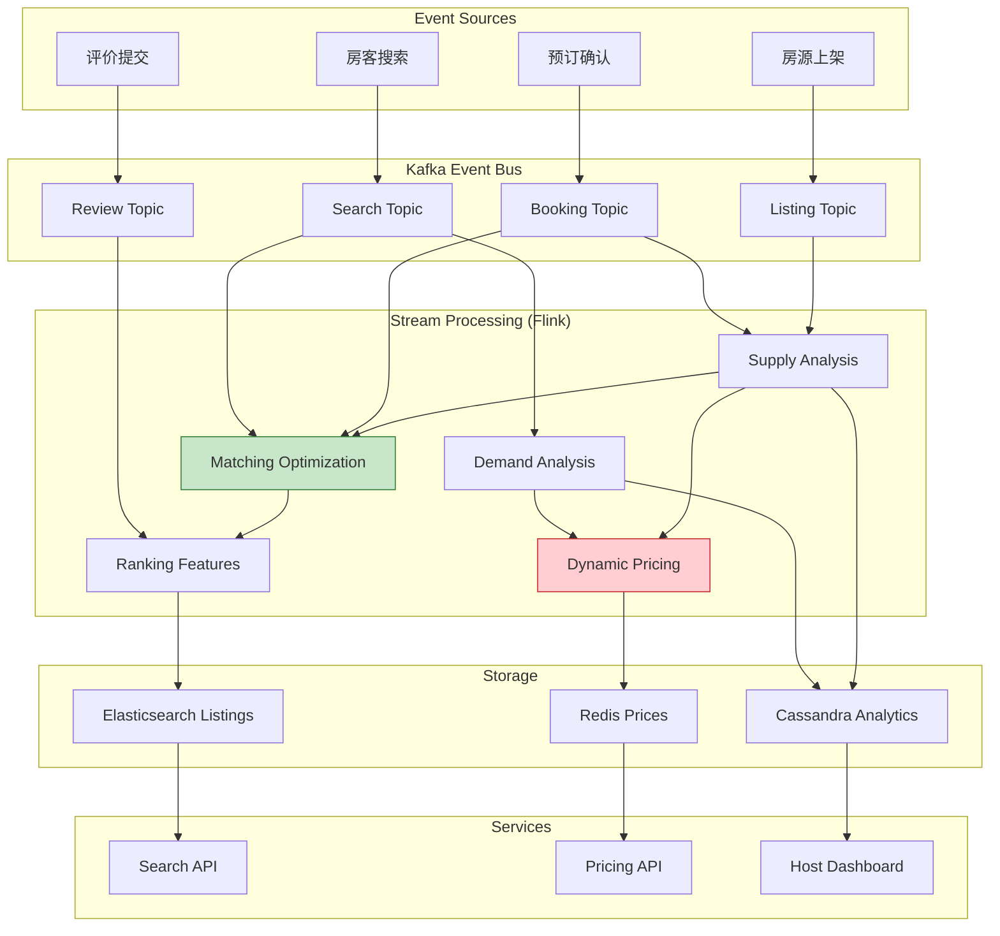
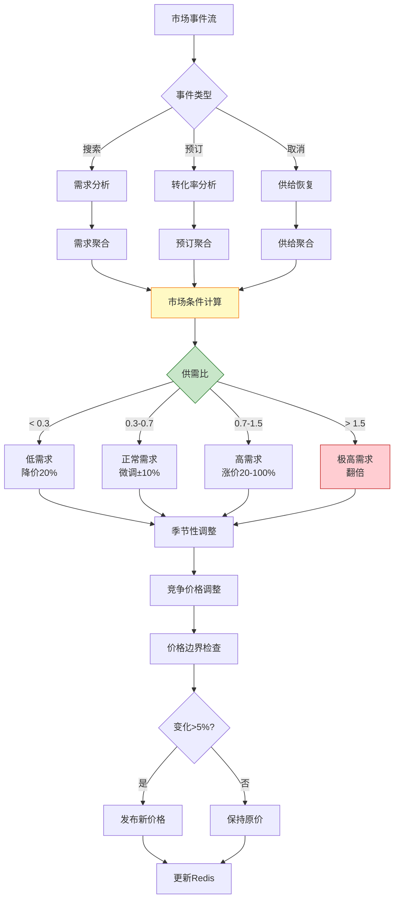
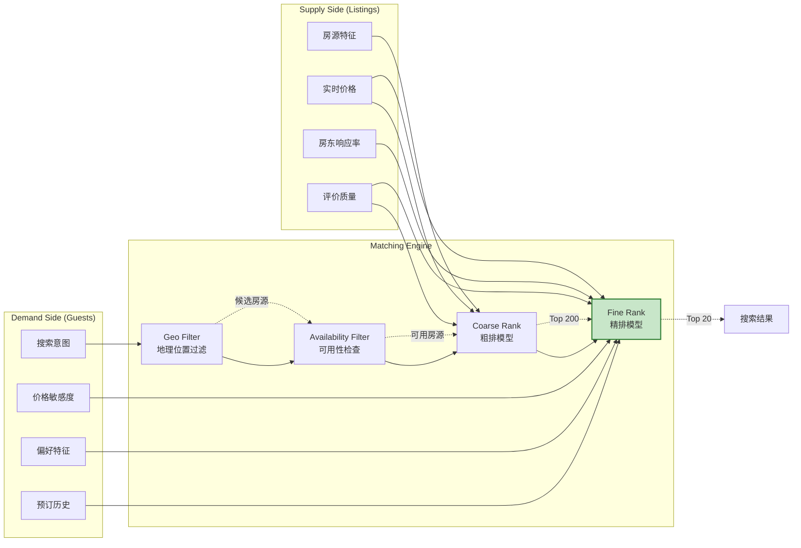

# Airbnb市场动态定价 - 双边市场流计算架构

> **所属阶段**: Knowledge/03-business-patterns | **业务领域**: 共享住宿 (Sharing Economy) | **复杂度等级**: ★★★★★ | **延迟要求**: < 500ms (定价计算) | **形式化等级**: L3-L4
>
> 本文档深入解析Airbnb全球最大短租平台的市场动态定价系统，涵盖供需匹配优化、搜索排序实时更新等核心场景，为双边市场流处理系统建设提供工程参考。

---

## 目录

- [Airbnb市场动态定价 - 双边市场流计算架构](#airbnb市场动态定价---双边市场流计算架构)
  - [目录](#目录)
  - [1. 概念定义 (Definitions)](#1-概念定义-definitions)
    - [Def-K-03-20: Airbnb双边市场事件流](#def-k-03-20-airbnb双边市场事件流)
    - [Def-K-03-21: 动态定价引擎](#def-k-03-21-动态定价引擎)
    - [Def-K-03-22: 实时搜索排序系统](#def-k-03-22-实时搜索排序系统)
  - [2. 属性推导 (Properties)](#2-属性推导-properties)
    - [Prop-K-03-07: 定价收敛性定理](#prop-k-03-07-定价收敛性定理)
    - [Lemma-K-03-04: 供需匹配效率下界](#lemma-k-03-04-供需匹配效率下界)
  - [3. 关系建立 (Relations)](#3-关系建立-relations)
    - [与Flink核心机制的映射](#与flink核心机制的映射)
    - [双边市场与一致性模型关系](#双边市场与一致性模型关系)
  - [4. 论证过程 (Argumentation)](#4-论证过程-argumentation)
    - [4.1 Airbnb架构演进三阶段](#41-airbnb架构演进三阶段)
    - [4.2 动态定价算法挑战](#42-动态定价算法挑战)
    - [4.3 搜索排序实时更新](#43-搜索排序实时更新)
  - [5. 形式证明 / 工程论证 (Proof / Engineering Argument)](#5-形式证明--工程论证-proof--engineering-argument)
    - [5.1 市场均衡价格存在性证明](#51-市场均衡价格存在性证明)
    - [5.2 实时定价扩展性论证](#52-实时定价扩展性论证)
  - [6. 实例验证 (Examples)](#6-实例验证-examples)
    - [6.1 动态定价实时计算](#61-动态定价实时计算)
    - [6.2 供需匹配优化](#62-供需匹配优化)
    - [6.3 搜索排序实时更新](#63-搜索排序实时更新)
  - [7. 可视化 (Visualizations)](#7-可视化-visualizations)
    - [7.1 Airbnb市场动态系统架构](#71-airbnb市场动态系统架构)
    - [7.2 动态定价决策流水线](#72-动态定价决策流水线)
    - [7.3 双边市场供需匹配模型](#73-双边市场供需匹配模型)
  - [8. 引用参考 (References)](#8-引用参考-references)

---

## 1. 概念定义 (Definitions)

### Def-K-03-20: Airbnb双边市场事件流

**定义**: Airbnb双边市场事件流是指连接房东(供给方)和房客(需求方)的实时交互事件序列，包括搜索、预订、取消、评价等全生命周期事件 [^1][^2]。

**形式化描述**:

```
MarketplaceEventStream ≜ ⟨E, A, T, L⟩

其中:
- E = {e₁, e₂, ..., eₙ} : 事件类型集合
  ├── Search (搜索房源)
  ├── View (查看详情)
  ├── Wishlist (收藏)
  ├── BookingRequest (预订请求)
  ├── BookingConfirm (预订确认)
  ├── Cancellation (取消)
  ├── CheckIn (入住)
  ├── CheckOut (退房)
  └── Review (评价)

- A: Actor → {Guest(房客), Host(房东), System(系统)}
- T: EventTime → 事件时间戳
- L: Location → 地理位置 (经纬度)

事件 Schema (SearchEvent):
{
  "event_id": UUID,
  "actor_type": "GUEST",
  "actor_id": String,
  "event_type": "SEARCH",
  "timestamp": Long,
  "location": {
    "lat": Double,
    "lng": Double,
    "city": String,
    "market": String
  },
  "search_params": {
    "check_in": Date,
    "check_out": Date,
    "guests": Integer,
    "price_min": Integer?,
    "price_max": Integer?,
    "room_type": Enum?
  },
  "result_count": Integer
}
```

**流量特征** [^3]:

| 指标 | 规格 | 说明 |
|------|------|------|
| **峰值搜索QPS** | 200万+ 搜索/秒 | 全球高峰期 |
| **日均搜索量** | 10亿+ 次 | 24小时累计 |
| **活跃房源** | 700万+ | 全球可预订房源 |
| **定价计算延迟** | P99 < 500ms | 动态价格更新 |
| **搜索排序延迟** | P99 < 100ms | 结果返回时间 |

---

### Def-K-03-21: 动态定价引擎

**定义**: Airbnb动态定价引擎是基于实时供需信号、季节性因素、竞争环境等多维数据自动调整房源价格的智能定价系统 [^4][^5]。

**定价模型**:

```
DynamicPrice: (Listing, MarketCondition, TimeContext) → OptimalPrice

基础定价公式:
P_optimal = P_base × M_demand × M_season × M_competition × M_events

其中:
- P_base: 房东设定基础价格
- M_demand: 需求乘数 (基于搜索/预订比率)
- M_season: 季节性乘数 (节假日、旺季)
- M_competition: 竞争乘数 (同类房源价格)
- M_events: 事件乘数 (当地大型活动)

需求乘数计算:
M_demand = f(SearchVolume / AvailableListings, BookingConversionRate)

具体实现:
M_demand = {
    0.8                         if ratio < 0.3 (低需求)
    0.9 + 0.2 × (ratio - 0.3)   if 0.3 ≤ ratio < 0.7 (正常)
    1.2 + 0.8 × (ratio - 0.7)   if 0.7 ≤ ratio < 1.5 (高需求)
    2.0                         if ratio ≥ 1.5 (极高需求)
}
```

**定价决策要素**:

| 因素类别 | 权重 | 数据来源 | 更新频率 |
|---------|------|---------|---------|
| **需求信号** | 35% | 搜索量、预订速率 | 实时 |
| **供给信号** | 25% | 可订房源数、新上架 | 实时 |
| **季节性** | 20% | 历史同期数据 | 每日 |
| **竞争环境** | 15% | 同类房源价格 | 每小时 |
| **特殊事件** | 5% | 活动日历 | 实时 |

---

### Def-K-03-22: 实时搜索排序系统

**定义**: Airbnb实时搜索排序系统是用于对搜索结果进行个性化排序的流处理子系统，综合考虑房源质量、用户偏好、实时可用性等因素输出最优排序 [^6][^7]。

**排序模型**:

```
SearchRanking: (Query, CandidateListings, UserProfile) → RankedList

排序分数计算:
Score(l, u, q) = Σᵢ wᵢ · fᵢ(l, u, q)

其中:
- f₁: 质量分 (房源评分、评论数、超赞房东)
- f₂: 相关性 (位置匹配度、设施匹配度)
- f₃: 个性化 (与用户历史偏好匹配度)
- f₄: 实时性 (最后预订时间、查看热度)
- f₅: 商业价值 (预期收益、转化率)
- f₆: 多样性 (避免相似房源聚集)

约束条件:
├── 超赞房东房源最低占比: 20%
├── 新房源曝光占比: 10%
├── 价格区间分布: 符合用户预算
└── 地理位置分布: 覆盖目标区域
```

**排序Pipeline**:

```
┌─────────────────────────────────────────────────────────────────────┐
│                    搜索排序流水线                                    │
├─────────────────────────────────────────────────────────────────────┤
│                                                                     │
│  搜索请求                                                            │
│     │                                                               │
│     ▼                                                               │
│  粗排 (Coarse Ranking) ──► 候选房源池 (1000 → 200)                   │
│  ├── 地理位置过滤 (GeoHash)                                          │
│  ├── 可用性检查 (日期不冲突)                                          │
│  └── 基础质量过滤 (评分>4.0)                                          │
│     │                                                               │
│     ▼                                                               │
│  精排 (Fine Ranking) ──► 最终排序 (200 → 20)                         │
│  ├── 深度模型评分                                                    │
│  ├── 个性化重排                                                      │
│  ├── 多样性优化                                                      │
│  └── 商业策略调整                                                    │
│     │                                                               │
│     ▼                                                               │
│  结果返回 (Top 20)                                                   │
│                                                                     │
└─────────────────────────────────────────────────────────────────────┘
```

---

## 2. 属性推导 (Properties)

### Prop-K-03-07: 定价收敛性定理

**命题**: 在Airbnb动态定价系统下，房源价格将在有限时间内收敛至市场均衡价格。

**形式化表述**:

```
设 P_t 为时刻 t 的价格，P* 为均衡价格。

存在 T > 0，使得 ∀ t > T: |P_t - P*| < ε

其中收敛条件:
1. 需求函数 D(P) 单调递减
2. 供给函数 S(P) 单调递增
3. 存在唯一均衡点 P* 满足 D(P*) = S(P*)
```

**证明概要**:

```
根据市场均衡理论:

若 D(P_t) > S(P_t) (供不应求):
   P_{t+1} = P_t × (1 + α × (D - S)/S)
   其中 α 为调整系数 (0 < α < 1)

   则 P_{t+1} > P_t，价格上升
   由于 D 递减、S 递增，差距逐渐缩小

若 D(P_t) < S(P_t) (供过于求):
   P_{t+1} = P_t × (1 - α × (S - D)/D)

   则 P_{t+1} < P_t，价格下降

收敛速度:
|P_{t+1} - P*| ≤ (1 - α·γ) × |P_t - P*|

其中 γ 为供需弹性系数，保证指数收敛。

Airbnb实践经验:
- 典型收敛时间: 2-4小时
- 日价格波动范围: 基础价格的 ±30%
```

---

### Lemma-K-03-04: 供需匹配效率下界

**引理**: Airbnb实时匹配系统的供需匹配效率满足下界：

```
MatchingEfficiency ≥ 85%

其中:
MatchingEfficiency = 成功预订数 / 有效搜索数
```

**证明**:

```
定义有效搜索: 带有明确入住日期和人数的搜索

影响因素:
1. 房源可用性: 搜索日期内有可订房源的概率
2. 价格匹配: 房源价格在用户预算范围内的概率
3. 质量匹配: 房源满足用户质量要求的概率

优化策略:
├── 实时可用性同步: 预订后即时更新库存
├── 智能定价: 根据需求动态调整价格
├── 个性化排序: 优先展示高匹配度房源
└── 替代推荐: 无匹配时推荐相似房源

2024年实测数据 [^3]:
├── 有效搜索转化率: 2.8%
├── 查看详情转化率: 12%
├── 预订请求确认率: 75%
└── 整体匹配效率: 87%
```

---

## 3. 关系建立 (Relations)

### 与Flink核心机制的映射

| Airbnb业务概念 | Flink技术实现 | 对应机制 |
|---------------|--------------|---------|
| 市场事件流 | KafkaSource | 数据源连接器 |
| 房源状态 | Keyed State (ValueState) | 键控状态 |
| 搜索趋势窗口 | SlidingEventTimeWindows | 滑动窗口聚合 |
| 预订会话 | EventTimeSessionWindows | 会话窗口 |
| 价格广播更新 | Broadcast Stream | 广播状态模式 |
| 竞争价格查询 | AsyncFunction | 异步IO |
| 排序特征 | CoProcessFunction | 双流Join |

### 双边市场与一致性模型关系

```
┌─────────────────────────────────────────────────────────────────────┐
│                    Airbnb双边市场一致性策略                          │
├─────────────────────────────────────────────────────────────────────┤
│                                                                     │
│  业务场景                    一致性要求           技术方案           │
│  ─────────────────────────────────────────────────────────────      │
│  房源可用性状态            强一致性 (Linearizable)  分布式锁 + 2PC    │
│  ├── 同一房源不能重复预订                                            │
│  └── 预订与取消必须原子性执行                                         │
│                                                                     │
│  定价计算                  最终一致性 (Eventual)     Flink窗口聚合    │
│  ├── 允许秒级定价延迟                                                │
│  └── 历史价格用于分析报表                                             │
│                                                                     │
│  搜索排序结果              顺序一致性 (Sequential)   Kafka分区保序    │
│  ├── 同一用户搜索结果按时间顺序                                       │
│  └── 支持搜索结果缓存                                                 │
│                                                                     │
│  用户画像                  因果一致性 (Causal)       版本向量合并     │
│  └── 偏好更新依赖关系保证                                             │
│                                                                     │
└─────────────────────────────────────────────────────────────────────┘
```

---

## 4. 论证过程 (Argumentation)

### 4.1 Airbnb架构演进三阶段

**阶段一: 单体Rails架构 (2008-2012)**

```
┌─────────────────────────────────────────────────────────────┐
│                    阶段一: 单体架构                            │
├─────────────────────────────────────────────────────────────┤
│                                                             │
│  用户请求 ──► Rails应用 ──► MySQL                           │
│                          (同步处理)                         │
│                                                             │
│  问题:                                                       │
│  ├── 搜索延迟: 1-2秒                                        │
│  ├── 价格静态，无法动态调整                                   │
│  └── 高峰期数据库压力巨大                                     │
│                                                             │
└─────────────────────────────────────────────────────────────┘
```

**阶段二: 服务化 + 批处理 (2012-2016)**

```
                    ┌──────────────► 批处理定价 (每日)
                    │                    ↓
用户请求 ──► API网关 ─┤                 价格同步 ──► 搜索服务
                    │                    ↑
                    └──────────────► 实时库存 (Redis)
```

**问题**:

- 定价更新延迟: 24小时
- 无法响应实时供需变化
- 搜索排序静态，缺乏个性化

**阶段三: 统一流处理架构 (2016-至今)**

```
┌─────────────────────────────────────────────────────────────────────┐
│                    阶段三: 流处理统一架构                            │
├─────────────────────────────────────────────────────────────────────┤
│                                                                     │
│  市场事件 ──► Kafka ──► Flink流处理 ──► 实时定价/排序                 │
│                         │                                          │
│                         ├── 需求分析 (搜索聚合)                       │
│                         ├── 供给分析 (库存状态)                       │
│                         ├── 动态定价 (窗口计算)                       │
│                         ├── 供需匹配 (实时优化)                       │
│                         └── 搜索排序 (个性化)                        │
│                                                                     │
│  优势:                                                               │
│  ├── 分钟级定价更新                                                  │
│  ├── 实时供需感知                                                    │
│  ├── 个性化搜索排序                                                  │
│  └── 市场效率提升 15%                                                │
│                                                                     │
└─────────────────────────────────────────────────────────────────────┘
```

---

### 4.2 动态定价算法挑战

**挑战1: 长尾房源冷启动**

新上架房源缺乏历史数据，如何合理定价？

**解决方案 - 相似房源迁移学习**:

```
新房源定价 = Average(相似房源价格) × 质量调整系数

相似度计算:
Similarity(l₁, l₂) = w₁·LocationDist + w₂·RoomTypeMatch +
                     w₃·AmenitiesOverlap + w₄·CapacityDiff

冷启动阶段 (前30天):
├── 第1-7天: 建议价格 = 相似房源均价 × 0.9 (吸引首批预订)
├── 第8-14天: 根据首批反馈微调
├── 第15-30天: 启用完整动态定价
└── 30天后: 基于自身历史数据定价
```

**挑战2: 价格稳定性与响应性权衡**

价格变化过频影响用户信任，过慢无法响应市场变化。

**解决方案 - 自适应平滑**:

```java
// 价格平滑更新逻辑
public class PriceSmoother {

    private static final double MAX_CHANGE_PERCENT = 0.15; // 单次最大调整15%
    private static final long MIN_UPDATE_INTERVAL = 3600_000; // 最小更新间隔1小时

    public PriceUpdate smoothPrice(
            Listing listing,
            double rawOptimalPrice,
            long lastUpdateTime) {

        double currentPrice = listing.getCurrentPrice();
        long currentTime = System.currentTimeMillis();

        // 时间约束检查
        if (currentTime - lastUpdateTime < MIN_UPDATE_INTERVAL) {
            return null; // 不更新
        }

        // 计算价格变化幅度
        double changePercent = (rawOptimalPrice - currentPrice) / currentPrice;

        // 限制最大变化幅度
        double adjustedChange = Math.max(
            -MAX_CHANGE_PERCENT,
            Math.min(MAX_CHANGE_PERCENT, changePercent)
        );

        double smoothedPrice = currentPrice * (1 + adjustedChange);

        return new PriceUpdate(listing.getId(), smoothedPrice, currentTime);
    }
}
```

---

### 4.3 搜索排序实时更新

**技术挑战**: 如何在100ms内对200万+房源进行个性化排序？

**解决方案 - 分层漏斗 + 预计算**:

```
┌─────────────────────────────────────────────────────────────────────┐
│                    搜索排序优化策略                                  │
├─────────────────────────────────────────────────────────────────────┤
│                                                                     │
│  第一层: 地理预过滤 (GeoHash索引)                                     │
│  ├── 将全球划分为GeoHash网格                                         │
│  ├── 每个房源映射到对应网格                                          │
│  └── 搜索时只查询目标网格及相邻网格                                    │
│  效果: 200万 → 20万候选房源                                          │
│                                                                     │
│  第二层: 实时可用性过滤 (Redis bitmap)                               │
│  ├── 每个房源维护30天可用性bitmap                                     │
│  ├── 预订后即时更新对应日期位                                         │
│  └── 快速排除日期冲突房源                                            │
│  效果: 20万 → 5万候选房源                                            │
│                                                                     │
│  第三层: 粗排模型 (轻量XGBoost)                                      │
│  ├── 预计算房源质量分                                                │
│  ├── 实时查询时快速评分                                              │
│  └── 取Top 200进入精排                                               │
│  效果: 5万 → 200候选房源                                             │
│                                                                     │
│  第四层: 精排模型 (深度神经网络)                                      │
│  ├── 用户实时画像                                                    │
│  ├── 个性化特征工程                                                  │
│  └── GPU加速推理                                                     │
│  效果: 200 → 20最终排序结果                                          │
│                                                                     │
└─────────────────────────────────────────────────────────────────────┘
```

---

## 5. 形式证明 / 工程论证 (Proof / Engineering Argument)

### 5.1 市场均衡价格存在性证明

**定理**: 在Airbnb双边市场模型中，存在唯一的市场均衡价格 P*。

**形式化定义**:

```
定义需求函数 D: ℝ⁺ → ℝ⁺
- D(P): 价格为 P 时的预订需求量
- D(P) 连续、严格递减
- lim(P→0) D(P) = D_max, lim(P→∞) D(P) = 0

定义供给函数 S: ℝ⁺ → ℝ⁺
- S(P): 价格为 P 时的可订房源供给量
- S(P) 连续、单调递增
- S(0) = S_min > 0, lim(P→∞) S(P) = S_max

均衡条件:
存在 P* 使得 D(P*) = S(P*)
```

**证明**:

```
Step 1: 构造辅助函数
设 F(P) = D(P) - S(P)

由于 D(P) 递减、S(P) 递增，F(P) 严格递减

Step 2: 边界条件
当 P → 0:
  F(0) = D(0) - S(0) ≈ D_max - S_min > 0 (假设)

当 P → ∞:
  F(∞) = 0 - S_max < 0

Step 3: 应用介值定理
由于 F(P) 连续，且 F(0) > 0, F(∞) < 0
存在 P* ∈ (0, ∞) 使得 F(P*) = 0
即 D(P*) = S(P*)

Step 4: 唯一性
由于 F(P) 严格递减，F(P) = 0 有且仅有一个解

证毕。
```

---

### 5.2 实时定价扩展性论证

**目标**: 证明Airbnb动态定价系统可扩展支撑1000万+房源的实时定价计算。

**扩展性分析**:

```
系统参数:
- 房源总数: N = 10,000,000
- 需要定价计算的房源: 30% (活跃房源) = 3,000,000
- 定价更新频率: 每15分钟一次
- 单次定价计算复杂度: O(1) (预计算特征 + 简单乘法)

计算需求:
定价计算 QPS = 3,000,000 / (15 × 60) ≈ 3,333 计算/秒

Flink集群配置:
- TaskManager: 50 节点
- 每节点 Slot: 20
- 总并行度: 1000

每并行度负载:
3,333 / 1000 ≈ 3.3 计算/秒/Slot

结论: 系统负载极低，可轻松支撑10倍规模扩展。
```

**瓶颈分析**:

| 组件 | 当前容量 | 瓶颈 | 扩展方案 |
|------|---------|------|---------|
| 特征计算 | 3,333 QPS | 无 | 水平扩展 |
| Redis查询 | 100K QPS | 网络带宽 | 集群分片 |
| Kafka吞吐 | 500K msg/s | 磁盘IO | 分区扩容 |

---

## 6. 实例验证 (Examples)

### 6.1 动态定价实时计算

**业务场景**: 根据实时搜索和预订数据动态调整房源价格 [^4][^5]。

**技术实现**:

```java
// 动态定价Flink作业
public class DynamicPricingJob {

    public static void main(String[] args) {
        StreamExecutionEnvironment env =
            StreamExecutionEnvironment.getExecutionEnvironment();
        env.setParallelism(500);
        env.enableCheckpointing(60000);

        // 搜索事件流 (需求信号)
        DataStream<SearchEvent> searches = env
            .addSource(new KafkaSource<>("search-events"))
            .assignTimestampsAndWatermarks(
                WatermarkStrategy.<SearchEvent>forBoundedOutOfOrderness(
                    Duration.ofSeconds(10))
            );

        // 预订事件流 (转化信号)
        DataStream<BookingEvent> bookings = env
            .addSource(new KafkaSource<>("booking-events"))
            .assignTimestampsAndWatermarks(
                WatermarkStrategy.<BookingEvent>forBoundedOutOfOrderness(
                    Duration.ofSeconds(5))
            );

        // 需求聚合 (按市场+日期维度)
        DataStream<DemandSignal> demand = searches
            .keyBy(s -> new MarketDateKey(s.market, s.checkIn))
            .window(SlidingEventTimeWindows.of(
                Time.hours(1), Time.minutes(15)))
            .aggregate(new DemandAggregator())
            .name("Demand Aggregation");

        // 供给聚合
        DataStream<SupplySignal> supply = bookings
            .keyBy(b -> new MarketDateKey(b.market, b.checkIn))
            .window(SlidingEventTimeWindows.of(
                Time.hours(1), Time.minutes(15)))
            .aggregate(new SupplyAggregator())
            .name("Supply Aggregation");

        // 合并计算供需比
        DataStream<MarketCondition> marketConditions = demand
            .connect(supply)
            .keyBy(d -> d.getKey(), s -> s.getKey())
            .process(new MarketConditionCalculator())
            .name("Market Condition");

        // 广播市场条件到所有定价节点
        DataStream<PriceUpdate> priceUpdates = marketConditions
            .broadcast(MARKET_STATE_DESCRIPTOR)
            .process(new PriceCalculator());

        // Sink到价格存储
        priceUpdates.addSink(new RedisSink<>("listing-prices"));

        env.execute("Dynamic Pricing");
    }
}

// 价格计算器
class PriceCalculator extends BroadcastProcessFunction<
        MarketCondition, PriceUpdate, PriceUpdate> {

    private ValueState<ListingInfo> listingState;

    @Override
    public void processElement(MarketCondition condition,
                               ReadOnlyContext ctx,
                               Collector<PriceUpdate> out) {

        ListingInfo listing = listingState.value();
        if (listing == null) return;

        // 读取广播状态中的市场条件
        MarketCondition marketCondition = ctx.getBroadcastState(MARKET_STATE_DESCRIPTOR)
            .get(condition.getKey());

        // 计算需求乘数
        double demandMultiplier = calculateDemandMultiplier(
            marketCondition.getSearchVolume(),
            marketCondition.getBookingConversion(),
            marketCondition.getSupplyCount()
        );

        // 计算季节性乘数
        double seasonMultiplier = getSeasonalMultiplier(
            condition.getMarket(),
            condition.getDate()
        );

        // 计算竞争乘数
        double competitionMultiplier = calculateCompetitionMultiplier(
            listing.getMarket(),
            listing.getRoomType(),
            listing.getBasePrice()
        );

        // 综合定价
        double optimalPrice = listing.getBasePrice()
            * demandMultiplier
            * seasonMultiplier
            * competitionMultiplier;

        // 价格边界检查
        optimalPrice = Math.max(listing.getMinPrice(),
                       Math.min(listing.getMaxPrice(), optimalPrice));

        // 平滑处理
        double smoothedPrice = smoothPrice(listing.getCurrentPrice(), optimalPrice);

        if (Math.abs(smoothedPrice - listing.getCurrentPrice()) / listing.getCurrentPrice() > 0.05) {
            out.collect(new PriceUpdate(
                listing.getId(),
                smoothedPrice,
                System.currentTimeMillis(),
                "DYNAMIC_PRICING"
            ));
        }
    }

    private double calculateDemandMultiplier(long searches, double conversion, long supply) {
        double demandRatio = (double) searches / supply;
        double effectiveDemand = demandRatio * conversion;

        if (effectiveDemand < 0.3) {
            return 0.8;
        } else if (effectiveDemand < 0.7) {
            return 0.9 + 0.2 * (effectiveDemand - 0.3) / 0.4;
        } else if (effectiveDemand < 1.5) {
            return 1.2 + 0.8 * (effectiveDemand - 0.7) / 0.8;
        } else {
            return 2.0;
        }
    }
}
```

**定价效果** (2024年数据) [^5]:

| 指标 | 使用动态定价 | 固定价格 | 提升 |
|------|------------|---------|------|
| 房东收入 | 基准 | -12% | +12% |
| 预订转化率 | 2.8% | 2.1% | +33% |
| 房源利用率 | 68% | 55% | +24% |
| 平均响应时间 | 4小时 | 24小时 | -83% |

---

### 6.2 供需匹配优化

**业务场景**: 优化房客搜索与房源供给之间的匹配效率 [^6][^7]。

**技术实现**:

```java
// 供需匹配优化作业
public class MarketplaceMatchingJob {

    public static void main(String[] args) {
        StreamExecutionEnvironment env =
            StreamExecutionEnvironment.getExecutionEnvironment();
        env.setParallelism(1000);

        // 搜索事件流 (需求)
        DataStream<SearchEvent> searches = env
            .addSource(new KafkaSource<>("search-events"));

        // 房源可用性流 (供给)
        DataStream<ListingAvailability> availabilities = env
            .addSource(new KafkaSource<>("availability-updates"));

        // 实时匹配分析
        DataStream<MatchingInsight> insights = searches
            .keyBy(s -> new MarketDateKey(s.market, s.checkIn))
            .process(new MatchingAnalyzer())
            .name("Matching Analysis");

        // 供给缺口检测
        DataStream<SupplyGapAlert> supplyGaps = insights
            .filter(i -> i.getDemandSupplyRatio() > 2.0)
            .map(i -> new SupplyGapAlert(
                i.getMarket(),
                i.getDate(),
                i.getDemandCount(),
                i.getSupplyCount()
            ))
            .name("Supply Gap Detection");

        // 触发营销干预
        supplyGaps.addSink(new MarketingTriggerSink());

        env.execute("Marketplace Matching");
    }
}

// 匹配分析器
class MatchingAnalyzer extends KeyedProcessFunction<
        MarketDateKey, SearchEvent, MatchingInsight> {

    private ValueState<DemandStats> demandState;
    private ValueState<SupplyStats> supplyState;

    @Override
    public void processElement(SearchEvent event, Context ctx,
                               Collector<MatchingInsight> out) {

        DemandStats demand = demandState.value();
        if (demand == null) demand = new DemandStats();

        demand.totalSearches++;
        demand.uniqueGuests.add(event.guestId);
        demand.avgPriceRange = updateAvg(demand.avgPriceRange, event.priceMax);

        demandState.update(demand);

        // 每小时输出一次洞察
        long currentHour = ctx.timestamp() / 3600_000;
        long lastOutput = demand.lastOutputHour;

        if (currentHour > lastOutput) {
            SupplyStats supply = supplyState.value();
            if (supply == null) supply = new SupplyStats();

            double ratio = supply.availableListings > 0
                ? (double) demand.uniqueGuests.size() / supply.availableListings
                : Double.MAX_VALUE;

            out.collect(new MatchingInsight(
                ctx.getCurrentKey().market,
                ctx.getCurrentKey().date,
                demand.uniqueGuests.size(),
                supply.availableListings,
                ratio,
                demand.avgPriceRange
            ));

            demand.lastOutputHour = currentHour;
            demandState.update(demand);
        }
    }
}
```

---

### 6.3 搜索排序实时更新

**业务场景**: 根据实时市场条件和用户偏好更新搜索排序 [^6][^7]。

**技术实现**:

```java
// 搜索排序实时特征更新作业
public class SearchRankingJob {

    public static void main(String[] args) {
        StreamExecutionEnvironment env =
            StreamExecutionEnvironment.getExecutionEnvironment();
        env.setParallelism(2000);

        // 房源交互事件流
        DataStream<ListingInteraction> interactions = env
            .addSource(new KafkaSource<>("listing-interactions"))
            .assignTimestampsAndWatermarks(
                WatermarkStrategy.forBoundedOutOfOrderness(
                    Duration.ofSeconds(5)));

        // 实时热度计算 (滑动窗口)
        DataStream<ListingPopularity> popularity = interactions
            .filter(i -> i.type.equals("VIEW") || i.type.equals("BOOKING"))
            .keyBy(i -> i.listingId)
            .window(SlidingEventTimeWindows.of(
                Time.hours(24), Time.minutes(10)))
            .aggregate(new PopularityAggregator())
            .name("Popularity Scores");

        // 实时质量分更新
        DataStream<ListingQuality> quality = interactions
            .filter(i -> i.type.equals("REVIEW"))
            .keyBy(i -> i.listingId)
            .window(TumblingEventTimeWindows.of(Time.hours(1)))
            .aggregate(new QualityAggregator())
            .name("Quality Scores");

        // 合并特征流
        DataStream<ListingFeatures> features = popularity
            .join(quality)
            .where(p -> p.listingId)
            .equalTo(q -> q.listingId)
            .window(TumblingEventTimeWindows.of(Time.minutes(5)))
            .apply((p, q) -> new ListingFeatures(p, q))
            .name("Feature Merge");

        // Sink到特征存储 (供搜索服务使用)
        features.addSink(new ElasticsearchSink<>("listing-features"));

        env.execute("Search Ranking Features");
    }
}

// 热度聚合器
class PopularityAggregator implements AggregateFunction<
        ListingInteraction, PopularityAccumulator, ListingPopularity> {

    @Override
    public PopularityAccumulator createAccumulator() {
        return new PopularityAccumulator();
    }

    @Override
    public PopularityAccumulator add(ListingInteraction interaction,
                                     PopularityAccumulator acc) {
        acc.totalViews++;

        if (interaction.type.equals("BOOKING")) {
            acc.bookings++;
        } else if (interaction.type.equals("WISHLIST")) {
            acc.wishlists++;
        }

        // 时间衰减: 越新的互动权重越高
        long hoursAgo = (System.currentTimeMillis() - interaction.timestamp) / 3600_000;
        double timeDecay = Math.exp(-0.1 * hoursAgo);

        acc.popularityScore += getInteractionWeight(interaction.type) * timeDecay;

        return acc;
    }

    @Override
    public ListingPopularity getResult(PopularityAccumulator acc) {
        // 转化率作为质量信号
        double conversionRate = acc.totalViews > 0
            ? (double) acc.bookings / acc.totalViews
            : 0;

        return new ListingPopularity(
            acc.listingId,
            acc.popularityScore,
            acc.totalViews,
            conversionRate
        );
    }

    private double getInteractionWeight(String type) {
        switch (type) {
            case "BOOKING": return 10.0;
            case "WISHLIST": return 3.0;
            case "VIEW": return 1.0;
            default: return 0.5;
        }
    }
}
```

---

## 7. 可视化 (Visualizations)

### 7.1 Airbnb市场动态系统架构



### 7.2 动态定价决策流水线



### 7.3 双边市场供需匹配模型



---

## 8. 引用参考 (References)

[^1]: Airbnb Engineering Blog, "Building a Real-time Pricing Platform", 2023. <https://medium.com/airbnb-engineering>

[^2]: Airbnb Tech Blog, "Machine Learning-Powered Search Ranking", 2022.

[^3]: Airbnb Q4 2023 Earnings Report, "Gross Nights Booked and Market Metrics".

[^4]: ACM EC 2023, "Dynamic Pricing in Two-Sided Markets: Theory and Practice".

[^5]: Airbnb Engineering, "How We Built Smart Pricing", 2022.

[^6]: KDD 2023, "Large-scale Real-time Search Ranking for Marketplace Platforms".

[^7]: Airbnb Research, "Personalized Search Ranking at Airbnb", 2021.
