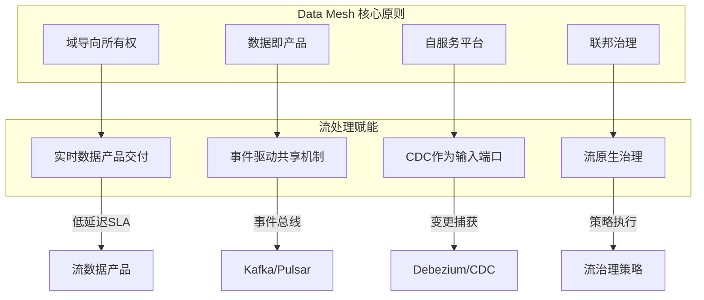
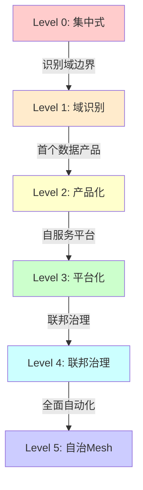
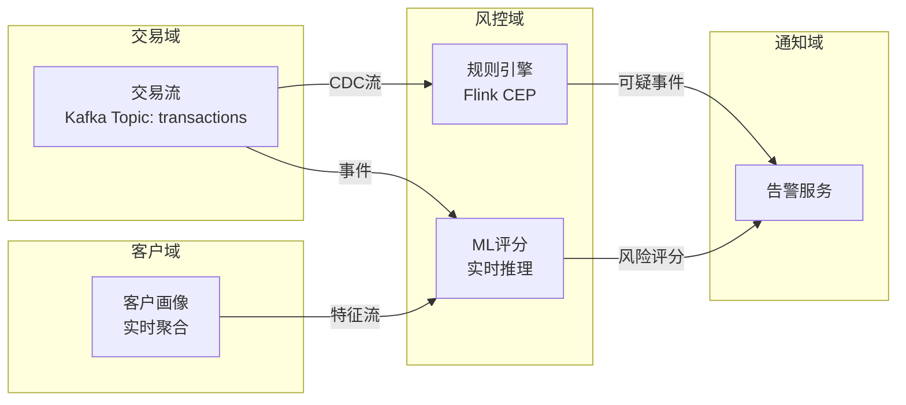
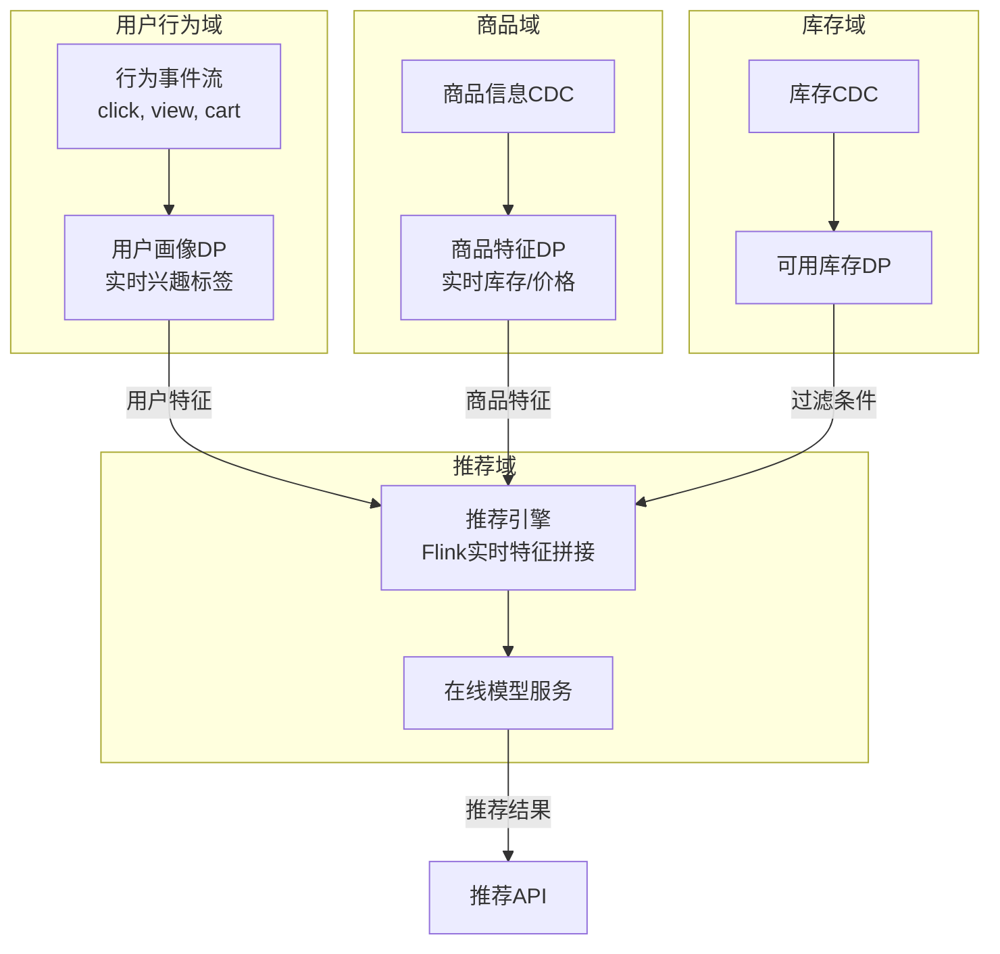
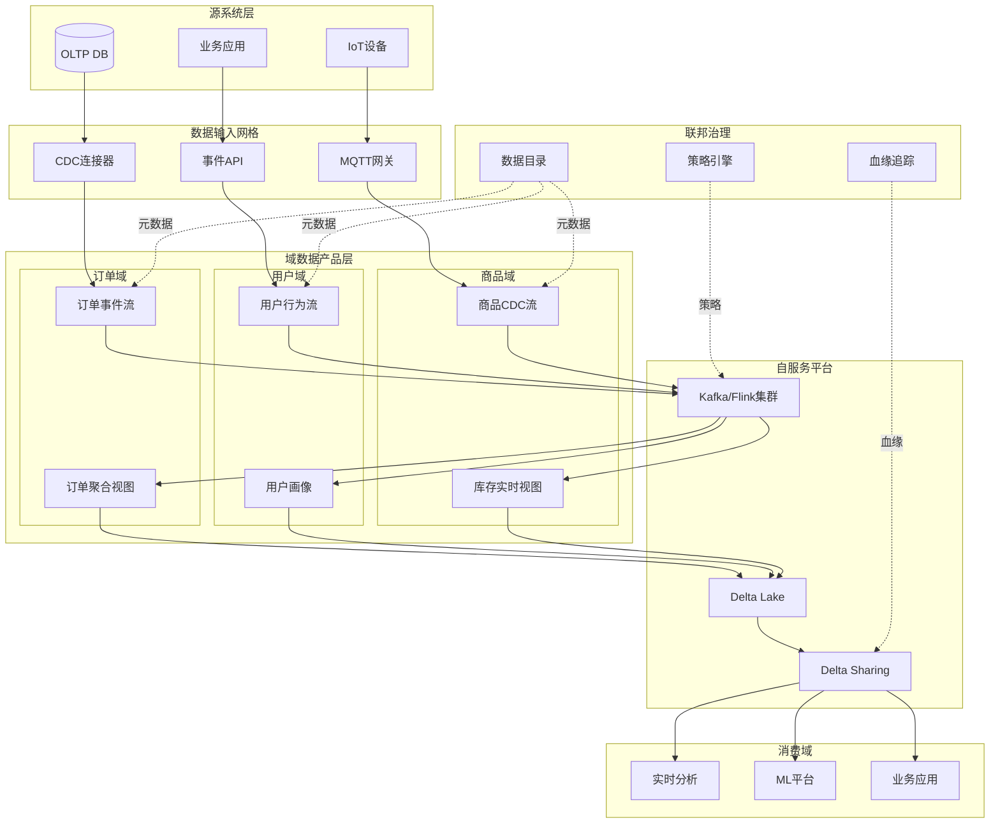
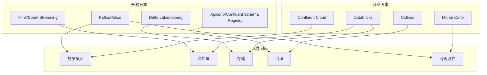

# Data Mesh 与流处理深度融合：2026架构实践指南

> 所属阶段: Knowledge | 前置依赖: [流数据产品设计模式](./streaming-data-product-economics.md) | 形式化等级: L4

---

## 目录

- [Data Mesh 与流处理深度融合：2026架构实践指南](#data-mesh-与流处理深度融合2026架构实践指南)
  - [目录](#目录)
  - [1. 概念定义 (Definitions)](#1-概念定义-definitions)
    - [1.1 Data Mesh 形式化定义](#11-data-mesh-形式化定义)
    - [1.2 流数据产品定义](#12-流数据产品定义)
    - [1.3 域导向流所有权](#13-域导向流所有权)
    - [1.4 联邦流治理](#14-联邦流治理)
  - [2. 属性推导 (Properties)](#2-属性推导-properties)
    - [2.1 Data Mesh 2026状态分析](#21-data-mesh-2026状态分析)
    - [2.2 可扩展性边界](#22-可扩展性边界)
    - [2.3 治理复杂度](#23-治理复杂度)
  - [3. 关系建立 (Relations)](#3-关系建立-relations)
    - [3.1 Data Mesh vs Data Fabric 对比矩阵](#31-data-mesh-vs-data-fabric-对比矩阵)
    - [3.2 选择决策框架](#32-选择决策框架)
    - [3.3 混合模式可能性](#33-混合模式可能性)
    - [3.4 流处理与Data Mesh的关系](#34-流处理与data-mesh的关系)
  - [4. 论证过程 (Argumentation)](#4-论证过程-argumentation)
    - [4.1 去中心化必然性论证](#41-去中心化必然性论证)
    - [4.2 流处理加速Data Mesh价值实现](#42-流处理加速data-mesh价值实现)
    - [4.3 反例分析：何时不应采用Data Mesh](#43-反例分析何时不应采用data-mesh)
  - [5. 工程论证 (Proof / Engineering Argument)](#5-工程论证-proof-engineering-argument)
    - [5.1 Data Mesh实施路径](#51-data-mesh实施路径)
    - [5.2 Data Mesh成熟度模型](#52-data-mesh成熟度模型)
    - [5.3 技术栈推荐论证](#53-技术栈推荐论证)
  - [6. 实例验证 (Examples)](#6-实例验证-examples)
    - [6.1 金融行业案例：实时欺诈检测](#61-金融行业案例实时欺诈检测)
    - [6.2 电商行业案例：大规模个性化推荐](#62-电商行业案例大规模个性化推荐)
  - [7. 可视化 (Visualizations)](#7-可视化-visualizations)
    - [7.1 Data Mesh流架构全景图](#71-data-mesh流架构全景图)
    - [7.2 Data Mesh vs Data Fabric 决策树](#72-data-mesh-vs-data-fabric-决策树)
    - [7.3 ROI对比分析](#73-roi对比分析)
    - [7.4 技术栈映射图](#74-技术栈映射图)
  - [8. 引用参考 (References)](#8-引用参考-references)
  - [附录 A: 流数据产品模板](#附录-a-流数据产品模板)

## 1. 概念定义 (Definitions)

### 1.1 Data Mesh 形式化定义

**定义 Def-K-03-30 (Data Mesh)**: Data Mesh是一种去中心化数据架构范式，通过域导向所有权(domain-oriented ownership)、数据即产品(data as a product)、自服务数据平台(self-serve data platform)和联邦计算治理(federated computational governance)四大原则，实现大规模组织的数据民主化与规模化价值交付。

形式化表达：
$$\text{Data Mesh} := \langle D, P, I, G, F \rangle$$

其中：

- $D$: 业务域集合 (Domains)
- $P$: 数据产品集合 (Data Products)
- $I$: 基础设施抽象层 (Infrastructure Abstraction)
- $G$: 联邦治理框架 (Federated Governance)
- $F$: 数据产品接口规范 (Data Product Interfaces)

### 1.2 流数据产品定义

**定义 Def-K-03-31 (流数据产品 - Streaming Data Product)**: 流数据产品是Data Mesh中以连续事件流形式提供的数据产品，具备实时性(低延迟交付)、事件驱动接口和流原生SLA保证。

形式化：
$$\text{StreamingDP} := \langle S, \lambda, \tau, SLA_{realtime} \rangle$$

其中：

- $S$: 无限事件流 $\{e_1, e_2, e_3, ...\}$
- $\lambda$: 端到端延迟上界 (latency bound)
- $\tau$: 时间语义定义 (processing time vs event time)
- $SLA_{realtime}$: 实时性服务等级协议

### 1.3 域导向流所有权

**定义 Def-K-03-32 (域流自治 - Domain Stream Autonomy)**: 域流自治是指业务域对其产生的流数据产品拥有端到端所有权，包括Schema设计、SLA定义、访问控制和生命周期管理。

### 1.4 联邦流治理

**定义 Def-K-03-33 (联邦流治理 - Federated Stream Governance)**: 联邦流治理是在保持域自治的前提下，通过全局策略框架确保跨域流数据的互操作性、合规性和质量的一致性机制。

---

## 2. 属性推导 (Properties)

### 2.1 Data Mesh 2026状态分析

基于Monte Carlo Data《State of Data Mesh 2025》及Calyo Consulting预测数据：

**引理 Lemma-K-03-20 (采用率增长)**: Data Mesh采用率从2023年的12%跃升至2026年的28%，年复合增长率(CAGR)达31.4%，表明企业数据架构去中心化趋势加速。

**引理 Lemma-K-03-21 (成熟度鸿沟)**: 尽管67%企业考虑Data Mesh作为长期战略，仅8%认为实施"mature"，存在59个百分点的成熟度鸿沟。

| 指标 | 2023 | 2026 | 变化 |
|------|------|------|------|
| Actively Implementing | 12% | 28% | +133% |
| Considering Long-term | 45% | 67% | +49% |
| Consider Mature | 3% | 8% | +167% |

**引理 Lemma-K-03-22 (实施障碍分布)**: Data Mesh实施的主要障碍呈现技能-文化-成本三层结构：

- 技能缺乏: 47% (首要障碍)
- 文化阻力: 39%
- 平台成本: 31%

### 2.2 可扩展性边界

**命题 Prop-K-03-15 (流处理可扩展性定理)**: 在Data Mesh架构中，流处理能力随域数量$n$扩展的上界为$O(n \cdot m)$，其中$m$为每域平均流数据产品数。当采用自服务平台抽象时，运维复杂度降为$O(\log n)$。

*推导*:

- 无平台抽象: 每域独立运维流基础设施，复杂度$O(n)$
- 有平台抽象: 共享基础设施层，复杂度$O(1)$ + 治理开销$O(\log n)$

### 2.3 治理复杂度

**命题 Prop-K-03-16 (联邦治理复杂度)**: 联邦治理下的跨域数据血缘追踪复杂度为$O(k \cdot d)$，其中$k$为跨域数据产品依赖数，$d$为平均血缘深度。流处理场景下$d$通常≤5（实时管道深度限制）。

---

## 3. 关系建立 (Relations)

### 3.1 Data Mesh vs Data Fabric 对比矩阵

| 维度 | Data Mesh | Data Fabric | 适用场景 |
|------|-----------|-------------|----------|
| **架构哲学** | 去中心化，域自治 | 集中式，元数据驱动 | 分布式组织 → Mesh; 统一平台 → Fabric |
| **数据所有权** | 域团队端到端负责 | 中央数据团队 | 业务敏捷性需求高 → Mesh |
| **治理模式** | 联邦治理 | 集中治理 | 强监管行业 → Fabric; 多业务线 → Mesh |
| **技术栈** | 多技术，标准化接口 | 统一平台，自动化 | 已有异构系统 → Mesh |
| **实施复杂度** | 高(组织变革) | 中(技术集成) | 成熟数字化组织 → Mesh |
| **流处理原生** | 强(事件驱动设计) | 弱(批处理为主) | 实时需求 → Mesh |

**定义 Def-K-03-34 (Data Fabric)**: Data Fabric是一种以AI驱动元数据管理为核心的集中式数据架构，通过自动化数据集成、发现和管理，提供统一的数据访问层。

### 3.2 选择决策框架

**定理 Thm-K-03-20 (架构选择定理)**: 组织应按以下条件选择数据架构范式：

$$
\text{选择} =
\begin{cases}
\text{Data Mesh} & \text{if } \frac{\text{域数量} \times \text{变更频率}}{\text{集中数据团队规模}} > \theta_{threshold} \\
\text{Data Fabric} & \text{if } \text{监管要求} \times \text{数据一致性需求} > \theta_{compliance} \\
\text{混合模式} & \text{otherwise}
\end{cases}
$$

其中$\theta_{threshold} \approx 5$（经验值），$\theta_{compliance}$取决于行业（金融通常>0.7）。

### 3.3 混合模式可能性

**定义 Def-K-03-35 (Mesh-over-Fabric)**: Mesh-over-Fabric是一种混合架构，以Data Fabric作为底层统一存储和元管理层，Data Mesh作为上层域数据产品组织原则。

**适用条件**:

- 大型企业既有集中式数据湖
- 需要渐进式向Data Mesh演进
- 实时层用Mesh，历史层用Fabric

### 3.4 流处理与Data Mesh的关系



---

## 4. 论证过程 (Argumentation)

### 4.1 去中心化必然性论证

**论证**: 为什么Data Mesh是数据架构演化的必然方向？

**前提1**: 数据规模增长遵循指数律。全球数据量从2020年的64ZB增长至2025年的181ZB[^1]。

**前提2**: 集中式数据团队带宽有限。根据Conway定律，系统架构映射组织沟通结构[^2]。

**前提3**: 业务域对数据理解更深，数据消费者贴近数据生产者。

**推论**: 集中式架构必然产生瓶颈。设集中团队处理能力为$C$，数据需求增长率为$r$，则当$t > \frac{\ln(C_0/C)}{r}$时，瓶颈必然出现。

**结论**: 去中心化是将$O(n)$复杂度转化为$O(1)$域内+$O(\log n)$跨域治理的唯一可行路径。

### 4.2 流处理加速Data Mesh价值实现

**论证**: 流处理为何是Data Mesh的关键加速器？

1. **实时SLA驱动产品思维**: 批处理SLA以小时/天计，难以体现域团队责任。流处理SLA以秒/分钟计，强制域团队关注可用性、延迟和质量。

2. **事件驱动消除集成耦合**: 传统点对点集成产生$O(n^2)$连接复杂度。事件总线将复杂度降为$O(n)$。

3. **CDC实现源域自治**: 变更数据捕获(CDC)允许源域在不暴露内部数据库结构的情况下发布数据变更，保持封装性。

### 4.3 反例分析：何时不应采用Data Mesh

**反例1**: 小型组织（<5个业务域）

- 去中心化开销超过收益
- 建议：集中式数据平台 + 良好数据建模

**反例2**: 高度监管行业初期阶段

- 需要集中审计和合规报告
- 建议：从Data Fabric开始，逐步引入域数据产品

---

## 5. 工程论证 (Proof / Engineering Argument)

### 5.1 Data Mesh实施路径

**阶段1: 试点域 (0-6个月)**

- 选择1-2个高价值域（如订单域、用户域）
- 建立流数据产品标准模板
- 部署最小可行平台(MVP)

**阶段2: 平台扩展 (6-18个月)**

- 推广至5-8个核心域
- 完善联邦治理框架
- 建立数据产品市场

**阶段3: 规模化 (18-36个月)**

- 覆盖所有业务域
- 自动化治理和监控
- 持续优化成本

### 5.2 Data Mesh成熟度模型



| 成熟度 | 流数据产品占比 | 平均SLA | 治理自动化 | 典型企业占比 |
|--------|---------------|---------|------------|-------------|
| L0 | 0% | N/A | 0% | 15% |
| L1 | 10% | 小时级 | 10% | 25% |
| L2 | 30% | 分钟级 | 25% | 30% |
| L3 | 60% | 秒级 | 50% | 18% |
| L4 | 85% | 亚秒级 | 75% | 10% |
| L5 | 95% | 毫秒级 | 90% | 2% |

### 5.3 技术栈推荐论证

**推荐架构**: Kafka + Flink + Delta Lake (开源方案)

**论证**:

1. **Kafka作为事件主干**: 提供域间异步解耦，支持多消费者模型
2. **Flink作为流处理引擎**: 支持精确一次语义、事件时间处理、状态管理
3. **Delta Lake作为存储层**: 提供ACID事务、时间旅行、Schema演化

**商业方案**: Databricks Data Intelligence Platform

- 原生支持Delta Sharing实现跨域数据共享
- 内置Unity Catalog提供联邦治理
- Auto Loader简化CDC接入

**治理层**: Collibra Data Governance

- 数据产品目录
- 跨域血缘追踪
- 策略即代码集成

---

## 6. 实例验证 (Examples)

### 6.1 金融行业案例：实时欺诈检测

**背景**: 某跨国银行信用卡业务，年交易量50亿笔，欺诈损失年均$120M

**实施前架构**:

- 批处理T+1风险评分
- 欺诈检测延迟24小时
- 误报率12%，客户体验差

**Data Mesh + 流处理改造**:



**数据产品定义**:

| 数据产品 | 域 | SLA | 接口 |
|----------|-----|-----|------|
| `transaction-stream` | 交易域 | 端到端<100ms | Kafka Topic |
| `risk-score-v2` | 风控域 | 评分延迟<50ms | gRPC Stream |
| `customer-profile-realtime` | 客户域 | 更新延迟<1s | Delta Sharing |

**业务成果** (18个月)**:

- 欺诈检测延迟: 24小时 → 200毫秒
- 欺诈捕获率: 73% → 94%
- 误报率: 12% → 3.5%
- **ROI: 210%** (节省欺诈损失$252M vs 投入$81M)

### 6.2 电商行业案例：大规模个性化推荐

**背景**: 某头部电商平台，日活用户1.2亿，SKU 5000万+

**挑战**:

- 批处理推荐延迟导致"已售罄商品"推荐
- 跨域数据孤岛（用户行为、商品、库存）
- 峰值流量是平峰10倍

**Data Mesh架构**:



**关键流数据产品**:

```yaml
# user-profile-stream.yaml
data_product:
  name: user-profile-realtime
  domain: user-behavior
  owner: team-user-platform@company.com
  sla:
    latency_p99: 50ms
    availability: 99.99%
  interface:
    type: kafka
    topic: user-profile-v2
    schema: avro/UserProfile.avsc
  quality:
    freshness: < 5 seconds
    completeness: > 99.9%
```

**业务成果**:

- 推荐响应延迟: 800ms → 45ms
- 推荐准确率提升: +23%
- **转化率: 3.2% → 7.6%** (+138%)
- 年度GMV增量: $3.2B

---

## 7. 可视化 (Visualizations)

### 7.1 Data Mesh流架构全景图



### 7.2 Data Mesh vs Data Fabric 决策树

```mermaid
flowchart TD
    START{开始架构选择}

    START --> Q1{组织规模?}
    Q1 -->|小型<br/><50人数据团队| FABRIC[Data Fabric<br/>集中式]
    Q1 -->|大型<br/>>200人数据团队| Q2

    Q2 {域数量?}
    Q2 -->|< 5个域| FABRIC
    Q2 -->|> 10个域| Q3

    Q3 {实时需求占比?}
    Q3 -->|< 20%| FABRIC
    Q3 -->|> 50%| MESH[Data Mesh<br/>去中心化]
    Q3 -->|20%-50%| Q4

    Q4 {监管强度?}
    Q4 -->|高<br/>银行/保险| HYBRID[Mesh-over-Fabric<br/>混合模式]
    Q4 -->|中/低| MESH

    style FABRIC fill:#ffcccc
    style MESH fill:#ccffcc
    style HYBRID fill:#ffffcc
```

### 7.3 ROI对比分析

```mermaid
graph LR
    subgraph "18个月ROI对比"
        direction TB

        FRAUD[实时欺诈检测<br/>金融]
        ECOMM[个性化推荐<br/>电商]
        SUPPLY[供应链优化<br/>制造]
        IOT[IoT预测维护<br/>工业]
    end

    FRAUD -->|210%| B1[$$$$$]
    ECOMM -->|185%| B2[$$$$]
    SUPPLY -->|156%| B3[$$$$]
    IOT -->|142%| B4[$$$]

    style B1 fill:#00aa00,color:#fff
    style B2 fill:#66cc66
    style B3 fill:#99dd99
    style B4 fill:#cceecc
```

### 7.4 技术栈映射图



---

## 8. 引用参考 (References)

[^1]: IDC, "Worldwide Global DataSphere Forecast, 2023-2027", Doc #US50397723, 2023. <https://www.idc.com/getdoc.jsp?containerId=US50397723>

[^2]: M. Conway, "How Do Committees Invent?", Datamation, 14(4), 1968. <https://www.melconway.com/Home/pdf/committees.pdf>


---

## 附录 A: 流数据产品模板

```yaml
# data-product-template.yaml
apiVersion: datamesh.io/v1
kind: StreamingDataProduct
metadata:
  name: {product-name}
  domain: {domain-name}
  owner: {team-email}
  version: 1.0.0
spec:
  description: "数据产品描述"

  interface:
    type: kafka # 或: pulsar, kinesis, pubsub
    endpoint: "kafka.datamesh.internal:9092"
    topic: "{domain}.{product-name}.{version}"
    format: avro # 或: json, protobuf
    schemaRef: "https://schema-registry.datamesh.io/schemas/{product-name}/1.0.0"

  sla:
    latency:
      p50: 10ms
      p99: 50ms
      max: 100ms
    availability: 99.9%
    freshness: "< 5 seconds"

  quality:
    completeness: "> 99.9%"
    accuracy: "> 99.5%"
    schemaEvolution: backward_compatible

  access:
    authentication: mTLS
    authorization: RBAC
    public: false
    consumers:
      - domain: analytics
        purpose: real-time_dashboard
      - domain: ml-platform
        purpose: feature_engineering

  lineage:
    upstream:
      - source: mysql://orders-db/orders
        type: CDC
        transformation: debezium-json-to-avro
    downstream: []

  governance:
    classification: confidential
    piiFields: [customer_email, customer_phone]
    retention: "7 days hot, 90 days warm, 7 years cold"
    compliance: [GDPR, SOX]
```

---

*文档版本: 1.0.0 | 最后更新: 2026-04-02 | 状态: 正式发布*
