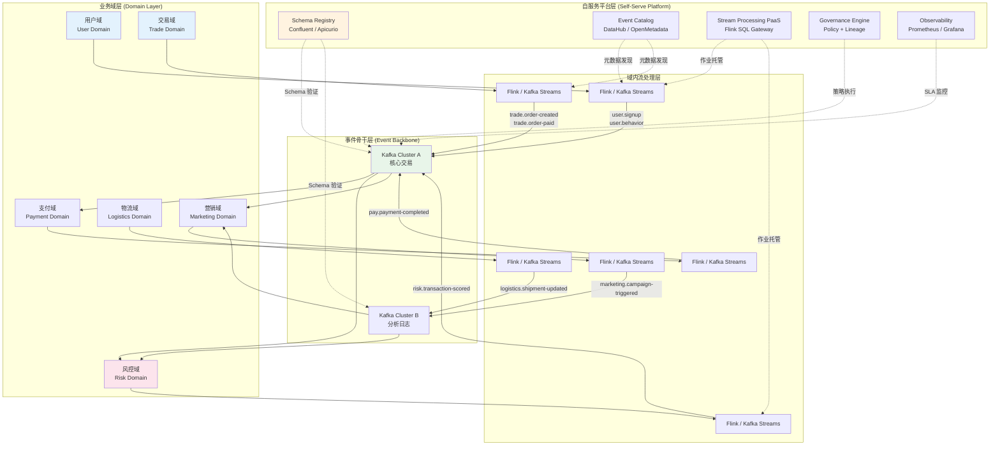
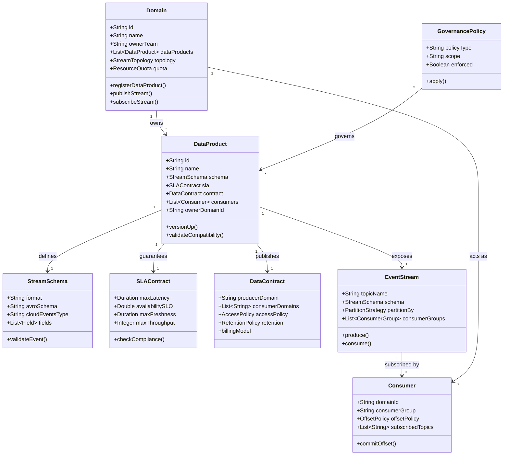
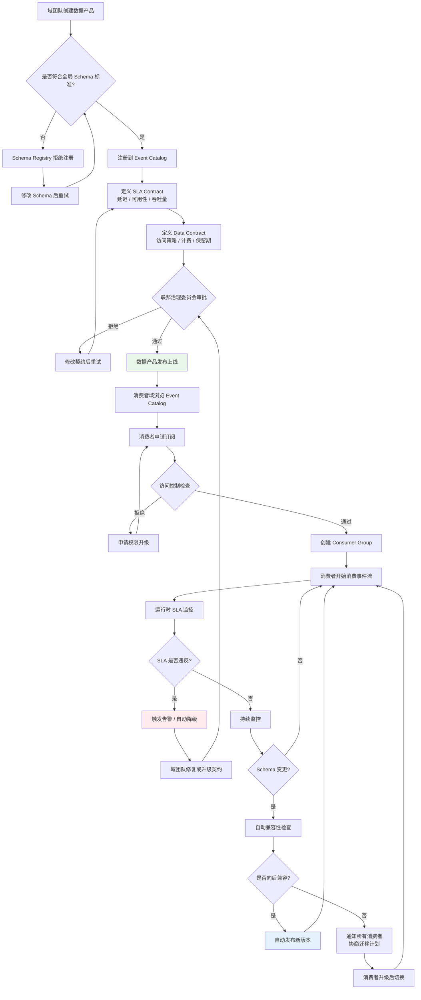

# 数据网格与流处理集成架构

> **所属阶段**: Knowledge/03-business-patterns | **前置依赖**: [Knowledge/03-business-patterns/data-mesh-streaming-architecture-2026.md](./data-mesh-streaming-architecture-2026.md), [Struct/03-relationships/03.06-flink-distributed-architecture.md](../../Struct/03-relationships/03.06-flink-distributed-architecture.md) | **形式化等级**: L3

---

## 1. 概念定义 (Definitions)

### Def-K-03-60-01: 流原生数据网格 (Streaming-Native Data Mesh)

**定义**: 一个流原生数据网格 $\mathcal{M}_{stream}$ 是一个六元组：

$$\mathcal{M}_{stream} = \langle \mathcal{D}, \mathcal{P}, \mathcal{I}, \mathcal{G}, \mathcal{S}, \mathcal{C} \rangle$$

其中：

- $\mathcal{D} = \{d_1, d_2, \ldots, d_n\}$: 业务域集合，每个域 $d_i$ 拥有自治的数据产品团队
- $\mathcal{P}$: 数据产品集合，每个产品以**流接口**为首要输出形式（如 Kafka Topic、Event Stream、Change Data Capture Feed）
- $\mathcal{I}$: 互操作层（Interoperability Layer），定义跨域数据产品的标准协议（Schema Registry、Event Catalog、SLA Contract）
- $\mathcal{G}$: 联邦治理框架（Federated Governance），全局策略与域级自治的平衡机制
- $\mathcal{S}$: 自服务平台（Self-Serve Platform），提供流处理基础设施即服务（Stream Processing as a Service）
- $\mathcal{C}$: 消费契约集合（Consumption Contracts），定义数据产品的使用条款（QoS、访问控制、计费模型）

**与传统 Data Mesh 的区别**: 传统 Data Mesh 以**数据集/表**为核心数据产品形态，而流原生 Data Mesh 以**事件流/变更流**为核心形态，要求数据产品提供低延迟、持续更新的消费接口。

### Def-K-03-60-02: 域流自治边界 (Domain Stream Autonomy Boundary)

**定义**: 域 $d_i$ 的流自治边界 $\partial(d_i)$ 是一个五元组：

$$\partial(d_i) = \langle \mathcal{O}_i, \mathcal{E}_i, \mathcal{T}_i, \mathcal{Q}_i, \mathcal{R}_i \rangle$$

其中：

- $\mathcal{O}_i$: 域 $d_i$ 拥有的输出流集合（Output Streams）
- $\mathcal{E}_i$: 域 $d_i$ 允许消费的输入流集合（Input Streams），来自其他域
- $\mathcal{T}_i$: 域内流处理拓扑（Stream Topology），包括 Source、Transform、Sink 算子
- $\mathcal{Q}_i$: 域内流数据产品的 SLA 质量契约（Latency、Freshness、Availability）
- $\mathcal{R}_i$: 域内资源预算与配额（Resource Quota）

**自治性度量**: 域 $d_i$ 的自治度 $\alpha(d_i)$ 定义为：

$$\alpha(d_i) = 1 - \frac{|\{op \in \mathcal{T}_i : \text{cross-domain dependency}\}|}{|\mathcal{T}_i|}$$

即域内算子中不依赖跨域资源的占比。完全自治时 $\alpha = 1$，完全依赖时 $\alpha = 0$。

---

## 2. 属性推导 (Properties)

### Prop-K-03-60-01: 域间流依赖的传递性

**命题**: 若域 $d_i$ 消费域 $d_j$ 的流，域 $d_j$ 消费域 $d_k$ 的流，则域 $d_i$ 间接依赖域 $d_k$，且延迟呈线性累积：

$$L_{i \leftarrow k} = L_{i \leftarrow j} + L_{j \leftarrow k}$$

其中 $L_{x \leftarrow y}$ 表示从域 $y$ 到域 $x$ 的流处理延迟。

**工程推论**: 在深度嵌套的域依赖链中（如 $d_1 \leftarrow d_2 \leftarrow d_3 \leftarrow d_4$），端到端延迟可能超出业务 SLA。因此流原生 Data Mesh 需要：

1. **延迟预算分配**: 为每条跨域边分配最大允许延迟
2. **短路径优化**: 允许高优先级消费者直接订阅上游域的原始流，绕过中间域
3. **缓存/物化视图**: 在中间域建立物化流缓存，降低重复计算延迟

---

## 3. 关系建立 (Relations)

### 关系 1: Data Mesh 原则到流处理架构的映射

| Data Mesh 原则 | 流处理实现 | 技术组件 |
|---------------|-----------|---------|
| 域导向所有权 | 域内自治的流处理集群/命名空间 | K8s Namespace + Flink Job |
| 数据即产品 | 流数据产品 = Schema + SLA + 文档 | Event Catalog + Data Contract |
| 自服务平台 | 流处理平台即服务 (SPaaS) | Flink SQL Gateway + K8s Operator |
| 联邦计算治理 | 全局 Schema 治理 + 局部执行自治 | Schema Registry + Policy Engine |

### 关系 2: 流处理引擎与 Data Mesh 平台的集成模式

**模式 A: 嵌入式引擎 (Embedded Engine)**

```
域数据产品
  └── 内置轻量流处理 (Kafka Streams / Flink SQL)
      └── 优势: 低耦合，域完全自治
      └── 劣势: 资源碎片化，难以全局优化
```

**模式 B: 中心化平台 (Centralized Platform)**

```
自服务平台
  └── 多租户流处理集群 (Flink on K8s)
      └── 各域提交作业到共享集群
      └── 优势: 资源统一调度，运维成本低
      └── 劣势: 域间资源争抢，隔离复杂
```

**模式 C: 混合联邦 (Hybrid Federated)**

```
联邦平台
  ├── 中心集群: 跨域聚合、复杂分析
  ├── 域内集群: 实时处理、低延迟场景
  └── 边缘节点: IoT 预处理、本地决策
```

---

## 4. 论证过程 (Argumentation)

### 论证 1: 为什么 Data Mesh 需要流原生接口

传统 Data Mesh 以表/文件为核心数据产品形态，存在以下问题：

1. **拉取模式效率低**: 消费者需要轮询（Poll）数据更新，延迟高且浪费资源
2. **变更传播慢**: 数据变更需要经过 ETL 管道才能到达下游，延迟通常以小时计
3. **实时场景覆盖不足**: 欺诈检测、实时推荐、IoT 监控等场景要求秒级/毫秒级数据传播

**流原生接口的优势**:

- **推送模式**: 数据变更即时推送到订阅者，延迟降低 10-1000 倍
- **变更捕获 (CDC)**: 数据库变更直接转化为事件流，消除批处理 ETL
- **多级消费**: 同一事件流可被多个消费者并行订阅，各自维护消费偏移量

### 论证 2: 联邦治理与域自治的张力

流原生 Data Mesh 面临的核心矛盾是：**全局治理要求标准化，域自治要求灵活性**。

**具体表现**:

- Schema 治理：全局要求统一事件 Schema（如 CloudEvents），但各域的业务演进速度不同
- SLA 治理：全局要求跨域延迟可追踪，但域内拓扑变更不应影响下游
- 安全治理：全局要求统一审计，但域内访问控制策略可能更细粒度

**平衡策略**:

1. **契约驱动**: 跨域交互仅通过显式契约（Contract）进行，契约变更需协商
2. **分层治理**: 全局治理仅关注"接口层"（Schema、SLA、安全策略），域内治理关注"实现层"
3. **自动化验证**: 契约兼容性通过 CI/CD 流水线自动验证（Schema 兼容性检查、SLA 回归测试）

---

## 5. 形式证明 / 工程论证 (Proof / Engineering Argument)

### Thm-K-03-60-01: 流原生 Data Mesh 的可扩展性定理

**定理**: 流原生 Data Mesh 的总运维复杂度随域数量 $n$ 的增长为 $O(n \cdot \log n)$，而非中心化数据平台的 $O(n^2)$：

$$C_{\text{ops}}(\mathcal{M}_{stream}) = O(n \cdot \log n) \ll O(n^2) = C_{\text{ops}}(\text{Centralized})$$

**工程论证**:

**中心化平台复杂度分析**: 在中心化数据平台（如传统数据仓库）中，$n$ 个域的数据集成需要 $O(n^2)$ 条 ETL 管道（每对域之间可能存在数据交换）。维护这些管道的 Schema 映射、调度依赖和故障恢复是中心化数据团队的主要负担。

**流原生 Data Mesh 复杂度分析**:

1. **域内复杂度**: 每个域 $d_i$ 独立管理其流处理拓扑，复杂度为 $O(m_i)$，其中 $m_i$ 为域内流数量。总域内复杂度为 $O(\sum m_i) = O(n)$（假设 $m_i$ 为常数）。
2. **跨域复杂度**: 流原生接口通过**发布-订阅**模式解耦生产者和消费者。每个域仅需向中央 Schema Registry 注册其输出流，复杂度为 $O(n)$。
3. **治理复杂度**: 联邦治理通过分层策略实现。全局策略数量为 $O(1)$（统一的 Schema 标准、SLA 框架），域级策略数量为 $O(n)$。策略冲突检测通过自动化工具完成，复杂度为 $O(n \cdot \log n)$（借助索引结构）。

**前提条件**: 该定理成立要求：

1. 存在统一的互操作协议（如 CloudEvents、AsyncAPI）
2. 自服务平台提供标准化的流处理基础设施
3. 域间契约通过自动化工具管理和验证

---

## 6. 实例验证 (Examples)

### 示例 1: 大型电商平台的流原生 Data Mesh

**组织架构**: 8 个业务域（用户、商品、交易、支付、物流、营销、客服、风控）

**流数据产品示例**:

| 域 | 输出流 | Schema | SLA |
|----|--------|--------|-----|
| 交易 | `trade.order-created` | CloudEvents + 订单结构 | P99 延迟 < 100ms |
| 支付 | `pay.payment-completed` | CloudEvents + 支付结构 | P99 延迟 < 200ms |
| 物流 | `logistics.shipment-updated` | CloudEvents + 物流结构 | P99 延迟 < 500ms |
| 风控 | `risk.transaction-scored` | CloudEvents + 风险评分 | P99 延迟 < 50ms |

**集成架构**:

```
各业务域
  └── 域内 Flink 集群 / Kafka Streams
        ├── 生产事件流到 Kafka
        ├── Schema 注册到 Confluent Schema Registry
        └── SLA 监控到 Prometheus + Grafana

自服务平台
  ├── 全局 Schema Registry (跨域兼容检查)
  ├── 事件目录 (Event Catalog, DataHub)
  ├── 统一监控 (跨域延迟追踪)
  └── 权限管理 (RBAC + ABAC)

消费域
  └── 通过 Schema Registry 发现数据产品
        ├── 订阅感兴趣的 Kafka Topic
        └── 消费契约自动验证 (Great Expectations)
```

**治理模式**:

- **联邦 Schema 委员会**: 每域派出代表，每月评审 Schema 变更
- **自动化契约测试**: 每次 Schema 变更自动运行下游兼容性测试
- **SLA 分级**: P0（< 50ms）、P1（< 200ms）、P2（< 1s），不同级别对应不同资源保障

### 示例 2: 金融机构的实时风控 Data Mesh

**挑战**: 风控域需要实时整合交易、用户行为、设备指纹、外部征信等多域数据。

**流原生集成方案**:

```
交易域 ──→ Kafka ──┐
用户域 ──→ Kafka ──┼──→ 风控域 Flink 作业 ──→ 实时评分流
设备域 ──→ Kafka ──┘         ↑
征信域 ──→ CDC ──────────────┘ (异步批量补充)
```

**关键设计**:

- 交易、用户、设备数据通过事件流实时汇聚，延迟 < 100ms
- 外部征信数据通过 CDC 捕获，允许秒级延迟
- 风控域输出 `risk.transaction-scored` 流，供支付域做最终决策
- 所有跨域流通过数据契约定义字段、延迟和质量预期

---

## 7. 可视化 (Visualizations)

### 7.1 流原生 Data Mesh 总体架构

以下架构图展示了流原生 Data Mesh 的核心组件与交互关系：



### 7.2 数据产品类图

以下类图展示了流原生 Data Mesh 中的核心领域模型：



### 7.3 域自治与联邦治理决策流

以下流程图展示了数据产品从注册到消费的完整治理流程：



---

## 8. 引用参考 (References)


---

*文档版本: v1.0 | 创建日期: 2026-04-20 | 形式化等级: L3*
