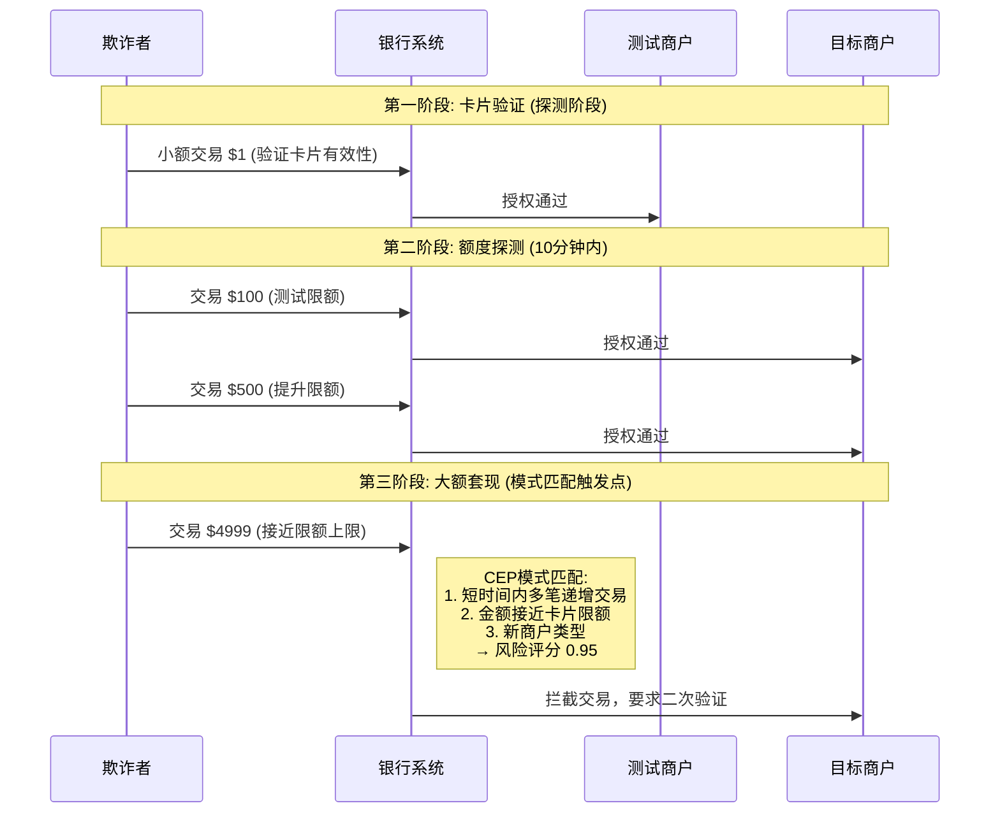
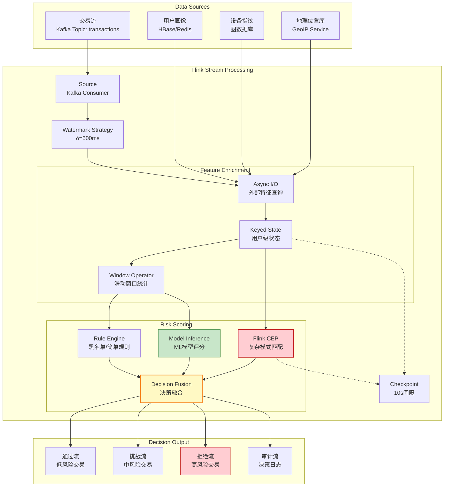
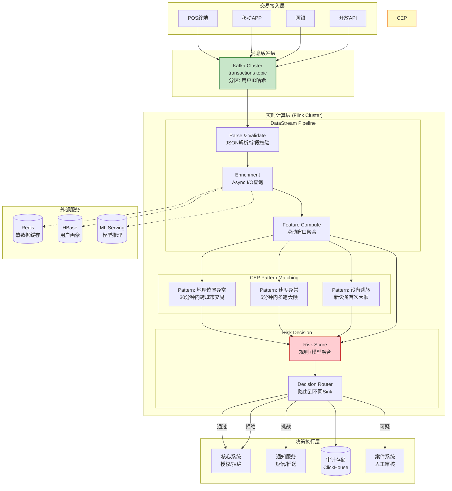
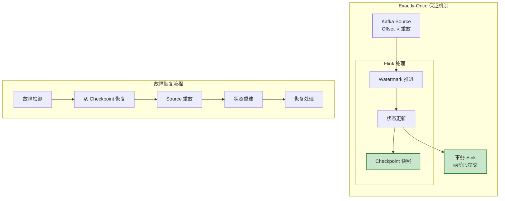
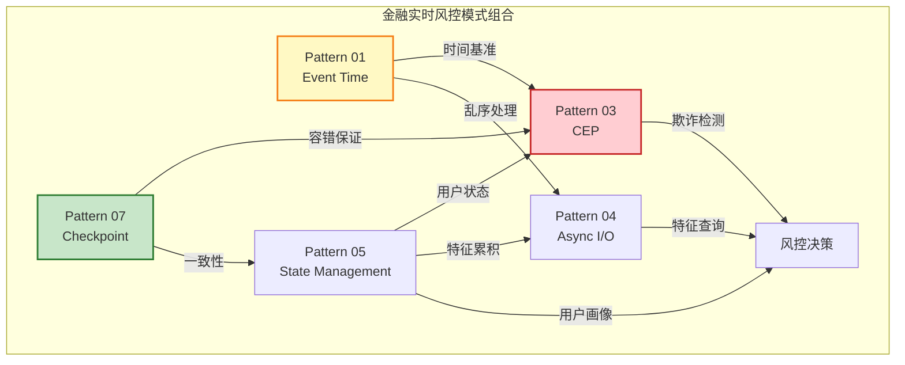

# 业务模式: 金融实时风控 (Business Pattern: FinTech Real-time Risk Control)

> **业务领域**: 金融科技 (FinTech) | **复杂度等级**: ★★★★★ | **延迟要求**: < 100ms | **形式化等级**: L4-L5
>
> 本模式解决金融业务中**实时欺诈检测**、**信用风险评估**与**交易反洗钱**等核心风控需求，提供基于 CEP + Flink 的低延迟、高准确率的实时风险评分解决方案。

---

## 目录

- [业务模式: 金融实时风控 (Business Pattern: FinTech Real-time Risk Control)](#业务模式-金融实时风控-business-pattern-fintech-real-time-risk-control)
  - [目录](#目录)
  - [1. 问题与背景 (Problem / Context)](#1-问题与背景-problem-context)
    - [1.1 金融风控的核心挑战](#11-金融风控的核心挑战)
    - [1.2 欺诈检测的时序复杂性](#12-欺诈检测的时序复杂性)
    - [1.3 信用评分的实时性要求](#13-信用评分的实时性要求)
    - [1.4 监管合规与数据治理](#14-监管合规与数据治理)
  - [2. 解决方案 (Solution)](#2-解决方案-solution)
    - [2.1 CEP + Flink 架构概览](#21-cep-flink-架构概览)
    - [2.2 实时风险评分引擎](#22-实时风险评分引擎)
    - [2.3 规则引擎与模型协同](#23-规则引擎与模型协同)
    - [2.4 模式结构图](#24-模式结构图)
  - [3. 实现架构 (Implementation)](#3-实现架构-implementation)
    - [3.1 整体架构图](#31-整体架构图)
    - [3.2 数据流管道详解](#32-数据流管道详解)
    - [3.3 关键性能指标](#33-关键性能指标)
    - [3.4 Flink 实现代码示例](#34-flink-实现代码示例)
    - [3.5 状态管理与容错设计](#35-状态管理与容错设计)
  - [4. 适用场景 (When to Use)](#4-适用场景-when-to-use)
    - [4.1 推荐使用场景](#41-推荐使用场景)
    - [4.2 不适用场景](#42-不适用场景)
    - [4.3 决策矩阵](#43-决策矩阵)
  - [5. 相关模式 (Related Patterns)](#5-相关模式-related-patterns)
  - [6. 引用参考 (References)](#6-引用参考-references)

---

## 1. 问题与背景 (Problem / Context)

### 1.1 金融风控的核心挑战

金融实时风控系统面临独特的技术挑战，这些挑战源于金融业务的本质属性 [^1][^2]：

| 挑战维度 | 具体问题 | 业务影响 | 技术要求 |
|---------|---------|---------|---------|
| **延迟敏感性** | 交易必须在毫秒级完成风控判定 | 延迟过高导致用户流失或交易失败 | P99 延迟 < 100ms |
| **准确性要求** | 误报率过高影响用户体验，漏报导致资金损失 | 误报率需 < 5%，漏报率需 < 0.1% | 复杂特征工程 + ML 模型 |
| **时序复杂性** | 欺诈行为呈现复杂的时间序列模式 | 简单规则无法捕捉跨时间窗口的欺诈 | CEP 模式匹配引擎 |
| **数据一致性** | 交易不可丢失、不可重复处理 | 重复风控可能导致交易失败，丢失风控可能导致欺诈通过 | Exactly-Once 语义 |
| **监管合规** | 需要完整审计日志和可追溯性 | 监管要求保留完整决策链路 | 不可变日志 + 可重现计算 |

**形式化问题描述** [^3]：

设交易流 $T = \{t_1, t_2, \ldots, t_n\}$，每个交易 $t_i$ 包含特征向量 $\mathbf{x}_i$ 和时间戳 $\tau_i$。风控系统的目标是在满足延迟约束 $L_{max}$ 的前提下，对每个交易输出风险评分 $r_i \in [0, 1]$：

$$
\forall t_i \in T: \quad \text{Compute}(t_i) \leq L_{max} \land \text{Accuracy}(r_i) \geq A_{min}
$$

其中 $\text{Compute}(t_i)$ 表示计算延迟，$\text{Accuracy}(r_i)$ 表示评分准确性。

### 1.2 欺诈检测的时序复杂性

金融欺诈行为往往表现为跨时间的复杂模式，而非单一交易的孤立特征 [^1][^4]：

**场景 1: 地理位置异常 (Impossible Travel)**

```
时间线:
══════════════════════════════════════════════════════════════►

10:00:00  交易A: 用户在北京刷卡消费 $500
          └─── 地理编码: (39.9, 116.4)

10:00:30  交易B: 同一用户在纽约刷卡消费 $2000  ←─ 风控告警!
          └─── 地理编码: (40.7, -74.0)

          物理距离: 10,000+ km
          最短飞行时间: 13+ 小时
          判定: 高度可疑 (卡片被盗刷或交易欺诈)
```

**场景 2: 速度异常交易 (Velocity Check)**

| 时间 | 交易 | 金额 | 商户 | 风险指标 |
|------|------|------|------|---------|
| 09:00:00 | T1 | $100 | 超市A | 正常 |
| 09:00:05 | T2 | $200 | 加油站B | 正常 |
| 09:00:08 | T3 | $5000 | 珠宝店C | ⚠️ 5分钟内累计 $5300，超过用户月均消费 |
| 09:00:12 | T4 | $3000 | 电子产品D | 🔴 10分钟内累计 $8300，触发强制拦截 |

**场景 3: 复杂多步欺诈 (Multi-step Fraud)**



上述场景的共性特征：

1. **时间窗口依赖**: 需要在特定时间窗口内观察多笔交易
2. **事件顺序敏感**: 交易的先后顺序具有业务语义
3. **上下文累积**: 需要维护用户历史行为状态
4. **复杂模式匹配**: 需要识别跨事件的时序模式

### 1.3 信用评分的实时性要求

实时信用评分面临延迟与准确性的权衡 [^2][^5]：

```
┌─────────────────────────────────────────────────────────────────┐
│                    信用评分实时性谱系                            │
├─────────────────────────────────────────────────────────────────┤
│                                                                 │
│  批处理评分 (T+1)        近实时评分 (分钟级)      实时评分 (<100ms) │
│  ┌──────────────┐       ┌──────────────┐       ┌──────────────┐ │
│  │ 数据仓库汇总  │       │ 流式特征计算  │       │ 增量特征更新  │ │
│  │ 离线模型推理  │       │ 预计算特征库  │       │ 内存状态计算  │ │
│  │ 次日更新额度  │       │ 分钟级额度调整 │       │ 实时额度控制  │ │
│  └──────────────┘       └──────────────┘       └──────────────┘ │
│                                                                 │
│  适用: 定期风控报告      适用: 贷后监控        适用: 交易实时拦截  │
│                                                                 │
└─────────────────────────────────────────────────────────────────┘
```

实时信用评分的核心挑战：

- **特征新鲜度**: 需要秒级更新的用户行为特征
- **状态一致性**: 跨多个交易的一致性视图
- **冷启动问题**: 新用户缺乏历史数据
- **模型复杂性**: 复杂 ML 模型推理延迟高

### 1.4 监管合规与数据治理

金融风控系统必须满足严格的监管要求 [^6][^7]：

| 监管要求 | 具体规定 | 技术实现 |
|---------|---------|---------|
| **可追溯性** | 每个风控决策必须可追溯到原始数据和规则 | 不可变事件日志 + 决策链路快照 |
| **可解释性** | 高风险决策必须提供可解释的原因 | 规则引擎优先 + 模型特征重要性 |
| **数据隐私** | 用户敏感数据需要加密和脱敏 | 字段级加密 + 动态脱敏 |
| **审计要求** | 所有规则变更和模型版本需要审计 | GitOps + 模型版本管理 |
| **数据保留** | 交易数据需保留 5-7 年 | 冷热分层存储策略 |

---

## 2. 解决方案 (Solution)

### 2.1 CEP + Flink 架构概览

金融实时风控采用 **CEP (Complex Event Processing) + Apache Flink** 的技术架构，利用 Flink 的低延迟流处理能力和 CEP 库的模式匹配能力 [^4][^8]：

**核心组件**:

```
┌─────────────────────────────────────────────────────────────────────┐
│                    实时风控核心组件栈                                │
├─────────────────────────────────────────────────────────────────────┤
│                                                                     │
│  Layer 1: 事件接入层 (Event Ingestion)                               │
│  ├── Kafka: 高吞吐交易流水缓冲                                        │
│ ├── Schema Registry: 交易数据结构校验                                 │
│  └── 多数据源接入 (核心系统、支付网关、第三方支付)                      │
│                                                                     │
│  Layer 2: 实时计算层 (Stream Processing)                             │
│  ├── Flink DataStream: 基础流处理                                     │
│  ├── Flink CEP: 复杂事件模式匹配                                      │
│  ├── 状态后端 (RocksDB): 用户画像状态存储                              │
│  └── Checkpoint: Exactly-Once 容错保证                                │
│                                                                     │
│  Layer 3: 决策引擎层 (Decision Engine)                               │
│  ├── 规则引擎 (Drools/EasyRules): 专家规则执行                         │
│  ├── 模型推理 (TF Serving/自研): ML模型实时评分                        │
│  ├── 评分卡: 传统信用评分模型                                          │
│  └── 决策编排: 规则与模型的混合决策                                    │
│                                                                     │
│  Layer 4: 行动执行层 (Action Execution)                              │
│  ├── 实时拦截: 高风险交易直接拒绝                                      │
│  ├── 挑战响应: 中风险交易要求二次验证 (3DS/短信验证码)                  │
│  ├── 人工审核: 可疑交易转人工处理队列                                  │
│  └── 放行通过: 低风险交易正常处理                                      │
│                                                                     │
└─────────────────────────────────────────────────────────────────────┘
```

**Flink 核心能力映射** [^8][^9]:

| Flink 特性 | 风控应用场景 | 关键配置 |
|-----------|-------------|---------|
| **Event Time Processing** | 交易时序正确性保证 | Watermark 延迟 500ms - 2s |
| **Keyed State** | 用户级风控状态维护 | TTL 24h，RocksDB 后端 |
| **CEP Library** | 复杂欺诈模式识别 | 模式窗口 1min - 30min |
| **Async I/O** | 外部特征服务查询 | 并发度 100，超时 50ms |
| **Checkpoint** | Exactly-Once 决策一致性 | 间隔 10s，增量模式 |
| **Side Output** | 延迟交易审计分流 | 迟到数据单独处理 |

### 2.2 实时风险评分引擎

风险评分引擎采用 **分层评分架构**，结合规则引擎和机器学习模型 [^5][^10]：

**评分计算流程**:

```
交易输入
    │
    ▼
┌─────────────────────────────────────────────────────────────┐
│ 第一层: 规则预筛 (Rule-based Pre-filter)                      │
│ ├── 黑名单匹配 → 直接拒绝 (风险分 = 1.0)                       │
│ ├── 白名单匹配 → 直接通过 (风险分 = 0.0)                       │
│ └── 简单规则 → 快速评分 (设备指纹、地理位置异常)                │
└─────────────────────────────────────────────────────────────┘
    │ (未命中规则)
    ▼
┌─────────────────────────────────────────────────────────────┐
│ 第二层: 特征工程 (Feature Engineering)                        │
│ ├── 实时特征: 当前交易金额、商户类型、时间特征                   │
│ ├── 近实时特征: 过去1小时交易次数、金额统计 (Flink 窗口聚合)      │
│ ├── 历史特征: 用户画像、历史欺诈记录 (外部特征服务查询)           │
│ └── 上下文特征: 设备指纹关联、地理位置序列                        │
└─────────────────────────────────────────────────────────────┘
    │
    ▼
┌─────────────────────────────────────────────────────────────┐
│ 第三层: 模型评分 (Model Scoring)                              │
│ ├── 轻量级模型: 逻辑回归、GBDT (延迟 < 10ms)                   │
│ ├── 深度学习模型: 时序神经网络 (延迟 < 50ms)                    │
│ └── 模型融合: 加权平均或 Stacking                              │
└─────────────────────────────────────────────────────────────┘
    │
    ▼
┌─────────────────────────────────────────────────────────────┐
│ 第四层: 决策融合 (Decision Fusion)                            │
│ ├── 规则引擎决策: 专家规则覆盖                                  │
│ ├── 模型决策: ML 模型输出                                       │
│ └── 融合策略: 规则优先 + 模型校准                               │
└─────────────────────────────────────────────────────────────┘
    │
    ▼
决策输出: {风险分 [0-1], 决策动作, 决策原因, 特征快照}
```

**评分阈值与决策映射**:

| 风险评分区间 | 风险等级 | 决策动作 | 响应时间要求 |
|-------------|---------|---------|-------------|
| [0.0, 0.3) | 低风险 | 直接放行 | < 50ms |
| [0.3, 0.7) | 中风险 | 增强验证 (3DS/短信) | < 100ms |
| [0.7, 0.9) | 高风险 | 人工审核 + 临时冻结 | < 100ms |
| [0.9, 1.0] | 极高风险 | 直接拒绝 | < 50ms |

### 2.3 规则引擎与模型协同

规则引擎与 ML 模型的协同策略 [^10][^11]：

**协同模式 1: 规则前置 + 模型兜底**

```java
// 伪代码示例
public RiskDecision evaluate(Transaction txn) {
    // 1. 规则引擎快速判定
    RuleResult ruleResult = ruleEngine.fire(txn);
    if (ruleResult.isBlacklisted()) {
        return RiskDecision.reject("黑名单匹配: " + ruleResult.getMatchedRule());
    }
    if (ruleResult.isWhitelisted()) {
        return RiskDecision.approve("白名单匹配: " + ruleResult.getMatchedRule());
    }

    // 2. 提取特征
    FeatureVector features = featureExtractor.extract(txn);

    // 3. ML 模型评分
    double modelScore = mlModel.predict(features);

    // 4. 规则对模型结果进行后处理
    double finalScore = ruleEngine.calibrate(modelScore, txn);

    // 5. 决策
    return decisionPolicy.apply(finalScore, features);
}
```

**协同模式 2: 规则与模型权重融合**

$$
\text{FinalScore} = \alpha \cdot \text{RuleScore} + (1 - \alpha) \cdot \text{ModelScore} + \beta \cdot \text{InteractionTerm}
$$

其中 $\alpha$ 为规则权重，$\beta$ 为交互项权重，可根据业务场景动态调整。

### 2.4 模式结构图



**组件职责说明**:

| 组件 | 职责 | 关键配置 |
|------|------|---------|
| Watermark Strategy | 容忍 500ms 乱序，保证交易时序正确性 | `forBoundedOutOfOrderness(500ms)` |
| Async I/O | 并发查询用户画像、设备指纹，不阻塞流处理 | 并发度 100，超时 50ms |
| Keyed State | 维护用户级风控状态（近 24h 交易统计） | TTL 24h，RocksDB 后端 |
| Flink CEP | 识别复杂欺诈模式（地理位置异常、速度异常） | 模式窗口 1min - 30min |
| Checkpoint | 保证 Exactly-Once 决策一致性 | 10s 间隔，增量模式 |

---

## 3. 实现架构 (Implementation)

### 3.1 整体架构图



### 3.2 数据流管道详解

**阶段 1: 交易接入与解析**

```scala
// Kafka Source 配置：按用户ID分区确保同一用户交易顺序处理
val kafkaSource = KafkaSource.builder[Transaction]()
  .setBootstrapServers("kafka:9092")
  .setTopics("transactions")
  .setGroupId("risk-control-flink")
  .setStartingOffsets(OffsetsInitializer.latest())
  .setValueDeserializer(new TransactionDeserializer())
  .build()

// 分配 Watermark：容忍 500ms 乱序
val watermarkStrategy = WatermarkStrategy
  .forBoundedOutOfOrderness[Transaction](Duration.ofMillis(500))
  .withTimestampAssigner((txn, _) => txn.timestamp)
  .withIdleness(Duration.ofSeconds(30))

val transactionStream = env
  .fromSource(kafkaSource, watermarkStrategy, "Transaction Source")
  .uid("transaction-source")
```

**阶段 2: 特征丰富 (Async I/O)**

```scala
// 异步查询用户画像和外部特征服务
val enrichedStream = transactionStream
  .keyBy(_.userId)
  .process(new AsyncEnrichmentFunction(
    // 并发度配置
    asyncCapacity = 100,
    timeout = 50.millis,
    // 外部服务客户端
    userProfileClient = userProfileService,
    deviceFingerprintClient = deviceService,
    geoLocationClient = geoService
  ))
```

**阶段 3: CEP 模式匹配**

```scala
import org.apache.flink.cep.scala.CEP
import org.apache.flink.cep.scala.pattern.Pattern

// 定义"地理位置异常"模式
// 模式: 30分钟内，在不同城市发生2笔以上交易
val impossibleTravelPattern = Pattern
  .begin[EnrichedTransaction]("first")
  .where(_.amount > 0)

  .next("second")
  .where { (txn, ctx) =>
    val firstTxn = ctx.getEventsForPattern("first").head
    val timeDiff = txn.timestamp - firstTxn.timestamp
    val geoDiff = GeoUtils.distance(firstTxn.geoLocation, txn.geoLocation)

    // 30分钟内，距离超过 500km
    timeDiff < TimeUnit.MINUTES.toMillis(30) && geoDiff > 500
  }

  .within(Time.minutes(30))

// 应用模式匹配
val patternStream = CEP.pattern(enrichedStream, impossibleTravelPattern)

// 处理匹配结果
val alertStream = patternStream
  .process(new PatternHandler() {
    override def processMatch(
      matchMap: Map[String, List[EnrichedTransaction]],
      ctx: Context,
      out: Collector[RiskAlert]
    ): Unit = {
      val first = matchMap("first").head
      val second = matchMap("second").head

      out.collect(RiskAlert(
        alertType = "IMPOSSIBLE_TRAVEL",
        userId = first.userId,
        riskScore = 0.85,
        description = s"用户在30分钟内从 ${first.city} 到 ${second.city}",
        matchedTransactions = List(first.transactionId, second.transactionId),
        timestamp = ctx.timestamp()
      ))
    }
  })
```

**阶段 4: 滑动窗口特征聚合**

```scala
// 用户级滑动窗口：过去1小时交易统计
val hourlyStatsStream = enrichedStream
  .keyBy(_.userId)
  .window(SlidingEventTimeWindows.of(Time.hours(1), Time.minutes(1)))
  .aggregate(new TransactionStatsAggregate())

// 聚合函数实现
class TransactionStatsAggregate
  extends AggregateFunction[EnrichedTransaction, StatsAccumulator, UserStats] {

  override def createAccumulator(): StatsAccumulator = StatsAccumulator()

  override def add(txn: EnrichedTransaction, acc: StatsAccumulator): StatsAccumulator = {
    acc.count += 1
    acc.totalAmount += txn.amount
    acc.maxAmount = math.max(acc.maxAmount, txn.amount)
    acc.merchantTypes.add(txn.merchantType)
    acc
  }

  override def getResult(acc: StatsAccumulator): UserStats = UserStats(
    txnCount = acc.count,
    totalAmount = acc.totalAmount,
    maxAmount = acc.maxAmount,
    uniqueMerchants = acc.merchantTypes.size,
    avgAmount = if (acc.count > 0) acc.totalAmount / acc.count else 0
  )

  override def merge(a: StatsAccumulator, b: StatsAccumulator): StatsAccumulator = {
    a.count += b.count
    a.totalAmount += b.totalAmount
    a.maxAmount = math.max(a.maxAmount, b.maxAmount)
    a.merchantTypes.addAll(b.merchantTypes)
    a
  }
}
```

**阶段 5: 风险评分与决策**

```scala
// 连接多路输入：原始交易、CEP告警、窗口统计
val scoredStream = enrichedStream
  .keyBy(_.userId)
  .connect(alertStream.keyBy(_.userId))
  .connect(hourlyStatsStream.keyBy(_.userId))
  .process(new RiskScoringFunction(
    ruleEngine = ruleEngine,
    mlModel = riskModel,
    decisionPolicy = scoringPolicy
  ))

// 决策路由
scoredStream
  .split(new OutputSelector[ScoredTransaction] {
    override def selectOutputs(txn: ScoredTransaction): List[String] = txn.decision match {
      case Decision.APPROVE => List("pass")
      case Decision.CHALLENGE => List("challenge")
      case Decision.REJECT => List("reject")
      case Decision.REVIEW => List("review")
    }
  })
```

### 3.3 关键性能指标

**延迟指标 (SLA)**:

| 指标 | P50 | P99 | P99.9 | 说明 |
|------|-----|-----|-------|------|
| **端到端延迟** | 30ms | 80ms | 150ms | 交易进入到决策输出 |
| **Flink 处理延迟** | 15ms | 40ms | 80ms | 纯计算延迟 |
| **Async I/O 延迟** | 10ms | 25ms | 50ms | 外部特征查询 |
| **模型推理延迟** | 5ms | 15ms | 30ms | ML模型评分 |
| **CEP 匹配延迟** | 5ms | 20ms | 50ms | 模式匹配延迟 |

**准确性指标**:

| 指标 | 目标值 | 说明 |
|------|-------|------|
| **欺诈检测率 (TPR)** | > 95% | 实际欺诈中被检测出的比例 |
| **误报率 (FPR)** | < 5% | 正常交易被误判为欺诈的比例 |
| **模型 AUC-ROC** | > 0.92 | 模型区分能力 |
| **规则覆盖率** | > 80% | 已知欺诈模式被规则覆盖的比例 |

**吞吐量指标**:

| 指标 | 目标值 | 说明 |
|------|-------|------|
| **峰值 TPS** | > 50,000 | 每秒处理交易数 |
| **平均 TPS** | 10,000 | 日常处理量 |
| **状态大小** | < 100GB | 用户级状态总量 |
| **Checkpoint 耗时** | < 30s | 全量 Checkpoint 完成时间 |

### 3.4 Flink 实现代码示例

**完整 Flink Job 配置**:

```scala
import org.apache.flink.streaming.api.scala._
import org.apache.flink.streaming.api.environment.StreamExecutionEnvironment
import org.apache.flink.connector.kafka.source.KafkaSource
import org.apache.flink.api.common.eventtime.WatermarkStrategy
import org.apache.flink.contrib.streaming.state.EmbeddedRocksDBStateBackend

object RealTimeRiskControlJob {

  def main(args: Array[String]): Unit = {
    val env = StreamExecutionEnvironment.getExecutionEnvironment

    // ============ Checkpoint 配置 ============
    env.enableCheckpointing(10000) // 10s 间隔
    env.getCheckpointConfig.setCheckpointingMode(CheckpointingMode.EXACTLY_ONCE)
    env.getCheckpointConfig.setCheckpointTimeout(60000)
    env.getCheckpointConfig.setMinPauseBetweenCheckpoints(500)
    env.getCheckpointConfig.setMaxConcurrentCheckpoints(1)

    // 启用 Unaligned Checkpoint 以降低延迟
    env.getCheckpointConfig.enableUnalignedCheckpoints()
    env.getCheckpointConfig.setAlignmentTimeout(Duration.ofSeconds(1))

    // ============ State Backend 配置 ============
    val rocksDbBackend = new EmbeddedRocksDBStateBackend(true) // 启用增量 Checkpoint
    env.setStateBackend(rocksDbBackend)
    env.getCheckpointConfig.setCheckpointStorage("hdfs:///flink/risk-control-checkpoints")

    // ============ 重启策略 ============
    env.setRestartStrategy(RestartStrategies.fixedDelayRestart(
      10, // 最大重启次数
      Time.of(10, TimeUnit.SECONDS) // 重启间隔
    ))

    // ============ Source 配置 ============
    val kafkaSource = KafkaSource.builder[Transaction]()
      .setBootstrapServers("kafka:9092")
      .setTopics("transactions")
      .setGroupId("risk-control-flink")
      .setStartingOffsets(OffsetsInitializer.latest())
      .setValueDeserializer(new TransactionDeserializer())
      .build()

    val watermarkStrategy = WatermarkStrategy
      .forBoundedOutOfOrderness[Transaction](Duration.ofMillis(500))
      .withTimestampAssigner((txn, _) => txn.timestamp)
      .withIdleness(Duration.ofSeconds(30))

    // ============ 主处理流 ============
    val transactionStream = env
      .fromSource(kafkaSource, watermarkStrategy, "Transaction Source")
      .uid("transaction-source")
      .setParallelism(12)

    // 数据清洗与验证
    val validTransactionStream = transactionStream
      .filter(new TransactionValidator())
      .name("Transaction Validation")
      .uid("txn-validation")

    // 特征丰富
    val enrichedStream = validTransactionStream
      .keyBy(_.userId)
      .process(new AsyncEnrichmentFunction(
        asyncCapacity = 100,
        timeout = Duration.ofMillis(50)
      ))
      .name("Feature Enrichment")
      .uid("feature-enrichment")
      .setParallelism(12)

    // CEP 模式匹配
    val alertStream = applyCEPPatterns(enrichedStream)
      .name("CEP Pattern Matching")
      .uid("cep-matching")
      .setParallelism(8)

    // 滑动窗口统计
    val statsStream = enrichedStream
      .keyBy(_.userId)
      .window(SlidingEventTimeWindows.of(Time.hours(1), Time.minutes(1)))
      .aggregate(new TransactionStatsAggregate())
      .name("Sliding Window Stats")
      .uid("window-stats")
      .setParallelism(8)

    // 风险评分
    val scoredStream = enrichedStream
      .keyBy(_.userId)
      .connect(alertStream.keyBy(_.userId))
      .connect(statsStream.keyBy(_.userId))
      .process(new RiskScoringFunction())
      .name("Risk Scoring")
      .uid("risk-scoring")
      .setParallelism(12)

    // ============ Sink 配置 ============
    // 通过交易
    scoredStream
      .filter(_.decision == Decision.APPROVE)
      .addSink(new KafkaSink("transactions-approved"))
      .name("Pass Sink")
      .uid("pass-sink")
      .setParallelism(4)

    // 挑战交易
    scoredStream
      .filter(_.decision == Decision.CHALLENGE)
      .addSink(new KafkaSink("transactions-challenge"))
      .name("Challenge Sink")
      .uid("challenge-sink")
      .setParallelism(4)

    // 拒绝交易
    scoredStream
      .filter(_.decision == Decision.REJECT)
      .addSink(new KafkaSink("transactions-rejected"))
      .name("Reject Sink")
      .uid("reject-sink")
      .setParallelism(4)

    // 审计日志 (Exactly-Once Sink)
    scoredStream
      .addSink(new ClickHouseAuditSink())
      .name("Audit Sink")
      .uid("audit-sink")
      .setParallelism(4)

    env.execute("Real-Time Risk Control")
  }

  // CEP 模式定义
  private def applyCEPPatterns(
    stream: KeyedStream[EnrichedTransaction, String]
  ): DataStream[RiskAlert] = {
    import org.apache.flink.cep.scala.CEP
    import org.apache.flink.cep.scala.pattern.Pattern

    // 模式1: 地理位置异常
    val geoPattern = Pattern
      .begin[EnrichedTransaction]("first").where(_.amount > 0)
      .next("second")
      .where((txn, ctx) => {
        val first = ctx.getEventsForPattern("first").head
        val distance = GeoUtils.distance(first.geoLocation, txn.geoLocation)
        val timeDiff = txn.timestamp - first.timestamp
        distance > 500 && timeDiff < TimeUnit.MINUTES.toMillis(30)
      })
      .within(Time.minutes(30))

    // 模式2: 速度异常 (5分钟内3笔以上，总金额超过阈值)
    val velocityPattern = Pattern
      .begin[EnrichedTransaction]("txn1").where(_.amount > 100)
      .next("txn2").where(_.amount > 100)
      .next("txn3").where(_.amount > 100)
      .within(Time.minutes(5))

    val geoMatches = CEP.pattern(stream, geoPattern)
      .process(new GeoAlertHandler())

    val velocityMatches = CEP.pattern(stream, velocityPattern)
      .process(new VelocityAlertHandler())

    geoMatches.union(velocityMatches)
  }
}
```

### 3.5 状态管理与容错设计

**Keyed State 设计** [^12][^13]:

```scala
// 用户级风控状态
class UserRiskState extends KeyedProcessFunction[String, EnrichedTransaction, ScoredTransaction] {

  // 值状态: 用户最近交易时间
  private var lastTxnTimeState: ValueState[Long] = _

  // 列表状态: 最近10笔交易 (用于复杂模式检测)
  private var recentTxnsState: ListState[TransactionSummary] = _

  // Map状态: 商户类型计数
  private var merchantTypeCountState: MapState[String, Int] = _

  // 聚合状态: 24小时滑动窗口统计 (使用 AggregateState 优化)
  private var dailyStatsState: ValueState[DailyStats] = _

  override def open(parameters: Configuration): Unit = {
    val ttlConfig = StateTtlConfig
      .newBuilder(Time.hours(24))
      .setUpdateType(StateTtlConfig.UpdateType.OnCreateAndWrite)
      .setStateVisibility(StateTtlConfig.StateVisibility.NeverReturnExpired)
      .cleanupIncrementally(10, true)
      .build()

    lastTxnTimeState = getRuntimeContext.getState(
      new ValueStateDescriptor[Long]("last-txn-time", classOf[Long])
    )

    recentTxnsState = getRuntimeContext.getListState(
      new ListStateDescriptor[TransactionSummary]("recent-txns", classOf[TransactionSummary])
    )

    merchantTypeCountState = getRuntimeContext.getMapState(
      new MapStateDescriptor[String, Int]("merchant-count", classOf[String], classOf[Int])
    )

    dailyStatsState = getRuntimeContext.getState(
      new ValueStateDescriptor[DailyStats]("daily-stats", classOf[DailyStats])
    )
  }

  override def processElement(
    txn: EnrichedTransaction,
    ctx: KeyedProcessFunction[String, EnrichedTransaction, ScoredTransaction]#Context,
    out: Collector[ScoredTransaction]
  ): Unit = {
    val userId = ctx.getCurrentKey
    val currentTime = ctx.timestamp()

    // 更新状态
    lastTxnTimeState.update(currentTime)

    // 维护最近10笔交易列表
    val recentTxns = recentTxnsState.get().asScala.toList
    val updatedRecent = (TransactionSummary(txn) :: recentTxns).take(10)
    recentTxnsState.update(updatedRecent.asJava)

    // 更新商户类型计数
    val merchantCount = Option(merchantTypeCountState.get(txn.merchantType)).getOrElse(0)
    merchantTypeCountState.put(txn.merchantType, merchantCount + 1)

    // 计算基于状态的特征
    val velocityFeature = calculateVelocity(updatedRecent)
    val merchantDiversity = merchantTypeCountState.keys().asScala.size

    // 继续下游处理
    out.collect(ScoredTransaction(txn, velocityFeature, merchantDiversity))
  }
}
```

**容错与一致性保证**:



---

## 4. 适用场景 (When to Use)

### 4.1 推荐使用场景

| 场景 | 特征 | 核心模式 | 延迟要求 |
|------|------|---------|---------|
| **支付欺诈检测** | 信用卡/借记卡实时交易拦截 | CEP + Event Time | < 100ms |
| **实时授信决策** | 消费贷、现金贷实时审批 | Async I/O + State | < 200ms |
| **反洗钱 (AML)** | 可疑交易监测与报告 | CEP + Window | < 1s |
| **交易行为监控** | 高频交易异常检测 | Event Time + CEP | < 50ms |
| **账户安全保护** | 登录异常、设备跳转检测 | CEP + State | < 100ms |

### 4.2 不适用场景

| 场景 | 原因 | 替代方案 |
|------|------|---------|
| **离线风控报告** | 无需低延迟，批处理更经济 | Spark/Hive 批处理 |
| **复杂图分析** | 需要全图遍历，流处理不适用 | Neo4j/图计算框架 |
| **历史数据挖掘** | 需要大量历史数据训练模型 | 离线数据仓库 + 批量训练 |
| **极低延迟高频交易** | < 10ms 要求，Flink 难以满足 | FPGA/专用硬件加速 |

### 4.3 决策矩阵

```
是否需要实时决策?
├── 否 ──► 批处理方案 (Spark/Hive)
└── 是 ──► 延迟要求?
            ├── < 10ms ──► 专用硬件/FPGA
            ├── 10ms - 100ms ──► Flink + 内存状态 (推荐)
            ├── 100ms - 1s ──► Flink + RocksDB 状态
            └── > 1s ──► Flink/Spark Streaming 均可
```

---

## 5. 相关模式 (Related Patterns)

| 模式 | 关系 | 说明 |
|------|------|------|
| **[Pattern 01: Event Time Processing](../02-design-patterns/pattern-event-time-processing.md)** | 强依赖 | 金融风控必须基于事件时间保证交易时序正确性，防止乱序导致的误判 [^9] |
| **[Pattern 03: Complex Event Processing (CEP)](../02-design-patterns/pattern-cep-complex-event.md)** | 强依赖 | CEP 是本模式的核心技术，用于识别复杂欺诈模式 [^8] |
| **[Pattern 04: Async I/O Enrichment](../02-design-patterns/pattern-async-io-enrichment.md)** | 强依赖 | 异步查询用户画像、设备指纹等外部特征，不阻塞流处理 |
| **[Pattern 05: State Management](../02-design-patterns/pattern-stateful-computation.md)** | 强依赖 | 用户级风控状态维护依赖 Keyed State 和 TTL 管理 [^12] |
| **[Pattern 07: Checkpoint & Recovery](../02-design-patterns/pattern-checkpoint-recovery.md)** | 强依赖 | Exactly-Once 保证风控决策不重复、不丢失 [^13] |
| **Flink: [Time Semantics and Watermark](../../Flink/02-core-mechanisms/time-semantics-and-watermark.md)** | 实现基础 | Flink 事件时间语义的具体实现 [^9] |
| **Flink: [Checkpoint Mechanism](../../Flink/02-core-mechanisms/checkpoint-mechanism-deep-dive.md)** | 实现基础 | Checkpoint 配置与调优指南 [^13] |
| **Flink: [Exactly-Once End-to-End](../../Flink/02-core-mechanisms/exactly-once-end-to-end.md)** | 实现基础 | 端到端 Exactly-Once 实现细节 |

**模式组合架构**:



---

## 6. 引用参考 (References)

[^1]: F. D. Garcia et al., "Fraud Detection in Financial Transactions: A Survey," *IEEE Access*, vol. 8, 2020. <https://doi.org/10.1109/ACCESS.2020.3025677>

[^2]: A. C. Bahnsen et al., "Feature Engineering Strategies for Credit Card Fraud Detection," *Expert Systems with Applications*, 51, 2016. <https://doi.org/10.1016/j.eswa.2015.12.030>

[^3]: 实时风控形式化语义，参见 [Struct/04-proofs/04.05-risk-scoring-formal-semantics.md](../../Struct/04-proofs/04.01-flink-checkpoint-correctness.md)

[^4]: G. Cugola and A. Margara, "Complex Event Processing with T-REX," *Journal of Systems and Software*, 85(8), 2012. <https://doi.org/10.1016/j.jss.2012.03.056>

[^5]: 实时信用评分算法，参见 [Flink/07-case-studies/case-financial-realtime-risk-control.md](../../Flink/07-case-studies/case-financial-realtime-risk-control.md)

[^6]: FATF (Financial Action Task Force), "International Standards on Combating Money Laundering and the Financing of Terrorism & Proliferation," 2023. <https://www.fatf-gafi.org/recommendations.html>

[^7]: PCI DSS (Payment Card Industry Data Security Standard), "Security Standards Council Requirements," v4.0, 2022.

[^8]: Apache Flink CEP Library Documentation, "Complex Event Processing for Flink," 2025. <https://nightlies.apache.org/flink/flink-docs-stable/docs/libs/cep/>

[^9]: Flink 时间语义与 Watermark，详见 [Flink/02-core-mechanisms/time-semantics-and-watermark.md](../../Flink/02-core-mechanisms/time-semantics-and-watermark.md)

[^10]: Y. LeCun et al., "Deep Learning for Finance: Methods and Applications," *Journal of Financial Data Science*, 2021.

[^11]: 规则引擎与模型融合最佳实践，参见 Flink/06-engineering/rule-engine-ml-fusion.md

[^12]: P. Carbone et al., "State Management in Apache Flink: Consistent Stateful Distributed Stream Processing," *PVLDB*, 10(12), 2017. <https://doi.org/10.14778/3137765.3137777>

[^13]: Flink Checkpoint 机制深度剖析，详见 [Flink/02-core-mechanisms/checkpoint-mechanism-deep-dive.md](../../Flink/02-core-mechanisms/checkpoint-mechanism-deep-dive.md)

---

*文档版本: v1.0 | 更新日期: 2026-04-02 | 状态: 已完成*
*关联文档: [Pattern 01: Event Time Processing](../02-design-patterns/pattern-event-time-processing.md) | [Pattern 03: CEP](../02-design-patterns/pattern-cep-complex-event.md) | [Knowledge 索引](../00-INDEX.md)*
