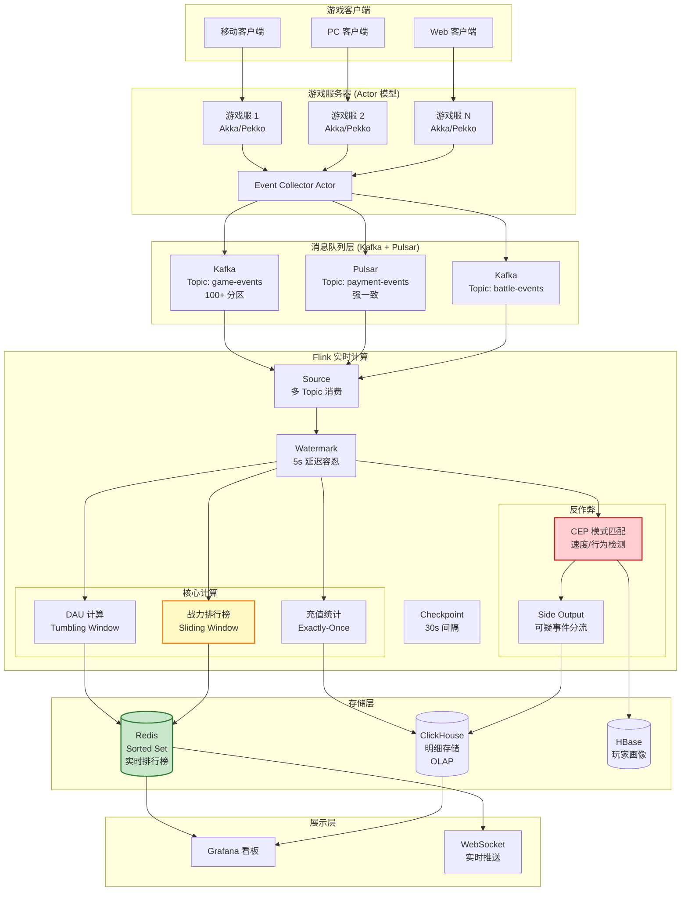
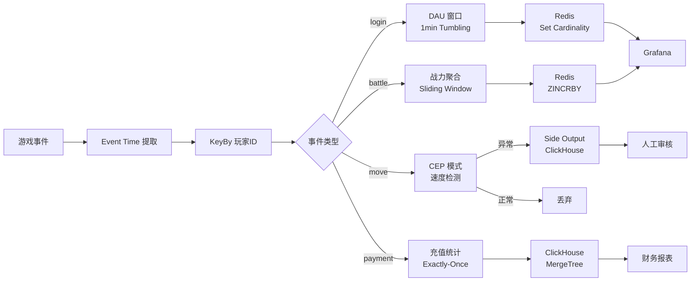
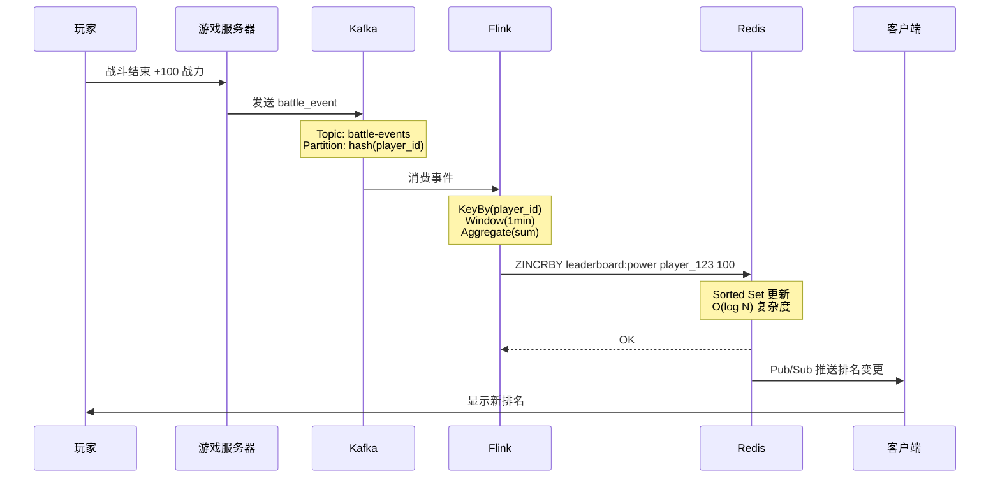

# 业务模式: 游戏实时分析 (Business Pattern: Gaming Analytics)

> **业务领域**: 游戏行业 (Gaming) | **复杂度等级**: ★★★★★ | **延迟要求**: < 500ms | **形式化等级**: L4-L5
>
> 本模式解决游戏行业中**高并发事件采集**、**实时排行榜**、**反作弊检测**与**玩家行为分析**等核心需求，提供基于 Flink + Actor 模型的低延迟、高吞吐实时分析解决方案。

---

## 目录

- [业务模式: 游戏实时分析 (Business Pattern: Gaming Analytics)](#业务模式-游戏实时分析-business-pattern-gaming-analytics)
  - [目录](#目录)
  - [1. 概念定义 (Definitions)](#1-概念定义-definitions)
    - [Def-K-03-03: 游戏事件 (Game Event)](#def-k-03-03-游戏事件-game-event)
    - [Def-K-03-04: 实时排行榜 (Real-time Leaderboard)](#def-k-03-04-实时排行榜-real-time-leaderboard)
    - [Def-K-03-05: 反作弊检测 (Anti-Cheat Detection)](#def-k-03-05-反作弊检测-anti-cheat-detection)
    - [Def-K-03-06: 玩家会话 (Player Session)](#def-k-03-06-玩家会话-player-session)
  - [2. 属性推导 (Properties)](#2-属性推导-properties)
    - [Lemma-K-03-03: 排行榜一致性边界](#lemma-k-03-03-排行榜一致性边界)
    - [Lemma-K-03-04: 作弊检测延迟下界](#lemma-k-03-04-作弊检测延迟下界)
    - [Prop-K-03-03: 事件乱序容忍度](#prop-k-03-03-事件乱序容忍度)
  - [3. 关系建立 (Relations)](#3-关系建立-relations)
    - [3.1 与设计模式的映射](#31-与设计模式的映射)
    - [3.2 并发范式组合](#32-并发范式组合)
    - [3.3 技术栈组件映射](#33-技术栈组件映射)
  - [4. 论证过程 (Argumentation)](#4-论证过程-argumentation)
    - [4.1 游戏分析场景特征分析](#41-游戏分析场景特征分析)
    - [4.2 实时排行榜设计挑战](#42-实时排行榜设计挑战)
    - [4.3 反作弊检测策略对比](#43-反作弊检测策略对比)
  - [5. 工程论证 (Engineering Argument)](#5-工程论证-engineering-argument)
    - [5.1 架构设计决策](#51-架构设计决策)
    - [5.2 性能基准与优化](#52-性能基准与优化)
  - [6. 实例验证 (Examples)](#6-实例验证-examples)
    - [6.1 实时排行榜计算](#61-实时排行榜计算)
    - [6.2 反作弊 CEP 检测](#62-反作弊-cep-检测)
    - [6.3 完整 Flink 作业](#63-完整-flink-作业)
  - [7. 可视化 (Visualizations)](#7-可视化-visualizations)
    - [7.1 整体架构图](#71-整体架构图)
    - [7.2 数据流处理管道](#72-数据流处理管道)
    - [7.3 排行榜更新流程](#73-排行榜更新流程)
  - [8. 引用参考 (References)](#8-引用参考-references)

---

## 1. 概念定义 (Definitions)

### Def-K-03-03: 游戏事件 (Game Event)

设玩家集合为 $\mathcal{P} = \{p_1, p_2, \ldots, p_n\}$，事件类型集合为 $\mathcal{E} = \{login, logout, battle, payment, levelup, chat, \ldots\}$，服务器集合为 $\mathcal{S}$。

**游戏事件**定义为七元组：

$$
g = (p, e, a, s, w, m, t) \in \mathcal{P} \times \mathcal{E} \times \mathcal{A} \times \mathcal{S} \times \mathcal{W} \times \mathcal{M} \times \mathbb{T}
$$

其中：

| 字段 | 类型 | 说明 |
|------|------|------|
| $p \in \mathcal{P}$ | String | 玩家唯一标识 (Player ID) |
| $e \in \mathcal{E}$ | Enum | 事件类型 |
| $a \in \mathcal{A}$ | JSON | 事件属性（战斗结果、充值金额等） |
| $s \in \mathcal{S}$ | String | 服务器/分区标识 |
| $w \in \mathcal{W}$ | Object | 游戏世界状态快照 |
| $m \in \mathcal{M}$ | Map | 元数据（版本、渠道、设备） |
| $t \in \mathbb{T}$ | Timestamp | 事件时间戳（毫秒级） |

**事件分类**：

```
游戏事件类型层次
├── 生命周期事件
│   ├── login / logout    # 登录/登出
│   ├── register          # 注册
│   └── heartbeat         # 在线心跳
├── 玩法事件
│   ├── battle_start/end  # 战斗开始/结束
│   ├── levelup           # 等级提升
│   ├── mission_complete  # 任务完成
│   └── achievement       # 成就达成
├── 经济事件
│   ├── payment           # 充值
│   ├── consume           # 消费
│   ├── reward            # 奖励
│   └── trade             # 交易
└── 社交事件
    ├── chat              # 聊天
    ├── friend            # 好友操作
    └── guild             # 公会操作
```

### Def-K-03-04: 实时排行榜 (Real-time Leaderboard)

**实时排行榜**是在时间窗口 $\Delta$ 内，对玩家集合按得分函数 $f: \mathcal{P} \rightarrow \mathbb{R}$ 进行排序的有序集合：

$$
\text{Leaderboard}(\Delta, f, k) = \{(p_i, f(p_i)) \mid p_i \in \mathcal{P}, i = 1, \ldots, k\}
$$

其中：

- $\Delta$ 为时间窗口（日榜/周榜/赛季榜）
- $f(p_i)$ 为玩家 $p_i$ 在窗口内的累计得分
- $k$ 为排行榜容量（如前 100 名）

**排行榜类型**：

| 类型 | 聚合函数 $f$ | 更新频率 | 一致性要求 |
|------|-------------|---------|-----------|
| **战力榜** | $f(p) = \sum_{e \in E_{battle}} score(e)$ | 实时 | 最终一致 |
| **等级榜** | $f(p) = \max level(p)$ | 实时 | 强一致 |
| **充值榜** | $f(p) = \sum_{e \in E_{payment}} amount(e)$ | 分钟级 | 强一致 |
| **活跃榜** | $f(p) = |E_p \cap \Delta|$ | 准实时 | 最终一致 |

### Def-K-03-05: 反作弊检测 (Anti-Cheat Detection)

**反作弊检测**是识别偏离正常玩家行为分布 $\mathcal{D}_{normal}$ 的异常玩家子集：

$$
\text{Cheaters} = \{ p \in \mathcal{P} \mid \exists f \in \mathcal{F}: \frac{f(p) - \mu_f}{\sigma_f} > \theta_{cheat} \}
$$

其中：

- $\mathcal{F}$ 为行为特征集合（移动速度、操作频率、资源获取率等）
- $\mu_f, \sigma_f$ 为特征 $f$ 的全局均值和标准差
- $\theta_{cheat}$ 为作弊判定阈值（通常取 3-5 个标准差）

**作弊类型分类**：

```
作弊行为分类
├── 客户端作弊
│   ├── 加速器 (Speed Hack)       # 修改游戏速度
│   ├── 透视 (Wall Hack)          # 修改渲染逻辑
│   ├── 自动瞄准 (Aim Bot)        # 自动化操作
│   └── 内存修改 (Memory Hack)    # 修改游戏内存
├── 行为异常
│   ├── 脚本挂机 (Botting)        # 自动化脚本
│   ├── 多开刷取 (Multi-boxing)   # 多账号协同
│   └── 工作室 (Gold Farming)     # 规模化刷资源
└── 网络层作弊
    ├── 延迟作弊 (Lag Switch)     # 利用网络延迟
    └── 包篡改 (Packet Hack)      # 修改网络包
```

### Def-K-03-06: 玩家会话 (Player Session)

**玩家会话**是玩家连续活动的时段，由会话开始事件 $e_{start}$ 和会话结束事件 $e_{end}$ 界定：

$$
\text{Session}(p) = \{ g \in G_p \mid t_{start} \leq t_g \leq t_{end} \}
$$

其中会话边界由**会话间隙** (Session Gap) $\delta_{gap}$ 决定：

$$
t_{end} = \min \{ t \mid t - t_{prev} > \delta_{gap} \}
$$

通常 $\delta_{gap} = 5$ 分钟，即 5 分钟无活动视为会话结束。

---

## 2. 属性推导 (Properties)

### Lemma-K-03-03: 排行榜一致性边界

**引理**: 在分布式环境下，实时排行榜的最终一致性与 Watermark 延迟 $\delta_w$ 和聚合窗口大小 $\Delta_w$ 相关。

**证明**:

设事件 $e$ 在时刻 $t_e$ 产生，到达 Flink 时间为 $t_{arrive}$，Watermark 推进到 $t_w$ 时触发窗口计算。

排行榜更新延迟为：

$$
\Delta_{update} = t_w - t_e = (t_{arrive} - t_e) + (t_w - t_{arrive}) \leq \delta_{network} + \delta_w
$$

对于使用 Redis Sorted Set 的排行榜，最终一致性保证为：

$$
\forall p \in \mathcal{P}: \quad |f_{redis}(p) - f_{actual}(p)| \leq \Delta_{score}(\delta_w)
$$

其中 $\Delta_{score}(\delta_w)$ 为 $\delta_w$ 时间窗口内的最大可能得分差。

### Lemma-K-03-04: 作弊检测延迟下界

**引理**: 基于 CEP 的实时作弊检测存在理论延迟下界，由模式复杂度决定。

**证明**:

设 CEP 模式需要匹配 $n$ 个连续事件，事件到达间隔服从指数分布 $\sim Exp(\lambda)$。

模式匹配完成时间的期望为：

$$
E[T_{match}] = \frac{n}{\lambda}
$$

考虑 Watermark 延迟 $\delta_w$，总检测延迟下界为：

$$
T_{detect} \geq \frac{n}{\lambda} + \delta_w
$$

对于需要 3 个连续异常事件、平均每秒 10 个事件的模式：

$$
T_{detect} \geq \frac{3}{10} + 0.5 = 0.8\text{s}
$$

### Prop-K-03-03: 事件乱序容忍度

**命题**: 游戏事件流的乱序程度与网络延迟方差成正比。

**论证**:

设游戏服务器 $s_i$ 到 Flink 的网络延迟为 $L_i \sim \mathcal{N}(\mu_i, \sigma_i^2)$。

全局乱序程度可用最大延迟差衡量：

$$
\Delta_{disorder} = \max_{i,j} |L_i - L_j| \approx 3 \cdot \max_i \sigma_i
$$

因此 Watermark 延迟应设置为：

$$
\delta_w \geq 3 \cdot \max_i \sigma_i
$$

---

## 3. 关系建立 (Relations)

### 3.1 与设计模式的映射

| 设计模式 | 应用场景 | 关键配置 |
|---------|---------|---------|
| **P01: Event Time Processing** | 游戏事件时序正确性保证 | Watermark 延迟 2-5s，容忍网络抖动 [^1] |
| **P02: Windowed Aggregation** | DAU/收入/战力统计 | 滑动窗口 1min/1h，增量聚合 [^2] |
| **P06: Side Output** | 作弊事件分流、延迟数据处理 | 侧输出到专门 Topic [^3] |
| **P05: State Management** | 玩家会话状态、排行榜缓存 | Keyed State + TTL 24h |
| **P03: CEP** | 复杂作弊模式识别 | 模式窗口 10s-5min |

### 3.2 并发范式组合

游戏实时分析采用 **Actor + Dataflow** 混合并发范式：

```
┌─────────────────────────────────────────────────────────────────┐
│                    Actor + Dataflow 混合架构                     │
├─────────────────────────────────────────────────────────────────┤
│                                                                 │
│   Actor 层 (游戏服务器)                                          │
│   ├── 每个玩家 → 一个 PlayerActor                                │
│   ├── 每个房间 → 一个 RoomActor                                  │
│   └── 每个会话 → 一个 SessionActor (事件收集器)                   │
│       └── 批量发送: 10s/1000 事件                                │
│                                                                 │
│   消息队列层 (Kafka/Pulsar)                                      │
│   ├── Topic: game-events (按 player-id 分区)                     │
│   ├── Topic: payment-events (强一致，独立分区)                    │
│   └── Topic: battle-events (高吞吐，多分区)                       │
│                                                                 │
│   Dataflow 层 (Flink)                                            │
│   ├── KeyBy(player-id) → 保证玩家事件顺序处理                     │
│   ├── Window → 时间窗口聚合                                       │
│   ├── Async I/O → 查询玩家画像/设备指纹                            │
│   └── CEP → 复杂模式匹配                                          │
│                                                                 │
└─────────────────────────────────────────────────────────────────┘
```

**范式分工**：

| 层级 | 范式 | 职责 | 优势 |
|------|------|------|------|
| 游戏逻辑 | Actor | 并发会话管理、状态隔离 | 容错、弹性伸缩 |
| 事件传输 | 消息队列 | 可靠传输、流量削峰 | 持久化、高吞吐 |
| 实时分析 | Dataflow | 聚合计算、模式匹配 | 低延迟、一致性 |

### 3.3 技术栈组件映射

```
┌─────────────────────────────────────────────────────────────────┐
│                    游戏实时分析技术栈                             │
├─────────────────────────────────────────────────────────────────┤
│                                                                 │
│   数据采集层                                                    │
│   ├── 游戏客户端 → SDK 埋点                                     │
│   └── 游戏服务器 → Actor Event Collector                        │
│                                                                 │
│   消息队列层 (Kafka / Pulsar)                                   │
│   ├── game-events: 高吞吐，100+ 分区                            │
│   ├── payment-events: 强一致，10 分区                           │
│   └── cheat-alerts: 低吞吐，3 分区                              │
│                                                                 │
│   流计算层 (Flink)                                              │
│   ├── Source: Kafka Consumer                                    │
│   ├── Process: KeyBy → Window → Aggregate                     │
│   ├── CEP: 作弊模式匹配                                         │
│   └── Sink: Redis / ClickHouse                                  │
│                                                                 │
│   存储层                                                        │
│   ├── Redis: 实时排行榜 (Sorted Set)                            │
│   ├── ClickHouse: 明细事件存储 + OLAP                          │
│   └── HBase: 玩家画像长期存储                                   │
│                                                                 │
│   展示层                                                        │
│   ├── Grafana: 实时监控看板                                     │
│   └── WebSocket: 排行榜实时推送                                 │
│                                                                 │
└─────────────────────────────────────────────────────────────────┘
```

---

## 4. 论证过程 (Argumentation)

### 4.1 游戏分析场景特征分析

**特征 1: 超高并发事件**

| 指标 | 规模 | 技术挑战 |
|------|------|---------|
| 峰值事件率 | 1M+ 事件/秒 | 需要水平扩展的流处理能力 |
| 事件大小 | 0.5-2 KB | 网络带宽和存储成本 |
| 事件类型 | 50+ 种 | 需要灵活的模式演化支持 |
| 峰值时段 | 晚间 8-10 点 | 需要弹性伸缩能力 |

**特征 2: 乱序事件**

```
时间线:
═══════════════════════════════════════════════════════════════►

服务端产生:  T1    T2    T3    T4    T5    T6    T7
             │     │     │     │     │     │     │
             ▼     ▼     ▼     ▼     ▼     ▼     ▼
Flink接收:   T1         T3 T2       T5 T4       T6 T7
                          ↑─ 乱序    ↑─ 乱序

Watermark:   ─────────────────────────────────────────►
                    2s 延迟容忍
```

**特征 3: 实时排行榜一致性**

排行榜更新面临的一致性问题：

| 场景 | 问题 | 解决方案 |
|------|------|---------|
| 并发更新 | 多个分区同时更新同一排行榜 | Redis 单线程 + Flink KeyBy |
| 网络分区 | 部分事件延迟到达 | Watermark 延迟触发 |
| 状态丢失 | Flink 重启导致排行榜中断 | Checkpoint 恢复 + 最终一致 |

### 4.2 实时排行榜设计挑战

**挑战 1: 全局排序 vs 分区聚合**

```
方案对比:

全局排序 (Global Leaderboard)
├── 优点: 精确排名，无误差
├── 缺点: 单点瓶颈，扩展性差
└── 适用: 小型游戏，<10万玩家

分区聚合 (Partitioned Leaderboard)
├── 优点: 水平扩展，高吞吐
├── 缺点: 需要合并阶段，略有延迟
└── 适用: 大型游戏，>100万玩家

推荐方案: 分层聚合
├── Level 1: 服务器内排名 (Flink KeyBy server)
├── Level 2: 全服排名 (Redis Sorted Set)
└── 延迟: < 5s
```

**挑战 2: 多种排行榜类型**

| 排行榜 | 排序键 | 更新策略 | 存储方案 |
|--------|--------|---------|---------|
| 战力榜 | 总战力 | 增量更新 | Redis ZINCRBY |
| 等级榜 | 等级/经验 | 实时替换 | Redis ZADD |
| 充值榜 | 累计金额 | 分钟聚合 | Flink Window + Redis |
| 公会榜 | 公会总战力 | 定时刷新 | 每小时批处理 |

### 4.3 反作弊检测策略对比

| 策略 | 延迟 | 准确率 | 复杂度 | 适用场景 |
|------|------|--------|--------|---------|
| **规则引擎** | < 10ms | 70-80% | 低 | 已知作弊模式 |
| **统计阈值** | < 1s | 75-85% | 中 | 行为异常检测 |
| **CEP 模式** | < 5s | 80-90% | 中 | 复杂时序模式 |
| **机器学习** | > 1s | 85-95% | 高 | 未知作弊类型 |

**混合策略架构**：

```
作弊检测流水线:

游戏事件
    │
    ▼
┌─────────────────┐
│ Level 1: 规则引擎 │ ◄── 黑名单/白名单，< 10ms
│   - 设备指纹    │
│   - IP 封禁     │
└─────────────────┘
    │ (通过)
    ▼
┌─────────────────┐
│ Level 2: 统计阈值 │ ◄── 实时计算，< 100ms
│   - 速度检测    │
│   - 频率检测    │
└─────────────────┘
    │ (可疑)
    ▼
┌─────────────────┐
│ Level 3: CEP    │ ◄── 复杂模式，< 5s
│   - 行为序列    │
│   - 群体检测    │
└─────────────────┘
    │ (确认作弊)
    ▼
┌─────────────────┐
│ Level 4: 人工审核 │ ◄── 离线 ML 辅助
└─────────────────┘
```

---

## 5. 工程论证 (Engineering Argument)

### 5.1 架构设计决策

**决策 1: Kafka vs Pulsar 选择**

| 维度 | Kafka | Pulsar | 建议 |
|------|-------|--------|------|
| 单集群吞吐 | 极高 | 高 | Kafka 胜出 |
| 多租户 | 需额外配置 | 原生支持 | Pulsar 胜出 |
| 异地复制 | MirrorMaker | 内置 Geo-Replication | Pulsar 胜出 |
| 存储分离 | 紧耦合 | 计算存储分离 | Pulsar 胜出 |
| 生态成熟度 | 极成熟 | 成熟 | Kafka 胜出 |

**建议**: 单数据中心大型游戏用 Kafka；多区域部署用 Pulsar。

**决策 2: Flink 状态后端选择**

| 场景 | 推荐后端 | 原因 |
|------|---------|------|
| 实时排行榜 | HashMap | 状态小，查询快 |
| 作弊检测 | RocksDB | 大状态，需持久化 |
| 玩家会话 | RocksDB | TTL 管理，大键空间 |
| DAU 计算 | HashMap | 去重集合，内存效率高 |

**决策 3: 排行榜存储方案**

```
Redis Sorted Set 结构:

战力排行榜 (daily:power:2026-04-02)
┌─────────────────────────────────────┐
│  ZSET                               │
│  player_1001 → 150000              │
│  player_2048 → 148000              │
│  player_0555 → 145000              │
│  ...                                │
└─────────────────────────────────────┘

操作复杂度:
├── ZINCRBY: O(log N)  增量更新分数
├── ZRANK: O(log N)    查询排名
├── ZRANGE: O(log N + M) 查询前 M 名
└── ZREMRANGEBYRANK: O(log N) 裁剪
```

### 5.2 性能基准与优化

**关键性能指标 (SLA)**:

| 指标 | P50 | P99 | 目标值 | 说明 |
|------|-----|-----|--------|------|
| 事件处理延迟 | 20ms | 200ms | < 500ms | 端到端延迟 |
| 排行榜更新 | 1s | 5s | < 10s | 分数变更到可见 |
| 作弊检测 | 2s | 10s | < 30s | 异常行为到告警 |
| 系统吞吐 | - | - | 100万 TPS | 峰值处理能力 |
| 反作弊准确率 | - | - | > 90% | 正确识别率 |
| 误报率 | - | - | < 5% | 正常玩家误判率 |

**优化策略**：

```
性能优化策略矩阵:

延迟优化                    吞吐优化
├── 异步 I/O (Async I/O)    ├── 批量处理 (Mini-batch)
├── 本地状态访问             ├── 分区并行 (Partition Scaling)
├── Mini-batch 处理          ├── 序列化优化 (Protobuf)
└── 预聚合 (Pre-aggregation) └── 压缩传输 (Snappy/LZ4)

资源优化                    一致性优化
├── 状态 TTL 管理            ├── Checkpoint 增量模式
├── 内存池复用               ├── 两阶段提交 Sink
├── 对象池化                 └── 幂等性设计
└── 垃圾回收调优
```

---

## 6. 实例验证 (Examples)

### 6.1 实时排行榜计算

**场景**: 计算游戏实时战力排行榜，支持全服和分区排名。

```scala
import org.apache.flink.streaming.api.scala._
import org.apache.flink.streaming.api.windowing.assigners.TumblingEventTimeWindows
import org.apache.flink.streaming.api.windowing.time.Time
import org.apache.flink.connector.redis.sink.RedisSink

// 定义战力变更事件
case class PowerEvent(
  playerId: String,
  serverId: String,
  powerDelta: Long,
  timestamp: Long
)

// 排行榜结果
case class LeaderboardEntry(
  windowTime: Long,
  playerId: String,
  totalPower: Long,
  serverId: String,
  rank: Int
)

// 战力排行榜计算 Job
object PowerLeaderboardJob {
  def main(args: Array[String]): Unit = {
    val env = StreamExecutionEnvironment.getExecutionEnvironment
    env.setParallelism(12)

    // Checkpoint 配置
    env.enableCheckpointing(30000)
    env.getCheckpointConfig.setCheckpointingMode(CheckpointingMode.EXACTLY_ONCE)
    env.setStateBackend(new EmbeddedRocksDBStateBackend(true))

    // Kafka Source
    val kafkaSource = KafkaSource.builder[PowerEvent]()
      .setBootstrapServers("kafka:9092")
      .setTopics("power-events")
      .setGroupId("power-leaderboard")
      .setStartingOffsets(OffsetsInitializer.latest())
      .setValueDeserializer(new PowerEventDeserializer())
      .build()

    val watermarkStrategy = WatermarkStrategy
      .forBoundedOutOfOrderness[PowerEvent](Duration.ofSeconds(5))
      .withTimestampAssigner((event, _) => event.timestamp)

    val powerStream = env
      .fromSource(kafkaSource, watermarkStrategy, "Power Events")
      .uid("power-source")

    // 全服排行榜: 按 playerId 聚合战力
    val globalLeaderboard = powerStream
      .keyBy(_.playerId)
      .window(TumblingEventTimeWindows.of(Time.minutes(1)))
      .aggregate(
        new AggregateFunction[PowerEvent, Long, Long] {
          override def createAccumulator(): Long = 0L
          override def add(value: PowerEvent, accumulator: Long): Long = accumulator + value.powerDelta
          override def getResult(accumulator: Long): Long = accumulator
          override def merge(a: Long, b: Long): Long = a + b
        },
        new ProcessWindowFunction[Long, LeaderboardEntry, String, TimeWindow] {
          override def process(
            playerId: String,
            context: Context,
            elements: Iterable[Long],
            out: Collector[LeaderboardEntry]
          ): Unit = {
            val totalPower = elements.head
            out.collect(LeaderboardEntry(
              windowTime = context.window.getEnd,
              playerId = playerId,
              totalPower = totalPower,
              serverId = "global",
              rank = 0  // 排名在 Redis 中计算
            ))
          }
        }
      )
      .name("Global Power Aggregation")
      .uid("global-agg")

    // 写入 Redis Sorted Set
    globalLeaderboard.addSink(new RedisLeaderboardSink(
      keyPrefix = "leaderboard:power:global",
      expireSeconds = 86400 * 2  // 2 天过期
    ))
    .name("Redis Global Leaderboard Sink")
    .uid("redis-global-sink")

    // 分区排行榜
    val serverLeaderboard = powerStream
      .keyBy(_.serverId)
      .window(TumblingEventTimeWindows.of(Time.minutes(1)))
      .process(new ServerLeaderboardFunction(topN = 100))
      .name("Server Leaderboard")
      .uid("server-leaderboard")

    serverLeaderboard.addSink(new RedisLeaderboardSink(
      keyPrefix = "leaderboard:power:server",
      expireSeconds = 86400
    ))

    env.execute("Power Leaderboard Job")
  }
}

// Redis Sink 实现
class RedisLeaderboardSink(keyPrefix: String, expireSeconds: Int)
  extends RichSinkFunction[LeaderboardEntry] {

  @transient private var jedis: Jedis = _

  override def open(parameters: Configuration): Unit = {
    jedis = new Jedis("redis", 6379)
  }

  override def invoke(entry: LeaderboardEntry, context: SinkFunction.Context): Unit = {
    val key = s"$keyPrefix:${formatDate(entry.windowTime)}"
    // 使用 ZINCRBY 增量更新分数
    jedis.zincrby(key, entry.totalPower, entry.playerId)
    // 设置过期时间
    jedis.expire(key, expireSeconds)
  }

  override def close(): Unit = {
    if (jedis != null) jedis.close()
  }
}
```

### 6.2 反作弊 CEP 检测

**场景**: 检测加速外挂行为（速度异常）。

```scala
import org.apache.flink.cep.scala.CEP
import org.apache.flink.cep.scala.pattern.Pattern
import org.apache.flink.cep.PatternSelectFunction

// 移动事件
case class MoveEvent(
  playerId: String,
  position: (Double, Double),  // (x, y)
  timestamp: Long
)

// 作弊告警
case class CheatAlert(
  playerId: String,
  alertType: String,
  description: String,
  confidence: Double,
  timestamp: Long
)

// 速度异常检测
object SpeedCheatDetectionJob {
  def main(args: Array[String]): Unit = {
    val env = StreamExecutionEnvironment.getExecutionEnvironment

    val moveStream = env
      .fromSource(kafkaSource, watermarkStrategy, "Move Events")
      .keyBy(_.playerId)

    // 定义速度异常模式: 连续 3 次移动速度超过阈值
    val speedCheatPattern = Pattern
      .begin[MoveEvent]("first")
      .where(_.position != null)

      .next("second")
      .where { (event, ctx) =>
        val firstEvent = ctx.getEventsForPattern("first").head
        val distance = calculateDistance(firstEvent.position, event.position)
        val timeDiff = (event.timestamp - firstEvent.timestamp) / 1000.0
        val speed = distance / timeDiff  // m/s

        speed > MAX_SPEED_LIMIT && timeDiff < 5  // 5 秒内移动过远
      }

      .next("third")
      .where { (event, ctx) =>
        val secondEvent = ctx.getEventsForPattern("second").head
        val distance = calculateDistance(secondEvent.position, event.position)
        val timeDiff = (event.timestamp - secondEvent.timestamp) / 1000.0
        val speed = distance / timeDiff

        speed > MAX_SPEED_LIMIT && timeDiff < 5
      }
      .within(Time.seconds(15))

    // 应用模式匹配
    val patternStream = CEP.pattern(moveStream, speedCheatPattern)

    // 处理匹配结果
    val alertStream = patternStream
      .process(new PatternHandler[MoveEvent, CheatAlert] {
        override def processMatch(
          matchMap: Map[String, List[MoveEvent]],
          ctx: PatternHandler.Context,
          out: Collector[CheatAlert]
        ): Unit = {
          val events = matchMap.values.flatten.toList
          val playerId = events.head.playerId

          val speeds = events.sliding(2).map {
            case List(e1, e2) =>
              val dist = calculateDistance(e1.position, e2.position)
              val time = (e2.timestamp - e1.timestamp) / 1000.0
              dist / time
          }.toList

          val avgSpeed = speeds.sum / speeds.size
          val confidence = math.min(avgSpeed / MAX_SPEED_LIMIT * 0.5, 0.99)

          out.collect(CheatAlert(
            playerId = playerId,
            alertType = "SPEED_HACK",
            description = s"异常移动速度: ${avgSpeed.formatted("%.2f")} m/s",
            confidence = confidence,
            timestamp = ctx.timestamp()
          ))
        }
      })

    // 分流处理: 高置信度直接封号，低置信度人工审核
    val highConfidenceTag = OutputTag[CheatAlert]("high-confidence")
    val lowConfidenceTag = OutputTag[CheatAlert]("low-confidence")

    val processedAlerts = alertStream
      .process(new ProcessFunction[CheatAlert, CheatAlert] {
        override def processElement(
          alert: CheatAlert,
          ctx: ProcessFunction[CheatAlert, CheatAlert]#Context,
          out: Collector[CheatAlert]
        ): Unit = {
          if (alert.confidence > 0.9) {
            ctx.output(highConfidenceTag, alert)
          } else {
            ctx.output(lowConfidenceTag, alert)
          }
        }
      })

    // 高置信度告警 → 自动封号系统
    processedAlerts
      .getSideOutput(highConfidenceTag)
      .addSink(new BanSink())

    // 低置信度告警 → 人工审核队列
    processedAlerts
      .getSideOutput(lowConfidenceTag)
      .addSink(new AuditQueueSink())

    env.execute("Speed Cheat Detection")
  }

  val MAX_SPEED_LIMIT = 15.0  // m/s, 游戏设定的最大移动速度

  def calculateDistance(p1: (Double, Double), p2: (Double, Double)): Double = {
    math.sqrt(math.pow(p2._1 - p1._1, 2) + math.pow(p2._2 - p1._2, 2))
  }
}
```

### 6.3 完整 Flink 作业

```scala
import org.apache.flink.streaming.api.scala._
import org.apache.flink.streaming.api.environment.StreamExecutionEnvironment
import org.apache.flink.connector.kafka.source.KafkaSource
import org.apache.flink.connector.kafka.sink.KafkaSink
import org.apache.flink.api.common.eventtime.WatermarkStrategy
import org.apache.flink.contrib.streaming.state.EmbeddedRocksDBStateBackend
import org.apache.flink.streaming.api.checkpointing.CheckpointingMode
import org.apache.flink.api.common.restartstrategy.RestartStrategies
import java.util.concurrent.TimeUnit

/**
 * 游戏实时分析完整作业
 * - 实时 DAU 计算
 * - 战力排行榜
 * - 反作弊检测
 * - 充值分析
 */
object GamingAnalyticsJob {

  def main(args: Array[String]): Unit = {
    val env = StreamExecutionEnvironment.getExecutionEnvironment

    // ========================================
    // Checkpoint & 状态配置
    // ========================================
    env.enableCheckpointing(30000) // 30s 间隔
    env.getCheckpointConfig.setCheckpointingMode(CheckpointingMode.EXACTLY_ONCE)
    env.getCheckpointConfig.setCheckpointTimeout(120000)
    env.getCheckpointConfig.setMinPauseBetweenCheckpoints(1000)
    env.getCheckpointConfig.enableUnalignedCheckpoints()

    val rocksDbBackend = new EmbeddedRocksDBStateBackend(true)
    env.setStateBackend(rocksDbBackend)
    env.getCheckpointConfig.setCheckpointStorage("hdfs:///flink/gaming-checkpoints")

    env.setRestartStrategy(RestartStrategies.fixedDelayRestart(
      10, Time.of(10, TimeUnit.SECONDS)
    ))

    // ========================================
    // Source 配置
    // ========================================
    val watermarkStrategy = WatermarkStrategy
      .forBoundedOutOfOrderness[GameEvent](Duration.ofSeconds(5))
      .withTimestampAssigner((event, _) => event.timestamp)
      .withIdleness(Duration.ofSeconds(60))

    val kafkaSource = KafkaSource.builder[GameEvent]()
      .setBootstrapServers("kafka:9092")
      .setTopics("game-events", "payment-events", "battle-events")
      .setGroupId("gaming-analytics-flink")
      .setStartingOffsets(OffsetsInitializer.latest())
      .setValueDeserializer(new GameEventDeserializer())
      .build()

    val gameEventStream = env
      .fromSource(kafkaSource, watermarkStrategy, "Game Events")
      .uid("game-source")
      .setParallelism(12)

    // ========================================
    // 分流处理
    // ========================================
    val loginEvents = gameEventStream.filter(_.eventType == "login")
    val paymentEvents = gameEventStream.filter(_.eventType == "payment")
    val battleEvents = gameEventStream.filter(_.eventType == "battle_end")
    val moveEvents = gameEventStream.filter(_.eventType == "move")

    // ========================================
    // 1. 实时 DAU 计算
    // ========================================
    val dauStream = loginEvents
      .keyBy(_.serverId)
      .window(TumblingEventTimeWindows.of(Time.minutes(1)))
      .aggregate(new DauAggregateFunction())
      .name("DAU Calculation")
      .uid("dau-calc")
      .setParallelism(8)

    dauStream.addSink(new RedisMetricSink("metrics:dau"))
      .name("DAU Sink")
      .uid("dau-sink")

    // ========================================
    // 2. 战力排行榜
    // ========================================
    val powerStream = battleEvents
      .map(e => PowerEvent(e.playerId, e.serverId, e.getPowerGain, e.timestamp))
      .keyBy(_.playerId)
      .window(TumblingEventTimeWindows.of(Time.minutes(1)))
      .aggregate(new PowerAggregateFunction())
      .name("Power Aggregation")
      .uid("power-agg")

    powerStream.addSink(new RedisLeaderboardSink(
      keyPrefix = "leaderboard:power",
      expireSeconds = 172800 // 2 days
    ))
    .name("Power Leaderboard Sink")
    .uid("power-sink")

    // ========================================
    // 3. 反作弊检测 (CEP)
    // ========================================
    val cheatPattern = Pattern.begin[MoveEvent]("move1")
      .next("move2").where(speedCheck(_, _, MAX_SPEED))
      .next("move3").where(speedCheck(_, _, MAX_SPEED))
      .within(Time.seconds(10))

    val cheatAlerts = CEP.pattern(
      moveEvents.keyBy(_.playerId),
      cheatPattern
    )
    .process(new CheatPatternHandler())
    .name("Cheat Detection")
    .uid("cheat-detection")
    .setParallelism(6)

    // 作弊告警分流
    val highConfTag = OutputTag[CheatAlert]("high-confidence")
    val lowConfTag = OutputTag[CheatAlert]("low-confidence")

    val splitAlerts = cheatAlerts
      .process(new AlertSplitFunction(highConfTag, lowConfTag))

    splitAlerts.getSideOutput(highConfTag)
      .addSink(new KafkaSink("cheat-ban"))
      .name("Auto Ban Sink")
      .uid("ban-sink")

    splitAlerts.getSideOutput(lowConfTag)
      .addSink(new ClickHouseAuditSink("cheat_audit"))
      .name("Audit Sink")
      .uid("audit-sink")

    // ========================================
    // 4. 充值分析
    // ========================================
    val paymentStats = paymentEvents
      .keyBy(_.getChannel)
      .window(TumblingEventTimeWindows.of(Time.minutes(5)))
      .aggregate(new PaymentAggregateFunction())
      .name("Payment Stats")
      .uid("payment-stats")

    paymentStats.addSink(new ClickHouseSink("payment_stats"))
      .name("Payment Stats Sink")
      .uid("payment-stats-sink")

    // ========================================
    // 执行
    // ========================================
    env.execute("Gaming Analytics - Complete Pipeline")
  }

  // 辅助函数
  def speedCheck(current: MoveEvent, ctx: PatternContext, maxSpeed: Double): Boolean = {
    val prev = ctx.getEventsForPattern("move1").head
    val distance = calculateDistance(prev.position, current.position)
    val timeSec = (current.timestamp - prev.timestamp) / 1000.0
    (distance / timeSec) > maxSpeed
  }

  def calculateDistance(p1: (Double, Double), p2: (Double, Double)): Double = {
    math.sqrt(math.pow(p2._1 - p1._1, 2) + math.pow(p2._2 - p1._2, 2))
  }

  val MAX_SPEED = 15.0  // m/s
}

// ==================== 聚合函数实现 ====================

class DauAggregateFunction extends AggregateFunction[GameEvent, mutable.Set[String], DauResult] {
  override def createAccumulator(): mutable.Set[String] = mutable.Set.empty
  override def add(value: GameEvent, accumulator: mutable.Set[String]): mutable.Set[String] = {
    accumulator += value.playerId
    accumulator
  }
  override def getResult(accumulator: mutable.Set[String]): DauResult =
    DauResult(accumulator.size, accumulator.toSet)
  override def merge(a: mutable.Set[String], b: mutable.Set[String]): mutable.Set[String] = {
    a ++= b
    a
  }
}

case class DauResult(uniqueCount: Int, playerIds: Set[String])

class PowerAggregateFunction extends AggregateFunction[PowerEvent, Long, LeaderboardEntry] {
  override def createAccumulator(): Long = 0L
  override def add(value: PowerEvent, accumulator: Long): Long = accumulator + value.powerDelta
  override def getResult(accumulator: Long): LeaderboardEntry =
    LeaderboardEntry(0, "", accumulator, "", 0)
  override def merge(a: Long, b: Long): Long = a + b
}
```

---

## 7. 可视化 (Visualizations)

### 7.1 整体架构图



### 7.2 数据流处理管道



### 7.3 排行榜更新流程



---

## 8. 引用参考 (References)

[^1]: Apache Flink Documentation, "Event Time and Watermarks," 2025. <https://nightlies.apache.org/flink/flink-docs-stable/docs/concepts/time/>

[^2]: Apache Flink Documentation, "Windowing," 2025. <https://nightlies.apache.org/flink/flink-docs-stable/docs/dev/datastream/operators/windows/>

[^3]: Apache Flink Documentation, "Side Outputs," 2025. <https://nightlies.apache.org/flink/flink-docs-stable/docs/dev/datastream/operators/side_output/>


---

*文档版本: v1.0 | 更新日期: 2026-04-02 | 状态: 已完成*
*关联文档: [Pattern 01: Event Time Processing](../02-design-patterns/pattern-event-time-processing.md) | [Pattern 02: Windowed Aggregation](../02-design-patterns/pattern-windowed-aggregation.md) | [Pattern 06: Side Output](../02-design-patterns/pattern-side-output.md)*
