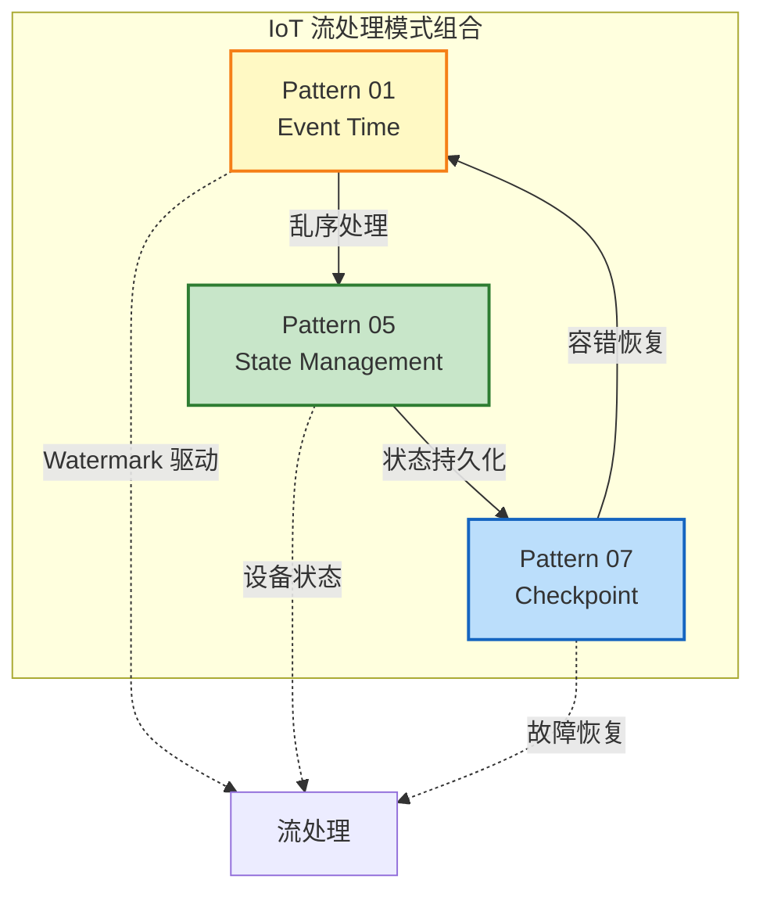
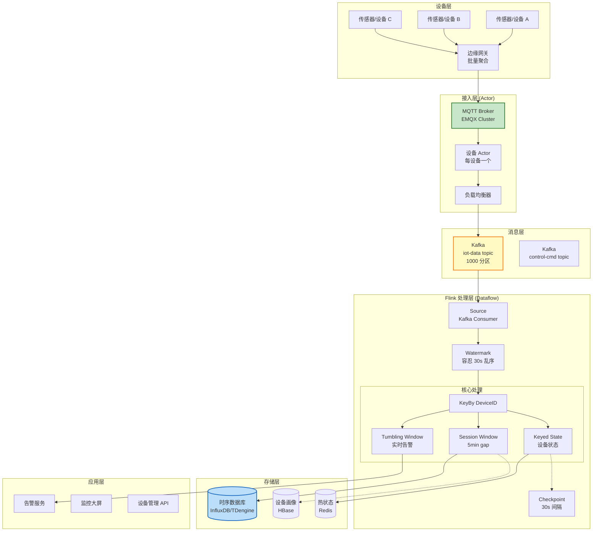
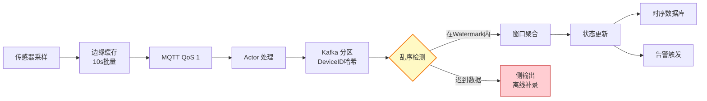
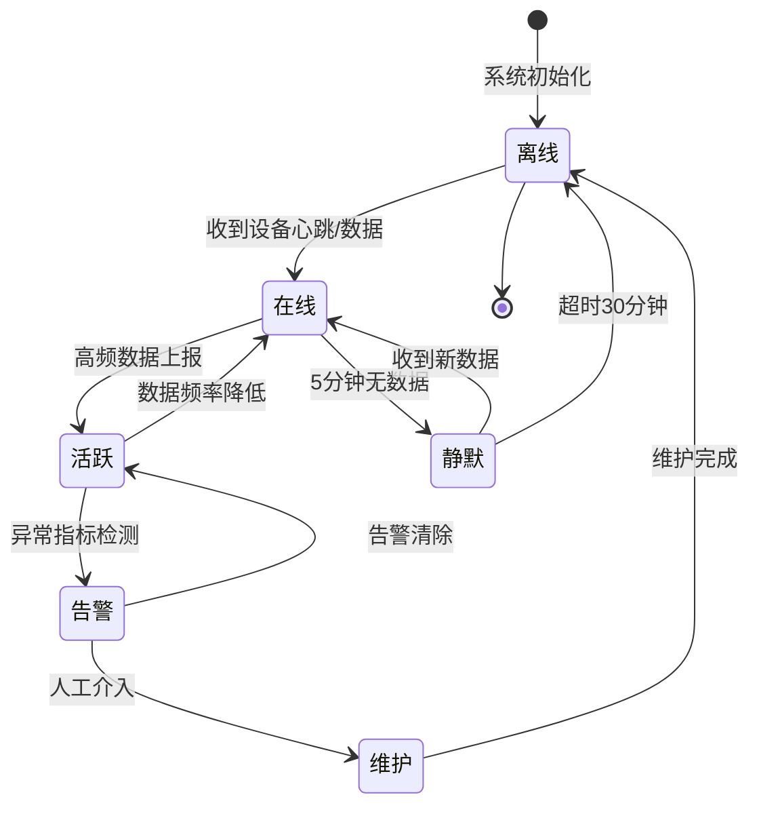

# 业务模式: IoT 物联网流处理 (Business Pattern: IoT Stream Processing)

> **业务领域**: 物联网 (IoT) | **复杂度等级**: ★★★★☆ | **延迟要求**: < 2s | **形式化等级**: L4-L5
>
> **所属阶段**: Knowledge/03-business-patterns | **前置依赖**: [Pattern 01: Event Time Processing](../02-design-patterns/pattern-event-time-processing.md), [Pattern 05: State Management](../02-design-patterns/pattern-stateful-computation.md), [Pattern 07: Checkpoint](../02-design-patterns/pattern-checkpoint-recovery.md)
>
> 本模式解决物联网场景下**百万级设备接入**、**乱序数据处理**、**设备状态维护**与**会话窗口管理**的核心需求，提供基于 Actor + Dataflow 双层架构的完整解决方案。

---

## 目录

- [业务模式: IoT 物联网流处理 (Business Pattern: IoT Stream Processing)](#业务模式-iot-物联网流处理-business-pattern-iot-stream-processing)
  - [目录](#目录)
  - [1. 概念定义 (Definitions)](#1-概念定义-definitions)
    - [Def-K-03-01: IoT 数据流 (IoT Data Stream)](#def-k-03-01-iot-数据流-iot-data-stream)
    - [Def-K-03-02: 设备会话 (Device Session)](#def-k-03-02-设备会话-device-session)
    - [Def-K-03-03: 乱序容忍度 (Out-of-Order Tolerance)](#def-k-03-03-乱序容忍度-out-of-order-tolerance)
    - [Def-K-03-04: 设备 Actor (Device Actor)](#def-k-03-04-设备-actor-device-actor)
  - [2. 属性推导 (Properties)](#2-属性推导-properties)
    - [Prop-K-03-01: 设备状态一致性](#prop-k-03-01-设备状态一致性)
    - [Prop-K-03-02: 会话窗口完整性](#prop-k-03-02-会话窗口完整性)
    - [Prop-K-03-03: 状态空间上界](#prop-k-03-03-状态空间上界)
    - [Prop-K-03-04: 乱序数据收敛性](#prop-k-03-04-乱序数据收敛性)
  - [3. 关系建立 (Relations)](#3-关系建立-relations)
    - [3.1 与核心设计模式的关系](#31-与核心设计模式的关系)
    - [3.2 技术栈组件映射](#32-技术栈组件映射)
    - [3.3 Actor + Dataflow 双层架构关系](#33-actor-dataflow-双层架构关系)
    - [3.4 数据流时序关系](#34-数据流时序关系)
  - [4. 论证过程 (Argumentation)](#4-论证过程-argumentation)
    - [4.1 IoT 场景核心挑战分析](#41-iot-场景核心挑战分析)
    - [4.2 MQTT 消息可靠性级别选择](#42-mqtt-消息可靠性级别选择)
    - [4.3 边缘计算与中心计算的分界](#43-边缘计算与中心计算的分界)
    - [4.4 百万级设备的分区策略](#44-百万级设备的分区策略)
  - [5. 工程论证 (Engineering Argument)](#5-工程论证-engineering-argument)
    - [5.1 架构设计决策](#51-架构设计决策)
    - [5.2 关键挑战解决方案](#52-关键挑战解决方案)
    - [5.3 性能基准](#53-性能基准)
  - [6. 实例验证 (Examples)](#6-实例验证-examples)
    - [6.1 完整 Flink 作业代码](#61-完整-flink-作业代码)
    - [6.2 设备温度监控告警](#62-设备温度监控告警)
    - [6.3 设备会话分析](#63-设备会话分析)
    - [6.4 乱序数据处理](#64-乱序数据处理)
    - [6.5 设备状态机管理](#65-设备状态机管理)
  - [7. 可视化 (Visualizations)](#7-可视化-visualizations)
    - [7.1 IoT 整体架构图](#71-iot-整体架构图)
    - [7.2 Actor + Dataflow 双层架构](#72-actor--dataflow-双层架构)
    - [7.3 数据流处理流程](#73-数据流处理流程)
    - [7.4 设备状态机](#74-设备状态机)
  - [8. 引用参考 (References)](#8-引用参考-references)

---

## 1. 概念定义 (Definitions)

### Def-K-03-01: IoT 数据流 (IoT Data Stream)

设设备集合为 $D = \{d_1, d_2, \ldots, d_n\}$，其中 $n$ 可达百万级。每个设备 $d_i$ 产生的事件序列构成数据流：

$$
S_i = \{(e_{i1}, t_{i1}), (e_{i2}, t_{i2}), \ldots\}
$$

其中 $e_{ij}$ 表示第 $i$ 个设备的第 $j$ 个事件，$t_{ij} \in \mathbb{T}$ 为事件时间戳。

**IoT 数据流**定义为所有设备流的并集：

$$
S_{\text{IoT}} = \bigcup_{i=1}^{n} S_i
$$

**场景特征** [^1][^2]：

| 特征维度 | 描述 | 典型数值 |
|---------|------|---------|
| **设备规模** | 并发连接设备数 | $10^5$ ~ $10^7$ |
| **数据频率** | 单设备采样率 | 1Hz ~ 100Hz |
| **乱序程度** | 事件到达延迟 | 1s ~ 60s |
| **数据大小** | 单条消息大小 | 100B ~ 10KB |
| **时序特性** | 时间序列数据，强时间相关性 | 时间戳为关键维度 |

### Def-K-03-02: 设备会话 (Device Session)

设备会话是单个设备在活跃时间段内产生的事件集合，定义为：

$$
\text{Session}(d_i) = \{ (e, t) \in S_i \mid t_{\text{start}} \leq t \leq t_{\text{end}} \}
$$

其中会话边界满足**不活跃间隙条件**（Session Gap Condition）：

$$
\text{gap}(t_{\text{end}}, t_{\text{next}}) > \theta_{\text{session}}
$$

$\theta_{\text{session}}$ 为会话超时阈值，典型配置：

- 移动设备：5 分钟
- 工业传感器：30 分钟
- 车载设备：2 分钟

### Def-K-03-03: 乱序容忍度 (Out-of-Order Tolerance)

设事件 $e$ 的事件时间为 $t_e$，到达时间为 $t_a$，**乱序延迟**定义为：

$$
\delta(e) = t_a - t_e
$$

系统的**乱序容忍度** $\delta_{\max}$ 满足：

$$
\forall e \in S_{\text{IoT}}: \delta(e) \leq \delta_{\max} \Rightarrow e \text{ 被正确处理}
$$

典型物联网场景下，$\delta_{\max} \in [10s, 60s]$，由边缘网关批量上报策略决定。

### Def-K-03-04: 设备 Actor (Device Actor)

在接入层，每个活跃设备对应一个**设备 Actor**，定义为三元组：

$$
\text{Actor}(d_i) = \langle Q_i, \sigma_i, \mathcal{B}_i \rangle
$$

其中：

- $Q_i$：消息队列，缓存该设备的待处理消息
- $\sigma_i$：设备状态（在线/离线/告警等）
- $\mathcal{B}_i$：行为处理函数集

Actor 模型特性：

1. **隔离性**：每个设备独立处理，无共享状态
2. **异步性**：消息驱动，非阻塞处理
3. **容错性**：Actor 故障不影响其他设备

---

## 2. 属性推导 (Properties)

### Prop-K-03-01: 设备状态一致性

**命题**：在 Checkpoint 机制下，设备状态在故障恢复后保持一致。

**证明要点** [^3][^4]：

1. 设 Checkpoint 周期为 $\tau_c$，状态快照为 $\Sigma_k$ 在时间 $t_k$
2. 故障发生在 $t_f \in (t_k, t_{k+1})$
3. 从 $\Sigma_k$ 恢复后，Source 从 Offset $o_k$ 重放
4. 由于 Exactly-Once 语义，每个事件 $e$ 的副作用只应用一次
5. 因此设备状态 $\sigma(d_i)$ 在恢复后与故障前一致

$$
\sigma_{\text{recovered}}(d_i) = \sigma_{\text{before-fault}}(d_i)
$$

### Prop-K-03-02: 会话窗口完整性

**命题**：使用 Event Time 会话窗口时，乱序事件不会导致会话分裂。

**证明要点** [^5]：

设事件 $e_1, e_2$ 属于同一设备，事件时间满足 $t_1 < t_2$ 且 $t_2 - t_1 < \theta_{\text{session}}$。

即使到达顺序为 $e_2$ 先于 $e_1$，只要：

$$
t_1 > w_{\text{current}} - \delta_{\max}
$$

其中 $w_{\text{current}}$ 为当前 Watermark，则 $e_1$ 仍被纳入会话窗口，保证会话完整性。

### Prop-K-03-03: 状态空间上界

**命题**：使用 TTL 管理的 Keyed State，状态空间复杂度为 $O(|D_{\text{active}}| \cdot s_{\max})$。

其中 $|D_{\text{active}}|$ 为活跃设备数，$s_{\max}$ 为单设备最大状态大小。

**证明**：

- 每个设备的状态在 TTL 超时后被自动清理
- 因此状态只与当前活跃设备数成正比，而非历史累计设备数
- 空间复杂度与设备总数 $n$ 无关，仅取决于并发活跃设备数

$$
\text{Space} = |D_{\text{active}}| \times s_{\max} \ll n \times s_{\max}
$$

### Prop-K-03-04: 乱序数据收敛性

**命题**：设 Watermark 推进策略为 $w(t) = \max(t_{\text{event}}) - \delta_{\max}$，则所有在容忍度内的乱序事件最终都被处理。

**证明** [^5]：

- 对于任意事件 $e$，若 $\delta(e) \leq \delta_{\max}$
- 则 $t_e \geq t_a - \delta_{\max} = w(t_a)$
- 因此 $e$ 到达时，Watermark 尚未越过其事件时间
- $e$ 被纳入正确窗口处理

---

## 3. 关系建立 (Relations)

### 3.1 与核心设计模式的关系

| 模式 | 关系类型 | 说明 |
|------|----------|------|
| **[Pattern 01: Event Time Processing](../02-design-patterns/pattern-event-time-processing.md)** | **强依赖** | IoT 场景必须使用 Event Time 处理边缘网关批量上报导致的乱序 [^5] |
| **[Pattern 05: State Management](../02-design-patterns/pattern-stateful-computation.md)** | **强依赖** | 设备状态维护依赖 Keyed State 和 TTL 管理 [^3] |
| **[Pattern 07: Checkpoint Recovery](../02-design-patterns/pattern-checkpoint-recovery.md)** | **强依赖** | 设备状态持久化依赖 Checkpoint 机制保证容错 [^4] |
| **[Pattern 02: Windowed Aggregation](../02-design-patterns/pattern-windowed-aggregation.md)** | 配合 | 会话窗口用于设备活跃期分析 |
| **[Pattern 06: Side Output](../02-design-patterns/pattern-side-output.md)** | 配合 | 迟到数据通过侧输出进行离线补录 |

**模式组合架构**（P01 + P05 + P07）：



### 3.2 技术栈组件映射

```
┌─────────────────────────────────────────────────────────────────┐
│                    IoT 流处理技术栈映射                          │
├─────────────────────────────────────────────────────────────────┤
│                                                                 │
│  数据采集层                                                     │
│  ├── MQTT Broker (EMQX/Mosquitto): 百万级设备连接              │
│  ├── MQTT 协议: QoS 0/1/2 分级可靠性                           │
│  └── 边缘网关: 本地聚合、协议转换、离线缓存                       │
│                                                                 │
│  消息缓冲层                                                     │
│  ├── Kafka: 高吞吐事件流缓冲,支持百万分区                       │
│  ├── 分区策略: Device-ID 哈希保证设备内顺序                      │
│  └── 保留策略: 7 天用于故障恢复                                 │
│                                                                 │
│  流处理层 (Flink)                                               │
│  ├── Event Time Processing: 乱序数据重排                        │
│  ├── Keyed State: 设备级状态维护                                │
│  ├── Session Windows: 设备会话分析                              │
│  └── Checkpoint: 状态持久化与容错                               │
│                                                                 │
│  存储层                                                         │
│  ├── 时序数据库 (InfluxDB/TDengine): 指标存储                   │
│  ├── HBase/Cassandra: 设备画像与元数据                          │
│  └── Redis: 热状态缓存                                          │
│                                                                 │
└─────────────────────────────────────────────────────────────────┘
```

### 3.3 Actor + Dataflow 双层架构关系

IoT 场景采用**双层并发架构** [^6][^7]：

| 层级 | 并发模型 | 职责 | 技术实现 |
|------|---------|------|---------|
| **接入层** | Actor 模型 | 设备连接管理、协议解析、本地聚合 | EMQX / Pekko / 自研网关 |
| **处理层** | Dataflow 模型 | 全局分析、窗口聚合、复杂事件处理 | Flink |

**架构映射关系**：

```
设备层                    接入层 (Actor)                  处理层 (Dataflow)
┌─────────┐              ┌──────────────────┐            ┌──────────────────┐
│ 设备 d1 │─────────────►│ Actor(d1)        │───────────►│ Kafka Partition  │
│ 设备 d2 │─────────────►│ Actor(d2)        │───────────►│ (Keyed Stream)   │
│   ...   │              │   ...            │            │                  │
│ 设备 dn │─────────────►│ Actor(dn)        │───────────►│ Flink KeyBy      │
└─────────┘              └──────────────────┘            └──────────────────┘
                              MQTT/QoS 1                       Checkpoint
```

**Actor 与 Dataflow 的协同**：

1. **Actor 层**：维护设备级状态（在线/离线），处理高频小数据聚合
2. **Dataflow 层**：处理跨设备分析、历史趋势、复杂模式匹配
3. **边界**：Kafka 作为缓冲层，解耦两个并发模型

### 3.4 数据流时序关系

IoT 数据流的特殊时序特性 [^1]：

$$
t_{\text{event}} < t_{\text{gateway}} < t_{\text{ingestion}} < t_{\text{processing}}
$$

其中：

- $t_{\text{event}}$: 传感器采样时间
- $t_{\text{gateway}}$: 边缘网关聚合时间
- $t_{\text{ingestion}}$: 进入 Kafka 时间
- $t_{\text{processing}}$: Flink 处理时间

**乱序来源分析**：

| 乱序来源 | 延迟范围 | 处理方式 |
|---------|---------|---------|
| 网络抖动 | 10ms ~ 1s | Watermark 自然容忍 |
| 边缘网关批量上报 | 1s ~ 30s | 配置 Watermark 延迟 |
| 设备时钟漂移 | 可变 | NTP 同步 + 服务端校正 |
| 分区重平衡 | 秒级 | 配置 Allowed Lateness |

---

## 4. 论证过程 (Argumentation)

### 4.1 IoT 场景核心挑战分析

**挑战 1: 百万级设备接入**

```
问题: 100万+ 设备并发连接,连接管理复杂
├── 连接开销: 每个 TCP 连接占用内存
├── 连接抖动: 设备频繁上下线
└── 负载均衡: 连接在网关间分配

解决方案:
├── 网关集群: EMQX 集群水平扩展
├── 连接复用: MQTT 保活机制优化
└── 分层架构: Actor 层隔离设备状态
```

**挑战 2: 乱序数据处理**

| 乱序场景 | 原因 | 影响 | 解决方案 |
|---------|------|------|---------|
| 网关批量上报 | 聚合多设备数据后批量发送 | 同一网关内设备间乱序 | 按设备 ID 分区 |
| 网络路径差异 | 多路径路由导致延迟差异 | 同一设备事件乱序 | Event Time + Watermark |
| 时钟不同步 | 设备本地时钟漂移 | 时间戳不准确 | NTP + 服务端校正 |

**挑战 3: 设备状态维护**

```
状态管理挑战:
├── 状态规模: 百万设备 × 多维度状态
├── 状态一致性: 故障恢复后状态正确
├── 状态过期: 离线设备状态清理
└── 状态访问: 毫秒级响应

解决方案:
├── Flink Keyed State: 设备级分区状态
├── TTL 自动清理: 过期状态自动回收
├── RocksDB 后端: 大状态磁盘存储
└── Checkpoint: 定期快照持久化
```

**挑战 4: 海量分区管理**

Kafka 分区策略决策：

| 策略 | 分区数 | 优点 | 缺点 |
|------|-------|------|------|
| 单设备单分区 | $10^6$ | 严格保序 | 分区数过多，ZK 压力大 |
| 哈希取模 | 1000 | 均衡负载 | 设备迁移时乱序 |
| **推荐: 一致性哈希** | 10000 | 均衡 + 减少重分布 | 需要预分片 |

### 4.2 MQTT 消息可靠性级别选择

**QoS 0 (At Most Once)** [^8]：

- **适用**: 高频传感器数据（温度、湿度），丢失可容忍
- **延迟**: 最低（1 RTT）
- **带宽**: 最小（无确认）
- **场景**: 周期性遥测数据

**QoS 1 (At Least Once)** [^8]：

- **适用**: 设备状态变更、告警事件
- **延迟**: 中等（2 RTT）
- **注意**: Flink 需幂等处理重复消息
- **场景**: 设备上线/离线通知、告警触发

**QoS 2 (Exactly Once)** [^8]：

- **适用**: 控制指令、固件升级指令
- **延迟**: 最高（4 RTT）
- **成本**: 4 次握手
- **场景**: 关键控制命令，不允许丢失或重复

### 4.3 边缘计算与中心计算的分界

```
边缘层 (边缘网关)              中心层 (Flink 集群)
┌─────────────────┐           ┌─────────────────┐
│ 数据预处理       │           │ 复杂事件处理    │
│ - 数据清洗      │           │ - 跨设备关联    │
│ - 单位转换      │──────────►│ - 历史趋势分析  │
│ - 简单聚合      │           │ - 机器学习推理  │
│ - 本地缓存      │           │ - 全局状态管理  │
│ - 离线存储      │           │ - 实时告警决策  │
└─────────────────┘           └─────────────────┘
      10s-60s 批量上报

分界原则:
├── 延迟敏感 → 边缘处理
├── 全局视角 → 中心处理
├── 资源受限 → 边缘轻量
└── 复杂计算 → 中心集中
```

### 4.4 百万级设备的分区策略

**Kafka 分区设计** [^9]：

```
分区数 = max(预期吞吐量/单分区吞吐, 消费者数)

IoT 场景示例:
├── 100万设备,每设备 1 msg/s
├── 总吞吐: 100万 msg/s
├── 单分区吞吐: 1万 msg/s (保守估计)
└── 最小分区数: 100

实际配置: 1000 分区 (预留 10 倍扩展)
```

**分区键选择**：

| 分区键 | 保序性 | 负载均衡 | 适用场景 |
|--------|-------|---------|---------|
| Device-ID | ✓ 强 | 均匀 | **推荐**：设备级分析 |
| Gateway-ID | ✗ 弱 | 均匀 | 网关级分析 |
| 时间戳 | ✗ 无 | 不均匀 | 不推荐 |
| 地理位置 | ✗ 弱 | 可能不均 | 地理分区 |

---

## 5. 工程论证 (Engineering Argument)

### 5.1 架构设计决策

**决策 1: Event Time vs Processing Time**

| 维度 | Event Time | Processing Time |
|------|------------|-----------------|
| 正确性 | 高（结果可复现） | 低（依赖到达顺序） |
| 延迟 | 中（+Watermark 延迟） | 低 |
| 状态复杂度 | 高（需管理乱序） | 低 |
| IoT 适用性 | **推荐** | 仅用于近似监控 |

**结论**: IoT 场景需要准确的设备会话分析和告警，必须保证结果确定性，因此选择 **Event Time**。

**决策 2: RocksDB vs Heap State Backend**

| 维度 | RocksDB | Heap |
|------|---------|------|
| 状态大小 | 大（TB 级） | 小（内存限制） |
| 性能 | 中（磁盘 IO） | 高 |
| 恢复速度 | 慢（需加载 SST） | 快 |
| 内存占用 | 低（磁盘为主） | 高（全内存） |
| IoT 推荐 | **推荐**（设备数多） | 小规模部署 |

**结论**: 百万级设备场景状态量大，选择 **RocksDB State Backend**。

**决策 3: 窗口类型选择**

| 场景 | 窗口类型 | 配置 | 用途 |
|------|----------|------|------|
| 实时告警 | Tumbling Window | 10s | 快速响应异常 |
| 设备会话分析 | Session Window | 5min gap | 分析设备活跃期 |
| 趋势分析 | Sliding Window | 1h window / 1min slide | 实时指标看板 |
| 日级统计 | Tumbling Window | 1d | 日汇总报表 |

### 5.2 关键挑战解决方案

**乱序处理方案** [^5]：

```
Watermark 策略:
├── 固定延迟: forBoundedOutOfOrderness(30s)
├── 空闲检测: withIdleness(2min) 防止空闲分区阻塞
└── 迟到处理: allowedLateness(60s) + SideOutput

处理流程:
事件到达 → Watermark 检查 → 在容忍内 → 纳入窗口
                     ↓
              超出容忍 → 侧输出 → 离线补录
```

**设备状态维护方案** [^3]：

```
Keyed State 设计:
├── ValueState: 设备当前状态(在线/离线/告警)
├── ListState: 最近 N 条事件(用于异常检测)
├── MapState: 设备配置缓存
└── TTL 配置: 30min 无更新自动清理

一致性保证:
├── Checkpoint 周期: 30s
├── Exactly-Once Sink: 时序数据库两阶段提交
└── 故障恢复: 从 Checkpoint 重建状态
```

**海量分区管理方案** [^9]：

```
Kafka 优化配置:
├── 分区数: 1000 (支持 1000 并发消费者)
├── 副本因子: 3 (保证可用性)
├── 最小 ISR: 2 (数据安全)
└── 保留策略: 7 天/100GB

Flink 并行度:
├── Source 并行度: 1000 (匹配 Kafka 分区)
├── KeyBy 分区: Device-ID 哈希
└── Sink 并行度: 100 (批量写入优化)
```

### 5.3 性能基准

**延迟指标** [^1][^10]：

| 指标 | P50 | P99 | P99.9 | 说明 |
|------|-----|-----|-------|------|
| **端到端延迟** | 500ms | 2s | 5s | 设备到数据库 |
| **Flink 处理延迟** | 50ms | 200ms | 500ms | 纯计算时间 |
| **Watermark 延迟** | 30s | 30s | 30s | 配置值 |
| **Checkpoint 耗时** | 10s | 30s | 60s | 100GB 状态 |

**吞吐指标**：

| 指标 | 目标值 | 测试条件 |
|------|--------|----------|
| **峰值吞吐** | 100万 TPS | 100字节消息，1000 分区 |
| **单任务吞吐** | 10万 TPS | 12 并行度 |
| **状态恢复时间** | < 2min | 100GB 状态 |
| **Checkpoint 间隔** | 30s | 平衡性能与恢复 |

**资源消耗参考**（100万设备场景）：

| 组件 | 配置 | 数量 | 用途 |
|------|------|------|------|
| MQTT Broker | 16C 64G | 5 节点 | 设备接入 |
| Kafka | 32C 128G | 6 节点 | 消息缓冲 |
| Flink TaskManager | 16C 64G | 20 节点 | 流处理 |
| JobManager | 8C 16G | 3 节点 (HA) | 集群管理 |
| 时序数据库 | 32C 256G | 3 节点 | 数据存储 |

---

## 6. 实例验证 (Examples)

### 6.1 完整 Flink 作业代码

**完整的 IoT 流处理 Flink Job** [^10][^11]：

```scala
import org.apache.flink.streaming.api.scala._
import org.apache.flink.streaming.api.environment.StreamExecutionEnvironment
import org.apache.flink.connector.kafka.source.KafkaSource
import org.apache.flink.connector.kafka.sink.KafkaSink
import org.apache.flink.api.common.eventtime.WatermarkStrategy
import org.apache.flink.contrib.streaming.state.EmbeddedRocksDBStateBackend
import org.apache.flink.streaming.api.windowing.assigners._
import org.apache.flink.streaming.api.windowing.time.Time
import org.apache.flink.streaming.api.CheckpointingMode
import java.time.Duration

/**
 * IoT 设备数据流处理作业
 * 功能: 设备状态监控 + 会话分析 + 异常告警
 */
object IoTStreamProcessingJob {

  def main(args: Array[String]): Unit = {
    val env = StreamExecutionEnvironment.getExecutionEnvironment

    // ============ Checkpoint 配置 ============
    env.enableCheckpointing(30000) // 30s 间隔
    env.getCheckpointConfig.setCheckpointingMode(CheckpointingMode.EXACTLY_ONCE)
    env.getCheckpointConfig.setCheckpointTimeout(120000)
    env.getCheckpointConfig.setMinPauseBetweenCheckpoints(1000)
    env.getCheckpointConfig.setMaxConcurrentCheckpoints(1)
    env.getCheckpointConfig.enableUnalignedCheckpoints()

    // ============ State Backend 配置 ============
    val rocksDbBackend = new EmbeddedRocksDBStateBackend(true)
    env.setStateBackend(rocksDbBackend)
    env.getCheckpointConfig.setCheckpointStorage("hdfs:///flink/iot-checkpoints")

    // ============ 重启策略 ============
    env.setRestartStrategy(RestartStrategies.exponentialDelayRestart(
      Time.milliseconds(100),
      Time.milliseconds(1000),
      0.1,
      Time.of(10, TimeUnit.MINUTES),
      Time.of(5, TimeUnit.MINUTES)
    ))

    // ============ Source 配置 ============
    val kafkaSource = KafkaSource.builder[SensorEvent]()
      .setBootstrapServers("kafka:9092")
      .setTopics("iot-sensor-data")
      .setGroupId("iot-processor-flink")
      .setStartingOffsets(OffsetsInitializer.latest())
      .setValueDeserializer(new SensorEventDeserializer())
      .build()

    // Watermark: 容忍 30s 乱序,2min 空闲检测
    val watermarkStrategy = WatermarkStrategy
      .forBoundedOutOfOrderness[SensorEvent](Duration.ofSeconds(30))
      .withTimestampAssigner((event, _) => event.timestamp)
      .withIdleness(Duration.ofMinutes(2))

    val sensorStream = env
      .fromSource(kafkaSource, watermarkStrategy, "Sensor Source")
      .uid("sensor-source")
      .setParallelism(100)

    // ============ 主处理流程 ============

    // 1. 数据清洗与验证
    val validStream = sensorStream
      .filter(new SensorDataValidator())
      .name("Data Validation")
      .uid("data-validation")

    // 2. 设备状态管理(KeyedProcessFunction)
    val deviceStateStream = validStream
      .keyBy(_.deviceId)
      .process(new DeviceStateFunction())
      .name("Device State Management")
      .uid("device-state")
      .setParallelism(100)

    // 3. 实时告警(Tumbling Window)
    val alertStream = validStream
      .keyBy(_.deviceId)
      .window(TumblingEventTimeWindows.of(Time.seconds(10)))
      .aggregate(new TemperatureAlertAggregate(100.0))
      .filter(_.isAlert)
      .name("Temperature Alert")
      .uid("temp-alert")
      .setParallelism(100)

    // 4. 会话分析(Session Window)
    val sessionStream = validStream
      .keyBy(_.deviceId)
      .window(EventTimeSessionWindows.withGap(Time.minutes(5)))
      .allowedLateness(Time.seconds(30))
      .sideOutputLateData(new OutputTag[SensorEvent]("late-data"))
      .process(new DeviceSessionAnalyzer())
      .name("Session Analysis")
      .uid("session-analyzer")
      .setParallelism(100)

    // ============ Sink 配置 ============

    // 设备状态写入 Redis
    deviceStateStream
      .addSink(new RedisStateSink())
      .name("Redis State Sink")
      .uid("redis-sink")
      .setParallelism(20)

    // 告警写入 Kafka
    alertStream
      .sinkTo(KafkaSink.builder[AlertEvent]()
        .setBootstrapServers("kafka:9092")
        .setRecordSerializer(new AlertSerializer("iot-alerts"))
        .setDeliveryGuarantee(DeliveryGuarantee.AT_LEAST_ONCE)
        .build())
      .name("Alert Sink")
      .uid("alert-sink")
      .setParallelism(20)

    // 会话结果写入时序数据库
    sessionStream
      .addSink(new InfluxDBSessionSink())
      .name("InfluxDB Session Sink")
      .uid("influxdb-sink")
      .setParallelism(20)

    // 迟到数据侧输出
    val lateDataTag = new OutputTag[SensorEvent]("late-data")
    sessionStream
      .getSideOutput(lateDataTag)
      .addSink(new LateDataAuditSink())
      .name("Late Data Sink")
      .uid("late-sink")
      .setParallelism(5)

    env.execute("IoT Stream Processing")
  }
}

// ============ 数据模型 ============
case class SensorEvent(
  deviceId: String,
  deviceType: String,
  temperature: Double,
  humidity: Double,
  timestamp: Long
)

case class DeviceStatus(
  deviceId: String,
  status: String, // online, offline, alerting
  lastActivity: Long,
  sessionStart: Option[Long]
)

case class AlertEvent(
  deviceId: String,
  alertType: String,
  value: Double,
  threshold: Double,
  timestamp: Long
)

case class DeviceSession(
  deviceId: String,
  sessionStart: Long,
  sessionEnd: Long,
  eventCount: Int,
  avgTemperature: Double,
  maxTemperature: Double
)
```

### 6.2 设备温度监控告警

**场景**: 工业锅炉温度传感器监控，超过阈值触发告警。

```scala
import org.apache.flink.streaming.api.scala._
import org.apache.flink.api.common.eventtime.WatermarkStrategy
import org.apache.flink.streaming.api.windowing.assigners.TumblingEventTimeWindows
import org.apache.flink.streaming.api.windowing.time.Time

// 定义温度事件
case class TemperatureEvent(deviceId: String, temperature: Double, timestamp: Long)

// Watermark 策略:容忍 15 秒乱序
val watermarkStrategy = WatermarkStrategy
  .forBoundedOutOfOrderness[TemperatureEvent](Duration.ofSeconds(15))
  .withTimestampAssigner((event, _) => event.timestamp)
  .withIdleness(Duration.ofMinutes(2))

// 温度告警流
val alertStream = env
  .fromSource(mqttSource, watermarkStrategy, "MQTT Sensor Source")
  .keyBy(_.deviceId)
  .window(TumblingEventTimeWindows.of(Time.seconds(10)))
  .aggregate(new TemperatureAlertAggregate())
  .filter(_.maxTemperature > 100.0)  // 阈值告警

// 聚合函数实现
class TemperatureAlertAggregate
  extends AggregateFunction[TemperatureEvent, TempAcc, TempAlert] {

  override def createAccumulator(): TempAcc = TempAcc(0.0, 0.0, 0, Long.MaxValue, 0L)

  override def add(event: TemperatureEvent, acc: TempAcc): TempAcc = {
    TempAcc(
      min = math.min(acc.min, event.temperature),
      max = math.max(acc.max, event.temperature),
      count = acc.count + 1,
      sum = acc.sum + event.temperature,
      firstTimestamp = math.min(acc.firstTimestamp, event.timestamp)
    )
  }

  override def getResult(acc: TempAcc): TempAlert = TempAlert(
    minTemp = acc.min,
    maxTemp = acc.max,
    avgTemp = acc.sum / acc.count,
    isAlert = acc.max > 100.0,
    timestamp = acc.firstTimestamp
  )

  override def merge(a: TempAcc, b: TempAcc): TempAcc = TempAcc(
    min = math.min(a.min, b.min),
    max = math.max(a.max, b.max),
    count = a.count + b.count,
    sum = a.sum + b.sum,
    firstTimestamp = math.min(a.firstTimestamp, b.firstTimestamp)
  )
}
```

### 6.3 设备会话分析

**场景**: 分析设备活跃会话，统计会话内事件数。

```scala
// 会话窗口:5 分钟无数据视为会话结束
val sessionStream = sensorEvents
  .keyBy(_.deviceId)
  .window(EventTimeSessionWindows.withDynamicGap((event: SensorEvent) => {
    // 根据设备类型动态调整会话超时
    event.deviceType match {
      case "mobile" => Time.minutes(5)
      case "industrial" => Time.minutes(30)
      case "vehicle" => Time.minutes(2)
      case _ => Time.minutes(10)
    }
  }))
  .allowedLateness(Time.seconds(30))
  .process(new DeviceSessionHandler())

// 会话处理函数
class DeviceSessionHandler
  extends ProcessWindowFunction[SensorEvent, DeviceSession, String, TimeWindow] {

  override def process(
    deviceId: String,
    context: Context,
    events: Iterable[SensorEvent],
    out: Collector[DeviceSession]
  ): Unit = {
    val eventList = events.toList.sortBy(_.timestamp)
    val startTime = eventList.head.timestamp
    val endTime = eventList.last.timestamp
    val eventCount = eventList.size
    val temps = eventList.map(_.temperature)

    out.collect(DeviceSession(
      deviceId = deviceId,
      sessionStart = startTime,
      sessionEnd = endTime,
      eventCount = eventCount,
      avgTemperature = temps.sum / eventCount,
      maxTemperature = temps.max
    ))
  }
}
```

### 6.4 乱序数据处理

**场景**: 边缘网关批量上报导致的乱序。

```scala
// 侧输出标签定义迟到数据
val lateDataTag = OutputTag[SensorEvent]("late-data")

// 带侧输出的窗口聚合
val aggregated = sensorEvents
  .assignTimestampsAndWatermarks(
    WatermarkStrategy
      .forBoundedOutOfOrderness[SensorEvent](Duration.ofSeconds(30))
      .withTimestampAssigner((event, _) => event.timestamp)
  )
  .keyBy(_.deviceId)
  .window(TumblingEventTimeWindows.of(Time.minutes(1)))
  .allowedLateness(Time.seconds(60))  // 允许 60 秒延迟
  .sideOutputLateData(lateDataTag)
  .aggregate(new SensorMetricsAggregate())

// 处理迟到数据
val lateData: DataStream[SensorEvent] = aggregated.getSideOutput(lateDataTag)
lateData.addSink(new LateDataAuditSink())

// 迟到数据处理策略
class LateDataAuditSink extends RichSinkFunction[SensorEvent] {
  override def invoke(event: SensorEvent, context: Context): Unit = {
    // 1. 记录到审计日志
    auditLogger.warn(s"Late data: device=${event.deviceId}, " +
      s"eventTime=${event.timestamp}, currentTime=${System.currentTimeMillis()}")

    // 2. 写入补录队列,离线补偿
    lateDataQueue.put(event)

    // 3. 更新监控指标
    lateDataCounter.inc()
  }
}
```

### 6.5 设备状态机管理

**场景**: 维护设备在线/离线/告警状态。

```scala
class DeviceStateFunction
  extends KeyedProcessFunction[String, SensorEvent, DeviceStatus] {

  // 状态声明
  private var lastActivityState: ValueState[Long] = _
  private var onlineState: ValueState[Boolean] = _
  private var timerState: ValueState[Long] = _
  private var alertState: ValueState[Boolean] = _

  override def open(parameters: Configuration): Unit = {
    val ttlConfig = StateTtlConfig
      .newBuilder(Time.hours(24))
      .setUpdateType(StateTtlConfig.UpdateType.OnCreateAndWrite)
      .setStateVisibility(StateTtlConfig.StateVisibility.NeverReturnExpired)
      .cleanupIncrementally(10, true)
      .build()

    lastActivityState = getRuntimeContext.getState(
      new ValueStateDescriptor[Long]("last-activity", classOf[Long])
        .enableTimeToLive(ttlConfig)
    )

    onlineState = getRuntimeContext.getState(
      new ValueStateDescriptor[Boolean]("online", classOf[Boolean])
    )

    timerState = getRuntimeContext.getState(
      new ValueStateDescriptor[Long]("timer", classOf[Long])
    )

    alertState = getRuntimeContext.getState(
      new ValueStateDescriptor[Boolean]("alerting", classOf[Boolean])
    )
  }

  override def processElement(
    event: SensorEvent,
    ctx: Context,
    out: Collector[DeviceStatus]
  ): Unit = {
    val currentTime = ctx.timestamp()
    val wasOnline = Option(onlineState.value()).getOrElse(false)
    val wasAlerting = Option(alertState.value()).getOrElse(false)

    // 更新活动时间
    lastActivityState.update(currentTime)

    // 检测温度告警
    val isAlerting = event.temperature > 100.0
    if (isAlerting != wasAlerting) {
      alertState.update(isAlerting)
      out.collect(DeviceStatus(
        deviceId = event.deviceId,
        status = if (isAlerting) "alerting" else "online",
        lastActivity = currentTime,
        sessionStart = None
      ))
    }

    // 如果之前离线,现在转为在线
    if (!wasOnline) {
      onlineState.update(true)
      out.collect(DeviceStatus(
        deviceId = event.deviceId,
        status = "online",
        lastActivity = currentTime,
        sessionStart = Some(currentTime)
      ))
    }

    // 取消旧定时器,注册新定时器 (5 分钟后检查)
    Option(timerState.value()).foreach(ctx.timerService().deleteEventTimeTimer)
    val timeoutTime = currentTime + Time.minutes(5).toMilliseconds
    ctx.timerService().registerEventTimeTimer(timeoutTime)
    timerState.update(timeoutTime)
  }

  override def onTimer(
    timestamp: Long,
    ctx: OnTimerContext,
    out: Collector[DeviceStatus]
  ): Unit = {
    // 定时器触发,设备 5 分钟无活动,标记为离线
    onlineState.update(false)
    alertState.update(false)
    out.collect(DeviceStatus(
      deviceId = ctx.getCurrentKey,
      status = "offline",
      lastActivity = timestamp,
      sessionStart = None
    ))
  }
}
```

---

## 5. 形式证明 / 工程论证 (Proof / Engineering Argument)

本文档的证明或工程论证已在正文中完成。详见相关章节。

## 7. 可视化 (Visualizations)

### 7.1 IoT 整体架构图



### 7.2 Actor + Dataflow 双层架构 {#72-actor--dataflow-双层架构}

```mermaid
graph TB
    subgraph "Actor 层 (接入/连接管理)"
        A1[Actor(d1)<br/>设备1状态]
        A2[Actor(d2)<br/>设备2状态]
        A3[Actor(d3)<br/>设备3状态]
        AN[Actor(dn)<br/>设备n状态]

        AM[Actor Manager<br/>监督/调度]
    end

    subgraph "消息总线"
        K[Kafka<br/>分区 = DeviceID % N]
    end

    subgraph "Dataflow 层 (流处理)"
        S1[Flink Source]
        WM[Watermark生成]
        KB[KeyBy DeviceID]

        subgraph "窗口计算"
            W1[Tumbling<br/>实时告警]
            W2[Session<br/>会话分析]
            W3[Sliding<br/>趋势统计]
        end

        ST[Keyed State<br/>TTL管理]
        CK[Checkpoint<br/>30s]
    end

    A1 -->|发布| K
    A2 -->|发布| K
    A3 -->|发布| K
    AN -->|发布| K

    AM -.->|监督| A1
    AM -.->|监督| A2
    AM -.->|监督| A3
    AM -.->|监督| AN

    K --> S1 --> WM --> KB
    KB --> W1
    KB --> W2
    KB --> W3
    KB --> ST

    ST -.-> CK

    style AM fill:#ffcdd2,stroke:#c62828,stroke-width:2px
    style CK fill:#c8e6c9,stroke:#2e7d32,stroke-width:2px
```

### 7.3 数据流处理流程



### 7.4 设备状态机



---

## 8. 引用参考 (References)

[^1]: T. Akidau et al., "The Dataflow Model: A Practical Approach to Balancing Correctness, Latency, and Cost in Massive-Scale, Unbounded, Out-of-Order Data Processing," *PVLDB*, 8(12), 2015. <https://doi.org/10.14778/2824032.2824076>

[^2]: G. Cugola and A. Margara, "Processing Flows of Information: From Data Stream to Complex Event Processing," *ACM Computing Surveys*, 44(3), 2012. <https://doi.org/10.1145/2187671.2187677>

[^3]: Apache Flink Documentation, "State Backends," 2025. <https://nightlies.apache.org/flink/flink-docs-stable/docs/ops/state/state_backends/>

[^4]: Apache Flink Documentation, "Checkpointing," 2025. <https://nightlies.apache.org/flink/flink-docs-stable/docs/dev/datastream/fault-tolerance/checkpointing/>

[^5]: Apache Flink Documentation, "Event Time and Watermarks," 2025. <https://nightlies.apache.org/flink/flink-docs-stable/docs/concepts/time/>

[^6]: G. Agha, "Actors: A Model of Concurrent Computation in Distributed Systems," *MIT Press*, 1986.

[^7]: E. Brewer, "CAP Twelve Years Later: How the 'Rules' Have Changed," *Computer*, 45(2), 2012. <https://doi.org/10.1109/MC.2012.37>

[^8]: MQTT Specification Version 5.0, "Quality of Service Levels," OASIS Standard, 2019. <https://docs.oasis-open.org/mqtt/mqtt/v5.0/os/mqtt-v5.0-os.html>

[^9]: Apache Kafka Documentation, "Partitioning Strategy," 2025. <https://kafka.apache.org/documentation/>

[^10]: Apache Flink Documentation, "Streaming Analytics," 2025. <https://nightlies.apache.org/flink/flink-docs-stable/docs/learn-flink/streaming_analytics/>

[^11]: P. Carbone et al., "Apache Flink: Stream and Batch Processing in a Single Engine," *IEEE Data Engineering Bulletin*, 38(4), 2015.


---

*文档版本: v1.0 | 更新日期: 2026-04-02 | 状态: 已完成*
*关联文档: [Pattern 01: Event Time Processing](../02-design-patterns/pattern-event-time-processing.md) | [Pattern 05: State Management](../02-design-patterns/pattern-stateful-computation.md) | [Knowledge 索引](../00-INDEX.md)*

---

*文档版本: v1.0 | 创建日期: 2026-04-20*
