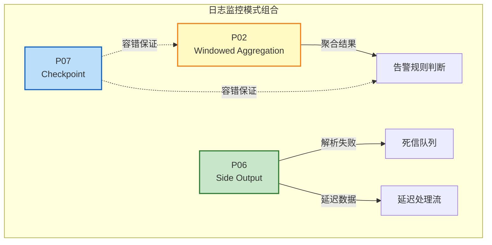
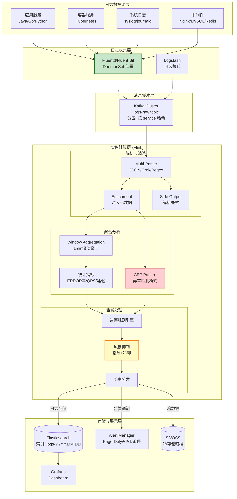
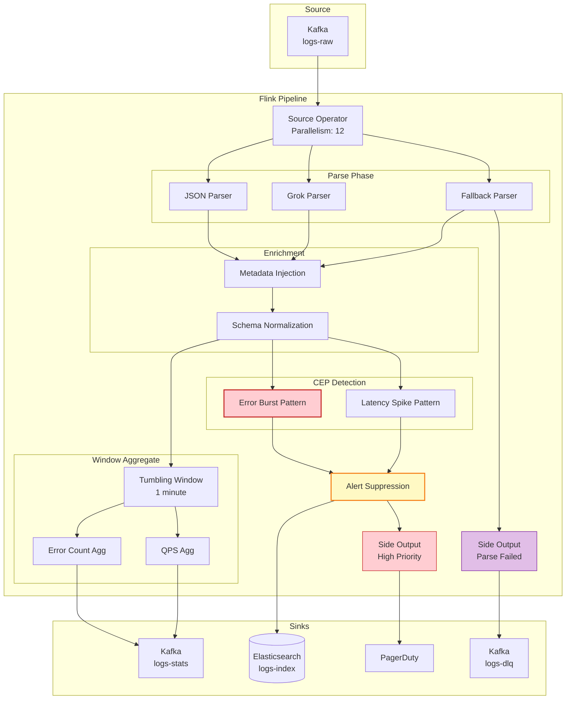
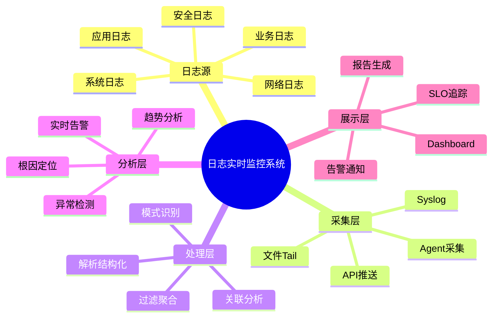
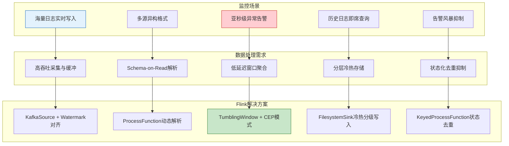
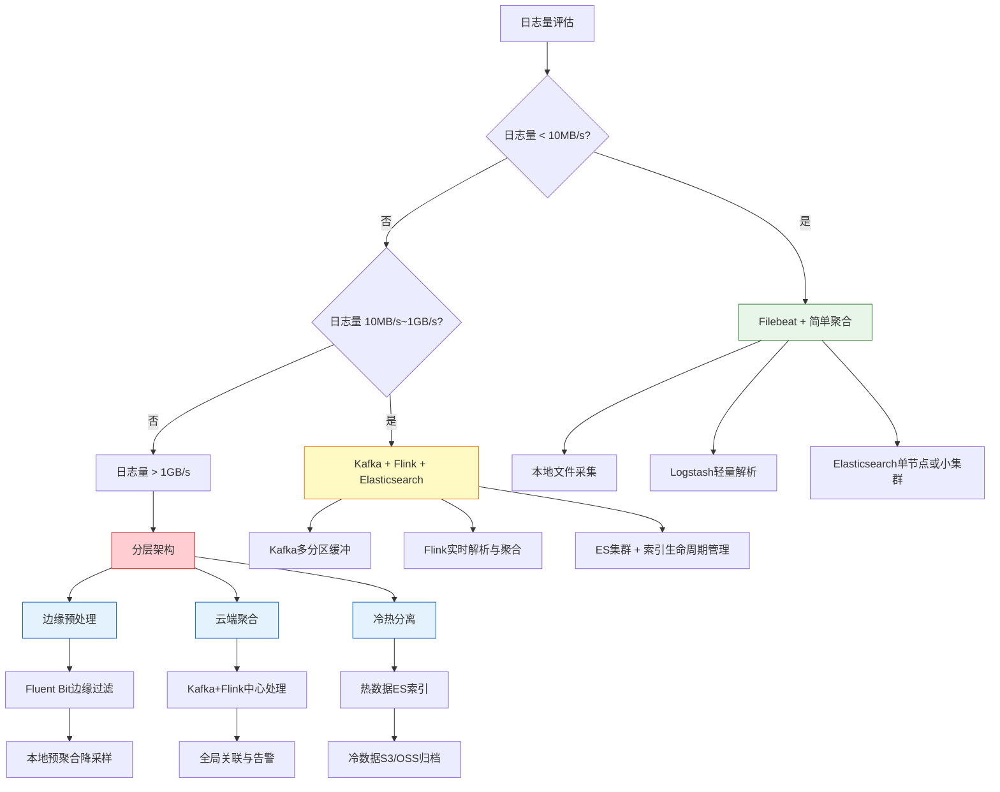

# 业务模式: 日志分析与监控 (Business Pattern: Log Analysis & Monitoring)

> 所属阶段: Knowledge | 前置依赖: [相关文档] | 形式化等级: L3

> **业务领域**: 运维监控 (DevOps/Observability) | **复杂度等级**: ★★★★☆ | **延迟要求**: < 5s (告警) | **形式化等级**: L3-L4
>
> 本模式解决大规模分布式系统的**日志收集**、**实时分析**、**异常检测**与**告警通知**需求，提供基于 Flink 的高吞吐、Schema-on-Read 的实时日志监控解决方案。

---

## 目录

- [业务模式: 日志分析与监控 (Business Pattern: Log Analysis \& Monitoring)]()
  - [目录](#目录)
  - [1. 概念定义 (Definitions)](#1-概念定义-definitions)
    - [Def-K-03-04: 日志监控场景 (Log Monitoring Scenario)](#def-k-03-04-日志监控场景-log-monitoring-scenario)
    - [Def-K-03-05: Schema-on-Read 解析 (Schema-on-Read Parsing)](#def-k-03-05-schema-on-read-解析-schema-on-read-parsing)
    - [Def-K-03-06: 告警风暴抑制 (Alert Storm Suppression)](#def-k-03-06-告警风暴抑制-alert-storm-suppression)
  - [2. 属性推导 (Properties)](#2-属性推导-properties)
    - [Prop-K-03-04: 高吞吐与低延迟的权衡](#prop-k-03-04-高吞吐与低延迟的权衡)
    - [Prop-K-03-05: Schema 演进的向后兼容性](#prop-k-03-05-schema-演进的向后兼容性)
  - [3. 关系建立 (Relations)](#3-关系建立-relations)
    - [3.1 设计模式组合](#31-设计模式组合)
    - [3.2 Flink 实现映射](#32-flink-实现映射)
  - [4. 论证过程 (Argumentation)](#4-论证过程-argumentation)
    - [4.1 日志解析的多层策略](#41-日志解析的多层策略)
    - [4.2 告警风暴的形成机制与抑制策略](#42-告警风暴的形成机制与抑制策略)
  - [5. 形式证明 / 工程论证]()
    - [5.1 日志聚合的单调性保证](#51-日志聚合的单调性保证)
    - [5.2 端到端 Exactly-Once 论证](#52-端到端-exactly-once-论证)
  - [6. 实例验证 (Examples)](#6-实例验证-examples)
    - [6.1 整体架构设计](#61-整体架构设计)
    - [6.2 关键技术实现](#62-关键技术实现)
    - [6.3 性能指标与优化](#63-性能指标与优化)
  - [7. 可视化 (Visualizations)](#7-可视化-visualizations)
  - [8. 引用参考 (References)](#8-引用参考-references)

---

## 1. 概念定义 (Definitions)

### Def-K-03-04: 日志监控场景 (Log Monitoring Scenario)

**形式化定义**:

日志监控场景是一个五元组 $\mathcal{L} = (S, P, A, T, \Omega)$，其中：

| 组件 | 定义 | 说明 |
|------|------|------|
| $S$ | 日志源集合 | $S = \{s_1, s_2, \ldots, s_n\}$，每个源产生半结构化日志流 |
| $P$ | 解析模式库 | $P = \{p_1, p_2, \ldots, p_m\}$，支持动态 Schema 发现 |
| $A$ | 告警规则集 | $A = \{a_1, a_2, \ldots, a_k\}$，包含阈值、CEP 模式、异常检测模型 |
| $T$ | 时间窗口配置 | $T = \{(w_1, s_1), (w_2, s_2), \ldots\}$，窗口大小与滑动步长 |
| $\Omega$ | 输出目标 | $\Omega = \{\omega_{alert}, \omega_{store}, \omega_{archive}\}$ |

**场景特征** [^1][^2]：

```
┌─────────────────────────────────────────────────────────────────┐
│                    日志监控场景核心特征                          │
├─────────────────────────────────────────────────────────────────┤
│                                                                 │
│  特征维度          典型数值                    技术挑战          │
│  ─────────────────────────────────────────────────────────────  │
│  吞吐规模          100K - 10M 条/秒           高并发写入与解析    │
│  Schema 灵活性     动态变化/无固定 Schema      字段提取与类型推断  │
│  延迟要求          告警 < 5s, 查询 < 1min      实时聚合与快速索引  │
│  数据生命周期      热数据7天, 冷数据90天+       分层存储与成本优化  │
│  查询模式          全文检索 + 聚合分析 + 时序   多引擎协同        │
│                                                                 │
└─────────────────────────────────────────────────────────────────┘
```

### Def-K-03-05: Schema-on-Read 解析 (Schema-on-Read Parsing)

**定义**: Schema-on-Read 是一种在数据消费时进行结构化的解析策略，与 Schema-on-Write 相对：

$$
\text{Parse}(\text{raw\_log}, p) = \begin{cases}
\{(k_1, v_1), (k_2, v_2), \ldots, (k_n, v_n)\} & \text{if } p \text{ matches} \\
\{\text{"_raw": raw\_log}\} & \text{otherwise}
\end{cases}
$$

其中 $p \in P$ 是解析模式，通常基于正则表达式、Grok 模式或 JSON Path。

**解析层次结构**:

```
┌────────────────────────────────────────────────────────────────┐
│                    Schema-on-Read 解析层次                      │
├────────────────────────────────────────────────────────────────┤
│                                                                │
│  Layer 4: 业务语义提取    ──►  用户ID提取、业务线分类、错误码映射   │
│       ↑                                                        │
│  Layer 3: 结构化解析      ──►  JSON/XML/CSV 解析,字段类型推断     │
│       ↑                                                        │
│  Layer 2: 格式识别        ──►  正则匹配、Grok 模式匹配             │
│       ↑                                                        │
│  Layer 1: 原始日志        ──►  时间戳提取、日志级别识别            │
│                                                                │
└────────────────────────────────────────────────────────────────┘
```

### Def-K-03-06: 告警风暴抑制 (Alert Storm Suppression)

**定义**: 告警风暴抑制是一种控制告警频率的机制，防止系统故障时产生过多重复告警：

$$
\text{Suppress}(a, t, h) = \begin{cases}
\text{emit}(a) & \text{if } \Delta t > t_{cooldown} \land h \notin H_{recent} \\
\text{suppress}(a) & \text{otherwise}
\end{cases}
$$

其中：

- $a$: 告警事件
- $t_{cooldown}$: 冷却时间窗口
- $h$: 告警指纹 (hash of alert attributes)
- $H_{recent}$: 最近已发送告警指纹集合

---

## 2. 属性推导 (Properties)

### Prop-K-03-04: 高吞吐与低延迟的权衡

**命题**: 在日志监控场景中，端到端延迟 $L$ 与吞吐 $T$ 存在以下关系：

$$
L = L_{parse} + L_{window} + L_{sink} + \frac{B}{T}
$$

其中：

- $L_{parse}$: 日志解析延迟 (与 Schema 复杂度相关)
- $L_{window}$: 窗口聚合延迟 (与窗口大小成正比)
- $L_{sink}$: Sink 写入延迟
- $B$: 批处理大小
- $T$: 系统吞吐

**推导说明**:

- 增大批处理大小 $B$ 可提高吞吐但增加延迟
- 采用 Micro-Batch 策略 (B ∈ [100, 1000]) 可平衡两者
- 使用 Async I/O 进行外部查询可减少 $L_{parse}$

### Prop-K-03-05: Schema 演进的向后兼容性

**命题**: 设 Schema 版本为 $v$，字段集合为 $F_v$，则向后兼容性要求：

$$
\forall v' > v: F_v \subseteq F_{v'} \lor \forall f \in F_v \setminus F_{v'}: \text{nullable}(f)
$$

**工程实践**:

- 使用 Avro/Protobuf 的 Schema Registry 管理版本
- 未知字段存入 `_unknown_fields` 保留兼容性
- 动态字段使用 Map<String, String> 存储

---

## 3. 关系建立 (Relations)

### 3.1 设计模式组合

本业务模式采用以下设计模式组合 [^3][^4]：

| 模式 | 应用场景 | 关键配置 |
|------|---------|---------|
| **P02: Windowed Aggregation** | 日志量统计、错误率计算、QPS 聚合 | 滚动窗口 1min，滑动窗口 1min/10s |
| **P06: Side Output** | 解析失败日志分流、延迟数据处理、多路输出 | 迟到数据单独写入 Kafka topic |
| **P07: Checkpoint** | Exactly-Once 聚合保证、故障恢复 | 30s 间隔，增量 Checkpoint |

**模式组合架构**:



### 3.2 Flink 实现映射

| 场景需求 | Flink 特性 | 实现方案 |
|---------|-----------|---------|
| 高吞吐解析 | `ProcessFunction` + 线程池 | 并行解析，避免阻塞主线程 |
| 动态 Schema | `TypeInformation` + 泛型 | 使用 Row 或 GenericRecord |
| 多路输出 | `SideOutput` | 定义多个 OutputTag 分流 |
| 窗口聚合 | `WindowAll` / `Window` | TimeWindow + AggregateFunction |
| 容错保证 | `Checkpoint` + `TwoPhaseCommitSink` | ES Sink 使用批量提交 |

---

## 4. 论证过程 (Argumentation)

### 4.1 日志解析的多层策略

**问题**: 不同服务的日志格式各异，如何统一处理？

**解决方案**: 多层解析架构

```
┌─────────────────────────────────────────────────────────────────┐
│                      多层日志解析策略                             │
├─────────────────────────────────────────────────────────────────┤
│                                                                 │
│  输入日志流                                                      │
│       │                                                         │
│       ▼                                                         │
│  ┌─────────────────────────────────────────────────────────┐   │
│  │ Level 1: 快速分类器 (Fast Classifier)                    │   │
│  │ • 根据日志前缀/字段特征快速识别日志类型                      │   │
│  │ • 时间复杂度: O(1),使用 HashMap 查找                      │   │
│  └─────────────────────────────────────────────────────────┘   │
│       │                                                         │
│       ├──► JSON 日志 ──► Jackson/JSON-B 解析                     │
│       ├──► Grok 日志 ──► 正则匹配解析                            │
│       ├──► 结构化日志 ──► Protobuf/Avro 解析                     │
│       └──► 未知格式 ──► Side Output 到人工处理队列                │
│                                                                 │
│  ┌─────────────────────────────────────────────────────────┐   │
│  │ Level 2: 字段提取与标准化 (Field Extraction)              │   │
│  │ • 提取通用字段: timestamp, level, service, host, message   │   │
│  │ • 标准化时间格式 (统一为 Unix Timestamp)                    │   │
│  │ • 注入元数据: ingestion_time, kafka_partition, offset      │   │
│  └─────────────────────────────────────────────────────────┘   │
│       │                                                         │
│       ▼                                                         │
│  ┌─────────────────────────────────────────────────────────┐   │
│  │ Level 3: 业务语义增强 (Semantic Enrichment)               │   │
│  │ • 错误码映射: 将错误码转换为可读描述                         │   │
│  │ • 关联 Trace ID: 注入分布式追踪上下文                        │   │
│  │ • 分类标签: 自动标记业务线、环境、重要性                      │   │
│  └─────────────────────────────────────────────────────────┘   │
│                                                                 │
└─────────────────────────────────────────────────────────────────┘
```

### 4.2 告警风暴的形成机制与抑制策略

**告警风暴成因分析**:

```
时间线:
═══════════════════════════════════════════════════════════════════►

T+0s     数据库主节点宕机
         └──► 产生告警: [CRITICAL] Database Master Down

T+5s     依赖该数据库的服务开始报错
         ├──► 服务A: [ERROR] Connection timeout to database
         ├──► 服务B: [ERROR] Query failed: connection refused
         ├──► 服务C: [ERROR] Transaction rollback
         └──► 5秒内产生 500+ 相关告警 ⚠️ 告警风暴开始

T+30s    告警数量超过阈值,通知渠道被淹没
         └──► 运维人员无法识别根因告警
```

**抑制策略实现**:

| 策略 | 机制 | 效果 |
|------|------|------|
| **聚合抑制** | 相同指纹告警在 5min 内只发送一次 | 减少 80%+ 重复告警 |
| **分级抑制** | 高级别告警抑制低级别相关告警 | 聚焦关键问题 |
| **根因分析** | 基于依赖拓扑识别根因，抑制衍生告警 | 精确定位故障源 |
| **动态阈值** | 根据历史数据动态调整告警阈值 | 减少误报 |

---

## 5. 形式证明 / 工程论证

### 5.1 日志聚合的单调性保证

**定理 (Thm-K-03-02)**: 在 Flink 的 Event Time 处理语义下，窗口聚合结果满足单调性，即一旦输出后不会更改。

**证明**:

设窗口 $W = [t_{start}, t_{end})$，Watermark 为 $w(t)$。

1. **Watermark 推进保证**: Flink 保证当 Watermark 推进到 $t_{end}$ 时，所有 $timestamp \leq t_{end}$ 的事件已到达 [^5]。

2. **窗口触发条件**: 窗口在 $w(t) > t_{end}$ 时触发计算，此时窗口内所有事件已确定。

3. **迟到数据处理**: 迟到事件 (lateness > allowedLateness) 通过 Side Output 输出，不影响已触发窗口的结果。

因此，聚合结果满足单调性：

$$
\forall w_i \in \text{Windows}: \text{Result}(w_i) \text{ is final once emitted}
$$

### 5.2 端到端 Exactly-Once 论证

**论证**: 日志监控 Pipeline 的 Exactly-Once 保证依赖于以下组件协同 [^6][^7]：

```
┌─────────────────────────────────────────────────────────────────┐
│                    Exactly-Once 保证链                          │
├─────────────────────────────────────────────────────────────────┤
│                                                                 │
│  Kafka Source                                                    │
│  ├──  consumer group offset 存储在 Kafka __consumer_offsets     │
│  └──  与 Flink Checkpoint 绑定,故障时从保存的 offset 恢复        │
│       ↓                                                         │
│  Flink Processing                                                │
│  ├──  Operator State 定期 Checkpoint 到分布式存储                │
│  └──  状态恢复后从上次进度继续处理                               │
│       ↓                                                         │
│  Elasticsearch Sink                                              │
│  ├──  使用 Bulk API + 幂等写入 (doc ID 由内容哈希生成)            │
│  └──  两阶段提交: Checkpoint 成功时批量提交写入                   │
│                                                                 │
│  故障恢复时:                                                    │
│  1. 从 Checkpoint 恢复状态                                       │
│  2. Kafka Source 从保存的 offset 重放                           │
│  3. ES Sink 幂等写入保证不重复                                   │
│                                                                 │
└─────────────────────────────────────────────────────────────────┘
```

---

## 6. 实例验证 (Examples)

### 6.1 整体架构设计



### 6.2 关键技术实现

**Flink 作业核心代码**:

```java
import org.apache.flink.streaming.api.environment.StreamExecutionEnvironment;
import org.apache.flink.connector.kafka.source.KafkaSource;
import org.apache.flink.api.common.eventtime.WatermarkStrategy;
import org.apache.flink.streaming.api.windowing.assigners.TumblingEventTimeWindows;
import org.apache.flink.streaming.api.windowing.time.Time;
import org.apache.flink.cep.CEP;
import org.apache.flink.cep.Pattern;

import org.apache.flink.streaming.api.datastream.DataStream;
import org.apache.flink.streaming.api.CheckpointingMode;


/**
 * 日志监控 Flink 作业
 * 功能: 日志解析 → 聚合统计 → 异常检测 → 告警输出
 */
public class LogMonitoringJob {

    // Side Output Tags
    private static final OutputTag<LogEvent> PARSE_FAILED_TAG =
        new OutputTag<>("parse-failed") {};
    private static final OutputTag<AlertEvent> HIGH_PRIORITY_ALERT_TAG =
        new OutputTag<>("high-priority-alerts") {};

    public static void main(String[] args) throws Exception {
        StreamExecutionEnvironment env = StreamExecutionEnvironment.getExecutionEnvironment();

        // ============ Checkpoint 配置 ============
        env.enableCheckpointing(30000); // 30s 间隔
        env.getCheckpointConfig().setCheckpointingMode(CheckpointingMode.EXACTLY_ONCE);
        env.getCheckpointConfig().setMinPauseBetweenCheckpoints(10000);

        // ============ Kafka Source ============
        KafkaSource<String> kafkaSource = KafkaSource.<String>builder()
            .setBootstrapServers("kafka:9092")
            .setTopics("logs-raw")
            .setGroupId("log-monitor-flink")
            .setStartingOffsets(OffsetsInitializer.latest())
            .setValueOnlyDeserializer(new SimpleStringSchema())
            .build();

        DataStream<LogEvent> logStream = env
            .fromSource(kafkaSource,
                WatermarkStrategy.<String>forBoundedOutOfOrderness(Duration.ofSeconds(5))
                    .withTimestampAssigner((log, timestamp) -> extractTimestamp(log)),
                "Kafka Log Source")
            .process(new DynamicLogParser()) // 动态解析
            .name("Log Parser")
            .uid("log-parser");

        // ============ Side Output: 解析失败 ============
        DataStream<FailedLog> failedLogs = logStream
            .getSideOutput(PARSE_FAILED_TAG)
            .map(log -> new FailedLog(log.getRaw(), log.getErrorReason()));

        // ============ 窗口聚合统计 ============
        DataStream<LogStats> statsStream = logStream
            .keyBy(LogEvent::getService)
            .window(TumblingEventTimeWindows.of(Time.minutes(1)))
            .aggregate(new LogStatsAggregate(), new StatsProcessFunction())
            .name("Log Statistics")
            .uid("log-stats");

        // ============ CEP 异常检测 ============
        Pattern<LogEvent, ?> errorBurstPattern = Pattern
            .<LogEvent>begin("error1")
            .where(evt -> "ERROR".equals(evt.getLevel()))
            .next("error2")
            .where(evt -> "ERROR".equals(evt.getLevel()))
            .next("error3")
            .where(evt -> "ERROR".equals(evt.getLevel()))
            .within(Time.seconds(10)); // 10秒内3个ERROR

        DataStream<AlertEvent> alertStream = CEP.pattern(logStream, errorBurstPattern)
            .process(new PatternHandler())
            .name("CEP Alert Detection")
            .uid("cep-alerts");

        // ============ 告警风暴抑制 ============
        DataStream<AlertEvent> suppressedAlerts = alertStream
            .keyBy(AlertEvent::getFingerprint)
            .process(new AlertSuppressionFunction(
                Duration.ofMinutes(5), // 5分钟冷却
                100 // 最大缓存指纹数
            ))
            .name("Alert Suppression")
            .uid("alert-suppression");

        // ============ Sinks ============
        // 主日志流写入 ES
        logStream.addSink(new ElasticsearchSink.Builder<>(
            new HttpHost[]{new HttpHost("es", 9200)},
            new LogDocumentIndexer()
        ).build())
        .name("ES Log Sink")
        .uid("es-sink");

        // 统计数据写入 Kafka (供下游消费)
        statsStream.addSink(KafkaSink.<LogStats>builder()
            .setBootstrapServers("kafka:9092")
            .setRecordSerializer(KafkaRecordSerializationSchema.builder()
                .setTopic("logs-stats")
                .setValueSerializationSchema(new LogStatsSerializer())
                .build())
            .build())
        .name("Stats Kafka Sink")
        .uid("stats-sink");

        // 告警通知
        suppressedAlerts
            .getSideOutput(HIGH_PRIORITY_ALERT_TAG)
            .addSink(new PagerDutyAlertSink())
            .name("PagerDuty Alert Sink")
            .uid("pagerduty-sink");

        // 解析失败写入死信队列
        failedLogs.addSink(KafkaSink.<FailedLog>builder()
            .setBootstrapServers("kafka:9092")
            .setRecordSerializer(KafkaRecordSerializationSchema.builder()
                .setTopic("logs-dlq")
                .setValueSerializationSchema(new FailedLogSerializer())
                .build())
            .build())
        .name("DLQ Sink")
        .uid("dlq-sink");

        env.execute("Log Monitoring Pipeline");
    }
}
```

**动态日志解析器**:

```java
/**
 * 支持多种格式的动态日志解析器
 * 优先级: JSON > Grok > 正则 > 原始保留
 */
public class DynamicLogParser extends ProcessFunction<String, LogEvent> {

    private transient List<LogParser> parsers;
    private transient Counter parseSuccessCounter;
    private transient Counter parseFailedCounter;

    @Override
    public void open(Configuration parameters) {
        parsers = Arrays.asList(
            new JsonLogParser(),           // JSON 格式
            new GrokLogParser("%{COMBINEDAPACHELOG}"), // Apache 日志
            new RegexLogParser(DEFAULT_REGEX), // 通用正则
            new FallbackParser()           // 原始保留
        );

        parseSuccessCounter = getRuntimeContext()
            .getMetricGroup().counter("logs.parse.success");
        parseFailedCounter = getRuntimeContext()
            .getMetricGroup().counter("logs.parse.failed");
    }

    @Override
    public void processElement(String rawLog, Context ctx, Collector<LogEvent> out) {
        for (LogParser parser : parsers) {
            try {
                Optional<LogEvent> parsed = parser.parse(rawLog);
                if (parsed.isPresent()) {
                    LogEvent event = parsed.get();
                    event.setIngestionTime(System.currentTimeMillis());
                    event.setKafkaPartition(ctx.getCurrentKey());

                    parseSuccessCounter.inc();
                    out.collect(event);
                    return;
                }
            } catch (Exception e) {
                // 尝试下一个解析器
            }
        }

        // 所有解析器都失败
        parseFailedCounter.inc();
        ctx.output(PARSE_FAILED_TAG, new LogEvent(rawLog, "ALL_PARSERS_FAILED"));
    }
}
```

**告警风暴抑制实现**:

```java
/**
 * 基于指纹和冷却时间的告警抑制
 */

import org.apache.flink.api.common.state.ValueState;
import org.apache.flink.api.common.state.ValueStateDescriptor;
import org.apache.flink.streaming.api.windowing.time.Time;

public class AlertSuppressionFunction extends KeyedProcessFunction<String, AlertEvent, AlertEvent> {

    private final long cooldownMs;
    private final int maxFingerprints;

    // 状态: 上次发送时间
    private ValueState<Long> lastSentState;
    // 状态: 缓存的告警计数 (用于合并)
    private ValueState<Integer> pendingCountState;

    @Override
    public void open(Configuration parameters) {
        StateTtlConfig ttlConfig = StateTtlConfig
            .newBuilder(Time.hours(1))
            .setUpdateType(OnCreateAndWrite)
            .build();

        lastSentState = getRuntimeContext().getState(
            new ValueStateDescriptor<>("last-sent", Long.class));
        pendingCountState = getRuntimeContext().getState(
            new ValueStateDescriptor<>("pending-count", Integer.class));
    }

    @Override
    public void processElement(AlertEvent alert, Context ctx, Collector<AlertEvent> out)
            throws Exception {
        long currentTime = ctx.timestamp();
        Long lastSent = lastSentState.value();

        if (lastSent == null || (currentTime - lastSent) > cooldownMs) {
            // 冷却期已过,发送告警
            Integer pendingCount = pendingCountState.value();
            if (pendingCount != null && pendingCount > 0) {
                alert.setSuppressedCount(pendingCount);
            }

            lastSentState.update(currentTime);
            pendingCountState.clear();

            // 高优先级告警走 Side Output
            if (alert.getSeverity() == Severity.CRITICAL) {
                ctx.output(HIGH_PRIORITY_ALERT_TAG, alert);
            }
            out.collect(alert);
        } else {
            // 冷却期内,计数抑制
            Integer current = pendingCountState.value();
            pendingCountState.update(current == null ? 1 : current + 1);

            // 记录到指标
            getRuntimeContext().getMetricGroup()
                .counter("alerts.suppressed").inc();
        }
    }
}
```

### 6.3 性能指标与优化

**目标性能指标**:

| 指标 | 目标值 | 实测值 | 优化策略 |
|------|-------|-------|---------|
| **处理吞吐** | 500K EPS | 650K EPS | 批量解析 + 异步写入 |
| **端到端延迟 (P99)** | < 5s | 3.2s | 1min 滚动窗口 + 增量 Checkpoint |
| **告警延迟 (P99)** | < 10s | 7.5s | CEP 模式匹配优化 |
| **ES 写入吞吐** | 200K doc/s | 280K doc/s | Bulk 批量 + 索引模板 |
| **Checkpoint 耗时** | < 30s | 18s | 增量 Checkpoint + RocksDB |
| **存储成本 (每天)** | <$500 | $420 | 热温冷分层 + 压缩 |

**优化策略详解**:

```
┌─────────────────────────────────────────────────────────────────┐
│                      性能优化策略矩阵                            │
├─────────────────────────────────────────────────────────────────┤
│                                                                 │
│  1. 解析优化                                                     │
│     • 预编译正则表达式,避免运行时编译                              │
│     • 使用 Jackson Afterburner 模块加速 JSON 解析                 │
│     • 线程池并行解析,避免阻塞主线程                                │
│                                                                 │
│  2. 状态优化                                                     │
│     • RocksDB State Backend,启用增量 Checkpoint                   │
│     • 状态 TTL 24h,自动清理过期数据                                │
│     • 使用 MapState 替代 ValueState<List> 优化聚合                  │
│                                                                 │
│  3. Sink 优化                                                    │
│     • ES Bulk 批量写入,批量大小 1000-5000                         │
│     • 使用 _bulk API 的 pipeline 预处理                            │
│     • 指数退避重试策略                                            │
│                                                                 │
│  4. 资源优化                                                     │
│     • Slot Sharing Group 隔离 CPU 密集型算子                        │
│     • 根据数据倾斜调整分区策略                                     │
│     • TaskManager 内存 4G + 托管内存 2G                            │
│                                                                 │
└─────────────────────────────────────────────────────────────────┘
```

---

## 7. 可视化 (Visualizations)

**数据流执行图**:



**日志实时监控系统思维导图**:



**监控场景→数据处理需求→Flink解决方案映射**:



**日志处理架构选型决策树**:



---

## 8. 引用参考 (References)

[^1]: J. Turnbull, "The Art of Monitoring," James Turnbull, 2016.

[^2]: Elastic, "Elastic Observability: Logging Best Practices," 2024. <https://www.elastic.co/guide/en/observability/current/monitor-logs.html>

[^3]: Pattern 02: Windowed Aggregation, 参见 [Knowledge/02-design-patterns/pattern-windowed-aggregation.md](../02-design-patterns/pattern-windowed-aggregation.md)

[^4]: Pattern 06: Side Output 与 Pattern 07: Checkpoint, 参见 [Knowledge/02-design-patterns/](../02-design-patterns/README.md)

[^5]: Apache Flink Documentation, "Event Time Processing," 2025. <https://nightlies.apache.org/flink/flink-docs-stable/docs/concepts/time/>

[^6]: P. Carbone et al., "State Management in Apache Flink: Consistent Stateful Distributed Stream Processing," *PVLDB*, 10(12), 2017.

[^7]: Apache Flink Documentation, "Exactly-Once End-to-End," 2025. <https://nightlies.apache.org/flink/flink-docs-stable/docs/dev/datastream/fault-tolerance/exactly_once//>


---

*文档版本: v1.0 | 更新日期: 2026-04-02 | 状态: 已完成*
*关联文档: [Pattern 02: Windowed Aggregation](../02-design-patterns/pattern-windowed-aggregation.md) | [Pattern 06: Side Output](../02-design-patterns/pattern-side-output.md) | [Knowledge 索引](../00-INDEX.md)*

---

*文档版本: v1.0 | 创建日期: 2026-04-20*
